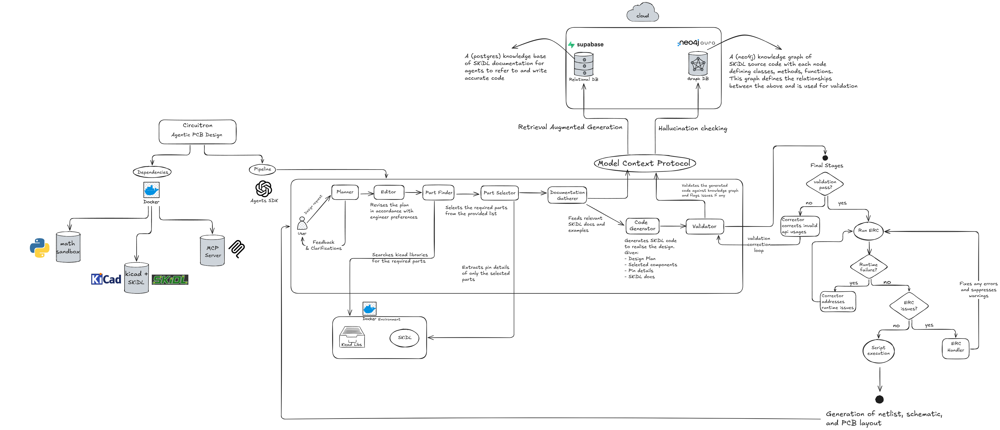
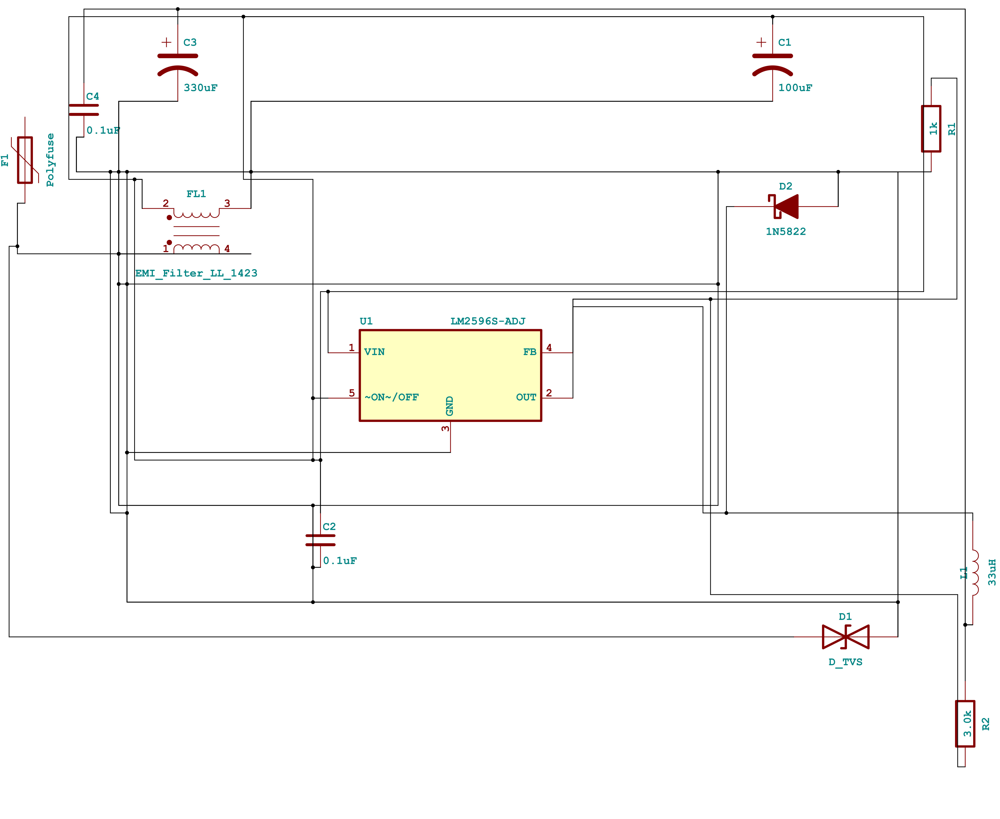

# Circuitron

Circuitron is an agent-driven PCB design accelerator that converts natural language requirements into SKiDL scripts, KiCad schematics, and PCB layout files. It integrates a multi-agent pipeline with advanced reasoning and retrieval-augmented capabilities.

---


---

## Features

- **Reasoning-driven workflow** – OpenAI Agents coordinate planning, part discovery, code generation, validation, and error correction with transparent chain-of-thought output.
- **Retrieval-Augmented Generation (RAG)** – A dedicated MCP (Model Context Protocol) server surfaces relevant SKiDL documentation and examples to the LLM for every design step.
- **Real part selection** – Queries KiCad libraries to ensure chosen components exist and match the design specification.
- **Automatic schematic and PCB generation** – Produces `.sch` and `.kicad_pcb` files alongside netlists (and SVG images of schematics) for direct use in KiCad.
- **Iterative correction loop** – Agents validate generated code, apply fixes, and run ERC checks until a clean design is produced.
- **Containerized toolchain** – Uses Docker images for KiCad, the MCP server, and the Python execution environment to guarantee repeatable results.

## Architecture Overview

Circuitron orchestrates several specialized agents using the OpenAI Agents SDK. A planning agent first interprets the user prompt and proposes a stepwise design plan. That plan can be edited by the user before execution. Subsequent agents handle part discovery and selection, gather SKiDL documentation via the MCP server, generate code, validate it, and resolve any errors. Output files are produced in native KiCad formats so that engineers can review and finalize designs using their usual toolchain.
The pipeline uses dedicated agents for each design step:
1. **Planner** – break down the prompt into design tasks.
2. **Plan editor** – incorporate user feedback.
3. **Part finder** – search KiCad libraries for components.
4. **Part selector** – choose optimal parts.
5. **Documentation agent** – fetch SKiDL references via the MCP server.
6. **Code generator** – write SKiDL code based on the plan and documentation.
7. **Validator and corrector** – detect issues, use the knowledge graph, and fix problems.
8. **Runtime correction** – ensure the script executes correctly.
9. **ERC handler** – resolve electrical rule check warnings.
10. **Execution step** – output schematic, netlist, PCB file, and an SVG preview.


The MCP server provides RAG capabilities and knowledge graph lookups. It requires a Supabase database and a Neo4j instance for storing crawled documentation and a knowledge graph of the SKiDL source code (for validating generated code). Circuitron communicates with this server during every run to retrieve accurate SKiDL references and to perform hallucination checks.

## Architecture Diagram

<p align="center">
  
</p>

## Prerequisites

Before installing Circuitron ensure the following tools and accounts are available:

- **Python 3.10+** – Circuitron is developed with Python 3.12, but it should work with Python 3.10+.
- **Node.js and npm** – Required for installing the netlistsvg package.
- **Docker** with permission to run containers
- **OpenAI API access** – obtain an API key from [OpenAI account settings](https://help.openai.com/en/articles/4936850-where-do-i-find-my-openai-api-key)
- **Pydantic Logfire** - Sign up (For free) and obtain an access token from [Pydantic Logfire](https://logfire.pydantic.dev/)
- **Supabase account** – used by the MCP server for storing crawled pages - Sign up [Here](https://supabase.com/)
- **Neo4j database** – free instances are available from [AuraDB](https://neo4j.com/cloud/platform/aura-graph-database/) or you can install it locally as well from [here](https://neo4j.com/download/)

> **Note:** Make sure that your OpenAI Account is topped up with some credits. Additionally, ensure that you finish [organization verification](https://help.openai.com/en/articles/10910291-api-organization-verification) to enable the utilization of OpenAI's reasoning models.

## Installation

Clone the repository and install the package in editable mode so the CLI and tests use the local sources:

```bash
pip install -e .  # or `pip install .`
```

Install the required Node.js package:

```bash
npm install https://github.com/nturley/netlistsvg
```

This installs `openai-agents`, `python-dotenv`, `skidl`, `rich`, and `logfire`. Tracing with Pydantic Logfire is now enabled by default; no extra install flags are required. A `requirements.txt` mirroring `pyproject.toml` is included for convenience.

## Setup

> **Note:** For more detailed set up instructions, please follow the [Detailed Setup Guide](SETUP.md) to get the dependencies for Circuitron up and running.

1. **Pull required Docker images**

   ```bash
   docker pull ghcr.io/shaurya-sethi/circuitron-kicad:latest
   docker pull ghcr.io/shaurya-sethi/circuitron-mcp:latest
   docker pull python:3.12-slim
   ```

2. **Create a `.env` file**

   Copy `.env.example` to `.env` and set at least `OPENAI_API_KEY`.
   This file lives in the project root and is loaded by the CLI.
   You may also override `MCP_URL` and `KICAD_IMAGE` here.

3. **Create `mcp.env` for the MCP server**

   Prepare a separate file (for example `mcp.env`) with these variables:

   ```
   TRANSPORT=sse
   HOST=0.0.0.0
   PORT=8051
   OPENAI_API_KEY=<your OpenAI API key>
   MODEL_CHOICE=gpt-4.1-nano
   USE_CONTEXTUAL_EMBEDDINGS=true
   USE_HYBRID_SEARCH=true
   USE_AGENTIC_RAG=true
   USE_RERANKING=true
   USE_KNOWLEDGE_GRAPH=true
   LLM_MAX_CONCURRENCY=2
   LLM_REQUEST_DELAY=0.5
   SUPABASE_URL=<your Supabase project URL>
   SUPABASE_SERVICE_KEY=<your Supabase service_role key>
   NEO4J_URI=<your AuraDB Neo4j URI>
   NEO4J_USER=<your Neo4j username>
   NEO4J_PASSWORD=<your Neo4j password>
   ```

4. **Run the MCP server**

   Start the MCP container with the variables from `mcp.env`:

   ```bash
   docker run --env-file mcp.env -p 8051:8051 ghcr.io/shaurya-sethi/circuitron-mcp:latest
   ```

   Only the MCP server requires this configuration step. The other images are used automatically by Circuitron.


5. **Prepare the MCP database**

   - Use your AuraDB connection details for the Neo4j variables in the `.env` file.
   - After creating the Supabase project and obtaining the URL and service key, open the **SQL Editor** in the Supabase dashboard and execute the schema found in `setup_supabase.sql`. This creates the tables needed by the MCP server.

6. **Populate the knowledge base**

Quickstart (recommended): once your MCP server is configured and running, initialize the knowledge bases directly from the CLI:

```bash
circuitron setup
```

This runs a one-time, idempotent initialization that crawls SKiDL docs and parses the SKiDL repository using the MCP server tools. You can also run it interactively in the UI with the `/setup` command.
> **Note:** Ensure that you have followed steps 1-5 in the [Detailed Setup Guide](SETUP.md) first.

Alternatively: 
   With the MCP server running, configure your coding agent (for example GitHub Copilot) to use the server:

   - Select **Configure Tools → Add More Tools… → Add MCP Server → HTTP** and enter the URL `http://localhost:8051/sse`.
   - Instruct the agent to crawl `https://devbisme.github.io/skidl/` to build the SKiDL documentation corpus.
   - Next, instruct it to parse the GitHub repository `https://github.com/devbisme/skidl` to populate the knowledge graph.

   After these steps the MCP server will be ready to answer documentation queries and perform hallucination detection for Circuitron runs.


## Model Selection: `/model` Command

Circuitron now supports interactive model switching via the `/model` command in the CLI. This allows you to select which OpenAI model is used by all the agents in the Circuitron ecosystem.

- **Default model:** `o4-mini`
- **Recommended model:** `gpt-5-mini` (released August 7, 2025)
  - **Why:** According to OpenAI and my initial light testing, `gpt-5-mini` is both cheaper and better at agentic, multi-step workflows than `o4-mini`.
  - **How to switch:** Type `/model` in the interactive CLI and follow the prompts to select `gpt-5-mini`.
- **Other Models**: `o3-pro`, `o3`, `gpt-5`, `gpt-5-nano`, `gpt-4.1`

> **Note:** Model selection is session-based by default. Consider switching to `gpt-5-mini` for improved cost efficiency, especially for complex or iterative design tasks.

---

## Usage

Once the MCP server is running and the Docker images are available, you can generate designs directly from the command line. The CLI verifies that the KiCad container starts successfully before processing a prompt.

> **Important Prerequisites:**
> - **Neo4j Database:** Always ensure your Neo4j instance is up and running before using Circuitron. If Neo4j is not available, Circuitron will experience silent failures and be unable to validate generated code due to MCP tools being unavailable.
> - **Supabase Knowledge Base:** On the free tier, Supabase projects get paused after a few days of inactivity. If you're returning to Circuitron after a few days, make sure your Supabase project is not paused and resume it if necessary.
> - **MCP Server Preflight Checks:** Circuitron automatically detects if the MCP server is not running and will notify you to start it before proceeding.

Interactive mode:
```bash
circuitron
```
Other options:

```bash
circuitron "Design a voltage divider"
```

During development you can enable extra debug/verbose output (tracing is always on):

```bash
circuitron --dev "Design a voltage divider"

> Note: `--dev` no longer controls tracing. Tracing via Logfire is always enabled. `--dev` only increases verbosity and shows additional debug panels.
```

The `--output-dir` option saves all generated files to a specific location. By default results are written to `./circuitron_output`.

The `--keep-skidl` option saves the generated SKiDL script code to the output directory as `circuitron_skidl_script.py`. This is useful for debugging, education, and understanding how the circuit design was generated:

```bash
circuitron --keep-skidl "Design a voltage divider"
```

> **Note:**
> It is currently recommended to use the `--no-footprint-search` flag to disable footprint searches. This ensures that SVG images and netlists are reliably generated. Not using this flag may lead to unstable behavior: sometimes the agent finds actual footprints and generates PCB layouts, but other times the pipeline fails due to hallucinated footprint names.

### Cost Estimation and Pricing

Circuitron estimates cost using token totals and model pricing. It works out of the box:

- Built-in defaults are provided in `circuitron/model_prices_builtin.py` (USD per 1,000,000 tokens)
- You can override pricing by creating `circuitron/_model_prices_local.py` with `PRICES = { ... }`
- Or set an environment JSON file via `CIRCUITRON_PRICES_FILE=/absolute/path/prices.json`

Disable built-in defaults (useful for tests) with `CIRCUITRON_DISABLE_BUILTIN_PRICES=1`.

The summary banner uses either a per-model breakdown or, if unavailable, the currently selected model’s rates to compute the overall estimate.

> **Note:** The cost estimates are very pessimistic — due to not accounting for cache hits, and the optional data sharing benefits. The actual costs are usually much lesser — you can view the actual cost on the official openai platform -> billing.

## Examples

Here is an example design prompt and the corresponding outputs generated by Circuitron.

**Design Query:**
```
Design a 12V to 5V buck converter using LM2596.
```

**Generated SKiDL Code:**
```python
from skidl import *

# Buck Converter Schematic: LM2596 5V/3A Output
# Implements input filtering, LM2596 switcher, output filter, feedback divider.

# === DESIGN PARAMETERS ===
# Input cap: 100uF/25V electrolytic, 1uF ceramic
# Output cap: 100uF/16V electrolytic, 1uF ceramic
# Inductor: 47uH, ≥3A (low DCR)
# Diode: Schottky ≥3A, Vf <0.5V
# Feedback: R1=1k, R2=3.06k (sets 5V out)

# === POWER RAIL SETUP ===
vin = Net('VIN')      # Input voltage rail (e.g. 12V)
vout = Net('VOUT')    # Output voltage rail (5V)
gnd = Net('GND')      # Ground
sw = Net('SW')        # Switching node
fb = Net('FB')        # Feedback

vin.drive = POWER
gnd.drive = POWER
gnd.do_erc = False  # suppress GND warnings

# === COMPONENT INSTANTIATION ===
lm2596 = Part('Regulator_Switching', 'LM2596T-5', footprint='Regulator_Switching.pretty:LM2596T-5')
l1      = Part('Device', 'L',         value='47uH', footprint='Inductor_SMD.pretty:L_7447709470')
d1      = Part('Device', 'D_Schottky', value='3A/40V', footprint='Diode_SMD.pretty:D_SMB')
cin     = Part('Device', 'CP',        value='100uF/25V', footprint='Capacitor_SMD.pretty:CP_Elec_10x10.2')
cout    = Part('Device', 'CP',        value='100uF/16V', footprint='Capacitor_SMD.pretty:CP_Elec_8x6.2')
cin_s   = Part('Device', 'C',         value='1uF',     footprint='Capacitor_SMD.pretty:C_0805_2012Metric')
cout_s  = Part('Device', 'C',         value='1uF',     footprint='Capacitor_SMD.pretty:C_0805_2012Metric')
fb_r1   = Part('Device', 'R',         value='1k',      footprint='Resistor_SMD.pretty:R_0805_2012Metric')
fb_r2   = Part('Device', 'R',         value='3.06k',   footprint='Resistor_SMD.pretty:R_0805_2012Metric')

# === SIGNAL CONNECTIONS ===
# Input Filtering
vin  += cin[1], cin_s[1], lm2596['VIN']
gnd  += cin[2], cin_s[2], lm2596['GND']

# Switch‐node: connect regulator switch pin, inductor, and diode cathode
sw   += lm2596['OUT'], l1[1], d1['K']
# Output Filtering
l1[2] += vout
vout  += cout[1], cout_s[1]
gnd   += cout[2], cout_s[2]
# Freewheeling Diode
d1['A'] += vout

# Feedback Divider
vout        += fb_r2[1]
fb_r2[2]    += fb_r1[1]
fb_r1[2]    += gnd
fb          += fb_r2[2], lm2596['FB']

# ON/OFF: tie high for always-on operation
lm2596[5]   += vin

# ERC and netlist generation
ERC()
generate_netlist()
generate_svg("schematic.svg")
generate_pcb()
generate_schematic()
```

**Schematic Preview:**
<p align="center">
  
</p>

**Netlist:**
```netlist
(export (version D)
  (design
    (source "/tmp/script.py")
    (date "07/13/2025 12:09 PM")
    (tool "SKiDL (2.0.1)"))
  (components
    (comp (ref "C1")
      (value "≥47uF Low ESR")
      (footprint "Capacitor_SMD.pretty:C_1206_3216Metric")
      (fields
        (field (name "F0") "C")
        (field (name "F1") "C_Small")
        (field (name "F2") "")
        (field (name "F3") ""))
      (libsource (lib Device) (part "C_Small"))
      (sheetpath (names "/top/15932017899042748257") (tstamps "/top/15932017899042748257")))
    (comp (ref "C2")
      (value "≥22uF Low ESR")
      (footprint "Capacitor_SMD.pretty:C_1206_3216Metric")
      (fields
        (field (name "F0") "C")
        (field (name "F1") "C_Small")
        (field (name "F2") "")
        (field (name "F3") ""))
      (libsource (lib Device) (part "C_Small"))
      (sheetpath (names "/top/15338351527968886978") (tstamps "/top/15338351527968886978")))
    (comp (ref "D1")
      (value "D_TVS")
      (footprint "Diode_SMD.pretty:D_SMB")
      (fields
        (field (name "F0") "D")
        (field (name "F1") "D_TVS")
        (field (name "F2") "")
        (field (name "F3") ""))
      (libsource (lib Device) (part "D_TVS"))
      (sheetpath (names "/top/6095673316598153599") (tstamps "/top/6095673316598153599")))
    (comp (ref "D2")
      (value "D_Schottky_ALT")
      (footprint "Diode_SMD.pretty:D_SMB")
      (fields
        (field (name "F0") "D")
        (field (name "F1") "D_Schottky_ALT")
        (field (name "F2") "")
        (field (name "F3") ""))
      (libsource (lib Device) (part "D_Schottky_ALT"))
      (sheetpath (names "/top/16991163857686511337") (tstamps "/top/16991163857686511337")))
    (comp (ref "F1")
      (value "Polyfuse")
      (footprint "Fuse_SMD.pretty:Fuse_1206")
      (fields
        (field (name "F0") "F")
        (field (name "F1") "Polyfuse")
        (field (name "F2") "")
        (field (name "F3") ""))
      (libsource (lib Device) (part "Polyfuse"))
      (sheetpath (names "/top/15018806346818379241") (tstamps "/top/15018806346818379241")))
    (comp (ref "L1")
      (value "16–22uH (>3A)")
      (footprint "Inductor_SMD:L_7447709150_15x15mm")
      (fields
        (field (name "F0") "L")
        (field (name "F1") "L")
        (field (name "F2") "")
        (field (name "F3") ""))
      (libsource (lib Device) (part "L"))
      (sheetpath (names "/top/16079006241272707491") (tstamps "/top/16079006241272707491")))
    (comp (ref "R1")
      (value "3.3k")
      (footprint "Resistor_SMD.pretty:R_0805_2012Metric")
      (fields
        (field (name "F0") "R")
        (field (name "F1") "R_Small")
        (field (name "F2") "")
        (field (name "F3") ""))
      (libsource (lib Device) (part "R_Small"))
      (sheetpath (names "/top/15407985536011036819") (tstamps "/top/15407985536011036819")))
    (comp (ref "R2")
      (value "1k")
      (footprint "Resistor_SMD.pretty:R_0805_2012Metric")
      (fields
        (field (name "F0") "R")
        (field (name "F1") "R_Small")
        (field (name "F2") "")
        (field (name "F3") ""))
      (libsource (lib Device) (part "R_Small"))
      (sheetpath (names "/top/8277136248109518559") (tstamps "/top/8277136248109518559")))
    (comp (ref "R3")
      (value "10k")
      (footprint "Resistor_SMD.pretty:R_0805_2012Metric")
      (fields
        (field (name "F0") "R")
        (field (name "F1") "R_Small")
        (field (name "F2") "")
        (field (name "F3") ""))
      (libsource (lib Device) (part "R_Small"))
      (sheetpath (names "/top/10362834678797816183") (tstamps "/top/10362834678797816183")))
    (comp (ref "U1")
      (value "LM2596T-5")
      (footprint "Package_TO_SOT_THT:TO-220-5_TabPin2")
      (fields
        (field (name "F0") "U")
        (field (name "F1") "LM2596T-5")
        (field (name "F2") "Package_TO_SOT_THT:TO-220-5_P3.4x3.7mm_StaggerOdd_Lead3.8mm_Vertical")
        (field (name "F3") ""))
      (libsource (lib Regulator_Switching) (part "LM2596T-5"))
      (sheetpath (names "/top/15160217290251299618") (tstamps "/top/15160217290251299618"))))
  (nets
    (net (code 1) (name "FB")
      (node (ref "R1") (pin "2"))
      (node (ref "R2") (pin "1"))
      (node (ref "U1") (pin "4")))
    (net (code 2) (name "GND")
      (node (ref "C1") (pin "2"))
      (node (ref "C2") (pin "2"))
      (node (ref "R2") (pin "2"))
      (node (ref "U1") (pin "3")))
    (net (code 3) (name "N$1")
      (node (ref "D1") (pin "1"))
      (node (ref "F1") (pin "2")))
    (net (code 4) (name "N$2")
      (node (ref "C1") (pin "1"))
      (node (ref "D1") (pin "2"))
      (node (ref "U1") (pin "1")))
    (net (code 5) (name "N$3")
      (node (ref "D2") (pin "2"))
      (node (ref "L1") (pin "2")))
    (net (code 6) (name "ONOFF")
      (node (ref "R3") (pin "2"))
      (node (ref "U1") (pin "5")))
    (net (code 7) (name "SWITCH")
      (node (ref "L1") (pin "1"))
      (node (ref "U1") (pin "2")))
    (net (code 8) (name "VIN")
      (node (ref "F1") (pin "1"))
      (node (ref "R3") (pin "1")))
    (net (code 9) (name "VOUT")
      (node (ref "C2") (pin "1"))
      (node (ref "D2") (pin "1"))
      (node (ref "R1") (pin "1"))))
)
```

---

## Running Tests

```bash
pytest -q
```

All tests should pass after installation and setup.

## Configuration

Environment variables control most aspects of Circuitron. Required variables are loaded from `.env` when the CLI starts. The following optional overrides are available:

- `CALC_IMAGE` – Docker image used for executing Python calculations (defaults to `python:3.12-slim`).
- `KICAD_IMAGE` – KiCad container image (defaults to `ghcr.io/shaurya-sethi/circuitron-kicad:latest`).
- `MCP_URL` – Endpoint for the MCP server (`http://localhost:8051` by default).

Update these variables in your environment or in the `.env` file to customise behaviour.

## Troubleshooting

- **MCP server not reachable** – ensure the container was started with the correct `.env` file and that port 8051 is open.
- **KiCad container fails to start** – pull the image again with `docker pull ghcr.io/shaurya-sethi/circuitron-kicad:latest` and verify Docker is running.
- **Missing environment variables** – the CLI exits with an error if `OPENAI_API_KEY` or `MCP_URL` are not set. Check your `.env` configuration.

## Support and Contributing

Contributions are welcome. Please open issues or pull requests on the repository if you encounter problems or have suggestions. Refer to `AGENTS.md` for coding guidelines and `overview.md` for additional background on the architecture.

## License

This project is licensed under the MIT License.
