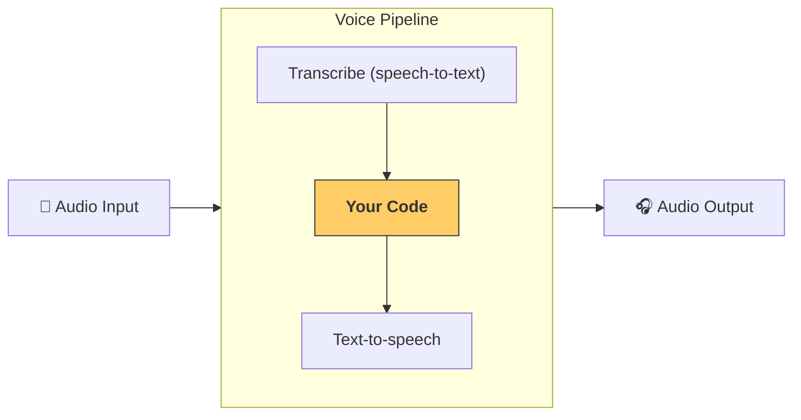

# OpenAI Agents Python - Comprehensive Knowledge Base

**Generated on:** 2025-06-28 20:06:38
**Repository:** https://github.com/openai/openai-agents-python
**Total Files:** 361
**Total Size:** 1.4 MB

This knowledge base contains comprehensive information about the OpenAI Agents Python library,
including all source code, documentation, configuration files, and examples.

## Table of Contents

- [Core Documentation](#core-documentation)
  - [.github/ISSUE_TEMPLATE/bug_report.md](#-github-ISSUE_TEMPLATE-bug_report-md)
  - [.github/ISSUE_TEMPLATE/feature_request.md](#-github-ISSUE_TEMPLATE-feature_request-md)
  - [.github/ISSUE_TEMPLATE/model_provider.md](#-github-ISSUE_TEMPLATE-model_provider-md)
  - [.github/ISSUE_TEMPLATE/question.md](#-github-ISSUE_TEMPLATE-question-md)
  - [.github/PULL_REQUEST_TEMPLATE/pull_request_template.md](#-github-PULL_REQUEST_TEMPLATE-pull_request_template-md)
  - ... and 108 more files
- [Python Source Code](#python-source-code)
  - [docs/scripts/translate_docs.py](#docs-scripts-translate_docs-py)
  - [src/agents/__init__.py](#src-agents-__init__-py)
  - [src/agents/_config.py](#src-agents-_config-py)
  - [src/agents/_debug.py](#src-agents-_debug-py)
  - [src/agents/_run_impl.py](#src-agents-_run_impl-py)
  - ... and 77 more files
- [Tests](#tests)
  - [tests/__init__.py](#tests-__init__-py)
  - [tests/conftest.py](#tests-conftest-py)
  - [tests/fake_model.py](#tests-fake_model-py)
  - [tests/fastapi/__init__.py](#tests-fastapi-__init__-py)
  - [tests/fastapi/streaming_app.py](#tests-fastapi-streaming_app-py)
  - ... and 75 more files
- [Examples](#examples)
  - [examples/__init__.py](#examples-__init__-py)
  - [examples/agent_patterns/agents_as_tools.py](#examples-agent_patterns-agents_as_tools-py)
  - [examples/agent_patterns/deterministic.py](#examples-agent_patterns-deterministic-py)
  - [examples/agent_patterns/forcing_tool_use.py](#examples-agent_patterns-forcing_tool_use-py)
  - [examples/agent_patterns/input_guardrails.py](#examples-agent_patterns-input_guardrails-py)
  - ... and 68 more files
- [Configuration Files](#configuration-files)
  - [.github/workflows/docs.yml](#-github-workflows-docs-yml)
  - [.github/workflows/issues.yml](#-github-workflows-issues-yml)
  - [.github/workflows/publish.yml](#-github-workflows-publish-yml)
  - [.github/workflows/tests.yml](#-github-workflows-tests-yml)
  - [.vscode/settings.json](#-vscode-settings-json)
  - ... and 2 more files
- [Other Files](#other-files)
  - [LICENSE](#LICENSE)
  - [examples/mcp/filesystem_example/sample_files/favorite_books.txt](#examples-mcp-filesystem_example-sample_files-favorite_books-txt)
  - [examples/mcp/filesystem_example/sample_files/favorite_cities.txt](#examples-mcp-filesystem_example-sample_files-favorite_cities-txt)
  - [examples/mcp/filesystem_example/sample_files/favorite_songs.txt](#examples-mcp-filesystem_example-sample_files-favorite_songs-txt)
  - [examples/research_bot/sample_outputs/product_recs.txt](#examples-research_bot-sample_outputs-product_recs-txt)
  - ... and 1 more files

---

## Core Documentation

This section contains 113 files related to core documentation.

### .github/ISSUE_TEMPLATE/bug_report.md {#-github-ISSUE_TEMPLATE-bug_report-md}

**File Type:** Markdown
**Size:** 643.0 B
**Description:** Markdown documentation file

#### Content:

---
name: Bug report
about: Report a bug
title: ''
labels: bug
assignees: ''

---

### Please read this first

- **Have you read the docs?**[Agents SDK docs](https://openai.github.io/openai-agents-python/)
- **Have you searched for related issues?** Others may have faced similar issues.

### Describe the bug
A clear and concise description of what the bug is.

### Debug information
- Agents SDK version: (e.g. `v0.0.3`)
- Python version (e.g. Python 3.10)

### Repro steps

Ideally provide a minimal python script that can be run to reproduce the bug.


### Expected behavior
A clear and concise description of what you expected to happen.

---

### .github/ISSUE_TEMPLATE/feature_request.md {#-github-ISSUE_TEMPLATE-feature_request-md}

**File Type:** Markdown
**Size:** 453.0 B
**Description:** Markdown documentation file

#### Content:

---
name: Feature request
about: Suggest an idea for this project
title: ''
labels: enhancement
assignees: ''

---

### Please read this first

- **Have you read the docs?**[Agents SDK docs](https://openai.github.io/openai-agents-python/)
- **Have you searched for related issues?** Others may have had similar requests

### Describe the feature
What is the feature you're requesting? How would it work? Please provide examples and details if possible.

---

### .github/ISSUE_TEMPLATE/model_provider.md {#-github-ISSUE_TEMPLATE-model_provider-md}

**File Type:** Markdown
**Size:** 806.0 B
**Description:** Markdown documentation file

#### Content:

---
name: Custom model providers
about: Questions or bugs about using non-OpenAI models
title: ''
labels: bug
assignees: ''

---

### Please read this first

- **Have you read the custom model provider docs, including the 'Common issues' section?** [Model provider docs](https://openai.github.io/openai-agents-python/models/#using-other-llm-providers)
- **Have you searched for related issues?** Others may have faced similar issues.

### Describe the question
A clear and concise description of what the question or bug is.

### Debug information
- Agents SDK version: (e.g. `v0.0.3`)
- Python version (e.g. Python 3.10)

### Repro steps
Ideally provide a minimal python script that can be run to reproduce the issue.

### Expected behavior
A clear and concise description of what you expected to happen.

---

### .github/ISSUE_TEMPLATE/question.md {#-github-ISSUE_TEMPLATE-question-md}

**File Type:** Markdown
**Size:** 369.0 B
**Description:** Markdown documentation file

#### Content:

---
name: Question
about: Questions about the SDK
title: ''
labels: question
assignees: ''

---

### Please read this first

- **Have you read the docs?**[Agents SDK docs](https://openai.github.io/openai-agents-python/)
- **Have you searched for related issues?** Others may have had similar requests

### Question
Describe your question. Provide details if available.

---

### .github/PULL_REQUEST_TEMPLATE/pull_request_template.md {#-github-PULL_REQUEST_TEMPLATE-pull_request_template-md}

**File Type:** Markdown
**Size:** 392.0 B
**Description:** Markdown documentation file

#### Content:

### Summary

<!-- Please give a short summary of the change and the problem this solves. -->

### Test plan

<!-- Please explain how this was tested -->

### Issue number

<!-- For example: "Closes #1234" -->

### Checks

- [ ] I've added new tests (if relevant)
- [ ] I've added/updated the relevant documentation
- [ ] I've run `make lint` and `make format`
- [ ] I've made sure tests pass

---

### AGENTS.md {#AGENTS-md}

**File Type:** Markdown
**Size:** 2.1 KB
**Description:** Markdown documentation file

#### Content:

Welcome to the OpenAI Agents SDK repository. This file contains the main points for new contributors.

## Repository overview

- **Source code**: `src/agents/` contains the implementation.
- **Tests**: `tests/` with a short guide in `tests/README.md`.
- **Examples**: under `examples/`.
- **Documentation**: markdown pages live in `docs/` with `mkdocs.yml` controlling the site.
- **Utilities**: developer commands are defined in the `Makefile`.
- **PR template**: `.github/PULL_REQUEST_TEMPLATE/pull_request_template.md` describes the information every PR must include.

## Local workflow

1. Format, lint and type‑check your changes:

   ```bash
   make format
   make lint
   make mypy
   ```

2. Run the tests:

   ```bash
   make tests
   ```

   To run a single test, use `uv run pytest -s -k <test_name>`.

3. Build the documentation (optional but recommended for docs changes):

   ```bash
   make build-docs
   ```

   Coverage can be generated with `make coverage`.

All python commands should be run via `uv run python ...`

## Snapshot tests

Some tests rely on inline snapshots. See `tests/README.md` for details on updating them:

```bash
make snapshots-fix      # update existing snapshots
make snapshots-create   # create new snapshots
```

Run `make tests` again after updating snapshots to ensure they pass.

## Style notes

- Write comments as full sentences and end them with a period.

## Pull request expectations

PRs should use the template located at `.github/PULL_REQUEST_TEMPLATE/pull_request_template.md`. Provide a summary, test plan and issue number if applicable, then check that:

- New tests are added when needed.
- Documentation is updated.
- `make lint` and `make format` have been run.
- The full test suite passes.

Commit messages should be concise and written in the imperative mood. Small, focused commits are preferred.

## What reviewers look for

- Tests covering new behaviour.
- Consistent style: code formatted with `uv run ruff format`, imports sorted, and type hints passing `uv run mypy .`.
- Clear documentation for any public API changes.
- Clean history and a helpful PR description.

---

### CLAUDE.md {#CLAUDE-md}

**File Type:** Markdown
**Size:** 41.0 B
**Description:** Markdown documentation file

#### Content:

Read the AGENTS.md file for instructions.
---

### README.md {#README-md}

**File Type:** Markdown
**Size:** 6.9 KB
**Description:** Main project documentation and setup instructions

#### Content:

# OpenAI Agents SDK

The OpenAI Agents SDK is a lightweight yet powerful framework for building multi-agent workflows. It is provider-agnostic, supporting the OpenAI Responses and Chat Completions APIs, as well as 100+ other LLMs.


> [!NOTE]
> Looking for the JavaScript/TypeScript version? Check out [Agents SDK JS/TS](https://github.com/openai/openai-agents-js).

### Core concepts:

1. [**Agents**](https://openai.github.io/openai-agents-python/agents): LLMs configured with instructions, tools, guardrails, and handoffs
2. [**Handoffs**](https://openai.github.io/openai-agents-python/handoffs/): A specialized tool call used by the Agents SDK for transferring control between agents
3. [**Guardrails**](https://openai.github.io/openai-agents-python/guardrails/): Configurable safety checks for input and output validation
4. [**Tracing**](https://openai.github.io/openai-agents-python/tracing/): Built-in tracking of agent runs, allowing you to view, debug and optimize your workflows

Explore the [examples](examples) directory to see the SDK in action, and read our [documentation](https://openai.github.io/openai-agents-python/) for more details.

## Get started

1. Set up your Python environment

- Option A: Using venv (traditional method)
```bash
python -m venv env
source env/bin/activate  # On Windows: env\Scripts\activate
```

- Option B: Using uv (recommended)
```bash
uv venv
source .venv/bin/activate  # On Windows: .venv\Scripts\activate
```

2. Install Agents SDK

```bash
pip install openai-agents
```

For voice support, install with the optional `voice` group: `pip install 'openai-agents[voice]'`.

## Hello world example

```python
from agents import Agent, Runner

agent = Agent(name="Assistant", instructions="You are a helpful assistant")

result = Runner.run_sync(agent, "Write a haiku about recursion in programming.")
print(result.final_output)

# Code within the code,
# Functions calling themselves,
# Infinite loop's dance.
```

(_If running this, ensure you set the `OPENAI_API_KEY` environment variable_)

(_For Jupyter notebook users, see [hello_world_jupyter.ipynb](examples/basic/hello_world_jupyter.ipynb)_)

## Handoffs example

```python
from agents import Agent, Runner
import asyncio

spanish_agent = Agent(
    name="Spanish agent",
    instructions="You only speak Spanish.",
)

english_agent = Agent(
    name="English agent",
    instructions="You only speak English",
)

triage_agent = Agent(
    name="Triage agent",
    instructions="Handoff to the appropriate agent based on the language of the request.",
    handoffs=[spanish_agent, english_agent],
)


async def main():
    result = await Runner.run(triage_agent, input="Hola, ¿cómo estás?")
    print(result.final_output)
    # ¡Hola! Estoy bien, gracias por preguntar. ¿Y tú, cómo estás?


if __name__ == "__main__":
    asyncio.run(main())
```

## Functions example

```python
import asyncio

from agents import Agent, Runner, function_tool


@function_tool
def get_weather(city: str) -> str:
    return f"The weather in {city} is sunny."


agent = Agent(
    name="Hello world",
    instructions="You are a helpful agent.",
    tools=[get_weather],
)


async def main():
    result = await Runner.run(agent, input="What's the weather in Tokyo?")
    print(result.final_output)
    # The weather in Tokyo is sunny.


if __name__ == "__main__":
    asyncio.run(main())
```

## The agent loop

When you call `Runner.run()`, we run a loop until we get a final output.

1. We call the LLM, using the model and settings on the agent, and the message history.
2. The LLM returns a response, which may include tool calls.
3. If the response has a final output (see below for more on this), we return it and end the loop.
4. If the response has a handoff, we set the agent to the new agent and go back to step 1.
5. We process the tool calls (if any) and append the tool responses messages. Then we go to step 1.

There is a `max_turns` parameter that you can use to limit the number of times the loop executes.

### Final output

Final output is the last thing the agent produces in the loop.

1.  If you set an `output_type` on the agent, the final output is when the LLM returns something of that type. We use [structured outputs](https://platform.openai.com/docs/guides/structured-outputs) for this.
2.  If there's no `output_type` (i.e. plain text responses), then the first LLM response without any tool calls or handoffs is considered as the final output.

As a result, the mental model for the agent loop is:

1. If the current agent has an `output_type`, the loop runs until the agent produces structured output matching that type.
2. If the current agent does not have an `output_type`, the loop runs until the current agent produces a message without any tool calls/handoffs.

## Common agent patterns

The Agents SDK is designed to be highly flexible, allowing you to model a wide range of LLM workflows including deterministic flows, iterative loops, and more. See examples in [`examples/agent_patterns`](examples/agent_patterns).

## Tracing

The Agents SDK automatically traces your agent runs, making it easy to track and debug the behavior of your agents. Tracing is extensible by design, supporting custom spans and a wide variety of external destinations, including [Logfire](https://logfire.pydantic.dev/docs/integrations/llms/openai/#openai-agents), [AgentOps](https://docs.agentops.ai/v1/integrations/agentssdk), [Braintrust](https://braintrust.dev/docs/guides/traces/integrations#openai-agents-sdk), [Scorecard](https://docs.scorecard.io/docs/documentation/features/tracing#openai-agents-sdk-integration), and [Keywords AI](https://docs.keywordsai.co/integration/development-frameworks/openai-agent). For more details about how to customize or disable tracing, see [Tracing](http://openai.github.io/openai-agents-python/tracing), which also includes a larger list of [external tracing processors](http://openai.github.io/openai-agents-python/tracing/#external-tracing-processors-list).

## Development (only needed if you need to edit the SDK/examples)

0. Ensure you have [`uv`](https://docs.astral.sh/uv/) installed.

```bash
uv --version
```

1. Install dependencies

```bash
make sync
```

2. (After making changes) lint/test

```
make tests  # run tests
make mypy   # run typechecker
make lint   # run linter
```

## Acknowledgements

We'd like to acknowledge the excellent work of the open-source community, especially:

-   [Pydantic](https://docs.pydantic.dev/latest/) (data validation) and [PydanticAI](https://ai.pydantic.dev/) (advanced agent framework)
-   [MkDocs](https://github.com/squidfunk/mkdocs-material)
-   [Griffe](https://github.com/mkdocstrings/griffe)
-   [uv](https://github.com/astral-sh/uv) and [ruff](https://github.com/astral-sh/ruff)

We're committed to continuing to build the Agents SDK as an open source framework so others in the community can expand on our approach.

---

### docs/agents.md {#docs-agents-md}

**File Type:** Markdown
**Size:** 5.5 KB
**Description:** Documentation file in markdown format

#### Content:

# Agents

Agents are the core building block in your apps. An agent is a large language model (LLM), configured with instructions and tools.

## Basic configuration

The most common properties of an agent you'll configure are:

-   `instructions`: also known as a developer message or system prompt.
-   `model`: which LLM to use, and optional `model_settings` to configure model tuning parameters like temperature, top_p, etc.
-   `tools`: Tools that the agent can use to achieve its tasks.

```python
from agents import Agent, ModelSettings, function_tool

@function_tool
def get_weather(city: str) -> str:
    return f"The weather in {city} is sunny"

agent = Agent(
    name="Haiku agent",
    instructions="Always respond in haiku form",
    model="o3-mini",
    tools=[get_weather],
)
```

## Context

Agents are generic on their `context` type. Context is a dependency-injection tool: it's an object you create and pass to `Runner.run()`, that is passed to every agent, tool, handoff etc, and it serves as a grab bag of dependencies and state for the agent run. You can provide any Python object as the context.

```python
@dataclass
class UserContext:
    uid: str
    is_pro_user: bool

    async def fetch_purchases() -> list[Purchase]:
        return ...

agent = Agent[UserContext](
    ...,
)
```

## Output types

By default, agents produce plain text (i.e. `str`) outputs. If you want the agent to produce a particular type of output, you can use the `output_type` parameter. A common choice is to use [Pydantic](https://docs.pydantic.dev/) objects, but we support any type that can be wrapped in a Pydantic [TypeAdapter](https://docs.pydantic.dev/latest/api/type_adapter/) - dataclasses, lists, TypedDict, etc.

```python
from pydantic import BaseModel
from agents import Agent


class CalendarEvent(BaseModel):
    name: str
    date: str
    participants: list[str]

agent = Agent(
    name="Calendar extractor",
    instructions="Extract calendar events from text",
    output_type=CalendarEvent,
)
```

!!! note

    When you pass an `output_type`, that tells the model to use [structured outputs](https://platform.openai.com/docs/guides/structured-outputs) instead of regular plain text responses.

## Handoffs

Handoffs are sub-agents that the agent can delegate to. You provide a list of handoffs, and the agent can choose to delegate to them if relevant. This is a powerful pattern that allows orchestrating modular, specialized agents that excel at a single task. Read more in the [handoffs](handoffs.md) documentation.

```python
from agents import Agent

booking_agent = Agent(...)
refund_agent = Agent(...)

triage_agent = Agent(
    name="Triage agent",
    instructions=(
        "Help the user with their questions."
        "If they ask about booking, handoff to the booking agent."
        "If they ask about refunds, handoff to the refund agent."
    ),
    handoffs=[booking_agent, refund_agent],
)
```

## Dynamic instructions

In most cases, you can provide instructions when you create the agent. However, you can also provide dynamic instructions via a function. The function will receive the agent and context, and must return the prompt. Both regular and `async` functions are accepted.

```python
def dynamic_instructions(
    context: RunContextWrapper[UserContext], agent: Agent[UserContext]
) -> str:
    return f"The user's name is {context.context.name}. Help them with their questions."


agent = Agent[UserContext](
    name="Triage agent",
    instructions=dynamic_instructions,
)
```

## Lifecycle events (hooks)

Sometimes, you want to observe the lifecycle of an agent. For example, you may want to log events, or pre-fetch data when certain events occur. You can hook into the agent lifecycle with the `hooks` property. Subclass the [`AgentHooks`][agents.lifecycle.AgentHooks] class, and override the methods you're interested in.

## Guardrails

Guardrails allow you to run checks/validations on user input, in parallel to the agent running. For example, you could screen the user's input for relevance. Read more in the [guardrails](guardrails.md) documentation.

## Cloning/copying agents

By using the `clone()` method on an agent, you can duplicate an Agent, and optionally change any properties you like.

```python
pirate_agent = Agent(
    name="Pirate",
    instructions="Write like a pirate",
    model="o3-mini",
)

robot_agent = pirate_agent.clone(
    name="Robot",
    instructions="Write like a robot",
)
```

## Forcing tool use

Supplying a list of tools doesn't always mean the LLM will use a tool. You can force tool use by setting [`ModelSettings.tool_choice`][agents.model_settings.ModelSettings.tool_choice]. Valid values are:

1. `auto`, which allows the LLM to decide whether or not to use a tool.
2. `required`, which requires the LLM to use a tool (but it can intelligently decide which tool).
3. `none`, which requires the LLM to _not_ use a tool.
4. Setting a specific string e.g. `my_tool`, which requires the LLM to use that specific tool.

!!! note

    To prevent infinite loops, the framework automatically resets `tool_choice` to "auto" after a tool call. This behavior is configurable via [`agent.reset_tool_choice`][agents.agent.Agent.reset_tool_choice]. The infinite loop is because tool results are sent to the LLM, which then generates another tool call because of `tool_choice`, ad infinitum.

    If you want the Agent to completely stop after a tool call (rather than continuing with auto mode), you can set [`Agent.tool_use_behavior="stop_on_first_tool"`] which will directly use the tool output as the final response without further LLM processing.

---

### docs/config.md {#docs-config-md}

**File Type:** Markdown
**Size:** 3.2 KB
**Description:** Documentation file in markdown format

#### Content:

# Configuring the SDK

## API keys and clients

By default, the SDK looks for the `OPENAI_API_KEY` environment variable for LLM requests and tracing, as soon as it is imported. If you are unable to set that environment variable before your app starts, you can use the [set_default_openai_key()][agents.set_default_openai_key] function to set the key.

```python
from agents import set_default_openai_key

set_default_openai_key("sk-...")
```

Alternatively, you can also configure an OpenAI client to be used. By default, the SDK creates an `AsyncOpenAI` instance, using the API key from the environment variable or the default key set above. You can change this by using the [set_default_openai_client()][agents.set_default_openai_client] function.

```python
from openai import AsyncOpenAI
from agents import set_default_openai_client

custom_client = AsyncOpenAI(base_url="...", api_key="...")
set_default_openai_client(custom_client)
```

Finally, you can also customize the OpenAI API that is used. By default, we use the OpenAI Responses API. You can override this to use the Chat Completions API by using the [set_default_openai_api()][agents.set_default_openai_api] function.

```python
from agents import set_default_openai_api

set_default_openai_api("chat_completions")
```

## Tracing

Tracing is enabled by default. It uses the OpenAI API keys from the section above by default (i.e. the environment variable or the default key you set). You can specifically set the API key used for tracing by using the [`set_tracing_export_api_key`][agents.set_tracing_export_api_key] function.

```python
from agents import set_tracing_export_api_key

set_tracing_export_api_key("sk-...")
```

You can also disable tracing entirely by using the [`set_tracing_disabled()`][agents.set_tracing_disabled] function.

```python
from agents import set_tracing_disabled

set_tracing_disabled(True)
```

## Debug logging

The SDK has two Python loggers without any handlers set. By default, this means that warnings and errors are sent to `stdout`, but other logs are suppressed.

To enable verbose logging, use the [`enable_verbose_stdout_logging()`][agents.enable_verbose_stdout_logging] function.

```python
from agents import enable_verbose_stdout_logging

enable_verbose_stdout_logging()
```

Alternatively, you can customize the logs by adding handlers, filters, formatters, etc. You can read more in the [Python logging guide](https://docs.python.org/3/howto/logging.html).

```python
import logging

logger = logging.getLogger("openai.agents") # or openai.agents.tracing for the Tracing logger

# To make all logs show up
logger.setLevel(logging.DEBUG)
# To make info and above show up
logger.setLevel(logging.INFO)
# To make warning and above show up
logger.setLevel(logging.WARNING)
# etc

# You can customize this as needed, but this will output to `stderr` by default
logger.addHandler(logging.StreamHandler())
```

### Sensitive data in logs

Certain logs may contain sensitive data (for example, user data). If you want to disable this data from being logged, set the following environment variables.

To disable logging LLM inputs and outputs:

```bash
export OPENAI_AGENTS_DONT_LOG_MODEL_DATA=1
```

To disable logging tool inputs and outputs:

```bash
export OPENAI_AGENTS_DONT_LOG_TOOL_DATA=1
```

---

### docs/context.md {#docs-context-md}

**File Type:** Markdown
**Size:** 4.1 KB
**Description:** Documentation file in markdown format

#### Content:

# Context management

Context is an overloaded term. There are two main classes of context you might care about:

1. Context available locally to your code: this is data and dependencies you might need when tool functions run, during callbacks like `on_handoff`, in lifecycle hooks, etc.
2. Context available to LLMs: this is data the LLM sees when generating a response.

## Local context

This is represented via the [`RunContextWrapper`][agents.run_context.RunContextWrapper] class and the [`context`][agents.run_context.RunContextWrapper.context] property within it. The way this works is:

1. You create any Python object you want. A common pattern is to use a dataclass or a Pydantic object.
2. You pass that object to the various run methods (e.g. `Runner.run(..., **context=whatever**))`.
3. All your tool calls, lifecycle hooks etc will be passed a wrapper object, `RunContextWrapper[T]`, where `T` represents your context object type which you can access via `wrapper.context`.

The **most important** thing to be aware of: every agent, tool function, lifecycle etc for a given agent run must use the same _type_ of context.

You can use the context for things like:

-   Contextual data for your run (e.g. things like a username/uid or other information about the user)
-   Dependencies (e.g. logger objects, data fetchers, etc)
-   Helper functions

!!! danger "Note"

    The context object is **not** sent to the LLM. It is purely a local object that you can read from, write to and call methods on it.

```python
import asyncio
from dataclasses import dataclass

from agents import Agent, RunContextWrapper, Runner, function_tool

@dataclass
class UserInfo:  # (1)!
    name: str
    uid: int

@function_tool
async def fetch_user_age(wrapper: RunContextWrapper[UserInfo]) -> str:  # (2)!
    """Fetch the age of the user. Call this function to get user's age information."""
    return f"The user {wrapper.context.name} is 47 years old"

async def main():
    user_info = UserInfo(name="John", uid=123)

    agent = Agent[UserInfo](  # (3)!
        name="Assistant",
        tools=[fetch_user_age],
    )

    result = await Runner.run(  # (4)!
        starting_agent=agent,
        input="What is the age of the user?",
        context=user_info,
    )

    print(result.final_output)  # (5)!
    # The user John is 47 years old.

if __name__ == "__main__":
    asyncio.run(main())
```

1. This is the context object. We've used a dataclass here, but you can use any type.
2. This is a tool. You can see it takes a `RunContextWrapper[UserInfo]`. The tool implementation reads from the context.
3. We mark the agent with the generic `UserInfo`, so that the typechecker can catch errors (for example, if we tried to pass a tool that took a different context type).
4. The context is passed to the `run` function.
5. The agent correctly calls the tool and gets the age.

## Agent/LLM context

When an LLM is called, the **only** data it can see is from the conversation history. This means that if you want to make some new data available to the LLM, you must do it in a way that makes it available in that history. There are a few ways to do this:

1. You can add it to the Agent `instructions`. This is also known as a "system prompt" or "developer message". System prompts can be static strings, or they can be dynamic functions that receive the context and output a string. This is a common tactic for information that is always useful (for example, the user's name or the current date).
2. Add it to the `input` when calling the `Runner.run` functions. This is similar to the `instructions` tactic, but allows you to have messages that are lower in the [chain of command](https://cdn.openai.com/spec/model-spec-2024-05-08.html#follow-the-chain-of-command).
3. Expose it via function tools. This is useful for _on-demand_ context - the LLM decides when it needs some data, and can call the tool to fetch that data.
4. Use retrieval or web search. These are special tools that are able to fetch relevant data from files or databases (retrieval), or from the web (web search). This is useful for "grounding" the response in relevant contextual data.

---

### docs/examples.md {#docs-examples-md}

**File Type:** Markdown
**Size:** 2.0 KB
**Description:** Example markdown code demonstrating usage

#### Content:

# Examples

Check out a variety of sample implementations of the SDK in the examples section of the [repo](https://github.com/openai/openai-agents-python/tree/main/examples). The examples are organized into several categories that demonstrate different patterns and capabilities.


## Categories

- **[agent_patterns](https://github.com/openai/openai-agents-python/tree/main/examples/agent_patterns):**
  Examples in this category illustrate common agent design patterns, such as

    - Deterministic workflows
    - Agents as tools
    - Parallel agent execution

- **[basic](https://github.com/openai/openai-agents-python/tree/main/examples/basic):**
  These examples showcase foundational capabilities of the SDK, such as

    - Dynamic system prompts
    - Streaming outputs
    - Lifecycle events

- **[tool examples](https://github.com/openai/openai-agents-python/tree/main/examples/tools):**
  Learn how to implement OAI hosted tools such as web search and file search,
   and integrate them into your agents.

- **[model providers](https://github.com/openai/openai-agents-python/tree/main/examples/model_providers):**
  Explore how to use non-OpenAI models with the SDK.

- **[handoffs](https://github.com/openai/openai-agents-python/tree/main/examples/handoffs):**
  See practical examples of agent handoffs.

- **[mcp](https://github.com/openai/openai-agents-python/tree/main/examples/mcp):**
  Learn how to build agents with MCP.

- **[customer_service](https://github.com/openai/openai-agents-python/tree/main/examples/customer_service)** and **[research_bot](https://github.com/openai/openai-agents-python/tree/main/examples/research_bot):**
  Two more built-out examples that illustrate real-world applications

    - **customer_service**: Example customer service system for an airline.
    - **research_bot**: Simple deep research clone.

- **[voice](https://github.com/openai/openai-agents-python/tree/main/examples/voice):**
  See examples of voice agents, using our TTS and STT models.

---

### docs/guardrails.md {#docs-guardrails-md}

**File Type:** Markdown
**Size:** 6.4 KB
**Description:** Documentation file in markdown format

#### Content:

# Guardrails

Guardrails run _in parallel_ to your agents, enabling you to do checks and validations of user input. For example, imagine you have an agent that uses a very smart (and hence slow/expensive) model to help with customer requests. You wouldn't want malicious users to ask the model to help them with their math homework. So, you can run a guardrail with a fast/cheap model. If the guardrail detects malicious usage, it can immediately raise an error, which stops the expensive model from running and saves you time/money.

There are two kinds of guardrails:

1. Input guardrails run on the initial user input
2. Output guardrails run on the final agent output

## Input guardrails

Input guardrails run in 3 steps:

1. First, the guardrail receives the same input passed to the agent.
2. Next, the guardrail function runs to produce a [`GuardrailFunctionOutput`][agents.guardrail.GuardrailFunctionOutput], which is then wrapped in an [`InputGuardrailResult`][agents.guardrail.InputGuardrailResult]
3. Finally, we check if [`.tripwire_triggered`][agents.guardrail.GuardrailFunctionOutput.tripwire_triggered] is true. If true, an [`InputGuardrailTripwireTriggered`][agents.exceptions.InputGuardrailTripwireTriggered] exception is raised, so you can appropriately respond to the user or handle the exception.

!!! Note

    Input guardrails are intended to run on user input, so an agent's guardrails only run if the agent is the *first* agent. You might wonder, why is the `guardrails` property on the agent instead of passed to `Runner.run`? It's because guardrails tend to be related to the actual Agent - you'd run different guardrails for different agents, so colocating the code is useful for readability.

## Output guardrails

Output guardrails run in 3 steps:

1. First, the guardrail receives the output produced by the agent.
2. Next, the guardrail function runs to produce a [`GuardrailFunctionOutput`][agents.guardrail.GuardrailFunctionOutput], which is then wrapped in an [`OutputGuardrailResult`][agents.guardrail.OutputGuardrailResult]
3. Finally, we check if [`.tripwire_triggered`][agents.guardrail.GuardrailFunctionOutput.tripwire_triggered] is true. If true, an [`OutputGuardrailTripwireTriggered`][agents.exceptions.OutputGuardrailTripwireTriggered] exception is raised, so you can appropriately respond to the user or handle the exception.

!!! Note

    Output guardrails are intended to run on the final agent output, so an agent's guardrails only run if the agent is the *last* agent. Similar to the input guardrails, we do this because guardrails tend to be related to the actual Agent - you'd run different guardrails for different agents, so colocating the code is useful for readability.

## Tripwires

If the input or output fails the guardrail, the Guardrail can signal this with a tripwire. As soon as we see a guardrail that has triggered the tripwires, we immediately raise a `{Input,Output}GuardrailTripwireTriggered` exception and halt the Agent execution.

## Implementing a guardrail

You need to provide a function that receives input, and returns a [`GuardrailFunctionOutput`][agents.guardrail.GuardrailFunctionOutput]. In this example, we'll do this by running an Agent under the hood.

```python
from pydantic import BaseModel
from agents import (
    Agent,
    GuardrailFunctionOutput,
    InputGuardrailTripwireTriggered,
    RunContextWrapper,
    Runner,
    TResponseInputItem,
    input_guardrail,
)

class MathHomeworkOutput(BaseModel):
    is_math_homework: bool
    reasoning: str

guardrail_agent = Agent( # (1)!
    name="Guardrail check",
    instructions="Check if the user is asking you to do their math homework.",
    output_type=MathHomeworkOutput,
)


@input_guardrail
async def math_guardrail( # (2)!
    ctx: RunContextWrapper[None], agent: Agent, input: str | list[TResponseInputItem]
) -> GuardrailFunctionOutput:
    result = await Runner.run(guardrail_agent, input, context=ctx.context)

    return GuardrailFunctionOutput(
        output_info=result.final_output, # (3)!
        tripwire_triggered=result.final_output.is_math_homework,
    )


agent = Agent(  # (4)!
    name="Customer support agent",
    instructions="You are a customer support agent. You help customers with their questions.",
    input_guardrails=[math_guardrail],
)

async def main():
    # This should trip the guardrail
    try:
        await Runner.run(agent, "Hello, can you help me solve for x: 2x + 3 = 11?")
        print("Guardrail didn't trip - this is unexpected")

    except InputGuardrailTripwireTriggered:
        print("Math homework guardrail tripped")
```

1. We'll use this agent in our guardrail function.
2. This is the guardrail function that receives the agent's input/context, and returns the result.
3. We can include extra information in the guardrail result.
4. This is the actual agent that defines the workflow.

Output guardrails are similar.

```python
from pydantic import BaseModel
from agents import (
    Agent,
    GuardrailFunctionOutput,
    OutputGuardrailTripwireTriggered,
    RunContextWrapper,
    Runner,
    output_guardrail,
)
class MessageOutput(BaseModel): # (1)!
    response: str

class MathOutput(BaseModel): # (2)!
    reasoning: str
    is_math: bool

guardrail_agent = Agent(
    name="Guardrail check",
    instructions="Check if the output includes any math.",
    output_type=MathOutput,
)

@output_guardrail
async def math_guardrail(  # (3)!
    ctx: RunContextWrapper, agent: Agent, output: MessageOutput
) -> GuardrailFunctionOutput:
    result = await Runner.run(guardrail_agent, output.response, context=ctx.context)

    return GuardrailFunctionOutput(
        output_info=result.final_output,
        tripwire_triggered=result.final_output.is_math,
    )

agent = Agent( # (4)!
    name="Customer support agent",
    instructions="You are a customer support agent. You help customers with their questions.",
    output_guardrails=[math_guardrail],
    output_type=MessageOutput,
)

async def main():
    # This should trip the guardrail
    try:
        await Runner.run(agent, "Hello, can you help me solve for x: 2x + 3 = 11?")
        print("Guardrail didn't trip - this is unexpected")

    except OutputGuardrailTripwireTriggered:
        print("Math output guardrail tripped")
```

1. This is the actual agent's output type.
2. This is the guardrail's output type.
3. This is the guardrail function that receives the agent's output, and returns the result.
4. This is the actual agent that defines the workflow.

---

### docs/handoffs.md {#docs-handoffs-md}

**File Type:** Markdown
**Size:** 4.7 KB
**Description:** Documentation file in markdown format

#### Content:

# Handoffs

Handoffs allow an agent to delegate tasks to another agent. This is particularly useful in scenarios where different agents specialize in distinct areas. For example, a customer support app might have agents that each specifically handle tasks like order status, refunds, FAQs, etc.

Handoffs are represented as tools to the LLM. So if there's a handoff to an agent named `Refund Agent`, the tool would be called `transfer_to_refund_agent`.

## Creating a handoff

All agents have a [`handoffs`][agents.agent.Agent.handoffs] param, which can either take an `Agent` directly, or a `Handoff` object that customizes the Handoff.

You can create a handoff using the [`handoff()`][agents.handoffs.handoff] function provided by the Agents SDK. This function allows you to specify the agent to hand off to, along with optional overrides and input filters.

### Basic Usage

Here's how you can create a simple handoff:

```python
from agents import Agent, handoff

billing_agent = Agent(name="Billing agent")
refund_agent = Agent(name="Refund agent")

# (1)!
triage_agent = Agent(name="Triage agent", handoffs=[billing_agent, handoff(refund_agent)])
```

1. You can use the agent directly (as in `billing_agent`), or you can use the `handoff()` function.

### Customizing handoffs via the `handoff()` function

The [`handoff()`][agents.handoffs.handoff] function lets you customize things.

-   `agent`: This is the agent to which things will be handed off.
-   `tool_name_override`: By default, the `Handoff.default_tool_name()` function is used, which resolves to `transfer_to_<agent_name>`. You can override this.
-   `tool_description_override`: Override the default tool description from `Handoff.default_tool_description()`
-   `on_handoff`: A callback function executed when the handoff is invoked. This is useful for things like kicking off some data fetching as soon as you know a handoff is being invoked. This function receives the agent context, and can optionally also receive LLM generated input. The input data is controlled by the `input_type` param.
-   `input_type`: The type of input expected by the handoff (optional).
-   `input_filter`: This lets you filter the input received by the next agent. See below for more.

```python
from agents import Agent, handoff, RunContextWrapper

def on_handoff(ctx: RunContextWrapper[None]):
    print("Handoff called")

agent = Agent(name="My agent")

handoff_obj = handoff(
    agent=agent,
    on_handoff=on_handoff,
    tool_name_override="custom_handoff_tool",
    tool_description_override="Custom description",
)
```

## Handoff inputs

In certain situations, you want the LLM to provide some data when it calls a handoff. For example, imagine a handoff to an "Escalation agent". You might want a reason to be provided, so you can log it.

```python
from pydantic import BaseModel

from agents import Agent, handoff, RunContextWrapper

class EscalationData(BaseModel):
    reason: str

async def on_handoff(ctx: RunContextWrapper[None], input_data: EscalationData):
    print(f"Escalation agent called with reason: {input_data.reason}")

agent = Agent(name="Escalation agent")

handoff_obj = handoff(
    agent=agent,
    on_handoff=on_handoff,
    input_type=EscalationData,
)
```

## Input filters

When a handoff occurs, it's as though the new agent takes over the conversation, and gets to see the entire previous conversation history. If you want to change this, you can set an [`input_filter`][agents.handoffs.Handoff.input_filter]. An input filter is a function that receives the existing input via a [`HandoffInputData`][agents.handoffs.HandoffInputData], and must return a new `HandoffInputData`.

There are some common patterns (for example removing all tool calls from the history), which are implemented for you in [`agents.extensions.handoff_filters`][]

```python
from agents import Agent, handoff
from agents.extensions import handoff_filters

agent = Agent(name="FAQ agent")

handoff_obj = handoff(
    agent=agent,
    input_filter=handoff_filters.remove_all_tools, # (1)!
)
```

1. This will automatically remove all tools from the history when `FAQ agent` is called.

## Recommended prompts

To make sure that LLMs understand handoffs properly, we recommend including information about handoffs in your agents. We have a suggested prefix in [`agents.extensions.handoff_prompt.RECOMMENDED_PROMPT_PREFIX`][], or you can call [`agents.extensions.handoff_prompt.prompt_with_handoff_instructions`][] to automatically add recommended data to your prompts.

```python
from agents import Agent
from agents.extensions.handoff_prompt import RECOMMENDED_PROMPT_PREFIX

billing_agent = Agent(
    name="Billing agent",
    instructions=f"""{RECOMMENDED_PROMPT_PREFIX}
    <Fill in the rest of your prompt here>.""",
)
```

---

### docs/index.md {#docs-index-md}

**File Type:** Markdown
**Size:** 2.5 KB
**Description:** Documentation file in markdown format

#### Content:

# OpenAI Agents SDK

The [OpenAI Agents SDK](https://github.com/openai/openai-agents-python) enables you to build agentic AI apps in a lightweight, easy-to-use package with very few abstractions. It's a production-ready upgrade of our previous experimentation for agents, [Swarm](https://github.com/openai/swarm/tree/main). The Agents SDK has a very small set of primitives:

-   **Agents**, which are LLMs equipped with instructions and tools
-   **Handoffs**, which allow agents to delegate to other agents for specific tasks
-   **Guardrails**, which enable the inputs to agents to be validated

In combination with Python, these primitives are powerful enough to express complex relationships between tools and agents, and allow you to build real-world applications without a steep learning curve. In addition, the SDK comes with built-in **tracing** that lets you visualize and debug your agentic flows, as well as evaluate them and even fine-tune models for your application.

## Why use the Agents SDK

The SDK has two driving design principles:

1. Enough features to be worth using, but few enough primitives to make it quick to learn.
2. Works great out of the box, but you can customize exactly what happens.

Here are the main features of the SDK:

-   Agent loop: Built-in agent loop that handles calling tools, sending results to the LLM, and looping until the LLM is done.
-   Python-first: Use built-in language features to orchestrate and chain agents, rather than needing to learn new abstractions.
-   Handoffs: A powerful feature to coordinate and delegate between multiple agents.
-   Guardrails: Run input validations and checks in parallel to your agents, breaking early if the checks fail.
-   Function tools: Turn any Python function into a tool, with automatic schema generation and Pydantic-powered validation.
-   Tracing: Built-in tracing that lets you visualize, debug and monitor your workflows, as well as use the OpenAI suite of evaluation, fine-tuning and distillation tools.

## Installation

```bash
pip install openai-agents
```

## Hello world example

```python
from agents import Agent, Runner

agent = Agent(name="Assistant", instructions="You are a helpful assistant")

result = Runner.run_sync(agent, "Write a haiku about recursion in programming.")
print(result.final_output)

# Code within the code,
# Functions calling themselves,
# Infinite loop's dance.
```

(_If running this, ensure you set the `OPENAI_API_KEY` environment variable_)

```bash
export OPENAI_API_KEY=sk-...
```

---

### docs/ja/agents.md {#docs-ja-agents-md}

**File Type:** Markdown
**Size:** 4.1 KB
**Description:** Documentation file in markdown format

#### Content:

---
search:
  exclude: true
---
# エージェント

エージェントはアプリの主要な構成ブロックです。エージェントは、大規模言語モデル ( LLM ) に instructions と tools を設定したものです。

## 基本設定

エージェントで最も一般的に設定するプロパティは次のとおりです。

-   `instructions`: 開発者メッセージまたは system prompt とも呼ばれます。
-   `model`: 使用する LLM と、temperature や top_p などのモデル調整パラメーターを指定する任意の `model_settings`。
-   `tools`: エージェントがタスクを達成するために利用できるツール。

```python
from agents import Agent, ModelSettings, function_tool

@function_tool
def get_weather(city: str) -> str:
    return f"The weather in {city} is sunny"

agent = Agent(
    name="Haiku agent",
    instructions="Always respond in haiku form",
    model="o3-mini",
    tools=[get_weather],
)
```

## コンテキスト

エージェントはその `context` 型について汎用的です。コンテキストは依存性注入の手段で、`Runner.run()` に渡すオブジェクトです。これはすべてのエージェント、ツール、ハンドオフなどに渡され、エージェント実行時の依存関係や状態をまとめて保持します。任意の Python オブジェクトをコンテキストとして渡せます。

```python
@dataclass
class UserContext:
    uid: str
    is_pro_user: bool

    async def fetch_purchases() -> list[Purchase]:
        return ...

agent = Agent[UserContext](
    ...,
)
```

## 出力タイプ

デフォルトでは、エージェントはプレーンテキスト ( つまり `str` ) を出力します。特定の型で出力させたい場合は `output_type` パラメーターを使用します。一般的には [Pydantic](https://docs.pydantic.dev/) オブジェクトを利用しますが、Pydantic の [TypeAdapter](https://docs.pydantic.dev/latest/api/type_adapter/) でラップ可能な型であれば何でも対応します。たとえば dataclass、list、TypedDict などです。

```python
from pydantic import BaseModel
from agents import Agent


class CalendarEvent(BaseModel):
    name: str
    date: str
    participants: list[str]

agent = Agent(
    name="Calendar extractor",
    instructions="Extract calendar events from text",
    output_type=CalendarEvent,
)
```

!!! note

    `output_type` を渡すと、モデルは通常のプレーンテキスト応答の代わりに [structured outputs](https://platform.openai.com/docs/guides/structured-outputs) を使用するよう指示されます。

## ハンドオフ

ハンドオフは、エージェントが委譲できるサブエージェントです。ハンドオフのリストを渡しておくと、エージェントは必要に応じてそれらに処理を委譲できます。これにより、単一のタスクに特化したモジュール式エージェントを編成できる強力なパターンが実現します。詳細は [handoffs](handoffs.md) ドキュメントをご覧ください。

```python
from agents import Agent

booking_agent = Agent(...)
refund_agent = Agent(...)

triage_agent = Agent(
    name="Triage agent",
    instructions=(
        "Help the user with their questions."
        "If they ask about booking, handoff to the booking agent."
        "If they ask about refunds, handoff to the refund agent."
    ),
    handoffs=[booking_agent, refund_agent],
)
```

## 動的 instructions

通常はエージェント作成時に instructions を指定しますが、関数を介して動的に instructions を提供することもできます。その関数はエージェントとコンテキストを受け取り、プロンプトを返す必要があります。同期関数と `async` 関数の両方に対応しています。

```python
def dynamic_instructions(
    context: RunContextWrapper[UserContext], agent: Agent[UserContext]
) -> str:
    return f"The user's name is {context.context.name}. Help them with their questions."


agent = Agent[UserContext](
    name="Triage agent",
    instructions=dynamic_instructions,
)
```

## ライフサイクルイベント (hooks)

場合によっては、エージェントのライフサイクルを観察したいことがあります。たとえば、イベントをログに記録したり、特定のイベント発生時にデータを事前取得したりする場合です。`hooks` プロパティを使ってエージェントのライフサイクルにフックできます。[`AgentHooks`][agents.lifecycle.AgentHooks] クラスをサブクラス化し、関心のあるメソッドをオーバーライドしてください。

## ガードレール

ガードレールを使うと、エージェントの実行と並行してユーザー入力に対するチェックやバリデーションを実行できます。たとえば、ユーザーの入力内容が関連しているかをスクリーニングできます。詳細は [guardrails](guardrails.md) ドキュメントをご覧ください。

## エージェントの複製

`clone()` メソッドを使用すると、エージェントを複製し、必要に応じて任意のプロパティを変更できます。

```python
pirate_agent = Agent(
    name="Pirate",
    instructions="Write like a pirate",
    model="o3-mini",
)

robot_agent = pirate_agent.clone(
    name="Robot",
    instructions="Write like a robot",
)
```

## ツール使用の強制

ツールの一覧を渡しても、LLM が必ずツールを使用するとは限りません。[`ModelSettings.tool_choice`][agents.model_settings.ModelSettings.tool_choice] を設定することでツール使用を強制できます。有効な値は次のとおりです。

1. `auto` — ツールを使用するかどうかを LLM が判断します。
2. `required` — LLM にツール使用を必須化します ( ただし使用するツールは自動選択 )。
3. `none` — LLM にツールを使用しないことを要求します。
4. 特定の文字列 ( 例: `my_tool` ) — その特定のツールを LLM に使用させます。

!!! note

    無限ループを防ぐため、フレームワークはツール呼び出し後に `tool_choice` を自動的に "auto" にリセットします。この動作は [`agent.reset_tool_choice`][agents.agent.Agent.reset_tool_choice] で設定できます。無限ループが起こる理由は、ツールの結果が LLM に送られ、`tool_choice` により再びツール呼び出しが生成される、という流れが繰り返されるからです。

    ツール呼び出し後にエージェントを完全に停止させたい場合 ( auto モードで続行させたくない場合 ) は、[`Agent.tool_use_behavior="stop_on_first_tool"`] を設定してください。これにより、ツールの出力を LL M の追加処理なしにそのまま最終応答として返します。
---

### docs/ja/config.md {#docs-ja-config-md}

**File Type:** Markdown
**Size:** 2.5 KB
**Description:** Documentation file in markdown format

#### Content:

---
search:
  exclude: true
---
# SDK の設定

## API キーとクライアント

デフォルトでは、 SDK はインポートされた時点で LLM リクエストとトレーシングに使用する `OPENAI_API_KEY` 環境変数を探します。アプリ起動前にこの環境変数を設定できない場合は、 [set_default_openai_key()][agents.set_default_openai_key] 関数を利用してキーを設定できます。

```python
from agents import set_default_openai_key

set_default_openai_key("sk-...")
```

また、使用する OpenAI クライアントを構成することも可能です。デフォルトでは、 SDK は環境変数または上記で設定したデフォルトキーを用いて `AsyncOpenAI` インスタンスを作成します。これを変更するには、 [set_default_openai_client()][agents.set_default_openai_client] 関数を使用します。

```python
from openai import AsyncOpenAI
from agents import set_default_openai_client

custom_client = AsyncOpenAI(base_url="...", api_key="...")
set_default_openai_client(custom_client)
```

さらに、使用する OpenAI API をカスタマイズすることもできます。既定では OpenAI Responses API を利用します。これを Chat Completions API に変更するには、 [set_default_openai_api()][agents.set_default_openai_api] 関数を使用してください。

```python
from agents import set_default_openai_api

set_default_openai_api("chat_completions")
```

## トレーシング

トレーシングはデフォルトで有効になっています。前述の OpenAI API キー（環境変数または設定したデフォルトキー）が自動的に使用されます。トレーシングで使用する API キーを個別に設定したい場合は、 [`set_tracing_export_api_key`][agents.set_tracing_export_api_key] 関数を利用してください。

```python
from agents import set_tracing_export_api_key

set_tracing_export_api_key("sk-...")
```

トレーシングを完全に無効化するには、 [`set_tracing_disabled()`][agents.set_tracing_disabled] 関数を呼び出します。

```python
from agents import set_tracing_disabled

set_tracing_disabled(True)
```

## デバッグログ

 SDK にはハンドラーが設定されていない Python ロガーが 2 つあります。デフォルトでは、警告とエラーは `stdout` に出力されますが、それ以外のログは抑制されます。

詳細なログを有効にするには、 [`enable_verbose_stdout_logging()`][agents.enable_verbose_stdout_logging] 関数を使用します。

```python
from agents import enable_verbose_stdout_logging

enable_verbose_stdout_logging()
```

必要に応じて、ハンドラー、フィルター、フォーマッターなどを追加してログをカスタマイズすることも可能です。詳しくは [Python ロギングガイド](https://docs.python.org/3/howto/logging.html) を参照してください。

```python
import logging

logger = logging.getLogger("openai.agents") # or openai.agents.tracing for the Tracing logger

# To make all logs show up
logger.setLevel(logging.DEBUG)
# To make info and above show up
logger.setLevel(logging.INFO)
# To make warning and above show up
logger.setLevel(logging.WARNING)
# etc

# You can customize this as needed, but this will output to `stderr` by default
logger.addHandler(logging.StreamHandler())
```

### ログに含まれる機微情報

特定のログには機微情報（たとえば ユーザー データ）が含まれる場合があります。この情報が記録されるのを防ぎたい場合は、次の環境変数を設定してください。

LLM の入力および出力のログを無効にする:

```bash
export OPENAI_AGENTS_DONT_LOG_MODEL_DATA=1
```

ツールの入力および出力のログを無効にする:

```bash
export OPENAI_AGENTS_DONT_LOG_TOOL_DATA=1
```
---

### docs/ja/context.md {#docs-ja-context-md}

**File Type:** Markdown
**Size:** 2.7 KB
**Description:** Documentation file in markdown format

#### Content:

---
search:
  exclude: true
---
# コンテキスト管理

コンテキストという言葉には複数の意味があります。ここでは主に 2 つのコンテキストについて説明します。

1. コード内でローカルに利用できるコンテキスト: ツール関数の実行時や `on_handoff` などのコールバック、ライフサイクルフックで必要となるデータや依存関係です。  
2. LLM が参照できるコンテキスト: LLM がレスポンスを生成する際に見えるデータです。

## ローカルコンテキスト

ローカルコンテキストは [`RunContextWrapper`][agents.run_context.RunContextWrapper] クラスと、その中の [`context`][agents.run_context.RunContextWrapper.context] プロパティで表現されます。仕組みは次のとおりです。

1. 任意の Python オブジェクトを作成します。一般的なパターンとして dataclass や Pydantic オブジェクトを使用します。  
2. そのオブジェクトを各種 run メソッド（例: `Runner.run(..., **context=whatever** )`）に渡します。  
3. すべてのツール呼び出しやライフサイクルフックには、ラッパーオブジェクト `RunContextWrapper[T]` が渡されます。ここで `T` はコンテキストオブジェクトの型で、`wrapper.context` からアクセスできます。

**最重要ポイント**: あるエージェントの実行において、エージェント・ツール関数・ライフサイクルフックなどはすべて同じ _型_ のコンテキストを使用しなければなりません。

コンテキストでは次のような用途が考えられます。

-   実行に関するデータ（例: ユーザー名 / uid やその他のユーザー情報）
-   依存オブジェクト（例: ロガー、データフェッチャーなど）
-   ヘルパー関数

!!! danger "Note"

    コンテキストオブジェクトは LLM には送信されません。あくまでローカルのオブジェクトであり、読み書きやメソッド呼び出しが可能です。

```python
import asyncio
from dataclasses import dataclass

from agents import Agent, RunContextWrapper, Runner, function_tool

@dataclass
class UserInfo:  # (1)!
    name: str
    uid: int

@function_tool
async def fetch_user_age(wrapper: RunContextWrapper[UserInfo]) -> str:  # (2)!
    return f"User {wrapper.context.name} is 47 years old"

async def main():
    user_info = UserInfo(name="John", uid=123)

    agent = Agent[UserInfo](  # (3)!
        name="Assistant",
        tools=[fetch_user_age],
    )

    result = await Runner.run(  # (4)!
        starting_agent=agent,
        input="What is the age of the user?",
        context=user_info,
    )

    print(result.final_output)  # (5)!
    # The user John is 47 years old.

if __name__ == "__main__":
    asyncio.run(main())
```

1. これがコンテキストオブジェクトです。ここでは dataclass を使っていますが、任意の型を使用できます。  
2. これはツールです。`RunContextWrapper[UserInfo]` を受け取り、実装内でコンテキストを参照しています。  
3. エージェントにジェネリック `UserInfo` を付与することで、型チェッカーが誤りを検出できます（たとえば別のコンテキスト型を受け取るツールを渡した場合など）。  
4. `run` 関数にコンテキストを渡します。  
5. エージェントはツールを正しく呼び出し、年齢を取得します。  

## エージェント / LLM コンテキスト

LLM が呼び出されるとき、LLM が参照できるデータは会話履歴に含まれるものだけです。したがって、新しいデータを LLM に渡したい場合は、そのデータを履歴に含める形で提供する必要があります。方法はいくつかあります。

1. Agent の `instructions` に追加する。いわゆる「system prompt」や「developer message」と呼ばれるものです。システムプロンプトは静的な文字列でも、コンテキストを受け取って文字列を返す動的な関数でも構いません。ユーザー名や現在の日付など、常に有用な情報を渡す際によく使われます。  
2. `Runner.run` 呼び出し時の `input` に追加する。`instructions` と似ていますが、[chain of command](https://cdn.openai.com/spec/model-spec-2024-05-08.html#follow-the-chain-of-command) の下位レイヤーにメッセージを配置できます。  
3. 関数ツール経由で公開する。オンデマンドで取得するコンテキストに適しており、LLM が必要に応じてツールを呼び出してデータを取得します。  
4. retrieval や web search を使う。これらは特別なツールで、ファイルやデータベースから関連データを取得する（retrieval）、もしくは Web から取得する（web search）ことができます。レスポンスを関連コンテキストで「グラウンディング」するのに有効です。
---

### docs/ja/examples.md {#docs-ja-examples-md}

**File Type:** Markdown
**Size:** 1.6 KB
**Description:** Example markdown code demonstrating usage

#### Content:

---
search:
  exclude: true
---
# コード例

リポジトリの [examples セクション](https://github.com/openai/openai-agents-python/tree/main/examples) には、 SDK のさまざまなサンプル実装が用意されています。これらの例は、異なるパターンや機能を示す複数のカテゴリーに整理されています。


## カテゴリー

- **[agent_patterns](https://github.com/openai/openai-agents-python/tree/main/examples/agent_patterns):**  
  このカテゴリーの例では、一般的なエージェント設計パターンを紹介しています。

    - 決定論的ワークフロー  
    - ツールとしてのエージェント  
    - エージェントの並列実行  

- **[basic](https://github.com/openai/openai-agents-python/tree/main/examples/basic):**  
  SDK の基礎的な機能を示す例です。

    - 動的なシステムプロンプト  
    - ストリーミング出力  
    - ライフサイクルイベント  

- **[tool examples](https://github.com/openai/openai-agents-python/tree/main/examples/tools):**  
  Web 検索やファイル検索など、 OpenAI がホストするツールの実装方法と、それらをエージェントに統合する方法を学べます。

- **[model providers](https://github.com/openai/openai-agents-python/tree/main/examples/model_providers):**  
  OpenAI 以外のモデルを SDK で利用する方法を探ります。

- **[handoffs](https://github.com/openai/openai-agents-python/tree/main/examples/handoffs):**  
  エージェントのハンドオフを実践的に示す例です。

- **[mcp](https://github.com/openai/openai-agents-python/tree/main/examples/mcp):**  
  MCP を使ったエージェントの構築方法を学べます。

- **[customer_service](https://github.com/openai/openai-agents-python/tree/main/examples/customer_service)** と **[research_bot](https://github.com/openai/openai-agents-python/tree/main/examples/research_bot):**  
  より実践的なユースケースを示す、拡張された 2 つの例です。

    - **customer_service**: 航空会社向けカスタマーサービスシステムの例  
    - **research_bot**: シンプルなディープリサーチクローン  

- **[voice](https://github.com/openai/openai-agents-python/tree/main/examples/voice):**  
  TTS と STT モデルを用いた音声エージェントの例をご覧ください。
---

### docs/ja/guardrails.md {#docs-ja-guardrails-md}

**File Type:** Markdown
**Size:** 5.0 KB
**Description:** Documentation file in markdown format

#### Content:

---
search:
  exclude: true
---
# ガードレール

ガードレールは エージェント と _並行して_ 実行され、ユーザー入力のチェックとバリデーションを行えます。例えば、とても賢い（つまり遅く/高価な）モデルを使用してカスタマーリクエストを処理するエージェントがあるとします。悪意のある ユーザー がモデルに数学の宿題を手伝わせようとするのは避けたいでしょう。そこで、速く/安価なモデルで動くガードレールを実行できます。ガードレールが悪意のある利用を検知すると、直ちにエラーを送出して高価なモデルの実行を停止し、時間とコストを節約できます。

ガードレールには 2 種類あります:

1. 入力ガードレール は初期 ユーザー 入力に対して実行されます  
2. 出力ガードレール は最終的なエージェント出力に対して実行されます  

## 入力ガードレール

入力ガードレールは 3 ステップで実行されます:

1. まず、ガードレールはエージェントに渡されたものと同じ入力を受け取ります。  
2. 次に、ガードレール関数が実行され [`GuardrailFunctionOutput`][agents.guardrail.GuardrailFunctionOutput] を生成し、それが [`InputGuardrailResult`][agents.guardrail.InputGuardrailResult] にラップされます。  
3. 最後に [.tripwire_triggered][agents.guardrail.GuardrailFunctionOutput.tripwire_triggered] が true かどうかを確認します。true の場合、[`InputGuardrailTripwireTriggered`][agents.exceptions.InputGuardrailTripwireTriggered] 例外が送出されるので、適切に ユーザー に応答したり例外を処理できます。  

!!! Note

    入力ガードレールは ユーザー 入力に対して実行されることを意図しているため、ガードレールは *最初* のエージェントでのみ実行されます。「なぜ `guardrails` プロパティがエージェントにあり、`Runner.run` に渡さないのか」と疑問に思うかもしれません。これは、ガードレールが実際の エージェント と密接に関連していることが多いからです。異なるエージェントには異なるガードレールを実行するため、コードを同じ場所に置くことで可読性が向上します。

## 出力ガードレール

出力ガードレールは 3 ステップで実行されます:

1. まず、ガードレールはエージェントが生成した出力を受け取ります。  
2. 次に、ガードレール関数が実行され [`GuardrailFunctionOutput`][agents.guardrail.GuardrailFunctionOutput] を生成し、それが [`OutputGuardrailResult`][agents.guardrail.OutputGuardrailResult] にラップされます。  
3. 最後に [.tripwire_triggered][agents.guardrail.GuardrailFunctionOutput.tripwire_triggered] が true かどうかを確認します。true の場合、[`OutputGuardrailTripwireTriggered`][agents.exceptions.OutputGuardrailTripwireTriggered] 例外が送出されるので、適切に ユーザー に応答したり例外を処理できます。  

!!! Note

    出力ガードレールは最終的なエージェント出力に対して実行されることを意図しているため、ガードレールは *最後* のエージェントでのみ実行されます。入力ガードレールの場合と同様、ガードレールが実際の エージェント と密接に関連していることが多いため、コードを同じ場所に置くことで可読性が向上します。

## トリップワイヤー

入力または出力がガードレールを通過できなかった場合、ガードレールはトリップワイヤーでそれを示すことができます。トリップワイヤーがトリガーされたガードレールを検知した時点で、直ちに `{Input,Output}GuardrailTripwireTriggered` 例外を送出し、エージェントの実行を停止します。

## ガードレールの実装

入力を受け取り、[`GuardrailFunctionOutput`][agents.guardrail.GuardrailFunctionOutput] を返す関数を提供する必要があります。この例では、内部で エージェント を実行してこれを行います。

```python
from pydantic import BaseModel
from agents import (
    Agent,
    GuardrailFunctionOutput,
    InputGuardrailTripwireTriggered,
    RunContextWrapper,
    Runner,
    TResponseInputItem,
    input_guardrail,
)

class MathHomeworkOutput(BaseModel):
    is_math_homework: bool
    reasoning: str

guardrail_agent = Agent( # (1)!
    name="Guardrail check",
    instructions="Check if the user is asking you to do their math homework.",
    output_type=MathHomeworkOutput,
)


@input_guardrail
async def math_guardrail( # (2)!
    ctx: RunContextWrapper[None], agent: Agent, input: str | list[TResponseInputItem]
) -> GuardrailFunctionOutput:
    result = await Runner.run(guardrail_agent, input, context=ctx.context)

    return GuardrailFunctionOutput(
        output_info=result.final_output, # (3)!
        tripwire_triggered=result.final_output.is_math_homework,
    )


agent = Agent(  # (4)!
    name="Customer support agent",
    instructions="You are a customer support agent. You help customers with their questions.",
    input_guardrails=[math_guardrail],
)

async def main():
    # This should trip the guardrail
    try:
        await Runner.run(agent, "Hello, can you help me solve for x: 2x + 3 = 11?")
        print("Guardrail didn't trip - this is unexpected")

    except InputGuardrailTripwireTriggered:
        print("Math homework guardrail tripped")
```

1. このエージェントをガードレール関数内で使用します。  
2. これはエージェントの入力/コンテキストを受け取り、結果を返すガードレール関数です。  
3. ガードレール結果に追加情報を含めることができます。  
4. これはワークフローを定義する実際のエージェントです。  

出力ガードレールも同様です。

```python
from pydantic import BaseModel
from agents import (
    Agent,
    GuardrailFunctionOutput,
    OutputGuardrailTripwireTriggered,
    RunContextWrapper,
    Runner,
    output_guardrail,
)
class MessageOutput(BaseModel): # (1)!
    response: str

class MathOutput(BaseModel): # (2)!
    reasoning: str
    is_math: bool

guardrail_agent = Agent(
    name="Guardrail check",
    instructions="Check if the output includes any math.",
    output_type=MathOutput,
)

@output_guardrail
async def math_guardrail(  # (3)!
    ctx: RunContextWrapper, agent: Agent, output: MessageOutput
) -> GuardrailFunctionOutput:
    result = await Runner.run(guardrail_agent, output.response, context=ctx.context)

    return GuardrailFunctionOutput(
        output_info=result.final_output,
        tripwire_triggered=result.final_output.is_math,
    )

agent = Agent( # (4)!
    name="Customer support agent",
    instructions="You are a customer support agent. You help customers with their questions.",
    output_guardrails=[math_guardrail],
    output_type=MessageOutput,
)

async def main():
    # This should trip the guardrail
    try:
        await Runner.run(agent, "Hello, can you help me solve for x: 2x + 3 = 11?")
        print("Guardrail didn't trip - this is unexpected")

    except OutputGuardrailTripwireTriggered:
        print("Math output guardrail tripped")
```

1. これは実際のエージェントの出力型です。  
2. これはガードレールの出力型です。  
3. これはエージェントの出力を受け取り、結果を返すガードレール関数です。  
4. これはワークフローを定義する実際のエージェントです。  
---

### docs/ja/handoffs.md {#docs-ja-handoffs-md}

**File Type:** Markdown
**Size:** 3.5 KB
**Description:** Documentation file in markdown format

#### Content:

---
search:
  exclude: true
---
# ハンドオフ

ハンドオフを使用すると、エージェント がタスクを別の エージェント に委譲できます。これは、複数の エージェント がそれぞれ異なる分野を専門とするシナリオで特に便利です。たとえばカスタマーサポートアプリでは、注文状況、返金、 FAQ などのタスクを個別に担当する エージェント を用意できます。

ハンドオフは LLM からはツールとして認識されます。そのため、`Refund Agent` という エージェント へのハンドオフであれば、ツール名は `transfer_to_refund_agent` になります。

## ハンドオフの作成

すべての エージェント には [`handoffs`][agents.agent.Agent.handoffs] パラメーターがあり、直接 `Agent` を渡すことも、ハンドオフをカスタマイズする `Handoff` オブジェクトを渡すこともできます。

Agents SDK が提供する [`handoff()`][agents.handoffs.handoff] 関数を使ってハンドオフを作成できます。この関数では、引き継ぎ先の エージェント を指定し、オーバーライドや入力フィルターをオプションで設定できます。

### 基本的な使い方

シンプルなハンドオフを作成する例を示します。

```python
from agents import Agent, handoff

billing_agent = Agent(name="Billing agent")
refund_agent = Agent(name="Refund agent")

# (1)!
triage_agent = Agent(name="Triage agent", handoffs=[billing_agent, handoff(refund_agent)])
```

1. `billing_agent` のように エージェント を直接指定することも、`handoff()` 関数を使用することもできます。

### `handoff()` 関数によるハンドオフのカスタマイズ

[`handoff()`][agents.handoffs.handoff] 関数を使うと、ハンドオフを細かくカスタマイズできます。

-   `agent`: ここで指定した エージェント に処理が引き渡されます。
-   `tool_name_override`: デフォルトでは `Handoff.default_tool_name()` が使用され、`transfer_to_<agent_name>` という名前になります。これを上書きできます。
-   `tool_description_override`: `Handoff.default_tool_description()` が返すデフォルトのツール説明を上書きします。
-   `on_handoff`: ハンドオフ実行時に呼び出されるコールバック関数です。ハンドオフが呼ばれたタイミングでデータ取得を開始するなどに便利です。この関数は エージェント のコンテキストを受け取り、オプションで LLM が生成した入力も受け取れます。渡されるデータは `input_type` パラメーターで制御します。
-   `input_type`: ハンドオフが受け取る入力の型（任意）。
-   `input_filter`: 次の エージェント が受け取る入力をフィルタリングできます。詳細は後述します。

```python
from agents import Agent, handoff, RunContextWrapper

def on_handoff(ctx: RunContextWrapper[None]):
    print("Handoff called")

agent = Agent(name="My agent")

handoff_obj = handoff(
    agent=agent,
    on_handoff=on_handoff,
    tool_name_override="custom_handoff_tool",
    tool_description_override="Custom description",
)
```

## ハンドオフ入力

場合によっては、 LLM がハンドオフを呼び出す際に追加のデータを渡してほしいことがあります。たとえば「Escalation エージェント」へのハンドオフでは、ログ用に理由を渡してもらいたいかもしれません。

```python
from pydantic import BaseModel

from agents import Agent, handoff, RunContextWrapper

class EscalationData(BaseModel):
    reason: str

async def on_handoff(ctx: RunContextWrapper[None], input_data: EscalationData):
    print(f"Escalation agent called with reason: {input_data.reason}")

agent = Agent(name="Escalation agent")

handoff_obj = handoff(
    agent=agent,
    on_handoff=on_handoff,
    input_type=EscalationData,
)
```

## 入力フィルター

ハンドオフが発生すると、新しい エージェント が会話を引き継ぎ、これまでの会話履歴全体を閲覧できる状態になります。これを変更したい場合は [`input_filter`][agents.handoffs.Handoff.input_filter] を設定してください。入力フィルターは、[`HandoffInputData`][agents.handoffs.HandoffInputData] として渡される既存の入力を受け取り、新しい `HandoffInputData` を返す関数です。

よくあるパターン（たとえば履歴からすべてのツール呼び出しを削除するなど）は [`agents.extensions.handoff_filters`][] に実装済みです。

```python
from agents import Agent, handoff
from agents.extensions import handoff_filters

agent = Agent(name="FAQ agent")

handoff_obj = handoff(
    agent=agent,
    input_filter=handoff_filters.remove_all_tools, # (1)!
)
```

1. これにより `FAQ agent` が呼ばれた際に、履歴からすべてのツール呼び出しが自動で削除されます。

## 推奨プロンプト

LLM がハンドオフを正しく理解できるよう、エージェント にハンドオフに関する情報を含めることを推奨します。事前に用意したプレフィックス [`agents.extensions.handoff_prompt.RECOMMENDED_PROMPT_PREFIX`][] を利用するか、[`agents.extensions.handoff_prompt.prompt_with_handoff_instructions`][] を呼び出してプロンプトに推奨情報を自動で追加できます。

```python
from agents import Agent
from agents.extensions.handoff_prompt import RECOMMENDED_PROMPT_PREFIX

billing_agent = Agent(
    name="Billing agent",
    instructions=f"""{RECOMMENDED_PROMPT_PREFIX}
    <Fill in the rest of your prompt here>.""",
)
```
---

### docs/ja/index.md {#docs-ja-index-md}

**File Type:** Markdown
**Size:** 1.5 KB
**Description:** Documentation file in markdown format

#### Content:

---
search:
  exclude: true
---
# OpenAI Agents SDK

[OpenAI Agents SDK](https://github.com/openai/openai-agents-python) は、抽象化をほとんど排した軽量で使いやすいパッケージにより、エージェントベースの AI アプリを構築できるようにします。これは、以前のエージェント向け実験プロジェクトである [Swarm](https://github.com/openai/swarm/tree/main) をプロダクションレベルへとアップグレードしたものです。Agents SDK にはごく少数の基本コンポーネントがあります。

- **エージェント**: instructions と tools を備えた LLM  
- **ハンドオフ**: エージェントが特定タスクを他のエージェントへ委任するしくみ  
- **ガードレール**: エージェントへの入力を検証する機能  

Python と組み合わせることで、これらのコンポーネントはツールとエージェント間の複雑な関係を表現でき、学習コストを抑えつつ実際のアプリケーションを構築できます。さらに SDK には、エージェントフローを可視化・デバッグできる **トレーシング** が標準搭載されており、評価やファインチューニングにも活用可能です。

## Agents SDK を使用する理由

SDK には 2 つの設計原則があります。

1. 使う価値のある十分な機能を備えつつ、学習が早いようコンポーネント数を絞る。  
2. すぐに使い始められる初期設定で動作しつつ、挙動を細かくカスタマイズできる。  

主な機能は次のとおりです。

- エージェントループ: ツール呼び出し、結果を LLM に送信、LLM が完了するまでのループを自動で処理。  
- Python ファースト: 新しい抽象化を学ばずに、言語標準機能でエージェントをオーケストレーション。  
- ハンドオフ: 複数エージェント間の協調と委譲を実現する強力な機能。  
- ガードレール: エージェントと並列で入力バリデーションを実行し、失敗時に早期終了。  
- 関数ツール: 任意の Python 関数をツール化し、自動スキーマ生成と Pydantic での検証を提供。  
- トレーシング: フローの可視化・デバッグ・モニタリングに加え、OpenAI の評価・ファインチューニング・蒸留ツールを利用可能。  

## インストール

```bash
pip install openai-agents
```

## Hello World の例

```python
from agents import Agent, Runner

agent = Agent(name="Assistant", instructions="You are a helpful assistant")

result = Runner.run_sync(agent, "Write a haiku about recursion in programming.")
print(result.final_output)

# Code within the code,
# Functions calling themselves,
# Infinite loop's dance.
```

(_これを実行する場合は、`OPENAI_API_KEY` 環境変数を設定してください_)

```bash
export OPENAI_API_KEY=sk-...
```
---

### docs/ja/mcp.md {#docs-ja-mcp-md}

**File Type:** Markdown
**Size:** 2.6 KB
**Description:** Documentation file in markdown format

#### Content:

---
search:
  exclude: true
---
# Model context protocol (MCP)

[Model context protocol](https://modelcontextprotocol.io/introduction)（通称 MCP）は、 LLM にツールとコンテキストを提供するための仕組みです。MCP のドキュメントでは次のように説明されています。

> MCP は、アプリケーションが LLM にコンテキストを提供する方法を標準化するオープンプロトコルです。MCP は AI アプリケーションにとっての USB‑C ポートのようなものと考えてください。USB‑C が各種デバイスを周辺機器と接続するための標準化された方法を提供するのと同様に、MCP は AI モデルをさまざまなデータソースやツールと接続するための標準化された方法を提供します。

Agents SDK は MCP をサポートしており、これにより幅広い MCP サーバーをエージェントにツールとして追加できます。

## MCP サーバー

現在、MCP 仕様では使用するトランスポート方式に基づき 3 種類のサーバーが定義されています。

1. **stdio** サーバー: アプリケーションのサブプロセスとして実行されます。ローカルで動かすイメージです。
2. **HTTP over SSE** サーバー: リモートで動作し、 URL 経由で接続します。
3. **Streamable HTTP** サーバー: MCP 仕様に定義された Streamable HTTP トランスポートを使用してリモートで動作します。

これらのサーバーへは [`MCPServerStdio`][agents.mcp.server.MCPServerStdio]、[`MCPServerSse`][agents.mcp.server.MCPServerSse]、[`MCPServerStreamableHttp`][agents.mcp.server.MCPServerStreamableHttp] クラスを使用して接続できます。

たとえば、[公式 MCP filesystem サーバー](https://www.npmjs.com/package/@modelcontextprotocol/server-filesystem)を利用する場合は次のようになります。

```python
from agents.run_context import RunContextWrapper

async with MCPServerStdio(
    params={
        "command": "npx",
        "args": ["-y", "@modelcontextprotocol/server-filesystem", samples_dir],
    }
) as server:
    # 注意：実際には通常は MCP サーバーをエージェントに追加し、
    # フレームワークがツール一覧の取得を自動的に処理するようにします。
    # list_tools() への直接呼び出しには run_context と agent パラメータが必要です。
    run_context = RunContextWrapper(context=None)
    agent = Agent(name="test", instructions="test")
    tools = await server.list_tools(run_context, agent)
```

## MCP サーバーの利用

MCP サーバーはエージェントに追加できます。Agents SDK はエージェント実行時に毎回 MCP サーバーへ `list_tools()` を呼び出し、 LLM に MCP サーバーのツールを認識させます。LLM が MCP サーバーのツールを呼び出すと、SDK はそのサーバーへ `call_tool()` を実行します。

```python

agent=Agent(
    name="Assistant",
    instructions="Use the tools to achieve the task",
    mcp_servers=[mcp_server_1, mcp_server_2]
)
```

## キャッシュ

エージェントが実行されるたびに、MCP サーバーへ `list_tools()` が呼び出されます。サーバーがリモートの場合は特にレイテンシが発生します。ツール一覧を自動でキャッシュしたい場合は、[`MCPServerStdio`][agents.mcp.server.MCPServerStdio]、[`MCPServerSse`][agents.mcp.server.MCPServerSse]、[`MCPServerStreamableHttp`][agents.mcp.server.MCPServerStreamableHttp] の各クラスに `cache_tools_list=True` を渡してください。ツール一覧が変更されないと確信できる場合のみ使用してください。

キャッシュを無効化したい場合は、サーバーで `invalidate_tools_cache()` を呼び出します。

## エンドツーエンドのコード例

完全な動作例は [examples/mcp](https://github.com/openai/openai-agents-python/tree/main/examples/mcp) をご覧ください。

## トレーシング

[トレーシング](./tracing.md) は MCP の操作を自動的にキャプチャします。具体的には次の内容が含まれます。

1. ツール一覧取得のための MCP サーバー呼び出し  
2. 関数呼び出しに関する MCP 情報  


---

### docs/ja/models/index.md {#docs-ja-models-index-md}

**File Type:** Markdown
**Size:** 6.4 KB
**Description:** Documentation file in markdown format

#### Content:

---
search:
  exclude: true
---
# モデル

Agents SDK は OpenAI モデルを 2 つの形態で即利用できます。

- **推奨**: [`OpenAIResponsesModel`][agents.models.openai_responses.OpenAIResponsesModel] は、新しい [Responses API](https://platform.openai.com/docs/api-reference/responses) を使用して OpenAI API を呼び出します。  
- [`OpenAIChatCompletionsModel`][agents.models.openai_chatcompletions.OpenAIChatCompletionsModel] は、[Chat Completions API](https://platform.openai.com/docs/api-reference/chat) を使用して OpenAI API を呼び出します。

## 非 OpenAI モデル

ほとんどの非 OpenAI モデルは [LiteLLM インテグレーション](./litellm.md) 経由で利用できます。まず、litellm 依存グループをインストールします:

```bash
pip install "openai-agents[litellm]"
```

次に、`litellm/` 接頭辞を付けて任意の [サポート対象モデル](https://docs.litellm.ai/docs/providers) を使用します:

```python
claude_agent = Agent(model="litellm/anthropic/claude-3-5-sonnet-20240620", ...)
gemini_agent = Agent(model="litellm/gemini/gemini-2.5-flash-preview-04-17", ...)
```

### 非 OpenAI モデルを利用するその他の方法

他の LLM プロバイダーを統合する方法は、あと 3 つあります（[こちら](https://github.com/openai/openai-agents-python/tree/main/examples/model_providers/) に例があります）。

1. [`set_default_openai_client`][agents.set_default_openai_client]  
   `AsyncOpenAI` インスタンスを LLM クライアントとしてグローバルに使用したい場合に便利です。LLM プロバイダーが OpenAI 互換の API エンドポイントを持ち、`base_url` と `api_key` を設定できる場合に使用します。設定例は [examples/model_providers/custom_example_global.py](https://github.com/openai/openai-agents-python/tree/main/examples/model_providers/custom_example_global.py) にあります。
2. [`ModelProvider`][agents.models.interface.ModelProvider]  
   `Runner.run` レベルでカスタムモデルプロバイダーを指定できます。これにより「この run のすべてのエージェントでカスタムプロバイダーを使う」と宣言できます。設定例は [examples/model_providers/custom_example_provider.py](https://github.com/openai/openai-agents-python/tree/main/examples/model_providers/custom_example_provider.py) にあります。
3. [`Agent.model`][agents.agent.Agent.model]  
   特定のエージェントインスタンスにモデルを指定できます。エージェントごとに異なるプロバイダーを組み合わせることが可能です。設定例は [examples/model_providers/custom_example_agent.py](https://github.com/openai/openai-agents-python/tree/main/examples/model_providers/custom_example_agent.py) にあります。ほとんどのモデルを簡単に利用する方法として [LiteLLM インテグレーション](./litellm.md) を利用できます。

`platform.openai.com` の API キーを持っていない場合は、`set_tracing_disabled()` でトレーシングを無効化するか、[別のトレーシングプロセッサー](../tracing.md) を設定することをお勧めします。

!!! note
    これらの例では、Responses API をまだサポートしていない LLM プロバイダーが多いため、Chat Completions API/モデルを使用しています。LLM プロバイダーが Responses API をサポートしている場合は、Responses を使用することを推奨します。

## モデルの組み合わせ

1 つのワークフロー内でエージェントごとに異なるモデルを使用したい場合があります。たとえば、振り分けには小さく高速なモデルを、複雑なタスクには大きく高性能なモデルを使用するといったケースです。[`Agent`][agents.Agent] を設定する際、次のいずれかの方法でモデルを選択できます。

1. モデル名を直接指定する  
2. 任意のモデル名と、その名前を Model インスタンスへマッピングできる [`ModelProvider`][agents.models.interface.ModelProvider] を指定する  
3. [`Model`][agents.models.interface.Model] 実装を直接渡す  

!!!note
    SDK は [`OpenAIResponsesModel`][agents.models.openai_responses.OpenAIResponsesModel] と [`OpenAIChatCompletionsModel`][agents.models.openai_chatcompletions.OpenAIChatCompletionsModel] の両形態をサポートしていますが、各ワークフローで 1 つのモデル形態に統一することを推奨します。2 つの形態はサポートする機能とツールが異なるためです。混在させる場合は、使用する機能が双方で利用可能かを必ず確認してください。

```python
from agents import Agent, Runner, AsyncOpenAI, OpenAIChatCompletionsModel
import asyncio

spanish_agent = Agent(
    name="Spanish agent",
    instructions="You only speak Spanish.",
    model="o3-mini", # (1)!
)

english_agent = Agent(
    name="English agent",
    instructions="You only speak English",
    model=OpenAIChatCompletionsModel( # (2)!
        model="gpt-4o",
        openai_client=AsyncOpenAI()
    ),
)

triage_agent = Agent(
    name="Triage agent",
    instructions="Handoff to the appropriate agent based on the language of the request.",
    handoffs=[spanish_agent, english_agent],
    model="gpt-3.5-turbo",
)

async def main():
    result = await Runner.run(triage_agent, input="Hola, ¿cómo estás?")
    print(result.final_output)
```

1. OpenAI のモデル名を直接設定  
2. [`Model`][agents.models.interface.Model] 実装を提供  

エージェントで使用するモデルをさらに構成したい場合は、`temperature` などのオプションパラメーターを指定できる [`ModelSettings`][agents.models.interface.ModelSettings] を渡せます。

```python
from agents import Agent, ModelSettings

english_agent = Agent(
    name="English agent",
    instructions="You only speak English",
    model="gpt-4o",
    model_settings=ModelSettings(temperature=0.1),
)
```

OpenAI の Responses API を使用する場合、`user` や `service_tier` など[その他のオプションパラメーター](https://platform.openai.com/docs/api-reference/responses/create) があります。トップレベルで指定できない場合は、`extra_args` で渡してください。

```python
from agents import Agent, ModelSettings

english_agent = Agent(
    name="English agent",
    instructions="You only speak English",
    model="gpt-4o",
    model_settings=ModelSettings(
        temperature=0.1,
        extra_args={"service_tier": "flex", "user": "user_12345"},
    ),
)
```

## 他の LLM プロバイダー使用時の一般的な問題

### Tracing クライアントの 401 エラー

Tracing 関連のエラーが発生する場合、トレースは OpenAI サーバーへアップロードされるため、OpenAI API キーが必要です。対応方法は次の 3 つです。

1. トレーシングを完全に無効化する: [`set_tracing_disabled(True)`][agents.set_tracing_disabled]  
2. トレース用に OpenAI キーを設定する: [`set_tracing_export_api_key(...)`][agents.set_tracing_export_api_key]  
   この API キーはトレースのアップロードのみに使用され、[platform.openai.com](https://platform.openai.com/) で取得したものが必要です。  
3. OpenAI 以外のトレースプロセッサーを使用する。詳細は [tracing のドキュメント](../tracing.md#custom-tracing-processors) を参照してください。

### Responses API のサポート

SDK はデフォルトで Responses API を使用しますが、ほとんどの LLM プロバイダーはまだ非対応です。その結果、404 などのエラーが発生することがあります。対処方法は次の 2 つです。

1. [`set_default_openai_api("chat_completions")`][agents.set_default_openai_api] を呼び出す  
   `OPENAI_API_KEY` と `OPENAI_BASE_URL` を環境変数で設定している場合に有効です。  
2. [`OpenAIChatCompletionsModel`][agents.models.openai_chatcompletions.OpenAIChatCompletionsModel] を使用する  
   例は [こちら](https://github.com/openai/openai-agents-python/tree/main/examples/model_providers/) にあります。

### structured outputs のサポート

一部のモデルプロバイダーは [structured outputs](https://platform.openai.com/docs/guides/structured-outputs) をサポートしていません。その場合、次のようなエラーが発生することがあります。

```

BadRequestError: Error code: 400 - {'error': {'message': "'response_format.type' : value is not one of the allowed values ['text','json_object']", 'type': 'invalid_request_error'}}

```

これは一部プロバイダーの制限で、JSON 出力自体はサポートしていても `json_schema` を指定できないことが原因です。修正に向けて取り組んでいますが、JSON スキーマ出力をサポートしているプロバイダーを使用することをお勧めします。そうでないと、不正な JSON が返されてアプリが頻繁に壊れる可能性があります。

## プロバイダーを跨いだモデルの組み合わせ

モデルプロバイダーごとの機能差に注意しないと、エラーが発生します。たとえば OpenAI は structured outputs、マルチモーダル入力、ホスト型の file search や web search をサポートしていますが、多くの他プロバイダーは非対応です。以下の制限に留意してください。

- 対応していないプロバイダーには未サポートの `tools` を送らない  
- テキストのみのモデルを呼び出す前にマルチモーダル入力を除外する  
- structured JSON 出力をサポートしていないプロバイダーでは、不正な JSON が返ることがある点に注意する
---

### docs/ja/models/litellm.md {#docs-ja-models-litellm-md}

**File Type:** Markdown
**Size:** 2.1 KB
**Description:** Documentation file in markdown format

#### Content:

---
search:
  exclude: true
---
# LiteLLM 経由でのモデル利用

!!! note

    LiteLLM との統合は現在ベータ版です。特に小規模なモデルプロバイダーでは問題が発生する可能性があります。問題を見つけた場合は、[GitHub Issues](https://github.com/openai/openai-agents-python/issues) からご報告ください。迅速に対応いたします。

[LiteLLM](https://docs.litellm.ai/docs/) は、1 つのインターフェースで 100 以上のモデルを利用できるライブラリです。Agents SDK では LiteLLM との統合により、任意の AI モデルを使用できます。

## セットアップ

`litellm` がインストールされていることを確認してください。オプションの `litellm` 依存関係グループをインストールすることで対応できます。

```bash
pip install "openai-agents[litellm]"
```

インストール後、任意のエージェントで [`LitellmModel`][agents.extensions.models.litellm_model.LitellmModel] を利用できます。

## 例

以下は動作する完全なサンプルです。実行するとモデル名と API キーの入力を求められます。例えば次のように入力できます。

-   `openai/gpt-4.1` をモデル名に、OpenAI API キーを入力  
-   `anthropic/claude-3-5-sonnet-20240620` をモデル名に、Anthropic API キーを入力  
-   その他

LiteLLM でサポートされているモデルの全リストは、[litellm providers docs](https://docs.litellm.ai/docs/providers) を参照してください。

```python
from __future__ import annotations

import asyncio

from agents import Agent, Runner, function_tool, set_tracing_disabled
from agents.extensions.models.litellm_model import LitellmModel

@function_tool
def get_weather(city: str):
    print(f"[debug] getting weather for {city}")
    return f"The weather in {city} is sunny."


async def main(model: str, api_key: str):
    agent = Agent(
        name="Assistant",
        instructions="You only respond in haikus.",
        model=LitellmModel(model=model, api_key=api_key),
        tools=[get_weather],
    )

    result = await Runner.run(agent, "What's the weather in Tokyo?")
    print(result.final_output)


if __name__ == "__main__":
    # First try to get model/api key from args
    import argparse

    parser = argparse.ArgumentParser()
    parser.add_argument("--model", type=str, required=False)
    parser.add_argument("--api-key", type=str, required=False)
    args = parser.parse_args()

    model = args.model
    if not model:
        model = input("Enter a model name for Litellm: ")

    api_key = args.api_key
    if not api_key:
        api_key = input("Enter an API key for Litellm: ")

    asyncio.run(main(model, api_key))
```
---

### docs/ja/multi_agent.md {#docs-ja-multi_agent-md}

**File Type:** Markdown
**Size:** 1.7 KB
**Description:** Documentation file in markdown format

#### Content:

---
search:
  exclude: true
---
# 複数エージェントのオーケストレーション

オーケストレーションとは、アプリ内でエージェントがどのように流れるかを指します。どのエージェントが、どの順序で実行され、その後どう決定するかを制御します。エージェントをオーケストレーションする主な方法は次の 2 つです。

1.  LLM に判断させる:  LLM の知能を活用し、計画・推論を行い、その結果に基づいて次のステップを決定します。  
2.  コードでオーケストレーションする: コード側でエージェントの流れを定義します。

これらのパターンは組み合わせて使用できます。それぞれにトレードオフがあり、以下で説明します。

## LLM によるオーケストレーション

エージェントとは、 instructions、ツール、ハンドオフを備えた  LLM です。オープンエンドなタスクが与えられた場合、 LLM はタスクをどのように進めるかを自律的に計画し、ツールを使ってアクションやデータ取得を行い、ハンドオフでサブエージェントへタスクを委譲できます。たとえば、リサーチエージェントには次のようなツールを装備できます。

-   Web 検索でオンライン情報を取得する  
-   ファイル検索で独自データや接続を調べる  
-   コンピュータ操作でコンピュータ上のアクションを実行する  
-   コード実行でデータ分析を行う  
-   計画立案やレポート作成などに長けた専門エージェントへのハンドオフ  

このパターンはタスクがオープンエンドで、 LLM の知能に頼りたい場合に最適です。重要な戦術は次のとおりです。

1.  良いプロンプトに投資する。利用可能なツール、使い方、守るべきパラメーターを明確に示します。  
2.  アプリを監視し、改善を繰り返す。問題が起きた箇所を特定し、プロンプトを改善します。  
3.  エージェントに内省と改善を許可する。たとえばループで実行し自己批評させたり、エラーメッセージを渡して修正させたりします。  
4.  何でもこなす汎用エージェントより、特定タスクに特化したエージェントを用意します。  
5.  [evals](https://platform.openai.com/docs/guides/evals) に投資する。これによりエージェントを訓練し、タスク性能を向上できます。  

## コードによるオーケストレーション

LLM によるオーケストレーションは強力ですが、コードでオーケストレーションすると速度・コスト・性能の面でより決定的かつ予測可能になります。よく使われるパターンは次のとおりです。

-   [structured outputs](https://platform.openai.com/docs/guides/structured-outputs) を使って、コード側で検査できる 適切な形式のデータ を生成する。たとえばエージェントにタスクをいくつかのカテゴリーに分類させ、そのカテゴリーに応じて次のエージェントを選択します。  
-   あるエージェントの出力を次のエージェントの入力に変換して複数エージェントをチェーンする。ブログ記事執筆を「リサーチ → アウトライン作成 → 記事執筆 → 批評 → 改善」という一連のステップに分解できます。  
-   タスクを実行するエージェントを `while` ループで回し、評価とフィードバックを行うエージェントと組み合わせ、評価者が基準を満たしたと判断するまで繰り返します。  
-   `asyncio.gather` など Python の基本コンポーネントを用いて複数エージェントを並列実行する。互いに依存しない複数タスクがある場合に高速化できます。  

[`examples/agent_patterns`](https://github.com/openai/openai-agents-python/tree/main/examples/agent_patterns) には多数のコード例があります。
---

### docs/ja/quickstart.md {#docs-ja-quickstart-md}

**File Type:** Markdown
**Size:** 4.6 KB
**Description:** Documentation file in markdown format

#### Content:

---
search:
  exclude: true
---
# クイックスタート

## プロジェクトと仮想環境の作成

これは一度だけ行えば十分です。

```bash
mkdir my_project
cd my_project
python -m venv .venv
```

### 仮想環境の有効化

新しいターミナルセッションを開始するたびに実行してください。

```bash
source .venv/bin/activate
```

### Agents SDK のインストール

```bash
pip install openai-agents # or `uv add openai-agents`, etc
```

### OpenAI API キーの設定

まだお持ちでない場合は、[こちらの手順](https://platform.openai.com/docs/quickstart#create-and-export-an-api-key)に従って OpenAI API キーを作成してください。

```bash
export OPENAI_API_KEY=sk-...
```

## 最初のエージェントの作成

エージェントは instructions 、名前、`model_config` などのオプション設定で定義します。

```python
from agents import Agent

agent = Agent(
    name="Math Tutor",
    instructions="You provide help with math problems. Explain your reasoning at each step and include examples",
)
```

## さらにエージェントを追加

追加のエージェントも同様の方法で定義できます。`handoff_descriptions` はハンドオフのルーティングを判断するための追加コンテキストを提供します。

```python
from agents import Agent

history_tutor_agent = Agent(
    name="History Tutor",
    handoff_description="Specialist agent for historical questions",
    instructions="You provide assistance with historical queries. Explain important events and context clearly.",
)

math_tutor_agent = Agent(
    name="Math Tutor",
    handoff_description="Specialist agent for math questions",
    instructions="You provide help with math problems. Explain your reasoning at each step and include examples",
)
```

## ハンドオフの定義

各エージェントに対して、タスクを進める際に選択できるハンドオフ先の一覧を定義できます。

```python
triage_agent = Agent(
    name="Triage Agent",
    instructions="You determine which agent to use based on the user's homework question",
    handoffs=[history_tutor_agent, math_tutor_agent]
)
```

## エージェントオーケストレーションの実行

ワークフローが実行され、トリアージエージェントが 2 つの専門エージェント間で正しくルーティングすることを確認しましょう。

```python
from agents import Runner

async def main():
    result = await Runner.run(triage_agent, "What is the capital of France?")
    print(result.final_output)
```

## ガードレールの追加

入力または出力に対して実行されるカスタムガードレールを定義できます。

```python
from agents import GuardrailFunctionOutput, Agent, Runner
from pydantic import BaseModel

class HomeworkOutput(BaseModel):
    is_homework: bool
    reasoning: str

guardrail_agent = Agent(
    name="Guardrail check",
    instructions="Check if the user is asking about homework.",
    output_type=HomeworkOutput,
)

async def homework_guardrail(ctx, agent, input_data):
    result = await Runner.run(guardrail_agent, input_data, context=ctx.context)
    final_output = result.final_output_as(HomeworkOutput)
    return GuardrailFunctionOutput(
        output_info=final_output,
        tripwire_triggered=not final_output.is_homework,
    )
```

## すべてをまとめる

ハンドオフと入力ガードレールを組み合わせて、ワークフロー全体を実行してみましょう。

```python
from agents import Agent, InputGuardrail, GuardrailFunctionOutput, Runner
from pydantic import BaseModel
import asyncio

class HomeworkOutput(BaseModel):
    is_homework: bool
    reasoning: str

guardrail_agent = Agent(
    name="Guardrail check",
    instructions="Check if the user is asking about homework.",
    output_type=HomeworkOutput,
)

math_tutor_agent = Agent(
    name="Math Tutor",
    handoff_description="Specialist agent for math questions",
    instructions="You provide help with math problems. Explain your reasoning at each step and include examples",
)

history_tutor_agent = Agent(
    name="History Tutor",
    handoff_description="Specialist agent for historical questions",
    instructions="You provide assistance with historical queries. Explain important events and context clearly.",
)


async def homework_guardrail(ctx, agent, input_data):
    result = await Runner.run(guardrail_agent, input_data, context=ctx.context)
    final_output = result.final_output_as(HomeworkOutput)
    return GuardrailFunctionOutput(
        output_info=final_output,
        tripwire_triggered=not final_output.is_homework,
    )

triage_agent = Agent(
    name="Triage Agent",
    instructions="You determine which agent to use based on the user's homework question",
    handoffs=[history_tutor_agent, math_tutor_agent],
    input_guardrails=[
        InputGuardrail(guardrail_function=homework_guardrail),
    ],
)

async def main():
    result = await Runner.run(triage_agent, "who was the first president of the united states?")
    print(result.final_output)

    result = await Runner.run(triage_agent, "what is life")
    print(result.final_output)

if __name__ == "__main__":
    asyncio.run(main())
```

## トレースの表示

エージェントの実行内容を確認するには、[OpenAI ダッシュボードの Trace viewer](https://platform.openai.com/traces) に移動してトレースを閲覧してください。

## 次のステップ

より複雑なエージェントフローの構築方法を学びましょう。

-   [エージェント](agents.md) の設定方法を学ぶ。
-   [エージェントの実行](running_agents.md) について学ぶ。
-   [ツール](tools.md)、[ガードレール](guardrails.md)、[モデル](models/index.md) について学ぶ。
---

### docs/ja/repl.md {#docs-ja-repl-md}

**File Type:** Markdown
**Size:** 460.0 B
**Description:** Documentation file in markdown format

#### Content:

---
search:
  exclude: true
---
# REPL ユーティリティ

`run_demo_loop` を使うと、ターミナルから手軽にエージェントを試せます。

```python
import asyncio
from agents import Agent, run_demo_loop

async def main() -> None:
    agent = Agent(name="Assistant", instructions="あなたは親切なアシスタントです")
    await run_demo_loop(agent)

if __name__ == "__main__":
    asyncio.run(main())
```

`run_demo_loop` は入力を繰り返し受け取り、会話履歴を保持したままエージェントを実行します。既定ではストリーミング出力を表示します。
`quit` または `exit` と入力するか `Ctrl-D` を押すと終了します。

---

### docs/ja/results.md {#docs-ja-results-md}

**File Type:** Markdown
**Size:** 2.5 KB
**Description:** Documentation file in markdown format

#### Content:

---
search:
  exclude: true
---
# 結果

`Runner.run` メソッドを呼び出すと、以下のいずれかが返されます。

-   `run` または `run_sync` を呼び出した場合は [`RunResult`][agents.result.RunResult]
-   `run_streamed` を呼び出した場合は [`RunResultStreaming`][agents.result.RunResultStreaming]

これらはどちらも [`RunResultBase`][agents.result.RunResultBase] を継承しており、ほとんどの有用な情報はここに格納されています。

## 最終出力

[`final_output`][agents.result.RunResultBase.final_output] プロパティには、最後に実行されたエージェントの最終出力が格納されます。内容は以下のいずれかです。

-   `output_type` が定義されていない場合は `str`
-   `output_type` が定義されている場合は `last_agent.output_type` 型のオブジェクト

!!! note

    `final_output` の型は `Any` です。ハンドオフが発生する可能性があるため、静的に型付けできません。ハンドオフが発生すると、どのエージェントでも最後になり得るため、可能性のある出力型を静的に特定できないのです。

## 次のターンへの入力

[`result.to_input_list()`][agents.result.RunResultBase.to_input_list] を使用すると、エージェント実行中に生成されたアイテムを元の入力に連結した入力リストへ変換できます。これにより、あるエージェント実行の出力を別の実行へ渡したり、ループで実行して毎回新しいユーザー入力を追加したりすることが容易になります。

## 最後のエージェント

[`last_agent`][agents.result.RunResultBase.last_agent] プロパティには、最後に実行されたエージェントが格納されています。アプリケーションによっては、次回ユーザーが入力する際にこれが役立つことがよくあります。例えば、フロントラインのトリアージ エージェントが言語専用のエージェントにハンドオフする場合、最後のエージェントを保存しておき、ユーザーが次にメッセージを送ったときに再利用できます。

## 新しいアイテム

[`new_items`][agents.result.RunResultBase.new_items] プロパティには、実行中に生成された新しいアイテムが含まれます。これらのアイテムは [`RunItem`][agents.items.RunItem] です。RunItem は、 LLM が生成した  raw  アイテムをラップします。

-   [`MessageOutputItem`][agents.items.MessageOutputItem] —  LLM からのメッセージを示します。  raw  アイテムは生成されたメッセージです。
-   [`HandoffCallItem`][agents.items.HandoffCallItem] —  LLM がハンドオフ ツールを呼び出したことを示します。  raw  アイテムは  LLM からのツール呼び出しアイテムです。
-   [`HandoffOutputItem`][agents.items.HandoffOutputItem] — ハンドオフが発生したことを示します。  raw  アイテムはハンドオフ ツール呼び出しに対するツール応答です。また、アイテムから送信元 / 送信先エージェントにもアクセスできます。
-   [`ToolCallItem`][agents.items.ToolCallItem] —  LLM がツールを呼び出したことを示します。
-   [`ToolCallOutputItem`][agents.items.ToolCallOutputItem] — ツールが呼び出されたことを示します。  raw  アイテムはツール応答です。また、アイテムからツール出力にもアクセスできます。
-   [`ReasoningItem`][agents.items.ReasoningItem] —  LLM からの推論アイテムを示します。  raw  アイテムは生成された推論内容です。

## その他の情報

### ガードレール結果

[`input_guardrail_results`][agents.result.RunResultBase.input_guardrail_results] と [`output_guardrail_results`][agents.result.RunResultBase.output_guardrail_results] プロパティには、ガードレールの結果が存在する場合に格納されます。ガードレール結果には、ログや保存を行いたい有用な情報が含まれることがあるため、これらを参照できるようにしています。

### raw レスポンス

[`raw_responses`][agents.result.RunResultBase.raw_responses] プロパティには、 LLM が生成した [`ModelResponse`][agents.items.ModelResponse] が格納されます。

### 元の入力

[`input`][agents.result.RunResultBase.input] プロパティには、`run` メソッドに渡した元の入力が格納されます。ほとんどの場合は必要ありませんが、必要に応じて参照できるように用意されています。
---

### docs/ja/running_agents.md {#docs-ja-running_agents-md}

**File Type:** Markdown
**Size:** 4.6 KB
**Description:** Documentation file in markdown format

#### Content:

---
search:
  exclude: true
---
# エージェントの実行

`Runner` クラス [`Runner`][agents.run.Runner] を使用して エージェント を実行できます。方法は 3 つあります。

1. 非同期で実行し、[`RunResult`][agents.result.RunResult] を返す [`Runner.run()`][agents.run.Runner.run]  
2. 同期メソッドで、内部的には `.run()` を呼び出す [`Runner.run_sync()`][agents.run.Runner.run_sync]  
3. 非同期で実行し、[`RunResultStreaming`][agents.result.RunResultStreaming] を返す [`Runner.run_streamed()`][agents.run.Runner.run_streamed]  
   LLM をストリーミングモードで呼び出し、受信したイベントを逐次 ストリーミング します。

```python
from agents import Agent, Runner

async def main():
    agent = Agent(name="Assistant", instructions="You are a helpful assistant")

    result = await Runner.run(agent, "Write a haiku about recursion in programming.")
    print(result.final_output)
    # Code within the code,
    # Functions calling themselves,
    # Infinite loop's dance.
```

詳細は [結果ガイド](results.md) を参照してください。

## エージェントループ

`Runner` の run メソッドを使用する際は、開始 エージェント と入力を渡します。入力は文字列（ユーザー メッセージと見なされます）または入力項目のリスト（OpenAI Responses API の項目）です。

Runner は以下のループを実行します。

1. 現在の エージェント と現在の入力で LLM を呼び出します。  
2. LLM が出力を生成します。  
    1. `final_output` が返された場合、ループを終了して結果を返します。  
    2. ハンドオフ が発生した場合、現在の エージェント と入力を更新し、ループを再実行します。  
    3. ツール呼び出し がある場合、それらを実行し、結果を追加してループを再実行します。  
3. 指定した `max_turns` を超えた場合、[`MaxTurnsExceeded`][agents.exceptions.MaxTurnsExceeded] 例外を送出します。

!!! note
    LLM の出力が「最終出力」と見なされる条件は、望ましい型のテキスト出力であり、ツール呼び出しがないことです。

## ストリーミング

ストリーミング を使用すると、LLM の実行中に ストリーミング イベントを受け取れます。ストリーム完了後、[`RunResultStreaming`][agents.result.RunResultStreaming] には実行に関する完全な情報（新しく生成されたすべての出力を含む）が格納されます。`.stream_events()` を呼び出して ストリーミング イベントを取得できます。詳しくは [ストリーミングガイド](streaming.md) をご覧ください。

## Run 設定

`run_config` パラメーターにより、エージェント実行のグローバル設定を行えます。

- [`model`][agents.run.RunConfig.model]: 各 Agent の `model` 設定に関わらず使用するグローバル LLM モデルを指定します。  
- [`model_provider`][agents.run.RunConfig.model_provider]: モデル名を解決する モデルプロバイダー。デフォルトは OpenAI です。  
- [`model_settings`][agents.run.RunConfig.model_settings]: エージェント固有設定を上書きします。例としてグローバル `temperature` や `top_p` の設定など。  
- [`input_guardrails`][agents.run.RunConfig.input_guardrails], [`output_guardrails`][agents.run.RunConfig.output_guardrails]: すべての実行に適用する入力 / 出力 ガードレール のリスト。  
- [`handoff_input_filter`][agents.run.RunConfig.handoff_input_filter]: ハンドオフ に入力フィルターが設定されていない場合に適用されるグローバル入力フィルター。新しい エージェント へ送信される入力を編集できます。詳細は [`Handoff.input_filter`][agents.handoffs.Handoff.input_filter] を参照してください。  
- [`tracing_disabled`][agents.run.RunConfig.tracing_disabled]: 実行全体の [トレーシング](tracing.md) を無効化します。  
- [`trace_include_sensitive_data`][agents.run.RunConfig.trace_include_sensitive_data]: トレースに LLM やツール呼び出しの入出力など、機微なデータを含めるかどうかを設定します。  
- [`workflow_name`][agents.run.RunConfig.workflow_name], [`trace_id`][agents.run.RunConfig.trace_id], [`group_id`][agents.run.RunConfig.group_id]: 実行のトレーシング ワークフロー名、トレース ID、トレース グループ ID を設定します。少なくとも `workflow_name` の設定を推奨します。`group_id` を設定すると、複数の実行にまたがるトレースをリンクできます。  
- [`trace_metadata`][agents.run.RunConfig.trace_metadata]: すべてのトレースに付与するメタデータ。  

## 会話 / チャットスレッド

いずれかの run メソッドを呼び出すと、1 つ以上の エージェント が実行され（つまり 1 つ以上の LLM 呼び出しが行われ）、チャット会話の 1 つの論理ターンを表します。例:

1. ユーザーターン: ユーザー がテキストを入力  
2. Runner 実行: 最初の エージェント が LLM を呼び出し、ツールを実行し、2 番目の エージェント へハンドオフ。2 番目の エージェント がさらにツールを実行し、最終出力を生成。  

エージェント実行の終了時に、ユーザー に何を表示するかは自由です。たとえば、エージェント が生成したすべての新しい項目を表示する、または最終出力のみを表示する等です。いずれの場合でも、ユーザー がフォローアップ質問をしたら、再度 run メソッドを呼び出せます。

次ターンの入力は、基底クラス [`RunResultBase.to_input_list()`][agents.result.RunResultBase.to_input_list] を使用して取得できます。

```python
async def main():
    agent = Agent(name="Assistant", instructions="Reply very concisely.")

    with trace(workflow_name="Conversation", group_id=thread_id):
        # First turn
        result = await Runner.run(agent, "What city is the Golden Gate Bridge in?")
        print(result.final_output)
        # San Francisco

        # Second turn
        new_input = result.to_input_list() + [{"role": "user", "content": "What state is it in?"}]
        result = await Runner.run(agent, new_input)
        print(result.final_output)
        # California
```

## 例外

特定の状況で SDK は例外を送出します。完全な一覧は [`agents.exceptions`][] にあります。概要は以下のとおりです。

- [`AgentsException`][agents.exceptions.AgentsException]: SDK が送出するすべての例外の基底クラス  
- [`MaxTurnsExceeded`][agents.exceptions.MaxTurnsExceeded]: 実行が `max_turns` を超えた場合に送出  
- [`ModelBehaviorError`][agents.exceptions.ModelBehaviorError]: モデルが不正な出力（例: JSON 形式違反、存在しないツールの呼び出しなど）を生成した場合に送出  
- [`UserError`][agents.exceptions.UserError]: SDK の使用方法に誤りがある場合に送出  
- [`InputGuardrailTripwireTriggered`][agents.exceptions.InputGuardrailTripwireTriggered], [`OutputGuardrailTripwireTriggered`][agents.exceptions.OutputGuardrailTripwireTriggered]: [ガードレール](guardrails.md) が発火した場合に送出
---

### docs/ja/streaming.md {#docs-ja-streaming-md}

**File Type:** Markdown
**Size:** 3.0 KB
**Description:** Documentation file in markdown format

#### Content:

---
search:
  exclude: true
---
# ストリーミング

ストリーミングを使用すると、 エージェント の実行が進行するにつれて発生する更新を購読できます。これにより、エンド ユーザーに進捗状況や部分的な応答を表示するのに役立ちます。

ストリーミングを行うには、 [`Runner.run_streamed()`][agents.run.Runner.run_streamed] を呼び出します。これにより [`RunResultStreaming`][agents.result.RunResultStreaming] が返されます。続いて `result.stream_events()` を呼び出すと、後述する [`StreamEvent`][agents.stream_events.StreamEvent] オブジェクトの非同期ストリームを取得できます。

## raw response イベント

[`RawResponsesStreamEvent`][agents.stream_events.RawResponsesStreamEvent] は、 LLM から直接渡される raw なイベントです。これらは OpenAI Responses API 形式であり、各イベントには `response.created` や `response.output_text.delta` などの type とデータが含まれます。生成されたメッセージを即座にユーザーへストリーミングしたい場合に便利です。

たとえば、以下のコードは LLM が生成したテキストをトークンごとに出力します。

```python
import asyncio
from openai.types.responses import ResponseTextDeltaEvent
from agents import Agent, Runner

async def main():
    agent = Agent(
        name="Joker",
        instructions="You are a helpful assistant.",
    )

    result = Runner.run_streamed(agent, input="Please tell me 5 jokes.")
    async for event in result.stream_events():
        if event.type == "raw_response_event" and isinstance(event.data, ResponseTextDeltaEvent):
            print(event.data.delta, end="", flush=True)


if __name__ == "__main__":
    asyncio.run(main())
```

## Run item イベントと エージェント イベント

[`RunItemStreamEvent`][agents.stream_events.RunItemStreamEvent] は、より高レベルなイベントです。アイテムが完全に生成されたタイミングを通知するため、トークン単位ではなく「メッセージが生成された」「ツールが実行された」といったレベルで進捗をプッシュできます。同様に、 [`AgentUpdatedStreamEvent`][agents.stream_events.AgentUpdatedStreamEvent] はハンドオフなどで現在の エージェント が変わった際に更新を提供します。

たとえば、以下のコードは raw イベントを無視し、ユーザーへ更新のみをストリーミングします。

```python
import asyncio
import random
from agents import Agent, ItemHelpers, Runner, function_tool

@function_tool
def how_many_jokes() -> int:
    return random.randint(1, 10)


async def main():
    agent = Agent(
        name="Joker",
        instructions="First call the `how_many_jokes` tool, then tell that many jokes.",
        tools=[how_many_jokes],
    )

    result = Runner.run_streamed(
        agent,
        input="Hello",
    )
    print("=== Run starting ===")

    async for event in result.stream_events():
        # We'll ignore the raw responses event deltas
        if event.type == "raw_response_event":
            continue
        # When the agent updates, print that
        elif event.type == "agent_updated_stream_event":
            print(f"Agent updated: {event.new_agent.name}")
            continue
        # When items are generated, print them
        elif event.type == "run_item_stream_event":
            if event.item.type == "tool_call_item":
                print("-- Tool was called")
            elif event.item.type == "tool_call_output_item":
                print(f"-- Tool output: {event.item.output}")
            elif event.item.type == "message_output_item":
                print(f"-- Message output:\n {ItemHelpers.text_message_output(event.item)}")
            else:
                pass  # Ignore other event types

    print("=== Run complete ===")


if __name__ == "__main__":
    asyncio.run(main())
```
---

### docs/ja/tools.md {#docs-ja-tools-md}

**File Type:** Markdown
**Size:** 7.8 KB
**Description:** Documentation file in markdown format

#### Content:

---
search:
  exclude: true
---
# ツール

ツールはエージェントがアクションを実行できるようにします。たとえばデータの取得、コードの実行、外部 API の呼び出し、さらにはコンピュータ操作などです。Agents SDK には次の 3 種類のツールがあります。

-   ホストツール: これらは LLM サーバー上で AI モデルと一緒に実行されます。OpenAI は retrieval、Web 検索、コンピュータ操作をホストツールとして提供しています。
-   関数呼び出し: 任意の Python 関数をツールとして利用できます。
-   ツールとしてのエージェント: ハンドオフせずに、エージェントから他のエージェントを呼び出すことができます。

## ホストツール

OpenAI は [`OpenAIResponsesModel`][agents.models.openai_responses.OpenAIResponsesModel] を使用する際に、いくつかの組み込みツールを提供しています。

-   [`WebSearchTool`][agents.tool.WebSearchTool] はエージェントに Web 検索を行わせます。
-   [`FileSearchTool`][agents.tool.FileSearchTool] は OpenAI ベクトルストアから情報を取得します。
-   [`ComputerTool`][agents.tool.ComputerTool] はコンピュータ操作タスクを自動化します。
-   [`CodeInterpreterTool`][agents.tool.CodeInterpreterTool] はサンドボックス環境でコードを実行します。
-   [`HostedMCPTool`][agents.tool.HostedMCPTool] はリモート MCP サーバーのツールをモデルから直接利用できるようにします。
-   [`ImageGenerationTool`][agents.tool.ImageGenerationTool] はプロンプトから画像を生成します。
-   [`LocalShellTool`][agents.tool.LocalShellTool] はローカルマシンでシェルコマンドを実行します。

```python
from agents import Agent, FileSearchTool, Runner, WebSearchTool

agent = Agent(
    name="Assistant",
    tools=[
        WebSearchTool(),
        FileSearchTool(
            max_num_results=3,
            vector_store_ids=["VECTOR_STORE_ID"],
        ),
    ],
)

async def main():
    result = await Runner.run(agent, "Which coffee shop should I go to, taking into account my preferences and the weather today in SF?")
    print(result.final_output)
```

## 関数ツール

任意の Python 関数をツールとして使用できます。Agents SDK が自動的に設定を行います。

-   ツールの名前は Python 関数の名前になります（任意で名前を指定することも可能です）
-   ツールの説明は関数の docstring から取得されます（任意で説明を指定することも可能です）
-   関数の引数から自動的に入力スキーマを生成します
-   各入力の説明は、無効化しない限り docstring から取得されます

Python の `inspect` モジュールを使用して関数シグネチャを抽出し、[`griffe`](https://mkdocstrings.github.io/griffe/) で docstring を解析し、`pydantic` でスキーマを作成します。

```python
import json

from typing_extensions import TypedDict, Any

from agents import Agent, FunctionTool, RunContextWrapper, function_tool


class Location(TypedDict):
    lat: float
    long: float

@function_tool  # (1)!
async def fetch_weather(location: Location) -> str:
    # (2)!
    """Fetch the weather for a given location.

    Args:
        location: The location to fetch the weather for.
    """
    # In real life, we'd fetch the weather from a weather API
    return "sunny"


@function_tool(name_override="fetch_data")  # (3)!
def read_file(ctx: RunContextWrapper[Any], path: str, directory: str | None = None) -> str:
    """Read the contents of a file.

    Args:
        path: The path to the file to read.
        directory: The directory to read the file from.
    """
    # In real life, we'd read the file from the file system
    return "<file contents>"


agent = Agent(
    name="Assistant",
    tools=[fetch_weather, read_file],  # (4)!
)

for tool in agent.tools:
    if isinstance(tool, FunctionTool):
        print(tool.name)
        print(tool.description)
        print(json.dumps(tool.params_json_schema, indent=2))
        print()

```

1.  関数の引数には任意の Python 型を使用でき、同期・非同期どちらの関数も利用できます。
2.  docstring が存在する場合、ツールと引数の説明を取得します。
3.  関数はオプションで `context` を受け取れます（最初の引数である必要があります）。ツール名、説明、docstring のスタイルなどを上書き設定することも可能です。
4.  デコレートされた関数をツールのリストに渡してください。

??? note "展開して出力を確認"

    ```
    fetch_weather
    Fetch the weather for a given location.
    {
    "$defs": {
      "Location": {
        "properties": {
          "lat": {
            "title": "Lat",
            "type": "number"
          },
          "long": {
            "title": "Long",
            "type": "number"
          }
        },
        "required": [
          "lat",
          "long"
        ],
        "title": "Location",
        "type": "object"
      }
    },
    "properties": {
      "location": {
        "$ref": "#/$defs/Location",
        "description": "The location to fetch the weather for."
      }
    },
    "required": [
      "location"
    ],
    "title": "fetch_weather_args",
    "type": "object"
    }

    fetch_data
    Read the contents of a file.
    {
    "properties": {
      "path": {
        "description": "The path to the file to read.",
        "title": "Path",
        "type": "string"
      },
      "directory": {
        "anyOf": [
          {
            "type": "string"
          },
          {
            "type": "null"
          }
        ],
        "default": null,
        "description": "The directory to read the file from.",
        "title": "Directory"
      }
    },
    "required": [
      "path"
    ],
    "title": "fetch_data_args",
    "type": "object"
    }
    ```

### カスタム関数ツール

Python 関数をそのままツールにしたくない場合は、[`FunctionTool`][agents.tool.FunctionTool] を直接作成できます。次を指定する必要があります。

-   `name`
-   `description`
-   `params_json_schema`（引数の JSON スキーマ）
-   `on_invoke_tool`（context と引数の JSON 文字列を受け取り、ツールの出力を文字列で返す async 関数）

```python
from typing import Any

from pydantic import BaseModel

from agents import RunContextWrapper, FunctionTool


def do_some_work(data: str) -> str:
    return "done"


class FunctionArgs(BaseModel):
    username: str
    age: int


async def run_function(ctx: RunContextWrapper[Any], args: str) -> str:
    parsed = FunctionArgs.model_validate_json(args)
    return do_some_work(data=f"{parsed.username} is {parsed.age} years old")


tool = FunctionTool(
    name="process_user",
    description="Processes extracted user data",
    params_json_schema=FunctionArgs.model_json_schema(),
    on_invoke_tool=run_function,
)
```

### 引数と docstring の自動解析

前述のとおり、関数シグネチャを自動解析してツールのスキーマを生成し、docstring を解析してツールおよび個別引数の説明を抽出します。主な注意点は次のとおりです。

1. シグネチャ解析は `inspect` モジュールで行います。型アノテーションを用いて引数の型を認識し、Pydantic モデルを動的に構築して全体のスキーマを表現します。Python の基本型、Pydantic モデル、TypedDict などほとんどの型をサポートします。
2. `griffe` を使用して docstring を解析します。対応する docstring 形式は `google`、`sphinx`、`numpy` です。形式は自動検出を試みますが、`function_tool` 呼び出し時に明示的に指定することもできます。`use_docstring_info` を `False` に設定すると docstring 解析を無効化できます。

スキーマ抽出のコードは [`agents.function_schema`][] にあります。

## ツールとしてのエージェント

一部のワークフローでは、ハンドオフせずに中央のエージェントが複数の専門エージェントをオーケストレーションしたい場合があります。そのような場合、エージェントをツールとしてモデル化できます。

```python
from agents import Agent, Runner
import asyncio

spanish_agent = Agent(
    name="Spanish agent",
    instructions="You translate the user's message to Spanish",
)

french_agent = Agent(
    name="French agent",
    instructions="You translate the user's message to French",
)

orchestrator_agent = Agent(
    name="orchestrator_agent",
    instructions=(
        "You are a translation agent. You use the tools given to you to translate."
        "If asked for multiple translations, you call the relevant tools."
    ),
    tools=[
        spanish_agent.as_tool(
            tool_name="translate_to_spanish",
            tool_description="Translate the user's message to Spanish",
        ),
        french_agent.as_tool(
            tool_name="translate_to_french",
            tool_description="Translate the user's message to French",
        ),
    ],
)

async def main():
    result = await Runner.run(orchestrator_agent, input="Say 'Hello, how are you?' in Spanish.")
    print(result.final_output)
```

### ツールエージェントのカスタマイズ

`agent.as_tool` 関数はエージェントを簡単にツール化するためのヘルパーです。ただし、すべての設定に対応しているわけではありません（例: `max_turns` は設定不可）。高度なユースケースでは、ツール実装内で `Runner.run` を直接使用してください。

```python
@function_tool
async def run_my_agent() -> str:
  """A tool that runs the agent with custom configs".

    agent = Agent(name="My agent", instructions="...")

    result = await Runner.run(
        agent,
        input="...",
        max_turns=5,
        run_config=...
    )

    return str(result.final_output)
```

## 関数ツールでのエラー処理

`@function_tool` で関数ツールを作成する際、`failure_error_function` を渡せます。これはツール呼び出しが失敗した場合に LLM へ返すエラーレスポンスを生成する関数です。

-   何も指定しない場合、`default_tool_error_function` が実行され、LLM にエラー発生を伝えます。
-   独自のエラー関数を渡した場合はそちらが実行され、そのレスポンスが LLM へ送信されます。
-   明示的に `None` を渡すと、ツール呼び出し時のエラーは再送出されます。モデルが無効な JSON を生成した場合は `ModelBehaviorError`、コードがクラッシュした場合は `UserError` などになります。

`FunctionTool` オブジェクトを手動で作成する場合は、`on_invoke_tool` 関数内でエラーを処理する必要があります。
---

### docs/ja/tracing.md {#docs-ja-tracing-md}

**File Type:** Markdown
**Size:** 5.8 KB
**Description:** Documentation file in markdown format

#### Content:

---
search:
  exclude: true
---
# トレーシング

Agents SDK にはビルトインのトレーシング機能があり、エージェントの実行中に発生するイベント―― LLM 生成、ツール呼び出し、ハンドオフ、ガードレール、さらにカスタムイベントまで――を網羅的に記録します。開発時と本番環境の両方で [Traces dashboard](https://platform.openai.com/traces) を使用すると、ワークフローをデバッグ・可視化・モニタリングできます。

!!!note

    トレーシングはデフォルトで有効です。無効化する方法は次の 2 つです:

    1. 環境変数 `OPENAI_AGENTS_DISABLE_TRACING=1` を設定してグローバルに無効化する  
    2. 単一の実行に対しては [`agents.run.RunConfig.tracing_disabled`][] を `True` に設定する

***OpenAI の API を Zero Data Retention (ZDR) ポリシーで利用している組織では、トレーシングを利用できません。***

## トレースとスパン

-   **トレース** は 1 度のワークフロー全体を表します。複数のスパンで構成され、次のプロパティを持ちます:
    -   `workflow_name`: 論理的なワークフローまたはアプリ名。例: 「Code generation」や「Customer service」
    -   `trace_id`: トレースを一意に識別する ID。指定しない場合は自動生成されます。形式は `trace_<32_alphanumeric>` である必要があります。
    -   `group_id`: オプションのグループ ID。会話内の複数トレースを関連付けます。たとえばチャットスレッド ID など。
    -   `disabled`: `True` の場合、このトレースは記録されません。
    -   `metadata`: トレースに付随する任意のメタデータ。
-   **スパン** は開始時刻と終了時刻を持つ個々の処理を表します。スパンは以下を保持します:
    -   `started_at` と `ended_at` タイムスタンプ
    -   所属トレースを示す `trace_id`
    -   親スパンを指す `parent_id` (存在する場合)
    -   スパンに関する情報を格納する `span_data`。たとえば `AgentSpanData` にはエージェント情報が、`GenerationSpanData` には LLM 生成情報が含まれます。

## デフォルトのトレーシング

デフォルトで SDK は以下をトレースします:

-   `Runner.{run, run_sync, run_streamed}()` 全体を `trace()` でラップ
-   エージェントが実行されるたびに `agent_span()` でラップ
-   LLM 生成を `generation_span()` でラップ
-   関数ツール呼び出しを `function_span()` でラップ
-   ガードレールを `guardrail_span()` でラップ
-   ハンドオフを `handoff_span()` でラップ
-   音声入力 (speech‑to‑text) を `transcription_span()` でラップ
-   音声出力 (text‑to‑speech) を `speech_span()` でラップ
-   関連する音声スパンは `speech_group_span()` の下にネストされる場合があります

トレース名はデフォルトで「Agent trace」です。`trace` を使用して指定したり、[`RunConfig`][agents.run.RunConfig] で名前やその他のプロパティを設定できます。

さらに [カスタムトレーシングプロセッサー](#custom-tracing-processors) を設定して、トレースを別の送信先に出力（置き換えまたは追加）することも可能です。

## 上位レベルのトレース

複数回の `run()` 呼び出しを 1 つのトレースにまとめたい場合があります。その場合、コード全体を `trace()` でラップします。

```python
from agents import Agent, Runner, trace

async def main():
    agent = Agent(name="Joke generator", instructions="Tell funny jokes.")

    with trace("Joke workflow"): # (1)!
        first_result = await Runner.run(agent, "Tell me a joke")
        second_result = await Runner.run(agent, f"Rate this joke: {first_result.final_output}")
        print(f"Joke: {first_result.final_output}")
        print(f"Rating: {second_result.final_output}")
```

1. `with trace()` で 2 つの `Runner.run` 呼び出しをラップしているため、それぞれが個別のトレースを作成せず、全体で 1 つのトレースになります。

## トレースの作成

[`trace()`][agents.tracing.trace] 関数を使ってトレースを作成できます。開始と終了が必要で、方法は 2 つあります。

1. **推奨**: `with trace(...) as my_trace` のようにコンテキストマネージャーとして使用する。開始と終了が自動で行われます。  
2. [`trace.start()`][agents.tracing.Trace.start] と [`trace.finish()`][agents.tracing.Trace.finish] を手動で呼び出す。

現在のトレースは Python の [`contextvar`](https://docs.python.org/3/library/contextvars.html) で管理されているため、並行処理でも自動で機能します。手動で開始／終了する場合は `start()`／`finish()` に `mark_as_current` と `reset_current` を渡して現在のトレースを更新してください。

## スパンの作成

各種 [`*_span()`][agents.tracing.create] メソッドでスパンを作成できます。一般的には手動で作成する必要はありません。カスタム情報を追跡するための [`custom_span()`][agents.tracing.custom_span] も利用できます。

スパンは自動的に現在のトレースの一部となり、最も近い現在のスパンの下にネストされます。これも Python の [`contextvar`](https://docs.python.org/3/library/contextvars.html) で管理されています。

## 機密データ

一部のスパンでは機密データが収集される可能性があります。

`generation_span()` には LLM の入力と出力、`function_span()` には関数呼び出しの入力と出力が保存されます。これらに機密データが含まれる場合、[`RunConfig.trace_include_sensitive_data`][agents.run.RunConfig.trace_include_sensitive_data] を使用して記録を無効化できます。

同様に、音声スパンにはデフォルトで base64 エンコードされた PCM 音声データが含まれます。[`VoicePipelineConfig.trace_include_sensitive_audio_data`][agents.voice.pipeline_config.VoicePipelineConfig.trace_include_sensitive_audio_data] を設定して音声データの記録を無効化できます。

## カスタムトレーシングプロセッサー

トレーシングの高レベル構成は次のとおりです。

-   初期化時にグローバルな [`TraceProvider`][agents.tracing.setup.TraceProvider] を作成し、トレースを生成。
-   `TraceProvider` は [`BatchTraceProcessor`][agents.tracing.processors.BatchTraceProcessor] を用いてスパン／トレースをバッチ送信し、[`BackendSpanExporter`][agents.tracing.processors.BackendSpanExporter] が OpenAI バックエンドへバッチでエクスポートします。

デフォルト設定を変更して別のバックエンドへ送信したり、エクスポーターの挙動を修正するには次の 2 通りがあります。

1. [`add_trace_processor()`][agents.tracing.add_trace_processor]  
   既定の送信に加え、**追加** のトレースプロセッサーを登録できます。これにより OpenAI バックエンドへの送信に加えて独自処理が可能です。  
2. [`set_trace_processors()`][agents.tracing.set_trace_processors]  
   既定のプロセッサーを置き換え、**独自** のトレースプロセッサーだけを使用します。OpenAI バックエンドへ送信する場合は、その機能を持つ `TracingProcessor` を含める必要があります。

## 外部トレーシングプロセッサー一覧

-   [Weights & Biases](https://weave-docs.wandb.ai/guides/integrations/openai_agents)
-   [Arize‑Phoenix](https://docs.arize.com/phoenix/tracing/integrations-tracing/openai-agents-sdk)
-   [MLflow (self‑hosted/OSS](https://mlflow.org/docs/latest/tracing/integrations/openai-agent)
-   [MLflow (Databricks hosted](https://docs.databricks.com/aws/en/mlflow/mlflow-tracing#-automatic-tracing)
-   [Braintrust](https://braintrust.dev/docs/guides/traces/integrations#openai-agents-sdk)
-   [Pydantic Logfire](https://logfire.pydantic.dev/docs/integrations/llms/openai/#openai-agents)
-   [AgentOps](https://docs.agentops.ai/v1/integrations/agentssdk)
-   [Scorecard](https://docs.scorecard.io/docs/documentation/features/tracing#openai-agents-sdk-integration)
-   [Keywords AI](https://docs.keywordsai.co/integration/development-frameworks/openai-agent)
-   [LangSmith](https://docs.smith.langchain.com/observability/how_to_guides/trace_with_openai_agents_sdk)
-   [Maxim AI](https://www.getmaxim.ai/docs/observe/integrations/openai-agents-sdk)
-   [Comet Opik](https://www.comet.com/docs/opik/tracing/integrations/openai_agents)
-   [Langfuse](https://langfuse.com/docs/integrations/openaiagentssdk/openai-agents)
-   [Langtrace](https://docs.langtrace.ai/supported-integrations/llm-frameworks/openai-agents-sdk)
-   [Okahu‑Monocle](https://github.com/monocle2ai/monocle)
-   [Portkey AI](https://portkey.ai/docs/integrations/agents/openai-agents)

---

### docs/ja/visualization.md {#docs-ja-visualization-md}

**File Type:** Markdown
**Size:** 1.7 KB
**Description:** Documentation file in markdown format

#### Content:

---
search:
  exclude: true
---
# エージェントの可視化

エージェントの可視化を使用すると、 ** Graphviz ** を用いてエージェントとその関係を構造化されたグラフィカル表現として生成できます。これは、アプリケーション内でエージェント、ツール、handoffs がどのように相互作用するかを理解するのに役立ちます。

## インストール

オプションの `viz` 依存関係グループをインストールします:

```bash
pip install "openai-agents[viz]"
```

## グラフの生成

`draw_graph` 関数を使用してエージェントの可視化を生成できます。この関数は有向グラフを作成し、以下のように表現します。

- **エージェント** は黄色のボックスで表されます。
- **ツール** は緑色の楕円で表されます。
- **handoffs** はエージェント間の有向エッジで示されます。

### 使用例

```python
from agents import Agent, function_tool
from agents.extensions.visualization import draw_graph

@function_tool
def get_weather(city: str) -> str:
    return f"The weather in {city} is sunny."

spanish_agent = Agent(
    name="Spanish agent",
    instructions="You only speak Spanish.",
)

english_agent = Agent(
    name="English agent",
    instructions="You only speak English",
)

triage_agent = Agent(
    name="Triage agent",
    instructions="Handoff to the appropriate agent based on the language of the request.",
    handoffs=[spanish_agent, english_agent],
    tools=[get_weather],
)

draw_graph(triage_agent)
```


これにより、 **triage agent** の構造と、それがサブエージェントやツールとどのようにつながっているかを視覚的に表すグラフが生成されます。

## 可視化の理解

生成されたグラフには次の要素が含まれます。

- エントリーポイントを示す **start node** (`__start__`)
- 黄色の塗りつぶしを持つ **矩形** のエージェント
- 緑色の塗りつぶしを持つ **楕円** のツール
- 相互作用を示す有向エッジ
  - エージェント間の handoffs には **実線の矢印**
  - ツール呼び出しには **破線の矢印**
- 実行が終了する位置を示す **end node** (`__end__`)

## グラフのカスタマイズ

### グラフの表示
デフォルトでは、`draw_graph` はグラフをインラインで表示します。別ウィンドウでグラフを表示するには、次のように記述します。

```python
draw_graph(triage_agent).view()
```

### グラフの保存
デフォルトでは、`draw_graph` はグラフをインラインで表示します。ファイルとして保存するには、ファイル名を指定します:

```python
draw_graph(triage_agent, filename="agent_graph")
```

これにより、作業ディレクトリに `agent_graph.png` が生成されます。

---

### docs/ja/voice/pipeline.md {#docs-ja-voice-pipeline-md}

**File Type:** Markdown
**Size:** 2.8 KB
**Description:** Documentation file in markdown format

#### Content:

---
search:
  exclude: true
---
# パイプラインと ワークフロー

[`VoicePipeline`][agents.voice.pipeline.VoicePipeline] は、エージェント的なワークフローを音声アプリに簡単に変換できるクラスです。ワークフローを渡すと、パイプラインが入力音声の文字起こし、音声終了の検知、適切なタイミングでのワークフロー呼び出し、そしてワークフロー出力を音声へ変換する処理を担当します。



## パイプラインの設定

パイプラインを作成する際に、以下を設定できます。

1. [`workflow`][agents.voice.workflow.VoiceWorkflowBase] ‐ 新しい音声が文字起こしされるたびに実行されるコード
2. 使用する [`speech-to-text`][agents.voice.model.STTModel] および [`text-to-speech`][agents.voice.model.TTSModel] モデル
3. [`config`][agents.voice.pipeline_config.VoicePipelineConfig] ‐ 以下のような内容を設定可能
    - モデルプロバイダー。モデル名をモデルにマッピングします
    - トレーシング。トレーシングの無効化、音声ファイルのアップロード可否、ワークフロー名、トレース ID など
    - TTS と STT モデルの設定。プロンプト、言語、使用するデータ型など

## パイプラインの実行

パイプラインは [`run()`][agents.voice.pipeline.VoicePipeline.run] メソッドで実行できます。音声入力は次の 2 形式で渡せます。

1. [`AudioInput`][agents.voice.input.AudioInput]  
   完全な音声トランスクリプトがある場合に使用し、その結果だけを生成したいときに便利です。話者の発話終了を検知する必要がないケース、たとえば録音済み音声やプッシュトゥートーク型アプリのようにユーザーが話し終えたタイミングが明確な場合に向いています。
2. [`StreamedAudioInput`][agents.voice.input.StreamedAudioInput]  
   ユーザーの発話終了検知が必要な場合に使用します。検出された音声チャンクを順次プッシュでき、音声パイプラインが「アクティビティ検知」と呼ばれるプロセスを通じて適切なタイミングでエージェント ワークフローを自動的に実行します。

## 結果

音声パイプライン実行の結果は [`StreamedAudioResult`][agents.voice.result.StreamedAudioResult] です。これは発生したイベントをストリーミングで受け取れるオブジェクトです。いくつかの [`VoiceStreamEvent`][agents.voice.events.VoiceStreamEvent] があり、主なものは次のとおりです。

1. [`VoiceStreamEventAudio`][agents.voice.events.VoiceStreamEventAudio] ‐ 音声チャンクを含みます
2. [`VoiceStreamEventLifecycle`][agents.voice.events.VoiceStreamEventLifecycle] ‐ ターンの開始や終了などのライフサイクルイベントを通知します
3. [`VoiceStreamEventError`][agents.voice.events.VoiceStreamEventError] ‐ エラーイベントです

```python

result = await pipeline.run(input)

async for event in result.stream():
    if event.type == "voice_stream_event_audio":
        # play audio
    elif event.type == "voice_stream_event_lifecycle":
        # lifecycle
    elif event.type == "voice_stream_event_error"
        # error
    ...
```

## ベストプラクティス

### 割り込み

Agents SDK は現在 [`StreamedAudioInput`][agents.voice.input.StreamedAudioInput] に対して、組み込みの割り込み処理をサポートしていません。そのため、検出された各ターンごとにワークフローが個別に実行されます。アプリケーション内で割り込みを処理したい場合は、[`VoiceStreamEventLifecycle`][agents.voice.events.VoiceStreamEventLifecycle] イベントを監視できます。`turn_started` は新しいターンが文字起こしされ、処理が開始されたことを示します。`turn_ended` は該当ターンのすべての音声が送信された後にトリガーされます。たとえば、モデルがターンを開始した際にスピーカーのマイクをミュートし、そのターンに関連する音声をすべて送信し終えた後にアンミュートするといった制御に、これらのイベントを利用できます。
---

### docs/ja/voice/quickstart.md {#docs-ja-voice-quickstart-md}

**File Type:** Markdown
**Size:** 4.8 KB
**Description:** Documentation file in markdown format

#### Content:

---
search:
  exclude: true
---
# クイックスタート

## 前提条件

まずは [クイックスタート手順](../quickstart.md) に従って Agents SDK をセットアップし、仮想環境を作成してください。その後、SDK の音声関連のオプション依存関係をインストールします:

```bash
pip install 'openai-agents[voice]'
```

## コンセプト

押さえておくべき主な概念は [`VoicePipeline`][agents.voice.pipeline.VoicePipeline] です。これは次の 3 ステップから成るプロセスです。

1. speech-to-text モデルを実行して音声をテキストに変換します。  
2. 通常はエージェント的ワークフローであるあなたのコードを実行し、結果を生成します。  
3. text-to-speech モデルを実行して結果のテキストを再び音声に変換します。


## エージェント

まず、いくつかの エージェント をセットアップしましょう。この SDK でエージェントを構築したことがあれば、見覚えがあるはずです。ここでは複数の エージェント、ハンドオフ、そしてツールを用意します。

```python
import asyncio
import random

from agents import (
    Agent,
    function_tool,
)
from agents.extensions.handoff_prompt import prompt_with_handoff_instructions


@function_tool
def get_weather(city: str) -> str:
    """Get the weather for a given city."""
    print(f"[debug] get_weather called with city: {city}")
    choices = ["sunny", "cloudy", "rainy", "snowy"]
    return f"The weather in {city} is {random.choice(choices)}."


spanish_agent = Agent(
    name="Spanish",
    handoff_description="A spanish speaking agent.",
    instructions=prompt_with_handoff_instructions(
        "You're speaking to a human, so be polite and concise. Speak in Spanish.",
    ),
    model="gpt-4o-mini",
)

agent = Agent(
    name="Assistant",
    instructions=prompt_with_handoff_instructions(
        "You're speaking to a human, so be polite and concise. If the user speaks in Spanish, handoff to the spanish agent.",
    ),
    model="gpt-4o-mini",
    handoffs=[spanish_agent],
    tools=[get_weather],
)
```

## 音声パイプライン

[`SingleAgentVoiceWorkflow`][agents.voice.workflow.SingleAgentVoiceWorkflow] をワークフローとして、シンプルな音声パイプラインを構築します。

```python
from agents.voice import SingleAgentVoiceWorkflow, VoicePipeline
pipeline = VoicePipeline(workflow=SingleAgentVoiceWorkflow(agent))
```

## パイプラインの実行

```python
import numpy as np
import sounddevice as sd
from agents.voice import AudioInput

# For simplicity, we'll just create 3 seconds of silence
# In reality, you'd get microphone data
buffer = np.zeros(24000 * 3, dtype=np.int16)
audio_input = AudioInput(buffer=buffer)

result = await pipeline.run(audio_input)

# Create an audio player using `sounddevice`
player = sd.OutputStream(samplerate=24000, channels=1, dtype=np.int16)
player.start()

# Play the audio stream as it comes in
async for event in result.stream():
    if event.type == "voice_stream_event_audio":
        player.write(event.data)

```

## まとめて実行

```python
import asyncio
import random

import numpy as np
import sounddevice as sd

from agents import (
    Agent,
    function_tool,
    set_tracing_disabled,
)
from agents.voice import (
    AudioInput,
    SingleAgentVoiceWorkflow,
    VoicePipeline,
)
from agents.extensions.handoff_prompt import prompt_with_handoff_instructions


@function_tool
def get_weather(city: str) -> str:
    """Get the weather for a given city."""
    print(f"[debug] get_weather called with city: {city}")
    choices = ["sunny", "cloudy", "rainy", "snowy"]
    return f"The weather in {city} is {random.choice(choices)}."


spanish_agent = Agent(
    name="Spanish",
    handoff_description="A spanish speaking agent.",
    instructions=prompt_with_handoff_instructions(
        "You're speaking to a human, so be polite and concise. Speak in Spanish.",
    ),
    model="gpt-4o-mini",
)

agent = Agent(
    name="Assistant",
    instructions=prompt_with_handoff_instructions(
        "You're speaking to a human, so be polite and concise. If the user speaks in Spanish, handoff to the spanish agent.",
    ),
    model="gpt-4o-mini",
    handoffs=[spanish_agent],
    tools=[get_weather],
)


async def main():
    pipeline = VoicePipeline(workflow=SingleAgentVoiceWorkflow(agent))
    buffer = np.zeros(24000 * 3, dtype=np.int16)
    audio_input = AudioInput(buffer=buffer)

    result = await pipeline.run(audio_input)

    # Create an audio player using `sounddevice`
    player = sd.OutputStream(samplerate=24000, channels=1, dtype=np.int16)
    player.start()

    # Play the audio stream as it comes in
    async for event in result.stream():
        if event.type == "voice_stream_event_audio":
            player.write(event.data)


if __name__ == "__main__":
    asyncio.run(main())
```

この例を実行すると、エージェントがあなたに話しかけます。実際にエージェントと会話できるデモは、[examples/voice/static](https://github.com/openai/openai-agents-python/tree/main/examples/voice/static) をご覧ください。
---

### docs/ja/voice/tracing.md {#docs-ja-voice-tracing-md}

**File Type:** Markdown
**Size:** 1.1 KB
**Description:** Documentation file in markdown format

#### Content:

---
search:
  exclude: true
---
# トレーシング

[エージェントのトレーシング](../tracing.md) と同様に、音声パイプラインも自動的にトレーシングされます。

基本的なトレーシング情報については上記のドキュメントを参照してください。さらに、[`VoicePipelineConfig`][agents.voice.pipeline_config.VoicePipelineConfig] でパイプラインのトレーシング設定を行えます。

主なトレーシング関連フィールドは次のとおりです。

-   [`tracing_disabled`][agents.voice.pipeline_config.VoicePipelineConfig.tracing_disabled]：トレーシングを無効にするかどうかを制御します。デフォルトではトレーシングは有効です。  
-   [`trace_include_sensitive_data`][agents.voice.pipeline_config.VoicePipelineConfig.trace_include_sensitive_data]：トレースに音声テキストなどの機微なデータを含めるかどうかを制御します。これは音声パイプライン専用であり、Workflow 内部で発生する処理には影響しません。  
-   [`trace_include_sensitive_audio_data`][agents.voice.pipeline_config.VoicePipelineConfig.trace_include_sensitive_audio_data]：トレースに音声データを含めるかどうかを制御します。  
-   [`workflow_name`][agents.voice.pipeline_config.VoicePipelineConfig.workflow_name]：トレース Workflow の名前です。  
-   [`group_id`][agents.voice.pipeline_config.VoicePipelineConfig.group_id]：複数のトレースを関連付けるための `group_id` です。  
-   [`trace_metadata`][agents.voice.pipeline_config.VoicePipelineConfig.tracing_disabled]：トレースに追加するメタデータです。
---

### docs/mcp.md {#docs-mcp-md}

**File Type:** Markdown
**Size:** 6.1 KB
**Description:** Documentation file in markdown format

#### Content:

# Model context protocol (MCP)

The [Model context protocol](https://modelcontextprotocol.io/introduction) (aka MCP) is a way to provide tools and context to the LLM. From the MCP docs:

> MCP is an open protocol that standardizes how applications provide context to LLMs. Think of MCP like a USB-C port for AI applications. Just as USB-C provides a standardized way to connect your devices to various peripherals and accessories, MCP provides a standardized way to connect AI models to different data sources and tools.

The Agents SDK has support for MCP. This enables you to use a wide range of MCP servers to provide tools to your Agents.

## MCP servers

Currently, the MCP spec defines three kinds of servers, based on the transport mechanism they use:

1. **stdio** servers run as a subprocess of your application. You can think of them as running "locally".
2. **HTTP over SSE** servers run remotely. You connect to them via a URL.
3. **Streamable HTTP** servers run remotely using the Streamable HTTP transport defined in the MCP spec.

You can use the [`MCPServerStdio`][agents.mcp.server.MCPServerStdio], [`MCPServerSse`][agents.mcp.server.MCPServerSse], and [`MCPServerStreamableHttp`][agents.mcp.server.MCPServerStreamableHttp] classes to connect to these servers.

For example, this is how you'd use the [official MCP filesystem server](https://www.npmjs.com/package/@modelcontextprotocol/server-filesystem).

```python
from agents.run_context import RunContextWrapper

async with MCPServerStdio(
    params={
        "command": "npx",
        "args": ["-y", "@modelcontextprotocol/server-filesystem", samples_dir],
    }
) as server:
    # Note: In practice, you typically add the server to an Agent
    # and let the framework handle tool listing automatically.
    # Direct calls to list_tools() require run_context and agent parameters.
    run_context = RunContextWrapper(context=None)
    agent = Agent(name="test", instructions="test")
    tools = await server.list_tools(run_context, agent)
```

## Using MCP servers

MCP servers can be added to Agents. The Agents SDK will call `list_tools()` on the MCP servers each time the Agent is run. This makes the LLM aware of the MCP server's tools. When the LLM calls a tool from an MCP server, the SDK calls `call_tool()` on that server.

```python

agent=Agent(
    name="Assistant",
    instructions="Use the tools to achieve the task",
    mcp_servers=[mcp_server_1, mcp_server_2]
)
```

## Tool filtering

You can filter which tools are available to your Agent by configuring tool filters on MCP servers. The SDK supports both static and dynamic tool filtering.

### Static tool filtering

For simple allow/block lists, you can use static filtering:

```python
from agents.mcp import create_static_tool_filter

# Only expose specific tools from this server
server = MCPServerStdio(
    params={
        "command": "npx",
        "args": ["-y", "@modelcontextprotocol/server-filesystem", samples_dir],
    },
    tool_filter=create_static_tool_filter(
        allowed_tool_names=["read_file", "write_file"]
    )
)

# Exclude specific tools from this server
server = MCPServerStdio(
    params={
        "command": "npx", 
        "args": ["-y", "@modelcontextprotocol/server-filesystem", samples_dir],
    },
    tool_filter=create_static_tool_filter(
        blocked_tool_names=["delete_file"]
    )
)

```

**When both `allowed_tool_names` and `blocked_tool_names` are configured, the processing order is:**
1. First apply `allowed_tool_names` (allowlist) - only keep the specified tools
2. Then apply `blocked_tool_names` (blocklist) - exclude specified tools from the remaining tools

For example, if you configure `allowed_tool_names=["read_file", "write_file", "delete_file"]` and `blocked_tool_names=["delete_file"]`, only `read_file` and `write_file` tools will be available.

### Dynamic tool filtering

For more complex filtering logic, you can use dynamic filters with functions:

```python
from agents.mcp import ToolFilterContext

# Simple synchronous filter
def custom_filter(context: ToolFilterContext, tool) -> bool:
    """Example of a custom tool filter."""
    # Filter logic based on tool name patterns
    return tool.name.startswith("allowed_prefix")

# Context-aware filter
def context_aware_filter(context: ToolFilterContext, tool) -> bool:
    """Filter tools based on context information."""
    # Access agent information
    agent_name = context.agent.name

    # Access server information  
    server_name = context.server_name

    # Implement your custom filtering logic here
    return some_filtering_logic(agent_name, server_name, tool)

# Asynchronous filter
async def async_filter(context: ToolFilterContext, tool) -> bool:
    """Example of an asynchronous filter."""
    # Perform async operations if needed
    result = await some_async_check(context, tool)
    return result

server = MCPServerStdio(
    params={
        "command": "npx",
        "args": ["-y", "@modelcontextprotocol/server-filesystem", samples_dir],
    },
    tool_filter=custom_filter  # or context_aware_filter or async_filter
)
```

The `ToolFilterContext` provides access to:
- `run_context`: The current run context
- `agent`: The agent requesting the tools 
- `server_name`: The name of the MCP server

## Caching

Every time an Agent runs, it calls `list_tools()` on the MCP server. This can be a latency hit, especially if the server is a remote server. To automatically cache the list of tools, you can pass `cache_tools_list=True` to [`MCPServerStdio`][agents.mcp.server.MCPServerStdio], [`MCPServerSse`][agents.mcp.server.MCPServerSse], and [`MCPServerStreamableHttp`][agents.mcp.server.MCPServerStreamableHttp]. You should only do this if you're certain the tool list will not change.

If you want to invalidate the cache, you can call `invalidate_tools_cache()` on the servers.

## End-to-end examples

View complete working examples at [examples/mcp](https://github.com/openai/openai-agents-python/tree/main/examples/mcp).

## Tracing

[Tracing](./tracing.md) automatically captures MCP operations, including:

1. Calls to the MCP server to list tools
2. MCP-related info on function calls


---

### docs/models/index.md {#docs-models-index-md}

**File Type:** Markdown
**Size:** 8.3 KB
**Description:** Documentation file in markdown format

#### Content:

# Models

The Agents SDK comes with out-of-the-box support for OpenAI models in two flavors:

-   **Recommended**: the [`OpenAIResponsesModel`][agents.models.openai_responses.OpenAIResponsesModel], which calls OpenAI APIs using the new [Responses API](https://platform.openai.com/docs/api-reference/responses).
-   The [`OpenAIChatCompletionsModel`][agents.models.openai_chatcompletions.OpenAIChatCompletionsModel], which calls OpenAI APIs using the [Chat Completions API](https://platform.openai.com/docs/api-reference/chat).

## Non-OpenAI models

You can use most other non-OpenAI models via the [LiteLLM integration](./litellm.md). First, install the litellm dependency group:

```bash
pip install "openai-agents[litellm]"
```

Then, use any of the [supported models](https://docs.litellm.ai/docs/providers) with the `litellm/` prefix:

```python
claude_agent = Agent(model="litellm/anthropic/claude-3-5-sonnet-20240620", ...)
gemini_agent = Agent(model="litellm/gemini/gemini-2.5-flash-preview-04-17", ...)
```

### Other ways to use non-OpenAI models

You can integrate other LLM providers in 3 more ways (examples [here](https://github.com/openai/openai-agents-python/tree/main/examples/model_providers/)):

1. [`set_default_openai_client`][agents.set_default_openai_client] is useful in cases where you want to globally use an instance of `AsyncOpenAI` as the LLM client. This is for cases where the LLM provider has an OpenAI compatible API endpoint, and you can set the `base_url` and `api_key`. See a configurable example in [examples/model_providers/custom_example_global.py](https://github.com/openai/openai-agents-python/tree/main/examples/model_providers/custom_example_global.py).
2. [`ModelProvider`][agents.models.interface.ModelProvider] is at the `Runner.run` level. This lets you say "use a custom model provider for all agents in this run". See a configurable example in [examples/model_providers/custom_example_provider.py](https://github.com/openai/openai-agents-python/tree/main/examples/model_providers/custom_example_provider.py).
3. [`Agent.model`][agents.agent.Agent.model] lets you specify the model on a specific Agent instance. This enables you to mix and match different providers for different agents. See a configurable example in [examples/model_providers/custom_example_agent.py](https://github.com/openai/openai-agents-python/tree/main/examples/model_providers/custom_example_agent.py). An easy way to use most available models is via the [LiteLLM integration](./litellm.md).

In cases where you do not have an API key from `platform.openai.com`, we recommend disabling tracing via `set_tracing_disabled()`, or setting up a [different tracing processor](../tracing.md).

!!! note

    In these examples, we use the Chat Completions API/model, because most LLM providers don't yet support the Responses API. If your LLM provider does support it, we recommend using Responses.

## Mixing and matching models

Within a single workflow, you may want to use different models for each agent. For example, you could use a smaller, faster model for triage, while using a larger, more capable model for complex tasks. When configuring an [`Agent`][agents.Agent], you can select a specific model by either:

1. Passing the name of a model.
2. Passing any model name + a [`ModelProvider`][agents.models.interface.ModelProvider] that can map that name to a Model instance.
3. Directly providing a [`Model`][agents.models.interface.Model] implementation.

!!!note

    While our SDK supports both the [`OpenAIResponsesModel`][agents.models.openai_responses.OpenAIResponsesModel] and the [`OpenAIChatCompletionsModel`][agents.models.openai_chatcompletions.OpenAIChatCompletionsModel] shapes, we recommend using a single model shape for each workflow because the two shapes support a different set of features and tools. If your workflow requires mixing and matching model shapes, make sure that all the features you're using are available on both.

```python
from agents import Agent, Runner, AsyncOpenAI, OpenAIChatCompletionsModel
import asyncio

spanish_agent = Agent(
    name="Spanish agent",
    instructions="You only speak Spanish.",
    model="o3-mini", # (1)!
)

english_agent = Agent(
    name="English agent",
    instructions="You only speak English",
    model=OpenAIChatCompletionsModel( # (2)!
        model="gpt-4o",
        openai_client=AsyncOpenAI()
    ),
)

triage_agent = Agent(
    name="Triage agent",
    instructions="Handoff to the appropriate agent based on the language of the request.",
    handoffs=[spanish_agent, english_agent],
    model="gpt-3.5-turbo",
)

async def main():
    result = await Runner.run(triage_agent, input="Hola, ¿cómo estás?")
    print(result.final_output)
```

1.  Sets the name of an OpenAI model directly.
2.  Provides a [`Model`][agents.models.interface.Model] implementation.

When you want to further configure the model used for an agent, you can pass [`ModelSettings`][agents.models.interface.ModelSettings], which provides optional model configuration parameters such as temperature.

```python
from agents import Agent, ModelSettings

english_agent = Agent(
    name="English agent",
    instructions="You only speak English",
    model="gpt-4o",
    model_settings=ModelSettings(temperature=0.1),
)
```

Also, when you use OpenAI's Responses API, [there are a few other optional parameters](https://platform.openai.com/docs/api-reference/responses/create) (e.g., `user`, `service_tier`, and so on). If they are not available at the top level, you can use `extra_args` to pass them as well.

```python
from agents import Agent, ModelSettings

english_agent = Agent(
    name="English agent",
    instructions="You only speak English",
    model="gpt-4o",
    model_settings=ModelSettings(
        temperature=0.1,
        extra_args={"service_tier": "flex", "user": "user_12345"},
    ),
)
```

## Common issues with using other LLM providers

### Tracing client error 401

If you get errors related to tracing, this is because traces are uploaded to OpenAI servers, and you don't have an OpenAI API key. You have three options to resolve this:

1. Disable tracing entirely: [`set_tracing_disabled(True)`][agents.set_tracing_disabled].
2. Set an OpenAI key for tracing: [`set_tracing_export_api_key(...)`][agents.set_tracing_export_api_key]. This API key will only be used for uploading traces, and must be from [platform.openai.com](https://platform.openai.com/).
3. Use a non-OpenAI trace processor. See the [tracing docs](../tracing.md#custom-tracing-processors).

### Responses API support

The SDK uses the Responses API by default, but most other LLM providers don't yet support it. You may see 404s or similar issues as a result. To resolve, you have two options:

1. Call [`set_default_openai_api("chat_completions")`][agents.set_default_openai_api]. This works if you are setting `OPENAI_API_KEY` and `OPENAI_BASE_URL` via environment vars.
2. Use [`OpenAIChatCompletionsModel`][agents.models.openai_chatcompletions.OpenAIChatCompletionsModel]. There are examples [here](https://github.com/openai/openai-agents-python/tree/main/examples/model_providers/).

### Structured outputs support

Some model providers don't have support for [structured outputs](https://platform.openai.com/docs/guides/structured-outputs). This sometimes results in an error that looks something like this:

```

BadRequestError: Error code: 400 - {'error': {'message': "'response_format.type' : value is not one of the allowed values ['text','json_object']", 'type': 'invalid_request_error'}}

```

This is a shortcoming of some model providers - they support JSON outputs, but don't allow you to specify the `json_schema` to use for the output. We are working on a fix for this, but we suggest relying on providers that do have support for JSON schema output, because otherwise your app will often break because of malformed JSON.

## Mixing models across providers

You need to be aware of feature differences between model providers, or you may run into errors. For example, OpenAI supports structured outputs, multimodal input, and hosted file search and web search, but many other providers don't support these features. Be aware of these limitations:

-   Don't send unsupported `tools` to providers that don't understand them
-   Filter out multimodal inputs before calling models that are text-only
-   Be aware that providers that don't support structured JSON outputs will occasionally produce invalid JSON.

---

### docs/models/litellm.md {#docs-models-litellm-md}

**File Type:** Markdown
**Size:** 2.3 KB
**Description:** Documentation file in markdown format

#### Content:

# Using any model via LiteLLM

!!! note

    The LiteLLM integration is in beta. You may run into issues with some model providers, especially smaller ones. Please report any issues via [Github issues](https://github.com/openai/openai-agents-python/issues) and we'll fix quickly.

[LiteLLM](https://docs.litellm.ai/docs/) is a library that allows you to use 100+ models via a single interface. We've added a LiteLLM integration to allow you to use any AI model in the Agents SDK.

## Setup

You'll need to ensure `litellm` is available. You can do this by installing the optional `litellm` dependency group:

```bash
pip install "openai-agents[litellm]"
```

Once done, you can use [`LitellmModel`][agents.extensions.models.litellm_model.LitellmModel] in any agent.

## Example

This is a fully working example. When you run it, you'll be prompted for a model name and API key. For example, you could enter:

-   `openai/gpt-4.1` for the model, and your OpenAI API key
-   `anthropic/claude-3-5-sonnet-20240620` for the model, and your Anthropic API key
-   etc

For a full list of models supported in LiteLLM, see the [litellm providers docs](https://docs.litellm.ai/docs/providers).

```python
from __future__ import annotations

import asyncio

from agents import Agent, Runner, function_tool, set_tracing_disabled
from agents.extensions.models.litellm_model import LitellmModel

@function_tool
def get_weather(city: str):
    print(f"[debug] getting weather for {city}")
    return f"The weather in {city} is sunny."


async def main(model: str, api_key: str):
    agent = Agent(
        name="Assistant",
        instructions="You only respond in haikus.",
        model=LitellmModel(model=model, api_key=api_key),
        tools=[get_weather],
    )

    result = await Runner.run(agent, "What's the weather in Tokyo?")
    print(result.final_output)


if __name__ == "__main__":
    # First try to get model/api key from args
    import argparse

    parser = argparse.ArgumentParser()
    parser.add_argument("--model", type=str, required=False)
    parser.add_argument("--api-key", type=str, required=False)
    args = parser.parse_args()

    model = args.model
    if not model:
        model = input("Enter a model name for Litellm: ")

    api_key = args.api_key
    if not api_key:
        api_key = input("Enter an API key for Litellm: ")

    asyncio.run(main(model, api_key))
```

---

### docs/multi_agent.md {#docs-multi_agent-md}

**File Type:** Markdown
**Size:** 3.1 KB
**Description:** Documentation file in markdown format

#### Content:

# Orchestrating multiple agents

Orchestration refers to the flow of agents in your app. Which agents run, in what order, and how do they decide what happens next? There are two main ways to orchestrate agents:

1. Allowing the LLM to make decisions: this uses the intelligence of an LLM to plan, reason, and decide on what steps to take based on that.
2. Orchestrating via code: determining the flow of agents via your code.

You can mix and match these patterns. Each has their own tradeoffs, described below.

## Orchestrating via LLM

An agent is an LLM equipped with instructions, tools and handoffs. This means that given an open-ended task, the LLM can autonomously plan how it will tackle the task, using tools to take actions and acquire data, and using handoffs to delegate tasks to sub-agents. For example, a research agent could be equipped with tools like:

-   Web search to find information online
-   File search and retrieval to search through proprietary data and connections
-   Computer use to take actions on a computer
-   Code execution to do data analysis
-   Handoffs to specialized agents that are great at planning, report writing and more.

This pattern is great when the task is open-ended and you want to rely on the intelligence of an LLM. The most important tactics here are:

1. Invest in good prompts. Make it clear what tools are available, how to use them, and what parameters it must operate within.
2. Monitor your app and iterate on it. See where things go wrong, and iterate on your prompts.
3. Allow the agent to introspect and improve. For example, run it in a loop, and let it critique itself; or, provide error messages and let it improve.
4. Have specialized agents that excel in one task, rather than having a general purpose agent that is expected to be good at anything.
5. Invest in [evals](https://platform.openai.com/docs/guides/evals). This lets you train your agents to improve and get better at tasks.

## Orchestrating via code

While orchestrating via LLM is powerful, orchestrating via code makes tasks more deterministic and predictable, in terms of speed, cost and performance. Common patterns here are:

-   Using [structured outputs](https://platform.openai.com/docs/guides/structured-outputs) to generate well formed data that you can inspect with your code. For example, you might ask an agent to classify the task into a few categories, and then pick the next agent based on the category.
-   Chaining multiple agents by transforming the output of one into the input of the next. You can decompose a task like writing a blog post into a series of steps - do research, write an outline, write the blog post, critique it, and then improve it.
-   Running the agent that performs the task in a `while` loop with an agent that evaluates and provides feedback, until the evaluator says the output passes certain criteria.
-   Running multiple agents in parallel, e.g. via Python primitives like `asyncio.gather`. This is useful for speed when you have multiple tasks that don't depend on each other.

We have a number of examples in [`examples/agent_patterns`](https://github.com/openai/openai-agents-python/tree/main/examples/agent_patterns).

---

### docs/quickstart.md {#docs-quickstart-md}

**File Type:** Markdown
**Size:** 5.2 KB
**Description:** Documentation file in markdown format

#### Content:

# Quickstart

## Create a project and virtual environment

You'll only need to do this once.

```bash
mkdir my_project
cd my_project
python -m venv .venv
```

### Activate the virtual environment

Do this every time you start a new terminal session.

```bash
source .venv/bin/activate
```

### Install the Agents SDK

```bash
pip install openai-agents # or `uv add openai-agents`, etc
```

### Set an OpenAI API key

If you don't have one, follow [these instructions](https://platform.openai.com/docs/quickstart#create-and-export-an-api-key) to create an OpenAI API key.

```bash
export OPENAI_API_KEY=sk-...
```

## Create your first agent

Agents are defined with instructions, a name, and optional config (such as `model_config`)

```python
from agents import Agent

agent = Agent(
    name="Math Tutor",
    instructions="You provide help with math problems. Explain your reasoning at each step and include examples",
)
```

## Add a few more agents

Additional agents can be defined in the same way. `handoff_descriptions` provide additional context for determining handoff routing

```python
from agents import Agent

history_tutor_agent = Agent(
    name="History Tutor",
    handoff_description="Specialist agent for historical questions",
    instructions="You provide assistance with historical queries. Explain important events and context clearly.",
)

math_tutor_agent = Agent(
    name="Math Tutor",
    handoff_description="Specialist agent for math questions",
    instructions="You provide help with math problems. Explain your reasoning at each step and include examples",
)
```

## Define your handoffs

On each agent, you can define an inventory of outgoing handoff options that the agent can choose from to decide how to make progress on their task.

```python
triage_agent = Agent(
    name="Triage Agent",
    instructions="You determine which agent to use based on the user's homework question",
    handoffs=[history_tutor_agent, math_tutor_agent]
)
```

## Run the agent orchestration

Let's check that the workflow runs and the triage agent correctly routes between the two specialist agents.

```python
from agents import Runner

async def main():
    result = await Runner.run(triage_agent, "What is the capital of France?")
    print(result.final_output)
```

## Add a guardrail

You can define custom guardrails to run on the input or output.

```python
from agents import GuardrailFunctionOutput, Agent, Runner
from pydantic import BaseModel

class HomeworkOutput(BaseModel):
    is_homework: bool
    reasoning: str

guardrail_agent = Agent(
    name="Guardrail check",
    instructions="Check if the user is asking about homework.",
    output_type=HomeworkOutput,
)

async def homework_guardrail(ctx, agent, input_data):
    result = await Runner.run(guardrail_agent, input_data, context=ctx.context)
    final_output = result.final_output_as(HomeworkOutput)
    return GuardrailFunctionOutput(
        output_info=final_output,
        tripwire_triggered=not final_output.is_homework,
    )
```

## Put it all together

Let's put it all together and run the entire workflow, using handoffs and the input guardrail.

```python
from agents import Agent, InputGuardrail, GuardrailFunctionOutput, Runner
from pydantic import BaseModel
import asyncio

class HomeworkOutput(BaseModel):
    is_homework: bool
    reasoning: str

guardrail_agent = Agent(
    name="Guardrail check",
    instructions="Check if the user is asking about homework.",
    output_type=HomeworkOutput,
)

math_tutor_agent = Agent(
    name="Math Tutor",
    handoff_description="Specialist agent for math questions",
    instructions="You provide help with math problems. Explain your reasoning at each step and include examples",
)

history_tutor_agent = Agent(
    name="History Tutor",
    handoff_description="Specialist agent for historical questions",
    instructions="You provide assistance with historical queries. Explain important events and context clearly.",
)


async def homework_guardrail(ctx, agent, input_data):
    result = await Runner.run(guardrail_agent, input_data, context=ctx.context)
    final_output = result.final_output_as(HomeworkOutput)
    return GuardrailFunctionOutput(
        output_info=final_output,
        tripwire_triggered=not final_output.is_homework,
    )

triage_agent = Agent(
    name="Triage Agent",
    instructions="You determine which agent to use based on the user's homework question",
    handoffs=[history_tutor_agent, math_tutor_agent],
    input_guardrails=[
        InputGuardrail(guardrail_function=homework_guardrail),
    ],
)

async def main():
    result = await Runner.run(triage_agent, "who was the first president of the united states?")
    print(result.final_output)

    result = await Runner.run(triage_agent, "what is life")
    print(result.final_output)

if __name__ == "__main__":
    asyncio.run(main())
```

## View your traces

To review what happened during your agent run, navigate to the [Trace viewer in the OpenAI Dashboard](https://platform.openai.com/traces) to view traces of your agent runs.

## Next steps

Learn how to build more complex agentic flows:

-   Learn about how to configure [Agents](agents.md).
-   Learn about [running agents](running_agents.md).
-   Learn about [tools](tools.md), [guardrails](guardrails.md) and [models](models/index.md).

---

### docs/ref/agent.md {#docs-ref-agent-md}

**File Type:** Markdown
**Size:** 29.0 B
**Description:** Documentation file in markdown format

#### Content:

# `Agents`

::: agents.agent

---

### docs/ref/agent_output.md {#docs-ref-agent_output-md}

**File Type:** Markdown
**Size:** 42.0 B
**Description:** Documentation file in markdown format

#### Content:

# `Agent output`

::: agents.agent_output

---

### docs/ref/exceptions.md {#docs-ref-exceptions-md}

**File Type:** Markdown
**Size:** 38.0 B
**Description:** Documentation file in markdown format

#### Content:

# `Exceptions`

::: agents.exceptions

---

### docs/ref/extensions/handoff_filters.md {#docs-ref-extensions-handoff_filters-md}

**File Type:** Markdown
**Size:** 59.0 B
**Description:** Documentation file in markdown format

#### Content:

# `Handoff filters`

::: agents.extensions.handoff_filters

---

### docs/ref/extensions/handoff_prompt.md {#docs-ref-extensions-handoff_prompt-md}

**File Type:** Markdown
**Size:** 175.0 B
**Description:** Documentation file in markdown format

#### Content:

# `Handoff prompt`

::: agents.extensions.handoff_prompt

    options:
        members:
            - RECOMMENDED_PROMPT_PREFIX
            - prompt_with_handoff_instructions

---

### docs/ref/extensions/litellm.md {#docs-ref-extensions-litellm-md}

**File Type:** Markdown
**Size:** 63.0 B
**Description:** Documentation file in markdown format

#### Content:

# `LiteLLM Models`

::: agents.extensions.models.litellm_model

---

### docs/ref/function_schema.md {#docs-ref-function_schema-md}

**File Type:** Markdown
**Size:** 48.0 B
**Description:** Documentation file in markdown format

#### Content:

# `Function schema`

::: agents.function_schema

---

### docs/ref/guardrail.md {#docs-ref-guardrail-md}

**File Type:** Markdown
**Size:** 37.0 B
**Description:** Documentation file in markdown format

#### Content:

# `Guardrails`

::: agents.guardrail

---

### docs/ref/handoffs.md {#docs-ref-handoffs-md}

**File Type:** Markdown
**Size:** 34.0 B
**Description:** Documentation file in markdown format

#### Content:

# `Handoffs`

::: agents.handoffs

---

### docs/ref/index.md {#docs-ref-index-md}

**File Type:** Markdown
**Size:** 328.0 B
**Description:** Documentation file in markdown format

#### Content:

# Agents module

::: agents

    options:
        members:
            - set_default_openai_key
            - set_default_openai_client
            - set_default_openai_api
            - set_tracing_export_api_key
            - set_tracing_disabled
            - set_trace_processors
            - enable_verbose_stdout_logging

---

### docs/ref/items.md {#docs-ref-items-md}

**File Type:** Markdown
**Size:** 28.0 B
**Description:** Documentation file in markdown format

#### Content:

# `Items`

::: agents.items

---

### docs/ref/lifecycle.md {#docs-ref-lifecycle-md}

**File Type:** Markdown
**Size:** 77.0 B
**Description:** Documentation file in markdown format

#### Content:

# `Lifecycle`

::: agents.lifecycle

    options:
        show_source: false

---

### docs/ref/mcp/server.md {#docs-ref-mcp-server-md}

**File Type:** Markdown
**Size:** 39.0 B
**Description:** Documentation file in markdown format

#### Content:

# `MCP Servers`

::: agents.mcp.server

---

### docs/ref/mcp/util.md {#docs-ref-mcp-util-md}

**File Type:** Markdown
**Size:** 34.0 B
**Description:** Documentation file in markdown format

#### Content:

# `MCP Util`

::: agents.mcp.util

---

### docs/ref/model_settings.md {#docs-ref-model_settings-md}

**File Type:** Markdown
**Size:** 46.0 B
**Description:** Documentation file in markdown format

#### Content:

# `Model settings`

::: agents.model_settings

---

### docs/ref/models/interface.md {#docs-ref-models-interface-md}

**File Type:** Markdown
**Size:** 49.0 B
**Description:** Documentation file in markdown format

#### Content:

# `Model interface`

::: agents.models.interface

---

### docs/ref/models/openai_chatcompletions.md {#docs-ref-models-openai_chatcompletions-md}

**File Type:** Markdown
**Size:** 76.0 B
**Description:** Documentation file in markdown format

#### Content:

# `OpenAI Chat Completions model`

::: agents.models.openai_chatcompletions

---

### docs/ref/models/openai_responses.md {#docs-ref-models-openai_responses-md}

**File Type:** Markdown
**Size:** 63.0 B
**Description:** Documentation file in markdown format

#### Content:

# `OpenAI Responses model`

::: agents.models.openai_responses

---

### docs/ref/repl.md {#docs-ref-repl-md}

**File Type:** Markdown
**Size:** 84.0 B
**Description:** Documentation file in markdown format

#### Content:

# `repl`

::: agents.repl
    options:
        members:
            - run_demo_loop

---

### docs/ref/result.md {#docs-ref-result-md}

**File Type:** Markdown
**Size:** 31.0 B
**Description:** Documentation file in markdown format

#### Content:

# `Results`

::: agents.result

---

### docs/ref/run.md {#docs-ref-run-md}

**File Type:** Markdown
**Size:** 103.0 B
**Description:** Documentation file in markdown format

#### Content:

# `Runner`

::: agents.run

    options:
        members:
            - Runner
            - RunConfig

---

### docs/ref/run_context.md {#docs-ref-run_context-md}

**File Type:** Markdown
**Size:** 40.0 B
**Description:** Documentation file in markdown format

#### Content:

# `Run context`

::: agents.run_context

---

### docs/ref/stream_events.md {#docs-ref-stream_events-md}

**File Type:** Markdown
**Size:** 47.0 B
**Description:** Documentation file in markdown format

#### Content:

# `Streaming events`

::: agents.stream_events

---

### docs/ref/tool.md {#docs-ref-tool-md}

**File Type:** Markdown
**Size:** 27.0 B
**Description:** Documentation file in markdown format

#### Content:

# `Tools`

::: agents.tool

---

### docs/ref/tracing/create.md {#docs-ref-tracing-create-md}

**File Type:** Markdown
**Size:** 53.0 B
**Description:** Documentation file in markdown format

#### Content:

# `Creating traces/spans`

::: agents.tracing.create

---

### docs/ref/tracing/index.md {#docs-ref-tracing-index-md}

**File Type:** Markdown
**Size:** 37.0 B
**Description:** Documentation file in markdown format

#### Content:

# Tracing module

::: agents.tracing

---

### docs/ref/tracing/processor_interface.md {#docs-ref-tracing-processor_interface-md}

**File Type:** Markdown
**Size:** 64.0 B
**Description:** Documentation file in markdown format

#### Content:

# `Processor interface`

::: agents.tracing.processor_interface

---

### docs/ref/tracing/processors.md {#docs-ref-tracing-processors-md}

**File Type:** Markdown
**Size:** 46.0 B
**Description:** Documentation file in markdown format

#### Content:

# `Processors`

::: agents.tracing.processors

---

### docs/ref/tracing/scope.md {#docs-ref-tracing-scope-md}

**File Type:** Markdown
**Size:** 36.0 B
**Description:** Documentation file in markdown format

#### Content:

# `Scope`

::: agents.tracing.scope

---

### docs/ref/tracing/setup.md {#docs-ref-tracing-setup-md}

**File Type:** Markdown
**Size:** 36.0 B
**Description:** Documentation file in markdown format

#### Content:

# `Setup`

::: agents.tracing.setup

---

### docs/ref/tracing/span_data.md {#docs-ref-tracing-span_data-md}

**File Type:** Markdown
**Size:** 44.0 B
**Description:** Documentation file in markdown format

#### Content:

# `Span data`

::: agents.tracing.span_data

---

### docs/ref/tracing/spans.md {#docs-ref-tracing-spans-md}

**File Type:** Markdown
**Size:** 132.0 B
**Description:** Documentation file in markdown format

#### Content:

# `Spans`

::: agents.tracing.spans

    options:
        members:
            - Span
            - NoOpSpan
            - SpanImpl

---

### docs/ref/tracing/traces.md {#docs-ref-tracing-traces-md}

**File Type:** Markdown
**Size:** 38.0 B
**Description:** Documentation file in markdown format

#### Content:

# `Traces`

::: agents.tracing.traces

---

### docs/ref/tracing/util.md {#docs-ref-tracing-util-md}

**File Type:** Markdown
**Size:** 34.0 B
**Description:** Documentation file in markdown format

#### Content:

# `Util`

::: agents.tracing.util

---

### docs/ref/usage.md {#docs-ref-usage-md}

**File Type:** Markdown
**Size:** 28.0 B
**Description:** Documentation file in markdown format

#### Content:

# `Usage`

::: agents.usage

---

### docs/ref/voice/events.md {#docs-ref-voice-events-md}

**File Type:** Markdown
**Size:** 36.0 B
**Description:** Documentation file in markdown format

#### Content:

# `Events`

::: agents.voice.events

---

### docs/ref/voice/exceptions.md {#docs-ref-voice-exceptions-md}

**File Type:** Markdown
**Size:** 44.0 B
**Description:** Documentation file in markdown format

#### Content:

# `Exceptions`

::: agents.voice.exceptions

---

### docs/ref/voice/input.md {#docs-ref-voice-input-md}

**File Type:** Markdown
**Size:** 34.0 B
**Description:** Documentation file in markdown format

#### Content:

# `Input`

::: agents.voice.input

---

### docs/ref/voice/model.md {#docs-ref-voice-model-md}

**File Type:** Markdown
**Size:** 34.0 B
**Description:** Documentation file in markdown format

#### Content:

# `Model`

::: agents.voice.model

---

### docs/ref/voice/models/openai_provider.md {#docs-ref-voice-models-openai_provider-md}

**File Type:** Markdown
**Size:** 76.0 B
**Description:** Documentation file in markdown format

#### Content:

# `OpenAIVoiceModelProvider`

::: agents.voice.models.openai_model_provider

---

### docs/ref/voice/models/openai_stt.md {#docs-ref-voice-models-openai_stt-md}

**File Type:** Markdown
**Size:** 51.0 B
**Description:** Documentation file in markdown format

#### Content:

# `OpenAI STT`

::: agents.voice.models.openai_stt

---

### docs/ref/voice/models/openai_tts.md {#docs-ref-voice-models-openai_tts-md}

**File Type:** Markdown
**Size:** 51.0 B
**Description:** Documentation file in markdown format

#### Content:

# `OpenAI TTS`

::: agents.voice.models.openai_tts

---

### docs/ref/voice/pipeline.md {#docs-ref-voice-pipeline-md}

**File Type:** Markdown
**Size:** 40.0 B
**Description:** Documentation file in markdown format

#### Content:

# `Pipeline`

::: agents.voice.pipeline

---

### docs/ref/voice/pipeline_config.md {#docs-ref-voice-pipeline_config-md}

**File Type:** Markdown
**Size:** 54.0 B
**Description:** Documentation file in markdown format

#### Content:

# `Pipeline Config`

::: agents.voice.pipeline_config

---

### docs/ref/voice/result.md {#docs-ref-voice-result-md}

**File Type:** Markdown
**Size:** 36.0 B
**Description:** Documentation file in markdown format

#### Content:

# `Result`

::: agents.voice.result

---

### docs/ref/voice/utils.md {#docs-ref-voice-utils-md}

**File Type:** Markdown
**Size:** 34.0 B
**Description:** Documentation file in markdown format

#### Content:

# `Utils`

::: agents.voice.utils

---

### docs/ref/voice/workflow.md {#docs-ref-voice-workflow-md}

**File Type:** Markdown
**Size:** 40.0 B
**Description:** Documentation file in markdown format

#### Content:

# `Workflow`

::: agents.voice.workflow

---

### docs/release.md {#docs-release-md}

**File Type:** Markdown
**Size:** 938.0 B
**Description:** Documentation file in markdown format

#### Content:

# Release process/changelog

The project follows a slightly modified version of semantic versioning using the form `0.Y.Z`. The leading `0` indicates the SDK is still evolving rapidly. Increment the components as follows:

## Minor (`Y`) versions

We will increase minor versions `Y` for **breaking changes** to any public interfaces that are not marked as beta. For example, going from `0.0.x` to `0.1.x` might include breaking changes.

If you don't want breaking changes, we recommend pinning to `0.0.x` versions in your project.

## Patch (`Z`) versions

We will increment `Z` for non-breaking changes:

-   Bug fixes
-   New features
-   Changes to private interfaces
-   Updates to beta features

## Breaking change changelog

### 0.1.0

In this version, [`MCPServer.list_tools()`][agents.mcp.server.MCPServer] has two new params: `run_context` and `agent`. You'll need to add these params to any classes that subclass `MCPServer`.

---

### docs/repl.md {#docs-repl-md}

**File Type:** Markdown
**Size:** 555.0 B
**Description:** Documentation file in markdown format

#### Content:

# REPL utility

The SDK provides `run_demo_loop` for quick interactive testing.

```python
import asyncio
from agents import Agent, run_demo_loop

async def main() -> None:
    agent = Agent(name="Assistant", instructions="You are a helpful assistant.")
    await run_demo_loop(agent)

if __name__ == "__main__":
    asyncio.run(main())
```

`run_demo_loop` prompts for user input in a loop, keeping the conversation
history between turns. By default it streams model output as it is produced.
Type `quit` or `exit` (or press `Ctrl-D`) to leave the loop.

---

### docs/results.md {#docs-results-md}

**File Type:** Markdown
**Size:** 3.5 KB
**Description:** Documentation file in markdown format

#### Content:

# Results

When you call the `Runner.run` methods, you either get a:

-   [`RunResult`][agents.result.RunResult] if you call `run` or `run_sync`
-   [`RunResultStreaming`][agents.result.RunResultStreaming] if you call `run_streamed`

Both of these inherit from [`RunResultBase`][agents.result.RunResultBase], which is where most useful information is present.

## Final output

The [`final_output`][agents.result.RunResultBase.final_output] property contains the final output of the last agent that ran. This is either:

-   a `str`, if the last agent didn't have an `output_type` defined
-   an object of type `last_agent.output_type`, if the agent had an output type defined.

!!! note

    `final_output` is of type `Any`. We can't statically type this, because of handoffs. If handoffs occur, that means any Agent might be the last agent, so we don't statically know the set of possible output types.

## Inputs for the next turn

You can use [`result.to_input_list()`][agents.result.RunResultBase.to_input_list] to turn the result into an input list that concatenates the original input you provided, to the items generated during the agent run. This makes it convenient to take the outputs of one agent run and pass them into another run, or to run it in a loop and append new user inputs each time.

## Last agent

The [`last_agent`][agents.result.RunResultBase.last_agent] property contains the last agent that ran. Depending on your application, this is often useful for the next time the user inputs something. For example, if you have a frontline triage agent that hands off to a language-specific agent, you can store the last agent, and re-use it the next time the user messages the agent.

## New items

The [`new_items`][agents.result.RunResultBase.new_items] property contains the new items generated during the run. The items are [`RunItem`][agents.items.RunItem]s. A run item wraps the raw item generated by the LLM.

-   [`MessageOutputItem`][agents.items.MessageOutputItem] indicates a message from the LLM. The raw item is the message generated.
-   [`HandoffCallItem`][agents.items.HandoffCallItem] indicates that the LLM called the handoff tool. The raw item is the tool call item from the LLM.
-   [`HandoffOutputItem`][agents.items.HandoffOutputItem] indicates that a handoff occurred. The raw item is the tool response to the handoff tool call. You can also access the source/target agents from the item.
-   [`ToolCallItem`][agents.items.ToolCallItem] indicates that the LLM invoked a tool.
-   [`ToolCallOutputItem`][agents.items.ToolCallOutputItem] indicates that a tool was called. The raw item is the tool response. You can also access the tool output from the item.
-   [`ReasoningItem`][agents.items.ReasoningItem] indicates a reasoning item from the LLM. The raw item is the reasoning generated.

## Other information

### Guardrail results

The [`input_guardrail_results`][agents.result.RunResultBase.input_guardrail_results] and [`output_guardrail_results`][agents.result.RunResultBase.output_guardrail_results] properties contain the results of the guardrails, if any. Guardrail results can sometimes contain useful information you want to log or store, so we make these available to you.

### Raw responses

The [`raw_responses`][agents.result.RunResultBase.raw_responses] property contains the [`ModelResponse`][agents.items.ModelResponse]s generated by the LLM.

### Original input

The [`input`][agents.result.RunResultBase.input] property contains the original input you provided to the `run` method. In most cases you won't need this, but it's available in case you do.

---

### docs/running_agents.md {#docs-running_agents-md}

**File Type:** Markdown
**Size:** 6.3 KB
**Description:** Documentation file in markdown format

#### Content:

# Running agents

You can run agents via the [`Runner`][agents.run.Runner] class. You have 3 options:

1. [`Runner.run()`][agents.run.Runner.run], which runs async and returns a [`RunResult`][agents.result.RunResult].
2. [`Runner.run_sync()`][agents.run.Runner.run_sync], which is a sync method and just runs `.run()` under the hood.
3. [`Runner.run_streamed()`][agents.run.Runner.run_streamed], which runs async and returns a [`RunResultStreaming`][agents.result.RunResultStreaming]. It calls the LLM in streaming mode, and streams those events to you as they are received.

```python
from agents import Agent, Runner

async def main():
    agent = Agent(name="Assistant", instructions="You are a helpful assistant")

    result = await Runner.run(agent, "Write a haiku about recursion in programming.")
    print(result.final_output)
    # Code within the code,
    # Functions calling themselves,
    # Infinite loop's dance.
```

Read more in the [results guide](results.md).

## The agent loop

When you use the run method in `Runner`, you pass in a starting agent and input. The input can either be a string (which is considered a user message), or a list of input items, which are the items in the OpenAI Responses API.

The runner then runs a loop:

1. We call the LLM for the current agent, with the current input.
2. The LLM produces its output.
    1. If the LLM returns a `final_output`, the loop ends and we return the result.
    2. If the LLM does a handoff, we update the current agent and input, and re-run the loop.
    3. If the LLM produces tool calls, we run those tool calls, append the results, and re-run the loop.
3. If we exceed the `max_turns` passed, we raise a [`MaxTurnsExceeded`][agents.exceptions.MaxTurnsExceeded] exception.

!!! note

    The rule for whether the LLM output is considered as a "final output" is that it produces text output with the desired type, and there are no tool calls.

## Streaming

Streaming allows you to additionally receive streaming events as the LLM runs. Once the stream is done, the [`RunResultStreaming`][agents.result.RunResultStreaming] will contain the complete information about the run, including all the new outputs produces. You can call `.stream_events()` for the streaming events. Read more in the [streaming guide](streaming.md).

## Run config

The `run_config` parameter lets you configure some global settings for the agent run:

-   [`model`][agents.run.RunConfig.model]: Allows setting a global LLM model to use, irrespective of what `model` each Agent has.
-   [`model_provider`][agents.run.RunConfig.model_provider]: A model provider for looking up model names, which defaults to OpenAI.
-   [`model_settings`][agents.run.RunConfig.model_settings]: Overrides agent-specific settings. For example, you can set a global `temperature` or `top_p`.
-   [`input_guardrails`][agents.run.RunConfig.input_guardrails], [`output_guardrails`][agents.run.RunConfig.output_guardrails]: A list of input or output guardrails to include on all runs.
-   [`handoff_input_filter`][agents.run.RunConfig.handoff_input_filter]: A global input filter to apply to all handoffs, if the handoff doesn't already have one. The input filter allows you to edit the inputs that are sent to the new agent. See the documentation in [`Handoff.input_filter`][agents.handoffs.Handoff.input_filter] for more details.
-   [`tracing_disabled`][agents.run.RunConfig.tracing_disabled]: Allows you to disable [tracing](tracing.md) for the entire run.
-   [`trace_include_sensitive_data`][agents.run.RunConfig.trace_include_sensitive_data]: Configures whether traces will include potentially sensitive data, such as LLM and tool call inputs/outputs.
-   [`workflow_name`][agents.run.RunConfig.workflow_name], [`trace_id`][agents.run.RunConfig.trace_id], [`group_id`][agents.run.RunConfig.group_id]: Sets the tracing workflow name, trace ID and trace group ID for the run. We recommend at least setting `workflow_name`. The group ID is an optional field that lets you link traces across multiple runs.
-   [`trace_metadata`][agents.run.RunConfig.trace_metadata]: Metadata to include on all traces.

## Conversations/chat threads

Calling any of the run methods can result in one or more agents running (and hence one or more LLM calls), but it represents a single logical turn in a chat conversation. For example:

1. User turn: user enter text
2. Runner run: first agent calls LLM, runs tools, does a handoff to a second agent, second agent runs more tools, and then produces an output.

At the end of the agent run, you can choose what to show to the user. For example, you might show the user every new item generated by the agents, or just the final output. Either way, the user might then ask a followup question, in which case you can call the run method again.

You can use the base [`RunResultBase.to_input_list()`][agents.result.RunResultBase.to_input_list] method to get the inputs for the next turn.

```python
async def main():
    agent = Agent(name="Assistant", instructions="Reply very concisely.")

    with trace(workflow_name="Conversation", group_id=thread_id):
        # First turn
        result = await Runner.run(agent, "What city is the Golden Gate Bridge in?")
        print(result.final_output)
        # San Francisco

        # Second turn
        new_input = result.to_input_list() + [{"role": "user", "content": "What state is it in?"}]
        result = await Runner.run(agent, new_input)
        print(result.final_output)
        # California
```

## Exceptions

The SDK raises exceptions in certain cases. The full list is in [`agents.exceptions`][]. As an overview:

-   [`AgentsException`][agents.exceptions.AgentsException] is the base class for all exceptions raised in the SDK.
-   [`MaxTurnsExceeded`][agents.exceptions.MaxTurnsExceeded] is raised when the run exceeds the `max_turns` passed to the run methods.
-   [`ModelBehaviorError`][agents.exceptions.ModelBehaviorError] is raised when the model produces invalid outputs, e.g. malformed JSON or using non-existent tools.
-   [`UserError`][agents.exceptions.UserError] is raised when you (the person writing code using the SDK) make an error using the SDK.
-   [`InputGuardrailTripwireTriggered`][agents.exceptions.InputGuardrailTripwireTriggered], [`OutputGuardrailTripwireTriggered`][agents.exceptions.OutputGuardrailTripwireTriggered] is raised when a [guardrail](guardrails.md) is tripped.

---

### docs/streaming.md {#docs-streaming-md}

**File Type:** Markdown
**Size:** 3.4 KB
**Description:** Documentation file in markdown format

#### Content:

# Streaming

Streaming lets you subscribe to updates of the agent run as it proceeds. This can be useful for showing the end-user progress updates and partial responses.

To stream, you can call [`Runner.run_streamed()`][agents.run.Runner.run_streamed], which will give you a [`RunResultStreaming`][agents.result.RunResultStreaming]. Calling `result.stream_events()` gives you an async stream of [`StreamEvent`][agents.stream_events.StreamEvent] objects, which are described below.

## Raw response events

[`RawResponsesStreamEvent`][agents.stream_events.RawResponsesStreamEvent] are raw events passed directly from the LLM. They are in OpenAI Responses API format, which means each event has a type (like `response.created`, `response.output_text.delta`, etc) and data. These events are useful if you want to stream response messages to the user as soon as they are generated.

For example, this will output the text generated by the LLM token-by-token.

```python
import asyncio
from openai.types.responses import ResponseTextDeltaEvent
from agents import Agent, Runner

async def main():
    agent = Agent(
        name="Joker",
        instructions="You are a helpful assistant.",
    )

    result = Runner.run_streamed(agent, input="Please tell me 5 jokes.")
    async for event in result.stream_events():
        if event.type == "raw_response_event" and isinstance(event.data, ResponseTextDeltaEvent):
            print(event.data.delta, end="", flush=True)


if __name__ == "__main__":
    asyncio.run(main())
```

## Run item events and agent events

[`RunItemStreamEvent`][agents.stream_events.RunItemStreamEvent]s are higher level events. They inform you when an item has been fully generated. This allows you to push progress updates at the level of "message generated", "tool ran", etc, instead of each token. Similarly, [`AgentUpdatedStreamEvent`][agents.stream_events.AgentUpdatedStreamEvent] gives you updates when the current agent changes (e.g. as the result of a handoff).

For example, this will ignore raw events and stream updates to the user.

```python
import asyncio
import random
from agents import Agent, ItemHelpers, Runner, function_tool

@function_tool
def how_many_jokes() -> int:
    return random.randint(1, 10)


async def main():
    agent = Agent(
        name="Joker",
        instructions="First call the `how_many_jokes` tool, then tell that many jokes.",
        tools=[how_many_jokes],
    )

    result = Runner.run_streamed(
        agent,
        input="Hello",
    )
    print("=== Run starting ===")

    async for event in result.stream_events():
        # We'll ignore the raw responses event deltas
        if event.type == "raw_response_event":
            continue
        # When the agent updates, print that
        elif event.type == "agent_updated_stream_event":
            print(f"Agent updated: {event.new_agent.name}")
            continue
        # When items are generated, print them
        elif event.type == "run_item_stream_event":
            if event.item.type == "tool_call_item":
                print("-- Tool was called")
            elif event.item.type == "tool_call_output_item":
                print(f"-- Tool output: {event.item.output}")
            elif event.item.type == "message_output_item":
                print(f"-- Message output:\n {ItemHelpers.text_message_output(event.item)}")
            else:
                pass  # Ignore other event types

    print("=== Run complete ===")


if __name__ == "__main__":
    asyncio.run(main())
```

---

### docs/tools.md {#docs-tools-md}

**File Type:** Markdown
**Size:** 11.1 KB
**Description:** Documentation file in markdown format

#### Content:

# Tools

Tools let agents take actions: things like fetching data, running code, calling external APIs, and even using a computer. There are three classes of tools in the Agent SDK:

-   Hosted tools: these run on LLM servers alongside the AI models. OpenAI offers retrieval, web search and computer use as hosted tools.
-   Function calling: these allow you to use any Python function as a tool.
-   Agents as tools: this allows you to use an agent as a tool, allowing Agents to call other agents without handing off to them.

## Hosted tools

OpenAI offers a few built-in tools when using the [`OpenAIResponsesModel`][agents.models.openai_responses.OpenAIResponsesModel]:

-   The [`WebSearchTool`][agents.tool.WebSearchTool] lets an agent search the web.
-   The [`FileSearchTool`][agents.tool.FileSearchTool] allows retrieving information from your OpenAI Vector Stores.
-   The [`ComputerTool`][agents.tool.ComputerTool] allows automating computer use tasks.
-   The [`CodeInterpreterTool`][agents.tool.CodeInterpreterTool] lets the LLM execute code in a sandboxed environment.
-   The [`HostedMCPTool`][agents.tool.HostedMCPTool] exposes a remote MCP server's tools to the model.
-   The [`ImageGenerationTool`][agents.tool.ImageGenerationTool] generates images from a prompt.
-   The [`LocalShellTool`][agents.tool.LocalShellTool] runs shell commands on your machine.

```python
from agents import Agent, FileSearchTool, Runner, WebSearchTool

agent = Agent(
    name="Assistant",
    tools=[
        WebSearchTool(),
        FileSearchTool(
            max_num_results=3,
            vector_store_ids=["VECTOR_STORE_ID"],
        ),
    ],
)

async def main():
    result = await Runner.run(agent, "Which coffee shop should I go to, taking into account my preferences and the weather today in SF?")
    print(result.final_output)
```

## Function tools

You can use any Python function as a tool. The Agents SDK will setup the tool automatically:

-   The name of the tool will be the name of the Python function (or you can provide a name)
-   Tool description will be taken from the docstring of the function (or you can provide a description)
-   The schema for the function inputs is automatically created from the function's arguments
-   Descriptions for each input are taken from the docstring of the function, unless disabled

We use Python's `inspect` module to extract the function signature, along with [`griffe`](https://mkdocstrings.github.io/griffe/) to parse docstrings and `pydantic` for schema creation.

```python
import json

from typing_extensions import TypedDict, Any

from agents import Agent, FunctionTool, RunContextWrapper, function_tool


class Location(TypedDict):
    lat: float
    long: float

@function_tool  # (1)!
async def fetch_weather(location: Location) -> str:
    # (2)!
    """Fetch the weather for a given location.

    Args:
        location: The location to fetch the weather for.
    """
    # In real life, we'd fetch the weather from a weather API
    return "sunny"


@function_tool(name_override="fetch_data")  # (3)!
def read_file(ctx: RunContextWrapper[Any], path: str, directory: str | None = None) -> str:
    """Read the contents of a file.

    Args:
        path: The path to the file to read.
        directory: The directory to read the file from.
    """
    # In real life, we'd read the file from the file system
    return "<file contents>"


agent = Agent(
    name="Assistant",
    tools=[fetch_weather, read_file],  # (4)!
)

for tool in agent.tools:
    if isinstance(tool, FunctionTool):
        print(tool.name)
        print(tool.description)
        print(json.dumps(tool.params_json_schema, indent=2))
        print()

```

1.  You can use any Python types as arguments to your functions, and the function can be sync or async.
2.  Docstrings, if present, are used to capture descriptions and argument descriptions
3.  Functions can optionally take the `context` (must be the first argument). You can also set overrides, like the name of the tool, description, which docstring style to use, etc.
4.  You can pass the decorated functions to the list of tools.

??? note "Expand to see output"

    ```
    fetch_weather
    Fetch the weather for a given location.
    {
    "$defs": {
      "Location": {
        "properties": {
          "lat": {
            "title": "Lat",
            "type": "number"
          },
          "long": {
            "title": "Long",
            "type": "number"
          }
        },
        "required": [
          "lat",
          "long"
        ],
        "title": "Location",
        "type": "object"
      }
    },
    "properties": {
      "location": {
        "$ref": "#/$defs/Location",
        "description": "The location to fetch the weather for."
      }
    },
    "required": [
      "location"
    ],
    "title": "fetch_weather_args",
    "type": "object"
    }

    fetch_data
    Read the contents of a file.
    {
    "properties": {
      "path": {
        "description": "The path to the file to read.",
        "title": "Path",
        "type": "string"
      },
      "directory": {
        "anyOf": [
          {
            "type": "string"
          },
          {
            "type": "null"
          }
        ],
        "default": null,
        "description": "The directory to read the file from.",
        "title": "Directory"
      }
    },
    "required": [
      "path"
    ],
    "title": "fetch_data_args",
    "type": "object"
    }
    ```

### Custom function tools

Sometimes, you don't want to use a Python function as a tool. You can directly create a [`FunctionTool`][agents.tool.FunctionTool] if you prefer. You'll need to provide:

-   `name`
-   `description`
-   `params_json_schema`, which is the JSON schema for the arguments
-   `on_invoke_tool`, which is an async function that receives the context and the arguments as a JSON string, and must return the tool output as a string.

```python
from typing import Any

from pydantic import BaseModel

from agents import RunContextWrapper, FunctionTool


def do_some_work(data: str) -> str:
    return "done"


class FunctionArgs(BaseModel):
    username: str
    age: int


async def run_function(ctx: RunContextWrapper[Any], args: str) -> str:
    parsed = FunctionArgs.model_validate_json(args)
    return do_some_work(data=f"{parsed.username} is {parsed.age} years old")


tool = FunctionTool(
    name="process_user",
    description="Processes extracted user data",
    params_json_schema=FunctionArgs.model_json_schema(),
    on_invoke_tool=run_function,
)
```

### Automatic argument and docstring parsing

As mentioned before, we automatically parse the function signature to extract the schema for the tool, and we parse the docstring to extract descriptions for the tool and for individual arguments. Some notes on that:

1. The signature parsing is done via the `inspect` module. We use type annotations to understand the types for the arguments, and dynamically build a Pydantic model to represent the overall schema. It supports most types, including Python primitives, Pydantic models, TypedDicts, and more.
2. We use `griffe` to parse docstrings. Supported docstring formats are `google`, `sphinx` and `numpy`. We attempt to automatically detect the docstring format, but this is best-effort and you can explicitly set it when calling `function_tool`. You can also disable docstring parsing by setting `use_docstring_info` to `False`.

The code for the schema extraction lives in [`agents.function_schema`][].

## Agents as tools

In some workflows, you may want a central agent to orchestrate a network of specialized agents, instead of handing off control. You can do this by modeling agents as tools.

```python
from agents import Agent, Runner
import asyncio

spanish_agent = Agent(
    name="Spanish agent",
    instructions="You translate the user's message to Spanish",
)

french_agent = Agent(
    name="French agent",
    instructions="You translate the user's message to French",
)

orchestrator_agent = Agent(
    name="orchestrator_agent",
    instructions=(
        "You are a translation agent. You use the tools given to you to translate."
        "If asked for multiple translations, you call the relevant tools."
    ),
    tools=[
        spanish_agent.as_tool(
            tool_name="translate_to_spanish",
            tool_description="Translate the user's message to Spanish",
        ),
        french_agent.as_tool(
            tool_name="translate_to_french",
            tool_description="Translate the user's message to French",
        ),
    ],
)

async def main():
    result = await Runner.run(orchestrator_agent, input="Say 'Hello, how are you?' in Spanish.")
    print(result.final_output)
```

### Customizing tool-agents

The `agent.as_tool` function is a convenience method to make it easy to turn an agent into a tool. It doesn't support all configuration though; for example, you can't set `max_turns`. For advanced use cases, use `Runner.run` directly in your tool implementation:

```python
@function_tool
async def run_my_agent() -> str:
    """A tool that runs the agent with custom configs"""

    agent = Agent(name="My agent", instructions="...")

    result = await Runner.run(
        agent,
        input="...",
        max_turns=5,
        run_config=...
    )

    return str(result.final_output)
```

### Custom output extraction

In certain cases, you might want to modify the output of the tool-agents before returning it to the central agent. This may be useful if you want to:

- Extract a specific piece of information (e.g., a JSON payload) from the sub-agent's chat history.
- Convert or reformat the agent’s final answer (e.g., transform Markdown into plain text or CSV).
- Validate the output or provide a fallback value when the agent’s response is missing or malformed.

You can do this by supplying the `custom_output_extractor` argument to the `as_tool` method:

```python
async def extract_json_payload(run_result: RunResult) -> str:
    # Scan the agent’s outputs in reverse order until we find a JSON-like message from a tool call.
    for item in reversed(run_result.new_items):
        if isinstance(item, ToolCallOutputItem) and item.output.strip().startswith("{"):
            return item.output.strip()
    # Fallback to an empty JSON object if nothing was found
    return "{}"


json_tool = data_agent.as_tool(
    tool_name="get_data_json",
    tool_description="Run the data agent and return only its JSON payload",
    custom_output_extractor=extract_json_payload,
)
```

## Handling errors in function tools

When you create a function tool via `@function_tool`, you can pass a `failure_error_function`. This is a function that provides an error response to the LLM in case the tool call crashes.

-   By default (i.e. if you don't pass anything), it runs a `default_tool_error_function` which tells the LLM an error occurred.
-   If you pass your own error function, it runs that instead, and sends the response to the LLM.
-   If you explicitly pass `None`, then any tool call errors will be re-raised for you to handle. This could be a `ModelBehaviorError` if the model produced invalid JSON, or a `UserError` if your code crashed, etc.

If you are manually creating a `FunctionTool` object, then you must handle errors inside the `on_invoke_tool` function.

---

### docs/tracing.md {#docs-tracing-md}

**File Type:** Markdown
**Size:** 8.3 KB
**Description:** Documentation file in markdown format

#### Content:

# Tracing

The Agents SDK includes built-in tracing, collecting a comprehensive record of events during an agent run: LLM generations, tool calls, handoffs, guardrails, and even custom events that occur. Using the [Traces dashboard](https://platform.openai.com/traces), you can debug, visualize, and monitor your workflows during development and in production.

!!!note

    Tracing is enabled by default. There are two ways to disable tracing:

    1. You can globally disable tracing by setting the env var `OPENAI_AGENTS_DISABLE_TRACING=1`
    2. You can disable tracing for a single run by setting [`agents.run.RunConfig.tracing_disabled`][] to `True`

***For organizations operating under a Zero Data Retention (ZDR) policy using OpenAI's APIs, tracing is unavailable.***

## Traces and spans

-   **Traces** represent a single end-to-end operation of a "workflow". They're composed of Spans. Traces have the following properties:
    -   `workflow_name`: This is the logical workflow or app. For example "Code generation" or "Customer service".
    -   `trace_id`: A unique ID for the trace. Automatically generated if you don't pass one. Must have the format `trace_<32_alphanumeric>`.
    -   `group_id`: Optional group ID, to link multiple traces from the same conversation. For example, you might use a chat thread ID.
    -   `disabled`: If True, the trace will not be recorded.
    -   `metadata`: Optional metadata for the trace.
-   **Spans** represent operations that have a start and end time. Spans have:
    -   `started_at` and `ended_at` timestamps.
    -   `trace_id`, to represent the trace they belong to
    -   `parent_id`, which points to the parent Span of this Span (if any)
    -   `span_data`, which is information about the Span. For example, `AgentSpanData` contains information about the Agent, `GenerationSpanData` contains information about the LLM generation, etc.

## Default tracing

By default, the SDK traces the following:

-   The entire `Runner.{run, run_sync, run_streamed}()` is wrapped in a `trace()`.
-   Each time an agent runs, it is wrapped in `agent_span()`
-   LLM generations are wrapped in `generation_span()`
-   Function tool calls are each wrapped in `function_span()`
-   Guardrails are wrapped in `guardrail_span()`
-   Handoffs are wrapped in `handoff_span()`
-   Audio inputs (speech-to-text) are wrapped in a `transcription_span()`
-   Audio outputs (text-to-speech) are wrapped in a `speech_span()`
-   Related audio spans may be parented under a `speech_group_span()`

By default, the trace is named "Agent trace". You can set this name if you use `trace`, or you can can configure the name and other properties with the [`RunConfig`][agents.run.RunConfig].

In addition, you can set up [custom trace processors](#custom-tracing-processors) to push traces to other destinations (as a replacement, or secondary destination).

## Higher level traces

Sometimes, you might want multiple calls to `run()` to be part of a single trace. You can do this by wrapping the entire code in a `trace()`.

```python
from agents import Agent, Runner, trace

async def main():
    agent = Agent(name="Joke generator", instructions="Tell funny jokes.")

    with trace("Joke workflow"): # (1)!
        first_result = await Runner.run(agent, "Tell me a joke")
        second_result = await Runner.run(agent, f"Rate this joke: {first_result.final_output}")
        print(f"Joke: {first_result.final_output}")
        print(f"Rating: {second_result.final_output}")
```

1. Because the two calls to `Runner.run` are wrapped in a `with trace()`, the individual runs will be part of the overall trace rather than creating two traces.

## Creating traces

You can use the [`trace()`][agents.tracing.trace] function to create a trace. Traces need to be started and finished. You have two options to do so:

1. **Recommended**: use the trace as a context manager, i.e. `with trace(...) as my_trace`. This will automatically start and end the trace at the right time.
2. You can also manually call [`trace.start()`][agents.tracing.Trace.start] and [`trace.finish()`][agents.tracing.Trace.finish].

The current trace is tracked via a Python [`contextvar`](https://docs.python.org/3/library/contextvars.html). This means that it works with concurrency automatically. If you manually start/end a trace, you'll need to pass `mark_as_current` and `reset_current` to `start()`/`finish()` to update the current trace.

## Creating spans

You can use the various [`*_span()`][agents.tracing.create] methods to create a span. In general, you don't need to manually create spans. A [`custom_span()`][agents.tracing.custom_span] function is available for tracking custom span information.

Spans are automatically part of the current trace, and are nested under the nearest current span, which is tracked via a Python [`contextvar`](https://docs.python.org/3/library/contextvars.html).

## Sensitive data

Certain spans may capture potentially sensitive data.

The `generation_span()` stores the inputs/outputs of the LLM generation, and `function_span()` stores the inputs/outputs of function calls. These may contain sensitive data, so you can disable capturing that data via [`RunConfig.trace_include_sensitive_data`][agents.run.RunConfig.trace_include_sensitive_data].

Similarly, Audio spans include base64-encoded PCM data for input and output audio by default. You can disable capturing this audio data by configuring [`VoicePipelineConfig.trace_include_sensitive_audio_data`][agents.voice.pipeline_config.VoicePipelineConfig.trace_include_sensitive_audio_data].

## Custom tracing processors

The high level architecture for tracing is:

-   At initialization, we create a global [`TraceProvider`][agents.tracing.setup.TraceProvider], which is responsible for creating traces.
-   We configure the `TraceProvider` with a [`BatchTraceProcessor`][agents.tracing.processors.BatchTraceProcessor] that sends traces/spans in batches to a [`BackendSpanExporter`][agents.tracing.processors.BackendSpanExporter], which exports the spans and traces to the OpenAI backend in batches.

To customize this default setup, to send traces to alternative or additional backends or modifying exporter behavior, you have two options:

1. [`add_trace_processor()`][agents.tracing.add_trace_processor] lets you add an **additional** trace processor that will receive traces and spans as they are ready. This lets you do your own processing in addition to sending traces to OpenAI's backend.
2. [`set_trace_processors()`][agents.tracing.set_trace_processors] lets you **replace** the default processors with your own trace processors. This means traces will not be sent to the OpenAI backend unless you include a `TracingProcessor` that does so.

## External tracing processors list

-   [Weights & Biases](https://weave-docs.wandb.ai/guides/integrations/openai_agents)
-   [Arize-Phoenix](https://docs.arize.com/phoenix/tracing/integrations-tracing/openai-agents-sdk)
-   [Future AGI](https://docs.futureagi.com/future-agi/products/observability/auto-instrumentation/openai_agents)
-   [MLflow (self-hosted/OSS](https://mlflow.org/docs/latest/tracing/integrations/openai-agent)
-   [MLflow (Databricks hosted](https://docs.databricks.com/aws/en/mlflow/mlflow-tracing#-automatic-tracing)
-   [Braintrust](https://braintrust.dev/docs/guides/traces/integrations#openai-agents-sdk)
-   [Pydantic Logfire](https://logfire.pydantic.dev/docs/integrations/llms/openai/#openai-agents)
-   [AgentOps](https://docs.agentops.ai/v1/integrations/agentssdk)
-   [Scorecard](https://docs.scorecard.io/docs/documentation/features/tracing#openai-agents-sdk-integration)
-   [Keywords AI](https://docs.keywordsai.co/integration/development-frameworks/openai-agent)
-   [LangSmith](https://docs.smith.langchain.com/observability/how_to_guides/trace_with_openai_agents_sdk)
-   [Maxim AI](https://www.getmaxim.ai/docs/observe/integrations/openai-agents-sdk)
-   [Comet Opik](https://www.comet.com/docs/opik/tracing/integrations/openai_agents)
-   [Langfuse](https://langfuse.com/docs/integrations/openaiagentssdk/openai-agents)
-   [Langtrace](https://docs.langtrace.ai/supported-integrations/llm-frameworks/openai-agents-sdk)
-   [Okahu-Monocle](https://github.com/monocle2ai/monocle)
-   [Galileo](https://v2docs.galileo.ai/integrations/openai-agent-integration#openai-agent-integration)
-   [Portkey AI](https://portkey.ai/docs/integrations/agents/openai-agents)

---

### docs/visualization.md {#docs-visualization-md}

**File Type:** Markdown
**Size:** 2.3 KB
**Description:** Documentation file in markdown format

#### Content:

# Agent Visualization

Agent visualization allows you to generate a structured graphical representation of agents and their relationships using **Graphviz**. This is useful for understanding how agents, tools, and handoffs interact within an application.

## Installation

Install the optional `viz` dependency group:

```bash
pip install "openai-agents[viz]"
```

## Generating a Graph

You can generate an agent visualization using the `draw_graph` function. This function creates a directed graph where:

- **Agents** are represented as yellow boxes.
- **Tools** are represented as green ellipses.
- **Handoffs** are directed edges from one agent to another.

### Example Usage

```python
from agents import Agent, function_tool
from agents.extensions.visualization import draw_graph

@function_tool
def get_weather(city: str) -> str:
    return f"The weather in {city} is sunny."

spanish_agent = Agent(
    name="Spanish agent",
    instructions="You only speak Spanish.",
)

english_agent = Agent(
    name="English agent",
    instructions="You only speak English",
)

triage_agent = Agent(
    name="Triage agent",
    instructions="Handoff to the appropriate agent based on the language of the request.",
    handoffs=[spanish_agent, english_agent],
    tools=[get_weather],
)

draw_graph(triage_agent)
```


This generates a graph that visually represents the structure of the **triage agent** and its connections to sub-agents and tools.


## Understanding the Visualization

The generated graph includes:

- A **start node** (`__start__`) indicating the entry point.
- Agents represented as **rectangles** with yellow fill.
- Tools represented as **ellipses** with green fill.
- Directed edges indicating interactions:
  - **Solid arrows** for agent-to-agent handoffs.
  - **Dotted arrows** for tool invocations.
- An **end node** (`__end__`) indicating where execution terminates.

## Customizing the Graph

### Showing the Graph
By default, `draw_graph` displays the graph inline. To show the graph in a separate window, write the following:

```python
draw_graph(triage_agent).view()
```

### Saving the Graph
By default, `draw_graph` displays the graph inline. To save it as a file, specify a filename:

```python
draw_graph(triage_agent, filename="agent_graph")
```

This will generate `agent_graph.png` in the working directory.

---

### docs/voice/pipeline.md {#docs-voice-pipeline-md}

**File Type:** Markdown
**Size:** 4.0 KB
**Description:** Documentation file in markdown format

#### Content:

# Pipelines and workflows

[`VoicePipeline`][agents.voice.pipeline.VoicePipeline] is a class that makes it easy to turn your agentic workflows into a voice app. You pass in a workflow to run, and the pipeline takes care of transcribing input audio, detecting when the audio ends, calling your workflow at the right time, and turning the workflow output back into audio.


## Configuring a pipeline

When you create a pipeline, you can set a few things:

1. The [`workflow`][agents.voice.workflow.VoiceWorkflowBase], which is the code that runs each time new audio is transcribed.
2. The [`speech-to-text`][agents.voice.model.STTModel] and [`text-to-speech`][agents.voice.model.TTSModel] models used
3. The [`config`][agents.voice.pipeline_config.VoicePipelineConfig], which lets you configure things like:
    - A model provider, which can map model names to models
    - Tracing, including whether to disable tracing, whether audio files are uploaded, the workflow name, trace IDs etc.
    - Settings on the TTS and STT models, like the prompt, language and data types used.

## Running a pipeline

You can run a pipeline via the [`run()`][agents.voice.pipeline.VoicePipeline.run] method, which lets you pass in audio input in two forms:

1. [`AudioInput`][agents.voice.input.AudioInput] is used when you have a full audio transcript, and just want to produce a result for it. This is useful in cases where you don't need to detect when a speaker is done speaking; for example, when you have pre-recorded audio or in push-to-talk apps where it's clear when the user is done speaking.
2. [`StreamedAudioInput`][agents.voice.input.StreamedAudioInput] is used when you might need to detect when a user is done speaking. It allows you to push audio chunks as they are detected, and the voice pipeline will automatically run the agent workflow at the right time, via a process called "activity detection".

## Results

The result of a voice pipeline run is a [`StreamedAudioResult`][agents.voice.result.StreamedAudioResult]. This is an object that lets you stream events as they occur. There are a few kinds of [`VoiceStreamEvent`][agents.voice.events.VoiceStreamEvent], including:

1. [`VoiceStreamEventAudio`][agents.voice.events.VoiceStreamEventAudio], which contains a chunk of audio.
2. [`VoiceStreamEventLifecycle`][agents.voice.events.VoiceStreamEventLifecycle], which informs you of lifecycle events like a turn starting or ending.
3. [`VoiceStreamEventError`][agents.voice.events.VoiceStreamEventError], is an error event.

```python

result = await pipeline.run(input)

async for event in result.stream():
    if event.type == "voice_stream_event_audio":
        # play audio
    elif event.type == "voice_stream_event_lifecycle":
        # lifecycle
    elif event.type == "voice_stream_event_error"
        # error
    ...
```

## Best practices

### Interruptions

The Agents SDK currently does not support any built-in interruptions support for [`StreamedAudioInput`][agents.voice.input.StreamedAudioInput]. Instead for every detected turn it will trigger a separate run of your workflow. If you want to handle interruptions inside your application you can listen to the [`VoiceStreamEventLifecycle`][agents.voice.events.VoiceStreamEventLifecycle] events. `turn_started` will indicate that a new turn was transcribed and processing is beginning. `turn_ended` will trigger after all the audio was dispatched for a respective turn. You could use these events to mute the microphone of the speaker when the model starts a turn and unmute it after you flushed all the related audio for a turn.

---

### docs/voice/quickstart.md {#docs-voice-quickstart-md}

**File Type:** Markdown
**Size:** 5.2 KB
**Description:** Documentation file in markdown format

#### Content:

# Quickstart

## Prerequisites

Make sure you've followed the base [quickstart instructions](../quickstart.md) for the Agents SDK, and set up a virtual environment. Then, install the optional voice dependencies from the SDK:

```bash
pip install 'openai-agents[voice]'
```

## Concepts

The main concept to know about is a [`VoicePipeline`][agents.voice.pipeline.VoicePipeline], which is a 3 step process:

1. Run a speech-to-text model to turn audio into text.
2. Run your code, which is usually an agentic workflow, to produce a result.
3. Run a text-to-speech model to turn the result text back into audio.


## Agents

First, let's set up some Agents. This should feel familiar to you if you've built any agents with this SDK. We'll have a couple of Agents, a handoff, and a tool.

```python
import asyncio
import random

from agents import (
    Agent,
    function_tool,
)
from agents.extensions.handoff_prompt import prompt_with_handoff_instructions


@function_tool
def get_weather(city: str) -> str:
    """Get the weather for a given city."""
    print(f"[debug] get_weather called with city: {city}")
    choices = ["sunny", "cloudy", "rainy", "snowy"]
    return f"The weather in {city} is {random.choice(choices)}."


spanish_agent = Agent(
    name="Spanish",
    handoff_description="A spanish speaking agent.",
    instructions=prompt_with_handoff_instructions(
        "You're speaking to a human, so be polite and concise. Speak in Spanish.",
    ),
    model="gpt-4o-mini",
)

agent = Agent(
    name="Assistant",
    instructions=prompt_with_handoff_instructions(
        "You're speaking to a human, so be polite and concise. If the user speaks in Spanish, handoff to the spanish agent.",
    ),
    model="gpt-4o-mini",
    handoffs=[spanish_agent],
    tools=[get_weather],
)
```

## Voice pipeline

We'll set up a simple voice pipeline, using [`SingleAgentVoiceWorkflow`][agents.voice.workflow.SingleAgentVoiceWorkflow] as the workflow.

```python
from agents.voice import SingleAgentVoiceWorkflow, VoicePipeline
pipeline = VoicePipeline(workflow=SingleAgentVoiceWorkflow(agent))
```

## Run the pipeline

```python
import numpy as np
import sounddevice as sd
from agents.voice import AudioInput

# For simplicity, we'll just create 3 seconds of silence
# In reality, you'd get microphone data
buffer = np.zeros(24000 * 3, dtype=np.int16)
audio_input = AudioInput(buffer=buffer)

result = await pipeline.run(audio_input)

# Create an audio player using `sounddevice`
player = sd.OutputStream(samplerate=24000, channels=1, dtype=np.int16)
player.start()

# Play the audio stream as it comes in
async for event in result.stream():
    if event.type == "voice_stream_event_audio":
        player.write(event.data)

```

## Put it all together

```python
import asyncio
import random

import numpy as np
import sounddevice as sd

from agents import (
    Agent,
    function_tool,
    set_tracing_disabled,
)
from agents.voice import (
    AudioInput,
    SingleAgentVoiceWorkflow,
    VoicePipeline,
)
from agents.extensions.handoff_prompt import prompt_with_handoff_instructions


@function_tool
def get_weather(city: str) -> str:
    """Get the weather for a given city."""
    print(f"[debug] get_weather called with city: {city}")
    choices = ["sunny", "cloudy", "rainy", "snowy"]
    return f"The weather in {city} is {random.choice(choices)}."


spanish_agent = Agent(
    name="Spanish",
    handoff_description="A spanish speaking agent.",
    instructions=prompt_with_handoff_instructions(
        "You're speaking to a human, so be polite and concise. Speak in Spanish.",
    ),
    model="gpt-4o-mini",
)

agent = Agent(
    name="Assistant",
    instructions=prompt_with_handoff_instructions(
        "You're speaking to a human, so be polite and concise. If the user speaks in Spanish, handoff to the spanish agent.",
    ),
    model="gpt-4o-mini",
    handoffs=[spanish_agent],
    tools=[get_weather],
)


async def main():
    pipeline = VoicePipeline(workflow=SingleAgentVoiceWorkflow(agent))
    buffer = np.zeros(24000 * 3, dtype=np.int16)
    audio_input = AudioInput(buffer=buffer)

    result = await pipeline.run(audio_input)

    # Create an audio player using `sounddevice`
    player = sd.OutputStream(samplerate=24000, channels=1, dtype=np.int16)
    player.start()

    # Play the audio stream as it comes in
    async for event in result.stream():
        if event.type == "voice_stream_event_audio":
            player.write(event.data)


if __name__ == "__main__":
    asyncio.run(main())
```

If you run this example, the agent will speak to you! Check out the example in [examples/voice/static](https://github.com/openai/openai-agents-python/tree/main/examples/voice/static) to see a demo where you can speak to the agent yourself.

---

### docs/voice/tracing.md {#docs-voice-tracing-md}

**File Type:** Markdown
**Size:** 1.4 KB
**Description:** Documentation file in markdown format

#### Content:

# Tracing

Just like the way [agents are traced](../tracing.md), voice pipelines are also automatically traced.

You can read the tracing doc above for basic tracing information, but you can additionally configure tracing of a pipeline via [`VoicePipelineConfig`][agents.voice.pipeline_config.VoicePipelineConfig].

Key tracing related fields are:

-   [`tracing_disabled`][agents.voice.pipeline_config.VoicePipelineConfig.tracing_disabled]: controls whether tracing is disabled. By default, tracing is enabled.
-   [`trace_include_sensitive_data`][agents.voice.pipeline_config.VoicePipelineConfig.trace_include_sensitive_data]: controls whether traces include potentially sensitive data, like audio transcripts. This is specifically for the voice pipeline, and not for anything that goes on inside your Workflow.
-   [`trace_include_sensitive_audio_data`][agents.voice.pipeline_config.VoicePipelineConfig.trace_include_sensitive_audio_data]: controls whether traces include audio data.
-   [`workflow_name`][agents.voice.pipeline_config.VoicePipelineConfig.workflow_name]: The name of the trace workflow.
-   [`group_id`][agents.voice.pipeline_config.VoicePipelineConfig.group_id]: The `group_id` of the trace, which lets you link multiple traces.
-   [`trace_metadata`][agents.voice.pipeline_config.VoicePipelineConfig.tracing_disabled]: Additional metadata to include with the trace.

---

### examples/agent_patterns/README.md {#examples-agent_patterns-README-md}

**File Type:** Markdown
**Size:** 3.7 KB
**Description:** Main project documentation and setup instructions

#### Content:

# Common agentic patterns

This folder contains examples of different common patterns for agents.

## Deterministic flows

A common tactic is to break down a task into a series of smaller steps. Each task can be performed by an agent, and the output of one agent is used as input to the next. For example, if your task was to generate a story, you could break it down into the following steps:

1. Generate an outline
2. Generate the story
3. Generate the ending

Each of these steps can be performed by an agent. The output of one agent is used as input to the next.

See the [`deterministic.py`](./deterministic.py) file for an example of this.

## Handoffs and routing

In many situations, you have specialized sub-agents that handle specific tasks. You can use handoffs to route the task to the right agent.

For example, you might have a frontline agent that receives a request, and then hands off to a specialized agent based on the language of the request.
See the [`routing.py`](./routing.py) file for an example of this.

## Agents as tools

The mental model for handoffs is that the new agent "takes over". It sees the previous conversation history, and owns the conversation from that point onwards. However, this is not the only way to use agents. You can also use agents as a tool - the tool agent goes off and runs on its own, and then returns the result to the original agent.

For example, you could model the translation task above as tool calls instead: rather than handing over to the language-specific agent, you could call the agent as a tool, and then use the result in the next step. This enables things like translating multiple languages at once.

See the [`agents_as_tools.py`](./agents_as_tools.py) file for an example of this.

## LLM-as-a-judge

LLMs can often improve the quality of their output if given feedback. A common pattern is to generate a response using a model, and then use a second model to provide feedback. You can even use a small model for the initial generation and a larger model for the feedback, to optimize cost.

For example, you could use an LLM to generate an outline for a story, and then use a second LLM to evaluate the outline and provide feedback. You can then use the feedback to improve the outline, and repeat until the LLM is satisfied with the outline.

See the [`llm_as_a_judge.py`](./llm_as_a_judge.py) file for an example of this.

## Parallelization

Running multiple agents in parallel is a common pattern. This can be useful for both latency (e.g. if you have multiple steps that don't depend on each other) and also for other reasons e.g. generating multiple responses and picking the best one.

See the [`parallelization.py`](./parallelization.py) file for an example of this. It runs a translation agent multiple times in parallel, and then picks the best translation.

## Guardrails

Related to parallelization, you often want to run input guardrails to make sure the inputs to your agents are valid. For example, if you have a customer support agent, you might want to make sure that the user isn't trying to ask for help with a math problem.

You can definitely do this without any special Agents SDK features by using parallelization, but we support a special guardrail primitive. Guardrails can have a "tripwire" - if the tripwire is triggered, the agent execution will immediately stop and a `GuardrailTripwireTriggered` exception will be raised.

This is really useful for latency: for example, you might have a very fast model that runs the guardrail and a slow model that runs the actual agent. You wouldn't want to wait for the slow model to finish, so guardrails let you quickly reject invalid inputs.

See the [`input_guardrails.py`](./input_guardrails.py) and [`output_guardrails.py`](./output_guardrails.py) files for examples.

---

### examples/financial_research_agent/README.md {#examples-financial_research_agent-README-md}

**File Type:** Markdown
**Size:** 1.9 KB
**Description:** Main project documentation and setup instructions

#### Content:

# Financial Research Agent Example

This example shows how you might compose a richer financial research agent using the Agents SDK. The pattern is similar to the `research_bot` example, but with more specialized sub‑agents and a verification step.

The flow is:

1. **Planning**: A planner agent turns the end user’s request into a list of search terms relevant to financial analysis – recent news, earnings calls, corporate filings, industry commentary, etc.
2. **Search**: A search agent uses the built‑in `WebSearchTool` to retrieve terse summaries for each search term. (You could also add `FileSearchTool` if you have indexed PDFs or 10‑Ks.)
3. **Sub‑analysts**: Additional agents (e.g. a fundamentals analyst and a risk analyst) are exposed as tools so the writer can call them inline and incorporate their outputs.
4. **Writing**: A senior writer agent brings together the search snippets and any sub‑analyst summaries into a long‑form markdown report plus a short executive summary.
5. **Verification**: A final verifier agent audits the report for obvious inconsistencies or missing sourcing.

You can run the example with:

```bash
python -m examples.financial_research_agent.main
```

and enter a query like:

```
Write up an analysis of Apple Inc.'s most recent quarter.
```

### Starter prompt

The writer agent is seeded with instructions similar to:

```
You are a senior financial analyst. You will be provided with the original query
and a set of raw search summaries. Your job is to synthesize these into a
long‑form markdown report (at least several paragraphs) with a short executive
summary. You also have access to tools like `fundamentals_analysis` and
`risk_analysis` to get short specialist write‑ups if you want to incorporate them.
Add a few follow‑up questions for further research.
```

You can tweak these prompts and sub‑agents to suit your own data sources and preferred report structure.

---

### examples/mcp/filesystem_example/README.md {#examples-mcp-filesystem_example-README-md}

**File Type:** Markdown
**Size:** 954.0 B
**Description:** Main project documentation and setup instructions

#### Content:

# MCP Filesystem Example

This example uses the [filesystem MCP server](https://github.com/modelcontextprotocol/servers/tree/main/src/filesystem), running locally via `npx`.

Run it via:

```
uv run python examples/mcp/filesystem_example/main.py
```

## Details

The example uses the `MCPServerStdio` class from `agents.mcp`, with the command:

```bash
npx -y "@modelcontextprotocol/server-filesystem" <samples_directory>
```

It's only given access to the `sample_files` directory adjacent to the example, which contains some sample data.

Under the hood:

1. The server is spun up in a subprocess, and exposes a bunch of tools like `list_directory()`, `read_file()`, etc.
2. We add the server instance to the Agent via `mcp_agents`.
3. Each time the agent runs, we call out to the MCP server to fetch the list of tools via `server.list_tools()`.
4. If the LLM chooses to use an MCP tool, we call the MCP server to run the tool via `server.run_tool()`.

---

### examples/mcp/git_example/README.md {#examples-mcp-git_example-README-md}

**File Type:** Markdown
**Size:** 952.0 B
**Description:** Main project documentation and setup instructions

#### Content:

# MCP Git Example

This example uses the [git MCP server](https://github.com/modelcontextprotocol/servers/tree/main/src/git), running locally via `uvx`.

Run it via:

```
uv run python examples/mcp/git_example/main.py
```

## Details

The example uses the `MCPServerStdio` class from `agents.mcp`, with the command:

```bash
uvx mcp-server-git
```

Prior to running the agent, the user is prompted to provide a local directory path to their git repo. Using that, the Agent can invoke Git MCP tools like `git_log` to inspect the git commit log.

Under the hood:

1. The server is spun up in a subprocess, and exposes a bunch of tools like `git_log()`
2. We add the server instance to the Agent via `mcp_agents`.
3. Each time the agent runs, we call out to the MCP server to fetch the list of tools via `server.list_tools()`. The result is cached.
4. If the LLM chooses to use an MCP tool, we call the MCP server to run the tool via `server.run_tool()`.

---

### examples/mcp/sse_example/README.md {#examples-mcp-sse_example-README-md}

**File Type:** Markdown
**Size:** 301.0 B
**Description:** Main project documentation and setup instructions

#### Content:

# MCP SSE Example

This example uses a local SSE server in [server.py](server.py).

Run the example via:

```
uv run python examples/mcp/sse_example/main.py
```

## Details

The example uses the `MCPServerSse` class from `agents.mcp`. The server runs in a sub-process at `https://localhost:8000/sse`.

---

### examples/mcp/streamablehttp_example/README.md {#examples-mcp-streamablehttp_example-README-md}

**File Type:** Markdown
**Size:** 347.0 B
**Description:** Main project documentation and setup instructions

#### Content:

# MCP Streamable HTTP Example

This example uses a local Streamable HTTP server in [server.py](server.py).

Run the example via:

```
uv run python examples/mcp/streamablehttp_example/main.py
```

## Details

The example uses the `MCPServerStreamableHttp` class from `agents.mcp`. The server runs in a sub-process at `https://localhost:8000/mcp`.

---

### examples/model_providers/README.md {#examples-model_providers-README-md}

**File Type:** Markdown
**Size:** 445.0 B
**Description:** Main project documentation and setup instructions

#### Content:

# Custom LLM providers

The examples in this directory demonstrate how you might use a non-OpenAI LLM provider. To run them, first set a base URL, API key and model.

```bash
export EXAMPLE_BASE_URL="..."
export EXAMPLE_API_KEY="..."
export EXAMPLE_MODEL_NAME"..."
```

Then run the examples, e.g.:

```
python examples/model_providers/custom_example_provider.py

Loops within themselves,
Function calls its own being,
Depth without ending.
```

---

### examples/research_bot/README.md {#examples-research_bot-README-md}

**File Type:** Markdown
**Size:** 1.3 KB
**Description:** Main project documentation and setup instructions

#### Content:

# Research bot

This is a simple example of a multi-agent research bot. To run it:

```bash
python -m examples.research_bot.main
```

## Architecture

The flow is:

1. User enters their research topic
2. `planner_agent` comes up with a plan to search the web for information. The plan is a list of search queries, with a search term and a reason for each query.
3. For each search item, we run a `search_agent`, which uses the Web Search tool to search for that term and summarize the results. These all run in parallel.
4. Finally, the `writer_agent` receives the search summaries, and creates a written report.

## Suggested improvements

If you're building your own research bot, some ideas to add to this are:

1. Retrieval: Add support for fetching relevant information from a vector store. You could use the File Search tool for this.
2. Image and file upload: Allow users to attach PDFs or other files, as baseline context for the research.
3. More planning and thinking: Models often produce better results given more time to think. Improve the planning process to come up with a better plan, and add an evaluation step so that the model can choose to improve its results, search for more stuff, etc.
4. Code execution: Allow running code, which is useful for data analysis.

---

### examples/research_bot/sample_outputs/product_recs.md {#examples-research_bot-sample_outputs-product_recs-md}

**File Type:** Markdown
**Size:** 14.3 KB
**Description:** Example markdown code demonstrating usage

#### Content:

# Comprehensive Guide on Best Surfboards for Beginners: Transitioning, Features, and Budget Options

Surfing is not only a sport but a lifestyle that hooks its enthusiasts with the allure of riding waves and connecting with nature. For beginners, selecting the right surfboard is critical to safety, learning, and performance. This comprehensive guide has been crafted to walk through the essential aspects of choosing the ideal surfboard for beginners, especially those looking to transition from an 11-foot longboard to a shorter, more dynamic board. We discuss various board types, materials, design elements, and budget ranges, providing a detailed road map for both new surfers and those in the process of progression.

---

## Table of Contents

1. [Introduction](#introduction)
2. [Board Types and Design Considerations](#board-types-and-design-considerations)
3. [Key Board Dimensions and Features](#key-board-dimensions-and-features)
4. [Materials: Soft-Top vs. Hard-Top Boards](#materials-soft-top-vs-hard-top-boards)
5. [Tips for Transitioning from Longboards to Shorter Boards](#tips-for-transitioning-from-longboards-to-shorter-boards)
6. [Budget and Pricing Options](#budget-and-pricing-options)
7. [Recommended Models and Buying Options](#recommended-models-and-buying-options)
8. [Conclusion](#conclusion)
9. [Follow-up Questions](#follow-up-questions)

---

## Introduction

Surfing is a dynamic sport that requires not only skill and technique but also the proper equipment. For beginners, the right surfboard can make the difference between a frustrating experience and one that builds confidence and enthusiasm. Many newcomers start with longboards due to their stability and ease of paddling; however, as skills develop, transitioning to a shorter board might be desirable for enhancing maneuverability and performance. This guide is designed for surfers who can already catch waves on an 11-foot board and are now considering stepping down to a more versatile option.

The overarching goal of this document is to help beginners identify which surfboard characteristics are most important, including board length, width, thickness, volume, and materials, while also considering factors like weight distribution, buoyancy, and control. We will also take a look at board types that are particularly welcoming for beginners and discuss gradual transitioning strategies.

---

## Board Types and Design Considerations

Choosing a board involves understanding the variety of designs available. Below are the main types of surfboards that cater to beginners and transitional surfers:

### Longboards and Mini-Mals

Longboards, typically 8 to 11 feet in length, provide ample stability, smoother paddling, and are well-suited for wave-catching. Their generous volume and width allow beginners to build confidence when standing up and riding waves. Mini-mal or mini-malibus (often around 8 to 9 feet) are a popular bridge between the longboard and the more agile shortboard, offering both stability and moderate maneuverability, which makes them excellent for gradual progress.

### Funboards and Hybrids

Funboards and hybrid boards blend the benefits of longboards and shortboards. They typically range from 6’6" to 8’0" in length, with extra volume and width that help preserve stability while introducing elements of sharper turning and improved agility. Hybrids are particularly helpful for surfers transitioning from longboards, as they maintain some of the buoyancy and ease of catching waves, yet offer a taste of the performance found in smaller boards.

### Shortboards

Shortboards emphasize performance, maneuverability, and a more responsive ride. However, they have less volume and require stronger paddling, quicker pop-up techniques, and more refined balance. For beginners, moving to a traditional shortboard immediately can be challenging. It is generally advised to make a gradual transition, potentially starting with a funboard or hybrid before making a direct leap to a performance shortboard.

---

## Key Board Dimensions and Features

When selecting a beginner surfboard, several key dimensions and features drastically affect performance, ease of learning, and safety:

### Length and Width

-   **Length**: Starting with an 8 to 9-foot board is ideal. Longer boards offer enhanced stability and improved paddling capabilities. Gradual downsizing is recommended if you plan to move from an 11-foot board.
-   **Width**: A board with a width over 20 inches provides greater stability and facilitates balance, especially vital for beginners.

### Thickness and Volume

-   **Thickness**: Typically around 2.5 to 3 inches. Thicker decks increase buoyancy, allowing the surfer to paddle easier while catching waves.
-   **Volume**: Measured in liters, volume is critical in understanding a board's flotation capacity. Higher volumes (e.g., 60-100 liters) are essential for beginners as they make the board more forgiving and stable. Suitable volumes might vary according to the surfer’s weight and experience level.

### Nose and Tail Shape

-   **Nose Shape**: A wide, rounded nose expands the board’s planing surface, which can help in catching waves sooner and maintaining stability as you ride.
-   **Tail Design**: Square or rounded tails are generally recommended as they enhance stability and allow for controlled turns, essential during the learning phase.

### Rocker

-   **Rocker**: This is the curvature of the board from nose to tail. For beginners, a minimal or relaxed rocker provides better stability and ease during paddling. A steeper rocker might be introduced progressively as the surfer’s skills improve.

---

## Materials: Soft-Top vs. Hard-Top Boards

The material composition of a surfboard is a crucial factor in determining its performance, durability, and safety. Beginners have two primary choices:

### Soft-Top (Foam) Boards

Soft-top boards are constructed almost entirely from foam. Their attributes include:

-   **Safety and Forgiveness**: The foam construction minimizes injury upon impact which is advantageous for beginners who might fall frequently.
-   **Stability and Buoyancy**: These boards typically offer greater buoyancy due to their softer material and thicker construction, easing the initial learning process.
-   **Maintenance**: They often require less maintenance—there is typically no need for waxing and they are more resistant to dings and scratches.

However, as a surfer’s skills progress, a soft-top might limit maneuverability and overall performance.

### Hard-Top Boards

Hard-tops, in contrast, offer a more traditional surfboard feel. They generally rely on a foam core encased in resin, with two prevalent combinations:

-   **PU (Polyurethane) Core with Polyester Resin**: This combination gives a classic feel and is relatively economical; however, these boards can be heavier and, as they age, more prone to damage.
-   **EPS (Expanded Polystyrene) Core with Epoxy Resin**: Lightweight and durable, EPS boards are often more buoyant and resistant to damage, although they usually carry a higher price tag and may be less forgiving.

Deciding between soft-top and hard-top boards often depends on a beginner’s progression goals, overall comfort, and budget constraints.

---

## Tips for Transitioning from Longboards to Shorter Boards

For surfers who have mastered the basics on an 11-foot board, the transition to a shorter board requires careful consideration, patience, and incremental changes. Here are some key tips:

### Gradual Downsizing

Experts recommend reducing the board length gradually—by about a foot at a time—to allow the body to adjust slowly to a board with less buoyancy and more responsiveness. This process helps maintain wave-catching ability and reduces the shock of transitioning to a very different board feel.

### Strengthening Core Skills

Before transitioning, make sure your surfing fundamentals are solid. Focus on practicing:

-   **Steep Take-offs**: Ensure that your pop-up is swift and robust to keep pace with shorter boards that demand a rapid transition from paddling to standing.
-   **Angling and Paddling Techniques**: Learn to angle your takeoffs properly to compensate for the lower buoyancy and increased maneuverability of shorter boards.

### Experimenting with Rentals or Borrowed Boards

If possible, try out a friend’s shorter board or rent one for a day to experience firsthand the differences in performance. This practical trial can provide valuable insights and inform your decision before making a purchase.

---

## Budget and Pricing Options

Surfboards are available across a range of prices to match different budgets. Whether you are looking for an affordable beginner board or a more expensive model that grows with your skills, it’s important to understand what features you can expect at different price points.

### Budget-Friendly Options

For those on a tight budget, several entry-level models offer excellent value. Examples include:

-   **Wavestorm 8' Classic Pinline Surfboard**: Priced affordably, this board is popular for its ease of use, ample volume, and forgiving nature. Despite its low cost, it delivers the stability needed to get started.
-   **Liquid Shredder EZ Slider Foamie**: A smaller board catering to younger or lighter surfers, this budget option provides easy paddling and a minimal risk of injury due to its soft construction.

### Moderate Price Range

As you move into the intermediate range, boards typically become slightly more specialized in their design, offering features such as improved stringer systems or versatile fin setups. These are excellent for surfers who wish to continue progressing their skills without compromising stability. Many surfboard packages from retailers also bundle a board with essential accessories like board bags, leashes, and wax for additional savings.

### Higher-End Models and Transitional Packages

For surfers looking for durability, performance, and advanced design features, investing in an EPS/epoxy board might be ideal. Although they come at a premium, these boards are lightweight, strong, and customizable with various fin configurations. Some options include boards from brands like South Bay Board Co. and ISLE, which combine high-quality construction with beginner-friendly features that help mediate the transition from longboard to shortboard performance.

---

## Recommended Models and Buying Options

Based on extensive research and community recommendations, here are some standout models and tips on where to buy:

### Recommended Models

-   **South Bay Board Co. 8'8" Heritage**: Combining foam and resin construction, this board is ideal for beginners who need stability and a forgiving surface. Its 86-liter volume suits both lightweight and somewhat heavier surfers.
-   **Rock-It 8' Big Softy**: With a high volume and an easy paddling profile, this board is designed for beginners, offering ample buoyancy to smooth out the learning curve.
-   **Wave Bandit EZ Rider Series**: Available in multiple lengths (7', 8', 9'), these boards offer versatility, with construction features that balance the stability of longboards and the agility required for shorter boards.
-   **Hybrid/Funboards Like the Poacher Funboard**: Perfect for transitioning surfers, these boards blend the ease of catching waves with the capability for more dynamic maneuvers.

### Buying Options

-   **Surf Shops and Local Retailers**: Traditional surf shops allow you to test different boards, which is ideal for assessing the board feel and condition—especially if you are considering a used board.
-   **Online Retailers and Marketplaces**: Websites like Evo, Surfboards Direct, and even local online marketplaces like Craigslist and Facebook Marketplace provide options that range from new to gently used boards. Always inspect reviews and verify seller policies before purchase.
-   **Package Deals and Bundles**: Many retailers offer bundled packages that include not just the board, but also essentials like a leash, wax, fins, and board bags. These packages can be more cost-effective and are great for beginners who need a complete surf kit.

---

## Conclusion

Selecting the right surfboard as a beginner is about balancing various factors: stability, buoyancy, maneuverability, and budget.

For those who have honed the basics using an 11-foot longboard, the transition to a shorter board should be gradual. Start by focusing on boards that preserve stability—such as funboards and hybrids—before moving to the more performance-oriented shortboards. Key characteristics like board length, width, thickness, volume, and material profoundly influence your surfing experience. Soft-top boards provide a forgiving entry point, while hard-top boards, especially those with EPS cores and epoxy resin, offer benefits for more advanced progression despite the increased learning curve.

Emphasizing fundamentals like proper pop-up technique and effective paddle work will ease the transition and ensure that the new board complements your evolving skills. Additionally, understanding the pricing spectrum—from budget-friendly models to premium options—allows you to make an informed purchase that suits both your financial and performance needs.

With a thoughtful approach to board selection, you can enhance your learning curve, enjoy safer sessions in the water, and ultimately develop the skills necessary to master the diverse challenges surfing presents. Whether your goal is to ride gentle waves or eventually experiment with sharper turns and dynamic maneuvers, choosing the right board is your first step towards a rewarding and sustainable surfing journey.

---

## Follow-up Questions

1. What is your current budget range for a new surfboard, or are you considering buying used?
2. How frequently do you plan to surf, and in what type of wave conditions?
3. Are you interested in a board that you can grow into as your skills progress, or do you prefer one that is more specialized for certain conditions?
4. Would you be interested in additional equipment bundles (like fins, leashes, boards bags) offered by local retailers or online shops?
5. Have you had the opportunity to test ride any boards before, and what feedback did you gather from that experience?

---

With this detailed guide, beginners should now have a comprehensive understanding of the surfboard market and the key factors influencing board performance, safety, and ease of progression. Happy surfing, and may you find the perfect board that rides the waves as beautifully as your passion for the sport!

---

### examples/research_bot/sample_outputs/vacation.md {#examples-research_bot-sample_outputs-vacation-md}

**File Type:** Markdown
**Size:** 13.8 KB
**Description:** Example markdown code demonstrating usage

#### Content:

Report: # Caribbean Adventure in April: Surfing, Hiking, and Water Sports Exploration

The Caribbean is renowned for its crystal-clear waters, vibrant culture, and diverse outdoor activities. April is an especially attractive month for visitors: warm temperatures, clear skies, and the promise of abundant activities. This report explores the best Caribbean destinations in April, with a focus on optimizing your vacation for surfing, hiking, and water sports.

---

## Table of Contents

1. [Introduction](#introduction)
2. [Why April is the Perfect Time in the Caribbean](#why-april-is-the-perfect-time-in-the-caribbean)
3. [Surfing in the Caribbean](#surfing-in-the-caribbean)
    - 3.1 [Barbados: The Tale of Two Coasts](#barbados-the-tale-of-two-coasts)
    - 3.2 [Puerto Rico: Rincón and Beyond](#puerto-rico-rinc%C3%B3n-and-beyond)
    - 3.3 [Dominican Republic and Other Hotspots](#dominican-republic-and-other-hotspots)
4. [Hiking Adventures Across the Caribbean](#hiking-adventures-across-the-caribbean)
    - 4.1 [Trekking Through Tropical Rainforests](#trekking-through-tropical-rainforests)
    - 4.2 [Volcanic Peaks and Rugged Landscapes](#volcanic-peaks-and-rugged-landscapes)
5. [Diverse Water Sports Experiences](#diverse-water-sports-experiences)
    - 5.1 [Snorkeling, Diving, and Jet Skiing](#snorkeling-diving-and-jet-skiing)
    - 5.2 [Kiteboarding and Windsurfing](#kiteboarding-and-windsurfing)
6. [Combining Adventures: Multi-Activity Destinations](#combining-adventures-multi-activity-destinations)
7. [Practical Advice and Travel Tips](#practical-advice-and-travel-tips)
8. [Conclusion](#conclusion)

---

## Introduction

Caribbean vacations are much more than just beach relaxation; they offer adventure, exploration, and a lively cultural tapestry waiting to be discovered. For travelers seeking an adrenaline-filled getaway, April provides optimal conditions. This report synthesizes diverse research findings and travel insights to help you create an itinerary that combines the thrill of surfing, the challenge of hiking, and the excitement of water sports.

Whether you're standing on the edge of a powerful reef break or trekking through lush tropical landscapes, the Caribbean in April invites you to dive into nature, adventure, and culture. The following sections break down the best destinations and activities, ensuring that every aspect of your trip is meticulously planned for an unforgettable experience.

---

## Why April is the Perfect Time in the Caribbean

April stands at the crossroads of seasons in many Caribbean destinations. It marks the tail end of the dry season, ensuring:

-   **Consistent Warm Temperatures:** Average daytime highs around 29°C (84°F) foster comfortable conditions for both land and water activities.
-   **Pleasant Sea Temperatures:** With sea temperatures near 26°C (79°F), swimmers, surfers, and divers are treated to inviting waters.
-   **Clear Skies and Minimal Rainfall:** Crisp, blue skies make for excellent visibility during snorkeling and diving, as well as clear panoramic views while hiking.
-   **Festivals and Cultural Events:** Many islands host seasonal festivals such as Barbados' Fish Festival and Antigua's Sailing Week, adding a cultural layer to your vacation.

These factors create an ideal backdrop for balancing your outdoor pursuits, whether you’re catching epic waves, trekking rugged trails, or partaking in water sports.

---

## Surfing in the Caribbean

Surfing in the Caribbean offers diverse wave experiences, ranging from gentle, beginner-friendly rollers to powerful reef breaks that challenge even seasoned surfers. April, in particular, provides excellent conditions for those looking to ride its picturesque waves.

### Barbados: The Tale of Two Coasts

Barbados is a prime destination:

-   **Soup Bowl in Bathsheba:** On the east coast, the Soup Bowl is famous for its consistent, powerful waves. This spot attracts experienced surfers who appreciate its challenging right-hand reef break with steep drops, providing the kind of performance wave rarely found elsewhere.
-   **Freights Bay:** On the south coast, visitors find more forgiving, gentle wave conditions. Ideal for beginners and longboarders, this spot offers the perfect balance for those still mastering their craft.

Barbados not only excels in its surfing credentials but also complements the experience with a rich local culture and events in April, making it a well-rounded destination.

### Puerto Rico: Rincón and Beyond

Rincón in Puerto Rico is hailed as the Caribbean’s surfing capital:

-   **Diverse Breaks:** With spots ranging from challenging reef breaks such as Tres Palmas and Dogman's to more inviting waves at Domes and Maria's, Puerto Rico offers a spectrum for all surfing skill levels.
-   **Local Culture:** Aside from its surf culture, the island boasts vibrant local food scenes, historic sites, and exciting nightlife, enriching your overall travel experience.

In addition, Puerto Rico’s coasts often feature opportunities for hiking and other outdoor adventures, making it an attractive option for multi-activity travelers.

### Dominican Republic and Other Hotspots

Other islands such as the Dominican Republic, with Playa Encuentro on its north coast, provide consistent surf year-round. Highlights include:

-   **Playa Encuentro:** A hotspot known for its dependable breaks, ideal for both intermediate and advanced surfers during the cooler months of October to April.
-   **Jamaica and The Bahamas:** Jamaica’s Boston Bay offers a mix of beginner and intermediate waves, and The Bahamas’ Surfer’s Beach on Eleuthera draws parallels to the legendary surf spots of Hawaii, especially during the winter months.

These destinations not only spotlight surfing but also serve as gateways to additional outdoor activities, ensuring there's never a dull moment whether you're balancing waves with hikes or cultural exploration.

---

## Hiking Adventures Across the Caribbean

The Caribbean's topography is as varied as it is beautiful. Its network of hiking trails traverses volcanic peaks, ancient rainforests, and dramatic coastal cliffs, offering breathtaking vistas to intrepid explorers.

### Trekking Through Tropical Rainforests

For nature enthusiasts, the lush forests of the Caribbean present an immersive encounter with biodiversity:

-   **El Yunque National Forest, Puerto Rico:** The only tropical rainforest within the U.S. National Forest System, El Yunque is rich in endemic species such as the Puerto Rican parrot and the famous coquí frog. Trails like the El Yunque Peak Trail and La Mina Falls Trail provide both challenging hikes and scenic rewards.
-   **Virgin Islands National Park, St. John:** With over 20 well-defined trails, this park offers hikes that reveal historical petroglyphs, colonial ruins, and stunning coastal views along the Reef Bay Trail.

### Volcanic Peaks and Rugged Landscapes

For those seeking more rugged challenges, several destinations offer unforgettable adventures:

-   **Morne Trois Pitons National Park, Dominica:** A UNESCO World Heritage Site showcasing volcanic landscapes, hot springs, the famed Boiling Lake, and lush trails that lead to hidden waterfalls.
-   **Gros Piton, Saint Lucia:** The iconic hike up Gros Piton provides a moderately challenging trek that ends with panoramic views of the Caribbean Sea, a truly rewarding experience for hikers.
-   **La Soufrière, St. Vincent:** This active volcano not only offers a dynamic hiking environment but also the opportunity to observe the ongoing geological transformations up close.

Other noteworthy hiking spots include the Blue Mountains in Jamaica for coffee plantation tours and expansive views, as well as trails in Martinique around Montagne Pelée, which combine historical context with natural beauty.

---

## Diverse Water Sports Experiences

While surfing and hiking attract a broad range of adventurers, the Caribbean also scores high on other water sports. Whether you're drawn to snorkeling, jet skiing, or wind- and kiteboarding, the islands offer a plethora of aquatic activities.

### Snorkeling, Diving, and Jet Skiing

Caribbean waters teem with life and color, making them ideal for underwater exploration:

-   **Bonaire:** Its protected marine parks serve as a magnet for divers and snorkelers. With vibrant coral reefs and diverse marine species, Bonaire is a top destination for those who appreciate the underwater world.
-   **Cayman Islands:** Unique attractions such as Stingray City provide opportunities to interact with friendly stingrays in clear, calm waters. Additionally, the Underwater Sculpture Park is an innovative blend of art and nature.
-   **The Bahamas:** In places like Eleuthera, excursions often cater to families and thrill-seekers alike. Options include jet ski rentals, where groups can explore hidden beaches and pristine coves while enjoying the vibrant marine life.

### Kiteboarding and Windsurfing

Harnessing the steady trade winds and warm Caribbean waters, several islands have become hubs for kiteboarding and windsurfing:

-   **Aruba:** Known as "One Happy Island," Aruba’s Fisherman's Huts area provides consistent winds, perfect for enthusiasts of windsurfing and kiteboarding alike.
-   **Cabarete, Dominican Republic and Silver Rock, Barbados:** Both destinations benefit from reliable trade winds, making them popular among kitesurfers. These spots often combine water sports with a lively beach culture, ensuring that the fun continues on land as well.

Local operators provide equipment rental and lessons, ensuring that even first-time adventurers can safely and confidently enjoy these exciting sports.

---

## Combining Adventures: Multi-Activity Destinations

For travelers seeking a comprehensive vacation where surfing, hiking, and water sports converge, several Caribbean destinations offer the best of all worlds.

-   **Puerto Rico:** With its robust surf scene in Rincón, world-class hiking in El Yunque, and opportunities for snorkeling and jet skiing in San Juan Bay, Puerto Rico is a true multi-adventure destination.
-   **Barbados:** In addition to the surf breaks along its coasts, Barbados offers a mix of cultural events, local cuisine, and even hiking excursions to scenic rural areas, making for a well-rounded experience.
-   **Dominican Republic and Jamaica:** Both are renowned not only for their consistent surf conditions but also for expansive hiking trails and water sports. From the rugged landscapes of the Dominican Republic to Jamaica’s blend of cultural history and natural exploration, these islands allow travelers to mix and match activities seamlessly.

Group tours and local guides further enhance these experiences, providing insider tips, safe excursions, and personalized itineraries that cater to multiple interests within one trip.

---

## Practical Advice and Travel Tips

### Weather and Timing

-   **Optimal Climate:** April offers ideal weather conditions across the Caribbean. With minimal rainfall and warm temperatures, it is a great time to schedule outdoor activities.
-   **Surfing Seasons:** While April marks the end of the prime surf season in some areas (like Rincón in Puerto Rico), many destinations maintain consistent conditions during this month.

### Booking and Costs

-   **Surfing Lessons:** Expect to pay between $40 and $110 per session depending on the location. For instance, Puerto Rico typically charges around $75 for beginner lessons, while group lessons in the Dominican Republic average approximately $95.
-   **Equipment Rentals:** Pricing for jet ski, surfboard, and snorkeling equipment may vary. In the Bahamas, an hour-long jet ski tour might cost about $120 per group, whereas a similar experience might be available at a lower cost in other regions.
-   **Accommodations:** Prices also vary by island. Many travelers find that even affordable stays do not skimp on amenities, allowing you to invest more in guided excursions and local experiences.

### Cultural Considerations

-   **Festivals and Events:** Check local event calendars. Destinations like Barbados and Antigua host festivals in April that combine cultural heritage with festive outdoor activities.
-   **Local Cuisine:** Incorporate food tours into your itinerary. Caribbean cuisine—with its fusion of flavors—can be as adventurous as the outdoor activities.

### Health and Safety

-   **Staying Hydrated:** The warm temperatures demand that you stay properly hydrated. Always carry water, especially during long hikes.
-   **Sun Protection:** Use sunscreen, hats, and sunglasses to protect yourself during extended periods outdoors on both land and water.
-   **Local Guides:** Utilize local tour operators for both hiking and water sports. Their expertise not only enriches your experience but also ensures safety in unfamiliar terrain or water bodies.

---

## Conclusion

The Caribbean in April is a haven for adventure seekers. With its pristine beaches, diverse ecosystems, and rich cultural tapestry, it offers something for every type of traveler. Whether you're chasing the perfect wave along the shores of Barbados and Puerto Rico, trekking through the lush landscapes of El Yunque or Morne Trois Pitons, or engaging in an array of water sports from snorkeling to kiteboarding, your ideal vacation is only a booking away.

This report has outlined the best destinations and provided practical advice to optimize your vacation for surfing, hiking, and water sports. By considering the diverse offerings—from epic surf breaks and challenging hiking trails to vibrant water sports—the Caribbean stands out as a multi-adventure destination where every day brings a new experience.

Plan carefully, pack wisely, and get ready to explore the vibrant mosaic of landscapes and activities that make the Caribbean in April a truly unforgettable adventure.

Happy travels!

---

_References available upon request. Many insights were drawn from trusted sources including Lonely Planet, TravelPug, and various Caribbean-centric exploration sites, ensuring a well-rounded and practical guide for your vacation planning._

---

### examples/voice/static/README.md {#examples-voice-static-README-md}

**File Type:** Markdown
**Size:** 1005.0 B
**Description:** Main project documentation and setup instructions

#### Content:

# Static voice demo

This demo operates by capturing a recording, then running a voice pipeline on it.

Run via:

```
python -m examples.voice.static.main
```

## How it works

1. We create a `VoicePipeline`, setup with a custom workflow. The workflow runs an Agent, but it also has some custom responses if you say the secret word.
2. When you speak, audio is forwarded to the voice pipeline. When you stop speaking, the agent runs.
3. The pipeline is run with the audio, which causes it to:
    1. Transcribe the audio
    2. Feed the transcription to the workflow, which runs the agent.
    3. Stream the output of the agent to a text-to-speech model.
4. Play the audio.

Some suggested examples to try:

-   Tell me a joke (_the assistant tells you a joke_)
-   What's the weather in Tokyo? (_will call the `get_weather` tool and then speak_)
-   Hola, como estas? (_will handoff to the spanish agent_)
-   Tell me about dogs. (_will respond with the hardcoded "you guessed the secret word" message_)

---

### examples/voice/streamed/README.md {#examples-voice-streamed-README-md}

**File Type:** Markdown
**Size:** 962.0 B
**Description:** Main project documentation and setup instructions

#### Content:

# Streamed voice demo

This is an interactive demo, where you can talk to an Agent conversationally. It uses the voice pipeline's built in turn detection feature, so if you stop speaking the Agent responds.

Run via:

```
python -m examples.voice.streamed.main
```

## How it works

1. We create a `VoicePipeline`, setup with a `SingleAgentVoiceWorkflow`. This is a workflow that starts at an Assistant agent, has tools and handoffs.
2. Audio input is captured from the terminal.
3. The pipeline is run with the recorded audio, which causes it to:
    1. Transcribe the audio
    2. Feed the transcription to the workflow, which runs the agent.
    3. Stream the output of the agent to a text-to-speech model.
4. Play the audio.

Some suggested examples to try:

-   Tell me a joke (_the assistant tells you a joke_)
-   What's the weather in Tokyo? (_will call the `get_weather` tool and then speak_)
-   Hola, como estas? (_will handoff to the spanish agent_)

---

### tests/README.md {#tests-README-md}

**File Type:** Markdown
**Size:** 526.0 B
**Description:** Main project documentation and setup instructions

#### Content:

# Tests

Before running any tests, make sure you have `uv` installed (and ideally run `make sync` after).

## Running tests

```
make tests
```

## Snapshots

We use [inline-snapshots](https://15r10nk.github.io/inline-snapshot/latest/) for some tests. If your code adds new snapshot tests or breaks existing ones, you can fix/create them. After fixing/creating snapshots, run `make tests` again to verify the tests pass.

### Fixing snapshots

```
make snapshots-fix
```

### Creating snapshots

```
make snapshots-update
```

---

## Python Source Code

This section contains 82 files related to python source code.

### docs/scripts/translate_docs.py {#docs-scripts-translate_docs-py}

**File Type:** Python
**Size:** 11.5 KB
**Description:** Documentation file in python format

```python
# ruff: noqa
import os
import sys
import argparse
from openai import OpenAI
from concurrent.futures import ThreadPoolExecutor

# import logging
# logging.basicConfig(level=logging.INFO)
# logging.getLogger("openai").setLevel(logging.DEBUG)

OPENAI_MODEL = os.environ.get("OPENAI_MODEL", "o3")

ENABLE_CODE_SNIPPET_EXCLUSION = True
# gpt-4.5 needed this for better quality
ENABLE_SMALL_CHUNK_TRANSLATION = False

SEARCH_EXCLUSION = """---
search:
  exclude: true
---
"""


# Define the source and target directories
source_dir = "docs"
languages = {
    "ja": "Japanese",
    # Add more languages here, e.g., "fr": "French"
}

# Initialize OpenAI client
openai_client = OpenAI(api_key=os.getenv("OPENAI_API_KEY"))

# Define dictionaries for translation control
do_not_translate = [
    "OpenAI",
    "Agents SDK",
    "Hello World",
    "Model context protocol",
    "MCP",
    "structured outputs",
    "Chain-of-Thought",
    "Chat Completions",
    "Computer-Using Agent",
    "Code Interpreter",
    "Function Calling",
    "LLM",
    "Operator",
    "Playground",
    "Realtime API",
    "Sora",
    # Add more terms here
]

eng_to_non_eng_mapping = {
    "ja": {
        "agents": "エージェント",
        "computer use": "コンピュータ操作",
        "OAI hosted tools": "OpenAI がホストするツール",
        "well formed data": "適切な形式のデータ",
        "guardrail": "ガードレール",
        "handoffs": "ハンドオフ",
        "function tools": "関数ツール",
        "tracing": "トレーシング",
        "code examples": "コード例",
        "vector store": "ベクトルストア",
        "deep research": "ディープリサーチ",
        "category": "カテゴリー",
        "user": "ユーザー",
        "parameter": "パラメーター",
        "processor": "プロセッサー",
        "server": "サーバー",
        "web search": "Web 検索",
        "file search": "ファイル検索",
        "streaming": "ストリーミング",
        "system prompt": "システムプロンプト",
        "Python first": "Python ファースト",
        # Add more Japanese mappings here
    },
    # Add more languages here
}
eng_to_non_eng_instructions = {
    "common": [
        "* The term 'examples' must be code examples when the page mentions the code examples in the repo, it can be translated as either 'code examples' or 'sample code'.",
        "* The term 'primitives' can be translated as basic components.",
        "* When the terms 'instructions' and 'tools' are mentioned as API parameter names, they must be kept as is.",
        "* The terms 'temperature', 'top_p', 'max_tokens', 'presence_penalty', 'frequency_penalty' as parameter names must be kept as is.",
    ],
    "ja": [
        "* The term 'result' in the Runner guide context must be translated like 'execution results'",
        "* The term 'raw' in 'raw response events' must be kept as is",
        "* You must consistently use polite wording such as です/ます rather than である/なのだ.",
        # Add more Japanese mappings here
    ],
    # Add more languages here
}


def built_instructions(target_language: str, lang_code: str) -> str:
    do_not_translate_terms = "\n".join(do_not_translate)
    specific_terms = "\n".join(
        [f"* {k} -> {v}" for k, v in eng_to_non_eng_mapping.get(lang_code, {}).items()]
    )
    specific_instructions = "\n".join(
        eng_to_non_eng_instructions.get("common", [])
        + eng_to_non_eng_instructions.get(lang_code, [])
    )
    return f"""You are an expert technical translator.

Your task: translate the markdown passed as a user input from English into {target_language}.
The inputs are the official OpenAI Agents SDK framework documentation, and your translation outputs'll be used for serving the official {target_language} version of them. Thus, accuracy, clarity, and fidelity to the original are critical.

############################
##  OUTPUT REQUIREMENTS  ##
############################
You must return **only** the translated markdown. Do not include any commentary, metadata, or explanations. The original markdown structure must be strictly preserved.

#########################
##  GENERAL RULES      ##
#########################
- Be professional and polite.
- Keep the tone **natural** and concise.
- Do not omit any content. If a segment should stay in English, copy it verbatim.
- Do not change the markdown data structure, including the indentations.
- Section titles starting with # or ## must be a noun form rather than a sentence.
- Section titles must be translated except for the Do-Not-Translate list.
- Keep all placeholders such as `CODE_BLOCK_*` and `CODE_LINE_PREFIX` unchanged.
- Convert asset paths: `./assets/…` → `../assets/…`.  
  *Example:* `` → ``
- Treat the **Do‑Not‑Translate list** and **Term‑Specific list** as case‑insensitive; preserve the original casing you see.
- Skip translation for:
  - Inline code surrounded by single back‑ticks ( `like_this` ).
  - Fenced code blocks delimited by ``` or ~~~, including all comments inside them.
  - Link URLs inside `[label](URL)` – translate the label, never the URL.

#########################
##  LANGUAGE‑SPECIFIC  ##
#########################
*(applies only when {target_language} = Japanese)*  
- Insert a half‑width space before and after all alphanumeric terms.  
- Add a half‑width space just outside markdown emphasis markers: ` **太字** ` (good) vs `** 太字 **` (bad).

#########################
##  DO NOT TRANSLATE   ##
#########################
When replacing the following terms, do not have extra spaces before/after them:
{do_not_translate_terms}

#########################
##  TERM‑SPECIFIC      ##
#########################
Translate these terms exactly as provided (no extra spaces):  
{specific_terms}

#########################
##  EXTRA GUIDELINES   ##
#########################
{specific_instructions}

#########################
##  IF UNSURE          ##
#########################
If you are uncertain about a term, leave the original English term in parentheses after your translation.

#########################
##  WORKFLOW           ##
#########################

Follow the following workflow to translate the given markdown text data:

1. Read the input markdown text given by the user.
2. Translate the markdown file into {target_language}, carefully following the requirements above.
3. Perform a self-review to evaluate the quality of the translation, focusing on naturalness, accuracy, and consistency in detail.
4. If improvements are necessary, refine the content without changing the original meaning.
5. Continue improving the translation until you are fully satisfied with the result.
6. Once the final output is ready, return **only** the translated markdown text. No extra commentary.
"""


# Function to translate and save files
def translate_file(file_path: str, target_path: str, lang_code: str) -> None:
    print(f"Translating {file_path} into a different language: {lang_code}")
    with open(file_path, encoding="utf-8") as f:
        content = f.read()

    # Split content into lines
    lines: list[str] = content.splitlines()
    chunks: list[str] = []
    current_chunk: list[str] = []

    # Split content into chunks of up to 120 lines, ensuring splits occur before section titles
    in_code_block = False
    code_blocks: list[str] = []
    code_block_chunks: list[str] = []
    for line in lines:
        if (
            ENABLE_SMALL_CHUNK_TRANSLATION is True
            and len(current_chunk) >= 120  # required for gpt-4.5
            and not in_code_block
            and line.startswith("#")
        ):
            chunks.append("\n".join(current_chunk))
            current_chunk = []
        if ENABLE_CODE_SNIPPET_EXCLUSION is True and line.strip().startswith("```"):
            code_block_chunks.append(line)
            if in_code_block is True:
                code_blocks.append("\n".join(code_block_chunks))
                current_chunk.append(f"CODE_BLOCK_{(len(code_blocks) - 1):02}")
                code_block_chunks.clear()
            in_code_block = not in_code_block
            continue
        if in_code_block is True:
            code_block_chunks.append(line)
        else:
            current_chunk.append(line)
    if current_chunk:
        chunks.append("\n".join(current_chunk))

    # Translate each chunk separately and combine results
    translated_content: list[str] = []
    for chunk in chunks:
        instructions = built_instructions(languages[lang_code], lang_code)
        if OPENAI_MODEL.startswith("o"):
            response = openai_client.responses.create(
                model=OPENAI_MODEL,
                instructions=instructions,
                input=chunk,
            )
            translated_content.append(response.output_text)
        else:
            response = openai_client.responses.create(
                model=OPENAI_MODEL,
                instructions=instructions,
                input=chunk,
                temperature=0.0,
            )
            translated_content.append(response.output_text)

    translated_text = "\n".join(translated_content)
    for idx, code_block in enumerate(code_blocks):
        translated_text = translated_text.replace(f"CODE_BLOCK_{idx:02}", code_block)

    # FIXME: enable mkdocs search plugin to seamlessly work with i18n plugin
    translated_text = SEARCH_EXCLUSION + translated_text
    # Save the combined translated content
    with open(target_path, "w", encoding="utf-8") as f:
        f.write(translated_text)


def translate_single_source_file(file_path: str) -> None:
    relative_path = os.path.relpath(file_path, source_dir)
    if "ref/" in relative_path or not file_path.endswith(".md"):
        return

    for lang_code in languages:
        target_dir = os.path.join(source_dir, lang_code)
        target_path = os.path.join(target_dir, relative_path)

        # Ensure the target directory exists
        os.makedirs(os.path.dirname(target_path), exist_ok=True)

        # Translate and save the file
        translate_file(file_path, target_path, lang_code)


def main():
    parser = argparse.ArgumentParser(description="Translate documentation files")
    parser.add_argument("--file", type=str, help="Specific file to translate (relative to docs directory)")
    args = parser.parse_args()

    if args.file:
        # Translate a single file
        # Handle both "foo.md" and "docs/foo.md" formats
        if args.file.startswith("docs/"):
            # Remove "docs/" prefix if present
            relative_file = args.file[5:]
        else:
            relative_file = args.file

        file_path = os.path.join(source_dir, relative_file)
        if os.path.exists(file_path):
            translate_single_source_file(file_path)
            print(f"Translation completed for {relative_file}")
        else:
            print(f"Error: File {file_path} does not exist")
            sys.exit(1)
    else:
        # Traverse the source directory (original behavior)
        for root, _, file_names in os.walk(source_dir):
            # Skip the target directories
            if any(lang in root for lang in languages):
                continue
            # Increasing this will make the translation faster; you can decide considering the model's capacity
            concurrency = 6
            with ThreadPoolExecutor(max_workers=concurrency) as executor:
                futures = []
                for file_name in file_names:
                    filepath = os.path.join(root, file_name)
                    futures.append(executor.submit(translate_single_source_file, filepath))
                    if len(futures) >= concurrency:
                        for future in futures:
                            future.result()
                        futures.clear()

        print("Translation completed.")


if __name__ == "__main__":
    # translate_single_source_file("docs/index.md")
    main()

```
---

### src/agents/__init__.py {#src-agents-__init__-py}

**File Type:** Python
**Size:** 7.5 KB
**Description:** Python package initialization file

```python
import logging
import sys
from typing import Literal

from openai import AsyncOpenAI

from . import _config
from .agent import Agent, ToolsToFinalOutputFunction, ToolsToFinalOutputResult
from .agent_output import AgentOutputSchema, AgentOutputSchemaBase
from .computer import AsyncComputer, Button, Computer, Environment
from .exceptions import (
    AgentsException,
    InputGuardrailTripwireTriggered,
    MaxTurnsExceeded,
    ModelBehaviorError,
    OutputGuardrailTripwireTriggered,
    RunErrorDetails,
    UserError,
)
from .guardrail import (
    GuardrailFunctionOutput,
    InputGuardrail,
    InputGuardrailResult,
    OutputGuardrail,
    OutputGuardrailResult,
    input_guardrail,
    output_guardrail,
)
from .handoffs import Handoff, HandoffInputData, HandoffInputFilter, handoff
from .items import (
    HandoffCallItem,
    HandoffOutputItem,
    ItemHelpers,
    MessageOutputItem,
    ModelResponse,
    ReasoningItem,
    RunItem,
    ToolCallItem,
    ToolCallOutputItem,
    TResponseInputItem,
)
from .lifecycle import AgentHooks, RunHooks
from .model_settings import ModelSettings
from .models.interface import Model, ModelProvider, ModelTracing
from .models.openai_chatcompletions import OpenAIChatCompletionsModel
from .models.openai_provider import OpenAIProvider
from .models.openai_responses import OpenAIResponsesModel
from .prompts import DynamicPromptFunction, GenerateDynamicPromptData, Prompt
from .repl import run_demo_loop
from .result import RunResult, RunResultStreaming
from .run import RunConfig, Runner
from .run_context import RunContextWrapper, TContext
from .stream_events import (
    AgentUpdatedStreamEvent,
    RawResponsesStreamEvent,
    RunItemStreamEvent,
    StreamEvent,
)
from .tool import (
    CodeInterpreterTool,
    ComputerTool,
    FileSearchTool,
    FunctionTool,
    FunctionToolResult,
    HostedMCPTool,
    ImageGenerationTool,
    LocalShellCommandRequest,
    LocalShellExecutor,
    LocalShellTool,
    MCPToolApprovalFunction,
    MCPToolApprovalFunctionResult,
    MCPToolApprovalRequest,
    Tool,
    WebSearchTool,
    default_tool_error_function,
    function_tool,
)
from .tracing import (
    AgentSpanData,
    CustomSpanData,
    FunctionSpanData,
    GenerationSpanData,
    GuardrailSpanData,
    HandoffSpanData,
    MCPListToolsSpanData,
    Span,
    SpanData,
    SpanError,
    SpeechGroupSpanData,
    SpeechSpanData,
    Trace,
    TracingProcessor,
    TranscriptionSpanData,
    add_trace_processor,
    agent_span,
    custom_span,
    function_span,
    gen_span_id,
    gen_trace_id,
    generation_span,
    get_current_span,
    get_current_trace,
    guardrail_span,
    handoff_span,
    mcp_tools_span,
    set_trace_processors,
    set_trace_provider,
    set_tracing_disabled,
    set_tracing_export_api_key,
    speech_group_span,
    speech_span,
    trace,
    transcription_span,
)
from .usage import Usage
from .version import __version__


def set_default_openai_key(key: str, use_for_tracing: bool = True) -> None:
    """Set the default OpenAI API key to use for LLM requests (and optionally tracing(). This is
    only necessary if the OPENAI_API_KEY environment variable is not already set.

    If provided, this key will be used instead of the OPENAI_API_KEY environment variable.

    Args:
        key: The OpenAI key to use.
        use_for_tracing: Whether to also use this key to send traces to OpenAI. Defaults to True
            If False, you'll either need to set the OPENAI_API_KEY environment variable or call
            set_tracing_export_api_key() with the API key you want to use for tracing.
    """
    _config.set_default_openai_key(key, use_for_tracing)


def set_default_openai_client(client: AsyncOpenAI, use_for_tracing: bool = True) -> None:
    """Set the default OpenAI client to use for LLM requests and/or tracing. If provided, this
    client will be used instead of the default OpenAI client.

    Args:
        client: The OpenAI client to use.
        use_for_tracing: Whether to use the API key from this client for uploading traces. If False,
            you'll either need to set the OPENAI_API_KEY environment variable or call
            set_tracing_export_api_key() with the API key you want to use for tracing.
    """
    _config.set_default_openai_client(client, use_for_tracing)


def set_default_openai_api(api: Literal["chat_completions", "responses"]) -> None:
    """Set the default API to use for OpenAI LLM requests. By default, we will use the responses API
    but you can set this to use the chat completions API instead.
    """
    _config.set_default_openai_api(api)


def enable_verbose_stdout_logging():
    """Enables verbose logging to stdout. This is useful for debugging."""
    logger = logging.getLogger("openai.agents")
    logger.setLevel(logging.DEBUG)
    logger.addHandler(logging.StreamHandler(sys.stdout))


__all__ = [
    "Agent",
    "ToolsToFinalOutputFunction",
    "ToolsToFinalOutputResult",
    "Runner",
    "run_demo_loop",
    "Model",
    "ModelProvider",
    "ModelTracing",
    "ModelSettings",
    "OpenAIChatCompletionsModel",
    "OpenAIProvider",
    "OpenAIResponsesModel",
    "AgentOutputSchema",
    "AgentOutputSchemaBase",
    "Computer",
    "AsyncComputer",
    "Environment",
    "Button",
    "AgentsException",
    "InputGuardrailTripwireTriggered",
    "OutputGuardrailTripwireTriggered",
    "DynamicPromptFunction",
    "GenerateDynamicPromptData",
    "Prompt",
    "MaxTurnsExceeded",
    "ModelBehaviorError",
    "UserError",
    "InputGuardrail",
    "InputGuardrailResult",
    "OutputGuardrail",
    "OutputGuardrailResult",
    "GuardrailFunctionOutput",
    "input_guardrail",
    "output_guardrail",
    "handoff",
    "Handoff",
    "HandoffInputData",
    "HandoffInputFilter",
    "TResponseInputItem",
    "MessageOutputItem",
    "ModelResponse",
    "RunItem",
    "HandoffCallItem",
    "HandoffOutputItem",
    "ToolCallItem",
    "ToolCallOutputItem",
    "ReasoningItem",
    "ItemHelpers",
    "RunHooks",
    "AgentHooks",
    "RunContextWrapper",
    "TContext",
    "RunErrorDetails",
    "RunResult",
    "RunResultStreaming",
    "RunConfig",
    "RawResponsesStreamEvent",
    "RunItemStreamEvent",
    "AgentUpdatedStreamEvent",
    "StreamEvent",
    "FunctionTool",
    "FunctionToolResult",
    "ComputerTool",
    "FileSearchTool",
    "CodeInterpreterTool",
    "ImageGenerationTool",
    "LocalShellCommandRequest",
    "LocalShellExecutor",
    "LocalShellTool",
    "Tool",
    "WebSearchTool",
    "HostedMCPTool",
    "MCPToolApprovalFunction",
    "MCPToolApprovalRequest",
    "MCPToolApprovalFunctionResult",
    "function_tool",
    "Usage",
    "add_trace_processor",
    "agent_span",
    "custom_span",
    "function_span",
    "generation_span",
    "get_current_span",
    "get_current_trace",
    "guardrail_span",
    "handoff_span",
    "set_trace_processors",
    "set_trace_provider",
    "set_tracing_disabled",
    "speech_group_span",
    "transcription_span",
    "speech_span",
    "mcp_tools_span",
    "trace",
    "Trace",
    "TracingProcessor",
    "SpanError",
    "Span",
    "SpanData",
    "AgentSpanData",
    "CustomSpanData",
    "FunctionSpanData",
    "GenerationSpanData",
    "GuardrailSpanData",
    "HandoffSpanData",
    "SpeechGroupSpanData",
    "SpeechSpanData",
    "MCPListToolsSpanData",
    "TranscriptionSpanData",
    "set_default_openai_key",
    "set_default_openai_client",
    "set_default_openai_api",
    "set_tracing_export_api_key",
    "enable_verbose_stdout_logging",
    "gen_trace_id",
    "gen_span_id",
    "default_tool_error_function",
    "__version__",
]

```
---

### src/agents/_config.py {#src-agents-_config-py}

**File Type:** Python
**Size:** 796.0 B
**Description:** Python module implementing core functionality

```python
from openai import AsyncOpenAI
from typing_extensions import Literal

from .models import _openai_shared
from .tracing import set_tracing_export_api_key


def set_default_openai_key(key: str, use_for_tracing: bool) -> None:
    _openai_shared.set_default_openai_key(key)

    if use_for_tracing:
        set_tracing_export_api_key(key)


def set_default_openai_client(client: AsyncOpenAI, use_for_tracing: bool) -> None:
    _openai_shared.set_default_openai_client(client)

    if use_for_tracing:
        set_tracing_export_api_key(client.api_key)


def set_default_openai_api(api: Literal["chat_completions", "responses"]) -> None:
    if api == "chat_completions":
        _openai_shared.set_use_responses_by_default(False)
    else:
        _openai_shared.set_use_responses_by_default(True)

```
---

### src/agents/_debug.py {#src-agents-_debug-py}

**File Type:** Python
**Size:** 608.0 B
**Description:** Python module implementing core functionality

```python
import os


def _debug_flag_enabled(flag: str) -> bool:
    flag_value = os.getenv(flag)
    return flag_value is not None and (flag_value == "1" or flag_value.lower() == "true")


DONT_LOG_MODEL_DATA = _debug_flag_enabled("OPENAI_AGENTS_DONT_LOG_MODEL_DATA")
"""By default we don't log LLM inputs/outputs, to prevent exposing sensitive information. Set this
flag to enable logging them.
"""

DONT_LOG_TOOL_DATA = _debug_flag_enabled("OPENAI_AGENTS_DONT_LOG_TOOL_DATA")
"""By default we don't log tool call inputs/outputs, to prevent exposing sensitive information. Set
this flag to enable logging them.
"""

```
---

### src/agents/_run_impl.py {#src-agents-_run_impl-py}

**File Type:** Python
**Size:** 43.4 KB
**Description:** Python module implementing core functionality

```python
from __future__ import annotations

import asyncio
import dataclasses
import inspect
from collections.abc import Awaitable
from dataclasses import dataclass, field
from typing import TYPE_CHECKING, Any, cast

from openai.types.responses import (
    ResponseComputerToolCall,
    ResponseFileSearchToolCall,
    ResponseFunctionToolCall,
    ResponseFunctionWebSearch,
    ResponseOutputMessage,
)
from openai.types.responses.response_code_interpreter_tool_call import (
    ResponseCodeInterpreterToolCall,
)
from openai.types.responses.response_computer_tool_call import (
    ActionClick,
    ActionDoubleClick,
    ActionDrag,
    ActionKeypress,
    ActionMove,
    ActionScreenshot,
    ActionScroll,
    ActionType,
    ActionWait,
)
from openai.types.responses.response_input_item_param import (
    ComputerCallOutputAcknowledgedSafetyCheck,
)
from openai.types.responses.response_input_param import ComputerCallOutput, McpApprovalResponse
from openai.types.responses.response_output_item import (
    ImageGenerationCall,
    LocalShellCall,
    McpApprovalRequest,
    McpCall,
    McpListTools,
)
from openai.types.responses.response_reasoning_item import ResponseReasoningItem

from .agent import Agent, ToolsToFinalOutputResult
from .agent_output import AgentOutputSchemaBase
from .computer import AsyncComputer, Computer
from .exceptions import AgentsException, ModelBehaviorError, UserError
from .guardrail import InputGuardrail, InputGuardrailResult, OutputGuardrail, OutputGuardrailResult
from .handoffs import Handoff, HandoffInputData
from .items import (
    HandoffCallItem,
    HandoffOutputItem,
    ItemHelpers,
    MCPApprovalRequestItem,
    MCPApprovalResponseItem,
    MCPListToolsItem,
    MessageOutputItem,
    ModelResponse,
    ReasoningItem,
    RunItem,
    ToolCallItem,
    ToolCallOutputItem,
    TResponseInputItem,
)
from .lifecycle import RunHooks
from .logger import logger
from .model_settings import ModelSettings
from .models.interface import ModelTracing
from .run_context import RunContextWrapper, TContext
from .stream_events import RunItemStreamEvent, StreamEvent
from .tool import (
    ComputerTool,
    ComputerToolSafetyCheckData,
    FunctionTool,
    FunctionToolResult,
    HostedMCPTool,
    LocalShellCommandRequest,
    LocalShellTool,
    MCPToolApprovalRequest,
    Tool,
)
from .tool_context import ToolContext
from .tracing import (
    SpanError,
    Trace,
    function_span,
    get_current_trace,
    guardrail_span,
    handoff_span,
    trace,
)
from .util import _coro, _error_tracing

if TYPE_CHECKING:
    from .run import RunConfig


class QueueCompleteSentinel:
    pass


QUEUE_COMPLETE_SENTINEL = QueueCompleteSentinel()

_NOT_FINAL_OUTPUT = ToolsToFinalOutputResult(is_final_output=False, final_output=None)


@dataclass
class AgentToolUseTracker:
    agent_to_tools: list[tuple[Agent, list[str]]] = field(default_factory=list)
    """Tuple of (agent, list of tools used). Can't use a dict because agents aren't hashable."""

    def add_tool_use(self, agent: Agent[Any], tool_names: list[str]) -> None:
        existing_data = next((item for item in self.agent_to_tools if item[0] == agent), None)
        if existing_data:
            existing_data[1].extend(tool_names)
        else:
            self.agent_to_tools.append((agent, tool_names))

    def has_used_tools(self, agent: Agent[Any]) -> bool:
        existing_data = next((item for item in self.agent_to_tools if item[0] == agent), None)
        return existing_data is not None and len(existing_data[1]) > 0


@dataclass
class ToolRunHandoff:
    handoff: Handoff
    tool_call: ResponseFunctionToolCall


@dataclass
class ToolRunFunction:
    tool_call: ResponseFunctionToolCall
    function_tool: FunctionTool


@dataclass
class ToolRunComputerAction:
    tool_call: ResponseComputerToolCall
    computer_tool: ComputerTool


@dataclass
class ToolRunMCPApprovalRequest:
    request_item: McpApprovalRequest
    mcp_tool: HostedMCPTool


@dataclass
class ToolRunLocalShellCall:
    tool_call: LocalShellCall
    local_shell_tool: LocalShellTool


@dataclass
class ProcessedResponse:
    new_items: list[RunItem]
    handoffs: list[ToolRunHandoff]
    functions: list[ToolRunFunction]
    computer_actions: list[ToolRunComputerAction]
    local_shell_calls: list[ToolRunLocalShellCall]
    tools_used: list[str]  # Names of all tools used, including hosted tools
    mcp_approval_requests: list[ToolRunMCPApprovalRequest]  # Only requests with callbacks

    def has_tools_or_approvals_to_run(self) -> bool:
        # Handoffs, functions and computer actions need local processing
        # Hosted tools have already run, so there's nothing to do.
        return any(
            [
                self.handoffs,
                self.functions,
                self.computer_actions,
                self.local_shell_calls,
                self.mcp_approval_requests,
            ]
        )


@dataclass
class NextStepHandoff:
    new_agent: Agent[Any]


@dataclass
class NextStepFinalOutput:
    output: Any


@dataclass
class NextStepRunAgain:
    pass


@dataclass
class SingleStepResult:
    original_input: str | list[TResponseInputItem]
    """The input items i.e. the items before run() was called. May be mutated by handoff input
    filters."""

    model_response: ModelResponse
    """The model response for the current step."""

    pre_step_items: list[RunItem]
    """Items generated before the current step."""

    new_step_items: list[RunItem]
    """Items generated during this current step."""

    next_step: NextStepHandoff | NextStepFinalOutput | NextStepRunAgain
    """The next step to take."""

    @property
    def generated_items(self) -> list[RunItem]:
        """Items generated during the agent run (i.e. everything generated after
        `original_input`)."""
        return self.pre_step_items + self.new_step_items


def get_model_tracing_impl(
    tracing_disabled: bool, trace_include_sensitive_data: bool
) -> ModelTracing:
    if tracing_disabled:
        return ModelTracing.DISABLED
    elif trace_include_sensitive_data:
        return ModelTracing.ENABLED
    else:
        return ModelTracing.ENABLED_WITHOUT_DATA


class RunImpl:
    @classmethod
    async def execute_tools_and_side_effects(
        cls,
        *,
        agent: Agent[TContext],
        # The original input to the Runner
        original_input: str | list[TResponseInputItem],
        # Everything generated by Runner since the original input, but before the current step
        pre_step_items: list[RunItem],
        new_response: ModelResponse,
        processed_response: ProcessedResponse,
        output_schema: AgentOutputSchemaBase | None,
        hooks: RunHooks[TContext],
        context_wrapper: RunContextWrapper[TContext],
        run_config: RunConfig,
    ) -> SingleStepResult:
        # Make a copy of the generated items
        pre_step_items = list(pre_step_items)

        new_step_items: list[RunItem] = []
        new_step_items.extend(processed_response.new_items)

        # First, lets run the tool calls - function tools and computer actions
        function_results, computer_results = await asyncio.gather(
            cls.execute_function_tool_calls(
                agent=agent,
                tool_runs=processed_response.functions,
                hooks=hooks,
                context_wrapper=context_wrapper,
                config=run_config,
            ),
            cls.execute_computer_actions(
                agent=agent,
                actions=processed_response.computer_actions,
                hooks=hooks,
                context_wrapper=context_wrapper,
                config=run_config,
            ),
        )
        new_step_items.extend([result.run_item for result in function_results])
        new_step_items.extend(computer_results)

        # Next, run the MCP approval requests
        if processed_response.mcp_approval_requests:
            approval_results = await cls.execute_mcp_approval_requests(
                agent=agent,
                approval_requests=processed_response.mcp_approval_requests,
                context_wrapper=context_wrapper,
            )
            new_step_items.extend(approval_results)

        # Next, check if there are any handoffs
        if run_handoffs := processed_response.handoffs:
            return await cls.execute_handoffs(
                agent=agent,
                original_input=original_input,
                pre_step_items=pre_step_items,
                new_step_items=new_step_items,
                new_response=new_response,
                run_handoffs=run_handoffs,
                hooks=hooks,
                context_wrapper=context_wrapper,
                run_config=run_config,
            )

        # Next, we'll check if the tool use should result in a final output
        check_tool_use = await cls._check_for_final_output_from_tools(
            agent=agent,
            tool_results=function_results,
            context_wrapper=context_wrapper,
            config=run_config,
        )

        if check_tool_use.is_final_output:
            # If the output type is str, then let's just stringify it
            if not agent.output_type or agent.output_type is str:
                check_tool_use.final_output = str(check_tool_use.final_output)

            if check_tool_use.final_output is None:
                logger.error(
                    "Model returned a final output of None. Not raising an error because we assume"
                    "you know what you're doing."
                )

            return await cls.execute_final_output(
                agent=agent,
                original_input=original_input,
                new_response=new_response,
                pre_step_items=pre_step_items,
                new_step_items=new_step_items,
                final_output=check_tool_use.final_output,
                hooks=hooks,
                context_wrapper=context_wrapper,
            )

        # Now we can check if the model also produced a final output
        message_items = [item for item in new_step_items if isinstance(item, MessageOutputItem)]

        # We'll use the last content output as the final output
        potential_final_output_text = (
            ItemHelpers.extract_last_text(message_items[-1].raw_item) if message_items else None
        )

        # There are two possibilities that lead to a final output:
        # 1. Structured output schema => always leads to a final output
        # 2. Plain text output schema => only leads to a final output if there are no tool calls
        if output_schema and not output_schema.is_plain_text() and potential_final_output_text:
            final_output = output_schema.validate_json(potential_final_output_text)
            return await cls.execute_final_output(
                agent=agent,
                original_input=original_input,
                new_response=new_response,
                pre_step_items=pre_step_items,
                new_step_items=new_step_items,
                final_output=final_output,
                hooks=hooks,
                context_wrapper=context_wrapper,
            )
        elif (
            not output_schema or output_schema.is_plain_text()
        ) and not processed_response.has_tools_or_approvals_to_run():
            return await cls.execute_final_output(
                agent=agent,
                original_input=original_input,
                new_response=new_response,
                pre_step_items=pre_step_items,
                new_step_items=new_step_items,
                final_output=potential_final_output_text or "",
                hooks=hooks,
                context_wrapper=context_wrapper,
            )
        else:
            # If there's no final output, we can just run again
            return SingleStepResult(
                original_input=original_input,
                model_response=new_response,
                pre_step_items=pre_step_items,
                new_step_items=new_step_items,
                next_step=NextStepRunAgain(),
            )

    @classmethod
    def maybe_reset_tool_choice(
        cls, agent: Agent[Any], tool_use_tracker: AgentToolUseTracker, model_settings: ModelSettings
    ) -> ModelSettings:
        """Resets tool choice to None if the agent has used tools and the agent's reset_tool_choice
        flag is True."""

        if agent.reset_tool_choice is True and tool_use_tracker.has_used_tools(agent):
            return dataclasses.replace(model_settings, tool_choice=None)

        return model_settings

    @classmethod
    def process_model_response(
        cls,
        *,
        agent: Agent[Any],
        all_tools: list[Tool],
        response: ModelResponse,
        output_schema: AgentOutputSchemaBase | None,
        handoffs: list[Handoff],
    ) -> ProcessedResponse:
        items: list[RunItem] = []

        run_handoffs = []
        functions = []
        computer_actions = []
        local_shell_calls = []
        mcp_approval_requests = []
        tools_used: list[str] = []
        handoff_map = {handoff.tool_name: handoff for handoff in handoffs}
        function_map = {tool.name: tool for tool in all_tools if isinstance(tool, FunctionTool)}
        computer_tool = next((tool for tool in all_tools if isinstance(tool, ComputerTool)), None)
        local_shell_tool = next(
            (tool for tool in all_tools if isinstance(tool, LocalShellTool)), None
        )
        hosted_mcp_server_map = {
            tool.tool_config["server_label"]: tool
            for tool in all_tools
            if isinstance(tool, HostedMCPTool)
        }

        for output in response.output:
            if isinstance(output, ResponseOutputMessage):
                items.append(MessageOutputItem(raw_item=output, agent=agent))
            elif isinstance(output, ResponseFileSearchToolCall):
                items.append(ToolCallItem(raw_item=output, agent=agent))
                tools_used.append("file_search")
            elif isinstance(output, ResponseFunctionWebSearch):
                items.append(ToolCallItem(raw_item=output, agent=agent))
                tools_used.append("web_search")
            elif isinstance(output, ResponseReasoningItem):
                items.append(ReasoningItem(raw_item=output, agent=agent))
            elif isinstance(output, ResponseComputerToolCall):
                items.append(ToolCallItem(raw_item=output, agent=agent))
                tools_used.append("computer_use")
                if not computer_tool:
                    _error_tracing.attach_error_to_current_span(
                        SpanError(
                            message="Computer tool not found",
                            data={},
                        )
                    )
                    raise ModelBehaviorError(
                        "Model produced computer action without a computer tool."
                    )
                computer_actions.append(
                    ToolRunComputerAction(tool_call=output, computer_tool=computer_tool)
                )
            elif isinstance(output, McpApprovalRequest):
                items.append(MCPApprovalRequestItem(raw_item=output, agent=agent))
                if output.server_label not in hosted_mcp_server_map:
                    _error_tracing.attach_error_to_current_span(
                        SpanError(
                            message="MCP server label not found",
                            data={"server_label": output.server_label},
                        )
                    )
                    raise ModelBehaviorError(f"MCP server label {output.server_label} not found")
                else:
                    server = hosted_mcp_server_map[output.server_label]
                    if server.on_approval_request:
                        mcp_approval_requests.append(
                            ToolRunMCPApprovalRequest(
                                request_item=output,
                                mcp_tool=server,
                            )
                        )
                    else:
                        logger.warning(
                            f"MCP server {output.server_label} has no on_approval_request hook"
                        )
            elif isinstance(output, McpListTools):
                items.append(MCPListToolsItem(raw_item=output, agent=agent))
            elif isinstance(output, McpCall):
                items.append(ToolCallItem(raw_item=output, agent=agent))
                tools_used.append("mcp")
            elif isinstance(output, ImageGenerationCall):
                items.append(ToolCallItem(raw_item=output, agent=agent))
                tools_used.append("image_generation")
            elif isinstance(output, ResponseCodeInterpreterToolCall):
                items.append(ToolCallItem(raw_item=output, agent=agent))
                tools_used.append("code_interpreter")
            elif isinstance(output, LocalShellCall):
                items.append(ToolCallItem(raw_item=output, agent=agent))
                tools_used.append("local_shell")
                if not local_shell_tool:
                    _error_tracing.attach_error_to_current_span(
                        SpanError(
                            message="Local shell tool not found",
                            data={},
                        )
                    )
                    raise ModelBehaviorError(
                        "Model produced local shell call without a local shell tool."
                    )
                local_shell_calls.append(
                    ToolRunLocalShellCall(tool_call=output, local_shell_tool=local_shell_tool)
                )

            elif not isinstance(output, ResponseFunctionToolCall):
                logger.warning(f"Unexpected output type, ignoring: {type(output)}")
                continue

            # At this point we know it's a function tool call
            if not isinstance(output, ResponseFunctionToolCall):
                continue

            tools_used.append(output.name)

            # Handoffs
            if output.name in handoff_map:
                items.append(HandoffCallItem(raw_item=output, agent=agent))
                handoff = ToolRunHandoff(
                    tool_call=output,
                    handoff=handoff_map[output.name],
                )
                run_handoffs.append(handoff)
            # Regular function tool call
            else:
                if output.name not in function_map:
                    _error_tracing.attach_error_to_current_span(
                        SpanError(
                            message="Tool not found",
                            data={"tool_name": output.name},
                        )
                    )
                    raise ModelBehaviorError(f"Tool {output.name} not found in agent {agent.name}")
                items.append(ToolCallItem(raw_item=output, agent=agent))
                functions.append(
                    ToolRunFunction(
                        tool_call=output,
                        function_tool=function_map[output.name],
                    )
                )

        return ProcessedResponse(
            new_items=items,
            handoffs=run_handoffs,
            functions=functions,
            computer_actions=computer_actions,
            local_shell_calls=local_shell_calls,
            tools_used=tools_used,
            mcp_approval_requests=mcp_approval_requests,
        )

    @classmethod
    async def execute_function_tool_calls(
        cls,
        *,
        agent: Agent[TContext],
        tool_runs: list[ToolRunFunction],
        hooks: RunHooks[TContext],
        context_wrapper: RunContextWrapper[TContext],
        config: RunConfig,
    ) -> list[FunctionToolResult]:
        async def run_single_tool(
            func_tool: FunctionTool, tool_call: ResponseFunctionToolCall
        ) -> Any:
            with function_span(func_tool.name) as span_fn:
                tool_context = ToolContext.from_agent_context(context_wrapper, tool_call.call_id)
                if config.trace_include_sensitive_data:
                    span_fn.span_data.input = tool_call.arguments
                try:
                    _, _, result = await asyncio.gather(
                        hooks.on_tool_start(tool_context, agent, func_tool),
                        (
                            agent.hooks.on_tool_start(tool_context, agent, func_tool)
                            if agent.hooks
                            else _coro.noop_coroutine()
                        ),
                        func_tool.on_invoke_tool(tool_context, tool_call.arguments),
                    )

                    await asyncio.gather(
                        hooks.on_tool_end(tool_context, agent, func_tool, result),
                        (
                            agent.hooks.on_tool_end(tool_context, agent, func_tool, result)
                            if agent.hooks
                            else _coro.noop_coroutine()
                        ),
                    )
                except Exception as e:
                    _error_tracing.attach_error_to_current_span(
                        SpanError(
                            message="Error running tool",
                            data={"tool_name": func_tool.name, "error": str(e)},
                        )
                    )
                    if isinstance(e, AgentsException):
                        raise e
                    raise UserError(f"Error running tool {func_tool.name}: {e}") from e

                if config.trace_include_sensitive_data:
                    span_fn.span_data.output = result
            return result

        tasks = []
        for tool_run in tool_runs:
            function_tool = tool_run.function_tool
            tasks.append(run_single_tool(function_tool, tool_run.tool_call))

        results = await asyncio.gather(*tasks)

        return [
            FunctionToolResult(
                tool=tool_run.function_tool,
                output=result,
                run_item=ToolCallOutputItem(
                    output=result,
                    raw_item=ItemHelpers.tool_call_output_item(tool_run.tool_call, str(result)),
                    agent=agent,
                ),
            )
            for tool_run, result in zip(tool_runs, results)
        ]

    @classmethod
    async def execute_local_shell_calls(
        cls,
        *,
        agent: Agent[TContext],
        calls: list[ToolRunLocalShellCall],
        context_wrapper: RunContextWrapper[TContext],
        hooks: RunHooks[TContext],
        config: RunConfig,
    ) -> list[RunItem]:
        results: list[RunItem] = []
        # Need to run these serially, because each call can affect the local shell state
        for call in calls:
            results.append(
                await LocalShellAction.execute(
                    agent=agent,
                    call=call,
                    hooks=hooks,
                    context_wrapper=context_wrapper,
                    config=config,
                )
            )
        return results

    @classmethod
    async def execute_computer_actions(
        cls,
        *,
        agent: Agent[TContext],
        actions: list[ToolRunComputerAction],
        hooks: RunHooks[TContext],
        context_wrapper: RunContextWrapper[TContext],
        config: RunConfig,
    ) -> list[RunItem]:
        results: list[RunItem] = []
        # Need to run these serially, because each action can affect the computer state
        for action in actions:
            acknowledged: list[ComputerCallOutputAcknowledgedSafetyCheck] | None = None
            if action.tool_call.pending_safety_checks and action.computer_tool.on_safety_check:
                acknowledged = []
                for check in action.tool_call.pending_safety_checks:
                    data = ComputerToolSafetyCheckData(
                        ctx_wrapper=context_wrapper,
                        agent=agent,
                        tool_call=action.tool_call,
                        safety_check=check,
                    )
                    maybe = action.computer_tool.on_safety_check(data)
                    ack = await maybe if inspect.isawaitable(maybe) else maybe
                    if ack:
                        acknowledged.append(
                            ComputerCallOutputAcknowledgedSafetyCheck(
                                id=check.id,
                                code=check.code,
                                message=check.message,
                            )
                        )
                    else:
                        raise UserError("Computer tool safety check was not acknowledged")

            results.append(
                await ComputerAction.execute(
                    agent=agent,
                    action=action,
                    hooks=hooks,
                    context_wrapper=context_wrapper,
                    config=config,
                    acknowledged_safety_checks=acknowledged,
                )
            )

        return results

    @classmethod
    async def execute_handoffs(
        cls,
        *,
        agent: Agent[TContext],
        original_input: str | list[TResponseInputItem],
        pre_step_items: list[RunItem],
        new_step_items: list[RunItem],
        new_response: ModelResponse,
        run_handoffs: list[ToolRunHandoff],
        hooks: RunHooks[TContext],
        context_wrapper: RunContextWrapper[TContext],
        run_config: RunConfig,
    ) -> SingleStepResult:
        # If there is more than one handoff, add tool responses that reject those handoffs
        multiple_handoffs = len(run_handoffs) > 1
        if multiple_handoffs:
            output_message = "Multiple handoffs detected, ignoring this one."
            new_step_items.extend(
                [
                    ToolCallOutputItem(
                        output=output_message,
                        raw_item=ItemHelpers.tool_call_output_item(
                            handoff.tool_call, output_message
                        ),
                        agent=agent,
                    )
                    for handoff in run_handoffs[1:]
                ]
            )

        actual_handoff = run_handoffs[0]
        with handoff_span(from_agent=agent.name) as span_handoff:
            handoff = actual_handoff.handoff
            new_agent: Agent[Any] = await handoff.on_invoke_handoff(
                context_wrapper, actual_handoff.tool_call.arguments
            )
            span_handoff.span_data.to_agent = new_agent.name
            if multiple_handoffs:
                requested_agents = [handoff.handoff.agent_name for handoff in run_handoffs]
                span_handoff.set_error(
                    SpanError(
                        message="Multiple handoffs requested",
                        data={
                            "requested_agents": requested_agents,
                        },
                    )
                )

            # Append a tool output item for the handoff
            new_step_items.append(
                HandoffOutputItem(
                    agent=agent,
                    raw_item=ItemHelpers.tool_call_output_item(
                        actual_handoff.tool_call,
                        handoff.get_transfer_message(new_agent),
                    ),
                    source_agent=agent,
                    target_agent=new_agent,
                )
            )

            # Execute handoff hooks
            await asyncio.gather(
                hooks.on_handoff(
                    context=context_wrapper,
                    from_agent=agent,
                    to_agent=new_agent,
                ),
                (
                    agent.hooks.on_handoff(
                        context_wrapper,
                        agent=new_agent,
                        source=agent,
                    )
                    if agent.hooks
                    else _coro.noop_coroutine()
                ),
            )

            # If there's an input filter, filter the input for the next agent
            input_filter = handoff.input_filter or (
                run_config.handoff_input_filter if run_config else None
            )
            if input_filter:
                logger.debug("Filtering inputs for handoff")
                handoff_input_data = HandoffInputData(
                    input_history=tuple(original_input)
                    if isinstance(original_input, list)
                    else original_input,
                    pre_handoff_items=tuple(pre_step_items),
                    new_items=tuple(new_step_items),
                )
                if not callable(input_filter):
                    _error_tracing.attach_error_to_span(
                        span_handoff,
                        SpanError(
                            message="Invalid input filter",
                            data={"details": "not callable()"},
                        ),
                    )
                    raise UserError(f"Invalid input filter: {input_filter}")
                filtered = input_filter(handoff_input_data)
                if not isinstance(filtered, HandoffInputData):
                    _error_tracing.attach_error_to_span(
                        span_handoff,
                        SpanError(
                            message="Invalid input filter result",
                            data={"details": "not a HandoffInputData"},
                        ),
                    )
                    raise UserError(f"Invalid input filter result: {filtered}")

                original_input = (
                    filtered.input_history
                    if isinstance(filtered.input_history, str)
                    else list(filtered.input_history)
                )
                pre_step_items = list(filtered.pre_handoff_items)
                new_step_items = list(filtered.new_items)

        return SingleStepResult(
            original_input=original_input,
            model_response=new_response,
            pre_step_items=pre_step_items,
            new_step_items=new_step_items,
            next_step=NextStepHandoff(new_agent),
        )

    @classmethod
    async def execute_mcp_approval_requests(
        cls,
        *,
        agent: Agent[TContext],
        approval_requests: list[ToolRunMCPApprovalRequest],
        context_wrapper: RunContextWrapper[TContext],
    ) -> list[RunItem]:
        async def run_single_approval(approval_request: ToolRunMCPApprovalRequest) -> RunItem:
            callback = approval_request.mcp_tool.on_approval_request
            assert callback is not None, "Callback is required for MCP approval requests"
            maybe_awaitable_result = callback(
                MCPToolApprovalRequest(context_wrapper, approval_request.request_item)
            )
            if inspect.isawaitable(maybe_awaitable_result):
                result = await maybe_awaitable_result
            else:
                result = maybe_awaitable_result
            reason = result.get("reason", None)
            raw_item: McpApprovalResponse = {
                "approval_request_id": approval_request.request_item.id,
                "approve": result["approve"],
                "type": "mcp_approval_response",
            }
            if not result["approve"] and reason:
                raw_item["reason"] = reason
            return MCPApprovalResponseItem(
                raw_item=raw_item,
                agent=agent,
            )

        tasks = [run_single_approval(approval_request) for approval_request in approval_requests]
        return await asyncio.gather(*tasks)

    @classmethod
    async def execute_final_output(
        cls,
        *,
        agent: Agent[TContext],
        original_input: str | list[TResponseInputItem],
        new_response: ModelResponse,
        pre_step_items: list[RunItem],
        new_step_items: list[RunItem],
        final_output: Any,
        hooks: RunHooks[TContext],
        context_wrapper: RunContextWrapper[TContext],
    ) -> SingleStepResult:
        # Run the on_end hooks
        await cls.run_final_output_hooks(agent, hooks, context_wrapper, final_output)

        return SingleStepResult(
            original_input=original_input,
            model_response=new_response,
            pre_step_items=pre_step_items,
            new_step_items=new_step_items,
            next_step=NextStepFinalOutput(final_output),
        )

    @classmethod
    async def run_final_output_hooks(
        cls,
        agent: Agent[TContext],
        hooks: RunHooks[TContext],
        context_wrapper: RunContextWrapper[TContext],
        final_output: Any,
    ):
        await asyncio.gather(
            hooks.on_agent_end(context_wrapper, agent, final_output),
            agent.hooks.on_end(context_wrapper, agent, final_output)
            if agent.hooks
            else _coro.noop_coroutine(),
        )

    @classmethod
    async def run_single_input_guardrail(
        cls,
        agent: Agent[Any],
        guardrail: InputGuardrail[TContext],
        input: str | list[TResponseInputItem],
        context: RunContextWrapper[TContext],
    ) -> InputGuardrailResult:
        with guardrail_span(guardrail.get_name()) as span_guardrail:
            result = await guardrail.run(agent, input, context)
            span_guardrail.span_data.triggered = result.output.tripwire_triggered
            return result

    @classmethod
    async def run_single_output_guardrail(
        cls,
        guardrail: OutputGuardrail[TContext],
        agent: Agent[Any],
        agent_output: Any,
        context: RunContextWrapper[TContext],
    ) -> OutputGuardrailResult:
        with guardrail_span(guardrail.get_name()) as span_guardrail:
            result = await guardrail.run(agent=agent, agent_output=agent_output, context=context)
            span_guardrail.span_data.triggered = result.output.tripwire_triggered
            return result

    @classmethod
    def stream_step_result_to_queue(
        cls,
        step_result: SingleStepResult,
        queue: asyncio.Queue[StreamEvent | QueueCompleteSentinel],
    ):
        for item in step_result.new_step_items:
            if isinstance(item, MessageOutputItem):
                event = RunItemStreamEvent(item=item, name="message_output_created")
            elif isinstance(item, HandoffCallItem):
                event = RunItemStreamEvent(item=item, name="handoff_requested")
            elif isinstance(item, HandoffOutputItem):
                event = RunItemStreamEvent(item=item, name="handoff_occured")
            elif isinstance(item, ToolCallItem):
                event = RunItemStreamEvent(item=item, name="tool_called")
            elif isinstance(item, ToolCallOutputItem):
                event = RunItemStreamEvent(item=item, name="tool_output")
            elif isinstance(item, ReasoningItem):
                event = RunItemStreamEvent(item=item, name="reasoning_item_created")
            elif isinstance(item, MCPApprovalRequestItem):
                event = RunItemStreamEvent(item=item, name="mcp_approval_requested")
            elif isinstance(item, MCPListToolsItem):
                event = RunItemStreamEvent(item=item, name="mcp_list_tools")

            else:
                logger.warning(f"Unexpected item type: {type(item)}")
                event = None

            if event:
                queue.put_nowait(event)

    @classmethod
    async def _check_for_final_output_from_tools(
        cls,
        *,
        agent: Agent[TContext],
        tool_results: list[FunctionToolResult],
        context_wrapper: RunContextWrapper[TContext],
        config: RunConfig,
    ) -> ToolsToFinalOutputResult:
        """Returns (i, final_output)."""
        if not tool_results:
            return _NOT_FINAL_OUTPUT

        if agent.tool_use_behavior == "run_llm_again":
            return _NOT_FINAL_OUTPUT
        elif agent.tool_use_behavior == "stop_on_first_tool":
            return ToolsToFinalOutputResult(
                is_final_output=True, final_output=tool_results[0].output
            )
        elif isinstance(agent.tool_use_behavior, dict):
            names = agent.tool_use_behavior.get("stop_at_tool_names", [])
            for tool_result in tool_results:
                if tool_result.tool.name in names:
                    return ToolsToFinalOutputResult(
                        is_final_output=True, final_output=tool_result.output
                    )
            return ToolsToFinalOutputResult(is_final_output=False, final_output=None)
        elif callable(agent.tool_use_behavior):
            if inspect.iscoroutinefunction(agent.tool_use_behavior):
                return await cast(
                    Awaitable[ToolsToFinalOutputResult],
                    agent.tool_use_behavior(context_wrapper, tool_results),
                )
            else:
                return cast(
                    ToolsToFinalOutputResult, agent.tool_use_behavior(context_wrapper, tool_results)
                )

        logger.error(f"Invalid tool_use_behavior: {agent.tool_use_behavior}")
        raise UserError(f"Invalid tool_use_behavior: {agent.tool_use_behavior}")


class TraceCtxManager:
    """Creates a trace only if there is no current trace, and manages the trace lifecycle."""

    def __init__(
        self,
        workflow_name: str,
        trace_id: str | None,
        group_id: str | None,
        metadata: dict[str, Any] | None,
        disabled: bool,
    ):
        self.trace: Trace | None = None
        self.workflow_name = workflow_name
        self.trace_id = trace_id
        self.group_id = group_id
        self.metadata = metadata
        self.disabled = disabled

    def __enter__(self) -> TraceCtxManager:
        current_trace = get_current_trace()
        if not current_trace:
            self.trace = trace(
                workflow_name=self.workflow_name,
                trace_id=self.trace_id,
                group_id=self.group_id,
                metadata=self.metadata,
                disabled=self.disabled,
            )
            self.trace.start(mark_as_current=True)

        return self

    def __exit__(self, exc_type, exc_val, exc_tb):
        if self.trace:
            self.trace.finish(reset_current=True)


class ComputerAction:
    @classmethod
    async def execute(
        cls,
        *,
        agent: Agent[TContext],
        action: ToolRunComputerAction,
        hooks: RunHooks[TContext],
        context_wrapper: RunContextWrapper[TContext],
        config: RunConfig,
        acknowledged_safety_checks: list[ComputerCallOutputAcknowledgedSafetyCheck] | None = None,
    ) -> RunItem:
        output_func = (
            cls._get_screenshot_async(action.computer_tool.computer, action.tool_call)
            if isinstance(action.computer_tool.computer, AsyncComputer)
            else cls._get_screenshot_sync(action.computer_tool.computer, action.tool_call)
        )

        _, _, output = await asyncio.gather(
            hooks.on_tool_start(context_wrapper, agent, action.computer_tool),
            (
                agent.hooks.on_tool_start(context_wrapper, agent, action.computer_tool)
                if agent.hooks
                else _coro.noop_coroutine()
            ),
            output_func,
        )

        await asyncio.gather(
            hooks.on_tool_end(context_wrapper, agent, action.computer_tool, output),
            (
                agent.hooks.on_tool_end(context_wrapper, agent, action.computer_tool, output)
                if agent.hooks
                else _coro.noop_coroutine()
            ),
        )

        # TODO: don't send a screenshot every single time, use references
        image_url = f"data:image/png;base64,{output}"
        return ToolCallOutputItem(
            agent=agent,
            output=image_url,
            raw_item=ComputerCallOutput(
                call_id=action.tool_call.call_id,
                output={
                    "type": "computer_screenshot",
                    "image_url": image_url,
                },
                type="computer_call_output",
                acknowledged_safety_checks=acknowledged_safety_checks,
            ),
        )

    @classmethod
    async def _get_screenshot_sync(
        cls,
        computer: Computer,
        tool_call: ResponseComputerToolCall,
    ) -> str:
        action = tool_call.action
        if isinstance(action, ActionClick):
            computer.click(action.x, action.y, action.button)
        elif isinstance(action, ActionDoubleClick):
            computer.double_click(action.x, action.y)
        elif isinstance(action, ActionDrag):
            computer.drag([(p.x, p.y) for p in action.path])
        elif isinstance(action, ActionKeypress):
            computer.keypress(action.keys)
        elif isinstance(action, ActionMove):
            computer.move(action.x, action.y)
        elif isinstance(action, ActionScreenshot):
            computer.screenshot()
        elif isinstance(action, ActionScroll):
            computer.scroll(action.x, action.y, action.scroll_x, action.scroll_y)
        elif isinstance(action, ActionType):
            computer.type(action.text)
        elif isinstance(action, ActionWait):
            computer.wait()

        return computer.screenshot()

    @classmethod
    async def _get_screenshot_async(
        cls,
        computer: AsyncComputer,
        tool_call: ResponseComputerToolCall,
    ) -> str:
        action = tool_call.action
        if isinstance(action, ActionClick):
            await computer.click(action.x, action.y, action.button)
        elif isinstance(action, ActionDoubleClick):
            await computer.double_click(action.x, action.y)
        elif isinstance(action, ActionDrag):
            await computer.drag([(p.x, p.y) for p in action.path])
        elif isinstance(action, ActionKeypress):
            await computer.keypress(action.keys)
        elif isinstance(action, ActionMove):
            await computer.move(action.x, action.y)
        elif isinstance(action, ActionScreenshot):
            await computer.screenshot()
        elif isinstance(action, ActionScroll):
            await computer.scroll(action.x, action.y, action.scroll_x, action.scroll_y)
        elif isinstance(action, ActionType):
            await computer.type(action.text)
        elif isinstance(action, ActionWait):
            await computer.wait()

        return await computer.screenshot()


class LocalShellAction:
    @classmethod
    async def execute(
        cls,
        *,
        agent: Agent[TContext],
        call: ToolRunLocalShellCall,
        hooks: RunHooks[TContext],
        context_wrapper: RunContextWrapper[TContext],
        config: RunConfig,
    ) -> RunItem:
        await asyncio.gather(
            hooks.on_tool_start(context_wrapper, agent, call.local_shell_tool),
            (
                agent.hooks.on_tool_start(context_wrapper, agent, call.local_shell_tool)
                if agent.hooks
                else _coro.noop_coroutine()
            ),
        )

        request = LocalShellCommandRequest(
            ctx_wrapper=context_wrapper,
            data=call.tool_call,
        )
        output = call.local_shell_tool.executor(request)
        if inspect.isawaitable(output):
            result = await output
        else:
            result = output

        await asyncio.gather(
            hooks.on_tool_end(context_wrapper, agent, call.local_shell_tool, result),
            (
                agent.hooks.on_tool_end(context_wrapper, agent, call.local_shell_tool, result)
                if agent.hooks
                else _coro.noop_coroutine()
            ),
        )

        return ToolCallOutputItem(
            agent=agent,
            output=output,
            raw_item={
                "type": "local_shell_call_output",
                "id": call.tool_call.call_id,
                "output": result,
                # "id": "out" + call.tool_call.id,  # TODO remove this, it should be optional
            },
        )

```
---

### src/agents/agent.py {#src-agents-agent-py}

**File Type:** Python
**Size:** 11.7 KB
**Description:** Python module implementing core functionality

```python
from __future__ import annotations

import asyncio
import dataclasses
import inspect
from collections.abc import Awaitable
from dataclasses import dataclass, field
from typing import TYPE_CHECKING, Any, Callable, Generic, Literal, cast

from openai.types.responses.response_prompt_param import ResponsePromptParam
from typing_extensions import NotRequired, TypeAlias, TypedDict

from .agent_output import AgentOutputSchemaBase
from .guardrail import InputGuardrail, OutputGuardrail
from .handoffs import Handoff
from .items import ItemHelpers
from .logger import logger
from .mcp import MCPUtil
from .model_settings import ModelSettings
from .models.interface import Model
from .prompts import DynamicPromptFunction, Prompt, PromptUtil
from .run_context import RunContextWrapper, TContext
from .tool import FunctionTool, FunctionToolResult, Tool, function_tool
from .util import _transforms
from .util._types import MaybeAwaitable

if TYPE_CHECKING:
    from .lifecycle import AgentHooks
    from .mcp import MCPServer
    from .result import RunResult


@dataclass
class ToolsToFinalOutputResult:
    is_final_output: bool
    """Whether this is the final output. If False, the LLM will run again and receive the tool call
    output.
    """

    final_output: Any | None = None
    """The final output. Can be None if `is_final_output` is False, otherwise must match the
    `output_type` of the agent.
    """


ToolsToFinalOutputFunction: TypeAlias = Callable[
    [RunContextWrapper[TContext], list[FunctionToolResult]],
    MaybeAwaitable[ToolsToFinalOutputResult],
]
"""A function that takes a run context and a list of tool results, and returns a
`ToolsToFinalOutputResult`.
"""


class StopAtTools(TypedDict):
    stop_at_tool_names: list[str]
    """A list of tool names, any of which will stop the agent from running further."""


class MCPConfig(TypedDict):
    """Configuration for MCP servers."""

    convert_schemas_to_strict: NotRequired[bool]
    """If True, we will attempt to convert the MCP schemas to strict-mode schemas. This is a
    best-effort conversion, so some schemas may not be convertible. Defaults to False.
    """


@dataclass
class Agent(Generic[TContext]):
    """An agent is an AI model configured with instructions, tools, guardrails, handoffs and more.

    We strongly recommend passing `instructions`, which is the "system prompt" for the agent. In
    addition, you can pass `handoff_description`, which is a human-readable description of the
    agent, used when the agent is used inside tools/handoffs.

    Agents are generic on the context type. The context is a (mutable) object you create. It is
    passed to tool functions, handoffs, guardrails, etc.
    """

    name: str
    """The name of the agent."""

    instructions: (
        str
        | Callable[
            [RunContextWrapper[TContext], Agent[TContext]],
            MaybeAwaitable[str],
        ]
        | None
    ) = None
    """The instructions for the agent. Will be used as the "system prompt" when this agent is
    invoked. Describes what the agent should do, and how it responds.

    Can either be a string, or a function that dynamically generates instructions for the agent. If
    you provide a function, it will be called with the context and the agent instance. It must
    return a string.
    """

    prompt: Prompt | DynamicPromptFunction | None = None
    """A prompt object (or a function that returns a Prompt). Prompts allow you to dynamically
    configure the instructions, tools and other config for an agent outside of your code. Only
    usable with OpenAI models, using the Responses API.
    """

    handoff_description: str | None = None
    """A description of the agent. This is used when the agent is used as a handoff, so that an
    LLM knows what it does and when to invoke it.
    """

    handoffs: list[Agent[Any] | Handoff[TContext]] = field(default_factory=list)
    """Handoffs are sub-agents that the agent can delegate to. You can provide a list of handoffs,
    and the agent can choose to delegate to them if relevant. Allows for separation of concerns and
    modularity.
    """

    model: str | Model | None = None
    """The model implementation to use when invoking the LLM.

    By default, if not set, the agent will use the default model configured in
    `openai_provider.DEFAULT_MODEL` (currently "gpt-4o").
    """

    model_settings: ModelSettings = field(default_factory=ModelSettings)
    """Configures model-specific tuning parameters (e.g. temperature, top_p).
    """

    tools: list[Tool] = field(default_factory=list)
    """A list of tools that the agent can use."""

    mcp_servers: list[MCPServer] = field(default_factory=list)
    """A list of [Model Context Protocol](https://modelcontextprotocol.io/) servers that
    the agent can use. Every time the agent runs, it will include tools from these servers in the
    list of available tools.

    NOTE: You are expected to manage the lifecycle of these servers. Specifically, you must call
    `server.connect()` before passing it to the agent, and `server.cleanup()` when the server is no
    longer needed.
    """

    mcp_config: MCPConfig = field(default_factory=lambda: MCPConfig())
    """Configuration for MCP servers."""

    input_guardrails: list[InputGuardrail[TContext]] = field(default_factory=list)
    """A list of checks that run in parallel to the agent's execution, before generating a
    response. Runs only if the agent is the first agent in the chain.
    """

    output_guardrails: list[OutputGuardrail[TContext]] = field(default_factory=list)
    """A list of checks that run on the final output of the agent, after generating a response.
    Runs only if the agent produces a final output.
    """

    output_type: type[Any] | AgentOutputSchemaBase | None = None
    """The type of the output object. If not provided, the output will be `str`. In most cases,
    you should pass a regular Python type (e.g. a dataclass, Pydantic model, TypedDict, etc).
    You can customize this in two ways:
    1. If you want non-strict schemas, pass `AgentOutputSchema(MyClass, strict_json_schema=False)`.
    2. If you want to use a custom JSON schema (i.e. without using the SDK's automatic schema)
       creation, subclass and pass an `AgentOutputSchemaBase` subclass.
    """

    hooks: AgentHooks[TContext] | None = None
    """A class that receives callbacks on various lifecycle events for this agent.
    """

    tool_use_behavior: (
        Literal["run_llm_again", "stop_on_first_tool"] | StopAtTools | ToolsToFinalOutputFunction
    ) = "run_llm_again"
    """This lets you configure how tool use is handled.
    - "run_llm_again": The default behavior. Tools are run, and then the LLM receives the results
        and gets to respond.
    - "stop_on_first_tool": The output of the first tool call is used as the final output. This
        means that the LLM does not process the result of the tool call.
    - A list of tool names: The agent will stop running if any of the tools in the list are called.
        The final output will be the output of the first matching tool call. The LLM does not
        process the result of the tool call.
    - A function: If you pass a function, it will be called with the run context and the list of
      tool results. It must return a `ToolToFinalOutputResult`, which determines whether the tool
      calls result in a final output.

      NOTE: This configuration is specific to FunctionTools. Hosted tools, such as file search,
      web search, etc are always processed by the LLM.
    """

    reset_tool_choice: bool = True
    """Whether to reset the tool choice to the default value after a tool has been called. Defaults
    to True. This ensures that the agent doesn't enter an infinite loop of tool usage."""

    def clone(self, **kwargs: Any) -> Agent[TContext]:
        """Make a copy of the agent, with the given arguments changed. For example, you could do:
        ```
        new_agent = agent.clone(instructions="New instructions")
        ```
        """
        return dataclasses.replace(self, **kwargs)

    def as_tool(
        self,
        tool_name: str | None,
        tool_description: str | None,
        custom_output_extractor: Callable[[RunResult], Awaitable[str]] | None = None,
    ) -> Tool:
        """Transform this agent into a tool, callable by other agents.

        This is different from handoffs in two ways:
        1. In handoffs, the new agent receives the conversation history. In this tool, the new agent
           receives generated input.
        2. In handoffs, the new agent takes over the conversation. In this tool, the new agent is
           called as a tool, and the conversation is continued by the original agent.

        Args:
            tool_name: The name of the tool. If not provided, the agent's name will be used.
            tool_description: The description of the tool, which should indicate what it does and
                when to use it.
            custom_output_extractor: A function that extracts the output from the agent. If not
                provided, the last message from the agent will be used.
        """

        @function_tool(
            name_override=tool_name or _transforms.transform_string_function_style(self.name),
            description_override=tool_description or "",
        )
        async def run_agent(context: RunContextWrapper, input: str) -> str:
            from .run import Runner

            output = await Runner.run(
                starting_agent=self,
                input=input,
                context=context.context,
            )
            if custom_output_extractor:
                return await custom_output_extractor(output)

            return ItemHelpers.text_message_outputs(output.new_items)

        return run_agent

    async def get_system_prompt(self, run_context: RunContextWrapper[TContext]) -> str | None:
        """Get the system prompt for the agent."""
        if isinstance(self.instructions, str):
            return self.instructions
        elif callable(self.instructions):
            if inspect.iscoroutinefunction(self.instructions):
                return await cast(Awaitable[str], self.instructions(run_context, self))
            else:
                return cast(str, self.instructions(run_context, self))
        elif self.instructions is not None:
            logger.error(f"Instructions must be a string or a function, got {self.instructions}")

        return None

    async def get_prompt(
        self, run_context: RunContextWrapper[TContext]
    ) -> ResponsePromptParam | None:
        """Get the prompt for the agent."""
        return await PromptUtil.to_model_input(self.prompt, run_context, self)

    async def get_mcp_tools(
        self, run_context: RunContextWrapper[TContext]
    ) -> list[Tool]:
        """Fetches the available tools from the MCP servers."""
        convert_schemas_to_strict = self.mcp_config.get("convert_schemas_to_strict", False)
        return await MCPUtil.get_all_function_tools(
            self.mcp_servers, convert_schemas_to_strict, run_context, self
        )

    async def get_all_tools(self, run_context: RunContextWrapper[Any]) -> list[Tool]:
        """All agent tools, including MCP tools and function tools."""
        mcp_tools = await self.get_mcp_tools(run_context)

        async def _check_tool_enabled(tool: Tool) -> bool:
            if not isinstance(tool, FunctionTool):
                return True

            attr = tool.is_enabled
            if isinstance(attr, bool):
                return attr
            res = attr(run_context, self)
            if inspect.isawaitable(res):
                return bool(await res)
            return bool(res)

        results = await asyncio.gather(*(_check_tool_enabled(t) for t in self.tools))
        enabled: list[Tool] = [t for t, ok in zip(self.tools, results) if ok]
        return [*mcp_tools, *enabled]

```
---

### src/agents/agent_output.py {#src-agents-agent_output-py}

**File Type:** Python
**Size:** 7.0 KB
**Description:** Python module implementing core functionality

```python
import abc
from dataclasses import dataclass
from typing import Any

from pydantic import BaseModel, TypeAdapter
from typing_extensions import TypedDict, get_args, get_origin

from .exceptions import ModelBehaviorError, UserError
from .strict_schema import ensure_strict_json_schema
from .tracing import SpanError
from .util import _error_tracing, _json

_WRAPPER_DICT_KEY = "response"


class AgentOutputSchemaBase(abc.ABC):
    """An object that captures the JSON schema of the output, as well as validating/parsing JSON
    produced by the LLM into the output type.
    """

    @abc.abstractmethod
    def is_plain_text(self) -> bool:
        """Whether the output type is plain text (versus a JSON object)."""
        pass

    @abc.abstractmethod
    def name(self) -> str:
        """The name of the output type."""
        pass

    @abc.abstractmethod
    def json_schema(self) -> dict[str, Any]:
        """Returns the JSON schema of the output. Will only be called if the output type is not
        plain text.
        """
        pass

    @abc.abstractmethod
    def is_strict_json_schema(self) -> bool:
        """Whether the JSON schema is in strict mode. Strict mode constrains the JSON schema
        features, but guarantees valid JSON. See here for details:
        https://platform.openai.com/docs/guides/structured-outputs#supported-schemas
        """
        pass

    @abc.abstractmethod
    def validate_json(self, json_str: str) -> Any:
        """Validate a JSON string against the output type. You must return the validated object,
        or raise a `ModelBehaviorError` if the JSON is invalid.
        """
        pass


@dataclass(init=False)
class AgentOutputSchema(AgentOutputSchemaBase):
    """An object that captures the JSON schema of the output, as well as validating/parsing JSON
    produced by the LLM into the output type.
    """

    output_type: type[Any]
    """The type of the output."""

    _type_adapter: TypeAdapter[Any]
    """A type adapter that wraps the output type, so that we can validate JSON."""

    _is_wrapped: bool
    """Whether the output type is wrapped in a dictionary. This is generally done if the base
    output type cannot be represented as a JSON Schema object.
    """

    _output_schema: dict[str, Any]
    """The JSON schema of the output."""

    _strict_json_schema: bool
    """Whether the JSON schema is in strict mode. We **strongly** recommend setting this to True,
    as it increases the likelihood of correct JSON input.
    """

    def __init__(self, output_type: type[Any], strict_json_schema: bool = True):
        """
        Args:
            output_type: The type of the output.
            strict_json_schema: Whether the JSON schema is in strict mode. We **strongly** recommend
                setting this to True, as it increases the likelihood of correct JSON input.
        """
        self.output_type = output_type
        self._strict_json_schema = strict_json_schema

        if output_type is None or output_type is str:
            self._is_wrapped = False
            self._type_adapter = TypeAdapter(output_type)
            self._output_schema = self._type_adapter.json_schema()
            return

        # We should wrap for things that are not plain text, and for things that would definitely
        # not be a JSON Schema object.
        self._is_wrapped = not _is_subclass_of_base_model_or_dict(output_type)

        if self._is_wrapped:
            OutputType = TypedDict(
                "OutputType",
                {
                    _WRAPPER_DICT_KEY: output_type,  # type: ignore
                },
            )
            self._type_adapter = TypeAdapter(OutputType)
            self._output_schema = self._type_adapter.json_schema()
        else:
            self._type_adapter = TypeAdapter(output_type)
            self._output_schema = self._type_adapter.json_schema()

        if self._strict_json_schema:
            try:
                self._output_schema = ensure_strict_json_schema(self._output_schema)
            except UserError as e:
                raise UserError(
                    "Strict JSON schema is enabled, but the output type is not valid. "
                    "Either make the output type strict, or pass output_schema_strict=False to "
                    "your Agent()"
                ) from e

    def is_plain_text(self) -> bool:
        """Whether the output type is plain text (versus a JSON object)."""
        return self.output_type is None or self.output_type is str

    def is_strict_json_schema(self) -> bool:
        """Whether the JSON schema is in strict mode."""
        return self._strict_json_schema

    def json_schema(self) -> dict[str, Any]:
        """The JSON schema of the output type."""
        if self.is_plain_text():
            raise UserError("Output type is plain text, so no JSON schema is available")
        return self._output_schema

    def validate_json(self, json_str: str) -> Any:
        """Validate a JSON string against the output type. Returns the validated object, or raises
        a `ModelBehaviorError` if the JSON is invalid.
        """
        validated = _json.validate_json(json_str, self._type_adapter, partial=False)
        if self._is_wrapped:
            if not isinstance(validated, dict):
                _error_tracing.attach_error_to_current_span(
                    SpanError(
                        message="Invalid JSON",
                        data={"details": f"Expected a dict, got {type(validated)}"},
                    )
                )
                raise ModelBehaviorError(
                    f"Expected a dict, got {type(validated)} for JSON: {json_str}"
                )

            if _WRAPPER_DICT_KEY not in validated:
                _error_tracing.attach_error_to_current_span(
                    SpanError(
                        message="Invalid JSON",
                        data={"details": f"Could not find key {_WRAPPER_DICT_KEY} in JSON"},
                    )
                )
                raise ModelBehaviorError(
                    f"Could not find key {_WRAPPER_DICT_KEY} in JSON: {json_str}"
                )
            return validated[_WRAPPER_DICT_KEY]
        return validated

    def name(self) -> str:
        """The name of the output type."""
        return _type_to_str(self.output_type)


def _is_subclass_of_base_model_or_dict(t: Any) -> bool:
    if not isinstance(t, type):
        return False

    # If it's a generic alias, 'origin' will be the actual type, e.g. 'list'
    origin = get_origin(t)

    allowed_types = (BaseModel, dict)
    # If it's a generic alias e.g. list[str], then we should check the origin type i.e. list
    return issubclass(origin or t, allowed_types)


def _type_to_str(t: type[Any]) -> str:
    origin = get_origin(t)
    args = get_args(t)

    if origin is None:
        # It's a simple type like `str`, `int`, etc.
        return t.__name__
    elif args:
        args_str = ", ".join(_type_to_str(arg) for arg in args)
        return f"{origin.__name__}[{args_str}]"
    else:
        return str(t)

```
---

### src/agents/computer.py {#src-agents-computer-py}

**File Type:** Python
**Size:** 2.5 KB
**Description:** Python module implementing core functionality

```python
import abc
from typing import Literal

Environment = Literal["mac", "windows", "ubuntu", "browser"]
Button = Literal["left", "right", "wheel", "back", "forward"]


class Computer(abc.ABC):
    """A computer implemented with sync operations. The Computer interface abstracts the
    operations needed to control a computer or browser."""

    @property
    @abc.abstractmethod
    def environment(self) -> Environment:
        pass

    @property
    @abc.abstractmethod
    def dimensions(self) -> tuple[int, int]:
        pass

    @abc.abstractmethod
    def screenshot(self) -> str:
        pass

    @abc.abstractmethod
    def click(self, x: int, y: int, button: Button) -> None:
        pass

    @abc.abstractmethod
    def double_click(self, x: int, y: int) -> None:
        pass

    @abc.abstractmethod
    def scroll(self, x: int, y: int, scroll_x: int, scroll_y: int) -> None:
        pass

    @abc.abstractmethod
    def type(self, text: str) -> None:
        pass

    @abc.abstractmethod
    def wait(self) -> None:
        pass

    @abc.abstractmethod
    def move(self, x: int, y: int) -> None:
        pass

    @abc.abstractmethod
    def keypress(self, keys: list[str]) -> None:
        pass

    @abc.abstractmethod
    def drag(self, path: list[tuple[int, int]]) -> None:
        pass


class AsyncComputer(abc.ABC):
    """A computer implemented with async operations. The Computer interface abstracts the
    operations needed to control a computer or browser."""

    @property
    @abc.abstractmethod
    def environment(self) -> Environment:
        pass

    @property
    @abc.abstractmethod
    def dimensions(self) -> tuple[int, int]:
        pass

    @abc.abstractmethod
    async def screenshot(self) -> str:
        pass

    @abc.abstractmethod
    async def click(self, x: int, y: int, button: Button) -> None:
        pass

    @abc.abstractmethod
    async def double_click(self, x: int, y: int) -> None:
        pass

    @abc.abstractmethod
    async def scroll(self, x: int, y: int, scroll_x: int, scroll_y: int) -> None:
        pass

    @abc.abstractmethod
    async def type(self, text: str) -> None:
        pass

    @abc.abstractmethod
    async def wait(self) -> None:
        pass

    @abc.abstractmethod
    async def move(self, x: int, y: int) -> None:
        pass

    @abc.abstractmethod
    async def keypress(self, keys: list[str]) -> None:
        pass

    @abc.abstractmethod
    async def drag(self, path: list[tuple[int, int]]) -> None:
        pass

```
---

### src/agents/exceptions.py {#src-agents-exceptions-py}

**File Type:** Python
**Size:** 2.8 KB
**Description:** Python module implementing core functionality

```python
from __future__ import annotations

from dataclasses import dataclass
from typing import TYPE_CHECKING, Any

if TYPE_CHECKING:
    from .agent import Agent
    from .guardrail import InputGuardrailResult, OutputGuardrailResult
    from .items import ModelResponse, RunItem, TResponseInputItem
    from .run_context import RunContextWrapper

from .util._pretty_print import pretty_print_run_error_details


@dataclass
class RunErrorDetails:
    """Data collected from an agent run when an exception occurs."""

    input: str | list[TResponseInputItem]
    new_items: list[RunItem]
    raw_responses: list[ModelResponse]
    last_agent: Agent[Any]
    context_wrapper: RunContextWrapper[Any]
    input_guardrail_results: list[InputGuardrailResult]
    output_guardrail_results: list[OutputGuardrailResult]

    def __str__(self) -> str:
        return pretty_print_run_error_details(self)


class AgentsException(Exception):
    """Base class for all exceptions in the Agents SDK."""

    run_data: RunErrorDetails | None

    def __init__(self, *args: object) -> None:
        super().__init__(*args)
        self.run_data = None


class MaxTurnsExceeded(AgentsException):
    """Exception raised when the maximum number of turns is exceeded."""

    message: str

    def __init__(self, message: str):
        self.message = message
        super().__init__(message)


class ModelBehaviorError(AgentsException):
    """Exception raised when the model does something unexpected, e.g. calling a tool that doesn't
    exist, or providing malformed JSON.
    """

    message: str

    def __init__(self, message: str):
        self.message = message
        super().__init__(message)


class UserError(AgentsException):
    """Exception raised when the user makes an error using the SDK."""

    message: str

    def __init__(self, message: str):
        self.message = message
        super().__init__(message)


class InputGuardrailTripwireTriggered(AgentsException):
    """Exception raised when a guardrail tripwire is triggered."""

    guardrail_result: InputGuardrailResult
    """The result data of the guardrail that was triggered."""

    def __init__(self, guardrail_result: InputGuardrailResult):
        self.guardrail_result = guardrail_result
        super().__init__(
            f"Guardrail {guardrail_result.guardrail.__class__.__name__} triggered tripwire"
        )


class OutputGuardrailTripwireTriggered(AgentsException):
    """Exception raised when a guardrail tripwire is triggered."""

    guardrail_result: OutputGuardrailResult
    """The result data of the guardrail that was triggered."""

    def __init__(self, guardrail_result: OutputGuardrailResult):
        self.guardrail_result = guardrail_result
        super().__init__(
            f"Guardrail {guardrail_result.guardrail.__class__.__name__} triggered tripwire"
        )

```
---

### src/agents/extensions/__init__.py {#src-agents-extensions-__init__-py}

**File Type:** Python
**Size:** 0.0 B
**Description:** Python package initialization file

```python

```
---

### src/agents/extensions/handoff_filters.py {#src-agents-extensions-handoff_filters-py}

**File Type:** Python
**Size:** 1.9 KB
**Description:** Python module implementing core functionality

```python
from __future__ import annotations

from ..handoffs import HandoffInputData
from ..items import (
    HandoffCallItem,
    HandoffOutputItem,
    RunItem,
    ToolCallItem,
    ToolCallOutputItem,
    TResponseInputItem,
)

"""Contains common handoff input filters, for convenience. """


def remove_all_tools(handoff_input_data: HandoffInputData) -> HandoffInputData:
    """Filters out all tool items: file search, web search and function calls+output."""

    history = handoff_input_data.input_history
    new_items = handoff_input_data.new_items

    filtered_history = (
        _remove_tool_types_from_input(history) if isinstance(history, tuple) else history
    )
    filtered_pre_handoff_items = _remove_tools_from_items(handoff_input_data.pre_handoff_items)
    filtered_new_items = _remove_tools_from_items(new_items)

    return HandoffInputData(
        input_history=filtered_history,
        pre_handoff_items=filtered_pre_handoff_items,
        new_items=filtered_new_items,
    )


def _remove_tools_from_items(items: tuple[RunItem, ...]) -> tuple[RunItem, ...]:
    filtered_items = []
    for item in items:
        if (
            isinstance(item, HandoffCallItem)
            or isinstance(item, HandoffOutputItem)
            or isinstance(item, ToolCallItem)
            or isinstance(item, ToolCallOutputItem)
        ):
            continue
        filtered_items.append(item)
    return tuple(filtered_items)


def _remove_tool_types_from_input(
    items: tuple[TResponseInputItem, ...],
) -> tuple[TResponseInputItem, ...]:
    tool_types = [
        "function_call",
        "function_call_output",
        "computer_call",
        "computer_call_output",
        "file_search_call",
        "web_search_call",
    ]

    filtered_items: list[TResponseInputItem] = []
    for item in items:
        itype = item.get("type")
        if itype in tool_types:
            continue
        filtered_items.append(item)
    return tuple(filtered_items)

```
---

### src/agents/extensions/handoff_prompt.py {#src-agents-extensions-handoff_prompt-py}

**File Type:** Python
**Size:** 1006.0 B
**Description:** Python module implementing core functionality

```python
# A recommended prompt prefix for agents that use handoffs. We recommend including this or
# similar instructions in any agents that use handoffs.
RECOMMENDED_PROMPT_PREFIX = (
    "# System context\n"
    "You are part of a multi-agent system called the Agents SDK, designed to make agent "
    "coordination and execution easy. Agents uses two primary abstraction: **Agents** and "
    "**Handoffs**. An agent encompasses instructions and tools and can hand off a "
    "conversation to another agent when appropriate. "
    "Handoffs are achieved by calling a handoff function, generally named "
    "`transfer_to_<agent_name>`. Transfers between agents are handled seamlessly in the background;"
    " do not mention or draw attention to these transfers in your conversation with the user.\n"
)


def prompt_with_handoff_instructions(prompt: str) -> str:
    """
    Add recommended instructions to the prompt for agents that use handoffs.
    """
    return f"{RECOMMENDED_PROMPT_PREFIX}\n\n{prompt}"

```
---

### src/agents/extensions/models/__init__.py {#src-agents-extensions-models-__init__-py}

**File Type:** Python
**Size:** 0.0 B
**Description:** Python package initialization file

```python

```
---

### src/agents/extensions/models/litellm_model.py {#src-agents-extensions-models-litellm_model-py}

**File Type:** Python
**Size:** 14.7 KB
**Description:** Python module defining data models and schemas

```python
from __future__ import annotations

import json
import time
from collections.abc import AsyncIterator
from typing import Any, Literal, cast, overload

from openai.types.responses.response_usage import InputTokensDetails, OutputTokensDetails

from agents.exceptions import ModelBehaviorError

try:
    import litellm
except ImportError as _e:
    raise ImportError(
        "`litellm` is required to use the LitellmModel. You can install it via the optional "
        "dependency group: `pip install 'openai-agents[litellm]'`."
    ) from _e

from openai import NOT_GIVEN, AsyncStream, NotGiven
from openai.types.chat import ChatCompletionChunk, ChatCompletionMessageToolCall
from openai.types.chat.chat_completion_message import (
    Annotation,
    AnnotationURLCitation,
    ChatCompletionMessage,
)
from openai.types.chat.chat_completion_message_tool_call import Function
from openai.types.responses import Response

from ... import _debug
from ...agent_output import AgentOutputSchemaBase
from ...handoffs import Handoff
from ...items import ModelResponse, TResponseInputItem, TResponseStreamEvent
from ...logger import logger
from ...model_settings import ModelSettings
from ...models.chatcmpl_converter import Converter
from ...models.chatcmpl_helpers import HEADERS
from ...models.chatcmpl_stream_handler import ChatCmplStreamHandler
from ...models.fake_id import FAKE_RESPONSES_ID
from ...models.interface import Model, ModelTracing
from ...tool import Tool
from ...tracing import generation_span
from ...tracing.span_data import GenerationSpanData
from ...tracing.spans import Span
from ...usage import Usage


class LitellmModel(Model):
    """This class enables using any model via LiteLLM. LiteLLM allows you to acess OpenAPI,
    Anthropic, Gemini, Mistral, and many other models.
    See supported models here: [litellm models](https://docs.litellm.ai/docs/providers).
    """

    def __init__(
        self,
        model: str,
        base_url: str | None = None,
        api_key: str | None = None,
    ):
        self.model = model
        self.base_url = base_url
        self.api_key = api_key

    async def get_response(
        self,
        system_instructions: str | None,
        input: str | list[TResponseInputItem],
        model_settings: ModelSettings,
        tools: list[Tool],
        output_schema: AgentOutputSchemaBase | None,
        handoffs: list[Handoff],
        tracing: ModelTracing,
        previous_response_id: str | None,
        prompt: Any | None = None,
    ) -> ModelResponse:
        with generation_span(
            model=str(self.model),
            model_config=model_settings.to_json_dict()
            | {"base_url": str(self.base_url or ""), "model_impl": "litellm"},
            disabled=tracing.is_disabled(),
        ) as span_generation:
            response = await self._fetch_response(
                system_instructions,
                input,
                model_settings,
                tools,
                output_schema,
                handoffs,
                span_generation,
                tracing,
                stream=False,
                prompt=prompt,
            )

            assert isinstance(response.choices[0], litellm.types.utils.Choices)

            if _debug.DONT_LOG_MODEL_DATA:
                logger.debug("Received model response")
            else:
                logger.debug(
                    f"""LLM resp:\n{
                        json.dumps(
                            response.choices[0].message.model_dump(), indent=2, ensure_ascii=False
                        )
                    }\n"""
                )

            if hasattr(response, "usage"):
                response_usage = response.usage
                usage = (
                    Usage(
                        requests=1,
                        input_tokens=response_usage.prompt_tokens,
                        output_tokens=response_usage.completion_tokens,
                        total_tokens=response_usage.total_tokens,
                        input_tokens_details=InputTokensDetails(
                            cached_tokens=getattr(
                                response_usage.prompt_tokens_details, "cached_tokens", 0
                            )
                            or 0
                        ),
                        output_tokens_details=OutputTokensDetails(
                            reasoning_tokens=getattr(
                                response_usage.completion_tokens_details, "reasoning_tokens", 0
                            )
                            or 0
                        ),
                    )
                    if response.usage
                    else Usage()
                )
            else:
                usage = Usage()
                logger.warning("No usage information returned from Litellm")

            if tracing.include_data():
                span_generation.span_data.output = [response.choices[0].message.model_dump()]
            span_generation.span_data.usage = {
                "input_tokens": usage.input_tokens,
                "output_tokens": usage.output_tokens,
            }

            items = Converter.message_to_output_items(
                LitellmConverter.convert_message_to_openai(response.choices[0].message)
            )

            return ModelResponse(
                output=items,
                usage=usage,
                response_id=None,
            )

    async def stream_response(
        self,
        system_instructions: str | None,
        input: str | list[TResponseInputItem],
        model_settings: ModelSettings,
        tools: list[Tool],
        output_schema: AgentOutputSchemaBase | None,
        handoffs: list[Handoff],
        tracing: ModelTracing,
        previous_response_id: str | None,
        prompt: Any | None = None,
    ) -> AsyncIterator[TResponseStreamEvent]:
        with generation_span(
            model=str(self.model),
            model_config=model_settings.to_json_dict()
            | {"base_url": str(self.base_url or ""), "model_impl": "litellm"},
            disabled=tracing.is_disabled(),
        ) as span_generation:
            response, stream = await self._fetch_response(
                system_instructions,
                input,
                model_settings,
                tools,
                output_schema,
                handoffs,
                span_generation,
                tracing,
                stream=True,
                prompt=prompt,
            )

            final_response: Response | None = None
            async for chunk in ChatCmplStreamHandler.handle_stream(response, stream):
                yield chunk

                if chunk.type == "response.completed":
                    final_response = chunk.response

            if tracing.include_data() and final_response:
                span_generation.span_data.output = [final_response.model_dump()]

            if final_response and final_response.usage:
                span_generation.span_data.usage = {
                    "input_tokens": final_response.usage.input_tokens,
                    "output_tokens": final_response.usage.output_tokens,
                }

    @overload
    async def _fetch_response(
        self,
        system_instructions: str | None,
        input: str | list[TResponseInputItem],
        model_settings: ModelSettings,
        tools: list[Tool],
        output_schema: AgentOutputSchemaBase | None,
        handoffs: list[Handoff],
        span: Span[GenerationSpanData],
        tracing: ModelTracing,
        stream: Literal[True],
        prompt: Any | None = None,
    ) -> tuple[Response, AsyncStream[ChatCompletionChunk]]: ...

    @overload
    async def _fetch_response(
        self,
        system_instructions: str | None,
        input: str | list[TResponseInputItem],
        model_settings: ModelSettings,
        tools: list[Tool],
        output_schema: AgentOutputSchemaBase | None,
        handoffs: list[Handoff],
        span: Span[GenerationSpanData],
        tracing: ModelTracing,
        stream: Literal[False],
        prompt: Any | None = None,
    ) -> litellm.types.utils.ModelResponse: ...

    async def _fetch_response(
        self,
        system_instructions: str | None,
        input: str | list[TResponseInputItem],
        model_settings: ModelSettings,
        tools: list[Tool],
        output_schema: AgentOutputSchemaBase | None,
        handoffs: list[Handoff],
        span: Span[GenerationSpanData],
        tracing: ModelTracing,
        stream: bool = False,
        prompt: Any | None = None,
    ) -> litellm.types.utils.ModelResponse | tuple[Response, AsyncStream[ChatCompletionChunk]]:
        converted_messages = Converter.items_to_messages(input)

        if system_instructions:
            converted_messages.insert(
                0,
                {
                    "content": system_instructions,
                    "role": "system",
                },
            )
        if tracing.include_data():
            span.span_data.input = converted_messages

        parallel_tool_calls = (
            True
            if model_settings.parallel_tool_calls and tools and len(tools) > 0
            else False
            if model_settings.parallel_tool_calls is False
            else None
        )
        tool_choice = Converter.convert_tool_choice(model_settings.tool_choice)
        response_format = Converter.convert_response_format(output_schema)

        converted_tools = [Converter.tool_to_openai(tool) for tool in tools] if tools else []

        for handoff in handoffs:
            converted_tools.append(Converter.convert_handoff_tool(handoff))

        if _debug.DONT_LOG_MODEL_DATA:
            logger.debug("Calling LLM")
        else:
            logger.debug(
                f"Calling Litellm model: {self.model}\n"
                f"{json.dumps(converted_messages, indent=2, ensure_ascii=False)}\n"
                f"Tools:\n{json.dumps(converted_tools, indent=2, ensure_ascii=False)}\n"
                f"Stream: {stream}\n"
                f"Tool choice: {tool_choice}\n"
                f"Response format: {response_format}\n"
            )

        reasoning_effort = model_settings.reasoning.effort if model_settings.reasoning else None

        stream_options = None
        if stream and model_settings.include_usage is not None:
            stream_options = {"include_usage": model_settings.include_usage}

        extra_kwargs = {}
        if model_settings.extra_query:
            extra_kwargs["extra_query"] = model_settings.extra_query
        if model_settings.metadata:
            extra_kwargs["metadata"] = model_settings.metadata
        if model_settings.extra_body and isinstance(model_settings.extra_body, dict):
            extra_kwargs.update(model_settings.extra_body)

        # Add kwargs from model_settings.extra_args, filtering out None values
        if model_settings.extra_args:
            extra_kwargs.update(model_settings.extra_args)

        ret = await litellm.acompletion(
            model=self.model,
            messages=converted_messages,
            tools=converted_tools or None,
            temperature=model_settings.temperature,
            top_p=model_settings.top_p,
            frequency_penalty=model_settings.frequency_penalty,
            presence_penalty=model_settings.presence_penalty,
            max_tokens=model_settings.max_tokens,
            tool_choice=self._remove_not_given(tool_choice),
            response_format=self._remove_not_given(response_format),
            parallel_tool_calls=parallel_tool_calls,
            stream=stream,
            stream_options=stream_options,
            reasoning_effort=reasoning_effort,
            extra_headers={**HEADERS, **(model_settings.extra_headers or {})},
            api_key=self.api_key,
            base_url=self.base_url,
            **extra_kwargs,
        )

        if isinstance(ret, litellm.types.utils.ModelResponse):
            return ret

        response = Response(
            id=FAKE_RESPONSES_ID,
            created_at=time.time(),
            model=self.model,
            object="response",
            output=[],
            tool_choice=cast(Literal["auto", "required", "none"], tool_choice)
            if tool_choice != NOT_GIVEN
            else "auto",
            top_p=model_settings.top_p,
            temperature=model_settings.temperature,
            tools=[],
            parallel_tool_calls=parallel_tool_calls or False,
            reasoning=model_settings.reasoning,
        )
        return response, ret

    def _remove_not_given(self, value: Any) -> Any:
        if isinstance(value, NotGiven):
            return None
        return value


class LitellmConverter:
    @classmethod
    def convert_message_to_openai(
        cls, message: litellm.types.utils.Message
    ) -> ChatCompletionMessage:
        if message.role != "assistant":
            raise ModelBehaviorError(f"Unsupported role: {message.role}")

        tool_calls = (
            [LitellmConverter.convert_tool_call_to_openai(tool) for tool in message.tool_calls]
            if message.tool_calls
            else None
        )

        provider_specific_fields = message.get("provider_specific_fields", None)
        refusal = (
            provider_specific_fields.get("refusal", None) if provider_specific_fields else None
        )

        return ChatCompletionMessage(
            content=message.content,
            refusal=refusal,
            role="assistant",
            annotations=cls.convert_annotations_to_openai(message),
            audio=message.get("audio", None),  # litellm deletes audio if not present
            tool_calls=tool_calls,
        )

    @classmethod
    def convert_annotations_to_openai(
        cls, message: litellm.types.utils.Message
    ) -> list[Annotation] | None:
        annotations: list[litellm.types.llms.openai.ChatCompletionAnnotation] | None = message.get(
            "annotations", None
        )
        if not annotations:
            return None

        return [
            Annotation(
                type="url_citation",
                url_citation=AnnotationURLCitation(
                    start_index=annotation["url_citation"]["start_index"],
                    end_index=annotation["url_citation"]["end_index"],
                    url=annotation["url_citation"]["url"],
                    title=annotation["url_citation"]["title"],
                ),
            )
            for annotation in annotations
        ]

    @classmethod
    def convert_tool_call_to_openai(
        cls, tool_call: litellm.types.utils.ChatCompletionMessageToolCall
    ) -> ChatCompletionMessageToolCall:
        return ChatCompletionMessageToolCall(
            id=tool_call.id,
            type="function",
            function=Function(
                name=tool_call.function.name or "", arguments=tool_call.function.arguments
            ),
        )

```
---

### src/agents/extensions/models/litellm_provider.py {#src-agents-extensions-models-litellm_provider-py}

**File Type:** Python
**Size:** 928.0 B
**Description:** Python module implementing core functionality

```python
from ...models.interface import Model, ModelProvider
from .litellm_model import LitellmModel

DEFAULT_MODEL: str = "gpt-4.1"


class LitellmProvider(ModelProvider):
    """A ModelProvider that uses LiteLLM to route to any model provider. You can use it via:
    ```python
    Runner.run(agent, input, run_config=RunConfig(model_provider=LitellmProvider()))
    ```
    See supported models here: [litellm models](https://docs.litellm.ai/docs/providers).

    NOTE: API keys must be set via environment variables. If you're using models that require
    additional configuration (e.g. Azure API base or version), those must also be set via the
    environment variables that LiteLLM expects. If you have more advanced needs, we recommend
    copy-pasting this class and making any modifications you need.
    """

    def get_model(self, model_name: str | None) -> Model:
        return LitellmModel(model_name or DEFAULT_MODEL)

```
---

### src/agents/extensions/visualization.py {#src-agents-extensions-visualization-py}

**File Type:** Python
**Size:** 4.6 KB
**Description:** Python module implementing core functionality

```python
from __future__ import annotations

import graphviz  # type: ignore

from agents import Agent
from agents.handoffs import Handoff
from agents.tool import Tool


def get_main_graph(agent: Agent) -> str:
    """
    Generates the main graph structure in DOT format for the given agent.

    Args:
        agent (Agent): The agent for which the graph is to be generated.

    Returns:
        str: The DOT format string representing the graph.
    """
    parts = [
        """
    digraph G {
        graph [splines=true];
        node [fontname="Arial"];
        edge [penwidth=1.5];
    """
    ]
    parts.append(get_all_nodes(agent))
    parts.append(get_all_edges(agent))
    parts.append("}")
    return "".join(parts)


def get_all_nodes(
    agent: Agent, parent: Agent | None = None, visited: set[str] | None = None
) -> str:
    """
    Recursively generates the nodes for the given agent and its handoffs in DOT format.

    Args:
        agent (Agent): The agent for which the nodes are to be generated.

    Returns:
        str: The DOT format string representing the nodes.
    """
    if visited is None:
        visited = set()
    if agent.name in visited:
        return ""
    visited.add(agent.name)

    parts = []

    # Start and end the graph
    if not parent:
        parts.append(
            '"__start__" [label="__start__", shape=ellipse, style=filled, '
            "fillcolor=lightblue, width=0.5, height=0.3];"
            '"__end__" [label="__end__", shape=ellipse, style=filled, '
            "fillcolor=lightblue, width=0.5, height=0.3];"
        )
        # Ensure parent agent node is colored
        parts.append(
            f'"{agent.name}" [label="{agent.name}", shape=box, style=filled, '
            "fillcolor=lightyellow, width=1.5, height=0.8];"
        )

    for tool in agent.tools:
        parts.append(
            f'"{tool.name}" [label="{tool.name}", shape=ellipse, style=filled, '
            f"fillcolor=lightgreen, width=0.5, height=0.3];"
        )

    for handoff in agent.handoffs:
        if isinstance(handoff, Handoff):
            parts.append(
                f'"{handoff.agent_name}" [label="{handoff.agent_name}", '
                f"shape=box, style=filled, style=rounded, "
                f"fillcolor=lightyellow, width=1.5, height=0.8];"
            )
        if isinstance(handoff, Agent):
            if handoff.name not in visited:
                parts.append(
                    f'"{handoff.name}" [label="{handoff.name}", '
                    f"shape=box, style=filled, style=rounded, "
                    f"fillcolor=lightyellow, width=1.5, height=0.8];"
                )
            parts.append(get_all_nodes(handoff, agent, visited))

    return "".join(parts)


def get_all_edges(
    agent: Agent, parent: Agent | None = None, visited: set[str] | None = None
) -> str:
    """
    Recursively generates the edges for the given agent and its handoffs in DOT format.

    Args:
        agent (Agent): The agent for which the edges are to be generated.
        parent (Agent, optional): The parent agent. Defaults to None.

    Returns:
        str: The DOT format string representing the edges.
    """
    if visited is None:
        visited = set()
    if agent.name in visited:
        return ""
    visited.add(agent.name)

    parts = []

    if not parent:
        parts.append(f'"__start__" -> "{agent.name}";')

    for tool in agent.tools:
        parts.append(f"""
        "{agent.name}" -> "{tool.name}" [style=dotted, penwidth=1.5];
        "{tool.name}" -> "{agent.name}" [style=dotted, penwidth=1.5];""")

    for handoff in agent.handoffs:
        if isinstance(handoff, Handoff):
            parts.append(f"""
            "{agent.name}" -> "{handoff.agent_name}";""")
        if isinstance(handoff, Agent):
            parts.append(f"""
            "{agent.name}" -> "{handoff.name}";""")
            parts.append(get_all_edges(handoff, agent, visited))

    if not agent.handoffs and not isinstance(agent, Tool):  # type: ignore
        parts.append(f'"{agent.name}" -> "__end__";')

    return "".join(parts)


def draw_graph(agent: Agent, filename: str | None = None) -> graphviz.Source:
    """
    Draws the graph for the given agent and optionally saves it as a PNG file.

    Args:
        agent (Agent): The agent for which the graph is to be drawn.
        filename (str): The name of the file to save the graph as a PNG.

    Returns:
        graphviz.Source: The graphviz Source object representing the graph.
    """
    dot_code = get_main_graph(agent)
    graph = graphviz.Source(dot_code)

    if filename:
        graph.render(filename, format="png", cleanup=True)

    return graph

```
---

### src/agents/function_schema.py {#src-agents-function_schema-py}

**File Type:** Python
**Size:** 12.8 KB
**Description:** Python module defining data models and schemas

```python
from __future__ import annotations

import contextlib
import inspect
import logging
import re
from dataclasses import dataclass
from typing import Any, Callable, Literal, get_args, get_origin, get_type_hints

from griffe import Docstring, DocstringSectionKind
from pydantic import BaseModel, Field, create_model

from .exceptions import UserError
from .run_context import RunContextWrapper
from .strict_schema import ensure_strict_json_schema
from .tool_context import ToolContext


@dataclass
class FuncSchema:
    """
    Captures the schema for a python function, in preparation for sending it to an LLM as a tool.
    """

    name: str
    """The name of the function."""
    description: str | None
    """The description of the function."""
    params_pydantic_model: type[BaseModel]
    """A Pydantic model that represents the function's parameters."""
    params_json_schema: dict[str, Any]
    """The JSON schema for the function's parameters, derived from the Pydantic model."""
    signature: inspect.Signature
    """The signature of the function."""
    takes_context: bool = False
    """Whether the function takes a RunContextWrapper argument (must be the first argument)."""
    strict_json_schema: bool = True
    """Whether the JSON schema is in strict mode. We **strongly** recommend setting this to True,
    as it increases the likelihood of correct JSON input."""

    def to_call_args(self, data: BaseModel) -> tuple[list[Any], dict[str, Any]]:
        """
        Converts validated data from the Pydantic model into (args, kwargs), suitable for calling
        the original function.
        """
        positional_args: list[Any] = []
        keyword_args: dict[str, Any] = {}
        seen_var_positional = False

        # Use enumerate() so we can skip the first parameter if it's context.
        for idx, (name, param) in enumerate(self.signature.parameters.items()):
            # If the function takes a RunContextWrapper and this is the first parameter, skip it.
            if self.takes_context and idx == 0:
                continue

            value = getattr(data, name, None)
            if param.kind == param.VAR_POSITIONAL:
                # e.g. *args: extend positional args and mark that *args is now seen
                positional_args.extend(value or [])
                seen_var_positional = True
            elif param.kind == param.VAR_KEYWORD:
                # e.g. **kwargs handling
                keyword_args.update(value or {})
            elif param.kind in (param.POSITIONAL_ONLY, param.POSITIONAL_OR_KEYWORD):
                # Before *args, add to positional args. After *args, add to keyword args.
                if not seen_var_positional:
                    positional_args.append(value)
                else:
                    keyword_args[name] = value
            else:
                # For KEYWORD_ONLY parameters, always use keyword args.
                keyword_args[name] = value
        return positional_args, keyword_args


@dataclass
class FuncDocumentation:
    """Contains metadata about a python function, extracted from its docstring."""

    name: str
    """The name of the function, via `__name__`."""
    description: str | None
    """The description of the function, derived from the docstring."""
    param_descriptions: dict[str, str] | None
    """The parameter descriptions of the function, derived from the docstring."""


DocstringStyle = Literal["google", "numpy", "sphinx"]


# As of Feb 2025, the automatic style detection in griffe is an Insiders feature. This
# code approximates it.
def _detect_docstring_style(doc: str) -> DocstringStyle:
    scores: dict[DocstringStyle, int] = {"sphinx": 0, "numpy": 0, "google": 0}

    # Sphinx style detection: look for :param, :type, :return:, and :rtype:
    sphinx_patterns = [r"^:param\s", r"^:type\s", r"^:return:", r"^:rtype:"]
    for pattern in sphinx_patterns:
        if re.search(pattern, doc, re.MULTILINE):
            scores["sphinx"] += 1

    # Numpy style detection: look for headers like 'Parameters', 'Returns', or 'Yields' followed by
    # a dashed underline
    numpy_patterns = [
        r"^Parameters\s*\n\s*-{3,}",
        r"^Returns\s*\n\s*-{3,}",
        r"^Yields\s*\n\s*-{3,}",
    ]
    for pattern in numpy_patterns:
        if re.search(pattern, doc, re.MULTILINE):
            scores["numpy"] += 1

    # Google style detection: look for section headers with a trailing colon
    google_patterns = [r"^(Args|Arguments):", r"^(Returns):", r"^(Raises):"]
    for pattern in google_patterns:
        if re.search(pattern, doc, re.MULTILINE):
            scores["google"] += 1

    max_score = max(scores.values())
    if max_score == 0:
        return "google"

    # Priority order: sphinx > numpy > google in case of tie
    styles: list[DocstringStyle] = ["sphinx", "numpy", "google"]

    for style in styles:
        if scores[style] == max_score:
            return style

    return "google"


@contextlib.contextmanager
def _suppress_griffe_logging():
    # Suppresses warnings about missing annotations for params
    logger = logging.getLogger("griffe")
    previous_level = logger.getEffectiveLevel()
    logger.setLevel(logging.ERROR)
    try:
        yield
    finally:
        logger.setLevel(previous_level)


def generate_func_documentation(
    func: Callable[..., Any], style: DocstringStyle | None = None
) -> FuncDocumentation:
    """
    Extracts metadata from a function docstring, in preparation for sending it to an LLM as a tool.

    Args:
        func: The function to extract documentation from.
        style: The style of the docstring to use for parsing. If not provided, we will attempt to
            auto-detect the style.

    Returns:
        A FuncDocumentation object containing the function's name, description, and parameter
        descriptions.
    """
    name = func.__name__
    doc = inspect.getdoc(func)
    if not doc:
        return FuncDocumentation(name=name, description=None, param_descriptions=None)

    with _suppress_griffe_logging():
        docstring = Docstring(doc, lineno=1, parser=style or _detect_docstring_style(doc))
        parsed = docstring.parse()

    description: str | None = next(
        (section.value for section in parsed if section.kind == DocstringSectionKind.text), None
    )

    param_descriptions: dict[str, str] = {
        param.name: param.description
        for section in parsed
        if section.kind == DocstringSectionKind.parameters
        for param in section.value
    }

    return FuncDocumentation(
        name=func.__name__,
        description=description,
        param_descriptions=param_descriptions or None,
    )


def function_schema(
    func: Callable[..., Any],
    docstring_style: DocstringStyle | None = None,
    name_override: str | None = None,
    description_override: str | None = None,
    use_docstring_info: bool = True,
    strict_json_schema: bool = True,
) -> FuncSchema:
    """
    Given a python function, extracts a `FuncSchema` from it, capturing the name, description,
    parameter descriptions, and other metadata.

    Args:
        func: The function to extract the schema from.
        docstring_style: The style of the docstring to use for parsing. If not provided, we will
            attempt to auto-detect the style.
        name_override: If provided, use this name instead of the function's `__name__`.
        description_override: If provided, use this description instead of the one derived from the
            docstring.
        use_docstring_info: If True, uses the docstring to generate the description and parameter
            descriptions.
        strict_json_schema: Whether the JSON schema is in strict mode. If True, we'll ensure that
            the schema adheres to the "strict" standard the OpenAI API expects. We **strongly**
            recommend setting this to True, as it increases the likelihood of the LLM providing
            correct JSON input.

    Returns:
        A `FuncSchema` object containing the function's name, description, parameter descriptions,
        and other metadata.
    """

    # 1. Grab docstring info
    if use_docstring_info:
        doc_info = generate_func_documentation(func, docstring_style)
        param_descs = doc_info.param_descriptions or {}
    else:
        doc_info = None
        param_descs = {}

    # Ensure name_override takes precedence even if docstring info is disabled.
    func_name = name_override or (doc_info.name if doc_info else func.__name__)

    # 2. Inspect function signature and get type hints
    sig = inspect.signature(func)
    type_hints = get_type_hints(func)
    params = list(sig.parameters.items())
    takes_context = False
    filtered_params = []

    if params:
        first_name, first_param = params[0]
        # Prefer the evaluated type hint if available
        ann = type_hints.get(first_name, first_param.annotation)
        if ann != inspect._empty:
            origin = get_origin(ann) or ann
            if origin is RunContextWrapper or origin is ToolContext:
                takes_context = True  # Mark that the function takes context
            else:
                filtered_params.append((first_name, first_param))
        else:
            filtered_params.append((first_name, first_param))

    # For parameters other than the first, raise error if any use RunContextWrapper or ToolContext.
    for name, param in params[1:]:
        ann = type_hints.get(name, param.annotation)
        if ann != inspect._empty:
            origin = get_origin(ann) or ann
            if origin is RunContextWrapper or origin is ToolContext:
                raise UserError(
                    f"RunContextWrapper/ToolContext param found at non-first position in function"
                    f" {func.__name__}"
                )
        filtered_params.append((name, param))

    # We will collect field definitions for create_model as a dict:
    #   field_name -> (type_annotation, default_value_or_Field(...))
    fields: dict[str, Any] = {}

    for name, param in filtered_params:
        ann = type_hints.get(name, param.annotation)
        default = param.default

        # If there's no type hint, assume `Any`
        if ann == inspect._empty:
            ann = Any

        # If a docstring param description exists, use it
        field_description = param_descs.get(name, None)

        # Handle different parameter kinds
        if param.kind == param.VAR_POSITIONAL:
            # e.g. *args: extend positional args
            if get_origin(ann) is tuple:
                # e.g. def foo(*args: tuple[int, ...]) -> treat as List[int]
                args_of_tuple = get_args(ann)
                if len(args_of_tuple) == 2 and args_of_tuple[1] is Ellipsis:
                    ann = list[args_of_tuple[0]]  # type: ignore
                else:
                    ann = list[Any]
            else:
                # If user wrote *args: int, treat as List[int]
                ann = list[ann]  # type: ignore

            # Default factory to empty list
            fields[name] = (
                ann,
                Field(default_factory=list, description=field_description),  # type: ignore
            )

        elif param.kind == param.VAR_KEYWORD:
            # **kwargs handling
            if get_origin(ann) is dict:
                # e.g. def foo(**kwargs: dict[str, int])
                dict_args = get_args(ann)
                if len(dict_args) == 2:
                    ann = dict[dict_args[0], dict_args[1]]  # type: ignore
                else:
                    ann = dict[str, Any]
            else:
                # e.g. def foo(**kwargs: int) -> Dict[str, int]
                ann = dict[str, ann]  # type: ignore

            fields[name] = (
                ann,
                Field(default_factory=dict, description=field_description),  # type: ignore
            )

        else:
            # Normal parameter
            if default == inspect._empty:
                # Required field
                fields[name] = (
                    ann,
                    Field(..., description=field_description),
                )
            else:
                # Parameter with a default value
                fields[name] = (
                    ann,
                    Field(default=default, description=field_description),
                )

    # 3. Dynamically build a Pydantic model
    dynamic_model = create_model(f"{func_name}_args", __base__=BaseModel, **fields)

    # 4. Build JSON schema from that model
    json_schema = dynamic_model.model_json_schema()
    if strict_json_schema:
        json_schema = ensure_strict_json_schema(json_schema)

    # 5. Return as a FuncSchema dataclass
    return FuncSchema(
        name=func_name,
        description=description_override or doc_info.description if doc_info else None,
        params_pydantic_model=dynamic_model,
        params_json_schema=json_schema,
        signature=sig,
        takes_context=takes_context,
        strict_json_schema=strict_json_schema,
    )

```
---

### src/agents/guardrail.py {#src-agents-guardrail-py}

**File Type:** Python
**Size:** 9.1 KB
**Description:** Python module implementing core functionality

```python
from __future__ import annotations

import inspect
from collections.abc import Awaitable
from dataclasses import dataclass
from typing import TYPE_CHECKING, Any, Callable, Generic, Union, overload

from typing_extensions import TypeVar

from .exceptions import UserError
from .items import TResponseInputItem
from .run_context import RunContextWrapper, TContext
from .util._types import MaybeAwaitable

if TYPE_CHECKING:
    from .agent import Agent


@dataclass
class GuardrailFunctionOutput:
    """The output of a guardrail function."""

    output_info: Any
    """
    Optional information about the guardrail's output. For example, the guardrail could include
    information about the checks it performed and granular results.
    """

    tripwire_triggered: bool
    """
    Whether the tripwire was triggered. If triggered, the agent's execution will be halted.
    """


@dataclass
class InputGuardrailResult:
    """The result of a guardrail run."""

    guardrail: InputGuardrail[Any]
    """
    The guardrail that was run.
    """

    output: GuardrailFunctionOutput
    """The output of the guardrail function."""


@dataclass
class OutputGuardrailResult:
    """The result of a guardrail run."""

    guardrail: OutputGuardrail[Any]
    """
    The guardrail that was run.
    """

    agent_output: Any
    """
    The output of the agent that was checked by the guardrail.
    """

    agent: Agent[Any]
    """
    The agent that was checked by the guardrail.
    """

    output: GuardrailFunctionOutput
    """The output of the guardrail function."""


@dataclass
class InputGuardrail(Generic[TContext]):
    """Input guardrails are checks that run in parallel to the agent's execution.
    They can be used to do things like:
    - Check if input messages are off-topic
    - Take over control of the agent's execution if an unexpected input is detected

    You can use the `@input_guardrail()` decorator to turn a function into an `InputGuardrail`, or
    create an `InputGuardrail` manually.

    Guardrails return a `GuardrailResult`. If `result.tripwire_triggered` is `True`, the agent
    execution will immediately stop and a `InputGuardrailTripwireTriggered` exception will be raised
    """

    guardrail_function: Callable[
        [RunContextWrapper[TContext], Agent[Any], str | list[TResponseInputItem]],
        MaybeAwaitable[GuardrailFunctionOutput],
    ]
    """A function that receives the agent input and the context, and returns a
     `GuardrailResult`. The result marks whether the tripwire was triggered, and can optionally
     include information about the guardrail's output.
    """

    name: str | None = None
    """The name of the guardrail, used for tracing. If not provided, we'll use the guardrail
    function's name.
    """

    def get_name(self) -> str:
        if self.name:
            return self.name

        return self.guardrail_function.__name__

    async def run(
        self,
        agent: Agent[Any],
        input: str | list[TResponseInputItem],
        context: RunContextWrapper[TContext],
    ) -> InputGuardrailResult:
        if not callable(self.guardrail_function):
            raise UserError(f"Guardrail function must be callable, got {self.guardrail_function}")

        output = self.guardrail_function(context, agent, input)
        if inspect.isawaitable(output):
            return InputGuardrailResult(
                guardrail=self,
                output=await output,
            )

        return InputGuardrailResult(
            guardrail=self,
            output=output,
        )


@dataclass
class OutputGuardrail(Generic[TContext]):
    """Output guardrails are checks that run on the final output of an agent.
    They can be used to do check if the output passes certain validation criteria

    You can use the `@output_guardrail()` decorator to turn a function into an `OutputGuardrail`,
    or create an `OutputGuardrail` manually.

    Guardrails return a `GuardrailResult`. If `result.tripwire_triggered` is `True`, a
    `OutputGuardrailTripwireTriggered` exception will be raised.
    """

    guardrail_function: Callable[
        [RunContextWrapper[TContext], Agent[Any], Any],
        MaybeAwaitable[GuardrailFunctionOutput],
    ]
    """A function that receives the final agent, its output, and the context, and returns a
     `GuardrailResult`. The result marks whether the tripwire was triggered, and can optionally
     include information about the guardrail's output.
    """

    name: str | None = None
    """The name of the guardrail, used for tracing. If not provided, we'll use the guardrail
    function's name.
    """

    def get_name(self) -> str:
        if self.name:
            return self.name

        return self.guardrail_function.__name__

    async def run(
        self, context: RunContextWrapper[TContext], agent: Agent[Any], agent_output: Any
    ) -> OutputGuardrailResult:
        if not callable(self.guardrail_function):
            raise UserError(f"Guardrail function must be callable, got {self.guardrail_function}")

        output = self.guardrail_function(context, agent, agent_output)
        if inspect.isawaitable(output):
            return OutputGuardrailResult(
                guardrail=self,
                agent=agent,
                agent_output=agent_output,
                output=await output,
            )

        return OutputGuardrailResult(
            guardrail=self,
            agent=agent,
            agent_output=agent_output,
            output=output,
        )


TContext_co = TypeVar("TContext_co", bound=Any, covariant=True)

# For InputGuardrail
_InputGuardrailFuncSync = Callable[
    [RunContextWrapper[TContext_co], "Agent[Any]", Union[str, list[TResponseInputItem]]],
    GuardrailFunctionOutput,
]
_InputGuardrailFuncAsync = Callable[
    [RunContextWrapper[TContext_co], "Agent[Any]", Union[str, list[TResponseInputItem]]],
    Awaitable[GuardrailFunctionOutput],
]


@overload
def input_guardrail(
    func: _InputGuardrailFuncSync[TContext_co],
) -> InputGuardrail[TContext_co]: ...


@overload
def input_guardrail(
    func: _InputGuardrailFuncAsync[TContext_co],
) -> InputGuardrail[TContext_co]: ...


@overload
def input_guardrail(
    *,
    name: str | None = None,
) -> Callable[
    [_InputGuardrailFuncSync[TContext_co] | _InputGuardrailFuncAsync[TContext_co]],
    InputGuardrail[TContext_co],
]: ...


def input_guardrail(
    func: _InputGuardrailFuncSync[TContext_co]
    | _InputGuardrailFuncAsync[TContext_co]
    | None = None,
    *,
    name: str | None = None,
) -> (
    InputGuardrail[TContext_co]
    | Callable[
        [_InputGuardrailFuncSync[TContext_co] | _InputGuardrailFuncAsync[TContext_co]],
        InputGuardrail[TContext_co],
    ]
):
    """
    Decorator that transforms a sync or async function into an `InputGuardrail`.
    It can be used directly (no parentheses) or with keyword args, e.g.:

        @input_guardrail
        def my_sync_guardrail(...): ...

        @input_guardrail(name="guardrail_name")
        async def my_async_guardrail(...): ...
    """

    def decorator(
        f: _InputGuardrailFuncSync[TContext_co] | _InputGuardrailFuncAsync[TContext_co],
    ) -> InputGuardrail[TContext_co]:
        return InputGuardrail(guardrail_function=f, name=name)

    if func is not None:
        # Decorator was used without parentheses
        return decorator(func)

    # Decorator used with keyword arguments
    return decorator


_OutputGuardrailFuncSync = Callable[
    [RunContextWrapper[TContext_co], "Agent[Any]", Any],
    GuardrailFunctionOutput,
]
_OutputGuardrailFuncAsync = Callable[
    [RunContextWrapper[TContext_co], "Agent[Any]", Any],
    Awaitable[GuardrailFunctionOutput],
]


@overload
def output_guardrail(
    func: _OutputGuardrailFuncSync[TContext_co],
) -> OutputGuardrail[TContext_co]: ...


@overload
def output_guardrail(
    func: _OutputGuardrailFuncAsync[TContext_co],
) -> OutputGuardrail[TContext_co]: ...


@overload
def output_guardrail(
    *,
    name: str | None = None,
) -> Callable[
    [_OutputGuardrailFuncSync[TContext_co] | _OutputGuardrailFuncAsync[TContext_co]],
    OutputGuardrail[TContext_co],
]: ...


def output_guardrail(
    func: _OutputGuardrailFuncSync[TContext_co]
    | _OutputGuardrailFuncAsync[TContext_co]
    | None = None,
    *,
    name: str | None = None,
) -> (
    OutputGuardrail[TContext_co]
    | Callable[
        [_OutputGuardrailFuncSync[TContext_co] | _OutputGuardrailFuncAsync[TContext_co]],
        OutputGuardrail[TContext_co],
    ]
):
    """
    Decorator that transforms a sync or async function into an `OutputGuardrail`.
    It can be used directly (no parentheses) or with keyword args, e.g.:

        @output_guardrail
        def my_sync_guardrail(...): ...

        @output_guardrail(name="guardrail_name")
        async def my_async_guardrail(...): ...
    """

    def decorator(
        f: _OutputGuardrailFuncSync[TContext_co] | _OutputGuardrailFuncAsync[TContext_co],
    ) -> OutputGuardrail[TContext_co]:
        return OutputGuardrail(guardrail_function=f, name=name)

    if func is not None:
        # Decorator was used without parentheses
        return decorator(func)

    # Decorator used with keyword arguments
    return decorator

```
---

### src/agents/handoffs.py {#src-agents-handoffs-py}

**File Type:** Python
**Size:** 9.9 KB
**Description:** Python module implementing core functionality

```python
from __future__ import annotations

import inspect
import json
from collections.abc import Awaitable
from dataclasses import dataclass
from typing import TYPE_CHECKING, Any, Callable, Generic, cast, overload

from pydantic import TypeAdapter
from typing_extensions import TypeAlias, TypeVar

from .exceptions import ModelBehaviorError, UserError
from .items import RunItem, TResponseInputItem
from .run_context import RunContextWrapper, TContext
from .strict_schema import ensure_strict_json_schema
from .tracing.spans import SpanError
from .util import _error_tracing, _json, _transforms
from .util._types import MaybeAwaitable

if TYPE_CHECKING:
    from .agent import Agent


# The handoff input type is the type of data passed when the agent is called via a handoff.
THandoffInput = TypeVar("THandoffInput", default=Any)

OnHandoffWithInput = Callable[[RunContextWrapper[Any], THandoffInput], Any]
OnHandoffWithoutInput = Callable[[RunContextWrapper[Any]], Any]


@dataclass(frozen=True)
class HandoffInputData:
    input_history: str | tuple[TResponseInputItem, ...]
    """
    The input history before `Runner.run()` was called.
    """

    pre_handoff_items: tuple[RunItem, ...]
    """
    The items generated before the agent turn where the handoff was invoked.
    """

    new_items: tuple[RunItem, ...]
    """
    The new items generated during the current agent turn, including the item that triggered the
    handoff and the tool output message representing the response from the handoff output.
    """


HandoffInputFilter: TypeAlias = Callable[[HandoffInputData], HandoffInputData]
"""A function that filters the input data passed to the next agent."""


@dataclass
class Handoff(Generic[TContext]):
    """A handoff is when an agent delegates a task to another agent.
    For example, in a customer support scenario you might have a "triage agent" that determines
    which agent should handle the user's request, and sub-agents that specialize in different
    areas like billing, account management, etc.
    """

    tool_name: str
    """The name of the tool that represents the handoff."""

    tool_description: str
    """The description of the tool that represents the handoff."""

    input_json_schema: dict[str, Any]
    """The JSON schema for the handoff input. Can be empty if the handoff does not take an input.
    """

    on_invoke_handoff: Callable[[RunContextWrapper[Any], str], Awaitable[Agent[TContext]]]
    """The function that invokes the handoff. The parameters passed are:
    1. The handoff run context
    2. The arguments from the LLM, as a JSON string. Empty string if input_json_schema is empty.

    Must return an agent.
    """

    agent_name: str
    """The name of the agent that is being handed off to."""

    input_filter: HandoffInputFilter | None = None
    """A function that filters the inputs that are passed to the next agent. By default, the new
    agent sees the entire conversation history. In some cases, you may want to filter inputs e.g.
    to remove older inputs, or remove tools from existing inputs.

    The function will receive the entire conversation history so far, including the input item
    that triggered the handoff and a tool call output item representing the handoff tool's output.

    You are free to modify the input history or new items as you see fit. The next agent that
    runs will receive `handoff_input_data.all_items`.

    IMPORTANT: in streaming mode, we will not stream anything as a result of this function. The
    items generated before will already have been streamed.
    """

    strict_json_schema: bool = True
    """Whether the input JSON schema is in strict mode. We **strongly** recommend setting this to
    True, as it increases the likelihood of correct JSON input.
    """

    is_enabled: bool | Callable[[RunContextWrapper[Any], Agent[Any]], MaybeAwaitable[bool]] = True
    """Whether the handoff is enabled. Either a bool or a Callable that takes the run context and
    agent and returns whether the handoff is enabled. You can use this to dynamically enable/disable
    a handoff based on your context/state."""

    def get_transfer_message(self, agent: Agent[Any]) -> str:
        return json.dumps({"assistant": agent.name})

    @classmethod
    def default_tool_name(cls, agent: Agent[Any]) -> str:
        return _transforms.transform_string_function_style(f"transfer_to_{agent.name}")

    @classmethod
    def default_tool_description(cls, agent: Agent[Any]) -> str:
        return (
            f"Handoff to the {agent.name} agent to handle the request. "
            f"{agent.handoff_description or ''}"
        )


@overload
def handoff(
    agent: Agent[TContext],
    *,
    tool_name_override: str | None = None,
    tool_description_override: str | None = None,
    input_filter: Callable[[HandoffInputData], HandoffInputData] | None = None,
    is_enabled: bool | Callable[[RunContextWrapper[Any], Agent[Any]], MaybeAwaitable[bool]] = True,
) -> Handoff[TContext]: ...


@overload
def handoff(
    agent: Agent[TContext],
    *,
    on_handoff: OnHandoffWithInput[THandoffInput],
    input_type: type[THandoffInput],
    tool_description_override: str | None = None,
    tool_name_override: str | None = None,
    input_filter: Callable[[HandoffInputData], HandoffInputData] | None = None,
    is_enabled: bool | Callable[[RunContextWrapper[Any], Agent[Any]], MaybeAwaitable[bool]] = True,
) -> Handoff[TContext]: ...


@overload
def handoff(
    agent: Agent[TContext],
    *,
    on_handoff: OnHandoffWithoutInput,
    tool_description_override: str | None = None,
    tool_name_override: str | None = None,
    input_filter: Callable[[HandoffInputData], HandoffInputData] | None = None,
    is_enabled: bool | Callable[[RunContextWrapper[Any], Agent[Any]], MaybeAwaitable[bool]] = True,
) -> Handoff[TContext]: ...


def handoff(
    agent: Agent[TContext],
    tool_name_override: str | None = None,
    tool_description_override: str | None = None,
    on_handoff: OnHandoffWithInput[THandoffInput] | OnHandoffWithoutInput | None = None,
    input_type: type[THandoffInput] | None = None,
    input_filter: Callable[[HandoffInputData], HandoffInputData] | None = None,
    is_enabled: bool | Callable[[RunContextWrapper[Any], Agent[Any]], MaybeAwaitable[bool]] = True,
) -> Handoff[TContext]:
    """Create a handoff from an agent.

    Args:
        agent: The agent to handoff to, or a function that returns an agent.
        tool_name_override: Optional override for the name of the tool that represents the handoff.
        tool_description_override: Optional override for the description of the tool that
            represents the handoff.
        on_handoff: A function that runs when the handoff is invoked.
        input_type: the type of the input to the handoff. If provided, the input will be validated
            against this type. Only relevant if you pass a function that takes an input.
        input_filter: a function that filters the inputs that are passed to the next agent.
        is_enabled: Whether the handoff is enabled. Can be a bool or a callable that takes the run
            context and agent and returns whether the handoff is enabled. Disabled handoffs are
            hidden from the LLM at runtime.
    """
    assert (on_handoff and input_type) or not (on_handoff and input_type), (
        "You must provide either both on_handoff and input_type, or neither"
    )
    type_adapter: TypeAdapter[Any] | None
    if input_type is not None:
        assert callable(on_handoff), "on_handoff must be callable"
        sig = inspect.signature(on_handoff)
        if len(sig.parameters) != 2:
            raise UserError("on_handoff must take two arguments: context and input")

        type_adapter = TypeAdapter(input_type)
        input_json_schema = type_adapter.json_schema()
    else:
        type_adapter = None
        input_json_schema = {}
        if on_handoff is not None:
            sig = inspect.signature(on_handoff)
            if len(sig.parameters) != 1:
                raise UserError("on_handoff must take one argument: context")

    async def _invoke_handoff(
        ctx: RunContextWrapper[Any], input_json: str | None = None
    ) -> Agent[Any]:
        if input_type is not None and type_adapter is not None:
            if input_json is None:
                _error_tracing.attach_error_to_current_span(
                    SpanError(
                        message="Handoff function expected non-null input, but got None",
                        data={"details": "input_json is None"},
                    )
                )
                raise ModelBehaviorError("Handoff function expected non-null input, but got None")

            validated_input = _json.validate_json(
                json_str=input_json,
                type_adapter=type_adapter,
                partial=False,
            )
            input_func = cast(OnHandoffWithInput[THandoffInput], on_handoff)
            if inspect.iscoroutinefunction(input_func):
                await input_func(ctx, validated_input)
            else:
                input_func(ctx, validated_input)
        elif on_handoff is not None:
            no_input_func = cast(OnHandoffWithoutInput, on_handoff)
            if inspect.iscoroutinefunction(no_input_func):
                await no_input_func(ctx)
            else:
                no_input_func(ctx)

        return agent

    tool_name = tool_name_override or Handoff.default_tool_name(agent)
    tool_description = tool_description_override or Handoff.default_tool_description(agent)

    # Always ensure the input JSON schema is in strict mode
    # If there is a need, we can make this configurable in the future
    input_json_schema = ensure_strict_json_schema(input_json_schema)

    return Handoff(
        tool_name=tool_name,
        tool_description=tool_description,
        input_json_schema=input_json_schema,
        on_invoke_handoff=_invoke_handoff,
        input_filter=input_filter,
        agent_name=agent.name,
        is_enabled=is_enabled,
    )

```
---

### src/agents/items.py {#src-agents-items-py}

**File Type:** Python
**Size:** 9.5 KB
**Description:** Python module implementing core functionality

```python
from __future__ import annotations

import abc
import copy
from dataclasses import dataclass
from typing import TYPE_CHECKING, Any, Generic, Literal, TypeVar, Union

from openai.types.responses import (
    Response,
    ResponseComputerToolCall,
    ResponseFileSearchToolCall,
    ResponseFunctionToolCall,
    ResponseFunctionWebSearch,
    ResponseInputItemParam,
    ResponseOutputItem,
    ResponseOutputMessage,
    ResponseOutputRefusal,
    ResponseOutputText,
    ResponseStreamEvent,
)
from openai.types.responses.response_code_interpreter_tool_call import (
    ResponseCodeInterpreterToolCall,
)
from openai.types.responses.response_input_item_param import (
    ComputerCallOutput,
    FunctionCallOutput,
    LocalShellCallOutput,
    McpApprovalResponse,
)
from openai.types.responses.response_output_item import (
    ImageGenerationCall,
    LocalShellCall,
    McpApprovalRequest,
    McpCall,
    McpListTools,
)
from openai.types.responses.response_reasoning_item import ResponseReasoningItem
from pydantic import BaseModel
from typing_extensions import TypeAlias

from .exceptions import AgentsException, ModelBehaviorError
from .usage import Usage

if TYPE_CHECKING:
    from .agent import Agent

TResponse = Response
"""A type alias for the Response type from the OpenAI SDK."""

TResponseInputItem = ResponseInputItemParam
"""A type alias for the ResponseInputItemParam type from the OpenAI SDK."""

TResponseOutputItem = ResponseOutputItem
"""A type alias for the ResponseOutputItem type from the OpenAI SDK."""

TResponseStreamEvent = ResponseStreamEvent
"""A type alias for the ResponseStreamEvent type from the OpenAI SDK."""

T = TypeVar("T", bound=Union[TResponseOutputItem, TResponseInputItem])


@dataclass
class RunItemBase(Generic[T], abc.ABC):
    agent: Agent[Any]
    """The agent whose run caused this item to be generated."""

    raw_item: T
    """The raw Responses item from the run. This will always be a either an output item (i.e.
    `openai.types.responses.ResponseOutputItem` or an input item
    (i.e. `openai.types.responses.ResponseInputItemParam`).
    """

    def to_input_item(self) -> TResponseInputItem:
        """Converts this item into an input item suitable for passing to the model."""
        if isinstance(self.raw_item, dict):
            # We know that input items are dicts, so we can ignore the type error
            return self.raw_item  # type: ignore
        elif isinstance(self.raw_item, BaseModel):
            # All output items are Pydantic models that can be converted to input items.
            return self.raw_item.model_dump(exclude_unset=True)  # type: ignore
        else:
            raise AgentsException(f"Unexpected raw item type: {type(self.raw_item)}")


@dataclass
class MessageOutputItem(RunItemBase[ResponseOutputMessage]):
    """Represents a message from the LLM."""

    raw_item: ResponseOutputMessage
    """The raw response output message."""

    type: Literal["message_output_item"] = "message_output_item"


@dataclass
class HandoffCallItem(RunItemBase[ResponseFunctionToolCall]):
    """Represents a tool call for a handoff from one agent to another."""

    raw_item: ResponseFunctionToolCall
    """The raw response function tool call that represents the handoff."""

    type: Literal["handoff_call_item"] = "handoff_call_item"


@dataclass
class HandoffOutputItem(RunItemBase[TResponseInputItem]):
    """Represents the output of a handoff."""

    raw_item: TResponseInputItem
    """The raw input item that represents the handoff taking place."""

    source_agent: Agent[Any]
    """The agent that made the handoff."""

    target_agent: Agent[Any]
    """The agent that is being handed off to."""

    type: Literal["handoff_output_item"] = "handoff_output_item"


ToolCallItemTypes: TypeAlias = Union[
    ResponseFunctionToolCall,
    ResponseComputerToolCall,
    ResponseFileSearchToolCall,
    ResponseFunctionWebSearch,
    McpCall,
    ResponseCodeInterpreterToolCall,
    ImageGenerationCall,
    LocalShellCall,
]
"""A type that represents a tool call item."""


@dataclass
class ToolCallItem(RunItemBase[ToolCallItemTypes]):
    """Represents a tool call e.g. a function call or computer action call."""

    raw_item: ToolCallItemTypes
    """The raw tool call item."""

    type: Literal["tool_call_item"] = "tool_call_item"


@dataclass
class ToolCallOutputItem(
    RunItemBase[Union[FunctionCallOutput, ComputerCallOutput, LocalShellCallOutput]]
):
    """Represents the output of a tool call."""

    raw_item: FunctionCallOutput | ComputerCallOutput | LocalShellCallOutput
    """The raw item from the model."""

    output: Any
    """The output of the tool call. This is whatever the tool call returned; the `raw_item`
    contains a string representation of the output.
    """

    type: Literal["tool_call_output_item"] = "tool_call_output_item"


@dataclass
class ReasoningItem(RunItemBase[ResponseReasoningItem]):
    """Represents a reasoning item."""

    raw_item: ResponseReasoningItem
    """The raw reasoning item."""

    type: Literal["reasoning_item"] = "reasoning_item"


@dataclass
class MCPListToolsItem(RunItemBase[McpListTools]):
    """Represents a call to an MCP server to list tools."""

    raw_item: McpListTools
    """The raw MCP list tools call."""

    type: Literal["mcp_list_tools_item"] = "mcp_list_tools_item"


@dataclass
class MCPApprovalRequestItem(RunItemBase[McpApprovalRequest]):
    """Represents a request for MCP approval."""

    raw_item: McpApprovalRequest
    """The raw MCP approval request."""

    type: Literal["mcp_approval_request_item"] = "mcp_approval_request_item"


@dataclass
class MCPApprovalResponseItem(RunItemBase[McpApprovalResponse]):
    """Represents a response to an MCP approval request."""

    raw_item: McpApprovalResponse
    """The raw MCP approval response."""

    type: Literal["mcp_approval_response_item"] = "mcp_approval_response_item"


RunItem: TypeAlias = Union[
    MessageOutputItem,
    HandoffCallItem,
    HandoffOutputItem,
    ToolCallItem,
    ToolCallOutputItem,
    ReasoningItem,
    MCPListToolsItem,
    MCPApprovalRequestItem,
    MCPApprovalResponseItem,
]
"""An item generated by an agent."""


@dataclass
class ModelResponse:
    output: list[TResponseOutputItem]
    """A list of outputs (messages, tool calls, etc) generated by the model"""

    usage: Usage
    """The usage information for the response."""

    response_id: str | None
    """An ID for the response which can be used to refer to the response in subsequent calls to the
    model. Not supported by all model providers.
    If using OpenAI models via the Responses API, this is the `response_id` parameter, and it can
    be passed to `Runner.run`.
    """

    def to_input_items(self) -> list[TResponseInputItem]:
        """Convert the output into a list of input items suitable for passing to the model."""
        # We happen to know that the shape of the Pydantic output items are the same as the
        # equivalent TypedDict input items, so we can just convert each one.
        # This is also tested via unit tests.
        return [it.model_dump(exclude_unset=True) for it in self.output]  # type: ignore


class ItemHelpers:
    @classmethod
    def extract_last_content(cls, message: TResponseOutputItem) -> str:
        """Extracts the last text content or refusal from a message."""
        if not isinstance(message, ResponseOutputMessage):
            return ""

        last_content = message.content[-1]
        if isinstance(last_content, ResponseOutputText):
            return last_content.text
        elif isinstance(last_content, ResponseOutputRefusal):
            return last_content.refusal
        else:
            raise ModelBehaviorError(f"Unexpected content type: {type(last_content)}")

    @classmethod
    def extract_last_text(cls, message: TResponseOutputItem) -> str | None:
        """Extracts the last text content from a message, if any. Ignores refusals."""
        if isinstance(message, ResponseOutputMessage):
            last_content = message.content[-1]
            if isinstance(last_content, ResponseOutputText):
                return last_content.text

        return None

    @classmethod
    def input_to_new_input_list(
        cls, input: str | list[TResponseInputItem]
    ) -> list[TResponseInputItem]:
        """Converts a string or list of input items into a list of input items."""
        if isinstance(input, str):
            return [
                {
                    "content": input,
                    "role": "user",
                }
            ]
        return copy.deepcopy(input)

    @classmethod
    def text_message_outputs(cls, items: list[RunItem]) -> str:
        """Concatenates all the text content from a list of message output items."""
        text = ""
        for item in items:
            if isinstance(item, MessageOutputItem):
                text += cls.text_message_output(item)
        return text

    @classmethod
    def text_message_output(cls, message: MessageOutputItem) -> str:
        """Extracts all the text content from a single message output item."""
        text = ""
        for item in message.raw_item.content:
            if isinstance(item, ResponseOutputText):
                text += item.text
        return text

    @classmethod
    def tool_call_output_item(
        cls, tool_call: ResponseFunctionToolCall, output: str
    ) -> FunctionCallOutput:
        """Creates a tool call output item from a tool call and its output."""
        return {
            "call_id": tool_call.call_id,
            "output": output,
            "type": "function_call_output",
        }

```
---

### src/agents/lifecycle.py {#src-agents-lifecycle-py}

**File Type:** Python
**Size:** 2.9 KB
**Description:** Python module implementing core functionality

```python
from typing import Any, Generic

from .agent import Agent
from .run_context import RunContextWrapper, TContext
from .tool import Tool


class RunHooks(Generic[TContext]):
    """A class that receives callbacks on various lifecycle events in an agent run. Subclass and
    override the methods you need.
    """

    async def on_agent_start(
        self, context: RunContextWrapper[TContext], agent: Agent[TContext]
    ) -> None:
        """Called before the agent is invoked. Called each time the current agent changes."""
        pass

    async def on_agent_end(
        self,
        context: RunContextWrapper[TContext],
        agent: Agent[TContext],
        output: Any,
    ) -> None:
        """Called when the agent produces a final output."""
        pass

    async def on_handoff(
        self,
        context: RunContextWrapper[TContext],
        from_agent: Agent[TContext],
        to_agent: Agent[TContext],
    ) -> None:
        """Called when a handoff occurs."""
        pass

    async def on_tool_start(
        self,
        context: RunContextWrapper[TContext],
        agent: Agent[TContext],
        tool: Tool,
    ) -> None:
        """Called before a tool is invoked."""
        pass

    async def on_tool_end(
        self,
        context: RunContextWrapper[TContext],
        agent: Agent[TContext],
        tool: Tool,
        result: str,
    ) -> None:
        """Called after a tool is invoked."""
        pass


class AgentHooks(Generic[TContext]):
    """A class that receives callbacks on various lifecycle events for a specific agent. You can
    set this on `agent.hooks` to receive events for that specific agent.

    Subclass and override the methods you need.
    """

    async def on_start(self, context: RunContextWrapper[TContext], agent: Agent[TContext]) -> None:
        """Called before the agent is invoked. Called each time the running agent is changed to this
        agent."""
        pass

    async def on_end(
        self,
        context: RunContextWrapper[TContext],
        agent: Agent[TContext],
        output: Any,
    ) -> None:
        """Called when the agent produces a final output."""
        pass

    async def on_handoff(
        self,
        context: RunContextWrapper[TContext],
        agent: Agent[TContext],
        source: Agent[TContext],
    ) -> None:
        """Called when the agent is being handed off to. The `source` is the agent that is handing
        off to this agent."""
        pass

    async def on_tool_start(
        self,
        context: RunContextWrapper[TContext],
        agent: Agent[TContext],
        tool: Tool,
    ) -> None:
        """Called before a tool is invoked."""
        pass

    async def on_tool_end(
        self,
        context: RunContextWrapper[TContext],
        agent: Agent[TContext],
        tool: Tool,
        result: str,
    ) -> None:
        """Called after a tool is invoked."""
        pass

```
---

### src/agents/logger.py {#src-agents-logger-py}

**File Type:** Python
**Size:** 60.0 B
**Description:** Python module implementing core functionality

```python
import logging

logger = logging.getLogger("openai.agents")

```
---

### src/agents/mcp/__init__.py {#src-agents-mcp-__init__-py}

**File Type:** Python
**Size:** 750.0 B
**Description:** Python package initialization file

```python
try:
    from .server import (
        MCPServer,
        MCPServerSse,
        MCPServerSseParams,
        MCPServerStdio,
        MCPServerStdioParams,
        MCPServerStreamableHttp,
        MCPServerStreamableHttpParams,
    )
except ImportError:
    pass

from .util import (
    MCPUtil,
    ToolFilter,
    ToolFilterCallable,
    ToolFilterContext,
    ToolFilterStatic,
    create_static_tool_filter,
)

__all__ = [
    "MCPServer",
    "MCPServerSse",
    "MCPServerSseParams",
    "MCPServerStdio",
    "MCPServerStdioParams",
    "MCPServerStreamableHttp",
    "MCPServerStreamableHttpParams",
    "MCPUtil",
    "ToolFilter",
    "ToolFilterCallable",
    "ToolFilterContext",
    "ToolFilterStatic",
    "create_static_tool_filter",
]

```
---

### src/agents/mcp/server.py {#src-agents-mcp-server-py}

**File Type:** Python
**Size:** 19.6 KB
**Description:** Python module implementing core functionality

```python
from __future__ import annotations

import abc
import asyncio
import inspect
from contextlib import AbstractAsyncContextManager, AsyncExitStack
from datetime import timedelta
from pathlib import Path
from typing import TYPE_CHECKING, Any, Literal, cast

from anyio.streams.memory import MemoryObjectReceiveStream, MemoryObjectSendStream
from mcp import ClientSession, StdioServerParameters, Tool as MCPTool, stdio_client
from mcp.client.sse import sse_client
from mcp.client.streamable_http import GetSessionIdCallback, streamablehttp_client
from mcp.shared.message import SessionMessage
from mcp.types import CallToolResult, InitializeResult
from typing_extensions import NotRequired, TypedDict

from ..exceptions import UserError
from ..logger import logger
from ..run_context import RunContextWrapper
from .util import ToolFilter, ToolFilterCallable, ToolFilterContext, ToolFilterStatic

if TYPE_CHECKING:
    from ..agent import Agent


class MCPServer(abc.ABC):
    """Base class for Model Context Protocol servers."""

    @abc.abstractmethod
    async def connect(self):
        """Connect to the server. For example, this might mean spawning a subprocess or
        opening a network connection. The server is expected to remain connected until
        `cleanup()` is called.
        """
        pass

    @property
    @abc.abstractmethod
    def name(self) -> str:
        """A readable name for the server."""
        pass

    @abc.abstractmethod
    async def cleanup(self):
        """Cleanup the server. For example, this might mean closing a subprocess or
        closing a network connection.
        """
        pass

    @abc.abstractmethod
    async def list_tools(
        self,
        run_context: RunContextWrapper[Any],
        agent: Agent[Any],
    ) -> list[MCPTool]:
        """List the tools available on the server."""
        pass

    @abc.abstractmethod
    async def call_tool(self, tool_name: str, arguments: dict[str, Any] | None) -> CallToolResult:
        """Invoke a tool on the server."""
        pass


class _MCPServerWithClientSession(MCPServer, abc.ABC):
    """Base class for MCP servers that use a `ClientSession` to communicate with the server."""

    def __init__(
        self,
        cache_tools_list: bool,
        client_session_timeout_seconds: float | None,
        tool_filter: ToolFilter = None,
    ):
        """
        Args:
            cache_tools_list: Whether to cache the tools list. If `True`, the tools list will be
            cached and only fetched from the server once. If `False`, the tools list will be
            fetched from the server on each call to `list_tools()`. The cache can be invalidated
            by calling `invalidate_tools_cache()`. You should set this to `True` if you know the
            server will not change its tools list, because it can drastically improve latency
            (by avoiding a round-trip to the server every time).

            client_session_timeout_seconds: the read timeout passed to the MCP ClientSession.
            tool_filter: The tool filter to use for filtering tools.
        """
        self.session: ClientSession | None = None
        self.exit_stack: AsyncExitStack = AsyncExitStack()
        self._cleanup_lock: asyncio.Lock = asyncio.Lock()
        self.cache_tools_list = cache_tools_list
        self.server_initialize_result: InitializeResult | None = None

        self.client_session_timeout_seconds = client_session_timeout_seconds

        # The cache is always dirty at startup, so that we fetch tools at least once
        self._cache_dirty = True
        self._tools_list: list[MCPTool] | None = None

        self.tool_filter = tool_filter

    async def _apply_tool_filter(
        self,
        tools: list[MCPTool],
        run_context: RunContextWrapper[Any],
        agent: Agent[Any],
    ) -> list[MCPTool]:
        """Apply the tool filter to the list of tools."""
        if self.tool_filter is None:
            return tools

        # Handle static tool filter
        if isinstance(self.tool_filter, dict):
            return self._apply_static_tool_filter(tools, self.tool_filter)

        # Handle callable tool filter (dynamic filter)
        else:
            return await self._apply_dynamic_tool_filter(tools, run_context, agent)

    def _apply_static_tool_filter(
        self,
        tools: list[MCPTool],
        static_filter: ToolFilterStatic
    ) -> list[MCPTool]:
        """Apply static tool filtering based on allowlist and blocklist."""
        filtered_tools = tools

        # Apply allowed_tool_names filter (whitelist)
        if "allowed_tool_names" in static_filter:
            allowed_names = static_filter["allowed_tool_names"]
            filtered_tools = [t for t in filtered_tools if t.name in allowed_names]

        # Apply blocked_tool_names filter (blacklist)
        if "blocked_tool_names" in static_filter:
            blocked_names = static_filter["blocked_tool_names"]
            filtered_tools = [t for t in filtered_tools if t.name not in blocked_names]

        return filtered_tools

    async def _apply_dynamic_tool_filter(
        self,
        tools: list[MCPTool],
        run_context: RunContextWrapper[Any],
        agent: Agent[Any],
    ) -> list[MCPTool]:
        """Apply dynamic tool filtering using a callable filter function."""

        # Ensure we have a callable filter and cast to help mypy
        if not callable(self.tool_filter):
            raise ValueError("Tool filter must be callable for dynamic filtering")
        tool_filter_func = cast(ToolFilterCallable, self.tool_filter)

        # Create filter context
        filter_context = ToolFilterContext(
            run_context=run_context,
            agent=agent,
            server_name=self.name,
        )

        filtered_tools = []
        for tool in tools:
            try:
                # Call the filter function with context
                result = tool_filter_func(filter_context, tool)

                if inspect.isawaitable(result):
                    should_include = await result
                else:
                    should_include = result

                if should_include:
                    filtered_tools.append(tool)
            except Exception as e:
                logger.error(
                    f"Error applying tool filter to tool '{tool.name}' on server '{self.name}': {e}"
                )
                # On error, exclude the tool for safety
                continue

        return filtered_tools

    @abc.abstractmethod
    def create_streams(
        self,
    ) -> AbstractAsyncContextManager[
        tuple[
            MemoryObjectReceiveStream[SessionMessage | Exception],
            MemoryObjectSendStream[SessionMessage],
            GetSessionIdCallback | None,
        ]
    ]:
        """Create the streams for the server."""
        pass

    async def __aenter__(self):
        await self.connect()
        return self

    async def __aexit__(self, exc_type, exc_value, traceback):
        await self.cleanup()

    def invalidate_tools_cache(self):
        """Invalidate the tools cache."""
        self._cache_dirty = True

    async def connect(self):
        """Connect to the server."""
        try:
            transport = await self.exit_stack.enter_async_context(self.create_streams())
            # streamablehttp_client returns (read, write, get_session_id)
            # sse_client returns (read, write)

            read, write, *_ = transport

            session = await self.exit_stack.enter_async_context(
                ClientSession(
                    read,
                    write,
                    timedelta(seconds=self.client_session_timeout_seconds)
                    if self.client_session_timeout_seconds
                    else None,
                )
            )
            server_result = await session.initialize()
            self.server_initialize_result = server_result
            self.session = session
        except Exception as e:
            logger.error(f"Error initializing MCP server: {e}")
            await self.cleanup()
            raise

    async def list_tools(
        self,
        run_context: RunContextWrapper[Any],
        agent: Agent[Any],
    ) -> list[MCPTool]:
        """List the tools available on the server."""
        if not self.session:
            raise UserError("Server not initialized. Make sure you call `connect()` first.")

        # Return from cache if caching is enabled, we have tools, and the cache is not dirty
        if self.cache_tools_list and not self._cache_dirty and self._tools_list:
            tools = self._tools_list
        else:
            # Reset the cache dirty to False
            self._cache_dirty = False
            # Fetch the tools from the server
            self._tools_list = (await self.session.list_tools()).tools
            tools = self._tools_list

        # Filter tools based on tool_filter
        filtered_tools = tools
        if self.tool_filter is not None:
            filtered_tools = await self._apply_tool_filter(filtered_tools, run_context, agent)
        return filtered_tools

    async def call_tool(self, tool_name: str, arguments: dict[str, Any] | None) -> CallToolResult:
        """Invoke a tool on the server."""
        if not self.session:
            raise UserError("Server not initialized. Make sure you call `connect()` first.")

        return await self.session.call_tool(tool_name, arguments)

    async def cleanup(self):
        """Cleanup the server."""
        async with self._cleanup_lock:
            try:
                await self.exit_stack.aclose()
            except Exception as e:
                logger.error(f"Error cleaning up server: {e}")
            finally:
                self.session = None


class MCPServerStdioParams(TypedDict):
    """Mirrors `mcp.client.stdio.StdioServerParameters`, but lets you pass params without another
    import.
    """

    command: str
    """The executable to run to start the server. For example, `python` or `node`."""

    args: NotRequired[list[str]]
    """Command line args to pass to the `command` executable. For example, `['foo.py']` or
    `['server.js', '--port', '8080']`."""

    env: NotRequired[dict[str, str]]
    """The environment variables to set for the server. ."""

    cwd: NotRequired[str | Path]
    """The working directory to use when spawning the process."""

    encoding: NotRequired[str]
    """The text encoding used when sending/receiving messages to the server. Defaults to `utf-8`."""

    encoding_error_handler: NotRequired[Literal["strict", "ignore", "replace"]]
    """The text encoding error handler. Defaults to `strict`.

    See https://docs.python.org/3/library/codecs.html#codec-base-classes for
    explanations of possible values.
    """


class MCPServerStdio(_MCPServerWithClientSession):
    """MCP server implementation that uses the stdio transport. See the [spec]
    (https://spec.modelcontextprotocol.io/specification/2024-11-05/basic/transports/#stdio) for
    details.
    """

    def __init__(
        self,
        params: MCPServerStdioParams,
        cache_tools_list: bool = False,
        name: str | None = None,
        client_session_timeout_seconds: float | None = 5,
        tool_filter: ToolFilter = None,
    ):
        """Create a new MCP server based on the stdio transport.

        Args:
            params: The params that configure the server. This includes the command to run to
                start the server, the args to pass to the command, the environment variables to
                set for the server, the working directory to use when spawning the process, and
                the text encoding used when sending/receiving messages to the server.
            cache_tools_list: Whether to cache the tools list. If `True`, the tools list will be
                cached and only fetched from the server once. If `False`, the tools list will be
                fetched from the server on each call to `list_tools()`. The cache can be
                invalidated by calling `invalidate_tools_cache()`. You should set this to `True`
                if you know the server will not change its tools list, because it can drastically
                improve latency (by avoiding a round-trip to the server every time).
            name: A readable name for the server. If not provided, we'll create one from the
                command.
            client_session_timeout_seconds: the read timeout passed to the MCP ClientSession.
            tool_filter: The tool filter to use for filtering tools.
        """
        super().__init__(
            cache_tools_list,
            client_session_timeout_seconds,
            tool_filter,
        )

        self.params = StdioServerParameters(
            command=params["command"],
            args=params.get("args", []),
            env=params.get("env"),
            cwd=params.get("cwd"),
            encoding=params.get("encoding", "utf-8"),
            encoding_error_handler=params.get("encoding_error_handler", "strict"),
        )

        self._name = name or f"stdio: {self.params.command}"

    def create_streams(
        self,
    ) -> AbstractAsyncContextManager[
        tuple[
            MemoryObjectReceiveStream[SessionMessage | Exception],
            MemoryObjectSendStream[SessionMessage],
            GetSessionIdCallback | None,
        ]
    ]:
        """Create the streams for the server."""
        return stdio_client(self.params)

    @property
    def name(self) -> str:
        """A readable name for the server."""
        return self._name


class MCPServerSseParams(TypedDict):
    """Mirrors the params in`mcp.client.sse.sse_client`."""

    url: str
    """The URL of the server."""

    headers: NotRequired[dict[str, str]]
    """The headers to send to the server."""

    timeout: NotRequired[float]
    """The timeout for the HTTP request. Defaults to 5 seconds."""

    sse_read_timeout: NotRequired[float]
    """The timeout for the SSE connection, in seconds. Defaults to 5 minutes."""


class MCPServerSse(_MCPServerWithClientSession):
    """MCP server implementation that uses the HTTP with SSE transport. See the [spec]
    (https://spec.modelcontextprotocol.io/specification/2024-11-05/basic/transports/#http-with-sse)
    for details.
    """

    def __init__(
        self,
        params: MCPServerSseParams,
        cache_tools_list: bool = False,
        name: str | None = None,
        client_session_timeout_seconds: float | None = 5,
        tool_filter: ToolFilter = None,
    ):
        """Create a new MCP server based on the HTTP with SSE transport.

        Args:
            params: The params that configure the server. This includes the URL of the server,
                the headers to send to the server, the timeout for the HTTP request, and the
                timeout for the SSE connection.

            cache_tools_list: Whether to cache the tools list. If `True`, the tools list will be
                cached and only fetched from the server once. If `False`, the tools list will be
                fetched from the server on each call to `list_tools()`. The cache can be
                invalidated by calling `invalidate_tools_cache()`. You should set this to `True`
                if you know the server will not change its tools list, because it can drastically
                improve latency (by avoiding a round-trip to the server every time).

            name: A readable name for the server. If not provided, we'll create one from the
                URL.

            client_session_timeout_seconds: the read timeout passed to the MCP ClientSession.
            tool_filter: The tool filter to use for filtering tools.
        """
        super().__init__(
            cache_tools_list,
            client_session_timeout_seconds,
            tool_filter,
        )

        self.params = params
        self._name = name or f"sse: {self.params['url']}"

    def create_streams(
        self,
    ) -> AbstractAsyncContextManager[
        tuple[
            MemoryObjectReceiveStream[SessionMessage | Exception],
            MemoryObjectSendStream[SessionMessage],
            GetSessionIdCallback | None,
        ]
    ]:
        """Create the streams for the server."""
        return sse_client(
            url=self.params["url"],
            headers=self.params.get("headers", None),
            timeout=self.params.get("timeout", 5),
            sse_read_timeout=self.params.get("sse_read_timeout", 60 * 5),
        )

    @property
    def name(self) -> str:
        """A readable name for the server."""
        return self._name


class MCPServerStreamableHttpParams(TypedDict):
    """Mirrors the params in`mcp.client.streamable_http.streamablehttp_client`."""

    url: str
    """The URL of the server."""

    headers: NotRequired[dict[str, str]]
    """The headers to send to the server."""

    timeout: NotRequired[timedelta | float]
    """The timeout for the HTTP request. Defaults to 5 seconds."""

    sse_read_timeout: NotRequired[timedelta | float]
    """The timeout for the SSE connection, in seconds. Defaults to 5 minutes."""

    terminate_on_close: NotRequired[bool]
    """Terminate on close"""


class MCPServerStreamableHttp(_MCPServerWithClientSession):
    """MCP server implementation that uses the Streamable HTTP transport. See the [spec]
    (https://modelcontextprotocol.io/specification/2025-03-26/basic/transports#streamable-http)
    for details.
    """

    def __init__(
        self,
        params: MCPServerStreamableHttpParams,
        cache_tools_list: bool = False,
        name: str | None = None,
        client_session_timeout_seconds: float | None = 5,
        tool_filter: ToolFilter = None,
    ):
        """Create a new MCP server based on the Streamable HTTP transport.

        Args:
            params: The params that configure the server. This includes the URL of the server,
                the headers to send to the server, the timeout for the HTTP request, and the
                timeout for the Streamable HTTP connection and whether we need to
                terminate on close.

            cache_tools_list: Whether to cache the tools list. If `True`, the tools list will be
                cached and only fetched from the server once. If `False`, the tools list will be
                fetched from the server on each call to `list_tools()`. The cache can be
                invalidated by calling `invalidate_tools_cache()`. You should set this to `True`
                if you know the server will not change its tools list, because it can drastically
                improve latency (by avoiding a round-trip to the server every time).

            name: A readable name for the server. If not provided, we'll create one from the
                URL.

            client_session_timeout_seconds: the read timeout passed to the MCP ClientSession.
            tool_filter: The tool filter to use for filtering tools.
        """
        super().__init__(
            cache_tools_list,
            client_session_timeout_seconds,
            tool_filter,
        )

        self.params = params
        self._name = name or f"streamable_http: {self.params['url']}"

    def create_streams(
        self,
    ) -> AbstractAsyncContextManager[
        tuple[
            MemoryObjectReceiveStream[SessionMessage | Exception],
            MemoryObjectSendStream[SessionMessage],
            GetSessionIdCallback | None,
        ]
    ]:
        """Create the streams for the server."""
        return streamablehttp_client(
            url=self.params["url"],
            headers=self.params.get("headers", None),
            timeout=self.params.get("timeout", 5),
            sse_read_timeout=self.params.get("sse_read_timeout", 60 * 5),
            terminate_on_close=self.params.get("terminate_on_close", True),
        )

    @property
    def name(self) -> str:
        """A readable name for the server."""
        return self._name

```
---

### src/agents/mcp/util.py {#src-agents-mcp-util-py}

**File Type:** Python
**Size:** 7.7 KB
**Description:** Python utility module with helper functions

```python
import functools
import json
from dataclasses import dataclass
from typing import TYPE_CHECKING, Any, Callable, Optional, Union

from typing_extensions import NotRequired, TypedDict

from agents.strict_schema import ensure_strict_json_schema

from .. import _debug
from ..exceptions import AgentsException, ModelBehaviorError, UserError
from ..logger import logger
from ..run_context import RunContextWrapper
from ..tool import FunctionTool, Tool
from ..tracing import FunctionSpanData, get_current_span, mcp_tools_span
from ..util._types import MaybeAwaitable

if TYPE_CHECKING:
    from mcp.types import Tool as MCPTool

    from ..agent import Agent
    from .server import MCPServer


@dataclass
class ToolFilterContext:
    """Context information available to tool filter functions."""

    run_context: RunContextWrapper[Any]
    """The current run context."""

    agent: "Agent[Any]"
    """The agent that is requesting the tool list."""

    server_name: str
    """The name of the MCP server."""


ToolFilterCallable = Callable[["ToolFilterContext", "MCPTool"], MaybeAwaitable[bool]]
"""A function that determines whether a tool should be available.

Args:
    context: The context information including run context, agent, and server name.
    tool: The MCP tool to filter.

Returns:
    Whether the tool should be available (True) or filtered out (False).
"""


class ToolFilterStatic(TypedDict):
    """Static tool filter configuration using allowlists and blocklists."""

    allowed_tool_names: NotRequired[list[str]]
    """Optional list of tool names to allow (whitelist).
    If set, only these tools will be available."""

    blocked_tool_names: NotRequired[list[str]]
    """Optional list of tool names to exclude (blacklist).
    If set, these tools will be filtered out."""


ToolFilter = Union[ToolFilterCallable, ToolFilterStatic, None]
"""A tool filter that can be either a function, static configuration, or None (no filtering)."""


def create_static_tool_filter(
    allowed_tool_names: Optional[list[str]] = None,
    blocked_tool_names: Optional[list[str]] = None,
) -> Optional[ToolFilterStatic]:
    """Create a static tool filter from allowlist and blocklist parameters.

    This is a convenience function for creating a ToolFilterStatic.

    Args:
        allowed_tool_names: Optional list of tool names to allow (whitelist).
        blocked_tool_names: Optional list of tool names to exclude (blacklist).

    Returns:
        A ToolFilterStatic if any filtering is specified, None otherwise.
    """
    if allowed_tool_names is None and blocked_tool_names is None:
        return None

    filter_dict: ToolFilterStatic = {}
    if allowed_tool_names is not None:
        filter_dict["allowed_tool_names"] = allowed_tool_names
    if blocked_tool_names is not None:
        filter_dict["blocked_tool_names"] = blocked_tool_names

    return filter_dict


class MCPUtil:
    """Set of utilities for interop between MCP and Agents SDK tools."""

    @classmethod
    async def get_all_function_tools(
        cls,
        servers: list["MCPServer"],
        convert_schemas_to_strict: bool,
        run_context: RunContextWrapper[Any],
        agent: "Agent[Any]",
    ) -> list[Tool]:
        """Get all function tools from a list of MCP servers."""
        tools = []
        tool_names: set[str] = set()
        for server in servers:
            server_tools = await cls.get_function_tools(
                server, convert_schemas_to_strict, run_context, agent
            )
            server_tool_names = {tool.name for tool in server_tools}
            if len(server_tool_names & tool_names) > 0:
                raise UserError(
                    f"Duplicate tool names found across MCP servers: "
                    f"{server_tool_names & tool_names}"
                )
            tool_names.update(server_tool_names)
            tools.extend(server_tools)

        return tools

    @classmethod
    async def get_function_tools(
        cls,
        server: "MCPServer",
        convert_schemas_to_strict: bool,
        run_context: RunContextWrapper[Any],
        agent: "Agent[Any]",
    ) -> list[Tool]:
        """Get all function tools from a single MCP server."""

        with mcp_tools_span(server=server.name) as span:
            tools = await server.list_tools(run_context, agent)
            span.span_data.result = [tool.name for tool in tools]

        return [cls.to_function_tool(tool, server, convert_schemas_to_strict) for tool in tools]

    @classmethod
    def to_function_tool(
        cls, tool: "MCPTool", server: "MCPServer", convert_schemas_to_strict: bool
    ) -> FunctionTool:
        """Convert an MCP tool to an Agents SDK function tool."""
        invoke_func = functools.partial(cls.invoke_mcp_tool, server, tool)
        schema, is_strict = tool.inputSchema, False

        # MCP spec doesn't require the inputSchema to have `properties`, but OpenAI spec does.
        if "properties" not in schema:
            schema["properties"] = {}

        if convert_schemas_to_strict:
            try:
                schema = ensure_strict_json_schema(schema)
                is_strict = True
            except Exception as e:
                logger.info(f"Error converting MCP schema to strict mode: {e}")

        return FunctionTool(
            name=tool.name,
            description=tool.description or "",
            params_json_schema=schema,
            on_invoke_tool=invoke_func,
            strict_json_schema=is_strict,
        )

    @classmethod
    async def invoke_mcp_tool(
        cls, server: "MCPServer", tool: "MCPTool", context: RunContextWrapper[Any], input_json: str
    ) -> str:
        """Invoke an MCP tool and return the result as a string."""
        try:
            json_data: dict[str, Any] = json.loads(input_json) if input_json else {}
        except Exception as e:
            if _debug.DONT_LOG_TOOL_DATA:
                logger.debug(f"Invalid JSON input for tool {tool.name}")
            else:
                logger.debug(f"Invalid JSON input for tool {tool.name}: {input_json}")
            raise ModelBehaviorError(
                f"Invalid JSON input for tool {tool.name}: {input_json}"
            ) from e

        if _debug.DONT_LOG_TOOL_DATA:
            logger.debug(f"Invoking MCP tool {tool.name}")
        else:
            logger.debug(f"Invoking MCP tool {tool.name} with input {input_json}")

        try:
            result = await server.call_tool(tool.name, json_data)
        except Exception as e:
            logger.error(f"Error invoking MCP tool {tool.name}: {e}")
            raise AgentsException(f"Error invoking MCP tool {tool.name}: {e}") from e

        if _debug.DONT_LOG_TOOL_DATA:
            logger.debug(f"MCP tool {tool.name} completed.")
        else:
            logger.debug(f"MCP tool {tool.name} returned {result}")

        # The MCP tool result is a list of content items, whereas OpenAI tool outputs are a single
        # string. We'll try to convert.
        if len(result.content) == 1:
            tool_output = result.content[0].model_dump_json()
        elif len(result.content) > 1:
            tool_output = json.dumps([item.model_dump(mode="json") for item in result.content])
        else:
            logger.error(f"Errored MCP tool result: {result}")
            tool_output = "Error running tool."

        current_span = get_current_span()
        if current_span:
            if isinstance(current_span.span_data, FunctionSpanData):
                current_span.span_data.output = tool_output
                current_span.span_data.mcp_data = {
                    "server": server.name,
                }
            else:
                logger.warning(
                    f"Current span is not a FunctionSpanData, skipping tool output: {current_span}"
                )

        return tool_output

```
---

### src/agents/model_settings.py {#src-agents-model_settings-py}

**File Type:** Python
**Size:** 5.8 KB
**Description:** Python module defining data models and schemas

```python
from __future__ import annotations

import dataclasses
from collections.abc import Mapping
from dataclasses import dataclass, fields, replace
from typing import Annotated, Any, Literal, Union

from openai import Omit as _Omit
from openai._types import Body, Query
from openai.types.responses import ResponseIncludable
from openai.types.shared import Reasoning
from pydantic import BaseModel, GetCoreSchemaHandler
from pydantic_core import core_schema
from typing_extensions import TypeAlias


class _OmitTypeAnnotation:
    @classmethod
    def __get_pydantic_core_schema__(
            cls,
            _source_type: Any,
            _handler: GetCoreSchemaHandler,
    ) -> core_schema.CoreSchema:
        def validate_from_none(value: None) -> _Omit:
            return _Omit()

        from_none_schema = core_schema.chain_schema(
            [
                core_schema.none_schema(),
                core_schema.no_info_plain_validator_function(validate_from_none),
            ]
        )
        return core_schema.json_or_python_schema(
            json_schema=from_none_schema,
            python_schema=core_schema.union_schema(
                [
                    # check if it's an instance first before doing any further work
                    core_schema.is_instance_schema(_Omit),
                    from_none_schema,
                ]
            ),
            serialization=core_schema.plain_serializer_function_ser_schema(
                lambda instance: None
            ),
        )
Omit = Annotated[_Omit, _OmitTypeAnnotation]
Headers: TypeAlias = Mapping[str, Union[str, Omit]]

@dataclass
class ModelSettings:
    """Settings to use when calling an LLM.

    This class holds optional model configuration parameters (e.g. temperature,
    top_p, penalties, truncation, etc.).

    Not all models/providers support all of these parameters, so please check the API documentation
    for the specific model and provider you are using.
    """

    temperature: float | None = None
    """The temperature to use when calling the model."""

    top_p: float | None = None
    """The top_p to use when calling the model."""

    frequency_penalty: float | None = None
    """The frequency penalty to use when calling the model."""

    presence_penalty: float | None = None
    """The presence penalty to use when calling the model."""

    tool_choice: Literal["auto", "required", "none"] | str | None = None
    """The tool choice to use when calling the model."""

    parallel_tool_calls: bool | None = None
    """Controls whether the model can make multiple parallel tool calls in a single turn.
    If not provided (i.e., set to None), this behavior defers to the underlying
    model provider's default. For most current providers (e.g., OpenAI), this typically
    means parallel tool calls are enabled (True).
    Set to True to explicitly enable parallel tool calls, or False to restrict the
    model to at most one tool call per turn.
    """

    truncation: Literal["auto", "disabled"] | None = None
    """The truncation strategy to use when calling the model."""

    max_tokens: int | None = None
    """The maximum number of output tokens to generate."""

    reasoning: Reasoning | None = None
    """Configuration options for
    [reasoning models](https://platform.openai.com/docs/guides/reasoning).
    """

    metadata: dict[str, str] | None = None
    """Metadata to include with the model response call."""

    store: bool | None = None
    """Whether to store the generated model response for later retrieval.
    Defaults to True if not provided."""

    include_usage: bool | None = None
    """Whether to include usage chunk.
    Defaults to True if not provided."""

    response_include: list[ResponseIncludable] | None = None
    """Additional output data to include in the model response.
    [include parameter](https://platform.openai.com/docs/api-reference/responses/create#responses-create-include)"""

    extra_query: Query | None = None
    """Additional query fields to provide with the request.
    Defaults to None if not provided."""

    extra_body: Body | None = None
    """Additional body fields to provide with the request.
    Defaults to None if not provided."""

    extra_headers: Headers | None = None
    """Additional headers to provide with the request.
    Defaults to None if not provided."""

    extra_args: dict[str, Any] | None = None
    """Arbitrary keyword arguments to pass to the model API call.
    These will be passed directly to the underlying model provider's API.
    Use with caution as not all models support all parameters."""

    def resolve(self, override: ModelSettings | None) -> ModelSettings:
        """Produce a new ModelSettings by overlaying any non-None values from the
        override on top of this instance."""
        if override is None:
            return self

        changes = {
            field.name: getattr(override, field.name)
            for field in fields(self)
            if getattr(override, field.name) is not None
        }

        # Handle extra_args merging specially - merge dictionaries instead of replacing
        if self.extra_args is not None or override.extra_args is not None:
            merged_args = {}
            if self.extra_args:
                merged_args.update(self.extra_args)
            if override.extra_args:
                merged_args.update(override.extra_args)
            changes["extra_args"] = merged_args if merged_args else None

        return replace(self, **changes)

    def to_json_dict(self) -> dict[str, Any]:
        dataclass_dict = dataclasses.asdict(self)

        json_dict: dict[str, Any] = {}

        for field_name, value in dataclass_dict.items():
            if isinstance(value, BaseModel):
                json_dict[field_name] = value.model_dump(mode="json")
            else:
                json_dict[field_name] = value

        return json_dict

```
---

### src/agents/models/__init__.py {#src-agents-models-__init__-py}

**File Type:** Python
**Size:** 0.0 B
**Description:** Python package initialization file

```python

```
---

### src/agents/models/_openai_shared.py {#src-agents-models-_openai_shared-py}

**File Type:** Python
**Size:** 836.0 B
**Description:** Python module implementing core functionality

```python
from __future__ import annotations

from openai import AsyncOpenAI

_default_openai_key: str | None = None
_default_openai_client: AsyncOpenAI | None = None
_use_responses_by_default: bool = True


def set_default_openai_key(key: str) -> None:
    global _default_openai_key
    _default_openai_key = key


def get_default_openai_key() -> str | None:
    return _default_openai_key


def set_default_openai_client(client: AsyncOpenAI) -> None:
    global _default_openai_client
    _default_openai_client = client


def get_default_openai_client() -> AsyncOpenAI | None:
    return _default_openai_client


def set_use_responses_by_default(use_responses: bool) -> None:
    global _use_responses_by_default
    _use_responses_by_default = use_responses


def get_use_responses_by_default() -> bool:
    return _use_responses_by_default

```
---

### src/agents/models/chatcmpl_converter.py {#src-agents-models-chatcmpl_converter-py}

**File Type:** Python
**Size:** 18.2 KB
**Description:** Python module implementing core functionality

```python
from __future__ import annotations

import json
from collections.abc import Iterable
from typing import Any, Literal, cast

from openai import NOT_GIVEN, NotGiven
from openai.types.chat import (
    ChatCompletionAssistantMessageParam,
    ChatCompletionContentPartImageParam,
    ChatCompletionContentPartParam,
    ChatCompletionContentPartTextParam,
    ChatCompletionDeveloperMessageParam,
    ChatCompletionMessage,
    ChatCompletionMessageParam,
    ChatCompletionMessageToolCallParam,
    ChatCompletionSystemMessageParam,
    ChatCompletionToolChoiceOptionParam,
    ChatCompletionToolMessageParam,
    ChatCompletionUserMessageParam,
)
from openai.types.chat.chat_completion_tool_param import ChatCompletionToolParam
from openai.types.chat.completion_create_params import ResponseFormat
from openai.types.responses import (
    EasyInputMessageParam,
    ResponseFileSearchToolCallParam,
    ResponseFunctionToolCall,
    ResponseFunctionToolCallParam,
    ResponseInputContentParam,
    ResponseInputImageParam,
    ResponseInputTextParam,
    ResponseOutputMessage,
    ResponseOutputMessageParam,
    ResponseOutputRefusal,
    ResponseOutputText,
    ResponseReasoningItem,
)
from openai.types.responses.response_input_param import FunctionCallOutput, ItemReference, Message
from openai.types.responses.response_reasoning_item import Summary

from ..agent_output import AgentOutputSchemaBase
from ..exceptions import AgentsException, UserError
from ..handoffs import Handoff
from ..items import TResponseInputItem, TResponseOutputItem
from ..tool import FunctionTool, Tool
from .fake_id import FAKE_RESPONSES_ID


class Converter:
    @classmethod
    def convert_tool_choice(
        cls, tool_choice: Literal["auto", "required", "none"] | str | None
    ) -> ChatCompletionToolChoiceOptionParam | NotGiven:
        if tool_choice is None:
            return NOT_GIVEN
        elif tool_choice == "auto":
            return "auto"
        elif tool_choice == "required":
            return "required"
        elif tool_choice == "none":
            return "none"
        else:
            return {
                "type": "function",
                "function": {
                    "name": tool_choice,
                },
            }

    @classmethod
    def convert_response_format(
        cls, final_output_schema: AgentOutputSchemaBase | None
    ) -> ResponseFormat | NotGiven:
        if not final_output_schema or final_output_schema.is_plain_text():
            return NOT_GIVEN

        return {
            "type": "json_schema",
            "json_schema": {
                "name": "final_output",
                "strict": final_output_schema.is_strict_json_schema(),
                "schema": final_output_schema.json_schema(),
            },
        }

    @classmethod
    def message_to_output_items(cls, message: ChatCompletionMessage) -> list[TResponseOutputItem]:
        items: list[TResponseOutputItem] = []

        # Handle reasoning content if available
        if hasattr(message, "reasoning_content") and message.reasoning_content:
            items.append(
                ResponseReasoningItem(
                    id=FAKE_RESPONSES_ID,
                    summary=[Summary(text=message.reasoning_content, type="summary_text")],
                    type="reasoning",
                )
            )

        message_item = ResponseOutputMessage(
            id=FAKE_RESPONSES_ID,
            content=[],
            role="assistant",
            type="message",
            status="completed",
        )
        if message.content:
            message_item.content.append(
                ResponseOutputText(text=message.content, type="output_text", annotations=[])
            )
        if message.refusal:
            message_item.content.append(
                ResponseOutputRefusal(refusal=message.refusal, type="refusal")
            )
        if message.audio:
            raise AgentsException("Audio is not currently supported")

        if message_item.content:
            items.append(message_item)

        if message.tool_calls:
            for tool_call in message.tool_calls:
                items.append(
                    ResponseFunctionToolCall(
                        id=FAKE_RESPONSES_ID,
                        call_id=tool_call.id,
                        arguments=tool_call.function.arguments,
                        name=tool_call.function.name,
                        type="function_call",
                    )
                )

        return items

    @classmethod
    def maybe_easy_input_message(cls, item: Any) -> EasyInputMessageParam | None:
        if not isinstance(item, dict):
            return None

        keys = item.keys()
        # EasyInputMessageParam only has these two keys
        if keys != {"content", "role"}:
            return None

        role = item.get("role", None)
        if role not in ("user", "assistant", "system", "developer"):
            return None

        if "content" not in item:
            return None

        return cast(EasyInputMessageParam, item)

    @classmethod
    def maybe_input_message(cls, item: Any) -> Message | None:
        if (
            isinstance(item, dict)
            and item.get("type") == "message"
            and item.get("role")
            in (
                "user",
                "system",
                "developer",
            )
        ):
            return cast(Message, item)

        return None

    @classmethod
    def maybe_file_search_call(cls, item: Any) -> ResponseFileSearchToolCallParam | None:
        if isinstance(item, dict) and item.get("type") == "file_search_call":
            return cast(ResponseFileSearchToolCallParam, item)
        return None

    @classmethod
    def maybe_function_tool_call(cls, item: Any) -> ResponseFunctionToolCallParam | None:
        if isinstance(item, dict) and item.get("type") == "function_call":
            return cast(ResponseFunctionToolCallParam, item)
        return None

    @classmethod
    def maybe_function_tool_call_output(
        cls,
        item: Any,
    ) -> FunctionCallOutput | None:
        if isinstance(item, dict) and item.get("type") == "function_call_output":
            return cast(FunctionCallOutput, item)
        return None

    @classmethod
    def maybe_item_reference(cls, item: Any) -> ItemReference | None:
        if isinstance(item, dict) and item.get("type") == "item_reference":
            return cast(ItemReference, item)
        return None

    @classmethod
    def maybe_response_output_message(cls, item: Any) -> ResponseOutputMessageParam | None:
        # ResponseOutputMessage is only used for messages with role assistant
        if (
            isinstance(item, dict)
            and item.get("type") == "message"
            and item.get("role") == "assistant"
        ):
            return cast(ResponseOutputMessageParam, item)
        return None

    @classmethod
    def extract_text_content(
        cls, content: str | Iterable[ResponseInputContentParam]
    ) -> str | list[ChatCompletionContentPartTextParam]:
        all_content = cls.extract_all_content(content)
        if isinstance(all_content, str):
            return all_content
        out: list[ChatCompletionContentPartTextParam] = []
        for c in all_content:
            if c.get("type") == "text":
                out.append(cast(ChatCompletionContentPartTextParam, c))
        return out

    @classmethod
    def extract_all_content(
        cls, content: str | Iterable[ResponseInputContentParam]
    ) -> str | list[ChatCompletionContentPartParam]:
        if isinstance(content, str):
            return content
        out: list[ChatCompletionContentPartParam] = []

        for c in content:
            if isinstance(c, dict) and c.get("type") == "input_text":
                casted_text_param = cast(ResponseInputTextParam, c)
                out.append(
                    ChatCompletionContentPartTextParam(
                        type="text",
                        text=casted_text_param["text"],
                    )
                )
            elif isinstance(c, dict) and c.get("type") == "input_image":
                casted_image_param = cast(ResponseInputImageParam, c)
                if "image_url" not in casted_image_param or not casted_image_param["image_url"]:
                    raise UserError(
                        f"Only image URLs are supported for input_image {casted_image_param}"
                    )
                out.append(
                    ChatCompletionContentPartImageParam(
                        type="image_url",
                        image_url={
                            "url": casted_image_param["image_url"],
                            "detail": casted_image_param.get("detail", "auto"),
                        },
                    )
                )
            elif isinstance(c, dict) and c.get("type") == "input_file":
                raise UserError(f"File uploads are not supported for chat completions {c}")
            else:
                raise UserError(f"Unknown content: {c}")
        return out

    @classmethod
    def items_to_messages(
        cls,
        items: str | Iterable[TResponseInputItem],
    ) -> list[ChatCompletionMessageParam]:
        """
        Convert a sequence of 'Item' objects into a list of ChatCompletionMessageParam.

        Rules:
        - EasyInputMessage or InputMessage (role=user) => ChatCompletionUserMessageParam
        - EasyInputMessage or InputMessage (role=system) => ChatCompletionSystemMessageParam
        - EasyInputMessage or InputMessage (role=developer) => ChatCompletionDeveloperMessageParam
        - InputMessage (role=assistant) => Start or flush a ChatCompletionAssistantMessageParam
        - response_output_message => Also produces/flushes a ChatCompletionAssistantMessageParam
        - tool calls get attached to the *current* assistant message, or create one if none.
        - tool outputs => ChatCompletionToolMessageParam
        """

        if isinstance(items, str):
            return [
                ChatCompletionUserMessageParam(
                    role="user",
                    content=items,
                )
            ]

        result: list[ChatCompletionMessageParam] = []
        current_assistant_msg: ChatCompletionAssistantMessageParam | None = None

        def flush_assistant_message() -> None:
            nonlocal current_assistant_msg
            if current_assistant_msg is not None:
                # The API doesn't support empty arrays for tool_calls
                if not current_assistant_msg.get("tool_calls"):
                    del current_assistant_msg["tool_calls"]
                result.append(current_assistant_msg)
                current_assistant_msg = None

        def ensure_assistant_message() -> ChatCompletionAssistantMessageParam:
            nonlocal current_assistant_msg
            if current_assistant_msg is None:
                current_assistant_msg = ChatCompletionAssistantMessageParam(role="assistant")
                current_assistant_msg["tool_calls"] = []
            return current_assistant_msg

        for item in items:
            # 1) Check easy input message
            if easy_msg := cls.maybe_easy_input_message(item):
                role = easy_msg["role"]
                content = easy_msg["content"]

                if role == "user":
                    flush_assistant_message()
                    msg_user: ChatCompletionUserMessageParam = {
                        "role": "user",
                        "content": cls.extract_all_content(content),
                    }
                    result.append(msg_user)
                elif role == "system":
                    flush_assistant_message()
                    msg_system: ChatCompletionSystemMessageParam = {
                        "role": "system",
                        "content": cls.extract_text_content(content),
                    }
                    result.append(msg_system)
                elif role == "developer":
                    flush_assistant_message()
                    msg_developer: ChatCompletionDeveloperMessageParam = {
                        "role": "developer",
                        "content": cls.extract_text_content(content),
                    }
                    result.append(msg_developer)
                elif role == "assistant":
                    flush_assistant_message()
                    msg_assistant: ChatCompletionAssistantMessageParam = {
                        "role": "assistant",
                        "content": cls.extract_text_content(content),
                    }
                    result.append(msg_assistant)
                else:
                    raise UserError(f"Unexpected role in easy_input_message: {role}")

            # 2) Check input message
            elif in_msg := cls.maybe_input_message(item):
                role = in_msg["role"]
                content = in_msg["content"]
                flush_assistant_message()

                if role == "user":
                    msg_user = {
                        "role": "user",
                        "content": cls.extract_all_content(content),
                    }
                    result.append(msg_user)
                elif role == "system":
                    msg_system = {
                        "role": "system",
                        "content": cls.extract_text_content(content),
                    }
                    result.append(msg_system)
                elif role == "developer":
                    msg_developer = {
                        "role": "developer",
                        "content": cls.extract_text_content(content),
                    }
                    result.append(msg_developer)
                else:
                    raise UserError(f"Unexpected role in input_message: {role}")

            # 3) response output message => assistant
            elif resp_msg := cls.maybe_response_output_message(item):
                flush_assistant_message()
                new_asst = ChatCompletionAssistantMessageParam(role="assistant")
                contents = resp_msg["content"]

                text_segments = []
                for c in contents:
                    if c["type"] == "output_text":
                        text_segments.append(c["text"])
                    elif c["type"] == "refusal":
                        new_asst["refusal"] = c["refusal"]
                    elif c["type"] == "output_audio":
                        # Can't handle this, b/c chat completions expects an ID which we dont have
                        raise UserError(
                            f"Only audio IDs are supported for chat completions, but got: {c}"
                        )
                    else:
                        raise UserError(f"Unknown content type in ResponseOutputMessage: {c}")

                if text_segments:
                    combined = "\n".join(text_segments)
                    new_asst["content"] = combined

                new_asst["tool_calls"] = []
                current_assistant_msg = new_asst

            # 4) function/file-search calls => attach to assistant
            elif file_search := cls.maybe_file_search_call(item):
                asst = ensure_assistant_message()
                tool_calls = list(asst.get("tool_calls", []))
                new_tool_call = ChatCompletionMessageToolCallParam(
                    id=file_search["id"],
                    type="function",
                    function={
                        "name": "file_search_call",
                        "arguments": json.dumps(
                            {
                                "queries": file_search.get("queries", []),
                                "status": file_search.get("status"),
                            }
                        ),
                    },
                )
                tool_calls.append(new_tool_call)
                asst["tool_calls"] = tool_calls

            elif func_call := cls.maybe_function_tool_call(item):
                asst = ensure_assistant_message()
                tool_calls = list(asst.get("tool_calls", []))
                arguments = func_call["arguments"] if func_call["arguments"] else "{}"
                new_tool_call = ChatCompletionMessageToolCallParam(
                    id=func_call["call_id"],
                    type="function",
                    function={
                        "name": func_call["name"],
                        "arguments": arguments,
                    },
                )
                tool_calls.append(new_tool_call)
                asst["tool_calls"] = tool_calls
            # 5) function call output => tool message
            elif func_output := cls.maybe_function_tool_call_output(item):
                flush_assistant_message()
                msg: ChatCompletionToolMessageParam = {
                    "role": "tool",
                    "tool_call_id": func_output["call_id"],
                    "content": func_output["output"],
                }
                result.append(msg)

            # 6) item reference => handle or raise
            elif item_ref := cls.maybe_item_reference(item):
                raise UserError(
                    f"Encountered an item_reference, which is not supported: {item_ref}"
                )

            # 7) If we haven't recognized it => fail or ignore
            else:
                raise UserError(f"Unhandled item type or structure: {item}")

        flush_assistant_message()
        return result

    @classmethod
    def tool_to_openai(cls, tool: Tool) -> ChatCompletionToolParam:
        if isinstance(tool, FunctionTool):
            return {
                "type": "function",
                "function": {
                    "name": tool.name,
                    "description": tool.description or "",
                    "parameters": tool.params_json_schema,
                },
            }

        raise UserError(
            f"Hosted tools are not supported with the ChatCompletions API. Got tool type: "
            f"{type(tool)}, tool: {tool}"
        )

    @classmethod
    def convert_handoff_tool(cls, handoff: Handoff[Any]) -> ChatCompletionToolParam:
        return {
            "type": "function",
            "function": {
                "name": handoff.tool_name,
                "description": handoff.tool_description,
                "parameters": handoff.input_json_schema,
            },
        }

```
---

### src/agents/models/chatcmpl_helpers.py {#src-agents-models-chatcmpl_helpers-py}

**File Type:** Python
**Size:** 1.3 KB
**Description:** Python utility module with helper functions

```python
from __future__ import annotations

from openai import AsyncOpenAI

from ..model_settings import ModelSettings
from ..version import __version__

_USER_AGENT = f"Agents/Python {__version__}"
HEADERS = {"User-Agent": _USER_AGENT}


class ChatCmplHelpers:
    @classmethod
    def is_openai(cls, client: AsyncOpenAI):
        return str(client.base_url).startswith("https://api.openai.com")

    @classmethod
    def get_store_param(cls, client: AsyncOpenAI, model_settings: ModelSettings) -> bool | None:
        # Match the behavior of Responses where store is True when not given
        default_store = True if cls.is_openai(client) else None
        return model_settings.store if model_settings.store is not None else default_store

    @classmethod
    def get_stream_options_param(
        cls, client: AsyncOpenAI, model_settings: ModelSettings, stream: bool
    ) -> dict[str, bool] | None:
        if not stream:
            return None

        default_include_usage = True if cls.is_openai(client) else None
        include_usage = (
            model_settings.include_usage
            if model_settings.include_usage is not None
            else default_include_usage
        )
        stream_options = {"include_usage": include_usage} if include_usage is not None else None
        return stream_options

```
---

### src/agents/models/chatcmpl_stream_handler.py {#src-agents-models-chatcmpl_stream_handler-py}

**File Type:** Python
**Size:** 18.7 KB
**Description:** Python module implementing core functionality

```python
from __future__ import annotations

from collections.abc import AsyncIterator
from dataclasses import dataclass, field

from openai import AsyncStream
from openai.types.chat import ChatCompletionChunk
from openai.types.completion_usage import CompletionUsage
from openai.types.responses import (
    Response,
    ResponseCompletedEvent,
    ResponseContentPartAddedEvent,
    ResponseContentPartDoneEvent,
    ResponseCreatedEvent,
    ResponseFunctionCallArgumentsDeltaEvent,
    ResponseFunctionToolCall,
    ResponseOutputItem,
    ResponseOutputItemAddedEvent,
    ResponseOutputItemDoneEvent,
    ResponseOutputMessage,
    ResponseOutputRefusal,
    ResponseOutputText,
    ResponseReasoningItem,
    ResponseReasoningSummaryPartAddedEvent,
    ResponseReasoningSummaryPartDoneEvent,
    ResponseReasoningSummaryTextDeltaEvent,
    ResponseRefusalDeltaEvent,
    ResponseTextDeltaEvent,
    ResponseUsage,
)
from openai.types.responses.response_reasoning_item import Summary
from openai.types.responses.response_reasoning_summary_part_added_event import (
    Part as AddedEventPart,
)
from openai.types.responses.response_reasoning_summary_part_done_event import Part as DoneEventPart
from openai.types.responses.response_usage import InputTokensDetails, OutputTokensDetails

from ..items import TResponseStreamEvent
from .fake_id import FAKE_RESPONSES_ID


# Define a Part class for internal use
class Part:
    def __init__(self, text: str, type: str):
        self.text = text
        self.type = type


@dataclass
class StreamingState:
    started: bool = False
    text_content_index_and_output: tuple[int, ResponseOutputText] | None = None
    refusal_content_index_and_output: tuple[int, ResponseOutputRefusal] | None = None
    reasoning_content_index_and_output: tuple[int, ResponseReasoningItem] | None = None
    function_calls: dict[int, ResponseFunctionToolCall] = field(default_factory=dict)


class SequenceNumber:
    def __init__(self):
        self._sequence_number = 0

    def get_and_increment(self) -> int:
        num = self._sequence_number
        self._sequence_number += 1
        return num


class ChatCmplStreamHandler:
    @classmethod
    async def handle_stream(
        cls,
        response: Response,
        stream: AsyncStream[ChatCompletionChunk],
    ) -> AsyncIterator[TResponseStreamEvent]:
        usage: CompletionUsage | None = None
        state = StreamingState()
        sequence_number = SequenceNumber()
        async for chunk in stream:
            if not state.started:
                state.started = True
                yield ResponseCreatedEvent(
                    response=response,
                    type="response.created",
                    sequence_number=sequence_number.get_and_increment(),
                )

            # This is always set by the OpenAI API, but not by others e.g. LiteLLM
            usage = chunk.usage if hasattr(chunk, "usage") else None

            if not chunk.choices or not chunk.choices[0].delta:
                continue

            delta = chunk.choices[0].delta

            # Handle reasoning content
            if hasattr(delta, "reasoning_content"):
                reasoning_content = delta.reasoning_content
                if reasoning_content and not state.reasoning_content_index_and_output:
                    state.reasoning_content_index_and_output = (
                        0,
                        ResponseReasoningItem(
                            id=FAKE_RESPONSES_ID,
                            summary=[Summary(text="", type="summary_text")],
                            type="reasoning",
                        ),
                    )
                    yield ResponseOutputItemAddedEvent(
                        item=ResponseReasoningItem(
                            id=FAKE_RESPONSES_ID,
                            summary=[Summary(text="", type="summary_text")],
                            type="reasoning",
                        ),
                        output_index=0,
                        type="response.output_item.added",
                        sequence_number=sequence_number.get_and_increment(),
                    )

                    yield ResponseReasoningSummaryPartAddedEvent(
                        item_id=FAKE_RESPONSES_ID,
                        output_index=0,
                        summary_index=0,
                        part=AddedEventPart(text="", type="summary_text"),
                        type="response.reasoning_summary_part.added",
                        sequence_number=sequence_number.get_and_increment(),
                    )

                if reasoning_content and state.reasoning_content_index_and_output:
                    yield ResponseReasoningSummaryTextDeltaEvent(
                        delta=reasoning_content,
                        item_id=FAKE_RESPONSES_ID,
                        output_index=0,
                        summary_index=0,
                        type="response.reasoning_summary_text.delta",
                        sequence_number=sequence_number.get_and_increment(),
                    )

                    # Create a new summary with updated text
                    current_summary = state.reasoning_content_index_and_output[1].summary[0]
                    updated_text = current_summary.text + reasoning_content
                    new_summary = Summary(text=updated_text, type="summary_text")
                    state.reasoning_content_index_and_output[1].summary[0] = new_summary

            # Handle regular content
            if delta.content is not None:
                if not state.text_content_index_and_output:
                    content_index = 0
                    if state.reasoning_content_index_and_output:
                        content_index += 1
                    if state.refusal_content_index_and_output:
                        content_index += 1

                    state.text_content_index_and_output = (
                        content_index,
                        ResponseOutputText(
                            text="",
                            type="output_text",
                            annotations=[],
                        ),
                    )
                    # Start a new assistant message stream
                    assistant_item = ResponseOutputMessage(
                        id=FAKE_RESPONSES_ID,
                        content=[],
                        role="assistant",
                        type="message",
                        status="in_progress",
                    )
                    # Notify consumers of the start of a new output message + first content part
                    yield ResponseOutputItemAddedEvent(
                        item=assistant_item,
                        output_index=state.reasoning_content_index_and_output
                        is not None,  # fixed 0 -> 0 or 1
                        type="response.output_item.added",
                        sequence_number=sequence_number.get_and_increment(),
                    )
                    yield ResponseContentPartAddedEvent(
                        content_index=state.text_content_index_and_output[0],
                        item_id=FAKE_RESPONSES_ID,
                        output_index=state.reasoning_content_index_and_output
                        is not None,  # fixed 0 -> 0 or 1
                        part=ResponseOutputText(
                            text="",
                            type="output_text",
                            annotations=[],
                        ),
                        type="response.content_part.added",
                        sequence_number=sequence_number.get_and_increment(),
                    )
                # Emit the delta for this segment of content
                yield ResponseTextDeltaEvent(
                    content_index=state.text_content_index_and_output[0],
                    delta=delta.content,
                    item_id=FAKE_RESPONSES_ID,
                    output_index=state.reasoning_content_index_and_output
                    is not None,  # fixed 0 -> 0 or 1
                    type="response.output_text.delta",
                    sequence_number=sequence_number.get_and_increment(),
                )
                # Accumulate the text into the response part
                state.text_content_index_and_output[1].text += delta.content

            # Handle refusals (model declines to answer)
            # This is always set by the OpenAI API, but not by others e.g. LiteLLM
            if hasattr(delta, "refusal") and delta.refusal:
                if not state.refusal_content_index_and_output:
                    refusal_index = 0
                    if state.reasoning_content_index_and_output:
                        refusal_index += 1
                    if state.text_content_index_and_output:
                        refusal_index += 1

                    state.refusal_content_index_and_output = (
                        refusal_index,
                        ResponseOutputRefusal(refusal="", type="refusal"),
                    )
                    # Start a new assistant message if one doesn't exist yet (in-progress)
                    assistant_item = ResponseOutputMessage(
                        id=FAKE_RESPONSES_ID,
                        content=[],
                        role="assistant",
                        type="message",
                        status="in_progress",
                    )
                    # Notify downstream that assistant message + first content part are starting
                    yield ResponseOutputItemAddedEvent(
                        item=assistant_item,
                        output_index=state.reasoning_content_index_and_output
                        is not None,  # fixed 0 -> 0 or 1
                        type="response.output_item.added",
                        sequence_number=sequence_number.get_and_increment(),
                    )
                    yield ResponseContentPartAddedEvent(
                        content_index=state.refusal_content_index_and_output[0],
                        item_id=FAKE_RESPONSES_ID,
                        output_index=state.reasoning_content_index_and_output
                        is not None,  # fixed 0 -> 0 or 1
                        part=ResponseOutputText(
                            text="",
                            type="output_text",
                            annotations=[],
                        ),
                        type="response.content_part.added",
                        sequence_number=sequence_number.get_and_increment(),
                    )
                # Emit the delta for this segment of refusal
                yield ResponseRefusalDeltaEvent(
                    content_index=state.refusal_content_index_and_output[0],
                    delta=delta.refusal,
                    item_id=FAKE_RESPONSES_ID,
                    output_index=state.reasoning_content_index_and_output
                    is not None,  # fixed 0 -> 0 or 1
                    type="response.refusal.delta",
                    sequence_number=sequence_number.get_and_increment(),
                )
                # Accumulate the refusal string in the output part
                state.refusal_content_index_and_output[1].refusal += delta.refusal

            # Handle tool calls
            # Because we don't know the name of the function until the end of the stream, we'll
            # save everything and yield events at the end
            if delta.tool_calls:
                for tc_delta in delta.tool_calls:
                    if tc_delta.index not in state.function_calls:
                        state.function_calls[tc_delta.index] = ResponseFunctionToolCall(
                            id=FAKE_RESPONSES_ID,
                            arguments="",
                            name="",
                            type="function_call",
                            call_id="",
                        )
                    tc_function = tc_delta.function

                    state.function_calls[tc_delta.index].arguments += (
                        tc_function.arguments if tc_function else ""
                    ) or ""
                    state.function_calls[tc_delta.index].name += (
                        tc_function.name if tc_function else ""
                    ) or ""
                    state.function_calls[tc_delta.index].call_id += tc_delta.id or ""

        if state.reasoning_content_index_and_output:
            yield ResponseReasoningSummaryPartDoneEvent(
                item_id=FAKE_RESPONSES_ID,
                output_index=0,
                summary_index=0,
                part=DoneEventPart(
                    text=state.reasoning_content_index_and_output[1].summary[0].text,
                    type="summary_text",
                ),
                type="response.reasoning_summary_part.done",
                sequence_number=sequence_number.get_and_increment(),
            )
            yield ResponseOutputItemDoneEvent(
                item=state.reasoning_content_index_and_output[1],
                output_index=0,
                type="response.output_item.done",
                sequence_number=sequence_number.get_and_increment(),
            )

        function_call_starting_index = 0
        if state.reasoning_content_index_and_output:
            function_call_starting_index += 1

        if state.text_content_index_and_output:
            function_call_starting_index += 1
            # Send end event for this content part
            yield ResponseContentPartDoneEvent(
                content_index=state.text_content_index_and_output[0],
                item_id=FAKE_RESPONSES_ID,
                output_index=state.reasoning_content_index_and_output
                is not None,  # fixed 0 -> 0 or 1
                part=state.text_content_index_and_output[1],
                type="response.content_part.done",
                sequence_number=sequence_number.get_and_increment(),
            )

        if state.refusal_content_index_and_output:
            function_call_starting_index += 1
            # Send end event for this content part
            yield ResponseContentPartDoneEvent(
                content_index=state.refusal_content_index_and_output[0],
                item_id=FAKE_RESPONSES_ID,
                output_index=state.reasoning_content_index_and_output
                is not None,  # fixed 0 -> 0 or 1
                part=state.refusal_content_index_and_output[1],
                type="response.content_part.done",
                sequence_number=sequence_number.get_and_increment(),
            )

        # Actually send events for the function calls
        for function_call in state.function_calls.values():
            # First, a ResponseOutputItemAdded for the function call
            yield ResponseOutputItemAddedEvent(
                item=ResponseFunctionToolCall(
                    id=FAKE_RESPONSES_ID,
                    call_id=function_call.call_id,
                    arguments=function_call.arguments,
                    name=function_call.name,
                    type="function_call",
                ),
                output_index=function_call_starting_index,
                type="response.output_item.added",
                sequence_number=sequence_number.get_and_increment(),
            )
            # Then, yield the args
            yield ResponseFunctionCallArgumentsDeltaEvent(
                delta=function_call.arguments,
                item_id=FAKE_RESPONSES_ID,
                output_index=function_call_starting_index,
                type="response.function_call_arguments.delta",
                sequence_number=sequence_number.get_and_increment(),
            )
            # Finally, the ResponseOutputItemDone
            yield ResponseOutputItemDoneEvent(
                item=ResponseFunctionToolCall(
                    id=FAKE_RESPONSES_ID,
                    call_id=function_call.call_id,
                    arguments=function_call.arguments,
                    name=function_call.name,
                    type="function_call",
                ),
                output_index=function_call_starting_index,
                type="response.output_item.done",
                sequence_number=sequence_number.get_and_increment(),
            )

        # Finally, send the Response completed event
        outputs: list[ResponseOutputItem] = []

        # include Reasoning item if it exists
        if state.reasoning_content_index_and_output:
            outputs.append(state.reasoning_content_index_and_output[1])

        # include text or refusal content if they exist
        if state.text_content_index_and_output or state.refusal_content_index_and_output:
            assistant_msg = ResponseOutputMessage(
                id=FAKE_RESPONSES_ID,
                content=[],
                role="assistant",
                type="message",
                status="completed",
            )
            if state.text_content_index_and_output:
                assistant_msg.content.append(state.text_content_index_and_output[1])
            if state.refusal_content_index_and_output:
                assistant_msg.content.append(state.refusal_content_index_and_output[1])
            outputs.append(assistant_msg)

            # send a ResponseOutputItemDone for the assistant message
            yield ResponseOutputItemDoneEvent(
                item=assistant_msg,
                output_index=state.reasoning_content_index_and_output
                is not None,  # fixed 0 -> 0 or 1
                type="response.output_item.done",
                sequence_number=sequence_number.get_and_increment(),
            )

        for function_call in state.function_calls.values():
            outputs.append(function_call)

        final_response = response.model_copy()
        final_response.output = outputs
        final_response.usage = (
            ResponseUsage(
                input_tokens=usage.prompt_tokens,
                output_tokens=usage.completion_tokens,
                total_tokens=usage.total_tokens,
                output_tokens_details=OutputTokensDetails(
                    reasoning_tokens=usage.completion_tokens_details.reasoning_tokens
                    if usage.completion_tokens_details
                    and usage.completion_tokens_details.reasoning_tokens
                    else 0
                ),
                input_tokens_details=InputTokensDetails(
                    cached_tokens=usage.prompt_tokens_details.cached_tokens
                    if usage.prompt_tokens_details and usage.prompt_tokens_details.cached_tokens
                    else 0
                ),
            )
            if usage
            else None
        )

        yield ResponseCompletedEvent(
            response=final_response,
            type="response.completed",
            sequence_number=sequence_number.get_and_increment(),
        )

```
---

### src/agents/models/fake_id.py {#src-agents-models-fake_id-py}

**File Type:** Python
**Size:** 268.0 B
**Description:** Python module implementing core functionality

```python
FAKE_RESPONSES_ID = "__fake_id__"
"""This is a placeholder ID used to fill in the `id` field in Responses API related objects. It's
useful when you're creating Responses objects from non-Responses APIs, e.g. the OpenAI Chat
Completions API or other LLM providers.
"""

```
---

### src/agents/models/interface.py {#src-agents-models-interface-py}

**File Type:** Python
**Size:** 3.7 KB
**Description:** Python module implementing core functionality

```python
from __future__ import annotations

import abc
import enum
from collections.abc import AsyncIterator
from typing import TYPE_CHECKING

from openai.types.responses.response_prompt_param import ResponsePromptParam

from ..agent_output import AgentOutputSchemaBase
from ..handoffs import Handoff
from ..items import ModelResponse, TResponseInputItem, TResponseStreamEvent
from ..tool import Tool

if TYPE_CHECKING:
    from ..model_settings import ModelSettings


class ModelTracing(enum.Enum):
    DISABLED = 0
    """Tracing is disabled entirely."""

    ENABLED = 1
    """Tracing is enabled, and all data is included."""

    ENABLED_WITHOUT_DATA = 2
    """Tracing is enabled, but inputs/outputs are not included."""

    def is_disabled(self) -> bool:
        return self == ModelTracing.DISABLED

    def include_data(self) -> bool:
        return self == ModelTracing.ENABLED


class Model(abc.ABC):
    """The base interface for calling an LLM."""

    @abc.abstractmethod
    async def get_response(
        self,
        system_instructions: str | None,
        input: str | list[TResponseInputItem],
        model_settings: ModelSettings,
        tools: list[Tool],
        output_schema: AgentOutputSchemaBase | None,
        handoffs: list[Handoff],
        tracing: ModelTracing,
        *,
        previous_response_id: str | None,
        prompt: ResponsePromptParam | None,
    ) -> ModelResponse:
        """Get a response from the model.

        Args:
            system_instructions: The system instructions to use.
            input: The input items to the model, in OpenAI Responses format.
            model_settings: The model settings to use.
            tools: The tools available to the model.
            output_schema: The output schema to use.
            handoffs: The handoffs available to the model.
            tracing: Tracing configuration.
            previous_response_id: the ID of the previous response. Generally not used by the model,
                except for the OpenAI Responses API.
            prompt: The prompt config to use for the model.

        Returns:
            The full model response.
        """
        pass

    @abc.abstractmethod
    def stream_response(
        self,
        system_instructions: str | None,
        input: str | list[TResponseInputItem],
        model_settings: ModelSettings,
        tools: list[Tool],
        output_schema: AgentOutputSchemaBase | None,
        handoffs: list[Handoff],
        tracing: ModelTracing,
        *,
        previous_response_id: str | None,
        prompt: ResponsePromptParam | None,
    ) -> AsyncIterator[TResponseStreamEvent]:
        """Stream a response from the model.

        Args:
            system_instructions: The system instructions to use.
            input: The input items to the model, in OpenAI Responses format.
            model_settings: The model settings to use.
            tools: The tools available to the model.
            output_schema: The output schema to use.
            handoffs: The handoffs available to the model.
            tracing: Tracing configuration.
            previous_response_id: the ID of the previous response. Generally not used by the model,
                except for the OpenAI Responses API.
            prompt: The prompt config to use for the model.

        Returns:
            An iterator of response stream events, in OpenAI Responses format.
        """
        pass


class ModelProvider(abc.ABC):
    """The base interface for a model provider.

    Model provider is responsible for looking up Models by name.
    """

    @abc.abstractmethod
    def get_model(self, model_name: str | None) -> Model:
        """Get a model by name.

        Args:
            model_name: The name of the model to get.

        Returns:
            The model.
        """

```
---

### src/agents/models/multi_provider.py {#src-agents-models-multi_provider-py}

**File Type:** Python
**Size:** 5.4 KB
**Description:** Python module implementing core functionality

```python
from __future__ import annotations

from openai import AsyncOpenAI

from ..exceptions import UserError
from .interface import Model, ModelProvider
from .openai_provider import OpenAIProvider


class MultiProviderMap:
    """A map of model name prefixes to ModelProviders."""

    def __init__(self):
        self._mapping: dict[str, ModelProvider] = {}

    def has_prefix(self, prefix: str) -> bool:
        """Returns True if the given prefix is in the mapping."""
        return prefix in self._mapping

    def get_mapping(self) -> dict[str, ModelProvider]:
        """Returns a copy of the current prefix -> ModelProvider mapping."""
        return self._mapping.copy()

    def set_mapping(self, mapping: dict[str, ModelProvider]):
        """Overwrites the current mapping with a new one."""
        self._mapping = mapping

    def get_provider(self, prefix: str) -> ModelProvider | None:
        """Returns the ModelProvider for the given prefix.

        Args:
            prefix: The prefix of the model name e.g. "openai" or "my_prefix".
        """
        return self._mapping.get(prefix)

    def add_provider(self, prefix: str, provider: ModelProvider):
        """Adds a new prefix -> ModelProvider mapping.

        Args:
            prefix: The prefix of the model name e.g. "openai" or "my_prefix".
            provider: The ModelProvider to use for the given prefix.
        """
        self._mapping[prefix] = provider

    def remove_provider(self, prefix: str):
        """Removes the mapping for the given prefix.

        Args:
            prefix: The prefix of the model name e.g. "openai" or "my_prefix".
        """
        del self._mapping[prefix]


class MultiProvider(ModelProvider):
    """This ModelProvider maps to a Model based on the prefix of the model name. By default, the
    mapping is:
    - "openai/" prefix or no prefix -> OpenAIProvider. e.g. "openai/gpt-4.1", "gpt-4.1"
    - "litellm/" prefix -> LitellmProvider. e.g. "litellm/openai/gpt-4.1"

    You can override or customize this mapping.
    """

    def __init__(
        self,
        *,
        provider_map: MultiProviderMap | None = None,
        openai_api_key: str | None = None,
        openai_base_url: str | None = None,
        openai_client: AsyncOpenAI | None = None,
        openai_organization: str | None = None,
        openai_project: str | None = None,
        openai_use_responses: bool | None = None,
    ) -> None:
        """Create a new OpenAI provider.

        Args:
            provider_map: A MultiProviderMap that maps prefixes to ModelProviders. If not provided,
                we will use a default mapping. See the documentation for this class to see the
                default mapping.
            openai_api_key: The API key to use for the OpenAI provider. If not provided, we will use
                the default API key.
            openai_base_url: The base URL to use for the OpenAI provider. If not provided, we will
                use the default base URL.
            openai_client: An optional OpenAI client to use. If not provided, we will create a new
                OpenAI client using the api_key and base_url.
            openai_organization: The organization to use for the OpenAI provider.
            openai_project: The project to use for the OpenAI provider.
            openai_use_responses: Whether to use the OpenAI responses API.
        """
        self.provider_map = provider_map
        self.openai_provider = OpenAIProvider(
            api_key=openai_api_key,
            base_url=openai_base_url,
            openai_client=openai_client,
            organization=openai_organization,
            project=openai_project,
            use_responses=openai_use_responses,
        )

        self._fallback_providers: dict[str, ModelProvider] = {}

    def _get_prefix_and_model_name(self, model_name: str | None) -> tuple[str | None, str | None]:
        if model_name is None:
            return None, None
        elif "/" in model_name:
            prefix, model_name = model_name.split("/", 1)
            return prefix, model_name
        else:
            return None, model_name

    def _create_fallback_provider(self, prefix: str) -> ModelProvider:
        if prefix == "litellm":
            from ..extensions.models.litellm_provider import LitellmProvider

            return LitellmProvider()
        else:
            raise UserError(f"Unknown prefix: {prefix}")

    def _get_fallback_provider(self, prefix: str | None) -> ModelProvider:
        if prefix is None or prefix == "openai":
            return self.openai_provider
        elif prefix in self._fallback_providers:
            return self._fallback_providers[prefix]
        else:
            self._fallback_providers[prefix] = self._create_fallback_provider(prefix)
            return self._fallback_providers[prefix]

    def get_model(self, model_name: str | None) -> Model:
        """Returns a Model based on the model name. The model name can have a prefix, ending with
        a "/", which will be used to look up the ModelProvider. If there is no prefix, we will use
        the OpenAI provider.

        Args:
            model_name: The name of the model to get.

        Returns:
            A Model.
        """
        prefix, model_name = self._get_prefix_and_model_name(model_name)

        if prefix and self.provider_map and (provider := self.provider_map.get_provider(prefix)):
            return provider.get_model(model_name)
        else:
            return self._get_fallback_provider(prefix).get_model(model_name)

```
---

### src/agents/models/openai_chatcompletions.py {#src-agents-models-openai_chatcompletions-py}

**File Type:** Python
**Size:** 11.9 KB
**Description:** Python module implementing core functionality

```python
from __future__ import annotations

import json
import time
from collections.abc import AsyncIterator
from typing import TYPE_CHECKING, Any, Literal, cast, overload

from openai import NOT_GIVEN, AsyncOpenAI, AsyncStream
from openai.types import ChatModel
from openai.types.chat import ChatCompletion, ChatCompletionChunk, ChatCompletionMessage
from openai.types.chat.chat_completion import Choice
from openai.types.responses import Response
from openai.types.responses.response_prompt_param import ResponsePromptParam
from openai.types.responses.response_usage import InputTokensDetails, OutputTokensDetails

from .. import _debug
from ..agent_output import AgentOutputSchemaBase
from ..handoffs import Handoff
from ..items import ModelResponse, TResponseInputItem, TResponseStreamEvent
from ..logger import logger
from ..tool import Tool
from ..tracing import generation_span
from ..tracing.span_data import GenerationSpanData
from ..tracing.spans import Span
from ..usage import Usage
from .chatcmpl_converter import Converter
from .chatcmpl_helpers import HEADERS, ChatCmplHelpers
from .chatcmpl_stream_handler import ChatCmplStreamHandler
from .fake_id import FAKE_RESPONSES_ID
from .interface import Model, ModelTracing

if TYPE_CHECKING:
    from ..model_settings import ModelSettings


class OpenAIChatCompletionsModel(Model):
    def __init__(
        self,
        model: str | ChatModel,
        openai_client: AsyncOpenAI,
    ) -> None:
        self.model = model
        self._client = openai_client

    def _non_null_or_not_given(self, value: Any) -> Any:
        return value if value is not None else NOT_GIVEN

    async def get_response(
        self,
        system_instructions: str | None,
        input: str | list[TResponseInputItem],
        model_settings: ModelSettings,
        tools: list[Tool],
        output_schema: AgentOutputSchemaBase | None,
        handoffs: list[Handoff],
        tracing: ModelTracing,
        previous_response_id: str | None,
        prompt: ResponsePromptParam | None = None,
    ) -> ModelResponse:
        with generation_span(
            model=str(self.model),
            model_config=model_settings.to_json_dict() | {"base_url": str(self._client.base_url)},
            disabled=tracing.is_disabled(),
        ) as span_generation:
            response = await self._fetch_response(
                system_instructions,
                input,
                model_settings,
                tools,
                output_schema,
                handoffs,
                span_generation,
                tracing,
                stream=False,
                prompt=prompt,
            )

            message: ChatCompletionMessage | None = None
            first_choice: Choice | None = None
            if response.choices and len(response.choices) > 0:
                first_choice = response.choices[0]
                message = first_choice.message

            if _debug.DONT_LOG_MODEL_DATA:
                logger.debug("Received model response")
            else:
                if message is not None:
                    logger.debug(
                        "LLM resp:\n%s\n",
                        json.dumps(message.model_dump(), indent=2, ensure_ascii=False),
                    )
                else:
                    finish_reason = first_choice.finish_reason if first_choice else "-"
                    logger.debug(f"LLM resp had no message. finish_reason: {finish_reason}")

            usage = (
                Usage(
                    requests=1,
                    input_tokens=response.usage.prompt_tokens,
                    output_tokens=response.usage.completion_tokens,
                    total_tokens=response.usage.total_tokens,
                    input_tokens_details=InputTokensDetails(
                        cached_tokens=getattr(
                            response.usage.prompt_tokens_details, "cached_tokens", 0
                        )
                        or 0,
                    ),
                    output_tokens_details=OutputTokensDetails(
                        reasoning_tokens=getattr(
                            response.usage.completion_tokens_details, "reasoning_tokens", 0
                        )
                        or 0,
                    ),
                )
                if response.usage
                else Usage()
            )
            if tracing.include_data():
                span_generation.span_data.output = (
                    [message.model_dump()] if message is not None else []
                )
            span_generation.span_data.usage = {
                "input_tokens": usage.input_tokens,
                "output_tokens": usage.output_tokens,
            }

            items = Converter.message_to_output_items(message) if message is not None else []

            return ModelResponse(
                output=items,
                usage=usage,
                response_id=None,
            )

    async def stream_response(
        self,
        system_instructions: str | None,
        input: str | list[TResponseInputItem],
        model_settings: ModelSettings,
        tools: list[Tool],
        output_schema: AgentOutputSchemaBase | None,
        handoffs: list[Handoff],
        tracing: ModelTracing,
        previous_response_id: str | None,
        prompt: ResponsePromptParam | None = None,
    ) -> AsyncIterator[TResponseStreamEvent]:
        """
        Yields a partial message as it is generated, as well as the usage information.
        """
        with generation_span(
            model=str(self.model),
            model_config=model_settings.to_json_dict() | {"base_url": str(self._client.base_url)},
            disabled=tracing.is_disabled(),
        ) as span_generation:
            response, stream = await self._fetch_response(
                system_instructions,
                input,
                model_settings,
                tools,
                output_schema,
                handoffs,
                span_generation,
                tracing,
                stream=True,
                prompt=prompt,
            )

            final_response: Response | None = None
            async for chunk in ChatCmplStreamHandler.handle_stream(response, stream):
                yield chunk

                if chunk.type == "response.completed":
                    final_response = chunk.response

            if tracing.include_data() and final_response:
                span_generation.span_data.output = [final_response.model_dump()]

            if final_response and final_response.usage:
                span_generation.span_data.usage = {
                    "input_tokens": final_response.usage.input_tokens,
                    "output_tokens": final_response.usage.output_tokens,
                }

    @overload
    async def _fetch_response(
        self,
        system_instructions: str | None,
        input: str | list[TResponseInputItem],
        model_settings: ModelSettings,
        tools: list[Tool],
        output_schema: AgentOutputSchemaBase | None,
        handoffs: list[Handoff],
        span: Span[GenerationSpanData],
        tracing: ModelTracing,
        stream: Literal[True],
        prompt: ResponsePromptParam | None = None,
    ) -> tuple[Response, AsyncStream[ChatCompletionChunk]]: ...

    @overload
    async def _fetch_response(
        self,
        system_instructions: str | None,
        input: str | list[TResponseInputItem],
        model_settings: ModelSettings,
        tools: list[Tool],
        output_schema: AgentOutputSchemaBase | None,
        handoffs: list[Handoff],
        span: Span[GenerationSpanData],
        tracing: ModelTracing,
        stream: Literal[False],
        prompt: ResponsePromptParam | None = None,
    ) -> ChatCompletion: ...

    async def _fetch_response(
        self,
        system_instructions: str | None,
        input: str | list[TResponseInputItem],
        model_settings: ModelSettings,
        tools: list[Tool],
        output_schema: AgentOutputSchemaBase | None,
        handoffs: list[Handoff],
        span: Span[GenerationSpanData],
        tracing: ModelTracing,
        stream: bool = False,
        prompt: ResponsePromptParam | None = None,
    ) -> ChatCompletion | tuple[Response, AsyncStream[ChatCompletionChunk]]:
        converted_messages = Converter.items_to_messages(input)

        if system_instructions:
            converted_messages.insert(
                0,
                {
                    "content": system_instructions,
                    "role": "system",
                },
            )
        if tracing.include_data():
            span.span_data.input = converted_messages

        parallel_tool_calls = (
            True
            if model_settings.parallel_tool_calls and tools and len(tools) > 0
            else False
            if model_settings.parallel_tool_calls is False
            else NOT_GIVEN
        )
        tool_choice = Converter.convert_tool_choice(model_settings.tool_choice)
        response_format = Converter.convert_response_format(output_schema)

        converted_tools = [Converter.tool_to_openai(tool) for tool in tools] if tools else []

        for handoff in handoffs:
            converted_tools.append(Converter.convert_handoff_tool(handoff))

        if _debug.DONT_LOG_MODEL_DATA:
            logger.debug("Calling LLM")
        else:
            logger.debug(
                f"{json.dumps(converted_messages, indent=2, ensure_ascii=False)}\n"
                f"Tools:\n{json.dumps(converted_tools, indent=2, ensure_ascii=False)}\n"
                f"Stream: {stream}\n"
                f"Tool choice: {tool_choice}\n"
                f"Response format: {response_format}\n"
            )

        reasoning_effort = model_settings.reasoning.effort if model_settings.reasoning else None
        store = ChatCmplHelpers.get_store_param(self._get_client(), model_settings)

        stream_options = ChatCmplHelpers.get_stream_options_param(
            self._get_client(), model_settings, stream=stream
        )

        ret = await self._get_client().chat.completions.create(
            model=self.model,
            messages=converted_messages,
            tools=converted_tools or NOT_GIVEN,
            temperature=self._non_null_or_not_given(model_settings.temperature),
            top_p=self._non_null_or_not_given(model_settings.top_p),
            frequency_penalty=self._non_null_or_not_given(model_settings.frequency_penalty),
            presence_penalty=self._non_null_or_not_given(model_settings.presence_penalty),
            max_tokens=self._non_null_or_not_given(model_settings.max_tokens),
            tool_choice=tool_choice,
            response_format=response_format,
            parallel_tool_calls=parallel_tool_calls,
            stream=stream,
            stream_options=self._non_null_or_not_given(stream_options),
            store=self._non_null_or_not_given(store),
            reasoning_effort=self._non_null_or_not_given(reasoning_effort),
            extra_headers={**HEADERS, **(model_settings.extra_headers or {})},
            extra_query=model_settings.extra_query,
            extra_body=model_settings.extra_body,
            metadata=self._non_null_or_not_given(model_settings.metadata),
            **(model_settings.extra_args or {}),
        )

        if isinstance(ret, ChatCompletion):
            return ret

        response = Response(
            id=FAKE_RESPONSES_ID,
            created_at=time.time(),
            model=self.model,
            object="response",
            output=[],
            tool_choice=cast(Literal["auto", "required", "none"], tool_choice)
            if tool_choice != NOT_GIVEN
            else "auto",
            top_p=model_settings.top_p,
            temperature=model_settings.temperature,
            tools=[],
            parallel_tool_calls=parallel_tool_calls or False,
            reasoning=model_settings.reasoning,
        )
        return response, ret

    def _get_client(self) -> AsyncOpenAI:
        if self._client is None:
            self._client = AsyncOpenAI()
        return self._client

```
---

### src/agents/models/openai_provider.py {#src-agents-models-openai_provider-py}

**File Type:** Python
**Size:** 3.4 KB
**Description:** Python module implementing core functionality

```python
from __future__ import annotations

import httpx
from openai import AsyncOpenAI, DefaultAsyncHttpxClient

from . import _openai_shared
from .interface import Model, ModelProvider
from .openai_chatcompletions import OpenAIChatCompletionsModel
from .openai_responses import OpenAIResponsesModel

DEFAULT_MODEL: str = "gpt-4o"


_http_client: httpx.AsyncClient | None = None


# If we create a new httpx client for each request, that would mean no sharing of connection pools,
# which would mean worse latency and resource usage. So, we share the client across requests.
def shared_http_client() -> httpx.AsyncClient:
    global _http_client
    if _http_client is None:
        _http_client = DefaultAsyncHttpxClient()
    return _http_client


class OpenAIProvider(ModelProvider):
    def __init__(
        self,
        *,
        api_key: str | None = None,
        base_url: str | None = None,
        openai_client: AsyncOpenAI | None = None,
        organization: str | None = None,
        project: str | None = None,
        use_responses: bool | None = None,
    ) -> None:
        """Create a new OpenAI provider.

        Args:
            api_key: The API key to use for the OpenAI client. If not provided, we will use the
                default API key.
            base_url: The base URL to use for the OpenAI client. If not provided, we will use the
                default base URL.
            openai_client: An optional OpenAI client to use. If not provided, we will create a new
                OpenAI client using the api_key and base_url.
            organization: The organization to use for the OpenAI client.
            project: The project to use for the OpenAI client.
            use_responses: Whether to use the OpenAI responses API.
        """
        if openai_client is not None:
            assert api_key is None and base_url is None, (
                "Don't provide api_key or base_url if you provide openai_client"
            )
            self._client: AsyncOpenAI | None = openai_client
        else:
            self._client = None
            self._stored_api_key = api_key
            self._stored_base_url = base_url
            self._stored_organization = organization
            self._stored_project = project

        if use_responses is not None:
            self._use_responses = use_responses
        else:
            self._use_responses = _openai_shared.get_use_responses_by_default()

    # We lazy load the client in case you never actually use OpenAIProvider(). Otherwise
    # AsyncOpenAI() raises an error if you don't have an API key set.
    def _get_client(self) -> AsyncOpenAI:
        if self._client is None:
            self._client = _openai_shared.get_default_openai_client() or AsyncOpenAI(
                api_key=self._stored_api_key or _openai_shared.get_default_openai_key(),
                base_url=self._stored_base_url,
                organization=self._stored_organization,
                project=self._stored_project,
                http_client=shared_http_client(),
            )

        return self._client

    def get_model(self, model_name: str | None) -> Model:
        if model_name is None:
            model_name = DEFAULT_MODEL

        client = self._get_client()

        return (
            OpenAIResponsesModel(model=model_name, openai_client=client)
            if self._use_responses
            else OpenAIChatCompletionsModel(model=model_name, openai_client=client)
        )

```
---

### src/agents/models/openai_responses.py {#src-agents-models-openai_responses-py}

**File Type:** Python
**Size:** 15.9 KB
**Description:** Python module implementing core functionality

```python
from __future__ import annotations

import json
from collections.abc import AsyncIterator
from dataclasses import dataclass
from typing import TYPE_CHECKING, Any, Literal, overload

from openai import NOT_GIVEN, APIStatusError, AsyncOpenAI, AsyncStream, NotGiven
from openai.types import ChatModel
from openai.types.responses import (
    Response,
    ResponseCompletedEvent,
    ResponseIncludable,
    ResponseStreamEvent,
    ResponseTextConfigParam,
    ToolParam,
    WebSearchToolParam,
    response_create_params,
)
from openai.types.responses.response_prompt_param import ResponsePromptParam

from .. import _debug
from ..agent_output import AgentOutputSchemaBase
from ..exceptions import UserError
from ..handoffs import Handoff
from ..items import ItemHelpers, ModelResponse, TResponseInputItem
from ..logger import logger
from ..tool import (
    CodeInterpreterTool,
    ComputerTool,
    FileSearchTool,
    FunctionTool,
    HostedMCPTool,
    ImageGenerationTool,
    LocalShellTool,
    Tool,
    WebSearchTool,
)
from ..tracing import SpanError, response_span
from ..usage import Usage
from ..version import __version__
from .interface import Model, ModelTracing

if TYPE_CHECKING:
    from ..model_settings import ModelSettings


_USER_AGENT = f"Agents/Python {__version__}"
_HEADERS = {"User-Agent": _USER_AGENT}


class OpenAIResponsesModel(Model):
    """
    Implementation of `Model` that uses the OpenAI Responses API.
    """

    def __init__(
        self,
        model: str | ChatModel,
        openai_client: AsyncOpenAI,
    ) -> None:
        self.model = model
        self._client = openai_client

    def _non_null_or_not_given(self, value: Any) -> Any:
        return value if value is not None else NOT_GIVEN

    async def get_response(
        self,
        system_instructions: str | None,
        input: str | list[TResponseInputItem],
        model_settings: ModelSettings,
        tools: list[Tool],
        output_schema: AgentOutputSchemaBase | None,
        handoffs: list[Handoff],
        tracing: ModelTracing,
        previous_response_id: str | None,
        prompt: ResponsePromptParam | None = None,
    ) -> ModelResponse:
        with response_span(disabled=tracing.is_disabled()) as span_response:
            try:
                response = await self._fetch_response(
                    system_instructions,
                    input,
                    model_settings,
                    tools,
                    output_schema,
                    handoffs,
                    previous_response_id,
                    stream=False,
                    prompt=prompt,
                )

                if _debug.DONT_LOG_MODEL_DATA:
                    logger.debug("LLM responded")
                else:
                    logger.debug(
                        "LLM resp:\n"
                        f"""{
                            json.dumps(
                                [x.model_dump() for x in response.output],
                                indent=2,
                                ensure_ascii=False,
                            )
                        }\n"""
                    )

                usage = (
                    Usage(
                        requests=1,
                        input_tokens=response.usage.input_tokens,
                        output_tokens=response.usage.output_tokens,
                        total_tokens=response.usage.total_tokens,
                        input_tokens_details=response.usage.input_tokens_details,
                        output_tokens_details=response.usage.output_tokens_details,
                    )
                    if response.usage
                    else Usage()
                )

                if tracing.include_data():
                    span_response.span_data.response = response
                    span_response.span_data.input = input
            except Exception as e:
                span_response.set_error(
                    SpanError(
                        message="Error getting response",
                        data={
                            "error": str(e) if tracing.include_data() else e.__class__.__name__,
                        },
                    )
                )
                request_id = e.request_id if isinstance(e, APIStatusError) else None
                logger.error(f"Error getting response: {e}. (request_id: {request_id})")
                raise

        return ModelResponse(
            output=response.output,
            usage=usage,
            response_id=response.id,
        )

    async def stream_response(
        self,
        system_instructions: str | None,
        input: str | list[TResponseInputItem],
        model_settings: ModelSettings,
        tools: list[Tool],
        output_schema: AgentOutputSchemaBase | None,
        handoffs: list[Handoff],
        tracing: ModelTracing,
        previous_response_id: str | None,
        prompt: ResponsePromptParam | None = None,
    ) -> AsyncIterator[ResponseStreamEvent]:
        """
        Yields a partial message as it is generated, as well as the usage information.
        """
        with response_span(disabled=tracing.is_disabled()) as span_response:
            try:
                stream = await self._fetch_response(
                    system_instructions,
                    input,
                    model_settings,
                    tools,
                    output_schema,
                    handoffs,
                    previous_response_id,
                    stream=True,
                    prompt=prompt,
                )

                final_response: Response | None = None

                async for chunk in stream:
                    if isinstance(chunk, ResponseCompletedEvent):
                        final_response = chunk.response
                    yield chunk

                if final_response and tracing.include_data():
                    span_response.span_data.response = final_response
                    span_response.span_data.input = input

            except Exception as e:
                span_response.set_error(
                    SpanError(
                        message="Error streaming response",
                        data={
                            "error": str(e) if tracing.include_data() else e.__class__.__name__,
                        },
                    )
                )
                logger.error(f"Error streaming response: {e}")
                raise

    @overload
    async def _fetch_response(
        self,
        system_instructions: str | None,
        input: str | list[TResponseInputItem],
        model_settings: ModelSettings,
        tools: list[Tool],
        output_schema: AgentOutputSchemaBase | None,
        handoffs: list[Handoff],
        previous_response_id: str | None,
        stream: Literal[True],
        prompt: ResponsePromptParam | None = None,
    ) -> AsyncStream[ResponseStreamEvent]: ...

    @overload
    async def _fetch_response(
        self,
        system_instructions: str | None,
        input: str | list[TResponseInputItem],
        model_settings: ModelSettings,
        tools: list[Tool],
        output_schema: AgentOutputSchemaBase | None,
        handoffs: list[Handoff],
        previous_response_id: str | None,
        stream: Literal[False],
        prompt: ResponsePromptParam | None = None,
    ) -> Response: ...

    async def _fetch_response(
        self,
        system_instructions: str | None,
        input: str | list[TResponseInputItem],
        model_settings: ModelSettings,
        tools: list[Tool],
        output_schema: AgentOutputSchemaBase | None,
        handoffs: list[Handoff],
        previous_response_id: str | None,
        stream: Literal[True] | Literal[False] = False,
        prompt: ResponsePromptParam | None = None,
    ) -> Response | AsyncStream[ResponseStreamEvent]:
        list_input = ItemHelpers.input_to_new_input_list(input)

        parallel_tool_calls = (
            True
            if model_settings.parallel_tool_calls and tools and len(tools) > 0
            else False
            if model_settings.parallel_tool_calls is False
            else NOT_GIVEN
        )

        tool_choice = Converter.convert_tool_choice(model_settings.tool_choice)
        converted_tools = Converter.convert_tools(tools, handoffs)
        response_format = Converter.get_response_format(output_schema)

        include: list[ResponseIncludable] = converted_tools.includes
        if model_settings.response_include is not None:
            include = list({*include, *model_settings.response_include})

        if _debug.DONT_LOG_MODEL_DATA:
            logger.debug("Calling LLM")
        else:
            logger.debug(
                f"Calling LLM {self.model} with input:\n"
                f"{json.dumps(list_input, indent=2, ensure_ascii=False)}\n"
                f"Tools:\n{json.dumps(converted_tools.tools, indent=2, ensure_ascii=False)}\n"
                f"Stream: {stream}\n"
                f"Tool choice: {tool_choice}\n"
                f"Response format: {response_format}\n"
                f"Previous response id: {previous_response_id}\n"
            )

        return await self._client.responses.create(
            previous_response_id=self._non_null_or_not_given(previous_response_id),
            instructions=self._non_null_or_not_given(system_instructions),
            model=self.model,
            input=list_input,
            include=include,
            tools=converted_tools.tools,
            prompt=self._non_null_or_not_given(prompt),
            temperature=self._non_null_or_not_given(model_settings.temperature),
            top_p=self._non_null_or_not_given(model_settings.top_p),
            truncation=self._non_null_or_not_given(model_settings.truncation),
            max_output_tokens=self._non_null_or_not_given(model_settings.max_tokens),
            tool_choice=tool_choice,
            parallel_tool_calls=parallel_tool_calls,
            stream=stream,
            extra_headers={**_HEADERS, **(model_settings.extra_headers or {})},
            extra_query=model_settings.extra_query,
            extra_body=model_settings.extra_body,
            text=response_format,
            store=self._non_null_or_not_given(model_settings.store),
            reasoning=self._non_null_or_not_given(model_settings.reasoning),
            metadata=self._non_null_or_not_given(model_settings.metadata),
            **(model_settings.extra_args or {}),
        )

    def _get_client(self) -> AsyncOpenAI:
        if self._client is None:
            self._client = AsyncOpenAI()
        return self._client


@dataclass
class ConvertedTools:
    tools: list[ToolParam]
    includes: list[ResponseIncludable]


class Converter:
    @classmethod
    def convert_tool_choice(
        cls, tool_choice: Literal["auto", "required", "none"] | str | None
    ) -> response_create_params.ToolChoice | NotGiven:
        if tool_choice is None:
            return NOT_GIVEN
        elif tool_choice == "required":
            return "required"
        elif tool_choice == "auto":
            return "auto"
        elif tool_choice == "none":
            return "none"
        elif tool_choice == "file_search":
            return {
                "type": "file_search",
            }
        elif tool_choice == "web_search_preview":
            return {
                "type": "web_search_preview",
            }
        elif tool_choice == "computer_use_preview":
            return {
                "type": "computer_use_preview",
            }
        elif tool_choice == "image_generation":
            return {
                "type": "image_generation",
            }
        elif tool_choice == "code_interpreter":
            return {
                "type": "code_interpreter",
            }
        elif tool_choice == "mcp":
            return {
                "type": "mcp",
            }
        else:
            return {
                "type": "function",
                "name": tool_choice,
            }

    @classmethod
    def get_response_format(
        cls, output_schema: AgentOutputSchemaBase | None
    ) -> ResponseTextConfigParam | NotGiven:
        if output_schema is None or output_schema.is_plain_text():
            return NOT_GIVEN
        else:
            return {
                "format": {
                    "type": "json_schema",
                    "name": "final_output",
                    "schema": output_schema.json_schema(),
                    "strict": output_schema.is_strict_json_schema(),
                }
            }

    @classmethod
    def convert_tools(
        cls,
        tools: list[Tool],
        handoffs: list[Handoff[Any]],
    ) -> ConvertedTools:
        converted_tools: list[ToolParam] = []
        includes: list[ResponseIncludable] = []

        computer_tools = [tool for tool in tools if isinstance(tool, ComputerTool)]
        if len(computer_tools) > 1:
            raise UserError(f"You can only provide one computer tool. Got {len(computer_tools)}")

        for tool in tools:
            converted_tool, include = cls._convert_tool(tool)
            converted_tools.append(converted_tool)
            if include:
                includes.append(include)

        for handoff in handoffs:
            converted_tools.append(cls._convert_handoff_tool(handoff))

        return ConvertedTools(tools=converted_tools, includes=includes)

    @classmethod
    def _convert_tool(cls, tool: Tool) -> tuple[ToolParam, ResponseIncludable | None]:
        """Returns converted tool and includes"""

        if isinstance(tool, FunctionTool):
            converted_tool: ToolParam = {
                "name": tool.name,
                "parameters": tool.params_json_schema,
                "strict": tool.strict_json_schema,
                "type": "function",
                "description": tool.description,
            }
            includes: ResponseIncludable | None = None
        elif isinstance(tool, WebSearchTool):
            ws: WebSearchToolParam = {
                "type": "web_search_preview",
                "user_location": tool.user_location,
                "search_context_size": tool.search_context_size,
            }
            converted_tool = ws
            includes = None
        elif isinstance(tool, FileSearchTool):
            converted_tool = {
                "type": "file_search",
                "vector_store_ids": tool.vector_store_ids,
            }
            if tool.max_num_results:
                converted_tool["max_num_results"] = tool.max_num_results
            if tool.ranking_options:
                converted_tool["ranking_options"] = tool.ranking_options
            if tool.filters:
                converted_tool["filters"] = tool.filters

            includes = "file_search_call.results" if tool.include_search_results else None
        elif isinstance(tool, ComputerTool):
            converted_tool = {
                "type": "computer_use_preview",
                "environment": tool.computer.environment,
                "display_width": tool.computer.dimensions[0],
                "display_height": tool.computer.dimensions[1],
            }
            includes = None
        elif isinstance(tool, HostedMCPTool):
            converted_tool = tool.tool_config
            includes = None
        elif isinstance(tool, ImageGenerationTool):
            converted_tool = tool.tool_config
            includes = None
        elif isinstance(tool, CodeInterpreterTool):
            converted_tool = tool.tool_config
            includes = None
        elif isinstance(tool, LocalShellTool):
            converted_tool = {
                "type": "local_shell",
            }
            includes = None
        else:
            raise UserError(f"Unknown tool type: {type(tool)}, tool")

        return converted_tool, includes

    @classmethod
    def _convert_handoff_tool(cls, handoff: Handoff) -> ToolParam:
        return {
            "name": handoff.tool_name,
            "parameters": handoff.input_json_schema,
            "strict": handoff.strict_json_schema,
            "type": "function",
            "description": handoff.tool_description,
        }

```
---

### src/agents/prompts.py {#src-agents-prompts-py}

**File Type:** Python
**Size:** 2.2 KB
**Description:** Python module implementing core functionality

```python
from __future__ import annotations

import inspect
from dataclasses import dataclass
from typing import TYPE_CHECKING, Any, Callable

from openai.types.responses.response_prompt_param import (
    ResponsePromptParam,
    Variables as ResponsesPromptVariables,
)
from typing_extensions import NotRequired, TypedDict

from agents.util._types import MaybeAwaitable

from .exceptions import UserError
from .run_context import RunContextWrapper

if TYPE_CHECKING:
    from .agent import Agent


class Prompt(TypedDict):
    """Prompt configuration to use for interacting with an OpenAI model."""

    id: str
    """The unique ID of the prompt."""

    version: NotRequired[str]
    """Optional version of the prompt."""

    variables: NotRequired[dict[str, ResponsesPromptVariables]]
    """Optional variables to substitute into the prompt."""


@dataclass
class GenerateDynamicPromptData:
    """Inputs to a function that allows you to dynamically generate a prompt."""

    context: RunContextWrapper[Any]
    """The run context."""

    agent: Agent[Any]
    """The agent for which the prompt is being generated."""


DynamicPromptFunction = Callable[[GenerateDynamicPromptData], MaybeAwaitable[Prompt]]
"""A function that dynamically generates a prompt."""


class PromptUtil:
    @staticmethod
    async def to_model_input(
        prompt: Prompt | DynamicPromptFunction | None,
        context: RunContextWrapper[Any],
        agent: Agent[Any],
    ) -> ResponsePromptParam | None:
        if prompt is None:
            return None

        resolved_prompt: Prompt
        if isinstance(prompt, dict):
            resolved_prompt = prompt
        else:
            func_result = prompt(GenerateDynamicPromptData(context=context, agent=agent))
            if inspect.isawaitable(func_result):
                resolved_prompt = await func_result
            else:
                resolved_prompt = func_result
            if not isinstance(resolved_prompt, dict):
                raise UserError("Dynamic prompt function must return a Prompt")

        return {
            "id": resolved_prompt["id"],
            "version": resolved_prompt.get("version"),
            "variables": resolved_prompt.get("variables"),
        }

```
---

### src/agents/repl.py {#src-agents-repl-py}

**File Type:** Python
**Size:** 2.3 KB
**Description:** Python module implementing core functionality

```python
from __future__ import annotations

from typing import Any

from openai.types.responses.response_text_delta_event import ResponseTextDeltaEvent

from .agent import Agent
from .items import TResponseInputItem
from .result import RunResultBase
from .run import Runner
from .stream_events import AgentUpdatedStreamEvent, RawResponsesStreamEvent, RunItemStreamEvent


async def run_demo_loop(agent: Agent[Any], *, stream: bool = True) -> None:
    """Run a simple REPL loop with the given agent.

    This utility allows quick manual testing and debugging of an agent from the
    command line. Conversation state is preserved across turns. Enter ``exit``
    or ``quit`` to stop the loop.

    Args:
        agent: The starting agent to run.
        stream: Whether to stream the agent output.
    """

    current_agent = agent
    input_items: list[TResponseInputItem] = []
    while True:
        try:
            user_input = input(" > ")
        except (EOFError, KeyboardInterrupt):
            print()
            break
        if user_input.strip().lower() in {"exit", "quit"}:
            break
        if not user_input:
            continue

        input_items.append({"role": "user", "content": user_input})

        result: RunResultBase
        if stream:
            result = Runner.run_streamed(current_agent, input=input_items)
            async for event in result.stream_events():
                if isinstance(event, RawResponsesStreamEvent):
                    if isinstance(event.data, ResponseTextDeltaEvent):
                        print(event.data.delta, end="", flush=True)
                elif isinstance(event, RunItemStreamEvent):
                    if event.item.type == "tool_call_item":
                        print("\n[tool called]", flush=True)
                    elif event.item.type == "tool_call_output_item":
                        print(f"\n[tool output: {event.item.output}]", flush=True)
                elif isinstance(event, AgentUpdatedStreamEvent):
                    print(f"\n[Agent updated: {event.new_agent.name}]", flush=True)
            print()
        else:
            result = await Runner.run(current_agent, input_items)
            if result.final_output is not None:
                print(result.final_output)

        current_agent = result.last_agent
        input_items = result.to_input_list()

```
---

### src/agents/result.py {#src-agents-result-py}

**File Type:** Python
**Size:** 10.5 KB
**Description:** Python module implementing core functionality

```python
from __future__ import annotations

import abc
import asyncio
from collections.abc import AsyncIterator
from dataclasses import dataclass, field
from typing import TYPE_CHECKING, Any, cast

from typing_extensions import TypeVar

from ._run_impl import QueueCompleteSentinel
from .agent import Agent
from .agent_output import AgentOutputSchemaBase
from .exceptions import (
    AgentsException,
    InputGuardrailTripwireTriggered,
    MaxTurnsExceeded,
    RunErrorDetails,
)
from .guardrail import InputGuardrailResult, OutputGuardrailResult
from .items import ItemHelpers, ModelResponse, RunItem, TResponseInputItem
from .logger import logger
from .run_context import RunContextWrapper
from .stream_events import StreamEvent
from .tracing import Trace
from .util._pretty_print import (
    pretty_print_result,
    pretty_print_run_result_streaming,
)

if TYPE_CHECKING:
    from ._run_impl import QueueCompleteSentinel
    from .agent import Agent

T = TypeVar("T")


@dataclass
class RunResultBase(abc.ABC):
    input: str | list[TResponseInputItem]
    """The original input items i.e. the items before run() was called. This may be a mutated
    version of the input, if there are handoff input filters that mutate the input.
    """

    new_items: list[RunItem]
    """The new items generated during the agent run. These include things like new messages, tool
    calls and their outputs, etc.
    """

    raw_responses: list[ModelResponse]
    """The raw LLM responses generated by the model during the agent run."""

    final_output: Any
    """The output of the last agent."""

    input_guardrail_results: list[InputGuardrailResult]
    """Guardrail results for the input messages."""

    output_guardrail_results: list[OutputGuardrailResult]
    """Guardrail results for the final output of the agent."""

    context_wrapper: RunContextWrapper[Any]
    """The context wrapper for the agent run."""

    @property
    @abc.abstractmethod
    def last_agent(self) -> Agent[Any]:
        """The last agent that was run."""

    def final_output_as(self, cls: type[T], raise_if_incorrect_type: bool = False) -> T:
        """A convenience method to cast the final output to a specific type. By default, the cast
        is only for the typechecker. If you set `raise_if_incorrect_type` to True, we'll raise a
        TypeError if the final output is not of the given type.

        Args:
            cls: The type to cast the final output to.
            raise_if_incorrect_type: If True, we'll raise a TypeError if the final output is not of
                the given type.

        Returns:
            The final output casted to the given type.
        """
        if raise_if_incorrect_type and not isinstance(self.final_output, cls):
            raise TypeError(f"Final output is not of type {cls.__name__}")

        return cast(T, self.final_output)

    def to_input_list(self) -> list[TResponseInputItem]:
        """Creates a new input list, merging the original input with all the new items generated."""
        original_items: list[TResponseInputItem] = ItemHelpers.input_to_new_input_list(self.input)
        new_items = [item.to_input_item() for item in self.new_items]

        return original_items + new_items

    @property
    def last_response_id(self) -> str | None:
        """Convenience method to get the response ID of the last model response."""
        if not self.raw_responses:
            return None

        return self.raw_responses[-1].response_id


@dataclass
class RunResult(RunResultBase):
    _last_agent: Agent[Any]

    @property
    def last_agent(self) -> Agent[Any]:
        """The last agent that was run."""
        return self._last_agent

    def __str__(self) -> str:
        return pretty_print_result(self)


@dataclass
class RunResultStreaming(RunResultBase):
    """The result of an agent run in streaming mode. You can use the `stream_events` method to
    receive semantic events as they are generated.

    The streaming method will raise:
    - A MaxTurnsExceeded exception if the agent exceeds the max_turns limit.
    - A GuardrailTripwireTriggered exception if a guardrail is tripped.
    """

    current_agent: Agent[Any]
    """The current agent that is running."""

    current_turn: int
    """The current turn number."""

    max_turns: int
    """The maximum number of turns the agent can run for."""

    final_output: Any
    """The final output of the agent. This is None until the agent has finished running."""

    _current_agent_output_schema: AgentOutputSchemaBase | None = field(repr=False)

    trace: Trace | None = field(repr=False)

    is_complete: bool = False
    """Whether the agent has finished running."""

    # Queues that the background run_loop writes to
    _event_queue: asyncio.Queue[StreamEvent | QueueCompleteSentinel] = field(
        default_factory=asyncio.Queue, repr=False
    )
    _input_guardrail_queue: asyncio.Queue[InputGuardrailResult] = field(
        default_factory=asyncio.Queue, repr=False
    )

    # Store the asyncio tasks that we're waiting on
    _run_impl_task: asyncio.Task[Any] | None = field(default=None, repr=False)
    _input_guardrails_task: asyncio.Task[Any] | None = field(default=None, repr=False)
    _output_guardrails_task: asyncio.Task[Any] | None = field(default=None, repr=False)
    _stored_exception: Exception | None = field(default=None, repr=False)

    @property
    def last_agent(self) -> Agent[Any]:
        """The last agent that was run. Updates as the agent run progresses, so the true last agent
        is only available after the agent run is complete.
        """
        return self.current_agent

    def cancel(self) -> None:
        """Cancels the streaming run, stopping all background tasks and marking the run as
        complete."""
        self._cleanup_tasks()  # Cancel all running tasks
        self.is_complete = True  # Mark the run as complete to stop event streaming

        # Optionally, clear the event queue to prevent processing stale events
        while not self._event_queue.empty():
            self._event_queue.get_nowait()
        while not self._input_guardrail_queue.empty():
            self._input_guardrail_queue.get_nowait()

    async def stream_events(self) -> AsyncIterator[StreamEvent]:
        """Stream deltas for new items as they are generated. We're using the types from the
        OpenAI Responses API, so these are semantic events: each event has a `type` field that
        describes the type of the event, along with the data for that event.

        This will raise:
        - A MaxTurnsExceeded exception if the agent exceeds the max_turns limit.
        - A GuardrailTripwireTriggered exception if a guardrail is tripped.
        """
        while True:
            self._check_errors()
            if self._stored_exception:
                logger.debug("Breaking due to stored exception")
                self.is_complete = True
                break

            if self.is_complete and self._event_queue.empty():
                break

            try:
                item = await self._event_queue.get()
            except asyncio.CancelledError:
                break

            if isinstance(item, QueueCompleteSentinel):
                self._event_queue.task_done()
                # Check for errors, in case the queue was completed due to an exception
                self._check_errors()
                break

            yield item
            self._event_queue.task_done()

        self._cleanup_tasks()

        if self._stored_exception:
            raise self._stored_exception

    def _create_error_details(self) -> RunErrorDetails:
        """Return a `RunErrorDetails` object considering the current attributes of the class."""
        return RunErrorDetails(
            input=self.input,
            new_items=self.new_items,
            raw_responses=self.raw_responses,
            last_agent=self.current_agent,
            context_wrapper=self.context_wrapper,
            input_guardrail_results=self.input_guardrail_results,
            output_guardrail_results=self.output_guardrail_results,
        )

    def _check_errors(self):
        if self.current_turn > self.max_turns:
            max_turns_exc = MaxTurnsExceeded(f"Max turns ({self.max_turns}) exceeded")
            max_turns_exc.run_data = self._create_error_details()
            self._stored_exception = max_turns_exc

        # Fetch all the completed guardrail results from the queue and raise if needed
        while not self._input_guardrail_queue.empty():
            guardrail_result = self._input_guardrail_queue.get_nowait()
            if guardrail_result.output.tripwire_triggered:
                tripwire_exc = InputGuardrailTripwireTriggered(guardrail_result)
                tripwire_exc.run_data = self._create_error_details()
                self._stored_exception = tripwire_exc

        # Check the tasks for any exceptions
        if self._run_impl_task and self._run_impl_task.done():
            run_impl_exc = self._run_impl_task.exception()
            if run_impl_exc and isinstance(run_impl_exc, Exception):
                if isinstance(run_impl_exc, AgentsException) and run_impl_exc.run_data is None:
                    run_impl_exc.run_data = self._create_error_details()
                self._stored_exception = run_impl_exc

        if self._input_guardrails_task and self._input_guardrails_task.done():
            in_guard_exc = self._input_guardrails_task.exception()
            if in_guard_exc and isinstance(in_guard_exc, Exception):
                if isinstance(in_guard_exc, AgentsException) and in_guard_exc.run_data is None:
                    in_guard_exc.run_data = self._create_error_details()
                self._stored_exception = in_guard_exc

        if self._output_guardrails_task and self._output_guardrails_task.done():
            out_guard_exc = self._output_guardrails_task.exception()
            if out_guard_exc and isinstance(out_guard_exc, Exception):
                if isinstance(out_guard_exc, AgentsException) and out_guard_exc.run_data is None:
                    out_guard_exc.run_data = self._create_error_details()
                self._stored_exception = out_guard_exc

    def _cleanup_tasks(self):
        if self._run_impl_task and not self._run_impl_task.done():
            self._run_impl_task.cancel()

        if self._input_guardrails_task and not self._input_guardrails_task.done():
            self._input_guardrails_task.cancel()

        if self._output_guardrails_task and not self._output_guardrails_task.done():
            self._output_guardrails_task.cancel()

    def __str__(self) -> str:
        return pretty_print_run_result_streaming(self)

```
---

### src/agents/run.py {#src-agents-run-py}

**File Type:** Python
**Size:** 45.7 KB
**Description:** Python module implementing core functionality

```python
from __future__ import annotations

import asyncio
import copy
import inspect
from dataclasses import dataclass, field
from typing import Any, Generic, cast

from openai.types.responses import ResponseCompletedEvent
from openai.types.responses.response_prompt_param import (
    ResponsePromptParam,
)
from typing_extensions import NotRequired, TypedDict, Unpack

from ._run_impl import (
    AgentToolUseTracker,
    NextStepFinalOutput,
    NextStepHandoff,
    NextStepRunAgain,
    QueueCompleteSentinel,
    RunImpl,
    SingleStepResult,
    TraceCtxManager,
    get_model_tracing_impl,
)
from .agent import Agent
from .agent_output import AgentOutputSchema, AgentOutputSchemaBase
from .exceptions import (
    AgentsException,
    InputGuardrailTripwireTriggered,
    MaxTurnsExceeded,
    ModelBehaviorError,
    OutputGuardrailTripwireTriggered,
    RunErrorDetails,
)
from .guardrail import (
    InputGuardrail,
    InputGuardrailResult,
    OutputGuardrail,
    OutputGuardrailResult,
)
from .handoffs import Handoff, HandoffInputFilter, handoff
from .items import ItemHelpers, ModelResponse, RunItem, TResponseInputItem
from .lifecycle import RunHooks
from .logger import logger
from .model_settings import ModelSettings
from .models.interface import Model, ModelProvider
from .models.multi_provider import MultiProvider
from .result import RunResult, RunResultStreaming
from .run_context import RunContextWrapper, TContext
from .stream_events import AgentUpdatedStreamEvent, RawResponsesStreamEvent
from .tool import Tool
from .tracing import Span, SpanError, agent_span, get_current_trace, trace
from .tracing.span_data import AgentSpanData
from .usage import Usage
from .util import _coro, _error_tracing

DEFAULT_MAX_TURNS = 10

DEFAULT_AGENT_RUNNER: AgentRunner = None  # type: ignore
# the value is set at the end of the module


def set_default_agent_runner(runner: AgentRunner | None) -> None:
    """
    WARNING: this class is experimental and not part of the public API
    It should not be used directly.
    """
    global DEFAULT_AGENT_RUNNER
    DEFAULT_AGENT_RUNNER = runner or AgentRunner()


def get_default_agent_runner() -> AgentRunner:
    """
    WARNING: this class is experimental and not part of the public API
    It should not be used directly.
    """
    global DEFAULT_AGENT_RUNNER
    return DEFAULT_AGENT_RUNNER


@dataclass
class RunConfig:
    """Configures settings for the entire agent run."""

    model: str | Model | None = None
    """The model to use for the entire agent run. If set, will override the model set on every
    agent. The model_provider passed in below must be able to resolve this model name.
    """

    model_provider: ModelProvider = field(default_factory=MultiProvider)
    """The model provider to use when looking up string model names. Defaults to OpenAI."""

    model_settings: ModelSettings | None = None
    """Configure global model settings. Any non-null values will override the agent-specific model
    settings.
    """

    handoff_input_filter: HandoffInputFilter | None = None
    """A global input filter to apply to all handoffs. If `Handoff.input_filter` is set, then that
    will take precedence. The input filter allows you to edit the inputs that are sent to the new
    agent. See the documentation in `Handoff.input_filter` for more details.
    """

    input_guardrails: list[InputGuardrail[Any]] | None = None
    """A list of input guardrails to run on the initial run input."""

    output_guardrails: list[OutputGuardrail[Any]] | None = None
    """A list of output guardrails to run on the final output of the run."""

    tracing_disabled: bool = False
    """Whether tracing is disabled for the agent run. If disabled, we will not trace the agent run.
    """

    trace_include_sensitive_data: bool = True
    """Whether we include potentially sensitive data (for example: inputs/outputs of tool calls or
    LLM generations) in traces. If False, we'll still create spans for these events, but the
    sensitive data will not be included.
    """

    workflow_name: str = "Agent workflow"
    """The name of the run, used for tracing. Should be a logical name for the run, like
    "Code generation workflow" or "Customer support agent".
    """

    trace_id: str | None = None
    """A custom trace ID to use for tracing. If not provided, we will generate a new trace ID."""

    group_id: str | None = None
    """
    A grouping identifier to use for tracing, to link multiple traces from the same conversation
    or process. For example, you might use a chat thread ID.
    """

    trace_metadata: dict[str, Any] | None = None
    """
    An optional dictionary of additional metadata to include with the trace.
    """


class RunOptions(TypedDict, Generic[TContext]):
    """Arguments for ``AgentRunner`` methods."""

    context: NotRequired[TContext | None]
    """The context for the run."""

    max_turns: NotRequired[int]
    """The maximum number of turns to run for."""

    hooks: NotRequired[RunHooks[TContext] | None]
    """Lifecycle hooks for the run."""

    run_config: NotRequired[RunConfig | None]
    """Run configuration."""

    previous_response_id: NotRequired[str | None]
    """The ID of the previous response, if any."""


class Runner:
    @classmethod
    async def run(
        cls,
        starting_agent: Agent[TContext],
        input: str | list[TResponseInputItem],
        *,
        context: TContext | None = None,
        max_turns: int = DEFAULT_MAX_TURNS,
        hooks: RunHooks[TContext] | None = None,
        run_config: RunConfig | None = None,
        previous_response_id: str | None = None,
    ) -> RunResult:
        """Run a workflow starting at the given agent. The agent will run in a loop until a final
        output is generated. The loop runs like so:
        1. The agent is invoked with the given input.
        2. If there is a final output (i.e. the agent produces something of type
            `agent.output_type`, the loop terminates.
        3. If there's a handoff, we run the loop again, with the new agent.
        4. Else, we run tool calls (if any), and re-run the loop.
        In two cases, the agent may raise an exception:
        1. If the max_turns is exceeded, a MaxTurnsExceeded exception is raised.
        2. If a guardrail tripwire is triggered, a GuardrailTripwireTriggered exception is raised.
        Note that only the first agent's input guardrails are run.
        Args:
            starting_agent: The starting agent to run.
            input: The initial input to the agent. You can pass a single string for a user message,
                or a list of input items.
            context: The context to run the agent with.
            max_turns: The maximum number of turns to run the agent for. A turn is defined as one
                AI invocation (including any tool calls that might occur).
            hooks: An object that receives callbacks on various lifecycle events.
            run_config: Global settings for the entire agent run.
            previous_response_id: The ID of the previous response, if using OpenAI models via the
                Responses API, this allows you to skip passing in input from the previous turn.
        Returns:
            A run result containing all the inputs, guardrail results and the output of the last
            agent. Agents may perform handoffs, so we don't know the specific type of the output.
        """
        runner = DEFAULT_AGENT_RUNNER
        return await runner.run(
            starting_agent,
            input,
            context=context,
            max_turns=max_turns,
            hooks=hooks,
            run_config=run_config,
            previous_response_id=previous_response_id,
        )

    @classmethod
    def run_sync(
        cls,
        starting_agent: Agent[TContext],
        input: str | list[TResponseInputItem],
        *,
        context: TContext | None = None,
        max_turns: int = DEFAULT_MAX_TURNS,
        hooks: RunHooks[TContext] | None = None,
        run_config: RunConfig | None = None,
        previous_response_id: str | None = None,
    ) -> RunResult:
        """Run a workflow synchronously, starting at the given agent. Note that this just wraps the
        `run` method, so it will not work if there's already an event loop (e.g. inside an async
        function, or in a Jupyter notebook or async context like FastAPI). For those cases, use
        the `run` method instead.
        The agent will run in a loop until a final output is generated. The loop runs like so:
        1. The agent is invoked with the given input.
        2. If there is a final output (i.e. the agent produces something of type
            `agent.output_type`, the loop terminates.
        3. If there's a handoff, we run the loop again, with the new agent.
        4. Else, we run tool calls (if any), and re-run the loop.
        In two cases, the agent may raise an exception:
        1. If the max_turns is exceeded, a MaxTurnsExceeded exception is raised.
        2. If a guardrail tripwire is triggered, a GuardrailTripwireTriggered exception is raised.
        Note that only the first agent's input guardrails are run.
        Args:
            starting_agent: The starting agent to run.
            input: The initial input to the agent. You can pass a single string for a user message,
                or a list of input items.
            context: The context to run the agent with.
            max_turns: The maximum number of turns to run the agent for. A turn is defined as one
                AI invocation (including any tool calls that might occur).
            hooks: An object that receives callbacks on various lifecycle events.
            run_config: Global settings for the entire agent run.
            previous_response_id: The ID of the previous response, if using OpenAI models via the
                Responses API, this allows you to skip passing in input from the previous turn.
        Returns:
            A run result containing all the inputs, guardrail results and the output of the last
            agent. Agents may perform handoffs, so we don't know the specific type of the output.
        """
        runner = DEFAULT_AGENT_RUNNER
        return runner.run_sync(
            starting_agent,
            input,
            context=context,
            max_turns=max_turns,
            hooks=hooks,
            run_config=run_config,
            previous_response_id=previous_response_id,
        )

    @classmethod
    def run_streamed(
        cls,
        starting_agent: Agent[TContext],
        input: str | list[TResponseInputItem],
        context: TContext | None = None,
        max_turns: int = DEFAULT_MAX_TURNS,
        hooks: RunHooks[TContext] | None = None,
        run_config: RunConfig | None = None,
        previous_response_id: str | None = None,
    ) -> RunResultStreaming:
        """Run a workflow starting at the given agent in streaming mode. The returned result object
        contains a method you can use to stream semantic events as they are generated.
        The agent will run in a loop until a final output is generated. The loop runs like so:
        1. The agent is invoked with the given input.
        2. If there is a final output (i.e. the agent produces something of type
            `agent.output_type`, the loop terminates.
        3. If there's a handoff, we run the loop again, with the new agent.
        4. Else, we run tool calls (if any), and re-run the loop.
        In two cases, the agent may raise an exception:
        1. If the max_turns is exceeded, a MaxTurnsExceeded exception is raised.
        2. If a guardrail tripwire is triggered, a GuardrailTripwireTriggered exception is raised.
        Note that only the first agent's input guardrails are run.
        Args:
            starting_agent: The starting agent to run.
            input: The initial input to the agent. You can pass a single string for a user message,
                or a list of input items.
            context: The context to run the agent with.
            max_turns: The maximum number of turns to run the agent for. A turn is defined as one
                AI invocation (including any tool calls that might occur).
            hooks: An object that receives callbacks on various lifecycle events.
            run_config: Global settings for the entire agent run.
            previous_response_id: The ID of the previous response, if using OpenAI models via the
                Responses API, this allows you to skip passing in input from the previous turn.
        Returns:
            A result object that contains data about the run, as well as a method to stream events.
        """
        runner = DEFAULT_AGENT_RUNNER
        return runner.run_streamed(
            starting_agent,
            input,
            context=context,
            max_turns=max_turns,
            hooks=hooks,
            run_config=run_config,
            previous_response_id=previous_response_id,
        )


class AgentRunner:
    """
    WARNING: this class is experimental and not part of the public API
    It should not be used directly or subclassed.
    """

    async def run(
        self,
        starting_agent: Agent[TContext],
        input: str | list[TResponseInputItem],
        **kwargs: Unpack[RunOptions[TContext]],
    ) -> RunResult:
        context = kwargs.get("context")
        max_turns = kwargs.get("max_turns", DEFAULT_MAX_TURNS)
        hooks = kwargs.get("hooks")
        run_config = kwargs.get("run_config")
        previous_response_id = kwargs.get("previous_response_id")
        if hooks is None:
            hooks = RunHooks[Any]()
        if run_config is None:
            run_config = RunConfig()

        tool_use_tracker = AgentToolUseTracker()

        with TraceCtxManager(
            workflow_name=run_config.workflow_name,
            trace_id=run_config.trace_id,
            group_id=run_config.group_id,
            metadata=run_config.trace_metadata,
            disabled=run_config.tracing_disabled,
        ):
            current_turn = 0
            original_input: str | list[TResponseInputItem] = copy.deepcopy(input)
            generated_items: list[RunItem] = []
            model_responses: list[ModelResponse] = []

            context_wrapper: RunContextWrapper[TContext] = RunContextWrapper(
                context=context,  # type: ignore
            )

            input_guardrail_results: list[InputGuardrailResult] = []

            current_span: Span[AgentSpanData] | None = None
            current_agent = starting_agent
            should_run_agent_start_hooks = True

            try:
                while True:
                    all_tools = await AgentRunner._get_all_tools(current_agent, context_wrapper)

                    # Start an agent span if we don't have one. This span is ended if the current
                    # agent changes, or if the agent loop ends.
                    if current_span is None:
                        handoff_names = [
                            h.agent_name
                            for h in await AgentRunner._get_handoffs(current_agent, context_wrapper)
                        ]
                        if output_schema := AgentRunner._get_output_schema(current_agent):
                            output_type_name = output_schema.name()
                        else:
                            output_type_name = "str"

                        current_span = agent_span(
                            name=current_agent.name,
                            handoffs=handoff_names,
                            output_type=output_type_name,
                        )
                        current_span.start(mark_as_current=True)
                        current_span.span_data.tools = [t.name for t in all_tools]

                    current_turn += 1
                    if current_turn > max_turns:
                        _error_tracing.attach_error_to_span(
                            current_span,
                            SpanError(
                                message="Max turns exceeded",
                                data={"max_turns": max_turns},
                            ),
                        )
                        raise MaxTurnsExceeded(f"Max turns ({max_turns}) exceeded")

                    logger.debug(
                        f"Running agent {current_agent.name} (turn {current_turn})",
                    )

                    if current_turn == 1:
                        input_guardrail_results, turn_result = await asyncio.gather(
                            self._run_input_guardrails(
                                starting_agent,
                                starting_agent.input_guardrails
                                + (run_config.input_guardrails or []),
                                copy.deepcopy(input),
                                context_wrapper,
                            ),
                            self._run_single_turn(
                                agent=current_agent,
                                all_tools=all_tools,
                                original_input=original_input,
                                generated_items=generated_items,
                                hooks=hooks,
                                context_wrapper=context_wrapper,
                                run_config=run_config,
                                should_run_agent_start_hooks=should_run_agent_start_hooks,
                                tool_use_tracker=tool_use_tracker,
                                previous_response_id=previous_response_id,
                            ),
                        )
                    else:
                        turn_result = await self._run_single_turn(
                            agent=current_agent,
                            all_tools=all_tools,
                            original_input=original_input,
                            generated_items=generated_items,
                            hooks=hooks,
                            context_wrapper=context_wrapper,
                            run_config=run_config,
                            should_run_agent_start_hooks=should_run_agent_start_hooks,
                            tool_use_tracker=tool_use_tracker,
                            previous_response_id=previous_response_id,
                        )
                    should_run_agent_start_hooks = False

                    model_responses.append(turn_result.model_response)
                    original_input = turn_result.original_input
                    generated_items = turn_result.generated_items

                    if isinstance(turn_result.next_step, NextStepFinalOutput):
                        output_guardrail_results = await self._run_output_guardrails(
                            current_agent.output_guardrails + (run_config.output_guardrails or []),
                            current_agent,
                            turn_result.next_step.output,
                            context_wrapper,
                        )
                        return RunResult(
                            input=original_input,
                            new_items=generated_items,
                            raw_responses=model_responses,
                            final_output=turn_result.next_step.output,
                            _last_agent=current_agent,
                            input_guardrail_results=input_guardrail_results,
                            output_guardrail_results=output_guardrail_results,
                            context_wrapper=context_wrapper,
                        )
                    elif isinstance(turn_result.next_step, NextStepHandoff):
                        current_agent = cast(Agent[TContext], turn_result.next_step.new_agent)
                        current_span.finish(reset_current=True)
                        current_span = None
                        should_run_agent_start_hooks = True
                    elif isinstance(turn_result.next_step, NextStepRunAgain):
                        pass
                    else:
                        raise AgentsException(
                            f"Unknown next step type: {type(turn_result.next_step)}"
                        )
            except AgentsException as exc:
                exc.run_data = RunErrorDetails(
                    input=original_input,
                    new_items=generated_items,
                    raw_responses=model_responses,
                    last_agent=current_agent,
                    context_wrapper=context_wrapper,
                    input_guardrail_results=input_guardrail_results,
                    output_guardrail_results=[],
                )
                raise
            finally:
                if current_span:
                    current_span.finish(reset_current=True)

    def run_sync(
        self,
        starting_agent: Agent[TContext],
        input: str | list[TResponseInputItem],
        **kwargs: Unpack[RunOptions[TContext]],
    ) -> RunResult:
        context = kwargs.get("context")
        max_turns = kwargs.get("max_turns", DEFAULT_MAX_TURNS)
        hooks = kwargs.get("hooks")
        run_config = kwargs.get("run_config")
        previous_response_id = kwargs.get("previous_response_id")
        return asyncio.get_event_loop().run_until_complete(
            self.run(
                starting_agent,
                input,
                context=context,
                max_turns=max_turns,
                hooks=hooks,
                run_config=run_config,
                previous_response_id=previous_response_id,
            )
        )

    def run_streamed(
        self,
        starting_agent: Agent[TContext],
        input: str | list[TResponseInputItem],
        **kwargs: Unpack[RunOptions[TContext]],
    ) -> RunResultStreaming:
        context = kwargs.get("context")
        max_turns = kwargs.get("max_turns", DEFAULT_MAX_TURNS)
        hooks = kwargs.get("hooks")
        run_config = kwargs.get("run_config")
        previous_response_id = kwargs.get("previous_response_id")
        if hooks is None:
            hooks = RunHooks[Any]()
        if run_config is None:
            run_config = RunConfig()

        # If there's already a trace, we don't create a new one. In addition, we can't end the
        # trace here, because the actual work is done in `stream_events` and this method ends
        # before that.
        new_trace = (
            None
            if get_current_trace()
            else trace(
                workflow_name=run_config.workflow_name,
                trace_id=run_config.trace_id,
                group_id=run_config.group_id,
                metadata=run_config.trace_metadata,
                disabled=run_config.tracing_disabled,
            )
        )

        output_schema = AgentRunner._get_output_schema(starting_agent)
        context_wrapper: RunContextWrapper[TContext] = RunContextWrapper(
            context=context  # type: ignore
        )

        streamed_result = RunResultStreaming(
            input=copy.deepcopy(input),
            new_items=[],
            current_agent=starting_agent,
            raw_responses=[],
            final_output=None,
            is_complete=False,
            current_turn=0,
            max_turns=max_turns,
            input_guardrail_results=[],
            output_guardrail_results=[],
            _current_agent_output_schema=output_schema,
            trace=new_trace,
            context_wrapper=context_wrapper,
        )

        # Kick off the actual agent loop in the background and return the streamed result object.
        streamed_result._run_impl_task = asyncio.create_task(
            self._start_streaming(
                starting_input=input,
                streamed_result=streamed_result,
                starting_agent=starting_agent,
                max_turns=max_turns,
                hooks=hooks,
                context_wrapper=context_wrapper,
                run_config=run_config,
                previous_response_id=previous_response_id,
            )
        )
        return streamed_result

    @classmethod
    async def _run_input_guardrails_with_queue(
        cls,
        agent: Agent[Any],
        guardrails: list[InputGuardrail[TContext]],
        input: str | list[TResponseInputItem],
        context: RunContextWrapper[TContext],
        streamed_result: RunResultStreaming,
        parent_span: Span[Any],
    ):
        queue = streamed_result._input_guardrail_queue

        # We'll run the guardrails and push them onto the queue as they complete
        guardrail_tasks = [
            asyncio.create_task(
                RunImpl.run_single_input_guardrail(agent, guardrail, input, context)
            )
            for guardrail in guardrails
        ]
        guardrail_results = []
        try:
            for done in asyncio.as_completed(guardrail_tasks):
                result = await done
                if result.output.tripwire_triggered:
                    _error_tracing.attach_error_to_span(
                        parent_span,
                        SpanError(
                            message="Guardrail tripwire triggered",
                            data={
                                "guardrail": result.guardrail.get_name(),
                                "type": "input_guardrail",
                            },
                        ),
                    )
                queue.put_nowait(result)
                guardrail_results.append(result)
        except Exception:
            for t in guardrail_tasks:
                t.cancel()
            raise

        streamed_result.input_guardrail_results = guardrail_results

    @classmethod
    async def _start_streaming(
        cls,
        starting_input: str | list[TResponseInputItem],
        streamed_result: RunResultStreaming,
        starting_agent: Agent[TContext],
        max_turns: int,
        hooks: RunHooks[TContext],
        context_wrapper: RunContextWrapper[TContext],
        run_config: RunConfig,
        previous_response_id: str | None,
    ):
        if streamed_result.trace:
            streamed_result.trace.start(mark_as_current=True)

        current_span: Span[AgentSpanData] | None = None
        current_agent = starting_agent
        current_turn = 0
        should_run_agent_start_hooks = True
        tool_use_tracker = AgentToolUseTracker()

        streamed_result._event_queue.put_nowait(AgentUpdatedStreamEvent(new_agent=current_agent))

        try:
            while True:
                if streamed_result.is_complete:
                    break

                all_tools = await cls._get_all_tools(current_agent, context_wrapper)

                # Start an agent span if we don't have one. This span is ended if the current
                # agent changes, or if the agent loop ends.
                if current_span is None:
                    handoff_names = [
                        h.agent_name
                        for h in await cls._get_handoffs(current_agent, context_wrapper)
                    ]
                    if output_schema := cls._get_output_schema(current_agent):
                        output_type_name = output_schema.name()
                    else:
                        output_type_name = "str"

                    current_span = agent_span(
                        name=current_agent.name,
                        handoffs=handoff_names,
                        output_type=output_type_name,
                    )
                    current_span.start(mark_as_current=True)
                    tool_names = [t.name for t in all_tools]
                    current_span.span_data.tools = tool_names
                current_turn += 1
                streamed_result.current_turn = current_turn

                if current_turn > max_turns:
                    _error_tracing.attach_error_to_span(
                        current_span,
                        SpanError(
                            message="Max turns exceeded",
                            data={"max_turns": max_turns},
                        ),
                    )
                    streamed_result._event_queue.put_nowait(QueueCompleteSentinel())
                    break

                if current_turn == 1:
                    # Run the input guardrails in the background and put the results on the queue
                    streamed_result._input_guardrails_task = asyncio.create_task(
                        cls._run_input_guardrails_with_queue(
                            starting_agent,
                            starting_agent.input_guardrails + (run_config.input_guardrails or []),
                            copy.deepcopy(ItemHelpers.input_to_new_input_list(starting_input)),
                            context_wrapper,
                            streamed_result,
                            current_span,
                        )
                    )
                try:
                    turn_result = await cls._run_single_turn_streamed(
                        streamed_result,
                        current_agent,
                        hooks,
                        context_wrapper,
                        run_config,
                        should_run_agent_start_hooks,
                        tool_use_tracker,
                        all_tools,
                        previous_response_id,
                    )
                    should_run_agent_start_hooks = False

                    streamed_result.raw_responses = streamed_result.raw_responses + [
                        turn_result.model_response
                    ]
                    streamed_result.input = turn_result.original_input
                    streamed_result.new_items = turn_result.generated_items

                    if isinstance(turn_result.next_step, NextStepHandoff):
                        current_agent = turn_result.next_step.new_agent
                        current_span.finish(reset_current=True)
                        current_span = None
                        should_run_agent_start_hooks = True
                        streamed_result._event_queue.put_nowait(
                            AgentUpdatedStreamEvent(new_agent=current_agent)
                        )
                    elif isinstance(turn_result.next_step, NextStepFinalOutput):
                        streamed_result._output_guardrails_task = asyncio.create_task(
                            cls._run_output_guardrails(
                                current_agent.output_guardrails
                                + (run_config.output_guardrails or []),
                                current_agent,
                                turn_result.next_step.output,
                                context_wrapper,
                            )
                        )

                        try:
                            output_guardrail_results = await streamed_result._output_guardrails_task
                        except Exception:
                            # Exceptions will be checked in the stream_events loop
                            output_guardrail_results = []

                        streamed_result.output_guardrail_results = output_guardrail_results
                        streamed_result.final_output = turn_result.next_step.output
                        streamed_result.is_complete = True
                        streamed_result._event_queue.put_nowait(QueueCompleteSentinel())
                    elif isinstance(turn_result.next_step, NextStepRunAgain):
                        pass
                except AgentsException as exc:
                    streamed_result.is_complete = True
                    streamed_result._event_queue.put_nowait(QueueCompleteSentinel())
                    exc.run_data = RunErrorDetails(
                        input=streamed_result.input,
                        new_items=streamed_result.new_items,
                        raw_responses=streamed_result.raw_responses,
                        last_agent=current_agent,
                        context_wrapper=context_wrapper,
                        input_guardrail_results=streamed_result.input_guardrail_results,
                        output_guardrail_results=streamed_result.output_guardrail_results,
                    )
                    raise
                except Exception as e:
                    if current_span:
                        _error_tracing.attach_error_to_span(
                            current_span,
                            SpanError(
                                message="Error in agent run",
                                data={"error": str(e)},
                            ),
                        )
                    streamed_result.is_complete = True
                    streamed_result._event_queue.put_nowait(QueueCompleteSentinel())
                    raise

            streamed_result.is_complete = True
        finally:
            if current_span:
                current_span.finish(reset_current=True)
            if streamed_result.trace:
                streamed_result.trace.finish(reset_current=True)

    @classmethod
    async def _run_single_turn_streamed(
        cls,
        streamed_result: RunResultStreaming,
        agent: Agent[TContext],
        hooks: RunHooks[TContext],
        context_wrapper: RunContextWrapper[TContext],
        run_config: RunConfig,
        should_run_agent_start_hooks: bool,
        tool_use_tracker: AgentToolUseTracker,
        all_tools: list[Tool],
        previous_response_id: str | None,
    ) -> SingleStepResult:
        if should_run_agent_start_hooks:
            await asyncio.gather(
                hooks.on_agent_start(context_wrapper, agent),
                (
                    agent.hooks.on_start(context_wrapper, agent)
                    if agent.hooks
                    else _coro.noop_coroutine()
                ),
            )

        output_schema = cls._get_output_schema(agent)

        streamed_result.current_agent = agent
        streamed_result._current_agent_output_schema = output_schema

        system_prompt, prompt_config = await asyncio.gather(
            agent.get_system_prompt(context_wrapper),
            agent.get_prompt(context_wrapper),
        )

        handoffs = await cls._get_handoffs(agent, context_wrapper)
        model = cls._get_model(agent, run_config)
        model_settings = agent.model_settings.resolve(run_config.model_settings)
        model_settings = RunImpl.maybe_reset_tool_choice(agent, tool_use_tracker, model_settings)

        final_response: ModelResponse | None = None

        input = ItemHelpers.input_to_new_input_list(streamed_result.input)
        input.extend([item.to_input_item() for item in streamed_result.new_items])

        # 1. Stream the output events
        async for event in model.stream_response(
            system_prompt,
            input,
            model_settings,
            all_tools,
            output_schema,
            handoffs,
            get_model_tracing_impl(
                run_config.tracing_disabled, run_config.trace_include_sensitive_data
            ),
            previous_response_id=previous_response_id,
            prompt=prompt_config,
        ):
            if isinstance(event, ResponseCompletedEvent):
                usage = (
                    Usage(
                        requests=1,
                        input_tokens=event.response.usage.input_tokens,
                        output_tokens=event.response.usage.output_tokens,
                        total_tokens=event.response.usage.total_tokens,
                        input_tokens_details=event.response.usage.input_tokens_details,
                        output_tokens_details=event.response.usage.output_tokens_details,
                    )
                    if event.response.usage
                    else Usage()
                )
                final_response = ModelResponse(
                    output=event.response.output,
                    usage=usage,
                    response_id=event.response.id,
                )
                context_wrapper.usage.add(usage)

            streamed_result._event_queue.put_nowait(RawResponsesStreamEvent(data=event))

        # 2. At this point, the streaming is complete for this turn of the agent loop.
        if not final_response:
            raise ModelBehaviorError("Model did not produce a final response!")

        # 3. Now, we can process the turn as we do in the non-streaming case
        single_step_result = await cls._get_single_step_result_from_response(
            agent=agent,
            original_input=streamed_result.input,
            pre_step_items=streamed_result.new_items,
            new_response=final_response,
            output_schema=output_schema,
            all_tools=all_tools,
            handoffs=handoffs,
            hooks=hooks,
            context_wrapper=context_wrapper,
            run_config=run_config,
            tool_use_tracker=tool_use_tracker,
        )

        RunImpl.stream_step_result_to_queue(single_step_result, streamed_result._event_queue)
        return single_step_result

    @classmethod
    async def _run_single_turn(
        cls,
        *,
        agent: Agent[TContext],
        all_tools: list[Tool],
        original_input: str | list[TResponseInputItem],
        generated_items: list[RunItem],
        hooks: RunHooks[TContext],
        context_wrapper: RunContextWrapper[TContext],
        run_config: RunConfig,
        should_run_agent_start_hooks: bool,
        tool_use_tracker: AgentToolUseTracker,
        previous_response_id: str | None,
    ) -> SingleStepResult:
        # Ensure we run the hooks before anything else
        if should_run_agent_start_hooks:
            await asyncio.gather(
                hooks.on_agent_start(context_wrapper, agent),
                (
                    agent.hooks.on_start(context_wrapper, agent)
                    if agent.hooks
                    else _coro.noop_coroutine()
                ),
            )

        system_prompt, prompt_config = await asyncio.gather(
            agent.get_system_prompt(context_wrapper),
            agent.get_prompt(context_wrapper),
        )

        output_schema = cls._get_output_schema(agent)
        handoffs = await cls._get_handoffs(agent, context_wrapper)
        input = ItemHelpers.input_to_new_input_list(original_input)
        input.extend([generated_item.to_input_item() for generated_item in generated_items])

        new_response = await cls._get_new_response(
            agent,
            system_prompt,
            input,
            output_schema,
            all_tools,
            handoffs,
            context_wrapper,
            run_config,
            tool_use_tracker,
            previous_response_id,
            prompt_config,
        )

        return await cls._get_single_step_result_from_response(
            agent=agent,
            original_input=original_input,
            pre_step_items=generated_items,
            new_response=new_response,
            output_schema=output_schema,
            all_tools=all_tools,
            handoffs=handoffs,
            hooks=hooks,
            context_wrapper=context_wrapper,
            run_config=run_config,
            tool_use_tracker=tool_use_tracker,
        )

    @classmethod
    async def _get_single_step_result_from_response(
        cls,
        *,
        agent: Agent[TContext],
        all_tools: list[Tool],
        original_input: str | list[TResponseInputItem],
        pre_step_items: list[RunItem],
        new_response: ModelResponse,
        output_schema: AgentOutputSchemaBase | None,
        handoffs: list[Handoff],
        hooks: RunHooks[TContext],
        context_wrapper: RunContextWrapper[TContext],
        run_config: RunConfig,
        tool_use_tracker: AgentToolUseTracker,
    ) -> SingleStepResult:
        processed_response = RunImpl.process_model_response(
            agent=agent,
            all_tools=all_tools,
            response=new_response,
            output_schema=output_schema,
            handoffs=handoffs,
        )

        tool_use_tracker.add_tool_use(agent, processed_response.tools_used)

        return await RunImpl.execute_tools_and_side_effects(
            agent=agent,
            original_input=original_input,
            pre_step_items=pre_step_items,
            new_response=new_response,
            processed_response=processed_response,
            output_schema=output_schema,
            hooks=hooks,
            context_wrapper=context_wrapper,
            run_config=run_config,
        )

    @classmethod
    async def _run_input_guardrails(
        cls,
        agent: Agent[Any],
        guardrails: list[InputGuardrail[TContext]],
        input: str | list[TResponseInputItem],
        context: RunContextWrapper[TContext],
    ) -> list[InputGuardrailResult]:
        if not guardrails:
            return []

        guardrail_tasks = [
            asyncio.create_task(
                RunImpl.run_single_input_guardrail(agent, guardrail, input, context)
            )
            for guardrail in guardrails
        ]

        guardrail_results = []

        for done in asyncio.as_completed(guardrail_tasks):
            result = await done
            if result.output.tripwire_triggered:
                # Cancel all guardrail tasks if a tripwire is triggered.
                for t in guardrail_tasks:
                    t.cancel()
                _error_tracing.attach_error_to_current_span(
                    SpanError(
                        message="Guardrail tripwire triggered",
                        data={"guardrail": result.guardrail.get_name()},
                    )
                )
                raise InputGuardrailTripwireTriggered(result)
            else:
                guardrail_results.append(result)

        return guardrail_results

    @classmethod
    async def _run_output_guardrails(
        cls,
        guardrails: list[OutputGuardrail[TContext]],
        agent: Agent[TContext],
        agent_output: Any,
        context: RunContextWrapper[TContext],
    ) -> list[OutputGuardrailResult]:
        if not guardrails:
            return []

        guardrail_tasks = [
            asyncio.create_task(
                RunImpl.run_single_output_guardrail(guardrail, agent, agent_output, context)
            )
            for guardrail in guardrails
        ]

        guardrail_results = []

        for done in asyncio.as_completed(guardrail_tasks):
            result = await done
            if result.output.tripwire_triggered:
                # Cancel all guardrail tasks if a tripwire is triggered.
                for t in guardrail_tasks:
                    t.cancel()
                _error_tracing.attach_error_to_current_span(
                    SpanError(
                        message="Guardrail tripwire triggered",
                        data={"guardrail": result.guardrail.get_name()},
                    )
                )
                raise OutputGuardrailTripwireTriggered(result)
            else:
                guardrail_results.append(result)

        return guardrail_results

    @classmethod
    async def _get_new_response(
        cls,
        agent: Agent[TContext],
        system_prompt: str | None,
        input: list[TResponseInputItem],
        output_schema: AgentOutputSchemaBase | None,
        all_tools: list[Tool],
        handoffs: list[Handoff],
        context_wrapper: RunContextWrapper[TContext],
        run_config: RunConfig,
        tool_use_tracker: AgentToolUseTracker,
        previous_response_id: str | None,
        prompt_config: ResponsePromptParam | None,
    ) -> ModelResponse:
        model = cls._get_model(agent, run_config)
        model_settings = agent.model_settings.resolve(run_config.model_settings)
        model_settings = RunImpl.maybe_reset_tool_choice(agent, tool_use_tracker, model_settings)

        new_response = await model.get_response(
            system_instructions=system_prompt,
            input=input,
            model_settings=model_settings,
            tools=all_tools,
            output_schema=output_schema,
            handoffs=handoffs,
            tracing=get_model_tracing_impl(
                run_config.tracing_disabled, run_config.trace_include_sensitive_data
            ),
            previous_response_id=previous_response_id,
            prompt=prompt_config,
        )

        context_wrapper.usage.add(new_response.usage)

        return new_response

    @classmethod
    def _get_output_schema(cls, agent: Agent[Any]) -> AgentOutputSchemaBase | None:
        if agent.output_type is None or agent.output_type is str:
            return None
        elif isinstance(agent.output_type, AgentOutputSchemaBase):
            return agent.output_type

        return AgentOutputSchema(agent.output_type)

    @classmethod
    async def _get_handoffs(
        cls, agent: Agent[Any], context_wrapper: RunContextWrapper[Any]
    ) -> list[Handoff]:
        handoffs = []
        for handoff_item in agent.handoffs:
            if isinstance(handoff_item, Handoff):
                handoffs.append(handoff_item)
            elif isinstance(handoff_item, Agent):
                handoffs.append(handoff(handoff_item))

        async def _check_handoff_enabled(handoff_obj: Handoff) -> bool:
            attr = handoff_obj.is_enabled
            if isinstance(attr, bool):
                return attr
            res = attr(context_wrapper, agent)
            if inspect.isawaitable(res):
                return bool(await res)
            return bool(res)

        results = await asyncio.gather(*(_check_handoff_enabled(h) for h in handoffs))
        enabled: list[Handoff] = [h for h, ok in zip(handoffs, results) if ok]
        return enabled

    @classmethod
    async def _get_all_tools(
        cls, agent: Agent[Any], context_wrapper: RunContextWrapper[Any]
    ) -> list[Tool]:
        return await agent.get_all_tools(context_wrapper)

    @classmethod
    def _get_model(cls, agent: Agent[Any], run_config: RunConfig) -> Model:
        if isinstance(run_config.model, Model):
            return run_config.model
        elif isinstance(run_config.model, str):
            return run_config.model_provider.get_model(run_config.model)
        elif isinstance(agent.model, Model):
            return agent.model

        return run_config.model_provider.get_model(agent.model)


DEFAULT_AGENT_RUNNER = AgentRunner()

```
---

### src/agents/run_context.py {#src-agents-run_context-py}

**File Type:** Python
**Size:** 851.0 B
**Description:** Python module implementing core functionality

```python
from dataclasses import dataclass, field
from typing import Any, Generic

from typing_extensions import TypeVar

from .usage import Usage

TContext = TypeVar("TContext", default=Any)


@dataclass
class RunContextWrapper(Generic[TContext]):
    """This wraps the context object that you passed to `Runner.run()`. It also contains
    information about the usage of the agent run so far.

    NOTE: Contexts are not passed to the LLM. They're a way to pass dependencies and data to code
    you implement, like tool functions, callbacks, hooks, etc.
    """

    context: TContext
    """The context object (or None), passed by you to `Runner.run()`"""

    usage: Usage = field(default_factory=Usage)
    """The usage of the agent run so far. For streamed responses, the usage will be stale until the
    last chunk of the stream is processed.
    """

```
---

### src/agents/stream_events.py {#src-agents-stream_events-py}

**File Type:** Python
**Size:** 1.7 KB
**Description:** Python module implementing core functionality

```python
from __future__ import annotations

from dataclasses import dataclass
from typing import Any, Literal, Union

from typing_extensions import TypeAlias

from .agent import Agent
from .items import RunItem, TResponseStreamEvent


@dataclass
class RawResponsesStreamEvent:
    """Streaming event from the LLM. These are 'raw' events, i.e. they are directly passed through
    from the LLM.
    """

    data: TResponseStreamEvent
    """The raw responses streaming event from the LLM."""

    type: Literal["raw_response_event"] = "raw_response_event"
    """The type of the event."""


@dataclass
class RunItemStreamEvent:
    """Streaming events that wrap a `RunItem`. As the agent processes the LLM response, it will
    generate these events for new messages, tool calls, tool outputs, handoffs, etc.
    """

    name: Literal[
        "message_output_created",
        "handoff_requested",
        # This is misspelled, but we can't change it because that would be a breaking change
        "handoff_occured",
        "tool_called",
        "tool_output",
        "reasoning_item_created",
        "mcp_approval_requested",
        "mcp_list_tools",
    ]
    """The name of the event."""

    item: RunItem
    """The item that was created."""

    type: Literal["run_item_stream_event"] = "run_item_stream_event"


@dataclass
class AgentUpdatedStreamEvent:
    """Event that notifies that there is a new agent running."""

    new_agent: Agent[Any]
    """The new agent."""

    type: Literal["agent_updated_stream_event"] = "agent_updated_stream_event"


StreamEvent: TypeAlias = Union[RawResponsesStreamEvent, RunItemStreamEvent, AgentUpdatedStreamEvent]
"""A streaming event from an agent."""

```
---

### src/agents/strict_schema.py {#src-agents-strict_schema-py}

**File Type:** Python
**Size:** 5.6 KB
**Description:** Python module defining data models and schemas

```python
from __future__ import annotations

from typing import Any

from openai import NOT_GIVEN
from typing_extensions import TypeGuard

from .exceptions import UserError

_EMPTY_SCHEMA = {
    "additionalProperties": False,
    "type": "object",
    "properties": {},
    "required": [],
}


def ensure_strict_json_schema(
    schema: dict[str, Any],
) -> dict[str, Any]:
    """Mutates the given JSON schema to ensure it conforms to the `strict` standard
    that the OpenAI API expects.
    """
    if schema == {}:
        return _EMPTY_SCHEMA
    return _ensure_strict_json_schema(schema, path=(), root=schema)


# Adapted from https://github.com/openai/openai-python/blob/main/src/openai/lib/_pydantic.py
def _ensure_strict_json_schema(
    json_schema: object,
    *,
    path: tuple[str, ...],
    root: dict[str, object],
) -> dict[str, Any]:
    if not is_dict(json_schema):
        raise TypeError(f"Expected {json_schema} to be a dictionary; path={path}")

    defs = json_schema.get("$defs")
    if is_dict(defs):
        for def_name, def_schema in defs.items():
            _ensure_strict_json_schema(def_schema, path=(*path, "$defs", def_name), root=root)

    definitions = json_schema.get("definitions")
    if is_dict(definitions):
        for definition_name, definition_schema in definitions.items():
            _ensure_strict_json_schema(
                definition_schema, path=(*path, "definitions", definition_name), root=root
            )

    typ = json_schema.get("type")
    if typ == "object" and "additionalProperties" not in json_schema:
        json_schema["additionalProperties"] = False
    elif (
        typ == "object"
        and "additionalProperties" in json_schema
        and json_schema["additionalProperties"]
    ):
        raise UserError(
            "additionalProperties should not be set for object types. This could be because "
            "you're using an older version of Pydantic, or because you configured additional "
            "properties to be allowed. If you really need this, update the function or output tool "
            "to not use a strict schema."
        )

    # object types
    # { 'type': 'object', 'properties': { 'a':  {...} } }
    properties = json_schema.get("properties")
    if is_dict(properties):
        json_schema["required"] = list(properties.keys())
        json_schema["properties"] = {
            key: _ensure_strict_json_schema(prop_schema, path=(*path, "properties", key), root=root)
            for key, prop_schema in properties.items()
        }

    # arrays
    # { 'type': 'array', 'items': {...} }
    items = json_schema.get("items")
    if is_dict(items):
        json_schema["items"] = _ensure_strict_json_schema(items, path=(*path, "items"), root=root)

    # unions
    any_of = json_schema.get("anyOf")
    if is_list(any_of):
        json_schema["anyOf"] = [
            _ensure_strict_json_schema(variant, path=(*path, "anyOf", str(i)), root=root)
            for i, variant in enumerate(any_of)
        ]

    # intersections
    all_of = json_schema.get("allOf")
    if is_list(all_of):
        if len(all_of) == 1:
            json_schema.update(
                _ensure_strict_json_schema(all_of[0], path=(*path, "allOf", "0"), root=root)
            )
            json_schema.pop("allOf")
        else:
            json_schema["allOf"] = [
                _ensure_strict_json_schema(entry, path=(*path, "allOf", str(i)), root=root)
                for i, entry in enumerate(all_of)
            ]

    # strip `None` defaults as there's no meaningful distinction here
    # the schema will still be `nullable` and the model will default
    # to using `None` anyway
    if json_schema.get("default", NOT_GIVEN) is None:
        json_schema.pop("default")

    # we can't use `$ref`s if there are also other properties defined, e.g.
    # `{"$ref": "...", "description": "my description"}`
    #
    # so we unravel the ref
    # `{"type": "string", "description": "my description"}`
    ref = json_schema.get("$ref")
    if ref and has_more_than_n_keys(json_schema, 1):
        assert isinstance(ref, str), f"Received non-string $ref - {ref}"

        resolved = resolve_ref(root=root, ref=ref)
        if not is_dict(resolved):
            raise ValueError(
                f"Expected `$ref: {ref}` to resolved to a dictionary but got {resolved}"
            )

        # properties from the json schema take priority over the ones on the `$ref`
        json_schema.update({**resolved, **json_schema})
        json_schema.pop("$ref")
        # Since the schema expanded from `$ref` might not have `additionalProperties: false` applied
        # we call `_ensure_strict_json_schema` again to fix the inlined schema and ensure it's valid
        return _ensure_strict_json_schema(json_schema, path=path, root=root)

    return json_schema


def resolve_ref(*, root: dict[str, object], ref: str) -> object:
    if not ref.startswith("#/"):
        raise ValueError(f"Unexpected $ref format {ref!r}; Does not start with #/")

    path = ref[2:].split("/")
    resolved = root
    for key in path:
        value = resolved[key]
        assert is_dict(value), (
            f"encountered non-dictionary entry while resolving {ref} - {resolved}"
        )
        resolved = value

    return resolved


def is_dict(obj: object) -> TypeGuard[dict[str, object]]:
    # just pretend that we know there are only `str` keys
    # as that check is not worth the performance cost
    return isinstance(obj, dict)


def is_list(obj: object) -> TypeGuard[list[object]]:
    return isinstance(obj, list)


def has_more_than_n_keys(obj: dict[str, object], n: int) -> bool:
    i = 0
    for _ in obj.keys():
        i += 1
        if i > n:
            return True
    return False

```
---

### src/agents/tool.py {#src-agents-tool-py}

**File Type:** Python
**Size:** 16.2 KB
**Description:** Python module implementing core functionality

```python
from __future__ import annotations

import inspect
import json
from collections.abc import Awaitable
from dataclasses import dataclass
from typing import TYPE_CHECKING, Any, Callable, Literal, Union, overload

from openai.types.responses.file_search_tool_param import Filters, RankingOptions
from openai.types.responses.response_computer_tool_call import (
    PendingSafetyCheck,
    ResponseComputerToolCall,
)
from openai.types.responses.response_output_item import LocalShellCall, McpApprovalRequest
from openai.types.responses.tool_param import CodeInterpreter, ImageGeneration, Mcp
from openai.types.responses.web_search_tool_param import UserLocation
from pydantic import ValidationError
from typing_extensions import Concatenate, NotRequired, ParamSpec, TypedDict

from . import _debug
from .computer import AsyncComputer, Computer
from .exceptions import ModelBehaviorError
from .function_schema import DocstringStyle, function_schema
from .items import RunItem
from .logger import logger
from .run_context import RunContextWrapper
from .tool_context import ToolContext
from .tracing import SpanError
from .util import _error_tracing
from .util._types import MaybeAwaitable

if TYPE_CHECKING:

    from .agent import Agent

ToolParams = ParamSpec("ToolParams")

ToolFunctionWithoutContext = Callable[ToolParams, Any]
ToolFunctionWithContext = Callable[Concatenate[RunContextWrapper[Any], ToolParams], Any]
ToolFunctionWithToolContext = Callable[Concatenate[ToolContext, ToolParams], Any]

ToolFunction = Union[
    ToolFunctionWithoutContext[ToolParams],
    ToolFunctionWithContext[ToolParams],
    ToolFunctionWithToolContext[ToolParams],
]


@dataclass
class FunctionToolResult:
    tool: FunctionTool
    """The tool that was run."""

    output: Any
    """The output of the tool."""

    run_item: RunItem
    """The run item that was produced as a result of the tool call."""


@dataclass
class FunctionTool:
    """A tool that wraps a function. In most cases, you should use  the `function_tool` helpers to
    create a FunctionTool, as they let you easily wrap a Python function.
    """

    name: str
    """The name of the tool, as shown to the LLM. Generally the name of the function."""

    description: str
    """A description of the tool, as shown to the LLM."""

    params_json_schema: dict[str, Any]
    """The JSON schema for the tool's parameters."""

    on_invoke_tool: Callable[[ToolContext[Any], str], Awaitable[Any]]
    """A function that invokes the tool with the given context and parameters. The params passed
    are:
    1. The tool run context.
    2. The arguments from the LLM, as a JSON string.

    You must return a string representation of the tool output, or something we can call `str()` on.
    In case of errors, you can either raise an Exception (which will cause the run to fail) or
    return a string error message (which will be sent back to the LLM).
    """

    strict_json_schema: bool = True
    """Whether the JSON schema is in strict mode. We **strongly** recommend setting this to True,
    as it increases the likelihood of correct JSON input."""

    is_enabled: bool | Callable[[RunContextWrapper[Any], Agent[Any]], MaybeAwaitable[bool]] = True
    """Whether the tool is enabled. Either a bool or a Callable that takes the run context and agent
    and returns whether the tool is enabled. You can use this to dynamically enable/disable a tool
    based on your context/state."""


@dataclass
class FileSearchTool:
    """A hosted tool that lets the LLM search through a vector store. Currently only supported with
    OpenAI models, using the Responses API.
    """

    vector_store_ids: list[str]
    """The IDs of the vector stores to search."""

    max_num_results: int | None = None
    """The maximum number of results to return."""

    include_search_results: bool = False
    """Whether to include the search results in the output produced by the LLM."""

    ranking_options: RankingOptions | None = None
    """Ranking options for search."""

    filters: Filters | None = None
    """A filter to apply based on file attributes."""

    @property
    def name(self):
        return "file_search"


@dataclass
class WebSearchTool:
    """A hosted tool that lets the LLM search the web. Currently only supported with OpenAI models,
    using the Responses API.
    """

    user_location: UserLocation | None = None
    """Optional location for the search. Lets you customize results to be relevant to a location."""

    search_context_size: Literal["low", "medium", "high"] = "medium"
    """The amount of context to use for the search."""

    @property
    def name(self):
        return "web_search_preview"


@dataclass
class ComputerTool:
    """A hosted tool that lets the LLM control a computer."""

    computer: Computer | AsyncComputer
    """The computer implementation, which describes the environment and dimensions of the computer,
    as well as implements the computer actions like click, screenshot, etc.
    """

    on_safety_check: Callable[[ComputerToolSafetyCheckData], MaybeAwaitable[bool]] | None = None
    """Optional callback to acknowledge computer tool safety checks."""

    @property
    def name(self):
        return "computer_use_preview"


@dataclass
class ComputerToolSafetyCheckData:
    """Information about a computer tool safety check."""

    ctx_wrapper: RunContextWrapper[Any]
    """The run context."""

    agent: Agent[Any]
    """The agent performing the computer action."""

    tool_call: ResponseComputerToolCall
    """The computer tool call."""

    safety_check: PendingSafetyCheck
    """The pending safety check to acknowledge."""


@dataclass
class MCPToolApprovalRequest:
    """A request to approve a tool call."""

    ctx_wrapper: RunContextWrapper[Any]
    """The run context."""

    data: McpApprovalRequest
    """The data from the MCP tool approval request."""


class MCPToolApprovalFunctionResult(TypedDict):
    """The result of an MCP tool approval function."""

    approve: bool
    """Whether to approve the tool call."""

    reason: NotRequired[str]
    """An optional reason, if rejected."""


MCPToolApprovalFunction = Callable[
    [MCPToolApprovalRequest], MaybeAwaitable[MCPToolApprovalFunctionResult]
]
"""A function that approves or rejects a tool call."""


@dataclass
class HostedMCPTool:
    """A tool that allows the LLM to use a remote MCP server. The LLM will automatically list and
    call tools, without requiring a a round trip back to your code.
    If you want to run MCP servers locally via stdio, in a VPC or other non-publicly-accessible
    environment, or you just prefer to run tool calls locally, then you can instead use the servers
    in `agents.mcp` and pass `Agent(mcp_servers=[...])` to the agent."""

    tool_config: Mcp
    """The MCP tool config, which includes the server URL and other settings."""

    on_approval_request: MCPToolApprovalFunction | None = None
    """An optional function that will be called if approval is requested for an MCP tool. If not
    provided, you will need to manually add approvals/rejections to the input and call
    `Runner.run(...)` again."""

    @property
    def name(self):
        return "hosted_mcp"


@dataclass
class CodeInterpreterTool:
    """A tool that allows the LLM to execute code in a sandboxed environment."""

    tool_config: CodeInterpreter
    """The tool config, which includes the container and other settings."""

    @property
    def name(self):
        return "code_interpreter"


@dataclass
class ImageGenerationTool:
    """A tool that allows the LLM to generate images."""

    tool_config: ImageGeneration
    """The tool config, which image generation settings."""

    @property
    def name(self):
        return "image_generation"


@dataclass
class LocalShellCommandRequest:
    """A request to execute a command on a shell."""

    ctx_wrapper: RunContextWrapper[Any]
    """The run context."""

    data: LocalShellCall
    """The data from the local shell tool call."""


LocalShellExecutor = Callable[[LocalShellCommandRequest], MaybeAwaitable[str]]
"""A function that executes a command on a shell."""


@dataclass
class LocalShellTool:
    """A tool that allows the LLM to execute commands on a shell."""

    executor: LocalShellExecutor
    """A function that executes a command on a shell."""

    @property
    def name(self):
        return "local_shell"


Tool = Union[
    FunctionTool,
    FileSearchTool,
    WebSearchTool,
    ComputerTool,
    HostedMCPTool,
    LocalShellTool,
    ImageGenerationTool,
    CodeInterpreterTool,
]
"""A tool that can be used in an agent."""


def default_tool_error_function(ctx: RunContextWrapper[Any], error: Exception) -> str:
    """The default tool error function, which just returns a generic error message."""
    return f"An error occurred while running the tool. Please try again. Error: {str(error)}"


ToolErrorFunction = Callable[[RunContextWrapper[Any], Exception], MaybeAwaitable[str]]


@overload
def function_tool(
    func: ToolFunction[...],
    *,
    name_override: str | None = None,
    description_override: str | None = None,
    docstring_style: DocstringStyle | None = None,
    use_docstring_info: bool = True,
    failure_error_function: ToolErrorFunction | None = None,
    strict_mode: bool = True,
    is_enabled: bool | Callable[[RunContextWrapper[Any], Agent[Any]], MaybeAwaitable[bool]] = True,
) -> FunctionTool:
    """Overload for usage as @function_tool (no parentheses)."""
    ...


@overload
def function_tool(
    *,
    name_override: str | None = None,
    description_override: str | None = None,
    docstring_style: DocstringStyle | None = None,
    use_docstring_info: bool = True,
    failure_error_function: ToolErrorFunction | None = None,
    strict_mode: bool = True,
    is_enabled: bool | Callable[[RunContextWrapper[Any], Agent[Any]], MaybeAwaitable[bool]] = True,
) -> Callable[[ToolFunction[...]], FunctionTool]:
    """Overload for usage as @function_tool(...)."""
    ...


def function_tool(
    func: ToolFunction[...] | None = None,
    *,
    name_override: str | None = None,
    description_override: str | None = None,
    docstring_style: DocstringStyle | None = None,
    use_docstring_info: bool = True,
    failure_error_function: ToolErrorFunction | None = default_tool_error_function,
    strict_mode: bool = True,
    is_enabled: bool | Callable[[RunContextWrapper[Any], Agent[Any]], MaybeAwaitable[bool]] = True,
) -> FunctionTool | Callable[[ToolFunction[...]], FunctionTool]:
    """
    Decorator to create a FunctionTool from a function. By default, we will:
    1. Parse the function signature to create a JSON schema for the tool's parameters.
    2. Use the function's docstring to populate the tool's description.
    3. Use the function's docstring to populate argument descriptions.
    The docstring style is detected automatically, but you can override it.

    If the function takes a `RunContextWrapper` as the first argument, it *must* match the
    context type of the agent that uses the tool.

    Args:
        func: The function to wrap.
        name_override: If provided, use this name for the tool instead of the function's name.
        description_override: If provided, use this description for the tool instead of the
            function's docstring.
        docstring_style: If provided, use this style for the tool's docstring. If not provided,
            we will attempt to auto-detect the style.
        use_docstring_info: If True, use the function's docstring to populate the tool's
            description and argument descriptions.
        failure_error_function: If provided, use this function to generate an error message when
            the tool call fails. The error message is sent to the LLM. If you pass None, then no
            error message will be sent and instead an Exception will be raised.
        strict_mode: Whether to enable strict mode for the tool's JSON schema. We *strongly*
            recommend setting this to True, as it increases the likelihood of correct JSON input.
            If False, it allows non-strict JSON schemas. For example, if a parameter has a default
            value, it will be optional, additional properties are allowed, etc. See here for more:
            https://platform.openai.com/docs/guides/structured-outputs?api-mode=responses#supported-schemas
        is_enabled: Whether the tool is enabled. Can be a bool or a callable that takes the run
            context and agent and returns whether the tool is enabled. Disabled tools are hidden
            from the LLM at runtime.
    """

    def _create_function_tool(the_func: ToolFunction[...]) -> FunctionTool:
        schema = function_schema(
            func=the_func,
            name_override=name_override,
            description_override=description_override,
            docstring_style=docstring_style,
            use_docstring_info=use_docstring_info,
            strict_json_schema=strict_mode,
        )

        async def _on_invoke_tool_impl(ctx: ToolContext[Any], input: str) -> Any:
            try:
                json_data: dict[str, Any] = json.loads(input) if input else {}
            except Exception as e:
                if _debug.DONT_LOG_TOOL_DATA:
                    logger.debug(f"Invalid JSON input for tool {schema.name}")
                else:
                    logger.debug(f"Invalid JSON input for tool {schema.name}: {input}")
                raise ModelBehaviorError(
                    f"Invalid JSON input for tool {schema.name}: {input}"
                ) from e

            if _debug.DONT_LOG_TOOL_DATA:
                logger.debug(f"Invoking tool {schema.name}")
            else:
                logger.debug(f"Invoking tool {schema.name} with input {input}")

            try:
                parsed = (
                    schema.params_pydantic_model(**json_data)
                    if json_data
                    else schema.params_pydantic_model()
                )
            except ValidationError as e:
                raise ModelBehaviorError(f"Invalid JSON input for tool {schema.name}: {e}") from e

            args, kwargs_dict = schema.to_call_args(parsed)

            if not _debug.DONT_LOG_TOOL_DATA:
                logger.debug(f"Tool call args: {args}, kwargs: {kwargs_dict}")

            if inspect.iscoroutinefunction(the_func):
                if schema.takes_context:
                    result = await the_func(ctx, *args, **kwargs_dict)
                else:
                    result = await the_func(*args, **kwargs_dict)
            else:
                if schema.takes_context:
                    result = the_func(ctx, *args, **kwargs_dict)
                else:
                    result = the_func(*args, **kwargs_dict)

            if _debug.DONT_LOG_TOOL_DATA:
                logger.debug(f"Tool {schema.name} completed.")
            else:
                logger.debug(f"Tool {schema.name} returned {result}")

            return result

        async def _on_invoke_tool(ctx: ToolContext[Any], input: str) -> Any:
            try:
                return await _on_invoke_tool_impl(ctx, input)
            except Exception as e:
                if failure_error_function is None:
                    raise

                result = failure_error_function(ctx, e)
                if inspect.isawaitable(result):
                    return await result

                _error_tracing.attach_error_to_current_span(
                    SpanError(
                        message="Error running tool (non-fatal)",
                        data={
                            "tool_name": schema.name,
                            "error": str(e),
                        },
                    )
                )
                return result

        return FunctionTool(
            name=schema.name,
            description=schema.description or "",
            params_json_schema=schema.params_json_schema,
            on_invoke_tool=_on_invoke_tool,
            strict_json_schema=strict_mode,
            is_enabled=is_enabled,
        )

    # If func is actually a callable, we were used as @function_tool with no parentheses
    if callable(func):
        return _create_function_tool(func)

    # Otherwise, we were used as @function_tool(...), so return a decorator
    def decorator(real_func: ToolFunction[...]) -> FunctionTool:
        return _create_function_tool(real_func)

    return decorator

```
---

### src/agents/tool_context.py {#src-agents-tool_context-py}

**File Type:** Python
**Size:** 941.0 B
**Description:** Python module implementing core functionality

```python
from dataclasses import dataclass, field, fields
from typing import Any

from .run_context import RunContextWrapper, TContext


def _assert_must_pass_tool_call_id() -> str:
    raise ValueError("tool_call_id must be passed to ToolContext")


@dataclass
class ToolContext(RunContextWrapper[TContext]):
    """The context of a tool call."""

    tool_call_id: str = field(default_factory=_assert_must_pass_tool_call_id)
    """The ID of the tool call."""

    @classmethod
    def from_agent_context(
        cls, context: RunContextWrapper[TContext], tool_call_id: str
    ) -> "ToolContext":
        """
        Create a ToolContext from a RunContextWrapper.
        """
        # Grab the names of the RunContextWrapper's init=True fields
        base_values: dict[str, Any] = {
            f.name: getattr(context, f.name) for f in fields(RunContextWrapper) if f.init
        }
        return cls(tool_call_id=tool_call_id, **base_values)

```
---

### src/agents/tracing/__init__.py {#src-agents-tracing-__init__-py}

**File Type:** Python
**Size:** 2.9 KB
**Description:** Python package initialization file

```python
import atexit

from .create import (
    agent_span,
    custom_span,
    function_span,
    generation_span,
    get_current_span,
    get_current_trace,
    guardrail_span,
    handoff_span,
    mcp_tools_span,
    response_span,
    speech_group_span,
    speech_span,
    trace,
    transcription_span,
)
from .processor_interface import TracingProcessor
from .processors import default_exporter, default_processor
from .provider import DefaultTraceProvider, TraceProvider
from .setup import get_trace_provider, set_trace_provider
from .span_data import (
    AgentSpanData,
    CustomSpanData,
    FunctionSpanData,
    GenerationSpanData,
    GuardrailSpanData,
    HandoffSpanData,
    MCPListToolsSpanData,
    ResponseSpanData,
    SpanData,
    SpeechGroupSpanData,
    SpeechSpanData,
    TranscriptionSpanData,
)
from .spans import Span, SpanError
from .traces import Trace
from .util import gen_span_id, gen_trace_id

__all__ = [
    "add_trace_processor",
    "agent_span",
    "custom_span",
    "function_span",
    "generation_span",
    "get_current_span",
    "get_current_trace",
    "get_trace_provider",
    "guardrail_span",
    "handoff_span",
    "response_span",
    "set_trace_processors",
    "set_trace_provider",
    "set_tracing_disabled",
    "trace",
    "Trace",
    "SpanError",
    "Span",
    "SpanData",
    "AgentSpanData",
    "CustomSpanData",
    "FunctionSpanData",
    "GenerationSpanData",
    "GuardrailSpanData",
    "HandoffSpanData",
    "MCPListToolsSpanData",
    "ResponseSpanData",
    "SpeechGroupSpanData",
    "SpeechSpanData",
    "TranscriptionSpanData",
    "TracingProcessor",
    "TraceProvider",
    "gen_trace_id",
    "gen_span_id",
    "speech_group_span",
    "speech_span",
    "transcription_span",
    "mcp_tools_span",
]


def add_trace_processor(span_processor: TracingProcessor) -> None:
    """
    Adds a new trace processor. This processor will receive all traces/spans.
    """
    get_trace_provider().register_processor(span_processor)


def set_trace_processors(processors: list[TracingProcessor]) -> None:
    """
    Set the list of trace processors. This will replace the current list of processors.
    """
    get_trace_provider().set_processors(processors)


def set_tracing_disabled(disabled: bool) -> None:
    """
    Set whether tracing is globally disabled.
    """
    get_trace_provider().set_disabled(disabled)


def set_tracing_export_api_key(api_key: str) -> None:
    """
    Set the OpenAI API key for the backend exporter.
    """
    default_exporter().set_api_key(api_key)


set_trace_provider(DefaultTraceProvider())
# Add the default processor, which exports traces and spans to the backend in batches. You can
# change the default behavior by either:
# 1. calling add_trace_processor(), which adds additional processors, or
# 2. calling set_trace_processors(), which replaces the default processor.
add_trace_processor(default_processor())

atexit.register(get_trace_provider().shutdown)

```
---

### src/agents/tracing/create.py {#src-agents-tracing-create-py}

**File Type:** Python
**Size:** 17.7 KB
**Description:** Python module implementing core functionality

```python
from __future__ import annotations

from collections.abc import Mapping, Sequence
from typing import TYPE_CHECKING, Any

from ..logger import logger
from .setup import get_trace_provider
from .span_data import (
    AgentSpanData,
    CustomSpanData,
    FunctionSpanData,
    GenerationSpanData,
    GuardrailSpanData,
    HandoffSpanData,
    MCPListToolsSpanData,
    ResponseSpanData,
    SpeechGroupSpanData,
    SpeechSpanData,
    TranscriptionSpanData,
)
from .spans import Span
from .traces import Trace

if TYPE_CHECKING:
    from openai.types.responses import Response


def trace(
    workflow_name: str,
    trace_id: str | None = None,
    group_id: str | None = None,
    metadata: dict[str, Any] | None = None,
    disabled: bool = False,
) -> Trace:
    """
    Create a new trace. The trace will not be started automatically; you should either use
    it as a context manager (`with trace(...):`) or call `trace.start()` + `trace.finish()`
    manually.

    In addition to the workflow name and optional grouping identifier, you can provide
    an arbitrary metadata dictionary to attach additional user-defined information to
    the trace.

    Args:
        workflow_name: The name of the logical app or workflow. For example, you might provide
            "code_bot" for a coding agent, or "customer_support_agent" for a customer support agent.
        trace_id: The ID of the trace. Optional. If not provided, we will generate an ID. We
            recommend using `util.gen_trace_id()` to generate a trace ID, to guarantee that IDs are
            correctly formatted.
        group_id: Optional grouping identifier to link multiple traces from the same conversation
            or process. For instance, you might use a chat thread ID.
        metadata: Optional dictionary of additional metadata to attach to the trace.
        disabled: If True, we will return a Trace but the Trace will not be recorded. This will
            not be checked if there's an existing trace and `even_if_trace_running` is True.

    Returns:
        The newly created trace object.
    """
    current_trace = get_trace_provider().get_current_trace()
    if current_trace:
        logger.warning(
            "Trace already exists. Creating a new trace, but this is probably a mistake."
        )

    return get_trace_provider().create_trace(
        name=workflow_name,
        trace_id=trace_id,
        group_id=group_id,
        metadata=metadata,
        disabled=disabled,
    )


def get_current_trace() -> Trace | None:
    """Returns the currently active trace, if present."""
    return get_trace_provider().get_current_trace()


def get_current_span() -> Span[Any] | None:
    """Returns the currently active span, if present."""
    return get_trace_provider().get_current_span()


def agent_span(
    name: str,
    handoffs: list[str] | None = None,
    tools: list[str] | None = None,
    output_type: str | None = None,
    span_id: str | None = None,
    parent: Trace | Span[Any] | None = None,
    disabled: bool = False,
) -> Span[AgentSpanData]:
    """Create a new agent span. The span will not be started automatically, you should either do
    `with agent_span() ...` or call `span.start()` + `span.finish()` manually.

    Args:
        name: The name of the agent.
        handoffs: Optional list of agent names to which this agent could hand off control.
        tools: Optional list of tool names available to this agent.
        output_type: Optional name of the output type produced by the agent.
        span_id: The ID of the span. Optional. If not provided, we will generate an ID. We
            recommend using `util.gen_span_id()` to generate a span ID, to guarantee that IDs are
            correctly formatted.
        parent: The parent span or trace. If not provided, we will automatically use the current
            trace/span as the parent.
        disabled: If True, we will return a Span but the Span will not be recorded.

    Returns:
        The newly created agent span.
    """
    return get_trace_provider().create_span(
        span_data=AgentSpanData(name=name, handoffs=handoffs, tools=tools, output_type=output_type),
        span_id=span_id,
        parent=parent,
        disabled=disabled,
    )


def function_span(
    name: str,
    input: str | None = None,
    output: str | None = None,
    span_id: str | None = None,
    parent: Trace | Span[Any] | None = None,
    disabled: bool = False,
) -> Span[FunctionSpanData]:
    """Create a new function span. The span will not be started automatically, you should either do
    `with function_span() ...` or call `span.start()` + `span.finish()` manually.

    Args:
        name: The name of the function.
        input: The input to the function.
        output: The output of the function.
        span_id: The ID of the span. Optional. If not provided, we will generate an ID. We
            recommend using `util.gen_span_id()` to generate a span ID, to guarantee that IDs are
            correctly formatted.
        parent: The parent span or trace. If not provided, we will automatically use the current
            trace/span as the parent.
        disabled: If True, we will return a Span but the Span will not be recorded.

    Returns:
        The newly created function span.
    """
    return get_trace_provider().create_span(
        span_data=FunctionSpanData(name=name, input=input, output=output),
        span_id=span_id,
        parent=parent,
        disabled=disabled,
    )


def generation_span(
    input: Sequence[Mapping[str, Any]] | None = None,
    output: Sequence[Mapping[str, Any]] | None = None,
    model: str | None = None,
    model_config: Mapping[str, Any] | None = None,
    usage: dict[str, Any] | None = None,
    span_id: str | None = None,
    parent: Trace | Span[Any] | None = None,
    disabled: bool = False,
) -> Span[GenerationSpanData]:
    """Create a new generation span. The span will not be started automatically, you should either
    do `with generation_span() ...` or call `span.start()` + `span.finish()` manually.

    This span captures the details of a model generation, including the
    input message sequence, any generated outputs, the model name and
    configuration, and usage data. If you only need to capture a model
    response identifier, use `response_span()` instead.

    Args:
        input: The sequence of input messages sent to the model.
        output: The sequence of output messages received from the model.
        model: The model identifier used for the generation.
        model_config: The model configuration (hyperparameters) used.
        usage: A dictionary of usage information (input tokens, output tokens, etc.).
        span_id: The ID of the span. Optional. If not provided, we will generate an ID. We
            recommend using `util.gen_span_id()` to generate a span ID, to guarantee that IDs are
            correctly formatted.
        parent: The parent span or trace. If not provided, we will automatically use the current
            trace/span as the parent.
        disabled: If True, we will return a Span but the Span will not be recorded.

    Returns:
        The newly created generation span.
    """
    return get_trace_provider().create_span(
        span_data=GenerationSpanData(
            input=input,
            output=output,
            model=model,
            model_config=model_config,
            usage=usage,
        ),
        span_id=span_id,
        parent=parent,
        disabled=disabled,
    )


def response_span(
    response: Response | None = None,
    span_id: str | None = None,
    parent: Trace | Span[Any] | None = None,
    disabled: bool = False,
) -> Span[ResponseSpanData]:
    """Create a new response span. The span will not be started automatically, you should either do
    `with response_span() ...` or call `span.start()` + `span.finish()` manually.

    Args:
        response: The OpenAI Response object.
        span_id: The ID of the span. Optional. If not provided, we will generate an ID. We
            recommend using `util.gen_span_id()` to generate a span ID, to guarantee that IDs are
            correctly formatted.
        parent: The parent span or trace. If not provided, we will automatically use the current
            trace/span as the parent.
        disabled: If True, we will return a Span but the Span will not be recorded.
    """
    return get_trace_provider().create_span(
        span_data=ResponseSpanData(response=response),
        span_id=span_id,
        parent=parent,
        disabled=disabled,
    )


def handoff_span(
    from_agent: str | None = None,
    to_agent: str | None = None,
    span_id: str | None = None,
    parent: Trace | Span[Any] | None = None,
    disabled: bool = False,
) -> Span[HandoffSpanData]:
    """Create a new handoff span. The span will not be started automatically, you should either do
    `with handoff_span() ...` or call `span.start()` + `span.finish()` manually.

    Args:
        from_agent: The name of the agent that is handing off.
        to_agent: The name of the agent that is receiving the handoff.
        span_id: The ID of the span. Optional. If not provided, we will generate an ID. We
            recommend using `util.gen_span_id()` to generate a span ID, to guarantee that IDs are
            correctly formatted.
        parent: The parent span or trace. If not provided, we will automatically use the current
            trace/span as the parent.
        disabled: If True, we will return a Span but the Span will not be recorded.

    Returns:
        The newly created handoff span.
    """
    return get_trace_provider().create_span(
        span_data=HandoffSpanData(from_agent=from_agent, to_agent=to_agent),
        span_id=span_id,
        parent=parent,
        disabled=disabled,
    )


def custom_span(
    name: str,
    data: dict[str, Any] | None = None,
    span_id: str | None = None,
    parent: Trace | Span[Any] | None = None,
    disabled: bool = False,
) -> Span[CustomSpanData]:
    """Create a new custom span, to which you can add your own metadata. The span will not be
    started automatically, you should either do `with custom_span() ...` or call
    `span.start()` + `span.finish()` manually.

    Args:
        name: The name of the custom span.
        data: Arbitrary structured data to associate with the span.
        span_id: The ID of the span. Optional. If not provided, we will generate an ID. We
            recommend using `util.gen_span_id()` to generate a span ID, to guarantee that IDs are
            correctly formatted.
        parent: The parent span or trace. If not provided, we will automatically use the current
            trace/span as the parent.
        disabled: If True, we will return a Span but the Span will not be recorded.

    Returns:
        The newly created custom span.
    """
    return get_trace_provider().create_span(
        span_data=CustomSpanData(name=name, data=data or {}),
        span_id=span_id,
        parent=parent,
        disabled=disabled,
    )


def guardrail_span(
    name: str,
    triggered: bool = False,
    span_id: str | None = None,
    parent: Trace | Span[Any] | None = None,
    disabled: bool = False,
) -> Span[GuardrailSpanData]:
    """Create a new guardrail span. The span will not be started automatically, you should either
    do `with guardrail_span() ...` or call `span.start()` + `span.finish()` manually.

    Args:
        name: The name of the guardrail.
        triggered: Whether the guardrail was triggered.
        span_id: The ID of the span. Optional. If not provided, we will generate an ID. We
            recommend using `util.gen_span_id()` to generate a span ID, to guarantee that IDs are
            correctly formatted.
        parent: The parent span or trace. If not provided, we will automatically use the current
            trace/span as the parent.
        disabled: If True, we will return a Span but the Span will not be recorded.
    """
    return get_trace_provider().create_span(
        span_data=GuardrailSpanData(name=name, triggered=triggered),
        span_id=span_id,
        parent=parent,
        disabled=disabled,
    )


def transcription_span(
    model: str | None = None,
    input: str | None = None,
    input_format: str | None = "pcm",
    output: str | None = None,
    model_config: Mapping[str, Any] | None = None,
    span_id: str | None = None,
    parent: Trace | Span[Any] | None = None,
    disabled: bool = False,
) -> Span[TranscriptionSpanData]:
    """Create a new transcription span. The span will not be started automatically, you should
    either do `with transcription_span() ...` or call `span.start()` + `span.finish()` manually.

    Args:
        model: The name of the model used for the speech-to-text.
        input: The audio input of the speech-to-text transcription, as a base64 encoded string of
            audio bytes.
        input_format: The format of the audio input (defaults to "pcm").
        output: The output of the speech-to-text transcription.
        model_config: The model configuration (hyperparameters) used.
        span_id: The ID of the span. Optional. If not provided, we will generate an ID. We
            recommend using `util.gen_span_id()` to generate a span ID, to guarantee that IDs are
            correctly formatted.
        parent: The parent span or trace. If not provided, we will automatically use the current
            trace/span as the parent.
        disabled: If True, we will return a Span but the Span will not be recorded.

    Returns:
        The newly created speech-to-text span.
    """
    return get_trace_provider().create_span(
        span_data=TranscriptionSpanData(
            input=input,
            input_format=input_format,
            output=output,
            model=model,
            model_config=model_config,
        ),
        span_id=span_id,
        parent=parent,
        disabled=disabled,
    )


def speech_span(
    model: str | None = None,
    input: str | None = None,
    output: str | None = None,
    output_format: str | None = "pcm",
    model_config: Mapping[str, Any] | None = None,
    first_content_at: str | None = None,
    span_id: str | None = None,
    parent: Trace | Span[Any] | None = None,
    disabled: bool = False,
) -> Span[SpeechSpanData]:
    """Create a new speech span. The span will not be started automatically, you should either do
    `with speech_span() ...` or call `span.start()` + `span.finish()` manually.

    Args:
        model: The name of the model used for the text-to-speech.
        input: The text input of the text-to-speech.
        output: The audio output of the text-to-speech as base64 encoded string of PCM audio bytes.
        output_format: The format of the audio output (defaults to "pcm").
        model_config: The model configuration (hyperparameters) used.
        first_content_at: The time of the first byte of the audio output.
        span_id: The ID of the span. Optional. If not provided, we will generate an ID. We
            recommend using `util.gen_span_id()` to generate a span ID, to guarantee that IDs are
            correctly formatted.
        parent: The parent span or trace. If not provided, we will automatically use the current
            trace/span as the parent.
        disabled: If True, we will return a Span but the Span will not be recorded.
    """
    return get_trace_provider().create_span(
        span_data=SpeechSpanData(
            model=model,
            input=input,
            output=output,
            output_format=output_format,
            model_config=model_config,
            first_content_at=first_content_at,
        ),
        span_id=span_id,
        parent=parent,
        disabled=disabled,
    )


def speech_group_span(
    input: str | None = None,
    span_id: str | None = None,
    parent: Trace | Span[Any] | None = None,
    disabled: bool = False,
) -> Span[SpeechGroupSpanData]:
    """Create a new speech group span. The span will not be started automatically, you should
    either do `with speech_group_span() ...` or call `span.start()` + `span.finish()` manually.

    Args:
        input: The input text used for the speech request.
        span_id: The ID of the span. Optional. If not provided, we will generate an ID. We
            recommend using `util.gen_span_id()` to generate a span ID, to guarantee that IDs are
            correctly formatted.
        parent: The parent span or trace. If not provided, we will automatically use the current
            trace/span as the parent.
        disabled: If True, we will return a Span but the Span will not be recorded.
    """
    return get_trace_provider().create_span(
        span_data=SpeechGroupSpanData(input=input),
        span_id=span_id,
        parent=parent,
        disabled=disabled,
    )


def mcp_tools_span(
    server: str | None = None,
    result: list[str] | None = None,
    span_id: str | None = None,
    parent: Trace | Span[Any] | None = None,
    disabled: bool = False,
) -> Span[MCPListToolsSpanData]:
    """Create a new MCP list tools span. The span will not be started automatically, you should
    either do `with mcp_tools_span() ...` or call `span.start()` + `span.finish()` manually.

    Args:
        server: The name of the MCP server.
        result: The result of the MCP list tools call.
        span_id: The ID of the span. Optional. If not provided, we will generate an ID. We
            recommend using `util.gen_span_id()` to generate a span ID, to guarantee that IDs are
            correctly formatted.
        parent: The parent span or trace. If not provided, we will automatically use the current
            trace/span as the parent.
        disabled: If True, we will return a Span but the Span will not be recorded.
    """
    return get_trace_provider().create_span(
        span_data=MCPListToolsSpanData(server=server, result=result),
        span_id=span_id,
        parent=parent,
        disabled=disabled,
    )

```
---

### src/agents/tracing/logger.py {#src-agents-tracing-logger-py}

**File Type:** Python
**Size:** 68.0 B
**Description:** Python module implementing core functionality

```python
import logging

logger = logging.getLogger("openai.agents.tracing")

```
---

### src/agents/tracing/processor_interface.py {#src-agents-tracing-processor_interface-py}

**File Type:** Python
**Size:** 1.6 KB
**Description:** Python module implementing core functionality

```python
import abc
from typing import TYPE_CHECKING, Any

if TYPE_CHECKING:
    from .spans import Span
    from .traces import Trace


class TracingProcessor(abc.ABC):
    """Interface for processing spans."""

    @abc.abstractmethod
    def on_trace_start(self, trace: "Trace") -> None:
        """Called when a trace is started.

        Args:
            trace: The trace that started.
        """
        pass

    @abc.abstractmethod
    def on_trace_end(self, trace: "Trace") -> None:
        """Called when a trace is finished.

        Args:
            trace: The trace that finished.
        """
        pass

    @abc.abstractmethod
    def on_span_start(self, span: "Span[Any]") -> None:
        """Called when a span is started.

        Args:
            span: The span that started.
        """
        pass

    @abc.abstractmethod
    def on_span_end(self, span: "Span[Any]") -> None:
        """Called when a span is finished. Should not block or raise exceptions.

        Args:
            span: The span that finished.
        """
        pass

    @abc.abstractmethod
    def shutdown(self) -> None:
        """Called when the application stops."""
        pass

    @abc.abstractmethod
    def force_flush(self) -> None:
        """Forces an immediate flush of all queued spans/traces."""
        pass


class TracingExporter(abc.ABC):
    """Exports traces and spans. For example, could log them or send them to a backend."""

    @abc.abstractmethod
    def export(self, items: list["Trace | Span[Any]"]) -> None:
        """Exports a list of traces and spans.

        Args:
            items: The items to export.
        """
        pass

```
---

### src/agents/tracing/processors.py {#src-agents-tracing-processors-py}

**File Type:** Python
**Size:** 11.1 KB
**Description:** Python module implementing core functionality

```python
from __future__ import annotations

import os
import queue
import random
import threading
import time
from functools import cached_property
from typing import Any

import httpx

from ..logger import logger
from .processor_interface import TracingExporter, TracingProcessor
from .spans import Span
from .traces import Trace


class ConsoleSpanExporter(TracingExporter):
    """Prints the traces and spans to the console."""

    def export(self, items: list[Trace | Span[Any]]) -> None:
        for item in items:
            if isinstance(item, Trace):
                print(f"[Exporter] Export trace_id={item.trace_id}, name={item.name}, ")
            else:
                print(f"[Exporter] Export span: {item.export()}")


class BackendSpanExporter(TracingExporter):
    def __init__(
        self,
        api_key: str | None = None,
        organization: str | None = None,
        project: str | None = None,
        endpoint: str = "https://api.openai.com/v1/traces/ingest",
        max_retries: int = 3,
        base_delay: float = 1.0,
        max_delay: float = 30.0,
    ):
        """
        Args:
            api_key: The API key for the "Authorization" header. Defaults to
                `os.environ["OPENAI_API_KEY"]` if not provided.
            organization: The OpenAI organization to use. Defaults to
                `os.environ["OPENAI_ORG_ID"]` if not provided.
            project: The OpenAI project to use. Defaults to
                `os.environ["OPENAI_PROJECT_ID"]` if not provided.
            endpoint: The HTTP endpoint to which traces/spans are posted.
            max_retries: Maximum number of retries upon failures.
            base_delay: Base delay (in seconds) for the first backoff.
            max_delay: Maximum delay (in seconds) for backoff growth.
        """
        self._api_key = api_key
        self._organization = organization
        self._project = project
        self.endpoint = endpoint
        self.max_retries = max_retries
        self.base_delay = base_delay
        self.max_delay = max_delay

        # Keep a client open for connection pooling across multiple export calls
        self._client = httpx.Client(timeout=httpx.Timeout(timeout=60, connect=5.0))

    def set_api_key(self, api_key: str):
        """Set the OpenAI API key for the exporter.

        Args:
            api_key: The OpenAI API key to use. This is the same key used by the OpenAI Python
                client.
        """
        # We're specifically setting the underlying cached property as well
        self._api_key = api_key
        self.api_key = api_key

    @cached_property
    def api_key(self):
        return self._api_key or os.environ.get("OPENAI_API_KEY")

    @cached_property
    def organization(self):
        return self._organization or os.environ.get("OPENAI_ORG_ID")

    @cached_property
    def project(self):
        return self._project or os.environ.get("OPENAI_PROJECT_ID")

    def export(self, items: list[Trace | Span[Any]]) -> None:
        if not items:
            return

        if not self.api_key:
            logger.warning("OPENAI_API_KEY is not set, skipping trace export")
            return

        data = [item.export() for item in items if item.export()]
        payload = {"data": data}

        headers = {
            "Authorization": f"Bearer {self.api_key}",
            "Content-Type": "application/json",
            "OpenAI-Beta": "traces=v1",
        }

        if self.organization:
            headers["OpenAI-Organization"] = self.organization

        if self.project:
            headers["OpenAI-Project"] = self.project

        # Exponential backoff loop
        attempt = 0
        delay = self.base_delay
        while True:
            attempt += 1
            try:
                response = self._client.post(url=self.endpoint, headers=headers, json=payload)

                # If the response is successful, break out of the loop
                if response.status_code < 300:
                    logger.debug(f"Exported {len(items)} items")
                    return

                # If the response is a client error (4xx), we wont retry
                if 400 <= response.status_code < 500:
                    logger.error(
                        f"[non-fatal] Tracing client error {response.status_code}: {response.text}"
                    )
                    return

                # For 5xx or other unexpected codes, treat it as transient and retry
                logger.warning(
                    f"[non-fatal] Tracing: server error {response.status_code}, retrying."
                )
            except httpx.RequestError as exc:
                # Network or other I/O error, we'll retry
                logger.warning(f"[non-fatal] Tracing: request failed: {exc}")

            # If we reach here, we need to retry or give up
            if attempt >= self.max_retries:
                logger.error("[non-fatal] Tracing: max retries reached, giving up on this batch.")
                return

            # Exponential backoff + jitter
            sleep_time = delay + random.uniform(0, 0.1 * delay)  # 10% jitter
            time.sleep(sleep_time)
            delay = min(delay * 2, self.max_delay)

    def close(self):
        """Close the underlying HTTP client."""
        self._client.close()


class BatchTraceProcessor(TracingProcessor):
    """Some implementation notes:
    1. Using Queue, which is thread-safe.
    2. Using a background thread to export spans, to minimize any performance issues.
    3. Spans are stored in memory until they are exported.
    """

    def __init__(
        self,
        exporter: TracingExporter,
        max_queue_size: int = 8192,
        max_batch_size: int = 128,
        schedule_delay: float = 5.0,
        export_trigger_ratio: float = 0.7,
    ):
        """
        Args:
            exporter: The exporter to use.
            max_queue_size: The maximum number of spans to store in the queue. After this, we will
                start dropping spans.
            max_batch_size: The maximum number of spans to export in a single batch.
            schedule_delay: The delay between checks for new spans to export.
            export_trigger_ratio: The ratio of the queue size at which we will trigger an export.
        """
        self._exporter = exporter
        self._queue: queue.Queue[Trace | Span[Any]] = queue.Queue(maxsize=max_queue_size)
        self._max_queue_size = max_queue_size
        self._max_batch_size = max_batch_size
        self._schedule_delay = schedule_delay
        self._shutdown_event = threading.Event()

        # The queue size threshold at which we export immediately.
        self._export_trigger_size = int(max_queue_size * export_trigger_ratio)

        # Track when we next *must* perform a scheduled export
        self._next_export_time = time.time() + self._schedule_delay

        # We lazily start the background worker thread the first time a span/trace is queued.
        self._worker_thread: threading.Thread | None = None
        self._thread_start_lock = threading.Lock()

    def _ensure_thread_started(self) -> None:
        # Fast path without holding the lock
        if self._worker_thread and self._worker_thread.is_alive():
            return

        # Double-checked locking to avoid starting multiple threads
        with self._thread_start_lock:
            if self._worker_thread and self._worker_thread.is_alive():
                return

            self._worker_thread = threading.Thread(target=self._run, daemon=True)
            self._worker_thread.start()

    def on_trace_start(self, trace: Trace) -> None:
        # Ensure the background worker is running before we enqueue anything.
        self._ensure_thread_started()

        try:
            self._queue.put_nowait(trace)
        except queue.Full:
            logger.warning("Queue is full, dropping trace.")

    def on_trace_end(self, trace: Trace) -> None:
        # We send traces via on_trace_start, so we don't need to do anything here.
        pass

    def on_span_start(self, span: Span[Any]) -> None:
        # We send spans via on_span_end, so we don't need to do anything here.
        pass

    def on_span_end(self, span: Span[Any]) -> None:
        # Ensure the background worker is running before we enqueue anything.
        self._ensure_thread_started()

        try:
            self._queue.put_nowait(span)
        except queue.Full:
            logger.warning("Queue is full, dropping span.")

    def shutdown(self, timeout: float | None = None):
        """
        Called when the application stops. We signal our thread to stop, then join it.
        """
        self._shutdown_event.set()

        # Only join if we ever started the background thread; otherwise flush synchronously.
        if self._worker_thread and self._worker_thread.is_alive():
            self._worker_thread.join(timeout=timeout)
        else:
            # No background thread: process any remaining items synchronously.
            self._export_batches(force=True)

    def force_flush(self):
        """
        Forces an immediate flush of all queued spans.
        """
        self._export_batches(force=True)

    def _run(self):
        while not self._shutdown_event.is_set():
            current_time = time.time()
            queue_size = self._queue.qsize()

            # If it's time for a scheduled flush or queue is above the trigger threshold
            if current_time >= self._next_export_time or queue_size >= self._export_trigger_size:
                self._export_batches(force=False)
                # Reset the next scheduled flush time
                self._next_export_time = time.time() + self._schedule_delay
            else:
                # Sleep a short interval so we don't busy-wait.
                time.sleep(0.2)

        # Final drain after shutdown
        self._export_batches(force=True)

    def _export_batches(self, force: bool = False):
        """Drains the queue and exports in batches. If force=True, export everything.
        Otherwise, export up to `max_batch_size` repeatedly until the queue is empty or below a
        certain threshold.
        """
        while True:
            items_to_export: list[Span[Any] | Trace] = []

            # Gather a batch of spans up to max_batch_size
            while not self._queue.empty() and (
                force or len(items_to_export) < self._max_batch_size
            ):
                try:
                    items_to_export.append(self._queue.get_nowait())
                except queue.Empty:
                    # Another thread might have emptied the queue between checks
                    break

            # If we collected nothing, we're done
            if not items_to_export:
                break

            # Export the batch
            self._exporter.export(items_to_export)


# Create a shared global instance:
_global_exporter = BackendSpanExporter()
_global_processor = BatchTraceProcessor(_global_exporter)


def default_exporter() -> BackendSpanExporter:
    """The default exporter, which exports traces and spans to the backend in batches."""
    return _global_exporter


def default_processor() -> BatchTraceProcessor:
    """The default processor, which exports traces and spans to the backend in batches."""
    return _global_processor

```
---

### src/agents/tracing/provider.py {#src-agents-tracing-provider-py}

**File Type:** Python
**Size:** 9.0 KB
**Description:** Python module implementing core functionality

```python
from __future__ import annotations

import os
import threading
import uuid
from abc import ABC, abstractmethod
from datetime import datetime, timezone
from typing import Any

from ..logger import logger
from .processor_interface import TracingProcessor
from .scope import Scope
from .spans import NoOpSpan, Span, SpanImpl, TSpanData
from .traces import NoOpTrace, Trace, TraceImpl


class SynchronousMultiTracingProcessor(TracingProcessor):
    """
    Forwards all calls to a list of TracingProcessors, in order of registration.
    """

    def __init__(self):
        # Using a tuple to avoid race conditions when iterating over processors
        self._processors: tuple[TracingProcessor, ...] = ()
        self._lock = threading.Lock()

    def add_tracing_processor(self, tracing_processor: TracingProcessor):
        """
        Add a processor to the list of processors. Each processor will receive all traces/spans.
        """
        with self._lock:
            self._processors += (tracing_processor,)

    def set_processors(self, processors: list[TracingProcessor]):
        """
        Set the list of processors. This will replace the current list of processors.
        """
        with self._lock:
            self._processors = tuple(processors)

    def on_trace_start(self, trace: Trace) -> None:
        """
        Called when a trace is started.
        """
        for processor in self._processors:
            processor.on_trace_start(trace)

    def on_trace_end(self, trace: Trace) -> None:
        """
        Called when a trace is finished.
        """
        for processor in self._processors:
            processor.on_trace_end(trace)

    def on_span_start(self, span: Span[Any]) -> None:
        """
        Called when a span is started.
        """
        for processor in self._processors:
            processor.on_span_start(span)

    def on_span_end(self, span: Span[Any]) -> None:
        """
        Called when a span is finished.
        """
        for processor in self._processors:
            processor.on_span_end(span)

    def shutdown(self) -> None:
        """
        Called when the application stops.
        """
        for processor in self._processors:
            logger.debug(f"Shutting down trace processor {processor}")
            processor.shutdown()

    def force_flush(self):
        """
        Force the processors to flush their buffers.
        """
        for processor in self._processors:
            processor.force_flush()


class TraceProvider(ABC):
    """Interface for creating traces and spans."""

    @abstractmethod
    def register_processor(self, processor: TracingProcessor) -> None:
        """Add a processor that will receive all traces and spans."""

    @abstractmethod
    def set_processors(self, processors: list[TracingProcessor]) -> None:
        """Replace the list of processors with ``processors``."""

    @abstractmethod
    def get_current_trace(self) -> Trace | None:
        """Return the currently active trace, if any."""

    @abstractmethod
    def get_current_span(self) -> Span[Any] | None:
        """Return the currently active span, if any."""

    @abstractmethod
    def set_disabled(self, disabled: bool) -> None:
        """Enable or disable tracing globally."""

    @abstractmethod
    def time_iso(self) -> str:
        """Return the current time in ISO 8601 format."""

    @abstractmethod
    def gen_trace_id(self) -> str:
        """Generate a new trace identifier."""

    @abstractmethod
    def gen_span_id(self) -> str:
        """Generate a new span identifier."""

    @abstractmethod
    def gen_group_id(self) -> str:
        """Generate a new group identifier."""

    @abstractmethod
    def create_trace(
        self,
        name: str,
        trace_id: str | None = None,
        group_id: str | None = None,
        metadata: dict[str, Any] | None = None,
        disabled: bool = False,
    ) -> Trace:
        """Create a new trace."""

    @abstractmethod
    def create_span(
        self,
        span_data: TSpanData,
        span_id: str | None = None,
        parent: Trace | Span[Any] | None = None,
        disabled: bool = False,
    ) -> Span[TSpanData]:
        """Create a new span."""

    @abstractmethod
    def shutdown(self) -> None:
        """Clean up any resources used by the provider."""


class DefaultTraceProvider(TraceProvider):
    def __init__(self) -> None:
        self._multi_processor = SynchronousMultiTracingProcessor()
        self._disabled = os.environ.get("OPENAI_AGENTS_DISABLE_TRACING", "false").lower() in (
            "true",
            "1",
        )

    def register_processor(self, processor: TracingProcessor):
        """
        Add a processor to the list of processors. Each processor will receive all traces/spans.
        """
        self._multi_processor.add_tracing_processor(processor)

    def set_processors(self, processors: list[TracingProcessor]):
        """
        Set the list of processors. This will replace the current list of processors.
        """
        self._multi_processor.set_processors(processors)

    def get_current_trace(self) -> Trace | None:
        """
        Returns the currently active trace, if any.
        """
        return Scope.get_current_trace()

    def get_current_span(self) -> Span[Any] | None:
        """
        Returns the currently active span, if any.
        """
        return Scope.get_current_span()

    def set_disabled(self, disabled: bool) -> None:
        """
        Set whether tracing is disabled.
        """
        self._disabled = disabled

    def time_iso(self) -> str:
        """Return the current time in ISO 8601 format."""
        return datetime.now(timezone.utc).isoformat()

    def gen_trace_id(self) -> str:
        """Generate a new trace ID."""
        return f"trace_{uuid.uuid4().hex}"

    def gen_span_id(self) -> str:
        """Generate a new span ID."""
        return f"span_{uuid.uuid4().hex[:24]}"

    def gen_group_id(self) -> str:
        """Generate a new group ID."""
        return f"group_{uuid.uuid4().hex[:24]}"

    def create_trace(
        self,
        name: str,
        trace_id: str | None = None,
        group_id: str | None = None,
        metadata: dict[str, Any] | None = None,
        disabled: bool = False,
    ) -> Trace:
        """
        Create a new trace.
        """
        if self._disabled or disabled:
            logger.debug(f"Tracing is disabled. Not creating trace {name}")
            return NoOpTrace()

        trace_id = trace_id or self.gen_trace_id()

        logger.debug(f"Creating trace {name} with id {trace_id}")

        return TraceImpl(
            name=name,
            trace_id=trace_id,
            group_id=group_id,
            metadata=metadata,
            processor=self._multi_processor,
        )

    def create_span(
        self,
        span_data: TSpanData,
        span_id: str | None = None,
        parent: Trace | Span[Any] | None = None,
        disabled: bool = False,
    ) -> Span[TSpanData]:
        """
        Create a new span.
        """
        if self._disabled or disabled:
            logger.debug(f"Tracing is disabled. Not creating span {span_data}")
            return NoOpSpan(span_data)

        if not parent:
            current_span = Scope.get_current_span()
            current_trace = Scope.get_current_trace()
            if current_trace is None:
                logger.error(
                    "No active trace. Make sure to start a trace with `trace()` first"
                    "Returning NoOpSpan."
                )
                return NoOpSpan(span_data)
            elif isinstance(current_trace, NoOpTrace) or isinstance(current_span, NoOpSpan):
                logger.debug(
                    f"Parent {current_span} or {current_trace} is no-op, returning NoOpSpan"
                )
                return NoOpSpan(span_data)

            parent_id = current_span.span_id if current_span else None
            trace_id = current_trace.trace_id

        elif isinstance(parent, Trace):
            if isinstance(parent, NoOpTrace):
                logger.debug(f"Parent {parent} is no-op, returning NoOpSpan")
                return NoOpSpan(span_data)
            trace_id = parent.trace_id
            parent_id = None
        elif isinstance(parent, Span):
            if isinstance(parent, NoOpSpan):
                logger.debug(f"Parent {parent} is no-op, returning NoOpSpan")
                return NoOpSpan(span_data)
            parent_id = parent.span_id
            trace_id = parent.trace_id

        logger.debug(f"Creating span {span_data} with id {span_id}")

        return SpanImpl(
            trace_id=trace_id,
            span_id=span_id or self.gen_span_id(),
            parent_id=parent_id,
            processor=self._multi_processor,
            span_data=span_data,
        )

    def shutdown(self) -> None:
        if self._disabled:
            return

        try:
            logger.debug("Shutting down trace provider")
            self._multi_processor.shutdown()
        except Exception as e:
            logger.error(f"Error shutting down trace provider: {e}")

```
---

### src/agents/tracing/scope.py {#src-agents-tracing-scope-py}

**File Type:** Python
**Size:** 1.4 KB
**Description:** Python module implementing core functionality

```python
# Holds the current active span
import contextvars
from typing import TYPE_CHECKING, Any

from ..logger import logger

if TYPE_CHECKING:
    from .spans import Span
    from .traces import Trace

_current_span: contextvars.ContextVar["Span[Any] | None"] = contextvars.ContextVar(
    "current_span", default=None
)

_current_trace: contextvars.ContextVar["Trace | None"] = contextvars.ContextVar(
    "current_trace", default=None
)


class Scope:
    """
    Manages the current span and trace in the context.
    """

    @classmethod
    def get_current_span(cls) -> "Span[Any] | None":
        return _current_span.get()

    @classmethod
    def set_current_span(cls, span: "Span[Any] | None") -> "contextvars.Token[Span[Any] | None]":
        return _current_span.set(span)

    @classmethod
    def reset_current_span(cls, token: "contextvars.Token[Span[Any] | None]") -> None:
        _current_span.reset(token)

    @classmethod
    def get_current_trace(cls) -> "Trace | None":
        return _current_trace.get()

    @classmethod
    def set_current_trace(cls, trace: "Trace | None") -> "contextvars.Token[Trace | None]":
        logger.debug(f"Setting current trace: {trace.trace_id if trace else None}")
        return _current_trace.set(trace)

    @classmethod
    def reset_current_trace(cls, token: "contextvars.Token[Trace | None]") -> None:
        logger.debug("Resetting current trace")
        _current_trace.reset(token)

```
---

### src/agents/tracing/setup.py {#src-agents-tracing-setup-py}

**File Type:** Python
**Size:** 612.0 B
**Description:** Python package setup and installation script

```python
from __future__ import annotations

from typing import TYPE_CHECKING

if TYPE_CHECKING:
    from .provider import TraceProvider

GLOBAL_TRACE_PROVIDER: TraceProvider | None = None


def set_trace_provider(provider: TraceProvider) -> None:
    """Set the global trace provider used by tracing utilities."""
    global GLOBAL_TRACE_PROVIDER
    GLOBAL_TRACE_PROVIDER = provider


def get_trace_provider() -> TraceProvider:
    """Get the global trace provider used by tracing utilities."""
    if GLOBAL_TRACE_PROVIDER is None:
        raise RuntimeError("Trace provider not set")
    return GLOBAL_TRACE_PROVIDER

```
---

### src/agents/tracing/span_data.py {#src-agents-tracing-span_data-py}

**File Type:** Python
**Size:** 8.8 KB
**Description:** Python module implementing core functionality

```python
from __future__ import annotations

import abc
from collections.abc import Mapping, Sequence
from typing import TYPE_CHECKING, Any

if TYPE_CHECKING:
    from openai.types.responses import Response, ResponseInputItemParam


class SpanData(abc.ABC):
    """
    Represents span data in the trace.
    """

    @abc.abstractmethod
    def export(self) -> dict[str, Any]:
        """Export the span data as a dictionary."""
        pass

    @property
    @abc.abstractmethod
    def type(self) -> str:
        """Return the type of the span."""
        pass


class AgentSpanData(SpanData):
    """
    Represents an Agent Span in the trace.
    Includes name, handoffs, tools, and output type.
    """

    __slots__ = ("name", "handoffs", "tools", "output_type")

    def __init__(
        self,
        name: str,
        handoffs: list[str] | None = None,
        tools: list[str] | None = None,
        output_type: str | None = None,
    ):
        self.name = name
        self.handoffs: list[str] | None = handoffs
        self.tools: list[str] | None = tools
        self.output_type: str | None = output_type

    @property
    def type(self) -> str:
        return "agent"

    def export(self) -> dict[str, Any]:
        return {
            "type": self.type,
            "name": self.name,
            "handoffs": self.handoffs,
            "tools": self.tools,
            "output_type": self.output_type,
        }


class FunctionSpanData(SpanData):
    """
    Represents a Function Span in the trace.
    Includes input, output and MCP data (if applicable).
    """

    __slots__ = ("name", "input", "output", "mcp_data")

    def __init__(
        self,
        name: str,
        input: str | None,
        output: Any | None,
        mcp_data: dict[str, Any] | None = None,
    ):
        self.name = name
        self.input = input
        self.output = output
        self.mcp_data = mcp_data

    @property
    def type(self) -> str:
        return "function"

    def export(self) -> dict[str, Any]:
        return {
            "type": self.type,
            "name": self.name,
            "input": self.input,
            "output": str(self.output) if self.output else None,
            "mcp_data": self.mcp_data,
        }


class GenerationSpanData(SpanData):
    """
    Represents a Generation Span in the trace.
    Includes input, output, model, model configuration, and usage.
    """

    __slots__ = (
        "input",
        "output",
        "model",
        "model_config",
        "usage",
    )

    def __init__(
        self,
        input: Sequence[Mapping[str, Any]] | None = None,
        output: Sequence[Mapping[str, Any]] | None = None,
        model: str | None = None,
        model_config: Mapping[str, Any] | None = None,
        usage: dict[str, Any] | None = None,
    ):
        self.input = input
        self.output = output
        self.model = model
        self.model_config = model_config
        self.usage = usage

    @property
    def type(self) -> str:
        return "generation"

    def export(self) -> dict[str, Any]:
        return {
            "type": self.type,
            "input": self.input,
            "output": self.output,
            "model": self.model,
            "model_config": self.model_config,
            "usage": self.usage,
        }


class ResponseSpanData(SpanData):
    """
    Represents a Response Span in the trace.
    Includes response and input.
    """

    __slots__ = ("response", "input")

    def __init__(
        self,
        response: Response | None = None,
        input: str | list[ResponseInputItemParam] | None = None,
    ) -> None:
        self.response = response
        # This is not used by the OpenAI trace processors, but is useful for other tracing
        # processor implementations
        self.input = input

    @property
    def type(self) -> str:
        return "response"

    def export(self) -> dict[str, Any]:
        return {
            "type": self.type,
            "response_id": self.response.id if self.response else None,
        }


class HandoffSpanData(SpanData):
    """
    Represents a Handoff Span in the trace.
    Includes source and destination agents.
    """

    __slots__ = ("from_agent", "to_agent")

    def __init__(self, from_agent: str | None, to_agent: str | None):
        self.from_agent = from_agent
        self.to_agent = to_agent

    @property
    def type(self) -> str:
        return "handoff"

    def export(self) -> dict[str, Any]:
        return {
            "type": self.type,
            "from_agent": self.from_agent,
            "to_agent": self.to_agent,
        }


class CustomSpanData(SpanData):
    """
    Represents a Custom Span in the trace.
    Includes name and data property bag.
    """

    __slots__ = ("name", "data")

    def __init__(self, name: str, data: dict[str, Any]):
        self.name = name
        self.data = data

    @property
    def type(self) -> str:
        return "custom"

    def export(self) -> dict[str, Any]:
        return {
            "type": self.type,
            "name": self.name,
            "data": self.data,
        }


class GuardrailSpanData(SpanData):
    """
    Represents a Guardrail Span in the trace.
    Includes name and triggered status.
    """

    __slots__ = ("name", "triggered")

    def __init__(self, name: str, triggered: bool = False):
        self.name = name
        self.triggered = triggered

    @property
    def type(self) -> str:
        return "guardrail"

    def export(self) -> dict[str, Any]:
        return {
            "type": self.type,
            "name": self.name,
            "triggered": self.triggered,
        }


class TranscriptionSpanData(SpanData):
    """
    Represents a Transcription Span in the trace.
    Includes input, output, model, and model configuration.
    """

    __slots__ = (
        "input",
        "output",
        "model",
        "model_config",
    )

    def __init__(
        self,
        input: str | None = None,
        input_format: str | None = "pcm",
        output: str | None = None,
        model: str | None = None,
        model_config: Mapping[str, Any] | None = None,
    ):
        self.input = input
        self.input_format = input_format
        self.output = output
        self.model = model
        self.model_config = model_config

    @property
    def type(self) -> str:
        return "transcription"

    def export(self) -> dict[str, Any]:
        return {
            "type": self.type,
            "input": {
                "data": self.input or "",
                "format": self.input_format,
            },
            "output": self.output,
            "model": self.model,
            "model_config": self.model_config,
        }


class SpeechSpanData(SpanData):
    """
    Represents a Speech Span in the trace.
    Includes input, output, model, model configuration, and first content timestamp.
    """

    __slots__ = ("input", "output", "model", "model_config", "first_content_at")

    def __init__(
        self,
        input: str | None = None,
        output: str | None = None,
        output_format: str | None = "pcm",
        model: str | None = None,
        model_config: Mapping[str, Any] | None = None,
        first_content_at: str | None = None,
    ):
        self.input = input
        self.output = output
        self.output_format = output_format
        self.model = model
        self.model_config = model_config
        self.first_content_at = first_content_at

    @property
    def type(self) -> str:
        return "speech"

    def export(self) -> dict[str, Any]:
        return {
            "type": self.type,
            "input": self.input,
            "output": {
                "data": self.output or "",
                "format": self.output_format,
            },
            "model": self.model,
            "model_config": self.model_config,
            "first_content_at": self.first_content_at,
        }


class SpeechGroupSpanData(SpanData):
    """
    Represents a Speech Group Span in the trace.
    """

    __slots__ = "input"

    def __init__(
        self,
        input: str | None = None,
    ):
        self.input = input

    @property
    def type(self) -> str:
        return "speech_group"

    def export(self) -> dict[str, Any]:
        return {
            "type": self.type,
            "input": self.input,
        }


class MCPListToolsSpanData(SpanData):
    """
    Represents an MCP List Tools Span in the trace.
    Includes server and result.
    """

    __slots__ = (
        "server",
        "result",
    )

    def __init__(self, server: str | None = None, result: list[str] | None = None):
        self.server = server
        self.result = result

    @property
    def type(self) -> str:
        return "mcp_tools"

    def export(self) -> dict[str, Any]:
        return {
            "type": self.type,
            "server": self.server,
            "result": self.result,
        }

```
---

### src/agents/tracing/spans.py {#src-agents-tracing-spans-py}

**File Type:** Python
**Size:** 6.5 KB
**Description:** Python module implementing core functionality

```python
from __future__ import annotations

import abc
import contextvars
from typing import Any, Generic, TypeVar

from typing_extensions import TypedDict

from ..logger import logger
from . import util
from .processor_interface import TracingProcessor
from .scope import Scope
from .span_data import SpanData

TSpanData = TypeVar("TSpanData", bound=SpanData)


class SpanError(TypedDict):
    message: str
    data: dict[str, Any] | None


class Span(abc.ABC, Generic[TSpanData]):
    @property
    @abc.abstractmethod
    def trace_id(self) -> str:
        pass

    @property
    @abc.abstractmethod
    def span_id(self) -> str:
        pass

    @property
    @abc.abstractmethod
    def span_data(self) -> TSpanData:
        pass

    @abc.abstractmethod
    def start(self, mark_as_current: bool = False):
        """
        Start the span.

        Args:
            mark_as_current: If true, the span will be marked as the current span.
        """
        pass

    @abc.abstractmethod
    def finish(self, reset_current: bool = False) -> None:
        """
        Finish the span.

        Args:
            reset_current: If true, the span will be reset as the current span.
        """
        pass

    @abc.abstractmethod
    def __enter__(self) -> Span[TSpanData]:
        pass

    @abc.abstractmethod
    def __exit__(self, exc_type, exc_val, exc_tb):
        pass

    @property
    @abc.abstractmethod
    def parent_id(self) -> str | None:
        pass

    @abc.abstractmethod
    def set_error(self, error: SpanError) -> None:
        pass

    @property
    @abc.abstractmethod
    def error(self) -> SpanError | None:
        pass

    @abc.abstractmethod
    def export(self) -> dict[str, Any] | None:
        pass

    @property
    @abc.abstractmethod
    def started_at(self) -> str | None:
        pass

    @property
    @abc.abstractmethod
    def ended_at(self) -> str | None:
        pass


class NoOpSpan(Span[TSpanData]):
    __slots__ = ("_span_data", "_prev_span_token")

    def __init__(self, span_data: TSpanData):
        self._span_data = span_data
        self._prev_span_token: contextvars.Token[Span[TSpanData] | None] | None = None

    @property
    def trace_id(self) -> str:
        return "no-op"

    @property
    def span_id(self) -> str:
        return "no-op"

    @property
    def span_data(self) -> TSpanData:
        return self._span_data

    @property
    def parent_id(self) -> str | None:
        return None

    def start(self, mark_as_current: bool = False):
        if mark_as_current:
            self._prev_span_token = Scope.set_current_span(self)

    def finish(self, reset_current: bool = False) -> None:
        if reset_current and self._prev_span_token is not None:
            Scope.reset_current_span(self._prev_span_token)
            self._prev_span_token = None

    def __enter__(self) -> Span[TSpanData]:
        self.start(mark_as_current=True)
        return self

    def __exit__(self, exc_type, exc_val, exc_tb):
        reset_current = True
        if exc_type is GeneratorExit:
            logger.debug("GeneratorExit, skipping span reset")
            reset_current = False

        self.finish(reset_current=reset_current)

    def set_error(self, error: SpanError) -> None:
        pass

    @property
    def error(self) -> SpanError | None:
        return None

    def export(self) -> dict[str, Any] | None:
        return None

    @property
    def started_at(self) -> str | None:
        return None

    @property
    def ended_at(self) -> str | None:
        return None


class SpanImpl(Span[TSpanData]):
    __slots__ = (
        "_trace_id",
        "_span_id",
        "_parent_id",
        "_started_at",
        "_ended_at",
        "_error",
        "_prev_span_token",
        "_processor",
        "_span_data",
    )

    def __init__(
        self,
        trace_id: str,
        span_id: str | None,
        parent_id: str | None,
        processor: TracingProcessor,
        span_data: TSpanData,
    ):
        self._trace_id = trace_id
        self._span_id = span_id or util.gen_span_id()
        self._parent_id = parent_id
        self._started_at: str | None = None
        self._ended_at: str | None = None
        self._processor = processor
        self._error: SpanError | None = None
        self._prev_span_token: contextvars.Token[Span[TSpanData] | None] | None = None
        self._span_data = span_data

    @property
    def trace_id(self) -> str:
        return self._trace_id

    @property
    def span_id(self) -> str:
        return self._span_id

    @property
    def span_data(self) -> TSpanData:
        return self._span_data

    @property
    def parent_id(self) -> str | None:
        return self._parent_id

    def start(self, mark_as_current: bool = False):
        if self.started_at is not None:
            logger.warning("Span already started")
            return

        self._started_at = util.time_iso()
        self._processor.on_span_start(self)
        if mark_as_current:
            self._prev_span_token = Scope.set_current_span(self)

    def finish(self, reset_current: bool = False) -> None:
        if self.ended_at is not None:
            logger.warning("Span already finished")
            return

        self._ended_at = util.time_iso()
        self._processor.on_span_end(self)
        if reset_current and self._prev_span_token is not None:
            Scope.reset_current_span(self._prev_span_token)
            self._prev_span_token = None

    def __enter__(self) -> Span[TSpanData]:
        self.start(mark_as_current=True)
        return self

    def __exit__(self, exc_type, exc_val, exc_tb):
        reset_current = True
        if exc_type is GeneratorExit:
            logger.debug("GeneratorExit, skipping span reset")
            reset_current = False

        self.finish(reset_current=reset_current)

    def set_error(self, error: SpanError) -> None:
        self._error = error

    @property
    def error(self) -> SpanError | None:
        return self._error

    @property
    def started_at(self) -> str | None:
        return self._started_at

    @property
    def ended_at(self) -> str | None:
        return self._ended_at

    def export(self) -> dict[str, Any] | None:
        return {
            "object": "trace.span",
            "id": self.span_id,
            "trace_id": self.trace_id,
            "parent_id": self._parent_id,
            "started_at": self._started_at,
            "ended_at": self._ended_at,
            "span_data": self.span_data.export(),
            "error": self._error,
        }

```
---

### src/agents/tracing/traces.py {#src-agents-tracing-traces-py}

**File Type:** Python
**Size:** 4.7 KB
**Description:** Python module implementing core functionality

```python
from __future__ import annotations

import abc
import contextvars
from typing import Any

from ..logger import logger
from . import util
from .processor_interface import TracingProcessor
from .scope import Scope


class Trace:
    """
    A trace is the root level object that tracing creates. It represents a logical "workflow".
    """

    @abc.abstractmethod
    def __enter__(self) -> Trace:
        pass

    @abc.abstractmethod
    def __exit__(self, exc_type, exc_val, exc_tb):
        pass

    @abc.abstractmethod
    def start(self, mark_as_current: bool = False):
        """
        Start the trace.

        Args:
            mark_as_current: If true, the trace will be marked as the current trace.
        """
        pass

    @abc.abstractmethod
    def finish(self, reset_current: bool = False):
        """
        Finish the trace.

        Args:
            reset_current: If true, the trace will be reset as the current trace.
        """
        pass

    @property
    @abc.abstractmethod
    def trace_id(self) -> str:
        """
        The trace ID.
        """
        pass

    @property
    @abc.abstractmethod
    def name(self) -> str:
        """
        The name of the workflow being traced.
        """
        pass

    @abc.abstractmethod
    def export(self) -> dict[str, Any] | None:
        """
        Export the trace as a dictionary.
        """
        pass


class NoOpTrace(Trace):
    """
    A no-op trace that will not be recorded.
    """

    def __init__(self):
        self._started = False
        self._prev_context_token: contextvars.Token[Trace | None] | None = None

    def __enter__(self) -> Trace:
        if self._started:
            if not self._prev_context_token:
                logger.error("Trace already started but no context token set")
            return self

        self._started = True
        self.start(mark_as_current=True)

        return self

    def __exit__(self, exc_type, exc_val, exc_tb):
        self.finish(reset_current=True)

    def start(self, mark_as_current: bool = False):
        if mark_as_current:
            self._prev_context_token = Scope.set_current_trace(self)

    def finish(self, reset_current: bool = False):
        if reset_current and self._prev_context_token is not None:
            Scope.reset_current_trace(self._prev_context_token)
            self._prev_context_token = None

    @property
    def trace_id(self) -> str:
        return "no-op"

    @property
    def name(self) -> str:
        return "no-op"

    def export(self) -> dict[str, Any] | None:
        return None


NO_OP_TRACE = NoOpTrace()


class TraceImpl(Trace):
    """
    A trace that will be recorded by the tracing library.
    """

    __slots__ = (
        "_name",
        "_trace_id",
        "group_id",
        "metadata",
        "_prev_context_token",
        "_processor",
        "_started",
    )

    def __init__(
        self,
        name: str,
        trace_id: str | None,
        group_id: str | None,
        metadata: dict[str, Any] | None,
        processor: TracingProcessor,
    ):
        self._name = name
        self._trace_id = trace_id or util.gen_trace_id()
        self.group_id = group_id
        self.metadata = metadata
        self._prev_context_token: contextvars.Token[Trace | None] | None = None
        self._processor = processor
        self._started = False

    @property
    def trace_id(self) -> str:
        return self._trace_id

    @property
    def name(self) -> str:
        return self._name

    def start(self, mark_as_current: bool = False):
        if self._started:
            return

        self._started = True
        self._processor.on_trace_start(self)

        if mark_as_current:
            self._prev_context_token = Scope.set_current_trace(self)

    def finish(self, reset_current: bool = False):
        if not self._started:
            return

        self._processor.on_trace_end(self)

        if reset_current and self._prev_context_token is not None:
            Scope.reset_current_trace(self._prev_context_token)
            self._prev_context_token = None

    def __enter__(self) -> Trace:
        if self._started:
            if not self._prev_context_token:
                logger.error("Trace already started but no context token set")
            return self

        self.start(mark_as_current=True)
        return self

    def __exit__(self, exc_type, exc_val, exc_tb):
        self.finish(reset_current=exc_type is not GeneratorExit)

    def export(self) -> dict[str, Any] | None:
        return {
            "object": "trace",
            "id": self.trace_id,
            "workflow_name": self.name,
            "group_id": self.group_id,
            "metadata": self.metadata,
        }

```
---

### src/agents/tracing/util.py {#src-agents-tracing-util-py}

**File Type:** Python
**Size:** 490.0 B
**Description:** Python utility module with helper functions

```python
from .setup import get_trace_provider


def time_iso() -> str:
    """Return the current time in ISO 8601 format."""
    return get_trace_provider().time_iso()


def gen_trace_id() -> str:
    """Generate a new trace ID."""
    return get_trace_provider().gen_trace_id()


def gen_span_id() -> str:
    """Generate a new span ID."""
    return get_trace_provider().gen_span_id()


def gen_group_id() -> str:
    """Generate a new group ID."""
    return get_trace_provider().gen_group_id()

```
---

### src/agents/usage.py {#src-agents-usage-py}

**File Type:** Python
**Size:** 1.6 KB
**Description:** Python module implementing core functionality

```python
from dataclasses import dataclass, field

from openai.types.responses.response_usage import InputTokensDetails, OutputTokensDetails


@dataclass
class Usage:
    requests: int = 0
    """Total requests made to the LLM API."""

    input_tokens: int = 0
    """Total input tokens sent, across all requests."""

    input_tokens_details: InputTokensDetails = field(
        default_factory=lambda: InputTokensDetails(cached_tokens=0)
    )
    """Details about the input tokens, matching responses API usage details."""
    output_tokens: int = 0
    """Total output tokens received, across all requests."""

    output_tokens_details: OutputTokensDetails = field(
        default_factory=lambda: OutputTokensDetails(reasoning_tokens=0)
    )
    """Details about the output tokens, matching responses API usage details."""

    total_tokens: int = 0
    """Total tokens sent and received, across all requests."""

    def add(self, other: "Usage") -> None:
        self.requests += other.requests if other.requests else 0
        self.input_tokens += other.input_tokens if other.input_tokens else 0
        self.output_tokens += other.output_tokens if other.output_tokens else 0
        self.total_tokens += other.total_tokens if other.total_tokens else 0
        self.input_tokens_details = InputTokensDetails(
            cached_tokens=self.input_tokens_details.cached_tokens
            + other.input_tokens_details.cached_tokens
        )

        self.output_tokens_details = OutputTokensDetails(
            reasoning_tokens=self.output_tokens_details.reasoning_tokens
            + other.output_tokens_details.reasoning_tokens
        )

```
---

### src/agents/util/__init__.py {#src-agents-util-__init__-py}

**File Type:** Python
**Size:** 0.0 B
**Description:** Python package initialization file

```python

```
---

### src/agents/util/_coro.py {#src-agents-util-_coro-py}

**File Type:** Python
**Size:** 45.0 B
**Description:** Python module implementing core functionality

```python
async def noop_coroutine() -> None:
    pass

```
---

### src/agents/util/_error_tracing.py {#src-agents-util-_error_tracing-py}

**File Type:** Python
**Size:** 421.0 B
**Description:** Python module implementing core functionality

```python
from typing import Any

from ..logger import logger
from ..tracing import Span, SpanError, get_current_span


def attach_error_to_span(span: Span[Any], error: SpanError) -> None:
    span.set_error(error)


def attach_error_to_current_span(error: SpanError) -> None:
    span = get_current_span()
    if span:
        attach_error_to_span(span, error)
    else:
        logger.warning(f"No span to add error {error} to")

```
---

### src/agents/util/_json.py {#src-agents-util-_json-py}

**File Type:** Python
**Size:** 972.0 B
**Description:** Python module implementing core functionality

```python
from __future__ import annotations

from typing import Literal

from pydantic import TypeAdapter, ValidationError
from typing_extensions import TypeVar

from ..exceptions import ModelBehaviorError
from ..tracing import SpanError
from ._error_tracing import attach_error_to_current_span

T = TypeVar("T")


def validate_json(json_str: str, type_adapter: TypeAdapter[T], partial: bool) -> T:
    partial_setting: bool | Literal["off", "on", "trailing-strings"] = (
        "trailing-strings" if partial else False
    )
    try:
        validated = type_adapter.validate_json(json_str, experimental_allow_partial=partial_setting)
        return validated
    except ValidationError as e:
        attach_error_to_current_span(
            SpanError(
                message="Invalid JSON provided",
                data={},
            )
        )
        raise ModelBehaviorError(
            f"Invalid JSON when parsing {json_str} for {type_adapter}; {e}"
        ) from e

```
---

### src/agents/util/_pretty_print.py {#src-agents-util-_pretty_print-py}

**File Type:** Python
**Size:** 2.7 KB
**Description:** Python module implementing core functionality

```python
from typing import TYPE_CHECKING

from pydantic import BaseModel

if TYPE_CHECKING:
    from ..exceptions import RunErrorDetails
    from ..result import RunResult, RunResultBase, RunResultStreaming


def _indent(text: str, indent_level: int) -> str:
    indent_string = "  " * indent_level
    return "\n".join(f"{indent_string}{line}" for line in text.splitlines())


def _final_output_str(result: "RunResultBase") -> str:
    if result.final_output is None:
        return "None"
    elif isinstance(result.final_output, str):
        return result.final_output
    elif isinstance(result.final_output, BaseModel):
        return result.final_output.model_dump_json(indent=2)
    else:
        return str(result.final_output)


def pretty_print_result(result: "RunResult") -> str:
    output = "RunResult:"
    output += f'\n- Last agent: Agent(name="{result.last_agent.name}", ...)'
    output += (
        f"\n- Final output ({type(result.final_output).__name__}):\n"
        f"{_indent(_final_output_str(result), 2)}"
    )
    output += f"\n- {len(result.new_items)} new item(s)"
    output += f"\n- {len(result.raw_responses)} raw response(s)"
    output += f"\n- {len(result.input_guardrail_results)} input guardrail result(s)"
    output += f"\n- {len(result.output_guardrail_results)} output guardrail result(s)"
    output += "\n(See `RunResult` for more details)"

    return output


def pretty_print_run_error_details(result: "RunErrorDetails") -> str:
    output = "RunErrorDetails:"
    output += f'\n- Last agent: Agent(name="{result.last_agent.name}", ...)'
    output += f"\n- {len(result.new_items)} new item(s)"
    output += f"\n- {len(result.raw_responses)} raw response(s)"
    output += f"\n- {len(result.input_guardrail_results)} input guardrail result(s)"
    output += "\n(See `RunErrorDetails` for more details)"

    return output


def pretty_print_run_result_streaming(result: "RunResultStreaming") -> str:
    output = "RunResultStreaming:"
    output += f'\n- Current agent: Agent(name="{result.current_agent.name}", ...)'
    output += f"\n- Current turn: {result.current_turn}"
    output += f"\n- Max turns: {result.max_turns}"
    output += f"\n- Is complete: {result.is_complete}"
    output += (
        f"\n- Final output ({type(result.final_output).__name__}):\n"
        f"{_indent(_final_output_str(result), 2)}"
    )
    output += f"\n- {len(result.new_items)} new item(s)"
    output += f"\n- {len(result.raw_responses)} raw response(s)"
    output += f"\n- {len(result.input_guardrail_results)} input guardrail result(s)"
    output += f"\n- {len(result.output_guardrail_results)} output guardrail result(s)"
    output += "\n(See `RunResultStreaming` for more details)"
    return output

```
---

### src/agents/util/_transforms.py {#src-agents-util-_transforms-py}

**File Type:** Python
**Size:** 270.0 B
**Description:** Python module implementing core functionality

```python
import re


def transform_string_function_style(name: str) -> str:
    # Replace spaces with underscores
    name = name.replace(" ", "_")

    # Replace non-alphanumeric characters with underscores
    name = re.sub(r"[^a-zA-Z0-9]", "_", name)

    return name.lower()

```
---

### src/agents/util/_types.py {#src-agents-util-_types-py}

**File Type:** Python
**Size:** 160.0 B
**Description:** Python module implementing core functionality

```python
from collections.abc import Awaitable
from typing import Union

from typing_extensions import TypeVar

T = TypeVar("T")
MaybeAwaitable = Union[Awaitable[T], T]

```
---

### src/agents/version.py {#src-agents-version-py}

**File Type:** Python
**Size:** 230.0 B
**Description:** Python module implementing core functionality

```python
import importlib.metadata

try:
    __version__ = importlib.metadata.version("openai-agents")
except importlib.metadata.PackageNotFoundError:
    # Fallback if running from source without being installed
    __version__ = "0.0.0"

```
---

### src/agents/voice/__init__.py {#src-agents-voice-__init__-py}

**File Type:** Python
**Size:** 1.5 KB
**Description:** Python package initialization file

```python
from .events import VoiceStreamEvent, VoiceStreamEventAudio, VoiceStreamEventLifecycle
from .exceptions import STTWebsocketConnectionError
from .input import AudioInput, StreamedAudioInput
from .model import (
    StreamedTranscriptionSession,
    STTModel,
    STTModelSettings,
    TTSModel,
    TTSModelSettings,
    TTSVoice,
    VoiceModelProvider,
)
from .models.openai_model_provider import OpenAIVoiceModelProvider
from .models.openai_stt import OpenAISTTModel, OpenAISTTTranscriptionSession
from .models.openai_tts import OpenAITTSModel
from .pipeline import VoicePipeline
from .pipeline_config import VoicePipelineConfig
from .result import StreamedAudioResult
from .utils import get_sentence_based_splitter
from .workflow import (
    SingleAgentVoiceWorkflow,
    SingleAgentWorkflowCallbacks,
    VoiceWorkflowBase,
    VoiceWorkflowHelper,
)

__all__ = [
    "AudioInput",
    "StreamedAudioInput",
    "STTModel",
    "STTModelSettings",
    "TTSModel",
    "TTSModelSettings",
    "TTSVoice",
    "VoiceModelProvider",
    "StreamedAudioResult",
    "SingleAgentVoiceWorkflow",
    "OpenAIVoiceModelProvider",
    "OpenAISTTModel",
    "OpenAITTSModel",
    "VoiceStreamEventAudio",
    "VoiceStreamEventLifecycle",
    "VoiceStreamEvent",
    "VoicePipeline",
    "VoicePipelineConfig",
    "get_sentence_based_splitter",
    "VoiceWorkflowHelper",
    "VoiceWorkflowBase",
    "SingleAgentWorkflowCallbacks",
    "StreamedTranscriptionSession",
    "OpenAISTTTranscriptionSession",
    "STTWebsocketConnectionError",
]

```
---

### src/agents/voice/events.py {#src-agents-voice-events-py}

**File Type:** Python
**Size:** 1.2 KB
**Description:** Python module implementing core functionality

```python
from __future__ import annotations

from dataclasses import dataclass
from typing import Literal, Union

from typing_extensions import TypeAlias

from .imports import np, npt


@dataclass
class VoiceStreamEventAudio:
    """Streaming event from the VoicePipeline"""

    data: npt.NDArray[np.int16 | np.float32] | None
    """The audio data."""

    type: Literal["voice_stream_event_audio"] = "voice_stream_event_audio"
    """The type of event."""


@dataclass
class VoiceStreamEventLifecycle:
    """Streaming event from the VoicePipeline"""

    event: Literal["turn_started", "turn_ended", "session_ended"]
    """The event that occurred."""

    type: Literal["voice_stream_event_lifecycle"] = "voice_stream_event_lifecycle"
    """The type of event."""


@dataclass
class VoiceStreamEventError:
    """Streaming event from the VoicePipeline"""

    error: Exception
    """The error that occurred."""

    type: Literal["voice_stream_event_error"] = "voice_stream_event_error"
    """The type of event."""


VoiceStreamEvent: TypeAlias = Union[
    VoiceStreamEventAudio, VoiceStreamEventLifecycle, VoiceStreamEventError
]
"""An event from the `VoicePipeline`, streamed via `StreamedAudioResult.stream()`."""

```
---

### src/agents/voice/exceptions.py {#src-agents-voice-exceptions-py}

**File Type:** Python
**Size:** 233.0 B
**Description:** Python module implementing core functionality

```python
from ..exceptions import AgentsException


class STTWebsocketConnectionError(AgentsException):
    """Exception raised when the STT websocket connection fails."""

    def __init__(self, message: str):
        self.message = message

```
---

### src/agents/voice/imports.py {#src-agents-voice-imports-py}

**File Type:** Python
**Size:** 348.0 B
**Description:** Python module implementing core functionality

```python
try:
    import numpy as np
    import numpy.typing as npt
    import websockets
except ImportError as _e:
    raise ImportError(
        "`numpy` + `websockets` are required to use voice. You can install them via the optional "
        "dependency group: `pip install 'openai-agents[voice]'`."
    ) from _e

__all__ = ["np", "npt", "websockets"]

```
---

### src/agents/voice/input.py {#src-agents-voice-input-py}

**File Type:** Python
**Size:** 2.8 KB
**Description:** Python module implementing core functionality

```python
from __future__ import annotations

import asyncio
import base64
import io
import wave
from dataclasses import dataclass

from ..exceptions import UserError
from .imports import np, npt

DEFAULT_SAMPLE_RATE = 24000


def _buffer_to_audio_file(
    buffer: npt.NDArray[np.int16 | np.float32],
    frame_rate: int = DEFAULT_SAMPLE_RATE,
    sample_width: int = 2,
    channels: int = 1,
) -> tuple[str, io.BytesIO, str]:
    if buffer.dtype == np.float32:
        # convert to int16
        buffer = np.clip(buffer, -1.0, 1.0)
        buffer = (buffer * 32767).astype(np.int16)
    elif buffer.dtype != np.int16:
        raise UserError("Buffer must be a numpy array of int16 or float32")

    audio_file = io.BytesIO()
    with wave.open(audio_file, "w") as wav_file:
        wav_file.setnchannels(channels)
        wav_file.setsampwidth(sample_width)
        wav_file.setframerate(frame_rate)
        wav_file.writeframes(buffer.tobytes())
        audio_file.seek(0)

    # (filename, bytes, content_type)
    return ("audio.wav", audio_file, "audio/wav")


@dataclass
class AudioInput:
    """Static audio to be used as input for the VoicePipeline."""

    buffer: npt.NDArray[np.int16 | np.float32]
    """
    A buffer containing the audio data for the agent. Must be a numpy array of int16 or float32.
    """

    frame_rate: int = DEFAULT_SAMPLE_RATE
    """The sample rate of the audio data. Defaults to 24000."""

    sample_width: int = 2
    """The sample width of the audio data. Defaults to 2."""

    channels: int = 1
    """The number of channels in the audio data. Defaults to 1."""

    def to_audio_file(self) -> tuple[str, io.BytesIO, str]:
        """Returns a tuple of (filename, bytes, content_type)"""
        return _buffer_to_audio_file(self.buffer, self.frame_rate, self.sample_width, self.channels)

    def to_base64(self) -> str:
        """Returns the audio data as a base64 encoded string."""
        if self.buffer.dtype == np.float32:
            # convert to int16
            self.buffer = np.clip(self.buffer, -1.0, 1.0)
            self.buffer = (self.buffer * 32767).astype(np.int16)
        elif self.buffer.dtype != np.int16:
            raise UserError("Buffer must be a numpy array of int16 or float32")

        return base64.b64encode(self.buffer.tobytes()).decode("utf-8")


class StreamedAudioInput:
    """Audio input represented as a stream of audio data. You can pass this to the `VoicePipeline`
    and then push audio data into the queue using the `add_audio` method.
    """

    def __init__(self):
        self.queue: asyncio.Queue[npt.NDArray[np.int16 | np.float32]] = asyncio.Queue()

    async def add_audio(self, audio: npt.NDArray[np.int16 | np.float32]):
        """Adds more audio data to the stream.

        Args:
            audio: The audio data to add. Must be a numpy array of int16 or float32.
        """
        await self.queue.put(audio)

```
---

### src/agents/voice/model.py {#src-agents-voice-model-py}

**File Type:** Python
**Size:** 5.8 KB
**Description:** Python module defining data models and schemas

```python
from __future__ import annotations

import abc
from collections.abc import AsyncIterator
from dataclasses import dataclass
from typing import Any, Callable, Literal

from .imports import np, npt
from .input import AudioInput, StreamedAudioInput
from .utils import get_sentence_based_splitter

DEFAULT_TTS_INSTRUCTIONS = (
    "You will receive partial sentences. Do not complete the sentence, just read out the text."
)
DEFAULT_TTS_BUFFER_SIZE = 120

TTSVoice = Literal["alloy", "ash", "coral", "echo", "fable", "onyx", "nova", "sage", "shimmer"]
"""Exportable type for the TTSModelSettings voice enum"""


@dataclass
class TTSModelSettings:
    """Settings for a TTS model."""

    voice: TTSVoice | None = None
    """
    The voice to use for the TTS model. If not provided, the default voice for the respective model
    will be used.
    """

    buffer_size: int = 120
    """The minimal size of the chunks of audio data that are being streamed out."""

    dtype: npt.DTypeLike = np.int16
    """The data type for the audio data to be returned in."""

    transform_data: (
        Callable[[npt.NDArray[np.int16 | np.float32]], npt.NDArray[np.int16 | np.float32]] | None
    ) = None
    """
    A function to transform the data from the TTS model. This is useful if you want the resulting
    audio stream to have the data in a specific shape already.
    """

    instructions: str = (
        "You will receive partial sentences. Do not complete the sentence just read out the text."
    )
    """
    The instructions to use for the TTS model. This is useful if you want to control the tone of the
    audio output.
    """

    text_splitter: Callable[[str], tuple[str, str]] = get_sentence_based_splitter()
    """
    A function to split the text into chunks. This is useful if you want to split the text into
    chunks before sending it to the TTS model rather than waiting for the whole text to be
    processed.
    """

    speed: float | None = None
    """The speed with which the TTS model will read the text. Between 0.25 and 4.0."""


class TTSModel(abc.ABC):
    """A text-to-speech model that can convert text into audio output."""

    @property
    @abc.abstractmethod
    def model_name(self) -> str:
        """The name of the TTS model."""
        pass

    @abc.abstractmethod
    def run(self, text: str, settings: TTSModelSettings) -> AsyncIterator[bytes]:
        """Given a text string, produces a stream of audio bytes, in PCM format.

        Args:
            text: The text to convert to audio.

        Returns:
            An async iterator of audio bytes, in PCM format.
        """
        pass


class StreamedTranscriptionSession(abc.ABC):
    """A streamed transcription of audio input."""

    @abc.abstractmethod
    def transcribe_turns(self) -> AsyncIterator[str]:
        """Yields a stream of text transcriptions. Each transcription is a turn in the conversation.

        This method is expected to return only after `close()` is called.
        """
        pass

    @abc.abstractmethod
    async def close(self) -> None:
        """Closes the session."""
        pass


@dataclass
class STTModelSettings:
    """Settings for a speech-to-text model."""

    prompt: str | None = None
    """Instructions for the model to follow."""

    language: str | None = None
    """The language of the audio input."""

    temperature: float | None = None
    """The temperature of the model."""

    turn_detection: dict[str, Any] | None = None
    """The turn detection settings for the model when using streamed audio input."""


class STTModel(abc.ABC):
    """A speech-to-text model that can convert audio input into text."""

    @property
    @abc.abstractmethod
    def model_name(self) -> str:
        """The name of the STT model."""
        pass

    @abc.abstractmethod
    async def transcribe(
        self,
        input: AudioInput,
        settings: STTModelSettings,
        trace_include_sensitive_data: bool,
        trace_include_sensitive_audio_data: bool,
    ) -> str:
        """Given an audio input, produces a text transcription.

        Args:
            input: The audio input to transcribe.
            settings: The settings to use for the transcription.
            trace_include_sensitive_data: Whether to include sensitive data in traces.
            trace_include_sensitive_audio_data: Whether to include sensitive audio data in traces.

        Returns:
            The text transcription of the audio input.
        """
        pass

    @abc.abstractmethod
    async def create_session(
        self,
        input: StreamedAudioInput,
        settings: STTModelSettings,
        trace_include_sensitive_data: bool,
        trace_include_sensitive_audio_data: bool,
    ) -> StreamedTranscriptionSession:
        """Creates a new transcription session, which you can push audio to, and receive a stream
        of text transcriptions.

        Args:
            input: The audio input to transcribe.
            settings: The settings to use for the transcription.
            trace_include_sensitive_data: Whether to include sensitive data in traces.
            trace_include_sensitive_audio_data: Whether to include sensitive audio data in traces.

        Returns:
            A new transcription session.
        """
        pass


class VoiceModelProvider(abc.ABC):
    """The base interface for a voice model provider.

    A model provider is responsible for creating speech-to-text and text-to-speech models, given a
    name.
    """

    @abc.abstractmethod
    def get_stt_model(self, model_name: str | None) -> STTModel:
        """Get a speech-to-text model by name.

        Args:
            model_name: The name of the model to get.

        Returns:
            The speech-to-text model.
        """
        pass

    @abc.abstractmethod
    def get_tts_model(self, model_name: str | None) -> TTSModel:
        """Get a text-to-speech model by name."""

```
---

### src/agents/voice/models/__init__.py {#src-agents-voice-models-__init__-py}

**File Type:** Python
**Size:** 0.0 B
**Description:** Python package initialization file

```python

```
---

### src/agents/voice/models/openai_model_provider.py {#src-agents-voice-models-openai_model_provider-py}

**File Type:** Python
**Size:** 3.5 KB
**Description:** Python module defining data models and schemas

```python
from __future__ import annotations

import httpx
from openai import AsyncOpenAI, DefaultAsyncHttpxClient

from ...models import _openai_shared
from ..model import STTModel, TTSModel, VoiceModelProvider
from .openai_stt import OpenAISTTModel
from .openai_tts import OpenAITTSModel

_http_client: httpx.AsyncClient | None = None


# If we create a new httpx client for each request, that would mean no sharing of connection pools,
# which would mean worse latency and resource usage. So, we share the client across requests.
def shared_http_client() -> httpx.AsyncClient:
    global _http_client
    if _http_client is None:
        _http_client = DefaultAsyncHttpxClient()
    return _http_client


DEFAULT_STT_MODEL = "gpt-4o-transcribe"
DEFAULT_TTS_MODEL = "gpt-4o-mini-tts"


class OpenAIVoiceModelProvider(VoiceModelProvider):
    """A voice model provider that uses OpenAI models."""

    def __init__(
        self,
        *,
        api_key: str | None = None,
        base_url: str | None = None,
        openai_client: AsyncOpenAI | None = None,
        organization: str | None = None,
        project: str | None = None,
    ) -> None:
        """Create a new OpenAI voice model provider.

        Args:
            api_key: The API key to use for the OpenAI client. If not provided, we will use the
                default API key.
            base_url: The base URL to use for the OpenAI client. If not provided, we will use the
                default base URL.
            openai_client: An optional OpenAI client to use. If not provided, we will create a new
                OpenAI client using the api_key and base_url.
            organization: The organization to use for the OpenAI client.
            project: The project to use for the OpenAI client.
        """
        if openai_client is not None:
            assert api_key is None and base_url is None, (
                "Don't provide api_key or base_url if you provide openai_client"
            )
            self._client: AsyncOpenAI | None = openai_client
        else:
            self._client = None
            self._stored_api_key = api_key
            self._stored_base_url = base_url
            self._stored_organization = organization
            self._stored_project = project

    # We lazy load the client in case you never actually use OpenAIProvider(). Otherwise
    # AsyncOpenAI() raises an error if you don't have an API key set.
    def _get_client(self) -> AsyncOpenAI:
        if self._client is None:
            self._client = _openai_shared.get_default_openai_client() or AsyncOpenAI(
                api_key=self._stored_api_key or _openai_shared.get_default_openai_key(),
                base_url=self._stored_base_url,
                organization=self._stored_organization,
                project=self._stored_project,
                http_client=shared_http_client(),
            )

        return self._client

    def get_stt_model(self, model_name: str | None) -> STTModel:
        """Get a speech-to-text model by name.

        Args:
            model_name: The name of the model to get.

        Returns:
            The speech-to-text model.
        """
        return OpenAISTTModel(model_name or DEFAULT_STT_MODEL, self._get_client())

    def get_tts_model(self, model_name: str | None) -> TTSModel:
        """Get a text-to-speech model by name.

        Args:
            model_name: The name of the model to get.

        Returns:
            The text-to-speech model.
        """
        return OpenAITTSModel(model_name or DEFAULT_TTS_MODEL, self._get_client())

```
---

### src/agents/voice/models/openai_stt.py {#src-agents-voice-models-openai_stt-py}

**File Type:** Python
**Size:** 16.5 KB
**Description:** Python module implementing core functionality

```python
from __future__ import annotations

import asyncio
import base64
import json
import time
from collections.abc import AsyncIterator
from dataclasses import dataclass
from typing import Any, cast

from openai import AsyncOpenAI

from ... import _debug
from ...exceptions import AgentsException
from ...logger import logger
from ...tracing import Span, SpanError, TranscriptionSpanData, transcription_span
from ..exceptions import STTWebsocketConnectionError
from ..imports import np, npt, websockets
from ..input import AudioInput, StreamedAudioInput
from ..model import StreamedTranscriptionSession, STTModel, STTModelSettings

EVENT_INACTIVITY_TIMEOUT = 1000  # Timeout for inactivity in event processing
SESSION_CREATION_TIMEOUT = 10  # Timeout waiting for session.created event
SESSION_UPDATE_TIMEOUT = 10  # Timeout waiting for session.updated event

DEFAULT_TURN_DETECTION = {"type": "semantic_vad"}


@dataclass
class ErrorSentinel:
    error: Exception


class SessionCompleteSentinel:
    pass


class WebsocketDoneSentinel:
    pass


def _audio_to_base64(audio_data: list[npt.NDArray[np.int16 | np.float32]]) -> str:
    concatenated_audio = np.concatenate(audio_data)
    if concatenated_audio.dtype == np.float32:
        # convert to int16
        concatenated_audio = np.clip(concatenated_audio, -1.0, 1.0)
        concatenated_audio = (concatenated_audio * 32767).astype(np.int16)
    audio_bytes = concatenated_audio.tobytes()
    return base64.b64encode(audio_bytes).decode("utf-8")


async def _wait_for_event(
    event_queue: asyncio.Queue[dict[str, Any]], expected_types: list[str], timeout: float
):
    """
    Wait for an event from event_queue whose type is in expected_types within the specified timeout.
    """
    start_time = time.time()
    while True:
        remaining = timeout - (time.time() - start_time)
        if remaining <= 0:
            raise TimeoutError(f"Timeout waiting for event(s): {expected_types}")
        evt = await asyncio.wait_for(event_queue.get(), timeout=remaining)
        evt_type = evt.get("type", "")
        if evt_type in expected_types:
            return evt
        elif evt_type == "error":
            raise Exception(f"Error event: {evt.get('error')}")


class OpenAISTTTranscriptionSession(StreamedTranscriptionSession):
    """A transcription session for OpenAI's STT model."""

    def __init__(
        self,
        input: StreamedAudioInput,
        client: AsyncOpenAI,
        model: str,
        settings: STTModelSettings,
        trace_include_sensitive_data: bool,
        trace_include_sensitive_audio_data: bool,
    ):
        self.connected: bool = False
        self._client = client
        self._model = model
        self._settings = settings
        self._turn_detection = settings.turn_detection or DEFAULT_TURN_DETECTION
        self._trace_include_sensitive_data = trace_include_sensitive_data
        self._trace_include_sensitive_audio_data = trace_include_sensitive_audio_data

        self._input_queue: asyncio.Queue[npt.NDArray[np.int16 | np.float32]] = input.queue
        self._output_queue: asyncio.Queue[str | ErrorSentinel | SessionCompleteSentinel] = (
            asyncio.Queue()
        )
        self._websocket: websockets.ClientConnection | None = None
        self._event_queue: asyncio.Queue[dict[str, Any] | WebsocketDoneSentinel] = asyncio.Queue()
        self._state_queue: asyncio.Queue[dict[str, Any]] = asyncio.Queue()
        self._turn_audio_buffer: list[npt.NDArray[np.int16 | np.float32]] = []
        self._tracing_span: Span[TranscriptionSpanData] | None = None

        # tasks
        self._listener_task: asyncio.Task[Any] | None = None
        self._process_events_task: asyncio.Task[Any] | None = None
        self._stream_audio_task: asyncio.Task[Any] | None = None
        self._connection_task: asyncio.Task[Any] | None = None
        self._stored_exception: Exception | None = None

    def _start_turn(self) -> None:
        self._tracing_span = transcription_span(
            model=self._model,
            model_config={
                "temperature": self._settings.temperature,
                "language": self._settings.language,
                "prompt": self._settings.prompt,
                "turn_detection": self._turn_detection,
            },
        )
        self._tracing_span.start()

    def _end_turn(self, _transcript: str) -> None:
        if len(_transcript) < 1:
            return

        if self._tracing_span:
            if self._trace_include_sensitive_audio_data:
                self._tracing_span.span_data.input = _audio_to_base64(self._turn_audio_buffer)

            self._tracing_span.span_data.input_format = "pcm"

            if self._trace_include_sensitive_data:
                self._tracing_span.span_data.output = _transcript

            self._tracing_span.finish()
            self._turn_audio_buffer = []
            self._tracing_span = None

    async def _event_listener(self) -> None:
        assert self._websocket is not None, "Websocket not initialized"

        async for message in self._websocket:
            try:
                event = json.loads(message)

                if event.get("type") == "error":
                    raise STTWebsocketConnectionError(f"Error event: {event.get('error')}")

                if event.get("type") in [
                    "session.updated",
                    "transcription_session.updated",
                    "session.created",
                    "transcription_session.created",
                ]:
                    await self._state_queue.put(event)

                await self._event_queue.put(event)
            except Exception as e:
                await self._output_queue.put(ErrorSentinel(e))
                raise STTWebsocketConnectionError("Error parsing events") from e
        await self._event_queue.put(WebsocketDoneSentinel())

    async def _configure_session(self) -> None:
        assert self._websocket is not None, "Websocket not initialized"
        await self._websocket.send(
            json.dumps(
                {
                    "type": "transcription_session.update",
                    "session": {
                        "input_audio_format": "pcm16",
                        "input_audio_transcription": {"model": self._model},
                        "turn_detection": self._turn_detection,
                    },
                }
            )
        )

    async def _setup_connection(self, ws: websockets.ClientConnection) -> None:
        self._websocket = ws
        self._listener_task = asyncio.create_task(self._event_listener())

        try:
            event = await _wait_for_event(
                self._state_queue,
                ["session.created", "transcription_session.created"],
                SESSION_CREATION_TIMEOUT,
            )
        except TimeoutError as e:
            wrapped_err = STTWebsocketConnectionError(
                "Timeout waiting for transcription_session.created event"
            )
            await self._output_queue.put(ErrorSentinel(wrapped_err))
            raise wrapped_err from e
        except Exception as e:
            await self._output_queue.put(ErrorSentinel(e))
            raise e

        await self._configure_session()

        try:
            event = await _wait_for_event(
                self._state_queue,
                ["session.updated", "transcription_session.updated"],
                SESSION_UPDATE_TIMEOUT,
            )
            if _debug.DONT_LOG_MODEL_DATA:
                logger.debug("Session updated")
            else:
                logger.debug(f"Session updated: {event}")
        except TimeoutError as e:
            wrapped_err = STTWebsocketConnectionError(
                "Timeout waiting for transcription_session.updated event"
            )
            await self._output_queue.put(ErrorSentinel(wrapped_err))
            raise wrapped_err from e
        except Exception as e:
            await self._output_queue.put(ErrorSentinel(e))
            raise

    async def _handle_events(self) -> None:
        while True:
            try:
                event = await asyncio.wait_for(
                    self._event_queue.get(), timeout=EVENT_INACTIVITY_TIMEOUT
                )
                if isinstance(event, WebsocketDoneSentinel):
                    # processed all events and websocket is done
                    break

                event_type = event.get("type", "unknown")
                if event_type == "conversation.item.input_audio_transcription.completed":
                    transcript = cast(str, event.get("transcript", ""))
                    if len(transcript) > 0:
                        self._end_turn(transcript)
                        self._start_turn()
                        await self._output_queue.put(transcript)
                await asyncio.sleep(0)  # yield control
            except asyncio.TimeoutError:
                # No new events for a while. Assume the session is done.
                break
            except Exception as e:
                await self._output_queue.put(ErrorSentinel(e))
                raise e
        await self._output_queue.put(SessionCompleteSentinel())

    async def _stream_audio(
        self, audio_queue: asyncio.Queue[npt.NDArray[np.int16 | np.float32]]
    ) -> None:
        assert self._websocket is not None, "Websocket not initialized"
        self._start_turn()
        while True:
            buffer = await audio_queue.get()
            if buffer is None:
                break

            self._turn_audio_buffer.append(buffer)
            try:
                await self._websocket.send(
                    json.dumps(
                        {
                            "type": "input_audio_buffer.append",
                            "audio": base64.b64encode(buffer.tobytes()).decode("utf-8"),
                        }
                    )
                )
            except websockets.ConnectionClosed:
                break
            except Exception as e:
                await self._output_queue.put(ErrorSentinel(e))
                raise e

            await asyncio.sleep(0)  # yield control

    async def _process_websocket_connection(self) -> None:
        try:
            async with websockets.connect(
                "wss://api.openai.com/v1/realtime?intent=transcription",
                additional_headers={
                    "Authorization": f"Bearer {self._client.api_key}",
                    "OpenAI-Beta": "realtime=v1",
                    "OpenAI-Log-Session": "1",
                },
            ) as ws:
                await self._setup_connection(ws)
                self._process_events_task = asyncio.create_task(self._handle_events())
                self._stream_audio_task = asyncio.create_task(self._stream_audio(self._input_queue))
                self.connected = True
                if self._listener_task:
                    await self._listener_task
                else:
                    logger.error("Listener task not initialized")
                    raise AgentsException("Listener task not initialized")
        except Exception as e:
            await self._output_queue.put(ErrorSentinel(e))
            raise e

    def _check_errors(self) -> None:
        if self._connection_task and self._connection_task.done():
            exc = self._connection_task.exception()
            if exc and isinstance(exc, Exception):
                self._stored_exception = exc

        if self._process_events_task and self._process_events_task.done():
            exc = self._process_events_task.exception()
            if exc and isinstance(exc, Exception):
                self._stored_exception = exc

        if self._stream_audio_task and self._stream_audio_task.done():
            exc = self._stream_audio_task.exception()
            if exc and isinstance(exc, Exception):
                self._stored_exception = exc

        if self._listener_task and self._listener_task.done():
            exc = self._listener_task.exception()
            if exc and isinstance(exc, Exception):
                self._stored_exception = exc

    def _cleanup_tasks(self) -> None:
        if self._listener_task and not self._listener_task.done():
            self._listener_task.cancel()

        if self._process_events_task and not self._process_events_task.done():
            self._process_events_task.cancel()

        if self._stream_audio_task and not self._stream_audio_task.done():
            self._stream_audio_task.cancel()

        if self._connection_task and not self._connection_task.done():
            self._connection_task.cancel()

    async def transcribe_turns(self) -> AsyncIterator[str]:
        self._connection_task = asyncio.create_task(self._process_websocket_connection())

        while True:
            try:
                turn = await self._output_queue.get()
            except asyncio.CancelledError:
                break

            if (
                turn is None
                or isinstance(turn, ErrorSentinel)
                or isinstance(turn, SessionCompleteSentinel)
            ):
                self._output_queue.task_done()
                break
            yield turn
            self._output_queue.task_done()

        if self._tracing_span:
            self._end_turn("")

        if self._websocket:
            await self._websocket.close()

        self._check_errors()
        if self._stored_exception:
            raise self._stored_exception

    async def close(self) -> None:
        if self._websocket:
            await self._websocket.close()

        self._cleanup_tasks()


class OpenAISTTModel(STTModel):
    """A speech-to-text model for OpenAI."""

    def __init__(
        self,
        model: str,
        openai_client: AsyncOpenAI,
    ):
        """Create a new OpenAI speech-to-text model.

        Args:
            model: The name of the model to use.
            openai_client: The OpenAI client to use.
        """
        self.model = model
        self._client = openai_client

    @property
    def model_name(self) -> str:
        return self.model

    def _non_null_or_not_given(self, value: Any) -> Any:
        return value if value is not None else None  # NOT_GIVEN

    async def transcribe(
        self,
        input: AudioInput,
        settings: STTModelSettings,
        trace_include_sensitive_data: bool,
        trace_include_sensitive_audio_data: bool,
    ) -> str:
        """Transcribe an audio input.

        Args:
            input: The audio input to transcribe.
            settings: The settings to use for the transcription.

        Returns:
            The transcribed text.
        """
        with transcription_span(
            model=self.model,
            input=input.to_base64() if trace_include_sensitive_audio_data else "",
            input_format="pcm",
            model_config={
                "temperature": self._non_null_or_not_given(settings.temperature),
                "language": self._non_null_or_not_given(settings.language),
                "prompt": self._non_null_or_not_given(settings.prompt),
            },
        ) as span:
            try:
                response = await self._client.audio.transcriptions.create(
                    model=self.model,
                    file=input.to_audio_file(),
                    prompt=self._non_null_or_not_given(settings.prompt),
                    language=self._non_null_or_not_given(settings.language),
                    temperature=self._non_null_or_not_given(settings.temperature),
                )
                if trace_include_sensitive_data:
                    span.span_data.output = response.text
                return response.text
            except Exception as e:
                span.span_data.output = ""
                span.set_error(SpanError(message=str(e), data={}))
                raise e

    async def create_session(
        self,
        input: StreamedAudioInput,
        settings: STTModelSettings,
        trace_include_sensitive_data: bool,
        trace_include_sensitive_audio_data: bool,
    ) -> StreamedTranscriptionSession:
        """Create a new transcription session.

        Args:
            input: The audio input to transcribe.
            settings: The settings to use for the transcription.
            trace_include_sensitive_data: Whether to include sensitive data in traces.
            trace_include_sensitive_audio_data: Whether to include sensitive audio data in traces.

        Returns:
            A new transcription session.
        """
        return OpenAISTTTranscriptionSession(
            input,
            self._client,
            self.model,
            settings,
            trace_include_sensitive_data,
            trace_include_sensitive_audio_data,
        )

```
---

### src/agents/voice/models/openai_tts.py {#src-agents-voice-models-openai_tts-py}

**File Type:** Python
**Size:** 1.4 KB
**Description:** Python module implementing core functionality

```python
from collections.abc import AsyncIterator
from typing import Literal

from openai import AsyncOpenAI

from ..model import TTSModel, TTSModelSettings

DEFAULT_VOICE: Literal["ash"] = "ash"


class OpenAITTSModel(TTSModel):
    """A text-to-speech model for OpenAI."""

    def __init__(
        self,
        model: str,
        openai_client: AsyncOpenAI,
    ):
        """Create a new OpenAI text-to-speech model.

        Args:
            model: The name of the model to use.
            openai_client: The OpenAI client to use.
        """
        self.model = model
        self._client = openai_client

    @property
    def model_name(self) -> str:
        return self.model

    async def run(self, text: str, settings: TTSModelSettings) -> AsyncIterator[bytes]:
        """Run the text-to-speech model.

        Args:
            text: The text to convert to speech.
            settings: The settings to use for the text-to-speech model.

        Returns:
            An iterator of audio chunks.
        """
        response = self._client.audio.speech.with_streaming_response.create(
            model=self.model,
            voice=settings.voice or DEFAULT_VOICE,
            input=text,
            response_format="pcm",
            extra_body={
                "instructions": settings.instructions,
            },
        )

        async with response as stream:
            async for chunk in stream.iter_bytes(chunk_size=1024):
                yield chunk

```
---

### src/agents/voice/pipeline.py {#src-agents-voice-pipeline-py}

**File Type:** Python
**Size:** 6.1 KB
**Description:** Python module implementing core functionality

```python
from __future__ import annotations

import asyncio

from .._run_impl import TraceCtxManager
from ..exceptions import UserError
from ..logger import logger
from .input import AudioInput, StreamedAudioInput
from .model import STTModel, TTSModel
from .pipeline_config import VoicePipelineConfig
from .result import StreamedAudioResult
from .workflow import VoiceWorkflowBase


class VoicePipeline:
    """An opinionated voice agent pipeline. It works in three steps:
    1. Transcribe audio input into text.
    2. Run the provided `workflow`, which produces a sequence of text responses.
    3. Convert the text responses into streaming audio output.
    """

    def __init__(
        self,
        *,
        workflow: VoiceWorkflowBase,
        stt_model: STTModel | str | None = None,
        tts_model: TTSModel | str | None = None,
        config: VoicePipelineConfig | None = None,
    ):
        """Create a new voice pipeline.

        Args:
            workflow: The workflow to run. See `VoiceWorkflowBase`.
            stt_model: The speech-to-text model to use. If not provided, a default OpenAI
                model will be used.
            tts_model: The text-to-speech model to use. If not provided, a default OpenAI
                model will be used.
            config: The pipeline configuration. If not provided, a default configuration will be
                used.
        """
        self.workflow = workflow
        self.stt_model = stt_model if isinstance(stt_model, STTModel) else None
        self.tts_model = tts_model if isinstance(tts_model, TTSModel) else None
        self._stt_model_name = stt_model if isinstance(stt_model, str) else None
        self._tts_model_name = tts_model if isinstance(tts_model, str) else None
        self.config = config or VoicePipelineConfig()

    async def run(self, audio_input: AudioInput | StreamedAudioInput) -> StreamedAudioResult:
        """Run the voice pipeline.

        Args:
            audio_input: The audio input to process. This can either be an `AudioInput` instance,
                which is a single static buffer, or a `StreamedAudioInput` instance, which is a
                stream of audio data that you can append to.

        Returns:
            A `StreamedAudioResult` instance. You can use this object to stream audio events and
            play them out.
        """
        if isinstance(audio_input, AudioInput):
            return await self._run_single_turn(audio_input)
        elif isinstance(audio_input, StreamedAudioInput):
            return await self._run_multi_turn(audio_input)
        else:
            raise UserError(f"Unsupported audio input type: {type(audio_input)}")

    def _get_tts_model(self) -> TTSModel:
        if not self.tts_model:
            self.tts_model = self.config.model_provider.get_tts_model(self._tts_model_name)
        return self.tts_model

    def _get_stt_model(self) -> STTModel:
        if not self.stt_model:
            self.stt_model = self.config.model_provider.get_stt_model(self._stt_model_name)
        return self.stt_model

    async def _process_audio_input(self, audio_input: AudioInput) -> str:
        model = self._get_stt_model()
        return await model.transcribe(
            audio_input,
            self.config.stt_settings,
            self.config.trace_include_sensitive_data,
            self.config.trace_include_sensitive_audio_data,
        )

    async def _run_single_turn(self, audio_input: AudioInput) -> StreamedAudioResult:
        # Since this is single turn, we can use the TraceCtxManager to manage starting/ending the
        # trace
        with TraceCtxManager(
            workflow_name=self.config.workflow_name or "Voice Agent",
            trace_id=None,  # Automatically generated
            group_id=self.config.group_id,
            metadata=self.config.trace_metadata,
            disabled=self.config.tracing_disabled,
        ):
            input_text = await self._process_audio_input(audio_input)

            output = StreamedAudioResult(
                self._get_tts_model(), self.config.tts_settings, self.config
            )

            async def stream_events():
                try:
                    async for text_event in self.workflow.run(input_text):
                        await output._add_text(text_event)
                    await output._turn_done()
                    await output._done()
                except Exception as e:
                    logger.error(f"Error processing single turn: {e}")
                    await output._add_error(e)
                    raise e

            output._set_task(asyncio.create_task(stream_events()))
            return output

    async def _run_multi_turn(self, audio_input: StreamedAudioInput) -> StreamedAudioResult:
        with TraceCtxManager(
            workflow_name=self.config.workflow_name or "Voice Agent",
            trace_id=None,
            group_id=self.config.group_id,
            metadata=self.config.trace_metadata,
            disabled=self.config.tracing_disabled,
        ):
            output = StreamedAudioResult(
                self._get_tts_model(), self.config.tts_settings, self.config
            )

            transcription_session = await self._get_stt_model().create_session(
                audio_input,
                self.config.stt_settings,
                self.config.trace_include_sensitive_data,
                self.config.trace_include_sensitive_audio_data,
            )

            async def process_turns():
                try:
                    async for input_text in transcription_session.transcribe_turns():
                        result = self.workflow.run(input_text)
                        async for text_event in result:
                            await output._add_text(text_event)
                        await output._turn_done()
                except Exception as e:
                    logger.error(f"Error processing turns: {e}")
                    await output._add_error(e)
                    raise e
                finally:
                    await transcription_session.close()
                    await output._done()

            output._set_task(asyncio.create_task(process_turns()))
            return output

```
---

### src/agents/voice/pipeline_config.py {#src-agents-voice-pipeline_config-py}

**File Type:** Python
**Size:** 1.7 KB
**Description:** Python module implementing core functionality

```python
from __future__ import annotations

from dataclasses import dataclass, field
from typing import Any

from ..tracing.util import gen_group_id
from .model import STTModelSettings, TTSModelSettings, VoiceModelProvider
from .models.openai_model_provider import OpenAIVoiceModelProvider


@dataclass
class VoicePipelineConfig:
    """Configuration for a `VoicePipeline`."""

    model_provider: VoiceModelProvider = field(default_factory=OpenAIVoiceModelProvider)
    """The voice model provider to use for the pipeline. Defaults to OpenAI."""

    tracing_disabled: bool = False
    """Whether to disable tracing of the pipeline. Defaults to `False`."""

    trace_include_sensitive_data: bool = True
    """Whether to include sensitive data in traces. Defaults to `True`. This is specifically for the
      voice pipeline, and not for anything that goes on inside your Workflow."""

    trace_include_sensitive_audio_data: bool = True
    """Whether to include audio data in traces. Defaults to `True`."""

    workflow_name: str = "Voice Agent"
    """The name of the workflow to use for tracing. Defaults to `Voice Agent`."""

    group_id: str = field(default_factory=gen_group_id)
    """
    A grouping identifier to use for tracing, to link multiple traces from the same conversation
    or process. If not provided, we will create a random group ID.
    """

    trace_metadata: dict[str, Any] | None = None
    """
    An optional dictionary of additional metadata to include with the trace.
    """

    stt_settings: STTModelSettings = field(default_factory=STTModelSettings)
    """The settings to use for the STT model."""

    tts_settings: TTSModelSettings = field(default_factory=TTSModelSettings)
    """The settings to use for the TTS model."""

```
---

### src/agents/voice/result.py {#src-agents-voice-result-py}

**File Type:** Python
**Size:** 10.8 KB
**Description:** Python module implementing core functionality

```python
from __future__ import annotations

import asyncio
import base64
from collections.abc import AsyncIterator
from typing import Any

from ..exceptions import UserError
from ..logger import logger
from ..tracing import Span, SpeechGroupSpanData, speech_group_span, speech_span
from ..tracing.util import time_iso
from .events import (
    VoiceStreamEvent,
    VoiceStreamEventAudio,
    VoiceStreamEventError,
    VoiceStreamEventLifecycle,
)
from .imports import np, npt
from .model import TTSModel, TTSModelSettings
from .pipeline_config import VoicePipelineConfig


def _audio_to_base64(audio_data: list[bytes]) -> str:
    joined_audio_data = b"".join(audio_data)
    return base64.b64encode(joined_audio_data).decode("utf-8")


class StreamedAudioResult:
    """The output of a `VoicePipeline`. Streams events and audio data as they're generated."""

    def __init__(
        self,
        tts_model: TTSModel,
        tts_settings: TTSModelSettings,
        voice_pipeline_config: VoicePipelineConfig,
    ):
        """Create a new `StreamedAudioResult` instance.

        Args:
            tts_model: The TTS model to use.
            tts_settings: The TTS settings to use.
            voice_pipeline_config: The voice pipeline config to use.
        """
        self.tts_model = tts_model
        self.tts_settings = tts_settings
        self.total_output_text = ""
        self.instructions = tts_settings.instructions
        self.text_generation_task: asyncio.Task[Any] | None = None

        self._voice_pipeline_config = voice_pipeline_config
        self._text_buffer = ""
        self._turn_text_buffer = ""
        self._queue: asyncio.Queue[VoiceStreamEvent] = asyncio.Queue()
        self._tasks: list[asyncio.Task[Any]] = []
        self._ordered_tasks: list[
            asyncio.Queue[VoiceStreamEvent | None]
        ] = []  # New: list to hold local queues for each text segment
        self._dispatcher_task: asyncio.Task[Any] | None = (
            None  # Task to dispatch audio chunks in order
        )

        self._done_processing = False
        self._buffer_size = tts_settings.buffer_size
        self._started_processing_turn = False
        self._first_byte_received = False
        self._generation_start_time: str | None = None
        self._completed_session = False
        self._stored_exception: BaseException | None = None
        self._tracing_span: Span[SpeechGroupSpanData] | None = None

    async def _start_turn(self):
        if self._started_processing_turn:
            return

        self._tracing_span = speech_group_span()
        self._tracing_span.start()
        self._started_processing_turn = True
        self._first_byte_received = False
        self._generation_start_time = time_iso()
        await self._queue.put(VoiceStreamEventLifecycle(event="turn_started"))

    def _set_task(self, task: asyncio.Task[Any]):
        self.text_generation_task = task

    async def _add_error(self, error: Exception):
        await self._queue.put(VoiceStreamEventError(error))

    def _transform_audio_buffer(
        self, buffer: list[bytes], output_dtype: npt.DTypeLike
    ) -> npt.NDArray[np.int16 | np.float32]:
        np_array = np.frombuffer(b"".join(buffer), dtype=np.int16)

        if output_dtype == np.int16:
            return np_array
        elif output_dtype == np.float32:
            return (np_array.astype(np.float32) / 32767.0).reshape(-1, 1)
        else:
            raise UserError("Invalid output dtype")

    async def _stream_audio(
        self,
        text: str,
        local_queue: asyncio.Queue[VoiceStreamEvent | None],
        finish_turn: bool = False,
    ):
        with speech_span(
            model=self.tts_model.model_name,
            input=text if self._voice_pipeline_config.trace_include_sensitive_data else "",
            model_config={
                "voice": self.tts_settings.voice,
                "instructions": self.instructions,
                "speed": self.tts_settings.speed,
            },
            output_format="pcm",
            parent=self._tracing_span,
        ) as tts_span:
            try:
                first_byte_received = False
                buffer: list[bytes] = []
                full_audio_data: list[bytes] = []

                async for chunk in self.tts_model.run(text, self.tts_settings):
                    if not first_byte_received:
                        first_byte_received = True
                        tts_span.span_data.first_content_at = time_iso()

                    if chunk:
                        buffer.append(chunk)
                        full_audio_data.append(chunk)
                        if len(buffer) >= self._buffer_size:
                            audio_np = self._transform_audio_buffer(buffer, self.tts_settings.dtype)
                            if self.tts_settings.transform_data:
                                audio_np = self.tts_settings.transform_data(audio_np)
                            await local_queue.put(
                                VoiceStreamEventAudio(data=audio_np)
                            )  # Use local queue
                            buffer = []
                if buffer:
                    audio_np = self._transform_audio_buffer(buffer, self.tts_settings.dtype)
                    if self.tts_settings.transform_data:
                        audio_np = self.tts_settings.transform_data(audio_np)
                    await local_queue.put(VoiceStreamEventAudio(data=audio_np))  # Use local queue

                if self._voice_pipeline_config.trace_include_sensitive_audio_data:
                    tts_span.span_data.output = _audio_to_base64(full_audio_data)
                else:
                    tts_span.span_data.output = ""

                if finish_turn:
                    await local_queue.put(VoiceStreamEventLifecycle(event="turn_ended"))
                else:
                    await local_queue.put(None)  # Signal completion for this segment
            except Exception as e:
                tts_span.set_error(
                    {
                        "message": str(e),
                        "data": {
                            "text": text
                            if self._voice_pipeline_config.trace_include_sensitive_data
                            else "",
                        },
                    }
                )
                logger.error(f"Error streaming audio: {e}")

                # Signal completion for whole session because of error
                await local_queue.put(VoiceStreamEventLifecycle(event="session_ended"))
                raise e

    async def _add_text(self, text: str):
        await self._start_turn()

        self._text_buffer += text
        self.total_output_text += text
        self._turn_text_buffer += text

        combined_sentences, self._text_buffer = self.tts_settings.text_splitter(self._text_buffer)

        if len(combined_sentences) >= 20:
            local_queue: asyncio.Queue[VoiceStreamEvent | None] = asyncio.Queue()
            self._ordered_tasks.append(local_queue)
            self._tasks.append(
                asyncio.create_task(self._stream_audio(combined_sentences, local_queue))
            )
            if self._dispatcher_task is None:
                self._dispatcher_task = asyncio.create_task(self._dispatch_audio())

    async def _turn_done(self):
        if self._text_buffer:
            local_queue: asyncio.Queue[VoiceStreamEvent | None] = asyncio.Queue()
            self._ordered_tasks.append(local_queue)  # Append the local queue for the final segment
            self._tasks.append(
                asyncio.create_task(
                    self._stream_audio(self._text_buffer, local_queue, finish_turn=True)
                )
            )
            self._text_buffer = ""
        self._done_processing = True
        if self._dispatcher_task is None:
            self._dispatcher_task = asyncio.create_task(self._dispatch_audio())
        await asyncio.gather(*self._tasks)

    def _finish_turn(self):
        if self._tracing_span:
            if self._voice_pipeline_config.trace_include_sensitive_data:
                self._tracing_span.span_data.input = self._turn_text_buffer
            else:
                self._tracing_span.span_data.input = ""

            self._tracing_span.finish()
            self._tracing_span = None
        self._turn_text_buffer = ""
        self._started_processing_turn = False

    async def _done(self):
        self._completed_session = True
        await self._wait_for_completion()

    async def _dispatch_audio(self):
        # Dispatch audio chunks from each segment in the order they were added
        while True:
            if len(self._ordered_tasks) == 0:
                if self._completed_session:
                    break
                await asyncio.sleep(0)
                continue
            local_queue = self._ordered_tasks.pop(0)
            while True:
                chunk = await local_queue.get()
                if chunk is None:
                    break
                await self._queue.put(chunk)
                if isinstance(chunk, VoiceStreamEventLifecycle):
                    local_queue.task_done()
                    if chunk.event == "turn_ended":
                        self._finish_turn()
                        break
        await self._queue.put(VoiceStreamEventLifecycle(event="session_ended"))

    async def _wait_for_completion(self):
        tasks: list[asyncio.Task[Any]] = self._tasks
        if self._dispatcher_task is not None:
            tasks.append(self._dispatcher_task)
        await asyncio.gather(*tasks)

    def _cleanup_tasks(self):
        self._finish_turn()

        for task in self._tasks:
            if not task.done():
                task.cancel()

        if self._dispatcher_task and not self._dispatcher_task.done():
            self._dispatcher_task.cancel()

        if self.text_generation_task and not self.text_generation_task.done():
            self.text_generation_task.cancel()

    def _check_errors(self):
        for task in self._tasks:
            if task.done():
                if task.exception():
                    self._stored_exception = task.exception()
                    break

    async def stream(self) -> AsyncIterator[VoiceStreamEvent]:
        """Stream the events and audio data as they're generated."""
        while True:
            try:
                event = await self._queue.get()
            except asyncio.CancelledError:
                break
            if isinstance(event, VoiceStreamEventError):
                self._stored_exception = event.error
                logger.error(f"Error processing output: {event.error}")
                break
            if event is None:
                break
            yield event
            if event.type == "voice_stream_event_lifecycle" and event.event == "session_ended":
                break

        self._check_errors()
        self._cleanup_tasks()

        if self._stored_exception:
            raise self._stored_exception

```
---

### src/agents/voice/utils.py {#src-agents-voice-utils-py}

**File Type:** Python
**Size:** 1.3 KB
**Description:** Python utility module with helper functions

```python
import re
from typing import Callable


def get_sentence_based_splitter(
    min_sentence_length: int = 20,
) -> Callable[[str], tuple[str, str]]:
    """Returns a function that splits text into chunks based on sentence boundaries.

    Args:
        min_sentence_length: The minimum length of a sentence to be included in a chunk.

    Returns:
        A function that splits text into chunks based on sentence boundaries.
    """

    def sentence_based_text_splitter(text_buffer: str) -> tuple[str, str]:
        """
        A function to split the text into chunks. This is useful if you want to split the text into
        chunks before sending it to the TTS model rather than waiting for the whole text to be
        processed.

        Args:
            text_buffer: The text to split.

        Returns:
            A tuple of the text to process and the remaining text buffer.
        """
        sentences = re.split(r"(?<=[.!?])\s+", text_buffer.strip())
        if len(sentences) >= 1:
            combined_sentences = " ".join(sentences[:-1])
            if len(combined_sentences) >= min_sentence_length:
                remaining_text_buffer = sentences[-1]
                return combined_sentences, remaining_text_buffer
        return "", text_buffer

    return sentence_based_text_splitter

```
---

### src/agents/voice/workflow.py {#src-agents-voice-workflow-py}

**File Type:** Python
**Size:** 3.4 KB
**Description:** Python module implementing core functionality

```python
from __future__ import annotations

import abc
from collections.abc import AsyncIterator
from typing import Any

from ..agent import Agent
from ..items import TResponseInputItem
from ..result import RunResultStreaming
from ..run import Runner


class VoiceWorkflowBase(abc.ABC):
    """
    A base class for a voice workflow. You must implement the `run` method. A "workflow" is any
    code you want, that receives a transcription and yields text that will be turned into speech
    by a text-to-speech model.
    In most cases, you'll create `Agent`s and use `Runner.run_streamed()` to run them, returning
    some or all of the text events from the stream. You can use the `VoiceWorkflowHelper` class to
    help with extracting text events from the stream.
    If you have a simple workflow that has a single starting agent and no custom logic, you can
    use `SingleAgentVoiceWorkflow` directly.
    """

    @abc.abstractmethod
    def run(self, transcription: str) -> AsyncIterator[str]:
        """
        Run the voice workflow. You will receive an input transcription, and must yield text that
        will be spoken to the user. You can run whatever logic you want here. In most cases, the
        final logic will involve calling `Runner.run_streamed()` and yielding any text events from
        the stream.
        """
        pass


class VoiceWorkflowHelper:
    @classmethod
    async def stream_text_from(cls, result: RunResultStreaming) -> AsyncIterator[str]:
        """Wraps a `RunResultStreaming` object and yields text events from the stream."""
        async for event in result.stream_events():
            if (
                event.type == "raw_response_event"
                and event.data.type == "response.output_text.delta"
            ):
                yield event.data.delta


class SingleAgentWorkflowCallbacks:
    def on_run(self, workflow: SingleAgentVoiceWorkflow, transcription: str) -> None:
        """Called when the workflow is run."""
        pass


class SingleAgentVoiceWorkflow(VoiceWorkflowBase):
    """A simple voice workflow that runs a single agent. Each transcription and result is added to
    the input history.
    For more complex workflows (e.g. multiple Runner calls, custom message history, custom logic,
    custom configs), subclass `VoiceWorkflowBase` and implement your own logic.
    """

    def __init__(self, agent: Agent[Any], callbacks: SingleAgentWorkflowCallbacks | None = None):
        """Create a new single agent voice workflow.

        Args:
            agent: The agent to run.
            callbacks: Optional callbacks to call during the workflow.
        """
        self._input_history: list[TResponseInputItem] = []
        self._current_agent = agent
        self._callbacks = callbacks

    async def run(self, transcription: str) -> AsyncIterator[str]:
        if self._callbacks:
            self._callbacks.on_run(self, transcription)

        # Add the transcription to the input history
        self._input_history.append(
            {
                "role": "user",
                "content": transcription,
            }
        )

        # Run the agent
        result = Runner.run_streamed(self._current_agent, self._input_history)

        # Stream the text from the result
        async for chunk in VoiceWorkflowHelper.stream_text_from(result):
            yield chunk

        # Update the input history and current agent
        self._input_history = result.to_input_list()
        self._current_agent = result.last_agent

```
---

## Tests

This section contains 80 files related to tests.

### tests/__init__.py {#tests-__init__-py}

**File Type:** Python
**Size:** 0.0 B
**Description:** Python package initialization file

```python

```
---

### tests/conftest.py {#tests-conftest-py}

**File Type:** Python
**Size:** 2.0 KB
**Description:** Test file for python code

```python
from __future__ import annotations

import pytest

from agents.models import _openai_shared
from agents.models.openai_chatcompletions import OpenAIChatCompletionsModel
from agents.models.openai_responses import OpenAIResponsesModel
from agents.run import set_default_agent_runner
from agents.tracing import set_trace_processors
from agents.tracing.setup import get_trace_provider

from .testing_processor import SPAN_PROCESSOR_TESTING


# This fixture will run once before any tests are executed
@pytest.fixture(scope="session", autouse=True)
def setup_span_processor():
    set_trace_processors([SPAN_PROCESSOR_TESTING])


# This fixture will run before each test
@pytest.fixture(autouse=True)
def clear_span_processor():
    SPAN_PROCESSOR_TESTING.force_flush()
    SPAN_PROCESSOR_TESTING.shutdown()
    SPAN_PROCESSOR_TESTING.clear()


# This fixture will run before each test
@pytest.fixture(autouse=True)
def clear_openai_settings():
    _openai_shared._default_openai_key = None
    _openai_shared._default_openai_client = None
    _openai_shared._use_responses_by_default = True


@pytest.fixture(autouse=True)
def clear_default_runner():
    set_default_agent_runner(None)


# This fixture will run after all tests end
@pytest.fixture(autouse=True, scope="session")
def shutdown_trace_provider():
    yield
    get_trace_provider().shutdown()


@pytest.fixture(autouse=True)
def disable_real_model_clients(monkeypatch, request):
    # If the test is marked to allow the method call, don't override it.
    if request.node.get_closest_marker("allow_call_model_methods"):
        return

    def failing_version(*args, **kwargs):
        pytest.fail("Real models should not be used in tests!")

    monkeypatch.setattr(OpenAIResponsesModel, "get_response", failing_version)
    monkeypatch.setattr(OpenAIResponsesModel, "stream_response", failing_version)
    monkeypatch.setattr(OpenAIChatCompletionsModel, "get_response", failing_version)
    monkeypatch.setattr(OpenAIChatCompletionsModel, "stream_response", failing_version)

```
---

### tests/fake_model.py {#tests-fake_model-py}

**File Type:** Python
**Size:** 5.3 KB
**Description:** Test file for python code

```python
from __future__ import annotations

from collections.abc import AsyncIterator
from typing import Any

from openai.types.responses import Response, ResponseCompletedEvent, ResponseUsage
from openai.types.responses.response_usage import InputTokensDetails, OutputTokensDetails

from agents.agent_output import AgentOutputSchemaBase
from agents.handoffs import Handoff
from agents.items import (
    ModelResponse,
    TResponseInputItem,
    TResponseOutputItem,
    TResponseStreamEvent,
)
from agents.model_settings import ModelSettings
from agents.models.interface import Model, ModelTracing
from agents.tool import Tool
from agents.tracing import SpanError, generation_span
from agents.usage import Usage


class FakeModel(Model):
    def __init__(
        self,
        tracing_enabled: bool = False,
        initial_output: list[TResponseOutputItem] | Exception | None = None,
    ):
        if initial_output is None:
            initial_output = []
        self.turn_outputs: list[list[TResponseOutputItem] | Exception] = (
            [initial_output] if initial_output else []
        )
        self.tracing_enabled = tracing_enabled
        self.last_turn_args: dict[str, Any] = {}
        self.hardcoded_usage: Usage | None = None

    def set_hardcoded_usage(self, usage: Usage):
        self.hardcoded_usage = usage

    def set_next_output(self, output: list[TResponseOutputItem] | Exception):
        self.turn_outputs.append(output)

    def add_multiple_turn_outputs(self, outputs: list[list[TResponseOutputItem] | Exception]):
        self.turn_outputs.extend(outputs)

    def get_next_output(self) -> list[TResponseOutputItem] | Exception:
        if not self.turn_outputs:
            return []
        return self.turn_outputs.pop(0)

    async def get_response(
        self,
        system_instructions: str | None,
        input: str | list[TResponseInputItem],
        model_settings: ModelSettings,
        tools: list[Tool],
        output_schema: AgentOutputSchemaBase | None,
        handoffs: list[Handoff],
        tracing: ModelTracing,
        *,
        previous_response_id: str | None,
        prompt: Any | None,
    ) -> ModelResponse:
        self.last_turn_args = {
            "system_instructions": system_instructions,
            "input": input,
            "model_settings": model_settings,
            "tools": tools,
            "output_schema": output_schema,
            "previous_response_id": previous_response_id,
        }

        with generation_span(disabled=not self.tracing_enabled) as span:
            output = self.get_next_output()

            if isinstance(output, Exception):
                span.set_error(
                    SpanError(
                        message="Error",
                        data={
                            "name": output.__class__.__name__,
                            "message": str(output),
                        },
                    )
                )
                raise output

            return ModelResponse(
                output=output,
                usage=self.hardcoded_usage or Usage(),
                response_id=None,
            )

    async def stream_response(
        self,
        system_instructions: str | None,
        input: str | list[TResponseInputItem],
        model_settings: ModelSettings,
        tools: list[Tool],
        output_schema: AgentOutputSchemaBase | None,
        handoffs: list[Handoff],
        tracing: ModelTracing,
        *,
        previous_response_id: str | None,
        prompt: Any | None,
    ) -> AsyncIterator[TResponseStreamEvent]:
        self.last_turn_args = {
            "system_instructions": system_instructions,
            "input": input,
            "model_settings": model_settings,
            "tools": tools,
            "output_schema": output_schema,
            "previous_response_id": previous_response_id,
        }
        with generation_span(disabled=not self.tracing_enabled) as span:
            output = self.get_next_output()
            if isinstance(output, Exception):
                span.set_error(
                    SpanError(
                        message="Error",
                        data={
                            "name": output.__class__.__name__,
                            "message": str(output),
                        },
                    )
                )
                raise output

            yield ResponseCompletedEvent(
                type="response.completed",
                response=get_response_obj(output, usage=self.hardcoded_usage),
                sequence_number=0,
            )


def get_response_obj(
    output: list[TResponseOutputItem],
    response_id: str | None = None,
    usage: Usage | None = None,
) -> Response:
    return Response(
        id=response_id or "123",
        created_at=123,
        model="test_model",
        object="response",
        output=output,
        tool_choice="none",
        tools=[],
        top_p=None,
        parallel_tool_calls=False,
        usage=ResponseUsage(
            input_tokens=usage.input_tokens if usage else 0,
            output_tokens=usage.output_tokens if usage else 0,
            total_tokens=usage.total_tokens if usage else 0,
            input_tokens_details=InputTokensDetails(cached_tokens=0),
            output_tokens_details=OutputTokensDetails(reasoning_tokens=0),
        ),
    )

```
---

### tests/fastapi/__init__.py {#tests-fastapi-__init__-py}

**File Type:** Python
**Size:** 0.0 B
**Description:** Python package initialization file

```python

```
---

### tests/fastapi/streaming_app.py {#tests-fastapi-streaming_app-py}

**File Type:** Python
**Size:** 784.0 B
**Description:** Test file for python code

```python
from collections.abc import AsyncIterator

from fastapi import FastAPI
from starlette.responses import StreamingResponse

from agents import Agent, Runner, RunResultStreaming

agent = Agent(
    name="Assistant",
    instructions="You are a helpful assistant.",
)


app = FastAPI()


@app.post("/stream")
async def stream():
    result = Runner.run_streamed(agent, input="Tell me a joke")
    stream_handler = StreamHandler(result)
    return StreamingResponse(stream_handler.stream_events(), media_type="application/x-ndjson")


class StreamHandler:
    def __init__(self, result: RunResultStreaming):
        self.result = result

    async def stream_events(self) -> AsyncIterator[str]:
        async for event in self.result.stream_events():
            yield f"{event.type}\n\n"

```
---

### tests/fastapi/test_streaming_context.py {#tests-fastapi-test_streaming_context-py}

**File Type:** Python
**Size:** 1.1 KB
**Description:** Test file for python code

```python
import pytest
from httpx import ASGITransport, AsyncClient
from inline_snapshot import snapshot

from ..fake_model import FakeModel
from ..test_responses import get_text_message
from .streaming_app import agent, app


@pytest.mark.asyncio
async def test_streaming_context():
    """This ensures that FastAPI streaming works. The context for this test is that the Runner
    method was called in one async context, and the streaming was ended in another context,
    leading to a tracing error because the context was closed in the wrong context. This test
    ensures that this actually works.
    """
    model = FakeModel()
    agent.model = model
    model.set_next_output([get_text_message("done")])

    transport = ASGITransport(app)
    async with AsyncClient(transport=transport, base_url="http://test") as ac:
        async with ac.stream("POST", "/stream") as r:
            assert r.status_code == 200
            body = (await r.aread()).decode("utf-8")
            lines = [line for line in body.splitlines() if line]
            assert lines == snapshot(
                ["agent_updated_stream_event", "raw_response_event", "run_item_stream_event"]
            )

```
---

### tests/mcp/__init__.py {#tests-mcp-__init__-py}

**File Type:** Python
**Size:** 0.0 B
**Description:** Python package initialization file

```python

```
---

### tests/mcp/conftest.py {#tests-mcp-conftest-py}

**File Type:** Python
**Size:** 269.0 B
**Description:** Test file for python code

```python
import os
import sys


# Skip MCP tests on Python 3.9
def pytest_ignore_collect(collection_path, config):
    if sys.version_info[:2] == (3, 9):
        this_dir = os.path.dirname(__file__)

        if str(collection_path).startswith(this_dir):
            return True

```
---

### tests/mcp/helpers.py {#tests-mcp-helpers-py}

**File Type:** Python
**Size:** 3.0 KB
**Description:** Test file for python code

```python
import asyncio
import json
import shutil
from typing import Any

from mcp import Tool as MCPTool
from mcp.types import CallToolResult, TextContent

from agents.mcp import MCPServer
from agents.mcp.server import _MCPServerWithClientSession
from agents.mcp.util import ToolFilter

tee = shutil.which("tee") or ""
assert tee, "tee not found"


# Added dummy stream classes for patching stdio_client to avoid real I/O during tests
class DummyStream:
    async def send(self, msg):
        pass

    async def receive(self):
        raise Exception("Dummy receive not implemented")


class DummyStreamsContextManager:
    async def __aenter__(self):
        return (DummyStream(), DummyStream())

    async def __aexit__(self, exc_type, exc_val, exc_tb):
        pass


class _TestFilterServer(_MCPServerWithClientSession):
    """Minimal implementation of _MCPServerWithClientSession for testing tool filtering"""

    def __init__(self, tool_filter: ToolFilter, server_name: str):
        # Initialize parent class properly to avoid type errors
        super().__init__(
            cache_tools_list=False,
            client_session_timeout_seconds=None,
            tool_filter=tool_filter,
        )
        self._server_name: str = server_name
        # Override some attributes for test isolation
        self.session = None
        self._cleanup_lock = asyncio.Lock()

    def create_streams(self):
        raise NotImplementedError("Not needed for filtering tests")

    @property
    def name(self) -> str:
        return self._server_name


class FakeMCPServer(MCPServer):
    def __init__(
        self,
        tools: list[MCPTool] | None = None,
        tool_filter: ToolFilter = None,
        server_name: str = "fake_mcp_server",
    ):
        self.tools: list[MCPTool] = tools or []
        self.tool_calls: list[str] = []
        self.tool_results: list[str] = []
        self.tool_filter = tool_filter
        self._server_name = server_name

    def add_tool(self, name: str, input_schema: dict[str, Any]):
        self.tools.append(MCPTool(name=name, inputSchema=input_schema))

    async def connect(self):
        pass

    async def cleanup(self):
        pass

    async def list_tools(self, run_context=None, agent=None):
        tools = self.tools

        # Apply tool filtering using the REAL implementation
        if self.tool_filter is not None:
            # Use the real _MCPServerWithClientSession filtering logic
            filter_server = _TestFilterServer(self.tool_filter, self.name)
            tools = await filter_server._apply_tool_filter(tools, run_context, agent)

        return tools

    async def call_tool(self, tool_name: str, arguments: dict[str, Any] | None) -> CallToolResult:
        self.tool_calls.append(tool_name)
        self.tool_results.append(f"result_{tool_name}_{json.dumps(arguments)}")
        return CallToolResult(
            content=[TextContent(text=self.tool_results[-1], type="text")],
        )

    @property
    def name(self) -> str:
        return self._server_name

```
---

### tests/mcp/test_caching.py {#tests-mcp-test_caching-py}

**File Type:** Python
**Size:** 2.2 KB
**Description:** Test file for python code

```python
from unittest.mock import AsyncMock, patch

import pytest
from mcp.types import ListToolsResult, Tool as MCPTool

from agents import Agent
from agents.mcp import MCPServerStdio
from agents.run_context import RunContextWrapper

from .helpers import DummyStreamsContextManager, tee


@pytest.mark.asyncio
@patch("mcp.client.stdio.stdio_client", return_value=DummyStreamsContextManager())
@patch("mcp.client.session.ClientSession.initialize", new_callable=AsyncMock, return_value=None)
@patch("mcp.client.session.ClientSession.list_tools")
async def test_server_caching_works(
    mock_list_tools: AsyncMock, mock_initialize: AsyncMock, mock_stdio_client
):
    """Test that if we turn caching on, the list of tools is cached and not fetched from the server
    on each call to `list_tools()`.
    """
    server = MCPServerStdio(
        params={
            "command": tee,
        },
        cache_tools_list=True,
    )

    tools = [
        MCPTool(name="tool1", inputSchema={}),
        MCPTool(name="tool2", inputSchema={}),
    ]

    mock_list_tools.return_value = ListToolsResult(tools=tools)

    async with server:
        # Create test context and agent
        run_context = RunContextWrapper(context=None)
        agent = Agent(name="test_agent", instructions="Test agent")

        # Call list_tools() multiple times
        result_tools = await server.list_tools(run_context, agent)
        assert result_tools == tools

        assert mock_list_tools.call_count == 1, "list_tools() should have been called once"

        # Call list_tools() again, should return the cached value
        result_tools = await server.list_tools(run_context, agent)
        assert result_tools == tools

        assert mock_list_tools.call_count == 1, "list_tools() should not have been called again"

        # Invalidate the cache and call list_tools() again
        server.invalidate_tools_cache()
        result_tools = await server.list_tools(run_context, agent)
        assert result_tools == tools

        assert mock_list_tools.call_count == 2, "list_tools() should be called again"

        # Without invalidating the cache, calling list_tools() again should return the cached value
        result_tools = await server.list_tools(run_context, agent)
        assert result_tools == tools

```
---

### tests/mcp/test_connect_disconnect.py {#tests-mcp-test_connect_disconnect-py}

**File Type:** Python
**Size:** 2.1 KB
**Description:** Test file for python code

```python
from unittest.mock import AsyncMock, patch

import pytest
from mcp.types import ListToolsResult, Tool as MCPTool

from agents.mcp import MCPServerStdio

from .helpers import DummyStreamsContextManager, tee


@pytest.mark.asyncio
@patch("mcp.client.stdio.stdio_client", return_value=DummyStreamsContextManager())
@patch("mcp.client.session.ClientSession.initialize", new_callable=AsyncMock, return_value=None)
@patch("mcp.client.session.ClientSession.list_tools")
async def test_async_ctx_manager_works(
    mock_list_tools: AsyncMock, mock_initialize: AsyncMock, mock_stdio_client
):
    """Test that the async context manager works."""
    server = MCPServerStdio(
        params={
            "command": tee,
        },
        cache_tools_list=True,
    )

    tools = [
        MCPTool(name="tool1", inputSchema={}),
        MCPTool(name="tool2", inputSchema={}),
    ]

    mock_list_tools.return_value = ListToolsResult(tools=tools)

    assert server.session is None, "Server should not be connected"

    async with server:
        assert server.session is not None, "Server should be connected"

    assert server.session is None, "Server should be disconnected"


@pytest.mark.asyncio
@patch("mcp.client.stdio.stdio_client", return_value=DummyStreamsContextManager())
@patch("mcp.client.session.ClientSession.initialize", new_callable=AsyncMock, return_value=None)
@patch("mcp.client.session.ClientSession.list_tools")
async def test_manual_connect_disconnect_works(
    mock_list_tools: AsyncMock, mock_initialize: AsyncMock, mock_stdio_client
):
    """Test that the async context manager works."""
    server = MCPServerStdio(
        params={
            "command": tee,
        },
        cache_tools_list=True,
    )

    tools = [
        MCPTool(name="tool1", inputSchema={}),
        MCPTool(name="tool2", inputSchema={}),
    ]

    mock_list_tools.return_value = ListToolsResult(tools=tools)

    assert server.session is None, "Server should not be connected"

    await server.connect()
    assert server.session is not None, "Server should be connected"

    await server.cleanup()
    assert server.session is None, "Server should be disconnected"

```
---

### tests/mcp/test_mcp_tracing.py {#tests-mcp-test_mcp_tracing-py}

**File Type:** Python
**Size:** 7.8 KB
**Description:** Test file for python code

```python
import pytest
from inline_snapshot import snapshot

from agents import Agent, Runner

from ..fake_model import FakeModel
from ..test_responses import get_function_tool, get_function_tool_call, get_text_message
from ..testing_processor import SPAN_PROCESSOR_TESTING, fetch_normalized_spans
from .helpers import FakeMCPServer


@pytest.mark.asyncio
async def test_mcp_tracing():
    model = FakeModel()
    server = FakeMCPServer()
    server.add_tool("test_tool_1", {})
    agent = Agent(
        name="test",
        model=model,
        mcp_servers=[server],
        tools=[get_function_tool("non_mcp_tool", "tool_result")],
    )

    model.add_multiple_turn_outputs(
        [
            # First turn: a message and tool call
            [get_text_message("a_message"), get_function_tool_call("test_tool_1", "")],
            # Second turn: text message
            [get_text_message("done")],
        ]
    )

    # First run: should list MCP tools before first and second steps
    x = Runner.run_streamed(agent, input="first_test")
    async for _ in x.stream_events():
        pass

    assert x.final_output == "done"
    spans = fetch_normalized_spans()

    # Should have a single tool listing, and the function span should have MCP data
    assert spans == snapshot(
        [
            {
                "workflow_name": "Agent workflow",
                "children": [
                    {
                        "type": "mcp_tools",
                        "data": {"server": "fake_mcp_server", "result": ["test_tool_1"]},
                    },
                    {
                        "type": "agent",
                        "data": {
                            "name": "test",
                            "handoffs": [],
                            "tools": ["test_tool_1", "non_mcp_tool"],
                            "output_type": "str",
                        },
                        "children": [
                            {
                                "type": "function",
                                "data": {
                                    "name": "test_tool_1",
                                    "input": "",
                                    "output": '{"type":"text","text":"result_test_tool_1_{}","annotations":null}',  # noqa: E501
                                    "mcp_data": {"server": "fake_mcp_server"},
                                },
                            },
                            {
                                "type": "mcp_tools",
                                "data": {"server": "fake_mcp_server", "result": ["test_tool_1"]},
                            },
                        ],
                    },
                ],
            }
        ]
    )

    server.add_tool("test_tool_2", {})

    SPAN_PROCESSOR_TESTING.clear()

    model.add_multiple_turn_outputs(
        [
            # First turn: a message and tool call
            [
                get_text_message("a_message"),
                get_function_tool_call("non_mcp_tool", ""),
                get_function_tool_call("test_tool_2", ""),
            ],
            # Second turn: text message
            [get_text_message("done")],
        ]
    )

    await Runner.run(agent, input="second_test")
    spans = fetch_normalized_spans()

    # Should have a single tool listing, and the function span should have MCP data, and the non-mcp
    # tool function span should not have MCP data
    assert spans == snapshot(
        [
            {
                "workflow_name": "Agent workflow",
                "children": [
                    {
                        "type": "mcp_tools",
                        "data": {
                            "server": "fake_mcp_server",
                            "result": ["test_tool_1", "test_tool_2"],
                        },
                    },
                    {
                        "type": "agent",
                        "data": {
                            "name": "test",
                            "handoffs": [],
                            "tools": ["test_tool_1", "test_tool_2", "non_mcp_tool"],
                            "output_type": "str",
                        },
                        "children": [
                            {
                                "type": "function",
                                "data": {
                                    "name": "non_mcp_tool",
                                    "input": "",
                                    "output": "tool_result",
                                },
                            },
                            {
                                "type": "function",
                                "data": {
                                    "name": "test_tool_2",
                                    "input": "",
                                    "output": '{"type":"text","text":"result_test_tool_2_{}","annotations":null}',  # noqa: E501
                                    "mcp_data": {"server": "fake_mcp_server"},
                                },
                            },
                            {
                                "type": "mcp_tools",
                                "data": {
                                    "server": "fake_mcp_server",
                                    "result": ["test_tool_1", "test_tool_2"],
                                },
                            },
                        ],
                    },
                ],
            }
        ]
    )

    SPAN_PROCESSOR_TESTING.clear()

    # Add more tools to the server
    server.add_tool("test_tool_3", {})

    model.add_multiple_turn_outputs(
        [
            # First turn: a message and tool call
            [get_text_message("a_message"), get_function_tool_call("test_tool_3", "")],
            # Second turn: text message
            [get_text_message("done")],
        ]
    )

    await Runner.run(agent, input="third_test")

    spans = fetch_normalized_spans()

    # Should have a single tool listing, and the function span should have MCP data, and the non-mcp
    # tool function span should not have MCP data
    assert spans == snapshot(
        [
            {
                "workflow_name": "Agent workflow",
                "children": [
                    {
                        "type": "mcp_tools",
                        "data": {
                            "server": "fake_mcp_server",
                            "result": ["test_tool_1", "test_tool_2", "test_tool_3"],
                        },
                    },
                    {
                        "type": "agent",
                        "data": {
                            "name": "test",
                            "handoffs": [],
                            "tools": ["test_tool_1", "test_tool_2", "test_tool_3", "non_mcp_tool"],
                            "output_type": "str",
                        },
                        "children": [
                            {
                                "type": "function",
                                "data": {
                                    "name": "test_tool_3",
                                    "input": "",
                                    "output": '{"type":"text","text":"result_test_tool_3_{}","annotations":null}',  # noqa: E501
                                    "mcp_data": {"server": "fake_mcp_server"},
                                },
                            },
                            {
                                "type": "mcp_tools",
                                "data": {
                                    "server": "fake_mcp_server",
                                    "result": ["test_tool_1", "test_tool_2", "test_tool_3"],
                                },
                            },
                        ],
                    },
                ],
            }
        ]
    )

```
---

### tests/mcp/test_mcp_util.py {#tests-mcp-test_mcp_util-py}

**File Type:** Python
**Size:** 10.3 KB
**Description:** Test file for python code

```python
import logging
from typing import Any

import pytest
from inline_snapshot import snapshot
from mcp.types import Tool as MCPTool
from pydantic import BaseModel, TypeAdapter

from agents import Agent, FunctionTool, RunContextWrapper
from agents.exceptions import AgentsException, ModelBehaviorError
from agents.mcp import MCPServer, MCPUtil

from .helpers import FakeMCPServer


class Foo(BaseModel):
    bar: str
    baz: int


class Bar(BaseModel):
    qux: dict[str, str]


Baz = TypeAdapter(dict[str, str])


def _convertible_schema() -> dict[str, Any]:
    schema = Foo.model_json_schema()
    schema["additionalProperties"] = False
    return schema


@pytest.mark.asyncio
async def test_get_all_function_tools():
    """Test that the get_all_function_tools function returns all function tools from a list of MCP
    servers.
    """
    names = ["test_tool_1", "test_tool_2", "test_tool_3", "test_tool_4", "test_tool_5"]
    schemas = [
        {},
        {},
        {},
        Foo.model_json_schema(),
        Bar.model_json_schema(),
    ]

    server1 = FakeMCPServer()
    server1.add_tool(names[0], schemas[0])
    server1.add_tool(names[1], schemas[1])

    server2 = FakeMCPServer()
    server2.add_tool(names[2], schemas[2])
    server2.add_tool(names[3], schemas[3])

    server3 = FakeMCPServer()
    server3.add_tool(names[4], schemas[4])

    servers: list[MCPServer] = [server1, server2, server3]
    run_context = RunContextWrapper(context=None)
    agent = Agent(name="test_agent", instructions="Test agent")

    tools = await MCPUtil.get_all_function_tools(servers, False, run_context, agent)
    assert len(tools) == 5
    assert all(tool.name in names for tool in tools)

    for idx, tool in enumerate(tools):
        assert isinstance(tool, FunctionTool)
        if schemas[idx] == {}:
            assert tool.params_json_schema == snapshot({"properties": {}})
        else:
            assert tool.params_json_schema == schemas[idx]
        assert tool.name == names[idx]

    # Also make sure it works with strict schemas
    tools = await MCPUtil.get_all_function_tools(servers, True, run_context, agent)
    assert len(tools) == 5
    assert all(tool.name in names for tool in tools)


@pytest.mark.asyncio
async def test_invoke_mcp_tool():
    """Test that the invoke_mcp_tool function invokes an MCP tool and returns the result."""
    server = FakeMCPServer()
    server.add_tool("test_tool_1", {})

    ctx = RunContextWrapper(context=None)
    tool = MCPTool(name="test_tool_1", inputSchema={})

    await MCPUtil.invoke_mcp_tool(server, tool, ctx, "")
    # Just making sure it doesn't crash


@pytest.mark.asyncio
async def test_mcp_invoke_bad_json_errors(caplog: pytest.LogCaptureFixture):
    caplog.set_level(logging.DEBUG)

    """Test that bad JSON input errors are logged and re-raised."""
    server = FakeMCPServer()
    server.add_tool("test_tool_1", {})

    ctx = RunContextWrapper(context=None)
    tool = MCPTool(name="test_tool_1", inputSchema={})

    with pytest.raises(ModelBehaviorError):
        await MCPUtil.invoke_mcp_tool(server, tool, ctx, "not_json")

    assert "Invalid JSON input for tool test_tool_1" in caplog.text


class CrashingFakeMCPServer(FakeMCPServer):
    async def call_tool(self, tool_name: str, arguments: dict[str, Any] | None):
        raise Exception("Crash!")


@pytest.mark.asyncio
async def test_mcp_invocation_crash_causes_error(caplog: pytest.LogCaptureFixture):
    caplog.set_level(logging.DEBUG)

    """Test that bad JSON input errors are logged and re-raised."""
    server = CrashingFakeMCPServer()
    server.add_tool("test_tool_1", {})

    ctx = RunContextWrapper(context=None)
    tool = MCPTool(name="test_tool_1", inputSchema={})

    with pytest.raises(AgentsException):
        await MCPUtil.invoke_mcp_tool(server, tool, ctx, "")

    assert "Error invoking MCP tool test_tool_1" in caplog.text


@pytest.mark.asyncio
async def test_agent_convert_schemas_true():
    """Test that setting convert_schemas_to_strict to True converts non-strict schemas to strict.
    - 'foo' tool is already strict and remains strict.
    - 'bar' tool is non-strict and becomes strict (additionalProperties set to False, etc).
    """
    strict_schema = Foo.model_json_schema()
    non_strict_schema = Baz.json_schema()
    possible_to_convert_schema = _convertible_schema()

    server = FakeMCPServer()
    server.add_tool("foo", strict_schema)
    server.add_tool("bar", non_strict_schema)
    server.add_tool("baz", possible_to_convert_schema)
    agent = Agent(
        name="test_agent", mcp_servers=[server], mcp_config={"convert_schemas_to_strict": True}
    )
    run_context = RunContextWrapper(context=None)
    tools = await agent.get_mcp_tools(run_context)

    foo_tool = next(tool for tool in tools if tool.name == "foo")
    assert isinstance(foo_tool, FunctionTool)
    bar_tool = next(tool for tool in tools if tool.name == "bar")
    assert isinstance(bar_tool, FunctionTool)
    baz_tool = next(tool for tool in tools if tool.name == "baz")
    assert isinstance(baz_tool, FunctionTool)

    # Checks that additionalProperties is set to False
    assert foo_tool.params_json_schema == snapshot(
        {
            "properties": {
                "bar": {"title": "Bar", "type": "string"},
                "baz": {"title": "Baz", "type": "integer"},
            },
            "required": ["bar", "baz"],
            "title": "Foo",
            "type": "object",
            "additionalProperties": False,
        }
    )
    assert foo_tool.strict_json_schema is True, "foo_tool should be strict"

    # Checks that additionalProperties is set to False
    assert bar_tool.params_json_schema == snapshot(
        {"type": "object", "additionalProperties": {"type": "string"}, "properties": {}}
    )
    assert bar_tool.strict_json_schema is False, "bar_tool should not be strict"

    # Checks that additionalProperties is set to False
    assert baz_tool.params_json_schema == snapshot(
        {
            "properties": {
                "bar": {"title": "Bar", "type": "string"},
                "baz": {"title": "Baz", "type": "integer"},
            },
            "required": ["bar", "baz"],
            "title": "Foo",
            "type": "object",
            "additionalProperties": False,
        }
    )
    assert baz_tool.strict_json_schema is True, "baz_tool should be strict"


@pytest.mark.asyncio
async def test_agent_convert_schemas_false():
    """Test that setting convert_schemas_to_strict to False leaves tool schemas as non-strict.
    - 'foo' tool remains strict.
    - 'bar' tool remains non-strict (additionalProperties remains True).
    """
    strict_schema = Foo.model_json_schema()
    non_strict_schema = Baz.json_schema()
    possible_to_convert_schema = _convertible_schema()

    server = FakeMCPServer()
    server.add_tool("foo", strict_schema)
    server.add_tool("bar", non_strict_schema)
    server.add_tool("baz", possible_to_convert_schema)

    agent = Agent(
        name="test_agent", mcp_servers=[server], mcp_config={"convert_schemas_to_strict": False}
    )
    run_context = RunContextWrapper(context=None)
    tools = await agent.get_mcp_tools(run_context)

    foo_tool = next(tool for tool in tools if tool.name == "foo")
    assert isinstance(foo_tool, FunctionTool)
    bar_tool = next(tool for tool in tools if tool.name == "bar")
    assert isinstance(bar_tool, FunctionTool)
    baz_tool = next(tool for tool in tools if tool.name == "baz")
    assert isinstance(baz_tool, FunctionTool)

    assert foo_tool.params_json_schema == strict_schema
    assert foo_tool.strict_json_schema is False, "Shouldn't be converted unless specified"

    assert bar_tool.params_json_schema == snapshot(
        {"type": "object", "additionalProperties": {"type": "string"}, "properties": {}}
    )
    assert bar_tool.strict_json_schema is False

    assert baz_tool.params_json_schema == possible_to_convert_schema
    assert baz_tool.strict_json_schema is False, "Shouldn't be converted unless specified"


@pytest.mark.asyncio
async def test_agent_convert_schemas_unset():
    """Test that leaving convert_schemas_to_strict unset (defaulting to False) leaves tool schemas
    as non-strict.
    - 'foo' tool remains strict.
    - 'bar' tool remains non-strict.
    """
    strict_schema = Foo.model_json_schema()
    non_strict_schema = Baz.json_schema()
    possible_to_convert_schema = _convertible_schema()

    server = FakeMCPServer()
    server.add_tool("foo", strict_schema)
    server.add_tool("bar", non_strict_schema)
    server.add_tool("baz", possible_to_convert_schema)
    agent = Agent(name="test_agent", mcp_servers=[server])
    run_context = RunContextWrapper(context=None)
    tools = await agent.get_mcp_tools(run_context)

    foo_tool = next(tool for tool in tools if tool.name == "foo")
    assert isinstance(foo_tool, FunctionTool)
    bar_tool = next(tool for tool in tools if tool.name == "bar")
    assert isinstance(bar_tool, FunctionTool)
    baz_tool = next(tool for tool in tools if tool.name == "baz")
    assert isinstance(baz_tool, FunctionTool)

    assert foo_tool.params_json_schema == strict_schema
    assert foo_tool.strict_json_schema is False, "Shouldn't be converted unless specified"

    assert bar_tool.params_json_schema == snapshot(
        {"type": "object", "additionalProperties": {"type": "string"}, "properties": {}}
    )
    assert bar_tool.strict_json_schema is False

    assert baz_tool.params_json_schema == possible_to_convert_schema
    assert baz_tool.strict_json_schema is False, "Shouldn't be converted unless specified"


@pytest.mark.asyncio
async def test_util_adds_properties():
    """The MCP spec doesn't require the inputSchema to have `properties`, so we need to add it
    if it's missing.
    """
    schema = {
        "type": "object",
        "description": "Test tool",
    }

    server = FakeMCPServer()
    server.add_tool("test_tool", schema)

    run_context = RunContextWrapper(context=None)
    agent = Agent(name="test_agent", instructions="Test agent")
    tools = await MCPUtil.get_all_function_tools([server], False, run_context, agent)
    tool = next(tool for tool in tools if tool.name == "test_tool")

    assert isinstance(tool, FunctionTool)
    assert "properties" in tool.params_json_schema
    assert tool.params_json_schema["properties"] == {}

    assert tool.params_json_schema == snapshot(
        {"type": "object", "description": "Test tool", "properties": {}}
    )

```
---

### tests/mcp/test_runner_calls_mcp.py {#tests-mcp-test_runner_calls_mcp-py}

**File Type:** Python
**Size:** 5.8 KB
**Description:** Test file for python code

```python
import json

import pytest
from pydantic import BaseModel

from agents import Agent, ModelBehaviorError, Runner, UserError

from ..fake_model import FakeModel
from ..test_responses import get_function_tool_call, get_text_message
from .helpers import FakeMCPServer


@pytest.mark.asyncio
@pytest.mark.parametrize("streaming", [False, True])
async def test_runner_calls_mcp_tool(streaming: bool):
    """Test that the runner calls an MCP tool when the model produces a tool call."""
    server = FakeMCPServer()
    server.add_tool("test_tool_1", {})
    server.add_tool("test_tool_2", {})
    server.add_tool("test_tool_3", {})
    model = FakeModel()
    agent = Agent(
        name="test",
        model=model,
        mcp_servers=[server],
    )

    model.add_multiple_turn_outputs(
        [
            # First turn: a message and tool call
            [get_text_message("a_message"), get_function_tool_call("test_tool_2", "")],
            # Second turn: text message
            [get_text_message("done")],
        ]
    )

    if streaming:
        result = Runner.run_streamed(agent, input="user_message")
        async for _ in result.stream_events():
            pass
    else:
        await Runner.run(agent, input="user_message")

    assert server.tool_calls == ["test_tool_2"]


@pytest.mark.asyncio
@pytest.mark.parametrize("streaming", [False, True])
async def test_runner_asserts_when_mcp_tool_not_found(streaming: bool):
    """Test that the runner asserts when an MCP tool is not found."""
    server = FakeMCPServer()
    server.add_tool("test_tool_1", {})
    server.add_tool("test_tool_2", {})
    server.add_tool("test_tool_3", {})
    model = FakeModel()
    agent = Agent(
        name="test",
        model=model,
        mcp_servers=[server],
    )

    model.add_multiple_turn_outputs(
        [
            # First turn: a message and tool call
            [get_text_message("a_message"), get_function_tool_call("test_tool_doesnt_exist", "")],
            # Second turn: text message
            [get_text_message("done")],
        ]
    )

    with pytest.raises(ModelBehaviorError):
        if streaming:
            result = Runner.run_streamed(agent, input="user_message")
            async for _ in result.stream_events():
                pass
        else:
            await Runner.run(agent, input="user_message")


@pytest.mark.asyncio
@pytest.mark.parametrize("streaming", [False, True])
async def test_runner_works_with_multiple_mcp_servers(streaming: bool):
    """Test that the runner works with multiple MCP servers."""
    server1 = FakeMCPServer()
    server1.add_tool("test_tool_1", {})

    server2 = FakeMCPServer()
    server2.add_tool("test_tool_2", {})
    server2.add_tool("test_tool_3", {})

    model = FakeModel()
    agent = Agent(
        name="test",
        model=model,
        mcp_servers=[server1, server2],
    )

    model.add_multiple_turn_outputs(
        [
            # First turn: a message and tool call
            [get_text_message("a_message"), get_function_tool_call("test_tool_2", "")],
            # Second turn: text message
            [get_text_message("done")],
        ]
    )

    if streaming:
        result = Runner.run_streamed(agent, input="user_message")
        async for _ in result.stream_events():
            pass
    else:
        await Runner.run(agent, input="user_message")

    assert server1.tool_calls == []
    assert server2.tool_calls == ["test_tool_2"]


@pytest.mark.asyncio
@pytest.mark.parametrize("streaming", [False, True])
async def test_runner_errors_when_mcp_tools_clash(streaming: bool):
    """Test that the runner errors when multiple servers have the same tool name."""
    server1 = FakeMCPServer()
    server1.add_tool("test_tool_1", {})
    server1.add_tool("test_tool_2", {})

    server2 = FakeMCPServer()
    server2.add_tool("test_tool_2", {})
    server2.add_tool("test_tool_3", {})

    model = FakeModel()
    agent = Agent(
        name="test",
        model=model,
        mcp_servers=[server1, server2],
    )

    model.add_multiple_turn_outputs(
        [
            # First turn: a message and tool call
            [get_text_message("a_message"), get_function_tool_call("test_tool_3", "")],
            # Second turn: text message
            [get_text_message("done")],
        ]
    )

    with pytest.raises(UserError):
        if streaming:
            result = Runner.run_streamed(agent, input="user_message")
            async for _ in result.stream_events():
                pass
        else:
            await Runner.run(agent, input="user_message")


class Foo(BaseModel):
    bar: str
    baz: int


@pytest.mark.asyncio
@pytest.mark.parametrize("streaming", [False, True])
async def test_runner_calls_mcp_tool_with_args(streaming: bool):
    """Test that the runner calls an MCP tool when the model produces a tool call."""
    server = FakeMCPServer()
    await server.connect()
    server.add_tool("test_tool_1", {})
    server.add_tool("test_tool_2", Foo.model_json_schema())
    server.add_tool("test_tool_3", {})
    model = FakeModel()
    agent = Agent(
        name="test",
        model=model,
        mcp_servers=[server],
    )

    json_args = json.dumps(Foo(bar="baz", baz=1).model_dump())

    model.add_multiple_turn_outputs(
        [
            # First turn: a message and tool call
            [get_text_message("a_message"), get_function_tool_call("test_tool_2", json_args)],
            # Second turn: text message
            [get_text_message("done")],
        ]
    )

    if streaming:
        result = Runner.run_streamed(agent, input="user_message")
        async for _ in result.stream_events():
            pass
    else:
        await Runner.run(agent, input="user_message")

    assert server.tool_calls == ["test_tool_2"]
    assert server.tool_results == [f"result_test_tool_2_{json_args}"]

    await server.cleanup()

```
---

### tests/mcp/test_server_errors.py {#tests-mcp-test_server_errors-py}

**File Type:** Python
**Size:** 1.2 KB
**Description:** Test file for python code

```python
import pytest

from agents import Agent
from agents.exceptions import UserError
from agents.mcp.server import _MCPServerWithClientSession
from agents.run_context import RunContextWrapper


class CrashingClientSessionServer(_MCPServerWithClientSession):
    def __init__(self):
        super().__init__(cache_tools_list=False, client_session_timeout_seconds=5)
        self.cleanup_called = False

    def create_streams(self):
        raise ValueError("Crash!")

    async def cleanup(self):
        self.cleanup_called = True
        await super().cleanup()

    @property
    def name(self) -> str:
        return "crashing_client_session_server"


@pytest.mark.asyncio
async def test_server_errors_cause_error_and_cleanup_called():
    server = CrashingClientSessionServer()

    with pytest.raises(ValueError):
        await server.connect()

    assert server.cleanup_called


@pytest.mark.asyncio
async def test_not_calling_connect_causes_error():
    server = CrashingClientSessionServer()

    run_context = RunContextWrapper(context=None)
    agent = Agent(name="test_agent", instructions="Test agent")

    with pytest.raises(UserError):
        await server.list_tools(run_context, agent)

    with pytest.raises(UserError):
        await server.call_tool("foo", {})

```
---

### tests/mcp/test_tool_filtering.py {#tests-mcp-test_tool_filtering-py}

**File Type:** Python
**Size:** 8.5 KB
**Description:** Test file for python code

```python
"""
Tool filtering tests use FakeMCPServer instead of real MCPServer implementations to avoid
external dependencies (processes, network connections) and ensure fast, reliable unit tests.
FakeMCPServer delegates filtering logic to the real _MCPServerWithClientSession implementation.
"""
import asyncio

import pytest
from mcp import Tool as MCPTool

from agents import Agent
from agents.mcp import ToolFilterContext, create_static_tool_filter
from agents.run_context import RunContextWrapper

from .helpers import FakeMCPServer


def create_test_agent(name: str = "test_agent") -> Agent:
    """Create a test agent for filtering tests."""
    return Agent(name=name, instructions="Test agent")


def create_test_context() -> RunContextWrapper:
    """Create a test run context for filtering tests."""
    return RunContextWrapper(context=None)


# === Static Tool Filtering Tests ===

@pytest.mark.asyncio
async def test_static_tool_filtering():
    """Test all static tool filtering scenarios: allowed, blocked, both, none, etc."""
    server = FakeMCPServer(server_name="test_server")
    server.add_tool("tool1", {})
    server.add_tool("tool2", {})
    server.add_tool("tool3", {})
    server.add_tool("tool4", {})

    # Create test context and agent for all calls
    run_context = create_test_context()
    agent = create_test_agent()

    # Test allowed_tool_names only
    server.tool_filter = {"allowed_tool_names": ["tool1", "tool2"]}
    tools = await server.list_tools(run_context, agent)
    assert len(tools) == 2
    assert {t.name for t in tools} == {"tool1", "tool2"}

    # Test blocked_tool_names only
    server.tool_filter = {"blocked_tool_names": ["tool3", "tool4"]}
    tools = await server.list_tools(run_context, agent)
    assert len(tools) == 2
    assert {t.name for t in tools} == {"tool1", "tool2"}

    # Test both filters together (allowed first, then blocked)
    server.tool_filter = {
        "allowed_tool_names": ["tool1", "tool2", "tool3"],
        "blocked_tool_names": ["tool3"]
    }
    tools = await server.list_tools(run_context, agent)
    assert len(tools) == 2
    assert {t.name for t in tools} == {"tool1", "tool2"}

    # Test no filter
    server.tool_filter = None
    tools = await server.list_tools(run_context, agent)
    assert len(tools) == 4

    # Test helper function
    server.tool_filter = create_static_tool_filter(
        allowed_tool_names=["tool1", "tool2"],
        blocked_tool_names=["tool2"]
    )
    tools = await server.list_tools(run_context, agent)
    assert len(tools) == 1
    assert tools[0].name == "tool1"


# === Dynamic Tool Filtering Core Tests ===

@pytest.mark.asyncio
async def test_dynamic_filter_sync_and_async():
    """Test both synchronous and asynchronous dynamic filters"""
    server = FakeMCPServer(server_name="test_server")
    server.add_tool("allowed_tool", {})
    server.add_tool("blocked_tool", {})
    server.add_tool("restricted_tool", {})

    # Create test context and agent
    run_context = create_test_context()
    agent = create_test_agent()

    # Test sync filter
    def sync_filter(context: ToolFilterContext, tool: MCPTool) -> bool:
        return tool.name.startswith("allowed")

    server.tool_filter = sync_filter
    tools = await server.list_tools(run_context, agent)
    assert len(tools) == 1
    assert tools[0].name == "allowed_tool"

    # Test async filter
    async def async_filter(context: ToolFilterContext, tool: MCPTool) -> bool:
        await asyncio.sleep(0.001)  # Simulate async operation
        return "restricted" not in tool.name

    server.tool_filter = async_filter
    tools = await server.list_tools(run_context, agent)
    assert len(tools) == 2
    assert {t.name for t in tools} == {"allowed_tool", "blocked_tool"}


@pytest.mark.asyncio
async def test_dynamic_filter_context_handling():
    """Test dynamic filters with context access"""
    server = FakeMCPServer(server_name="test_server")
    server.add_tool("admin_tool", {})
    server.add_tool("user_tool", {})
    server.add_tool("guest_tool", {})

    # Test context-independent filter
    def context_independent_filter(context: ToolFilterContext, tool: MCPTool) -> bool:
        return not tool.name.startswith("admin")

    server.tool_filter = context_independent_filter
    run_context = create_test_context()
    agent = create_test_agent()
    tools = await server.list_tools(run_context, agent)
    assert len(tools) == 2
    assert {t.name for t in tools} == {"user_tool", "guest_tool"}

    # Test context-dependent filter (needs context)
    def context_dependent_filter(context: ToolFilterContext, tool: MCPTool) -> bool:
        assert context is not None
        assert context.run_context is not None
        assert context.agent is not None
        assert context.server_name == "test_server"

        # Only admin tools for agents with "admin" in name
        if "admin" in context.agent.name.lower():
            return True
        else:
            return not tool.name.startswith("admin")

    server.tool_filter = context_dependent_filter

    # Should work with context
    run_context = RunContextWrapper(context=None)
    regular_agent = create_test_agent("regular_user")
    tools = await server.list_tools(run_context, regular_agent)
    assert len(tools) == 2
    assert {t.name for t in tools} == {"user_tool", "guest_tool"}

    admin_agent = create_test_agent("admin_user")
    tools = await server.list_tools(run_context, admin_agent)
    assert len(tools) == 3


@pytest.mark.asyncio
async def test_dynamic_filter_error_handling():
    """Test error handling in dynamic filters"""
    server = FakeMCPServer(server_name="test_server")
    server.add_tool("good_tool", {})
    server.add_tool("error_tool", {})
    server.add_tool("another_good_tool", {})

    def error_prone_filter(context: ToolFilterContext, tool: MCPTool) -> bool:
        if tool.name == "error_tool":
            raise ValueError("Simulated filter error")
        return True

    server.tool_filter = error_prone_filter

    # Test with server call
    run_context = create_test_context()
    agent = create_test_agent()
    tools = await server.list_tools(run_context, agent)
    assert len(tools) == 2
    assert {t.name for t in tools} == {"good_tool", "another_good_tool"}


# === Integration Tests ===

@pytest.mark.asyncio
async def test_agent_dynamic_filtering_integration():
    """Test dynamic filtering integration with Agent methods"""
    server = FakeMCPServer()
    server.add_tool("file_read", {"type": "object", "properties": {"path": {"type": "string"}}})
    server.add_tool(
        "file_write",
        {
            "type": "object",
            "properties": {"path": {"type": "string"}, "content": {"type": "string"}},
        },
    )
    server.add_tool(
        "database_query", {"type": "object", "properties": {"query": {"type": "string"}}}
    )
    server.add_tool(
        "network_request", {"type": "object", "properties": {"url": {"type": "string"}}}
    )

    # Role-based filter for comprehensive testing
    async def role_based_filter(context: ToolFilterContext, tool: MCPTool) -> bool:
        # Simulate async permission check
        await asyncio.sleep(0.001)

        agent_name = context.agent.name.lower()
        if "admin" in agent_name:
            return True
        elif "readonly" in agent_name:
            return "read" in tool.name or "query" in tool.name
        else:
            return tool.name.startswith("file_")

    server.tool_filter = role_based_filter

    # Test admin agent
    admin_agent = Agent(name="admin_user", instructions="Admin", mcp_servers=[server])
    run_context = RunContextWrapper(context=None)
    admin_tools = await admin_agent.get_mcp_tools(run_context)
    assert len(admin_tools) == 4

    # Test readonly agent
    readonly_agent = Agent(name="readonly_viewer", instructions="Read-only", mcp_servers=[server])
    readonly_tools = await readonly_agent.get_mcp_tools(run_context)
    assert len(readonly_tools) == 2
    assert {t.name for t in readonly_tools} == {"file_read", "database_query"}

    # Test regular agent
    regular_agent = Agent(name="regular_user", instructions="Regular", mcp_servers=[server])
    regular_tools = await regular_agent.get_mcp_tools(run_context)
    assert len(regular_tools) == 2
    assert {t.name for t in regular_tools} == {"file_read", "file_write"}

    # Test get_all_tools method
    all_tools = await regular_agent.get_all_tools(run_context)
    mcp_tool_names = {
        t.name
        for t in all_tools
        if t.name in {"file_read", "file_write", "database_query", "network_request"}
    }
    assert mcp_tool_names == {"file_read", "file_write"}

```
---

### tests/model_settings/test_serialization.py {#tests-model_settings-test_serialization-py}

**File Type:** Python
**Size:** 5.3 KB
**Description:** Test file for python code

```python
import json
from dataclasses import fields

from openai.types.shared import Reasoning
from pydantic import TypeAdapter
from pydantic_core import to_json

from agents.model_settings import ModelSettings


def verify_serialization(model_settings: ModelSettings) -> None:
    """Verify that ModelSettings can be serialized to a JSON string."""
    json_dict = model_settings.to_json_dict()
    json_string = json.dumps(json_dict)
    assert json_string is not None


def test_basic_serialization() -> None:
    """Tests whether ModelSettings can be serialized to a JSON string."""

    # First, lets create a ModelSettings instance
    model_settings = ModelSettings(
        temperature=0.5,
        top_p=0.9,
        max_tokens=100,
    )

    # Now, lets serialize the ModelSettings instance to a JSON string
    verify_serialization(model_settings)


def test_all_fields_serialization() -> None:
    """Tests whether ModelSettings can be serialized to a JSON string."""

    # First, lets create a ModelSettings instance
    model_settings = ModelSettings(
        temperature=0.5,
        top_p=0.9,
        frequency_penalty=0.0,
        presence_penalty=0.0,
        tool_choice="auto",
        parallel_tool_calls=True,
        truncation="auto",
        max_tokens=100,
        reasoning=Reasoning(),
        metadata={"foo": "bar"},
        store=False,
        include_usage=False,
        response_include=["reasoning.encrypted_content"],
        extra_query={"foo": "bar"},
        extra_body={"foo": "bar"},
        extra_headers={"foo": "bar"},
        extra_args={"custom_param": "value", "another_param": 42},
    )

    # Verify that every single field is set to a non-None value
    for field in fields(model_settings):
        assert getattr(model_settings, field.name) is not None, (
            f"You must set the {field.name} field"
        )

    # Now, lets serialize the ModelSettings instance to a JSON string
    verify_serialization(model_settings)


def test_extra_args_serialization() -> None:
    """Test that extra_args are properly serialized."""
    model_settings = ModelSettings(
        temperature=0.5,
        extra_args={"custom_param": "value", "another_param": 42, "nested": {"key": "value"}},
    )

    json_dict = model_settings.to_json_dict()
    assert json_dict["extra_args"] == {
        "custom_param": "value",
        "another_param": 42,
        "nested": {"key": "value"},
    }

    # Verify serialization works
    verify_serialization(model_settings)


def test_extra_args_resolve() -> None:
    """Test that extra_args are properly merged in the resolve method."""
    base_settings = ModelSettings(
        temperature=0.5, extra_args={"param1": "base_value", "param2": "base_only"}
    )

    override_settings = ModelSettings(
        top_p=0.9, extra_args={"param1": "override_value", "param3": "override_only"}
    )

    resolved = base_settings.resolve(override_settings)

    # Check that regular fields are properly resolved
    assert resolved.temperature == 0.5  # from base
    assert resolved.top_p == 0.9  # from override

    # Check that extra_args are properly merged
    expected_extra_args = {
        "param1": "override_value",  # override wins
        "param2": "base_only",  # from base
        "param3": "override_only",  # from override
    }
    assert resolved.extra_args == expected_extra_args


def test_extra_args_resolve_with_none() -> None:
    """Test that resolve works properly when one side has None extra_args."""
    # Base with extra_args, override with None
    base_settings = ModelSettings(extra_args={"param1": "value1"})
    override_settings = ModelSettings(temperature=0.8)

    resolved = base_settings.resolve(override_settings)
    assert resolved.extra_args == {"param1": "value1"}
    assert resolved.temperature == 0.8

    # Base with None, override with extra_args
    base_settings = ModelSettings(temperature=0.5)
    override_settings = ModelSettings(extra_args={"param2": "value2"})

    resolved = base_settings.resolve(override_settings)
    assert resolved.extra_args == {"param2": "value2"}
    assert resolved.temperature == 0.5


def test_extra_args_resolve_both_none() -> None:
    """Test that resolve works when both sides have None extra_args."""
    base_settings = ModelSettings(temperature=0.5)
    override_settings = ModelSettings(top_p=0.9)

    resolved = base_settings.resolve(override_settings)
    assert resolved.extra_args is None
    assert resolved.temperature == 0.5
    assert resolved.top_p == 0.9

def test_pydantic_serialization() -> None:

    """Tests whether ModelSettings can be serialized with Pydantic."""

    # First, lets create a ModelSettings instance
    model_settings = ModelSettings(
        temperature=0.5,
        top_p=0.9,
        frequency_penalty=0.0,
        presence_penalty=0.0,
        tool_choice="auto",
        parallel_tool_calls=True,
        truncation="auto",
        max_tokens=100,
        reasoning=Reasoning(),
        metadata={"foo": "bar"},
        store=False,
        include_usage=False,
        extra_query={"foo": "bar"},
        extra_body={"foo": "bar"},
        extra_headers={"foo": "bar"},
        extra_args={"custom_param": "value", "another_param": 42},
    )

    json = to_json(model_settings)
    deserialized = TypeAdapter(ModelSettings).validate_json(json)

    assert model_settings == deserialized

```
---

### tests/models/__init__.py {#tests-models-__init__-py}

**File Type:** Python
**Size:** 0.0 B
**Description:** Python package initialization file

```python

```
---

### tests/models/conftest.py {#tests-models-conftest-py}

**File Type:** Python
**Size:** 271.0 B
**Description:** Test file for python code

```python
import os
import sys


# Skip voice tests on Python 3.9
def pytest_ignore_collect(collection_path, config):
    if sys.version_info[:2] == (3, 9):
        this_dir = os.path.dirname(__file__)

        if str(collection_path).startswith(this_dir):
            return True

```
---

### tests/models/test_kwargs_functionality.py {#tests-models-test_kwargs_functionality-py}

**File Type:** Python
**Size:** 5.5 KB
**Description:** Test file for python code

```python
import litellm
import pytest
from litellm.types.utils import Choices, Message, ModelResponse, Usage
from openai.types.chat.chat_completion import ChatCompletion, Choice
from openai.types.chat.chat_completion_message import ChatCompletionMessage
from openai.types.completion_usage import CompletionUsage

from agents.extensions.models.litellm_model import LitellmModel
from agents.model_settings import ModelSettings
from agents.models.interface import ModelTracing
from agents.models.openai_chatcompletions import OpenAIChatCompletionsModel


@pytest.mark.allow_call_model_methods
@pytest.mark.asyncio
async def test_litellm_kwargs_forwarded(monkeypatch):
    """
    Test that kwargs from ModelSettings are forwarded to litellm.acompletion.
    """
    captured: dict[str, object] = {}

    async def fake_acompletion(model, messages=None, **kwargs):
        captured.update(kwargs)
        msg = Message(role="assistant", content="test response")
        choice = Choices(index=0, message=msg)
        return ModelResponse(choices=[choice], usage=Usage(0, 0, 0))

    monkeypatch.setattr(litellm, "acompletion", fake_acompletion)

    settings = ModelSettings(
        temperature=0.5,
        extra_args={
            "custom_param": "custom_value",
            "seed": 42,
            "stop": ["END"],
            "logit_bias": {123: -100},
        },
    )
    model = LitellmModel(model="test-model")

    await model.get_response(
        system_instructions=None,
        input="test input",
        model_settings=settings,
        tools=[],
        output_schema=None,
        handoffs=[],
        tracing=ModelTracing.DISABLED,
        previous_response_id=None,
    )

    # Verify that all kwargs were passed through
    assert captured["custom_param"] == "custom_value"
    assert captured["seed"] == 42
    assert captured["stop"] == ["END"]
    assert captured["logit_bias"] == {123: -100}

    # Verify regular parameters are still passed
    assert captured["temperature"] == 0.5


@pytest.mark.allow_call_model_methods
@pytest.mark.asyncio
async def test_openai_chatcompletions_kwargs_forwarded(monkeypatch):
    """
    Test that kwargs from ModelSettings are forwarded to OpenAI chat completions API.
    """
    captured: dict[str, object] = {}

    class MockChatCompletions:
        async def create(self, **kwargs):
            captured.update(kwargs)
            msg = ChatCompletionMessage(role="assistant", content="test response")
            choice = Choice(index=0, message=msg, finish_reason="stop")
            return ChatCompletion(
                id="test-id",
                created=0,
                model="gpt-4",
                object="chat.completion",
                choices=[choice],
                usage=CompletionUsage(completion_tokens=5, prompt_tokens=10, total_tokens=15),
            )

    class MockChat:
        def __init__(self):
            self.completions = MockChatCompletions()

    class MockClient:
        def __init__(self):
            self.chat = MockChat()
            self.base_url = "https://api.openai.com/v1"

    settings = ModelSettings(
        temperature=0.7,
        extra_args={
            "seed": 123,
            "logit_bias": {456: 10},
            "stop": ["STOP", "END"],
            "user": "test-user",
        },
    )

    mock_client = MockClient()
    model = OpenAIChatCompletionsModel(model="gpt-4", openai_client=mock_client)  # type: ignore

    await model.get_response(
        system_instructions="Test system",
        input="test input",
        model_settings=settings,
        tools=[],
        output_schema=None,
        handoffs=[],
        tracing=ModelTracing.DISABLED,
        previous_response_id=None,
    )

    # Verify that all kwargs were passed through
    assert captured["seed"] == 123
    assert captured["logit_bias"] == {456: 10}
    assert captured["stop"] == ["STOP", "END"]
    assert captured["user"] == "test-user"

    # Verify regular parameters are still passed
    assert captured["temperature"] == 0.7


@pytest.mark.allow_call_model_methods
@pytest.mark.asyncio
async def test_empty_kwargs_handling(monkeypatch):
    """
    Test that empty or None kwargs are handled gracefully.
    """
    captured: dict[str, object] = {}

    async def fake_acompletion(model, messages=None, **kwargs):
        captured.update(kwargs)
        msg = Message(role="assistant", content="test response")
        choice = Choices(index=0, message=msg)
        return ModelResponse(choices=[choice], usage=Usage(0, 0, 0))

    monkeypatch.setattr(litellm, "acompletion", fake_acompletion)

    # Test with None kwargs
    settings_none = ModelSettings(temperature=0.5, extra_args=None)
    model = LitellmModel(model="test-model")

    await model.get_response(
        system_instructions=None,
        input="test input",
        model_settings=settings_none,
        tools=[],
        output_schema=None,
        handoffs=[],
        tracing=ModelTracing.DISABLED,
        previous_response_id=None,
    )

    # Should work without error and include regular parameters
    assert captured["temperature"] == 0.5

    # Test with empty dict
    captured.clear()
    settings_empty = ModelSettings(temperature=0.3, extra_args={})

    await model.get_response(
        system_instructions=None,
        input="test input",
        model_settings=settings_empty,
        tools=[],
        output_schema=None,
        handoffs=[],
        tracing=ModelTracing.DISABLED,
        previous_response_id=None,
    )

    # Should work without error and include regular parameters
    assert captured["temperature"] == 0.3

```
---

### tests/models/test_litellm_chatcompletions_stream.py {#tests-models-test_litellm_chatcompletions_stream-py}

**File Type:** Python
**Size:** 11.8 KB
**Description:** Test file for python code

```python
from collections.abc import AsyncIterator

import pytest
from openai.types.chat.chat_completion_chunk import (
    ChatCompletionChunk,
    Choice,
    ChoiceDelta,
    ChoiceDeltaToolCall,
    ChoiceDeltaToolCallFunction,
)
from openai.types.completion_usage import (
    CompletionTokensDetails,
    CompletionUsage,
    PromptTokensDetails,
)
from openai.types.responses import (
    Response,
    ResponseFunctionToolCall,
    ResponseOutputMessage,
    ResponseOutputRefusal,
    ResponseOutputText,
)

from agents.extensions.models.litellm_model import LitellmModel
from agents.extensions.models.litellm_provider import LitellmProvider
from agents.model_settings import ModelSettings
from agents.models.interface import ModelTracing


@pytest.mark.allow_call_model_methods
@pytest.mark.asyncio
async def test_stream_response_yields_events_for_text_content(monkeypatch) -> None:
    """
    Validate that `stream_response` emits the correct sequence of events when
    streaming a simple assistant message consisting of plain text content.
    We simulate two chunks of text returned from the chat completion stream.
    """
    # Create two chunks that will be emitted by the fake stream.
    chunk1 = ChatCompletionChunk(
        id="chunk-id",
        created=1,
        model="fake",
        object="chat.completion.chunk",
        choices=[Choice(index=0, delta=ChoiceDelta(content="He"))],
    )
    # Mark last chunk with usage so stream_response knows this is final.
    chunk2 = ChatCompletionChunk(
        id="chunk-id",
        created=1,
        model="fake",
        object="chat.completion.chunk",
        choices=[Choice(index=0, delta=ChoiceDelta(content="llo"))],
        usage=CompletionUsage(
            completion_tokens=5,
            prompt_tokens=7,
            total_tokens=12,
            completion_tokens_details=CompletionTokensDetails(reasoning_tokens=2),
            prompt_tokens_details=PromptTokensDetails(cached_tokens=6),
        ),
    )

    async def fake_stream() -> AsyncIterator[ChatCompletionChunk]:
        for c in (chunk1, chunk2):
            yield c

    # Patch _fetch_response to inject our fake stream
    async def patched_fetch_response(self, *args, **kwargs):
        # `_fetch_response` is expected to return a Response skeleton and the async stream
        resp = Response(
            id="resp-id",
            created_at=0,
            model="fake-model",
            object="response",
            output=[],
            tool_choice="none",
            tools=[],
            parallel_tool_calls=False,
        )
        return resp, fake_stream()

    monkeypatch.setattr(LitellmModel, "_fetch_response", patched_fetch_response)
    model = LitellmProvider().get_model("gpt-4")
    output_events = []
    async for event in model.stream_response(
        system_instructions=None,
        input="",
        model_settings=ModelSettings(),
        tools=[],
        output_schema=None,
        handoffs=[],
        tracing=ModelTracing.DISABLED,
        previous_response_id=None,
        prompt=None,
    ):
        output_events.append(event)
    # We expect a response.created, then a response.output_item.added, content part added,
    # two content delta events (for "He" and "llo"), a content part done, the assistant message
    # output_item.done, and finally response.completed.
    # There should be 8 events in total.
    assert len(output_events) == 8
    # First event indicates creation.
    assert output_events[0].type == "response.created"
    # The output item added and content part added events should mark the assistant message.
    assert output_events[1].type == "response.output_item.added"
    assert output_events[2].type == "response.content_part.added"
    # Two text delta events.
    assert output_events[3].type == "response.output_text.delta"
    assert output_events[3].delta == "He"
    assert output_events[4].type == "response.output_text.delta"
    assert output_events[4].delta == "llo"
    # After streaming, the content part and item should be marked done.
    assert output_events[5].type == "response.content_part.done"
    assert output_events[6].type == "response.output_item.done"
    # Last event indicates completion of the stream.
    assert output_events[7].type == "response.completed"
    # The completed response should have one output message with full text.
    completed_resp = output_events[7].response
    assert isinstance(completed_resp.output[0], ResponseOutputMessage)
    assert isinstance(completed_resp.output[0].content[0], ResponseOutputText)
    assert completed_resp.output[0].content[0].text == "Hello"

    assert completed_resp.usage, "usage should not be None"
    assert completed_resp.usage.input_tokens == 7
    assert completed_resp.usage.output_tokens == 5
    assert completed_resp.usage.total_tokens == 12
    assert completed_resp.usage.input_tokens_details.cached_tokens == 6
    assert completed_resp.usage.output_tokens_details.reasoning_tokens == 2


@pytest.mark.allow_call_model_methods
@pytest.mark.asyncio
async def test_stream_response_yields_events_for_refusal_content(monkeypatch) -> None:
    """
    Validate that when the model streams a refusal string instead of normal content,
    `stream_response` emits the appropriate sequence of events including
    `response.refusal.delta` events for each chunk of the refusal message and
    constructs a completed assistant message with a `ResponseOutputRefusal` part.
    """
    # Simulate refusal text coming in two pieces, like content but using the `refusal`
    # field on the delta rather than `content`.
    chunk1 = ChatCompletionChunk(
        id="chunk-id",
        created=1,
        model="fake",
        object="chat.completion.chunk",
        choices=[Choice(index=0, delta=ChoiceDelta(refusal="No"))],
    )
    chunk2 = ChatCompletionChunk(
        id="chunk-id",
        created=1,
        model="fake",
        object="chat.completion.chunk",
        choices=[Choice(index=0, delta=ChoiceDelta(refusal="Thanks"))],
        usage=CompletionUsage(completion_tokens=2, prompt_tokens=2, total_tokens=4),
    )

    async def fake_stream() -> AsyncIterator[ChatCompletionChunk]:
        for c in (chunk1, chunk2):
            yield c

    async def patched_fetch_response(self, *args, **kwargs):
        resp = Response(
            id="resp-id",
            created_at=0,
            model="fake-model",
            object="response",
            output=[],
            tool_choice="none",
            tools=[],
            parallel_tool_calls=False,
        )
        return resp, fake_stream()

    monkeypatch.setattr(LitellmModel, "_fetch_response", patched_fetch_response)
    model = LitellmProvider().get_model("gpt-4")
    output_events = []
    async for event in model.stream_response(
        system_instructions=None,
        input="",
        model_settings=ModelSettings(),
        tools=[],
        output_schema=None,
        handoffs=[],
        tracing=ModelTracing.DISABLED,
        previous_response_id=None,
        prompt=None,
    ):
        output_events.append(event)
    # Expect sequence similar to text: created, output_item.added, content part added,
    # two refusal delta events, content part done, output_item.done, completed.
    assert len(output_events) == 8
    assert output_events[0].type == "response.created"
    assert output_events[1].type == "response.output_item.added"
    assert output_events[2].type == "response.content_part.added"
    assert output_events[3].type == "response.refusal.delta"
    assert output_events[3].delta == "No"
    assert output_events[4].type == "response.refusal.delta"
    assert output_events[4].delta == "Thanks"
    assert output_events[5].type == "response.content_part.done"
    assert output_events[6].type == "response.output_item.done"
    assert output_events[7].type == "response.completed"
    completed_resp = output_events[7].response
    assert isinstance(completed_resp.output[0], ResponseOutputMessage)
    refusal_part = completed_resp.output[0].content[0]
    assert isinstance(refusal_part, ResponseOutputRefusal)
    assert refusal_part.refusal == "NoThanks"


@pytest.mark.allow_call_model_methods
@pytest.mark.asyncio
async def test_stream_response_yields_events_for_tool_call(monkeypatch) -> None:
    """
    Validate that `stream_response` emits the correct sequence of events when
    the model is streaming a function/tool call instead of plain text.
    The function call will be split across two chunks.
    """
    # Simulate a single tool call whose ID stays constant and function name/args built over chunks.
    tool_call_delta1 = ChoiceDeltaToolCall(
        index=0,
        id="tool-id",
        function=ChoiceDeltaToolCallFunction(name="my_", arguments="arg1"),
        type="function",
    )
    tool_call_delta2 = ChoiceDeltaToolCall(
        index=0,
        id="tool-id",
        function=ChoiceDeltaToolCallFunction(name="func", arguments="arg2"),
        type="function",
    )
    chunk1 = ChatCompletionChunk(
        id="chunk-id",
        created=1,
        model="fake",
        object="chat.completion.chunk",
        choices=[Choice(index=0, delta=ChoiceDelta(tool_calls=[tool_call_delta1]))],
    )
    chunk2 = ChatCompletionChunk(
        id="chunk-id",
        created=1,
        model="fake",
        object="chat.completion.chunk",
        choices=[Choice(index=0, delta=ChoiceDelta(tool_calls=[tool_call_delta2]))],
        usage=CompletionUsage(completion_tokens=1, prompt_tokens=1, total_tokens=2),
    )

    async def fake_stream() -> AsyncIterator[ChatCompletionChunk]:
        for c in (chunk1, chunk2):
            yield c

    async def patched_fetch_response(self, *args, **kwargs):
        resp = Response(
            id="resp-id",
            created_at=0,
            model="fake-model",
            object="response",
            output=[],
            tool_choice="none",
            tools=[],
            parallel_tool_calls=False,
        )
        return resp, fake_stream()

    monkeypatch.setattr(LitellmModel, "_fetch_response", patched_fetch_response)
    model = LitellmProvider().get_model("gpt-4")
    output_events = []
    async for event in model.stream_response(
        system_instructions=None,
        input="",
        model_settings=ModelSettings(),
        tools=[],
        output_schema=None,
        handoffs=[],
        tracing=ModelTracing.DISABLED,
        previous_response_id=None,
        prompt=None,
    ):
        output_events.append(event)
    # Sequence should be: response.created, then after loop we expect function call-related events:
    # one response.output_item.added for function call, a response.function_call_arguments.delta,
    # a response.output_item.done, and finally response.completed.
    assert output_events[0].type == "response.created"
    # The next three events are about the tool call.
    assert output_events[1].type == "response.output_item.added"
    # The added item should be a ResponseFunctionToolCall.
    added_fn = output_events[1].item
    assert isinstance(added_fn, ResponseFunctionToolCall)
    assert added_fn.name == "my_func"  # Name should be concatenation of both chunks.
    assert added_fn.arguments == "arg1arg2"
    assert output_events[2].type == "response.function_call_arguments.delta"
    assert output_events[2].delta == "arg1arg2"
    assert output_events[3].type == "response.output_item.done"
    assert output_events[4].type == "response.completed"
    assert output_events[2].delta == "arg1arg2"
    assert output_events[3].type == "response.output_item.done"
    assert output_events[4].type == "response.completed"
    assert added_fn.name == "my_func"  # Name should be concatenation of both chunks.
    assert added_fn.arguments == "arg1arg2"
    assert output_events[2].type == "response.function_call_arguments.delta"
    assert output_events[2].delta == "arg1arg2"
    assert output_events[3].type == "response.output_item.done"
    assert output_events[4].type == "response.completed"

```
---

### tests/models/test_litellm_extra_body.py {#tests-models-test_litellm_extra_body-py}

**File Type:** Python
**Size:** 1.4 KB
**Description:** Test file for python code

```python
import litellm
import pytest
from litellm.types.utils import Choices, Message, ModelResponse, Usage

from agents.extensions.models.litellm_model import LitellmModel
from agents.model_settings import ModelSettings
from agents.models.interface import ModelTracing


@pytest.mark.allow_call_model_methods
@pytest.mark.asyncio
async def test_extra_body_is_forwarded(monkeypatch):
    """
    Forward `extra_body` entries into litellm.acompletion kwargs.

    This ensures that user-provided parameters (e.g. cached_content)
    arrive alongside default arguments.
    """
    captured: dict[str, object] = {}

    async def fake_acompletion(model, messages=None, **kwargs):
        captured.update(kwargs)
        msg = Message(role="assistant", content="ok")
        choice = Choices(index=0, message=msg)
        return ModelResponse(choices=[choice], usage=Usage(0, 0, 0))

    monkeypatch.setattr(litellm, "acompletion", fake_acompletion)
    settings = ModelSettings(
        temperature=0.1, extra_body={"cached_content": "some_cache", "foo": 123}
    )
    model = LitellmModel(model="test-model")

    await model.get_response(
        system_instructions=None,
        input=[],
        model_settings=settings,
        tools=[],
        output_schema=None,
        handoffs=[],
        tracing=ModelTracing.DISABLED,
        previous_response_id=None,
    )

    assert {"cached_content": "some_cache", "foo": 123}.items() <= captured.items()

```
---

### tests/models/test_map.py {#tests-models-test_map-py}

**File Type:** Python
**Size:** 782.0 B
**Description:** Test file for python code

```python
from agents import Agent, OpenAIResponsesModel, RunConfig
from agents.extensions.models.litellm_model import LitellmModel
from agents.run import AgentRunner


def test_no_prefix_is_openai():
    agent = Agent(model="gpt-4o", instructions="", name="test")
    model = AgentRunner._get_model(agent, RunConfig())
    assert isinstance(model, OpenAIResponsesModel)


def openai_prefix_is_openai():
    agent = Agent(model="openai/gpt-4o", instructions="", name="test")
    model = AgentRunner._get_model(agent, RunConfig())
    assert isinstance(model, OpenAIResponsesModel)


def test_litellm_prefix_is_litellm():
    agent = Agent(model="litellm/foo/bar", instructions="", name="test")
    model = AgentRunner._get_model(agent, RunConfig())
    assert isinstance(model, LitellmModel)

```
---

### tests/test_agent_config.py {#tests-test_agent_config-py}

**File Type:** Python
**Size:** 4.6 KB
**Description:** Test file for python code

```python
import pytest
from pydantic import BaseModel

from agents import Agent, AgentOutputSchema, Handoff, RunContextWrapper, handoff
from agents.run import AgentRunner


@pytest.mark.asyncio
async def test_system_instructions():
    agent = Agent[None](
        name="test",
        instructions="abc123",
    )
    context = RunContextWrapper(None)

    assert await agent.get_system_prompt(context) == "abc123"

    def sync_instructions(agent: Agent[None], context: RunContextWrapper[None]) -> str:
        return "sync_123"

    agent = agent.clone(instructions=sync_instructions)
    assert await agent.get_system_prompt(context) == "sync_123"

    async def async_instructions(agent: Agent[None], context: RunContextWrapper[None]) -> str:
        return "async_123"

    agent = agent.clone(instructions=async_instructions)
    assert await agent.get_system_prompt(context) == "async_123"


@pytest.mark.asyncio
async def test_handoff_with_agents():
    agent_1 = Agent(
        name="agent_1",
    )

    agent_2 = Agent(
        name="agent_2",
    )

    agent_3 = Agent(
        name="agent_3",
        handoffs=[agent_1, agent_2],
    )

    handoffs = await AgentRunner._get_handoffs(agent_3, RunContextWrapper(None))
    assert len(handoffs) == 2

    assert handoffs[0].agent_name == "agent_1"
    assert handoffs[1].agent_name == "agent_2"

    first_return = await handoffs[0].on_invoke_handoff(RunContextWrapper(None), "")
    assert first_return == agent_1

    second_return = await handoffs[1].on_invoke_handoff(RunContextWrapper(None), "")
    assert second_return == agent_2


@pytest.mark.asyncio
async def test_handoff_with_handoff_obj():
    agent_1 = Agent(
        name="agent_1",
    )

    agent_2 = Agent(
        name="agent_2",
    )

    agent_3 = Agent(
        name="agent_3",
        handoffs=[
            handoff(agent_1),
            handoff(
                agent_2,
                tool_name_override="transfer_to_2",
                tool_description_override="description_2",
            ),
        ],
    )

    handoffs = await AgentRunner._get_handoffs(agent_3, RunContextWrapper(None))
    assert len(handoffs) == 2

    assert handoffs[0].agent_name == "agent_1"
    assert handoffs[1].agent_name == "agent_2"

    assert handoffs[0].tool_name == Handoff.default_tool_name(agent_1)
    assert handoffs[1].tool_name == "transfer_to_2"

    assert handoffs[0].tool_description == Handoff.default_tool_description(agent_1)
    assert handoffs[1].tool_description == "description_2"

    first_return = await handoffs[0].on_invoke_handoff(RunContextWrapper(None), "")
    assert first_return == agent_1

    second_return = await handoffs[1].on_invoke_handoff(RunContextWrapper(None), "")
    assert second_return == agent_2


@pytest.mark.asyncio
async def test_handoff_with_handoff_obj_and_agent():
    agent_1 = Agent(
        name="agent_1",
    )

    agent_2 = Agent(
        name="agent_2",
    )

    agent_3 = Agent(
        name="agent_3",
        handoffs=[handoff(agent_1), agent_2],
    )

    handoffs = await AgentRunner._get_handoffs(agent_3, RunContextWrapper(None))
    assert len(handoffs) == 2

    assert handoffs[0].agent_name == "agent_1"
    assert handoffs[1].agent_name == "agent_2"

    assert handoffs[0].tool_name == Handoff.default_tool_name(agent_1)
    assert handoffs[1].tool_name == Handoff.default_tool_name(agent_2)

    assert handoffs[0].tool_description == Handoff.default_tool_description(agent_1)
    assert handoffs[1].tool_description == Handoff.default_tool_description(agent_2)

    first_return = await handoffs[0].on_invoke_handoff(RunContextWrapper(None), "")
    assert first_return == agent_1

    second_return = await handoffs[1].on_invoke_handoff(RunContextWrapper(None), "")
    assert second_return == agent_2


@pytest.mark.asyncio
async def test_agent_cloning():
    agent = Agent(
        name="test",
        handoff_description="test_description",
        model="o3-mini",
    )

    cloned = agent.clone(
        handoff_description="new_description",
        model="o1",
    )

    assert cloned.name == "test"
    assert cloned.handoff_description == "new_description"
    assert cloned.model == "o1"


class Foo(BaseModel):
    bar: str


@pytest.mark.asyncio
async def test_agent_final_output():
    agent = Agent(
        name="test",
        output_type=Foo,
    )

    schema = AgentRunner._get_output_schema(agent)
    assert isinstance(schema, AgentOutputSchema)
    assert schema is not None
    assert schema.output_type == Foo
    assert schema.is_strict_json_schema() is True
    assert schema.json_schema() is not None
    assert not schema.is_plain_text()

```
---

### tests/test_agent_hooks.py {#tests-test_agent_hooks-py}

**File Type:** Python
**Size:** 14.0 KB
**Description:** Test file for python code

```python
from __future__ import annotations

import json
from collections import defaultdict
from typing import Any

import pytest
from typing_extensions import TypedDict

from agents.agent import Agent
from agents.lifecycle import AgentHooks
from agents.run import Runner
from agents.run_context import RunContextWrapper, TContext
from agents.tool import Tool

from .fake_model import FakeModel
from .test_responses import (
    get_final_output_message,
    get_function_tool,
    get_function_tool_call,
    get_handoff_tool_call,
    get_text_message,
)


class AgentHooksForTests(AgentHooks):
    def __init__(self):
        self.events: dict[str, int] = defaultdict(int)

    def reset(self):
        self.events.clear()

    async def on_start(self, context: RunContextWrapper[TContext], agent: Agent[TContext]) -> None:
        self.events["on_start"] += 1

    async def on_end(
        self,
        context: RunContextWrapper[TContext],
        agent: Agent[TContext],
        output: Any,
    ) -> None:
        self.events["on_end"] += 1

    async def on_handoff(
        self,
        context: RunContextWrapper[TContext],
        agent: Agent[TContext],
        source: Agent[TContext],
    ) -> None:
        self.events["on_handoff"] += 1

    async def on_tool_start(
        self,
        context: RunContextWrapper[TContext],
        agent: Agent[TContext],
        tool: Tool,
    ) -> None:
        self.events["on_tool_start"] += 1

    async def on_tool_end(
        self,
        context: RunContextWrapper[TContext],
        agent: Agent[TContext],
        tool: Tool,
        result: str,
    ) -> None:
        self.events["on_tool_end"] += 1


@pytest.mark.asyncio
async def test_non_streamed_agent_hooks():
    hooks = AgentHooksForTests()
    model = FakeModel()
    agent_1 = Agent(
        name="test_1",
        model=model,
    )
    agent_2 = Agent(
        name="test_2",
        model=model,
    )
    agent_3 = Agent(
        name="test_3",
        model=model,
        handoffs=[agent_1, agent_2],
        tools=[get_function_tool("some_function", "result")],
        hooks=hooks,
    )

    agent_1.handoffs.append(agent_3)

    model.set_next_output([get_text_message("user_message")])
    output = await Runner.run(agent_3, input="user_message")
    assert hooks.events == {"on_start": 1, "on_end": 1}, f"{output}"
    hooks.reset()

    model.add_multiple_turn_outputs(
        [
            # First turn: a tool call
            [get_function_tool_call("some_function", json.dumps({"a": "b"}))],
            # Second turn: a message and a handoff
            [get_text_message("a_message"), get_handoff_tool_call(agent_1)],
            # Third turn: text message
            [get_text_message("done")],
        ]
    )
    await Runner.run(agent_3, input="user_message")

    # Shouldn't have on_end because it's not the last agent
    assert hooks.events == {
        "on_start": 1,  # Agent runs once
        "on_tool_start": 1,  # Only one tool call
        "on_tool_end": 1,  # Only one tool call
        "on_handoff": 1,  # Only one handoff
    }, f"got unexpected event count: {hooks.events}"
    hooks.reset()

    model.add_multiple_turn_outputs(
        [
            # First turn: a tool call
            [get_function_tool_call("some_function", json.dumps({"a": "b"}))],
            # Second turn: a message, another tool call, and a handoff
            [
                get_text_message("a_message"),
                get_function_tool_call("some_function", json.dumps({"a": "b"})),
                get_handoff_tool_call(agent_1),
            ],
            # Third turn: a message and a handoff back to the orig agent
            [get_text_message("a_message"), get_handoff_tool_call(agent_3)],
            # Fourth turn: text message
            [get_text_message("done")],
        ]
    )
    await Runner.run(agent_3, input="user_message")

    assert hooks.events == {
        "on_start": 2,  # Agent runs twice
        "on_tool_start": 2,  # Only one tool call
        "on_tool_end": 2,  # Only one tool call
        "on_handoff": 1,  # Only one handoff
        "on_end": 1,  # Agent 3 is the last agent
    }, f"got unexpected event count: {hooks.events}"
    hooks.reset()


@pytest.mark.asyncio
async def test_streamed_agent_hooks():
    hooks = AgentHooksForTests()
    model = FakeModel()
    agent_1 = Agent(name="test_1", model=model)
    agent_2 = Agent(name="test_2", model=model)
    agent_3 = Agent(
        name="test_3",
        model=model,
        handoffs=[agent_1, agent_2],
        tools=[get_function_tool("some_function", "result")],
        hooks=hooks,
    )

    agent_1.handoffs.append(agent_3)

    model.set_next_output([get_text_message("user_message")])
    output = Runner.run_streamed(agent_3, input="user_message")
    async for _ in output.stream_events():
        pass
    assert hooks.events == {"on_start": 1, "on_end": 1}, f"{output}"
    hooks.reset()

    model.add_multiple_turn_outputs(
        [
            # First turn: a tool call
            [get_function_tool_call("some_function", json.dumps({"a": "b"}))],
            # Second turn: a message and a handoff
            [get_text_message("a_message"), get_handoff_tool_call(agent_1)],
            # Third turn: text message
            [get_text_message("done")],
        ]
    )
    output = Runner.run_streamed(agent_3, input="user_message")
    async for _ in output.stream_events():
        pass

    # Shouldn't have on_end because it's not the last agent
    assert hooks.events == {
        "on_start": 1,  # Agent runs twice
        "on_tool_start": 1,  # Only one tool call
        "on_tool_end": 1,  # Only one tool call
        "on_handoff": 1,  # Only one handoff
    }, f"got unexpected event count: {hooks.events}"
    hooks.reset()

    model.add_multiple_turn_outputs(
        [
            # First turn: a tool call
            [get_function_tool_call("some_function", json.dumps({"a": "b"}))],
            # Second turn: a message, another tool call, and a handoff
            [
                get_text_message("a_message"),
                get_function_tool_call("some_function", json.dumps({"a": "b"})),
                get_handoff_tool_call(agent_1),
            ],
            # Third turn: a message and a handoff back to the orig agent
            [get_text_message("a_message"), get_handoff_tool_call(agent_3)],
            # Fourth turn: text message
            [get_text_message("done")],
        ]
    )
    output = Runner.run_streamed(agent_3, input="user_message")
    async for _ in output.stream_events():
        pass

    assert hooks.events == {
        "on_start": 2,  # Agent runs twice
        "on_tool_start": 2,  # Only one tool call
        "on_tool_end": 2,  # Only one tool call
        "on_handoff": 1,  # Only one handoff
        "on_end": 1,  # Agent 3 is the last agent
    }, f"got unexpected event count: {hooks.events}"
    hooks.reset()


class Foo(TypedDict):
    a: str


@pytest.mark.asyncio
async def test_structured_output_non_streamed_agent_hooks():
    hooks = AgentHooksForTests()
    model = FakeModel()
    agent_1 = Agent(name="test_1", model=model)
    agent_2 = Agent(name="test_2", model=model)
    agent_3 = Agent(
        name="test_3",
        model=model,
        handoffs=[agent_1, agent_2],
        tools=[get_function_tool("some_function", "result")],
        hooks=hooks,
        output_type=Foo,
    )

    agent_1.handoffs.append(agent_3)

    model.set_next_output([get_final_output_message(json.dumps({"a": "b"}))])
    output = await Runner.run(agent_3, input="user_message")
    assert hooks.events == {"on_start": 1, "on_end": 1}, f"{output}"
    hooks.reset()

    model.add_multiple_turn_outputs(
        [
            # First turn: a tool call
            [get_function_tool_call("some_function", json.dumps({"a": "b"}))],
            # Second turn: a message and a handoff
            [get_text_message("a_message"), get_handoff_tool_call(agent_1)],
            # Third turn: end message (for agent 1)
            [get_text_message("done")],
        ]
    )
    await Runner.run(agent_3, input="user_message")

    # Shouldn't have on_end because it's not the last agent
    assert hooks.events == {
        "on_start": 1,  # Agent runs twice
        "on_tool_start": 1,  # Only one tool call
        "on_tool_end": 1,  # Only one tool call
        "on_handoff": 1,  # Only one handoff
    }, f"got unexpected event count: {hooks.events}"
    hooks.reset()

    model.add_multiple_turn_outputs(
        [
            # First turn: a tool call
            [get_function_tool_call("some_function", json.dumps({"a": "b"}))],
            # Second turn: a message, another tool call, and a handoff
            [
                get_text_message("a_message"),
                get_function_tool_call("some_function", json.dumps({"a": "b"})),
                get_handoff_tool_call(agent_1),
            ],
            # Third turn: a message and a handoff back to the orig agent
            [get_text_message("a_message"), get_handoff_tool_call(agent_3)],
            # Fourth turn: end message (for agent 3)
            [get_final_output_message(json.dumps({"a": "b"}))],
        ]
    )
    await Runner.run(agent_3, input="user_message")

    assert hooks.events == {
        "on_start": 2,  # Agent runs twice
        "on_tool_start": 2,  # Only one tool call
        "on_tool_end": 2,  # Only one tool call
        "on_handoff": 1,  # Only one handoff
        "on_end": 1,  # Agent 3 is the last agent
    }, f"got unexpected event count: {hooks.events}"
    hooks.reset()


@pytest.mark.asyncio
async def test_structured_output_streamed_agent_hooks():
    hooks = AgentHooksForTests()
    model = FakeModel()
    agent_1 = Agent(name="test_1", model=model)
    agent_2 = Agent(name="test_2", model=model)
    agent_3 = Agent(
        name="test_3",
        model=model,
        handoffs=[agent_1, agent_2],
        tools=[get_function_tool("some_function", "result")],
        hooks=hooks,
        output_type=Foo,
    )

    agent_1.handoffs.append(agent_3)

    model.set_next_output([get_final_output_message(json.dumps({"a": "b"}))])
    output = Runner.run_streamed(agent_3, input="user_message")
    async for _ in output.stream_events():
        pass
    assert hooks.events == {"on_start": 1, "on_end": 1}, f"{output}"
    hooks.reset()

    model.add_multiple_turn_outputs(
        [
            # First turn: a tool call
            [get_function_tool_call("some_function", json.dumps({"a": "b"}))],
            # Second turn: a message and a handoff
            [get_text_message("a_message"), get_handoff_tool_call(agent_1)],
            # Third turn: end message (for agent 1)
            [get_text_message("done")],
        ]
    )
    await Runner.run(agent_3, input="user_message")
    # Shouldn't have on_end because it's not the last agent
    assert hooks.events == {
        "on_start": 1,  # Agent runs twice
        "on_tool_start": 1,  # Only one tool call
        "on_tool_end": 1,  # Only one tool call
        "on_handoff": 1,  # Only one handoff
    }, f"got unexpected event count: {hooks.events}"
    hooks.reset()

    model.add_multiple_turn_outputs(
        [
            # First turn: a tool call
            [get_function_tool_call("some_function", json.dumps({"a": "b"}))],
            # Second turn: a message, another tool call, and a handoff
            [
                get_text_message("a_message"),
                get_function_tool_call("some_function", json.dumps({"a": "b"})),
                get_handoff_tool_call(agent_1),
            ],
            # Third turn: a message and a handoff back to the orig agent
            [get_text_message("a_message"), get_handoff_tool_call(agent_3)],
            # Fourth turn: end message (for agent 3)
            [get_final_output_message(json.dumps({"a": "b"}))],
        ]
    )
    output = Runner.run_streamed(agent_3, input="user_message")
    async for _ in output.stream_events():
        pass

    assert hooks.events == {
        "on_start": 2,  # Agent runs twice
        "on_tool_start": 2,  # 2 tool calls
        "on_tool_end": 2,  # 2 tool calls
        "on_handoff": 1,  # 1 handoff
        "on_end": 1,  # Agent 3 is the last agent
    }, f"got unexpected event count: {hooks.events}"
    hooks.reset()


class EmptyAgentHooks(AgentHooks):
    pass


@pytest.mark.asyncio
async def test_base_agent_hooks_dont_crash():
    hooks = EmptyAgentHooks()
    model = FakeModel()
    agent_1 = Agent(name="test_1", model=model)
    agent_2 = Agent(name="test_2", model=model)
    agent_3 = Agent(
        name="test_3",
        model=model,
        handoffs=[agent_1, agent_2],
        tools=[get_function_tool("some_function", "result")],
        hooks=hooks,
        output_type=Foo,
    )
    agent_1.handoffs.append(agent_3)

    model.set_next_output([get_final_output_message(json.dumps({"a": "b"}))])
    output = Runner.run_streamed(agent_3, input="user_message")
    async for _ in output.stream_events():
        pass

    model.add_multiple_turn_outputs(
        [
            # First turn: a tool call
            [get_function_tool_call("some_function", json.dumps({"a": "b"}))],
            # Second turn: a message and a handoff
            [get_text_message("a_message"), get_handoff_tool_call(agent_1)],
            # Third turn: end message (for agent 1)
            [get_text_message("done")],
        ]
    )
    await Runner.run(agent_3, input="user_message")

    model.add_multiple_turn_outputs(
        [
            # First turn: a tool call
            [get_function_tool_call("some_function", json.dumps({"a": "b"}))],
            # Second turn: a message, another tool call, and a handoff
            [
                get_text_message("a_message"),
                get_function_tool_call("some_function", json.dumps({"a": "b"})),
                get_handoff_tool_call(agent_1),
            ],
            # Third turn: a message and a handoff back to the orig agent
            [get_text_message("a_message"), get_handoff_tool_call(agent_3)],
            # Fourth turn: end message (for agent 3)
            [get_final_output_message(json.dumps({"a": "b"}))],
        ]
    )
    output = Runner.run_streamed(agent_3, input="user_message")
    async for _ in output.stream_events():
        pass

```
---

### tests/test_agent_prompt.py {#tests-test_agent_prompt-py}

**File Type:** Python
**Size:** 2.6 KB
**Description:** Test file for python code

```python
import pytest

from agents import Agent, Prompt, RunContextWrapper, Runner

from .fake_model import FakeModel
from .test_responses import get_text_message


class PromptCaptureFakeModel(FakeModel):
    """Subclass of FakeModel that records the prompt passed to the model."""

    def __init__(self):
        super().__init__()
        self.last_prompt = None

    async def get_response(
        self,
        system_instructions,
        input,
        model_settings,
        tools,
        output_schema,
        handoffs,
        tracing,
        *,
        previous_response_id,
        prompt,
    ):
        # Record the prompt that the agent resolved and passed in.
        self.last_prompt = prompt
        return await super().get_response(
            system_instructions,
            input,
            model_settings,
            tools,
            output_schema,
            handoffs,
            tracing,
            previous_response_id=previous_response_id,
            prompt=prompt,
        )


@pytest.mark.asyncio
async def test_static_prompt_is_resolved_correctly():
    static_prompt: Prompt = {
        "id": "my_prompt",
        "version": "1",
        "variables": {"some_var": "some_value"},
    }

    agent = Agent(name="test", prompt=static_prompt)
    context_wrapper = RunContextWrapper(context=None)

    resolved = await agent.get_prompt(context_wrapper)

    assert resolved == {
        "id": "my_prompt",
        "version": "1",
        "variables": {"some_var": "some_value"},
    }


@pytest.mark.asyncio
async def test_dynamic_prompt_is_resolved_correctly():
    dynamic_prompt_value: Prompt = {"id": "dyn_prompt", "version": "2"}

    def dynamic_prompt_fn(_data):
        return dynamic_prompt_value

    agent = Agent(name="test", prompt=dynamic_prompt_fn)
    context_wrapper = RunContextWrapper(context=None)

    resolved = await agent.get_prompt(context_wrapper)

    assert resolved == {"id": "dyn_prompt", "version": "2", "variables": None}


@pytest.mark.asyncio
async def test_prompt_is_passed_to_model():
    static_prompt: Prompt = {"id": "model_prompt"}

    model = PromptCaptureFakeModel()
    agent = Agent(name="test", model=model, prompt=static_prompt)

    # Ensure the model returns a simple message so the run completes in one turn.
    model.set_next_output([get_text_message("done")])

    await Runner.run(agent, input="hello")

    # The model should have received the prompt resolved by the agent.
    expected_prompt = {
        "id": "model_prompt",
        "version": None,
        "variables": None,
    }
    assert model.last_prompt == expected_prompt

```
---

### tests/test_agent_runner.py {#tests-test_agent_runner-py}

**File Type:** Python
**Size:** 22.9 KB
**Description:** Test file for python code

```python
from __future__ import annotations

import json
from typing import Any

import pytest
from typing_extensions import TypedDict

from agents import (
    Agent,
    GuardrailFunctionOutput,
    Handoff,
    HandoffInputData,
    InputGuardrail,
    InputGuardrailTripwireTriggered,
    ModelBehaviorError,
    ModelSettings,
    OutputGuardrail,
    OutputGuardrailTripwireTriggered,
    RunConfig,
    RunContextWrapper,
    Runner,
    UserError,
    handoff,
)
from agents.agent import ToolsToFinalOutputResult
from agents.tool import FunctionToolResult, function_tool

from .fake_model import FakeModel
from .test_responses import (
    get_final_output_message,
    get_function_tool,
    get_function_tool_call,
    get_handoff_tool_call,
    get_text_input_item,
    get_text_message,
)


@pytest.mark.asyncio
async def test_simple_first_run():
    model = FakeModel()
    agent = Agent(
        name="test",
        model=model,
    )
    model.set_next_output([get_text_message("first")])

    result = await Runner.run(agent, input="test")
    assert result.input == "test"
    assert len(result.new_items) == 1, "exactly one item should be generated"
    assert result.final_output == "first"
    assert len(result.raw_responses) == 1, "exactly one model response should be generated"
    assert result.raw_responses[0].output == [get_text_message("first")]
    assert result.last_agent == agent

    assert len(result.to_input_list()) == 2, "should have original input and generated item"

    model.set_next_output([get_text_message("second")])

    result = await Runner.run(
        agent, input=[get_text_input_item("message"), get_text_input_item("another_message")]
    )
    assert len(result.new_items) == 1, "exactly one item should be generated"
    assert result.final_output == "second"
    assert len(result.raw_responses) == 1, "exactly one model response should be generated"
    assert len(result.to_input_list()) == 3, "should have original input and generated item"


@pytest.mark.asyncio
async def test_subsequent_runs():
    model = FakeModel()
    agent = Agent(
        name="test",
        model=model,
    )
    model.set_next_output([get_text_message("third")])

    result = await Runner.run(agent, input="test")
    assert result.input == "test"
    assert len(result.new_items) == 1, "exactly one item should be generated"
    assert len(result.to_input_list()) == 2, "should have original input and generated item"

    model.set_next_output([get_text_message("fourth")])

    result = await Runner.run(agent, input=result.to_input_list())
    assert len(result.input) == 2, f"should have previous input but got {result.input}"
    assert len(result.new_items) == 1, "exactly one item should be generated"
    assert result.final_output == "fourth"
    assert len(result.raw_responses) == 1, "exactly one model response should be generated"
    assert result.raw_responses[0].output == [get_text_message("fourth")]
    assert result.last_agent == agent
    assert len(result.to_input_list()) == 3, "should have original input and generated items"


@pytest.mark.asyncio
async def test_tool_call_runs():
    model = FakeModel()
    agent = Agent(
        name="test",
        model=model,
        tools=[get_function_tool("foo", "tool_result")],
    )

    model.add_multiple_turn_outputs(
        [
            # First turn: a message and tool call
            [get_text_message("a_message"), get_function_tool_call("foo", json.dumps({"a": "b"}))],
            # Second turn: text message
            [get_text_message("done")],
        ]
    )

    result = await Runner.run(agent, input="user_message")

    assert result.final_output == "done"
    assert len(result.raw_responses) == 2, (
        "should have two responses: the first which produces a tool call, and the second which"
        "handles the tool result"
    )

    assert len(result.to_input_list()) == 5, (
        "should have five inputs: the original input, the message, the tool call, the tool result "
        "and the done message"
    )


@pytest.mark.asyncio
async def test_handoffs():
    model = FakeModel()
    agent_1 = Agent(
        name="test",
        model=model,
    )
    agent_2 = Agent(
        name="test",
        model=model,
    )
    agent_3 = Agent(
        name="test",
        model=model,
        handoffs=[agent_1, agent_2],
        tools=[get_function_tool("some_function", "result")],
    )

    model.add_multiple_turn_outputs(
        [
            # First turn: a tool call
            [get_function_tool_call("some_function", json.dumps({"a": "b"}))],
            # Second turn: a message and a handoff
            [get_text_message("a_message"), get_handoff_tool_call(agent_1)],
            # Third turn: text message
            [get_text_message("done")],
        ]
    )

    result = await Runner.run(agent_3, input="user_message")

    assert result.final_output == "done"
    assert len(result.raw_responses) == 3, "should have three model responses"
    assert len(result.to_input_list()) == 7, (
        "should have 7 inputs: orig input, tool call, tool result, message, handoff, handoff"
        "result, and done message"
    )
    assert result.last_agent == agent_1, "should have handed off to agent_1"


class Foo(TypedDict):
    bar: str


@pytest.mark.asyncio
async def test_structured_output():
    model = FakeModel()
    agent_1 = Agent(
        name="test",
        model=model,
        tools=[get_function_tool("bar", "bar_result")],
        output_type=Foo,
    )

    agent_2 = Agent(
        name="test",
        model=model,
        tools=[get_function_tool("foo", "foo_result")],
        handoffs=[agent_1],
    )

    model.add_multiple_turn_outputs(
        [
            # First turn: a tool call
            [get_function_tool_call("foo", json.dumps({"bar": "baz"}))],
            # Second turn: a message and a handoff
            [get_text_message("a_message"), get_handoff_tool_call(agent_1)],
            # Third turn: tool call and structured output
            [
                get_function_tool_call("bar", json.dumps({"bar": "baz"})),
                get_final_output_message(json.dumps(Foo(bar="baz"))),
            ],
        ]
    )

    result = await Runner.run(
        agent_2,
        input=[
            get_text_input_item("user_message"),
            get_text_input_item("another_message"),
        ],
    )

    assert result.final_output == Foo(bar="baz")
    assert len(result.raw_responses) == 3, "should have three model responses"
    assert len(result.to_input_list()) == 10, (
        "should have input: 2 orig inputs, function call, function call result, message, handoff, "
        "handoff output, tool call, tool call result, final output message"
    )

    assert result.last_agent == agent_1, "should have handed off to agent_1"
    assert result.final_output == Foo(bar="baz"), "should have structured output"


def remove_new_items(handoff_input_data: HandoffInputData) -> HandoffInputData:
    return HandoffInputData(
        input_history=handoff_input_data.input_history,
        pre_handoff_items=(),
        new_items=(),
    )


@pytest.mark.asyncio
async def test_handoff_filters():
    model = FakeModel()
    agent_1 = Agent(
        name="test",
        model=model,
    )
    agent_2 = Agent(
        name="test",
        model=model,
        handoffs=[
            handoff(
                agent=agent_1,
                input_filter=remove_new_items,
            )
        ],
    )

    model.add_multiple_turn_outputs(
        [
            [get_text_message("1"), get_text_message("2"), get_handoff_tool_call(agent_1)],
            [get_text_message("last")],
        ]
    )

    result = await Runner.run(agent_2, input="user_message")

    assert result.final_output == "last"
    assert len(result.raw_responses) == 2, "should have two model responses"
    assert len(result.to_input_list()) == 2, (
        "should only have 2 inputs: orig input and last message"
    )


@pytest.mark.asyncio
async def test_async_input_filter_fails():
    # DO NOT rename this without updating pyproject.toml

    model = FakeModel()
    agent_1 = Agent(
        name="test",
        model=model,
    )

    async def on_invoke_handoff(_ctx: RunContextWrapper[Any], _input: str) -> Agent[Any]:
        return agent_1

    async def invalid_input_filter(data: HandoffInputData) -> HandoffInputData:
        return data  # pragma: no cover

    agent_2 = Agent[None](
        name="test",
        model=model,
        handoffs=[
            Handoff(
                tool_name=Handoff.default_tool_name(agent_1),
                tool_description=Handoff.default_tool_description(agent_1),
                input_json_schema={},
                on_invoke_handoff=on_invoke_handoff,
                agent_name=agent_1.name,
                # Purposely ignoring the type error here to simulate invalid input
                input_filter=invalid_input_filter,  # type: ignore
            )
        ],
    )

    model.add_multiple_turn_outputs(
        [
            [get_text_message("1"), get_text_message("2"), get_handoff_tool_call(agent_1)],
            [get_text_message("last")],
        ]
    )

    with pytest.raises(UserError):
        await Runner.run(agent_2, input="user_message")


@pytest.mark.asyncio
async def test_invalid_input_filter_fails():
    model = FakeModel()
    agent_1 = Agent(
        name="test",
        model=model,
    )

    async def on_invoke_handoff(_ctx: RunContextWrapper[Any], _input: str) -> Agent[Any]:
        return agent_1

    def invalid_input_filter(data: HandoffInputData) -> HandoffInputData:
        # Purposely returning a string to simulate invalid output
        return "foo"  # type: ignore

    agent_2 = Agent[None](
        name="test",
        model=model,
        handoffs=[
            Handoff(
                tool_name=Handoff.default_tool_name(agent_1),
                tool_description=Handoff.default_tool_description(agent_1),
                input_json_schema={},
                on_invoke_handoff=on_invoke_handoff,
                agent_name=agent_1.name,
                input_filter=invalid_input_filter,
            )
        ],
    )

    model.add_multiple_turn_outputs(
        [
            [get_text_message("1"), get_text_message("2"), get_handoff_tool_call(agent_1)],
            [get_text_message("last")],
        ]
    )

    with pytest.raises(UserError):
        await Runner.run(agent_2, input="user_message")


@pytest.mark.asyncio
async def test_non_callable_input_filter_causes_error():
    model = FakeModel()
    agent_1 = Agent(
        name="test",
        model=model,
    )

    async def on_invoke_handoff(_ctx: RunContextWrapper[Any], _input: str) -> Agent[Any]:
        return agent_1

    agent_2 = Agent[None](
        name="test",
        model=model,
        handoffs=[
            Handoff(
                tool_name=Handoff.default_tool_name(agent_1),
                tool_description=Handoff.default_tool_description(agent_1),
                input_json_schema={},
                on_invoke_handoff=on_invoke_handoff,
                agent_name=agent_1.name,
                # Purposely ignoring the type error here to simulate invalid input
                input_filter="foo",  # type: ignore
            )
        ],
    )

    model.add_multiple_turn_outputs(
        [
            [get_text_message("1"), get_text_message("2"), get_handoff_tool_call(agent_1)],
            [get_text_message("last")],
        ]
    )

    with pytest.raises(UserError):
        await Runner.run(agent_2, input="user_message")


@pytest.mark.asyncio
async def test_handoff_on_input():
    call_output: str | None = None

    def on_input(_ctx: RunContextWrapper[Any], data: Foo) -> None:
        nonlocal call_output
        call_output = data["bar"]

    model = FakeModel()
    agent_1 = Agent(
        name="test",
        model=model,
    )

    agent_2 = Agent(
        name="test",
        model=model,
        handoffs=[
            handoff(
                agent=agent_1,
                on_handoff=on_input,
                input_type=Foo,
            )
        ],
    )

    model.add_multiple_turn_outputs(
        [
            [
                get_text_message("1"),
                get_text_message("2"),
                get_handoff_tool_call(agent_1, args=json.dumps(Foo(bar="test_input"))),
            ],
            [get_text_message("last")],
        ]
    )

    result = await Runner.run(agent_2, input="user_message")

    assert result.final_output == "last"

    assert call_output == "test_input", "should have called the handoff with the correct input"


@pytest.mark.asyncio
async def test_async_handoff_on_input():
    call_output: str | None = None

    async def on_input(_ctx: RunContextWrapper[Any], data: Foo) -> None:
        nonlocal call_output
        call_output = data["bar"]

    model = FakeModel()
    agent_1 = Agent(
        name="test",
        model=model,
    )

    agent_2 = Agent(
        name="test",
        model=model,
        handoffs=[
            handoff(
                agent=agent_1,
                on_handoff=on_input,
                input_type=Foo,
            )
        ],
    )

    model.add_multiple_turn_outputs(
        [
            [
                get_text_message("1"),
                get_text_message("2"),
                get_handoff_tool_call(agent_1, args=json.dumps(Foo(bar="test_input"))),
            ],
            [get_text_message("last")],
        ]
    )

    result = await Runner.run(agent_2, input="user_message")

    assert result.final_output == "last"

    assert call_output == "test_input", "should have called the handoff with the correct input"


@pytest.mark.asyncio
async def test_wrong_params_on_input_causes_error():
    agent_1 = Agent(
        name="test",
    )

    def _on_handoff_too_many_params(ctx: RunContextWrapper[Any], foo: Foo, bar: str) -> None:
        pass

    with pytest.raises(UserError):
        handoff(
            agent_1,
            input_type=Foo,
            # Purposely ignoring the type error here to simulate invalid input
            on_handoff=_on_handoff_too_many_params,  # type: ignore
        )

    def on_handoff_too_few_params(ctx: RunContextWrapper[Any]) -> None:
        pass

    with pytest.raises(UserError):
        handoff(
            agent_1,
            input_type=Foo,
            # Purposely ignoring the type error here to simulate invalid input
            on_handoff=on_handoff_too_few_params,  # type: ignore
        )


@pytest.mark.asyncio
async def test_invalid_handoff_input_json_causes_error():
    agent = Agent(name="test")
    h = handoff(agent, input_type=Foo, on_handoff=lambda _ctx, _input: None)

    with pytest.raises(ModelBehaviorError):
        await h.on_invoke_handoff(
            RunContextWrapper(None),
            # Purposely ignoring the type error here to simulate invalid input
            None,  # type: ignore
        )

    with pytest.raises(ModelBehaviorError):
        await h.on_invoke_handoff(RunContextWrapper(None), "invalid")


@pytest.mark.asyncio
async def test_input_guardrail_tripwire_triggered_causes_exception():
    def guardrail_function(
        context: RunContextWrapper[Any], agent: Agent[Any], input: Any
    ) -> GuardrailFunctionOutput:
        return GuardrailFunctionOutput(
            output_info=None,
            tripwire_triggered=True,
        )

    agent = Agent(
        name="test", input_guardrails=[InputGuardrail(guardrail_function=guardrail_function)]
    )
    model = FakeModel()
    model.set_next_output([get_text_message("user_message")])

    with pytest.raises(InputGuardrailTripwireTriggered):
        await Runner.run(agent, input="user_message")


@pytest.mark.asyncio
async def test_output_guardrail_tripwire_triggered_causes_exception():
    def guardrail_function(
        context: RunContextWrapper[Any], agent: Agent[Any], agent_output: Any
    ) -> GuardrailFunctionOutput:
        return GuardrailFunctionOutput(
            output_info=None,
            tripwire_triggered=True,
        )

    model = FakeModel()
    agent = Agent(
        name="test",
        output_guardrails=[OutputGuardrail(guardrail_function=guardrail_function)],
        model=model,
    )
    model.set_next_output([get_text_message("user_message")])

    with pytest.raises(OutputGuardrailTripwireTriggered):
        await Runner.run(agent, input="user_message")


@function_tool
def test_tool_one():
    return Foo(bar="tool_one_result")


@function_tool
def test_tool_two():
    return "tool_two_result"


@pytest.mark.asyncio
async def test_tool_use_behavior_first_output():
    model = FakeModel()
    agent = Agent(
        name="test",
        model=model,
        tools=[get_function_tool("foo", "tool_result"), test_tool_one, test_tool_two],
        tool_use_behavior="stop_on_first_tool",
        output_type=Foo,
    )

    model.add_multiple_turn_outputs(
        [
            # First turn: a message and tool call
            [
                get_text_message("a_message"),
                get_function_tool_call("test_tool_one", None),
                get_function_tool_call("test_tool_two", None),
            ],
        ]
    )

    result = await Runner.run(agent, input="user_message")

    assert result.final_output == Foo(bar="tool_one_result"), (
        "should have used the first tool result"
    )


def custom_tool_use_behavior(
    context: RunContextWrapper[Any], results: list[FunctionToolResult]
) -> ToolsToFinalOutputResult:
    if "test_tool_one" in [result.tool.name for result in results]:
        return ToolsToFinalOutputResult(is_final_output=True, final_output="the_final_output")
    else:
        return ToolsToFinalOutputResult(is_final_output=False, final_output=None)


@pytest.mark.asyncio
async def test_tool_use_behavior_custom_function():
    model = FakeModel()
    agent = Agent(
        name="test",
        model=model,
        tools=[get_function_tool("foo", "tool_result"), test_tool_one, test_tool_two],
        tool_use_behavior=custom_tool_use_behavior,
    )

    model.add_multiple_turn_outputs(
        [
            # First turn: a message and tool call
            [
                get_text_message("a_message"),
                get_function_tool_call("test_tool_two", None),
            ],
            # Second turn: a message and tool call
            [
                get_text_message("a_message"),
                get_function_tool_call("test_tool_one", None),
                get_function_tool_call("test_tool_two", None),
            ],
        ]
    )

    result = await Runner.run(agent, input="user_message")

    assert len(result.raw_responses) == 2, "should have two model responses"
    assert result.final_output == "the_final_output", "should have used the custom function"


@pytest.mark.asyncio
async def test_model_settings_override():
    model = FakeModel()
    agent = Agent(
        name="test", model=model, model_settings=ModelSettings(temperature=1.0, max_tokens=1000)
    )

    model.add_multiple_turn_outputs(
        [
            [
                get_text_message("a_message"),
            ],
        ]
    )

    await Runner.run(
        agent,
        input="user_message",
        run_config=RunConfig(model_settings=ModelSettings(0.5)),
    )

    # temperature is overridden by Runner.run, but max_tokens is not
    assert model.last_turn_args["model_settings"].temperature == 0.5
    assert model.last_turn_args["model_settings"].max_tokens == 1000


@pytest.mark.asyncio
async def test_previous_response_id_passed_between_runs():
    """Test that previous_response_id is passed to the model on subsequent runs."""
    model = FakeModel()
    model.set_next_output([get_text_message("done")])
    agent = Agent(name="test", model=model)

    assert model.last_turn_args.get("previous_response_id") is None
    await Runner.run(agent, input="test", previous_response_id="resp-non-streamed-test")
    assert model.last_turn_args.get("previous_response_id") == "resp-non-streamed-test"


@pytest.mark.asyncio
async def test_multi_turn_previous_response_id_passed_between_runs():
    """Test that previous_response_id is passed to the model on subsequent runs."""

    model = FakeModel()
    agent = Agent(
        name="test",
        model=model,
        tools=[get_function_tool("foo", "tool_result")],
    )

    model.add_multiple_turn_outputs(
        [
            # First turn: a message and tool call
            [get_text_message("a_message"), get_function_tool_call("foo", json.dumps({"a": "b"}))],
            # Second turn: text message
            [get_text_message("done")],
        ]
    )

    assert model.last_turn_args.get("previous_response_id") is None
    await Runner.run(agent, input="test", previous_response_id="resp-test-123")
    assert model.last_turn_args.get("previous_response_id") == "resp-test-123"


@pytest.mark.asyncio
async def test_previous_response_id_passed_between_runs_streamed():
    """Test that previous_response_id is passed to the model on subsequent streamed runs."""
    model = FakeModel()
    model.set_next_output([get_text_message("done")])
    agent = Agent(
        name="test",
        model=model,
    )

    assert model.last_turn_args.get("previous_response_id") is None
    result = Runner.run_streamed(agent, input="test", previous_response_id="resp-stream-test")
    async for _ in result.stream_events():
        pass

    assert model.last_turn_args.get("previous_response_id") == "resp-stream-test"


@pytest.mark.asyncio
async def test_previous_response_id_passed_between_runs_streamed_multi_turn():
    """Test that previous_response_id is passed to the model on subsequent streamed runs."""

    model = FakeModel()
    agent = Agent(
        name="test",
        model=model,
        tools=[get_function_tool("foo", "tool_result")],
    )

    model.add_multiple_turn_outputs(
        [
            # First turn: a message and tool call
            [get_text_message("a_message"), get_function_tool_call("foo", json.dumps({"a": "b"}))],
            # Second turn: text message
            [get_text_message("done")],
        ]
    )

    assert model.last_turn_args.get("previous_response_id") is None
    result = Runner.run_streamed(agent, input="test", previous_response_id="resp-stream-test")
    async for _ in result.stream_events():
        pass

    assert model.last_turn_args.get("previous_response_id") == "resp-stream-test"


@pytest.mark.asyncio
async def test_dynamic_tool_addition_run() -> None:
    """Test that tools can be added to an agent during a run."""
    model = FakeModel()

    executed: dict[str, bool] = {"called": False}

    agent = Agent(name="test", model=model, tool_use_behavior="run_llm_again")

    @function_tool(name_override="tool2")
    def tool2() -> str:
        executed["called"] = True
        return "result2"

    @function_tool(name_override="add_tool")
    async def add_tool() -> str:
        agent.tools.append(tool2)
        return "added"

    agent.tools.append(add_tool)

    model.add_multiple_turn_outputs(
        [
            [get_function_tool_call("add_tool", json.dumps({}))],
            [get_function_tool_call("tool2", json.dumps({}))],
            [get_text_message("done")],
        ]
    )

    result = await Runner.run(agent, input="start")

    assert executed["called"] is True
    assert result.final_output == "done"

```
---

### tests/test_agent_runner_streamed.py {#tests-test_agent_runner_streamed-py}

**File Type:** Python
**Size:** 21.1 KB
**Description:** Test file for python code

```python
from __future__ import annotations

import json
from typing import Any

import pytest
from typing_extensions import TypedDict

from agents import (
    Agent,
    GuardrailFunctionOutput,
    Handoff,
    HandoffInputData,
    InputGuardrail,
    InputGuardrailTripwireTriggered,
    OutputGuardrail,
    OutputGuardrailTripwireTriggered,
    RunContextWrapper,
    Runner,
    UserError,
    function_tool,
    handoff,
)
from agents.items import RunItem
from agents.run import RunConfig
from agents.stream_events import AgentUpdatedStreamEvent

from .fake_model import FakeModel
from .test_responses import (
    get_final_output_message,
    get_function_tool,
    get_function_tool_call,
    get_handoff_tool_call,
    get_text_input_item,
    get_text_message,
)


@pytest.mark.asyncio
async def test_simple_first_run():
    model = FakeModel()
    agent = Agent(
        name="test",
        model=model,
    )
    model.set_next_output([get_text_message("first")])

    result = Runner.run_streamed(agent, input="test")
    async for _ in result.stream_events():
        pass

    assert result.input == "test"
    assert len(result.new_items) == 1, "exactly one item should be generated"
    assert result.final_output == "first"
    assert len(result.raw_responses) == 1, "exactly one model response should be generated"
    assert result.raw_responses[0].output == [get_text_message("first")]
    assert result.last_agent == agent

    assert len(result.to_input_list()) == 2, "should have original input and generated item"

    model.set_next_output([get_text_message("second")])

    result = Runner.run_streamed(
        agent, input=[get_text_input_item("message"), get_text_input_item("another_message")]
    )
    async for _ in result.stream_events():
        pass

    assert len(result.new_items) == 1, "exactly one item should be generated"
    assert result.final_output == "second"
    assert len(result.raw_responses) == 1, "exactly one model response should be generated"
    assert len(result.to_input_list()) == 3, "should have original input and generated item"


@pytest.mark.asyncio
async def test_subsequent_runs():
    model = FakeModel()
    agent = Agent(
        name="test",
        model=model,
    )
    model.set_next_output([get_text_message("third")])

    result = Runner.run_streamed(agent, input="test")
    async for _ in result.stream_events():
        pass

    assert result.input == "test"
    assert len(result.new_items) == 1, "exactly one item should be generated"
    assert len(result.to_input_list()) == 2, "should have original input and generated item"

    model.set_next_output([get_text_message("fourth")])

    result = Runner.run_streamed(agent, input=result.to_input_list())
    async for _ in result.stream_events():
        pass

    assert len(result.input) == 2, f"should have previous input but got {result.input}"
    assert len(result.new_items) == 1, "exactly one item should be generated"
    assert result.final_output == "fourth"
    assert len(result.raw_responses) == 1, "exactly one model response should be generated"
    assert result.raw_responses[0].output == [get_text_message("fourth")]
    assert result.last_agent == agent
    assert len(result.to_input_list()) == 3, "should have original input and generated items"


@pytest.mark.asyncio
async def test_tool_call_runs():
    model = FakeModel()
    agent = Agent(
        name="test",
        model=model,
        tools=[get_function_tool("foo", "tool_result")],
    )

    model.add_multiple_turn_outputs(
        [
            # First turn: a message and tool call
            [get_text_message("a_message"), get_function_tool_call("foo", json.dumps({"a": "b"}))],
            # Second turn: text message
            [get_text_message("done")],
        ]
    )

    result = Runner.run_streamed(agent, input="user_message")
    async for _ in result.stream_events():
        pass

    assert result.final_output == "done"
    assert len(result.raw_responses) == 2, (
        "should have two responses: the first which produces a tool call, and the second which"
        "handles the tool result"
    )

    assert len(result.to_input_list()) == 5, (
        "should have five inputs: the original input, the message, the tool call, the tool result "
        "and the done message"
    )


@pytest.mark.asyncio
async def test_handoffs():
    model = FakeModel()
    agent_1 = Agent(
        name="test",
        model=model,
    )
    agent_2 = Agent(
        name="test",
        model=model,
    )
    agent_3 = Agent(
        name="test",
        model=model,
        handoffs=[agent_1, agent_2],
        tools=[get_function_tool("some_function", "result")],
    )

    model.add_multiple_turn_outputs(
        [
            # First turn: a tool call
            [get_function_tool_call("some_function", json.dumps({"a": "b"}))],
            # Second turn: a message and a handoff
            [get_text_message("a_message"), get_handoff_tool_call(agent_1)],
            # Third turn: text message
            [get_text_message("done")],
        ]
    )

    result = Runner.run_streamed(agent_3, input="user_message")
    async for _ in result.stream_events():
        pass

    assert result.final_output == "done"
    assert len(result.raw_responses) == 3, "should have three model responses"
    assert len(result.to_input_list()) == 7, (
        "should have 7 inputs: orig input, tool call, tool result, message, handoff, handoff"
        "result, and done message"
    )
    assert result.last_agent == agent_1, "should have handed off to agent_1"


class Foo(TypedDict):
    bar: str


@pytest.mark.asyncio
async def test_structured_output():
    model = FakeModel()
    agent_1 = Agent(
        name="test",
        model=model,
        tools=[get_function_tool("bar", "bar_result")],
        output_type=Foo,
    )

    agent_2 = Agent(
        name="test",
        model=model,
        tools=[get_function_tool("foo", "foo_result")],
        handoffs=[agent_1],
    )

    model.add_multiple_turn_outputs(
        [
            # First turn: a tool call
            [get_function_tool_call("foo", json.dumps({"bar": "baz"}))],
            # Second turn: a message and a handoff
            [get_text_message("a_message"), get_handoff_tool_call(agent_1)],
            # Third turn: tool call and structured output
            [
                get_function_tool_call("bar", json.dumps({"bar": "baz"})),
                get_final_output_message(json.dumps(Foo(bar="baz"))),
            ],
        ]
    )

    result = Runner.run_streamed(
        agent_2,
        input=[
            get_text_input_item("user_message"),
            get_text_input_item("another_message"),
        ],
    )
    async for _ in result.stream_events():
        pass

    assert result.final_output == Foo(bar="baz")
    assert len(result.raw_responses) == 3, "should have three model responses"
    assert len(result.to_input_list()) == 10, (
        "should have input: 2 orig inputs, function call, function call result, message, handoff, "
        "handoff output, tool call, tool call result, final output"
    )

    assert result.last_agent == agent_1, "should have handed off to agent_1"
    assert result.final_output == Foo(bar="baz"), "should have structured output"


def remove_new_items(handoff_input_data: HandoffInputData) -> HandoffInputData:
    return HandoffInputData(
        input_history=handoff_input_data.input_history,
        pre_handoff_items=(),
        new_items=(),
    )


@pytest.mark.asyncio
async def test_handoff_filters():
    model = FakeModel()
    agent_1 = Agent(
        name="test",
        model=model,
    )
    agent_2 = Agent(
        name="test",
        model=model,
        handoffs=[
            handoff(
                agent=agent_1,
                input_filter=remove_new_items,
            )
        ],
    )

    model.add_multiple_turn_outputs(
        [
            [get_text_message("1"), get_text_message("2"), get_handoff_tool_call(agent_1)],
            [get_text_message("last")],
        ]
    )

    result = Runner.run_streamed(agent_2, input="user_message")
    async for _ in result.stream_events():
        pass

    assert result.final_output == "last"
    assert len(result.raw_responses) == 2, "should have two model responses"
    assert len(result.to_input_list()) == 2, (
        "should only have 2 inputs: orig input and last message"
    )


@pytest.mark.asyncio
async def test_async_input_filter_fails():
    # DO NOT rename this without updating pyproject.toml

    model = FakeModel()
    agent_1 = Agent(
        name="test",
        model=model,
    )

    async def on_invoke_handoff(_ctx: RunContextWrapper[Any], _input: str) -> Agent[Any]:
        return agent_1

    async def invalid_input_filter(data: HandoffInputData) -> HandoffInputData:
        return data  # pragma: no cover

    agent_2 = Agent[None](
        name="test",
        model=model,
        handoffs=[
            Handoff(
                tool_name=Handoff.default_tool_name(agent_1),
                tool_description=Handoff.default_tool_description(agent_1),
                input_json_schema={},
                on_invoke_handoff=on_invoke_handoff,
                agent_name=agent_1.name,
                # Purposely ignoring the type error here to simulate invalid input
                input_filter=invalid_input_filter,  # type: ignore
            )
        ],
    )

    model.add_multiple_turn_outputs(
        [
            [get_text_message("1"), get_text_message("2"), get_handoff_tool_call(agent_1)],
            [get_text_message("last")],
        ]
    )

    with pytest.raises(UserError):
        result = Runner.run_streamed(agent_2, input="user_message")
        async for _ in result.stream_events():
            pass


@pytest.mark.asyncio
async def test_invalid_input_filter_fails():
    model = FakeModel()
    agent_1 = Agent(
        name="test",
        model=model,
    )

    async def on_invoke_handoff(_ctx: RunContextWrapper[Any], _input: str) -> Agent[Any]:
        return agent_1

    def invalid_input_filter(data: HandoffInputData) -> HandoffInputData:
        # Purposely returning a string to simulate invalid output
        return "foo"  # type: ignore

    agent_2 = Agent[None](
        name="test",
        model=model,
        handoffs=[
            Handoff(
                tool_name=Handoff.default_tool_name(agent_1),
                tool_description=Handoff.default_tool_description(agent_1),
                input_json_schema={},
                on_invoke_handoff=on_invoke_handoff,
                agent_name=agent_1.name,
                input_filter=invalid_input_filter,
            )
        ],
    )

    model.add_multiple_turn_outputs(
        [
            [get_text_message("1"), get_text_message("2"), get_handoff_tool_call(agent_1)],
            [get_text_message("last")],
        ]
    )

    with pytest.raises(UserError):
        result = Runner.run_streamed(agent_2, input="user_message")
        async for _ in result.stream_events():
            pass


@pytest.mark.asyncio
async def test_non_callable_input_filter_causes_error():
    model = FakeModel()
    agent_1 = Agent(
        name="test",
        model=model,
    )

    async def on_invoke_handoff(_ctx: RunContextWrapper[Any], _input: str) -> Agent[Any]:
        return agent_1

    agent_2 = Agent[None](
        name="test",
        model=model,
        handoffs=[
            Handoff(
                tool_name=Handoff.default_tool_name(agent_1),
                tool_description=Handoff.default_tool_description(agent_1),
                input_json_schema={},
                on_invoke_handoff=on_invoke_handoff,
                agent_name=agent_1.name,
                # Purposely ignoring the type error here to simulate invalid input
                input_filter="foo",  # type: ignore
            )
        ],
    )

    model.add_multiple_turn_outputs(
        [
            [get_text_message("1"), get_text_message("2"), get_handoff_tool_call(agent_1)],
            [get_text_message("last")],
        ]
    )

    with pytest.raises(UserError):
        result = Runner.run_streamed(agent_2, input="user_message")
        async for _ in result.stream_events():
            pass


@pytest.mark.asyncio
async def test_handoff_on_input():
    call_output: str | None = None

    def on_input(_ctx: RunContextWrapper[Any], data: Foo) -> None:
        nonlocal call_output
        call_output = data["bar"]

    model = FakeModel()
    agent_1 = Agent(
        name="test",
        model=model,
    )

    agent_2 = Agent(
        name="test",
        model=model,
        handoffs=[
            handoff(
                agent=agent_1,
                on_handoff=on_input,
                input_type=Foo,
            )
        ],
    )

    model.add_multiple_turn_outputs(
        [
            [
                get_text_message("1"),
                get_text_message("2"),
                get_handoff_tool_call(agent_1, args=json.dumps(Foo(bar="test_input"))),
            ],
            [get_text_message("last")],
        ]
    )

    result = Runner.run_streamed(agent_2, input="user_message")
    async for _ in result.stream_events():
        pass

    assert result.final_output == "last"

    assert call_output == "test_input", "should have called the handoff with the correct input"


@pytest.mark.asyncio
async def test_async_handoff_on_input():
    call_output: str | None = None

    async def on_input(_ctx: RunContextWrapper[Any], data: Foo) -> None:
        nonlocal call_output
        call_output = data["bar"]

    model = FakeModel()
    agent_1 = Agent(
        name="test",
        model=model,
    )

    agent_2 = Agent(
        name="test",
        model=model,
        handoffs=[
            handoff(
                agent=agent_1,
                on_handoff=on_input,
                input_type=Foo,
            )
        ],
    )

    model.add_multiple_turn_outputs(
        [
            [
                get_text_message("1"),
                get_text_message("2"),
                get_handoff_tool_call(agent_1, args=json.dumps(Foo(bar="test_input"))),
            ],
            [get_text_message("last")],
        ]
    )

    result = Runner.run_streamed(agent_2, input="user_message")
    async for _ in result.stream_events():
        pass

    assert result.final_output == "last"

    assert call_output == "test_input", "should have called the handoff with the correct input"


@pytest.mark.asyncio
async def test_input_guardrail_tripwire_triggered_causes_exception_streamed():
    def guardrail_function(
        context: RunContextWrapper[Any], agent: Agent[Any], input: Any
    ) -> GuardrailFunctionOutput:
        return GuardrailFunctionOutput(
            output_info=None,
            tripwire_triggered=True,
        )

    agent = Agent(
        name="test",
        input_guardrails=[InputGuardrail(guardrail_function=guardrail_function)],
        model=FakeModel(),
    )

    with pytest.raises(InputGuardrailTripwireTriggered):
        result = Runner.run_streamed(agent, input="user_message")
        async for _ in result.stream_events():
            pass


@pytest.mark.asyncio
async def test_output_guardrail_tripwire_triggered_causes_exception_streamed():
    def guardrail_function(
        context: RunContextWrapper[Any], agent: Agent[Any], agent_output: Any
    ) -> GuardrailFunctionOutput:
        return GuardrailFunctionOutput(
            output_info=None,
            tripwire_triggered=True,
        )

    model = FakeModel(initial_output=[get_text_message("first_test")])

    agent = Agent(
        name="test",
        output_guardrails=[OutputGuardrail(guardrail_function=guardrail_function)],
        model=model,
    )

    with pytest.raises(OutputGuardrailTripwireTriggered):
        result = Runner.run_streamed(agent, input="user_message")
        async for _ in result.stream_events():
            pass


@pytest.mark.asyncio
async def test_run_input_guardrail_tripwire_triggered_causes_exception_streamed():
    def guardrail_function(
        context: RunContextWrapper[Any], agent: Agent[Any], input: Any
    ) -> GuardrailFunctionOutput:
        return GuardrailFunctionOutput(
            output_info=None,
            tripwire_triggered=True,
        )

    agent = Agent(
        name="test",
        model=FakeModel(),
    )

    with pytest.raises(InputGuardrailTripwireTriggered):
        result = Runner.run_streamed(
            agent,
            input="user_message",
            run_config=RunConfig(
                input_guardrails=[InputGuardrail(guardrail_function=guardrail_function)]
            ),
        )
        async for _ in result.stream_events():
            pass


@pytest.mark.asyncio
async def test_run_output_guardrail_tripwire_triggered_causes_exception_streamed():
    def guardrail_function(
        context: RunContextWrapper[Any], agent: Agent[Any], agent_output: Any
    ) -> GuardrailFunctionOutput:
        return GuardrailFunctionOutput(
            output_info=None,
            tripwire_triggered=True,
        )

    model = FakeModel(initial_output=[get_text_message("first_test")])

    agent = Agent(
        name="test",
        model=model,
    )

    with pytest.raises(OutputGuardrailTripwireTriggered):
        result = Runner.run_streamed(
            agent,
            input="user_message",
            run_config=RunConfig(
                output_guardrails=[OutputGuardrail(guardrail_function=guardrail_function)]
            ),
        )
        async for _ in result.stream_events():
            pass


@pytest.mark.asyncio
async def test_streaming_events():
    model = FakeModel()
    agent_1 = Agent(
        name="test",
        model=model,
        tools=[get_function_tool("bar", "bar_result")],
        output_type=Foo,
    )

    agent_2 = Agent(
        name="test",
        model=model,
        tools=[get_function_tool("foo", "foo_result")],
        handoffs=[agent_1],
    )

    model.add_multiple_turn_outputs(
        [
            # First turn: a tool call
            [get_function_tool_call("foo", json.dumps({"bar": "baz"}))],
            # Second turn: a message and a handoff
            [get_text_message("a_message"), get_handoff_tool_call(agent_1)],
            # Third turn: tool call and structured output
            [
                get_function_tool_call("bar", json.dumps({"bar": "baz"})),
                get_final_output_message(json.dumps(Foo(bar="baz"))),
            ],
        ]
    )

    # event_type: (count, event)
    event_counts: dict[str, int] = {}
    item_data: list[RunItem] = []
    agent_data: list[AgentUpdatedStreamEvent] = []

    result = Runner.run_streamed(
        agent_2,
        input=[
            get_text_input_item("user_message"),
            get_text_input_item("another_message"),
        ],
    )
    async for event in result.stream_events():
        event_counts[event.type] = event_counts.get(event.type, 0) + 1
        if event.type == "run_item_stream_event":
            item_data.append(event.item)
        elif event.type == "agent_updated_stream_event":
            agent_data.append(event)

    assert result.final_output == Foo(bar="baz")
    assert len(result.raw_responses) == 3, "should have three model responses"
    assert len(result.to_input_list()) == 10, (
        "should have input: 2 orig inputs, function call, function call result, message, handoff, "
        "handoff output, tool call, tool call result, final output"
    )

    assert result.last_agent == agent_1, "should have handed off to agent_1"
    assert result.final_output == Foo(bar="baz"), "should have structured output"

    # Now lets check the events

    expected_item_type_map = {
        "tool_call": 2,
        "tool_call_output": 2,
        "message": 2,
        "handoff": 1,
        "handoff_output": 1,
    }

    total_expected_item_count = sum(expected_item_type_map.values())

    assert event_counts["run_item_stream_event"] == total_expected_item_count, (
        f"Expected {total_expected_item_count} events, got {event_counts['run_item_stream_event']}"
        f"Expected events were: {expected_item_type_map}, got {event_counts}"
    )

    assert len(item_data) == total_expected_item_count, (
        f"should have {total_expected_item_count} run items"
    )
    assert len(agent_data) == 2, "should have 2 agent updated events"
    assert agent_data[0].new_agent == agent_2, "should have started with agent_2"
    assert agent_data[1].new_agent == agent_1, "should have handed off to agent_1"


@pytest.mark.asyncio
async def test_dynamic_tool_addition_run_streamed() -> None:
    model = FakeModel()

    executed: dict[str, bool] = {"called": False}

    agent = Agent(name="test", model=model, tool_use_behavior="run_llm_again")

    @function_tool(name_override="tool2")
    def tool2() -> str:
        executed["called"] = True
        return "result2"

    @function_tool(name_override="add_tool")
    async def add_tool() -> str:
        agent.tools.append(tool2)
        return "added"

    agent.tools.append(add_tool)

    model.add_multiple_turn_outputs(
        [
            [get_function_tool_call("add_tool", json.dumps({}))],
            [get_function_tool_call("tool2", json.dumps({}))],
            [get_text_message("done")],
        ]
    )

    result = Runner.run_streamed(agent, input="start")
    async for _ in result.stream_events():
        pass

    assert executed["called"] is True
    assert result.final_output == "done"

```
---

### tests/test_agent_tracing.py {#tests-test_agent_tracing-py}

**File Type:** Python
**Size:** 14.2 KB
**Description:** Test file for python code

```python
from __future__ import annotations

import asyncio

import pytest
from inline_snapshot import snapshot

from agents import Agent, RunConfig, Runner, trace

from .fake_model import FakeModel
from .test_responses import get_text_message
from .testing_processor import assert_no_traces, fetch_normalized_spans


@pytest.mark.asyncio
async def test_single_run_is_single_trace():
    agent = Agent(
        name="test_agent",
        model=FakeModel(
            initial_output=[get_text_message("first_test")],
        ),
    )

    await Runner.run(agent, input="first_test")

    assert fetch_normalized_spans() == snapshot(
        [
            {
                "workflow_name": "Agent workflow",
                "children": [
                    {
                        "type": "agent",
                        "data": {
                            "name": "test_agent",
                            "handoffs": [],
                            "tools": [],
                            "output_type": "str",
                        },
                    }
                ],
            }
        ]
    )


@pytest.mark.asyncio
async def test_multiple_runs_are_multiple_traces():
    model = FakeModel()
    model.add_multiple_turn_outputs(
        [
            [get_text_message("first_test")],
            [get_text_message("second_test")],
        ]
    )
    agent = Agent(
        name="test_agent_1",
        model=model,
    )

    await Runner.run(agent, input="first_test")
    await Runner.run(agent, input="second_test")

    assert fetch_normalized_spans() == snapshot(
        [
            {
                "workflow_name": "Agent workflow",
                "children": [
                    {
                        "type": "agent",
                        "data": {
                            "name": "test_agent_1",
                            "handoffs": [],
                            "tools": [],
                            "output_type": "str",
                        },
                    }
                ],
            },
            {
                "workflow_name": "Agent workflow",
                "children": [
                    {
                        "type": "agent",
                        "data": {
                            "name": "test_agent_1",
                            "handoffs": [],
                            "tools": [],
                            "output_type": "str",
                        },
                    }
                ],
            },
        ]
    )


@pytest.mark.asyncio
async def test_wrapped_trace_is_single_trace():
    model = FakeModel()
    model.add_multiple_turn_outputs(
        [
            [get_text_message("first_test")],
            [get_text_message("second_test")],
            [get_text_message("third_test")],
        ]
    )
    with trace(workflow_name="test_workflow"):
        agent = Agent(
            name="test_agent_1",
            model=model,
        )

        await Runner.run(agent, input="first_test")
        await Runner.run(agent, input="second_test")
        await Runner.run(agent, input="third_test")

    assert fetch_normalized_spans() == snapshot(
        [
            {
                "workflow_name": "test_workflow",
                "children": [
                    {
                        "type": "agent",
                        "data": {
                            "name": "test_agent_1",
                            "handoffs": [],
                            "tools": [],
                            "output_type": "str",
                        },
                    },
                    {
                        "type": "agent",
                        "data": {
                            "name": "test_agent_1",
                            "handoffs": [],
                            "tools": [],
                            "output_type": "str",
                        },
                    },
                    {
                        "type": "agent",
                        "data": {
                            "name": "test_agent_1",
                            "handoffs": [],
                            "tools": [],
                            "output_type": "str",
                        },
                    },
                ],
            }
        ]
    )


@pytest.mark.asyncio
async def test_parent_disabled_trace_disabled_agent_trace():
    with trace(workflow_name="test_workflow", disabled=True):
        agent = Agent(
            name="test_agent",
            model=FakeModel(
                initial_output=[get_text_message("first_test")],
            ),
        )

        await Runner.run(agent, input="first_test")

    assert_no_traces()


@pytest.mark.asyncio
async def test_manual_disabling_works():
    agent = Agent(
        name="test_agent",
        model=FakeModel(
            initial_output=[get_text_message("first_test")],
        ),
    )

    await Runner.run(agent, input="first_test", run_config=RunConfig(tracing_disabled=True))

    assert_no_traces()


@pytest.mark.asyncio
async def test_trace_config_works():
    agent = Agent(
        name="test_agent",
        model=FakeModel(
            initial_output=[get_text_message("first_test")],
        ),
    )

    await Runner.run(
        agent,
        input="first_test",
        run_config=RunConfig(workflow_name="Foo bar", group_id="123", trace_id="trace_456"),
    )

    assert fetch_normalized_spans(keep_trace_id=True) == snapshot(
        [
            {
                "id": "trace_456",
                "workflow_name": "Foo bar",
                "group_id": "123",
                "children": [
                    {
                        "type": "agent",
                        "data": {
                            "name": "test_agent",
                            "handoffs": [],
                            "tools": [],
                            "output_type": "str",
                        },
                    }
                ],
            }
        ]
    )


@pytest.mark.asyncio
async def test_not_starting_streaming_creates_trace():
    agent = Agent(
        name="test_agent",
        model=FakeModel(
            initial_output=[get_text_message("first_test")],
        ),
    )

    result = Runner.run_streamed(agent, input="first_test")

    # Purposely don't await the stream
    while True:
        if result.is_complete:
            break
        await asyncio.sleep(0.1)

    assert fetch_normalized_spans() == snapshot(
        [
            {
                "workflow_name": "Agent workflow",
                "children": [
                    {
                        "type": "agent",
                        "data": {
                            "name": "test_agent",
                            "handoffs": [],
                            "tools": [],
                            "output_type": "str",
                        },
                    }
                ],
            }
        ]
    )

    # Await the stream to avoid warnings about it not being awaited
    async for _ in result.stream_events():
        pass


@pytest.mark.asyncio
async def test_streaming_single_run_is_single_trace():
    agent = Agent(
        name="test_agent",
        model=FakeModel(
            initial_output=[get_text_message("first_test")],
        ),
    )

    x = Runner.run_streamed(agent, input="first_test")
    async for _ in x.stream_events():
        pass

    assert fetch_normalized_spans() == snapshot(
        [
            {
                "workflow_name": "Agent workflow",
                "children": [
                    {
                        "type": "agent",
                        "data": {
                            "name": "test_agent",
                            "handoffs": [],
                            "tools": [],
                            "output_type": "str",
                        },
                    }
                ],
            }
        ]
    )


@pytest.mark.asyncio
async def test_multiple_streamed_runs_are_multiple_traces():
    model = FakeModel()
    model.add_multiple_turn_outputs(
        [
            [get_text_message("first_test")],
            [get_text_message("second_test")],
        ]
    )
    agent = Agent(
        name="test_agent_1",
        model=model,
    )

    x = Runner.run_streamed(agent, input="first_test")
    async for _ in x.stream_events():
        pass

    x = Runner.run_streamed(agent, input="second_test")
    async for _ in x.stream_events():
        pass

    assert fetch_normalized_spans() == snapshot(
        [
            {
                "workflow_name": "Agent workflow",
                "children": [
                    {
                        "type": "agent",
                        "data": {
                            "name": "test_agent_1",
                            "handoffs": [],
                            "tools": [],
                            "output_type": "str",
                        },
                    }
                ],
            },
            {
                "workflow_name": "Agent workflow",
                "children": [
                    {
                        "type": "agent",
                        "data": {
                            "name": "test_agent_1",
                            "handoffs": [],
                            "tools": [],
                            "output_type": "str",
                        },
                    }
                ],
            },
        ]
    )


@pytest.mark.asyncio
async def test_wrapped_streaming_trace_is_single_trace():
    model = FakeModel()
    model.add_multiple_turn_outputs(
        [
            [get_text_message("first_test")],
            [get_text_message("second_test")],
            [get_text_message("third_test")],
        ]
    )
    with trace(workflow_name="test_workflow"):
        agent = Agent(
            name="test_agent_1",
            model=model,
        )

        x = Runner.run_streamed(agent, input="first_test")
        async for _ in x.stream_events():
            pass

        x = Runner.run_streamed(agent, input="second_test")
        async for _ in x.stream_events():
            pass

        x = Runner.run_streamed(agent, input="third_test")
        async for _ in x.stream_events():
            pass

    assert fetch_normalized_spans() == snapshot(
        [
            {
                "workflow_name": "test_workflow",
                "children": [
                    {
                        "type": "agent",
                        "data": {
                            "name": "test_agent_1",
                            "handoffs": [],
                            "tools": [],
                            "output_type": "str",
                        },
                    },
                    {
                        "type": "agent",
                        "data": {
                            "name": "test_agent_1",
                            "handoffs": [],
                            "tools": [],
                            "output_type": "str",
                        },
                    },
                    {
                        "type": "agent",
                        "data": {
                            "name": "test_agent_1",
                            "handoffs": [],
                            "tools": [],
                            "output_type": "str",
                        },
                    },
                ],
            }
        ]
    )


@pytest.mark.asyncio
async def test_wrapped_mixed_trace_is_single_trace():
    model = FakeModel()
    model.add_multiple_turn_outputs(
        [
            [get_text_message("first_test")],
            [get_text_message("second_test")],
            [get_text_message("third_test")],
        ]
    )
    with trace(workflow_name="test_workflow"):
        agent = Agent(
            name="test_agent_1",
            model=model,
        )

        x = Runner.run_streamed(agent, input="first_test")
        async for _ in x.stream_events():
            pass

        await Runner.run(agent, input="second_test")

        x = Runner.run_streamed(agent, input="third_test")
        async for _ in x.stream_events():
            pass

    assert fetch_normalized_spans() == snapshot(
        [
            {
                "workflow_name": "test_workflow",
                "children": [
                    {
                        "type": "agent",
                        "data": {
                            "name": "test_agent_1",
                            "handoffs": [],
                            "tools": [],
                            "output_type": "str",
                        },
                    },
                    {
                        "type": "agent",
                        "data": {
                            "name": "test_agent_1",
                            "handoffs": [],
                            "tools": [],
                            "output_type": "str",
                        },
                    },
                    {
                        "type": "agent",
                        "data": {
                            "name": "test_agent_1",
                            "handoffs": [],
                            "tools": [],
                            "output_type": "str",
                        },
                    },
                ],
            }
        ]
    )


@pytest.mark.asyncio
async def test_parent_disabled_trace_disables_streaming_agent_trace():
    model = FakeModel()
    model.add_multiple_turn_outputs(
        [
            [get_text_message("first_test")],
            [get_text_message("second_test")],
        ]
    )
    with trace(workflow_name="test_workflow", disabled=True):
        agent = Agent(
            name="test_agent",
            model=model,
        )

        x = Runner.run_streamed(agent, input="first_test")
        async for _ in x.stream_events():
            pass

    assert_no_traces()


@pytest.mark.asyncio
async def test_manual_streaming_disabling_works():
    model = FakeModel()
    model.add_multiple_turn_outputs(
        [
            [get_text_message("first_test")],
            [get_text_message("second_test")],
        ]
    )
    agent = Agent(
        name="test_agent",
        model=model,
    )

    x = Runner.run_streamed(agent, input="first_test", run_config=RunConfig(tracing_disabled=True))
    async for _ in x.stream_events():
        pass

    assert_no_traces()

```
---

### tests/test_cancel_streaming.py {#tests-test_cancel_streaming-py}

**File Type:** Python
**Size:** 3.6 KB
**Description:** Test file for python code

```python
import json

import pytest

from agents import Agent, Runner

from .fake_model import FakeModel
from .test_responses import get_function_tool, get_function_tool_call, get_text_message


@pytest.mark.asyncio
async def test_simple_streaming_with_cancel():
    model = FakeModel()
    agent = Agent(name="Joker", model=model)

    result = Runner.run_streamed(agent, input="Please tell me 5 jokes.")
    num_events = 0
    stop_after = 1  # There are two that the model gives back.

    async for _event in result.stream_events():
        num_events += 1
        if num_events == stop_after:
            result.cancel()

    assert num_events == 1, f"Expected {stop_after} visible events, but got {num_events}"


@pytest.mark.asyncio
async def test_multiple_events_streaming_with_cancel():
    model = FakeModel()
    agent = Agent(
        name="Joker",
        model=model,
        tools=[get_function_tool("foo", "tool_result")],
    )

    model.add_multiple_turn_outputs(
        [
            # First turn: a message and tool call
            [
                get_text_message("a_message"),
                get_function_tool_call("foo", json.dumps({"a": "b"})),
            ],
            # Second turn: text message
            [get_text_message("done")],
        ]
    )

    result = Runner.run_streamed(agent, input="Please tell me 5 jokes.")
    num_events = 0
    stop_after = 2

    async for _ in result.stream_events():
        num_events += 1
        if num_events == stop_after:
            result.cancel()

    assert num_events == stop_after, f"Expected {stop_after} visible events, but got {num_events}"


@pytest.mark.asyncio
async def test_cancel_prevents_further_events():
    model = FakeModel()
    agent = Agent(name="Joker", model=model)
    result = Runner.run_streamed(agent, input="Please tell me 5 jokes.")
    events = []
    async for event in result.stream_events():
        events.append(event)
        result.cancel()
        break  # Cancel after first event
    # Try to get more events after cancel
    more_events = [e async for e in result.stream_events()]
    assert len(events) == 1
    assert more_events == [], "No events should be yielded after cancel()"


@pytest.mark.asyncio
async def test_cancel_is_idempotent():
    model = FakeModel()
    agent = Agent(name="Joker", model=model)
    result = Runner.run_streamed(agent, input="Please tell me 5 jokes.")
    events = []
    async for event in result.stream_events():
        events.append(event)
        result.cancel()
        result.cancel()  # Call cancel again
        break
    # Should not raise or misbehave
    assert len(events) == 1


@pytest.mark.asyncio
async def test_cancel_before_streaming():
    model = FakeModel()
    agent = Agent(name="Joker", model=model)
    result = Runner.run_streamed(agent, input="Please tell me 5 jokes.")
    result.cancel()  # Cancel before streaming
    events = [e async for e in result.stream_events()]
    assert events == [], "No events should be yielded if cancel() is called before streaming."


@pytest.mark.asyncio
async def test_cancel_cleans_up_resources():
    model = FakeModel()
    agent = Agent(name="Joker", model=model)
    result = Runner.run_streamed(agent, input="Please tell me 5 jokes.")
    # Start streaming, then cancel
    async for _ in result.stream_events():
        result.cancel()
        break
    # After cancel, queues should be empty and is_complete True
    assert result.is_complete, "Result should be marked complete after cancel."
    assert result._event_queue.empty(), "Event queue should be empty after cancel."
    assert result._input_guardrail_queue.empty(), (
        "Input guardrail queue should be empty after cancel."
    )

```
---

### tests/test_computer_action.py {#tests-test_computer_action-py}

**File Type:** Python
**Size:** 12.6 KB
**Description:** Test file for python code

```python
"""Unit tests for the ComputerAction methods in `agents._run_impl`.

These confirm that the correct computer action method is invoked for each action type and
that screenshots are taken and wrapped appropriately, and that the execute function invokes
hooks and returns the expected ToolCallOutputItem."""

from typing import Any

import pytest
from openai.types.responses.response_computer_tool_call import (
    ActionClick,
    ActionDoubleClick,
    ActionDrag,
    ActionDragPath,
    ActionKeypress,
    ActionMove,
    ActionScreenshot,
    ActionScroll,
    ActionType,
    ActionWait,
    PendingSafetyCheck,
    ResponseComputerToolCall,
)

from agents import (
    Agent,
    AgentHooks,
    AsyncComputer,
    Computer,
    ComputerTool,
    RunConfig,
    RunContextWrapper,
    RunHooks,
)
from agents._run_impl import ComputerAction, RunImpl, ToolRunComputerAction
from agents.items import ToolCallOutputItem
from agents.tool import ComputerToolSafetyCheckData


class LoggingComputer(Computer):
    """A `Computer` implementation that logs calls to its methods for verification in tests."""

    def __init__(self, screenshot_return: str = "screenshot"):
        self.calls: list[tuple[str, tuple[Any, ...]]] = []
        self._screenshot_return = screenshot_return

    @property
    def environment(self):
        return "mac"

    @property
    def dimensions(self) -> tuple[int, int]:
        return (800, 600)

    def screenshot(self) -> str:
        self.calls.append(("screenshot", ()))
        return self._screenshot_return

    def click(self, x: int, y: int, button: str) -> None:
        self.calls.append(("click", (x, y, button)))

    def double_click(self, x: int, y: int) -> None:
        self.calls.append(("double_click", (x, y)))

    def scroll(self, x: int, y: int, scroll_x: int, scroll_y: int) -> None:
        self.calls.append(("scroll", (x, y, scroll_x, scroll_y)))

    def type(self, text: str) -> None:
        self.calls.append(("type", (text,)))

    def wait(self) -> None:
        self.calls.append(("wait", ()))

    def move(self, x: int, y: int) -> None:
        self.calls.append(("move", (x, y)))

    def keypress(self, keys: list[str]) -> None:
        self.calls.append(("keypress", (keys,)))

    def drag(self, path: list[tuple[int, int]]) -> None:
        self.calls.append(("drag", (tuple(path),)))


class LoggingAsyncComputer(AsyncComputer):
    """An `AsyncComputer` implementation that logs calls to its methods for verification."""

    def __init__(self, screenshot_return: str = "async_screenshot"):
        self.calls: list[tuple[str, tuple[Any, ...]]] = []
        self._screenshot_return = screenshot_return

    @property
    def environment(self):
        return "mac"

    @property
    def dimensions(self) -> tuple[int, int]:
        return (800, 600)

    async def screenshot(self) -> str:
        self.calls.append(("screenshot", ()))
        return self._screenshot_return

    async def click(self, x: int, y: int, button: str) -> None:
        self.calls.append(("click", (x, y, button)))

    async def double_click(self, x: int, y: int) -> None:
        self.calls.append(("double_click", (x, y)))

    async def scroll(self, x: int, y: int, scroll_x: int, scroll_y: int) -> None:
        self.calls.append(("scroll", (x, y, scroll_x, scroll_y)))

    async def type(self, text: str) -> None:
        self.calls.append(("type", (text,)))

    async def wait(self) -> None:
        self.calls.append(("wait", ()))

    async def move(self, x: int, y: int) -> None:
        self.calls.append(("move", (x, y)))

    async def keypress(self, keys: list[str]) -> None:
        self.calls.append(("keypress", (keys,)))

    async def drag(self, path: list[tuple[int, int]]) -> None:
        self.calls.append(("drag", (tuple(path),)))


@pytest.mark.asyncio
@pytest.mark.parametrize(
    "action,expected_call",
    [
        (ActionClick(type="click", x=10, y=21, button="left"), ("click", (10, 21, "left"))),
        (ActionDoubleClick(type="double_click", x=42, y=47), ("double_click", (42, 47))),
        (
            ActionDrag(type="drag", path=[ActionDragPath(x=1, y=2), ActionDragPath(x=3, y=4)]),
            ("drag", (((1, 2), (3, 4)),)),
        ),
        (ActionKeypress(type="keypress", keys=["a", "b"]), ("keypress", (["a", "b"],))),
        (ActionMove(type="move", x=100, y=200), ("move", (100, 200))),
        (ActionScreenshot(type="screenshot"), ("screenshot", ())),
        (
            ActionScroll(type="scroll", x=1, y=2, scroll_x=3, scroll_y=4),
            ("scroll", (1, 2, 3, 4)),
        ),
        (ActionType(type="type", text="hello"), ("type", ("hello",))),
        (ActionWait(type="wait"), ("wait", ())),
    ],
)
async def test_get_screenshot_sync_executes_action_and_takes_screenshot(
    action: Any, expected_call: tuple[str, tuple[Any, ...]]
) -> None:
    """For each action type, assert that the corresponding computer method is invoked
    and that a screenshot is taken and returned."""
    computer = LoggingComputer(screenshot_return="synthetic")
    tool_call = ResponseComputerToolCall(
        id="c1",
        type="computer_call",
        action=action,
        call_id="c1",
        pending_safety_checks=[],
        status="completed",
    )
    screenshot_output = await ComputerAction._get_screenshot_sync(computer, tool_call)
    # The last call is always to screenshot()
    if isinstance(action, ActionScreenshot):
        # Screenshot is taken twice: initial explicit call plus final capture.
        assert computer.calls == [("screenshot", ()), ("screenshot", ())]
    else:
        assert computer.calls == [expected_call, ("screenshot", ())]
    assert screenshot_output == "synthetic"


@pytest.mark.asyncio
@pytest.mark.parametrize(
    "action,expected_call",
    [
        (ActionClick(type="click", x=2, y=3, button="right"), ("click", (2, 3, "right"))),
        (ActionDoubleClick(type="double_click", x=12, y=13), ("double_click", (12, 13))),
        (
            ActionDrag(type="drag", path=[ActionDragPath(x=5, y=6), ActionDragPath(x=6, y=7)]),
            ("drag", (((5, 6), (6, 7)),)),
        ),
        (ActionKeypress(type="keypress", keys=["ctrl", "c"]), ("keypress", (["ctrl", "c"],))),
        (ActionMove(type="move", x=8, y=9), ("move", (8, 9))),
        (ActionScreenshot(type="screenshot"), ("screenshot", ())),
        (
            ActionScroll(type="scroll", x=9, y=8, scroll_x=7, scroll_y=6),
            ("scroll", (9, 8, 7, 6)),
        ),
        (ActionType(type="type", text="world"), ("type", ("world",))),
        (ActionWait(type="wait"), ("wait", ())),
    ],
)
async def test_get_screenshot_async_executes_action_and_takes_screenshot(
    action: Any, expected_call: tuple[str, tuple[Any, ...]]
) -> None:
    """For each action type on an `AsyncComputer`, the corresponding coroutine should be awaited
    and a screenshot taken."""
    computer = LoggingAsyncComputer(screenshot_return="async_return")
    assert computer.environment == "mac"
    assert computer.dimensions == (800, 600)
    tool_call = ResponseComputerToolCall(
        id="c2",
        type="computer_call",
        action=action,
        call_id="c2",
        pending_safety_checks=[],
        status="completed",
    )
    screenshot_output = await ComputerAction._get_screenshot_async(computer, tool_call)
    if isinstance(action, ActionScreenshot):
        assert computer.calls == [("screenshot", ()), ("screenshot", ())]
    else:
        assert computer.calls == [expected_call, ("screenshot", ())]
    assert screenshot_output == "async_return"


class LoggingRunHooks(RunHooks[Any]):
    """Capture on_tool_start and on_tool_end invocations."""

    def __init__(self) -> None:
        super().__init__()
        self.started: list[tuple[Agent[Any], Any]] = []
        self.ended: list[tuple[Agent[Any], Any, str]] = []

    async def on_tool_start(
        self, context: RunContextWrapper[Any], agent: Agent[Any], tool: Any
    ) -> None:
        self.started.append((agent, tool))

    async def on_tool_end(
        self, context: RunContextWrapper[Any], agent: Agent[Any], tool: Any, result: str
    ) -> None:
        self.ended.append((agent, tool, result))


class LoggingAgentHooks(AgentHooks[Any]):
    """Minimal override to capture agent's tool hook invocations."""

    def __init__(self) -> None:
        super().__init__()
        self.started: list[tuple[Agent[Any], Any]] = []
        self.ended: list[tuple[Agent[Any], Any, str]] = []

    async def on_tool_start(
        self, context: RunContextWrapper[Any], agent: Agent[Any], tool: Any
    ) -> None:
        self.started.append((agent, tool))

    async def on_tool_end(
        self, context: RunContextWrapper[Any], agent: Agent[Any], tool: Any, result: str
    ) -> None:
        self.ended.append((agent, tool, result))


@pytest.mark.asyncio
async def test_execute_invokes_hooks_and_returns_tool_call_output() -> None:
    # ComputerAction.execute should invoke lifecycle hooks and return a proper ToolCallOutputItem.
    computer = LoggingComputer(screenshot_return="xyz")
    comptool = ComputerTool(computer=computer)
    # Create a dummy click action to trigger a click and screenshot.
    action = ActionClick(type="click", x=1, y=2, button="left")
    tool_call = ResponseComputerToolCall(
        id="tool123",
        type="computer_call",
        action=action,
        call_id="tool123",
        pending_safety_checks=[],
        status="completed",
    )
    tool_call.call_id = "tool123"

    # Wrap tool call in ToolRunComputerAction
    tool_run = ToolRunComputerAction(tool_call=tool_call, computer_tool=comptool)
    # Setup agent and hooks.
    agent = Agent(name="test_agent", tools=[comptool])
    # Attach per-agent hooks as well as global run hooks.
    agent_hooks = LoggingAgentHooks()
    agent.hooks = agent_hooks
    run_hooks = LoggingRunHooks()
    context_wrapper: RunContextWrapper[Any] = RunContextWrapper(context=None)
    # Execute the computer action.
    output_item = await ComputerAction.execute(
        agent=agent,
        action=tool_run,
        hooks=run_hooks,
        context_wrapper=context_wrapper,
        config=RunConfig(),
    )
    # Both global and per-agent hooks should have been called once.
    assert len(run_hooks.started) == 1 and len(agent_hooks.started) == 1
    assert len(run_hooks.ended) == 1 and len(agent_hooks.ended) == 1
    # The hook invocations should refer to our agent and tool.
    assert run_hooks.started[0][0] is agent
    assert run_hooks.ended[0][0] is agent
    assert run_hooks.started[0][1] is comptool
    assert run_hooks.ended[0][1] is comptool
    # The result passed to on_tool_end should be the raw screenshot string.
    assert run_hooks.ended[0][2] == "xyz"
    assert agent_hooks.ended[0][2] == "xyz"
    # The computer should have performed a click then a screenshot.
    assert computer.calls == [("click", (1, 2, "left")), ("screenshot", ())]
    # The returned item should include the agent, output string, and a ComputerCallOutput.
    assert output_item.agent is agent
    assert isinstance(output_item, ToolCallOutputItem)
    assert output_item.output == "data:image/png;base64,xyz"
    raw = output_item.raw_item
    # Raw item is a dict-like mapping with expected output fields.
    assert isinstance(raw, dict)
    assert raw["type"] == "computer_call_output"
    assert raw["output"]["type"] == "computer_screenshot"
    assert "image_url" in raw["output"]
    assert raw["output"]["image_url"].endswith("xyz")


@pytest.mark.asyncio
async def test_pending_safety_check_acknowledged() -> None:
    """Safety checks should be acknowledged via the callback."""

    computer = LoggingComputer(screenshot_return="img")
    called: list[ComputerToolSafetyCheckData] = []

    def on_sc(data: ComputerToolSafetyCheckData) -> bool:
        called.append(data)
        return True

    tool = ComputerTool(computer=computer, on_safety_check=on_sc)
    safety = PendingSafetyCheck(id="sc", code="c", message="m")
    tool_call = ResponseComputerToolCall(
        id="t1",
        type="computer_call",
        action=ActionClick(type="click", x=1, y=1, button="left"),
        call_id="t1",
        pending_safety_checks=[safety],
        status="completed",
    )
    run_action = ToolRunComputerAction(tool_call=tool_call, computer_tool=tool)
    agent = Agent(name="a", tools=[tool])
    ctx = RunContextWrapper(context=None)

    results = await RunImpl.execute_computer_actions(
        agent=agent,
        actions=[run_action],
        hooks=RunHooks[Any](),
        context_wrapper=ctx,
        config=RunConfig(),
    )

    assert len(results) == 1
    raw = results[0].raw_item
    assert isinstance(raw, dict)
    assert raw.get("acknowledged_safety_checks") == [{"id": "sc", "code": "c", "message": "m"}]
    assert len(called) == 1
    assert called[0].safety_check.id == "sc"

```
---

### tests/test_config.py {#tests-test_config-py}

**File Type:** Python
**Size:** 2.3 KB
**Description:** Test file for python code

```python
import os

import openai
import pytest

from agents import set_default_openai_api, set_default_openai_client, set_default_openai_key
from agents.models.openai_chatcompletions import OpenAIChatCompletionsModel
from agents.models.openai_provider import OpenAIProvider
from agents.models.openai_responses import OpenAIResponsesModel


def test_cc_no_default_key_errors(monkeypatch):
    monkeypatch.delenv("OPENAI_API_KEY", raising=False)
    with pytest.raises(openai.OpenAIError):
        OpenAIProvider(use_responses=False).get_model("gpt-4")


def test_cc_set_default_openai_key():
    set_default_openai_key("test_key")
    chat_model = OpenAIProvider(use_responses=False).get_model("gpt-4")
    assert chat_model._client.api_key == "test_key"  # type: ignore


def test_cc_set_default_openai_client():
    client = openai.AsyncOpenAI(api_key="test_key")
    set_default_openai_client(client)
    chat_model = OpenAIProvider(use_responses=False).get_model("gpt-4")
    assert chat_model._client.api_key == "test_key"  # type: ignore


def test_resp_no_default_key_errors(monkeypatch):
    monkeypatch.delenv("OPENAI_API_KEY", raising=False)
    assert os.getenv("OPENAI_API_KEY") is None
    with pytest.raises(openai.OpenAIError):
        OpenAIProvider(use_responses=True).get_model("gpt-4")


def test_resp_set_default_openai_key():
    set_default_openai_key("test_key")
    resp_model = OpenAIProvider(use_responses=True).get_model("gpt-4")
    assert resp_model._client.api_key == "test_key"  # type: ignore


def test_resp_set_default_openai_client():
    client = openai.AsyncOpenAI(api_key="test_key")
    set_default_openai_client(client)
    resp_model = OpenAIProvider(use_responses=True).get_model("gpt-4")
    assert resp_model._client.api_key == "test_key"  # type: ignore


def test_set_default_openai_api():
    assert isinstance(OpenAIProvider().get_model("gpt-4"), OpenAIResponsesModel), (
        "Default should be responses"
    )

    set_default_openai_api("chat_completions")
    assert isinstance(OpenAIProvider().get_model("gpt-4"), OpenAIChatCompletionsModel), (
        "Should be chat completions model"
    )

    set_default_openai_api("responses")
    assert isinstance(OpenAIProvider().get_model("gpt-4"), OpenAIResponsesModel), (
        "Should be responses model"
    )

```
---

### tests/test_doc_parsing.py {#tests-test_doc_parsing-py}

**File Type:** Python
**Size:** 2.7 KB
**Description:** Test file for python code

```python
from agents.function_schema import generate_func_documentation


def func_foo_google(a: int, b: float) -> str:
    """
    This is func_foo.

    Args:
        a: The first argument.
        b: The second argument.

    Returns:
        A result
    """

    return "ok"


def func_foo_numpy(a: int, b: float) -> str:
    """
    This is func_foo.

    Parameters
    ----------
    a: int
        The first argument.
    b: float
        The second argument.

    Returns
    -------
    str
        A result
    """
    return "ok"


def func_foo_sphinx(a: int, b: float) -> str:
    """
    This is func_foo.

    :param a: The first argument.
    :param b: The second argument.
    :return: A result
    """
    return "ok"


class Bar:
    def func_bar(self, a: int, b: float) -> str:
        """
        This is func_bar.

        Args:
            a: The first argument.
            b: The second argument.

        Returns:
            A result
        """
        return "ok"

    @classmethod
    def func_baz(cls, a: int, b: float) -> str:
        """
        This is func_baz.

        Args:
            a: The first argument.
            b: The second argument.

        Returns:
            A result
        """
        return "ok"


def test_functions_are_ok():
    func_foo_google(1, 2.0)
    func_foo_numpy(1, 2.0)
    func_foo_sphinx(1, 2.0)
    Bar().func_bar(1, 2.0)
    Bar.func_baz(1, 2.0)


def test_auto_detection() -> None:
    doc = generate_func_documentation(func_foo_google)
    assert doc.name == "func_foo_google"
    assert doc.description == "This is func_foo."
    assert doc.param_descriptions == {"a": "The first argument.", "b": "The second argument."}

    doc = generate_func_documentation(func_foo_numpy)
    assert doc.name == "func_foo_numpy"
    assert doc.description == "This is func_foo."
    assert doc.param_descriptions == {"a": "The first argument.", "b": "The second argument."}

    doc = generate_func_documentation(func_foo_sphinx)
    assert doc.name == "func_foo_sphinx"
    assert doc.description == "This is func_foo."
    assert doc.param_descriptions == {"a": "The first argument.", "b": "The second argument."}


def test_instance_method() -> None:
    bar = Bar()
    doc = generate_func_documentation(bar.func_bar)
    assert doc.name == "func_bar"
    assert doc.description == "This is func_bar."
    assert doc.param_descriptions == {"a": "The first argument.", "b": "The second argument."}


def test_classmethod() -> None:
    doc = generate_func_documentation(Bar.func_baz)
    assert doc.name == "func_baz"
    assert doc.description == "This is func_baz."
    assert doc.param_descriptions == {"a": "The first argument.", "b": "The second argument."}

```
---

### tests/test_extension_filters.py {#tests-test_extension_filters-py}

**File Type:** Python
**Size:** 5.6 KB
**Description:** Test file for python code

```python
from openai.types.responses import ResponseOutputMessage, ResponseOutputText

from agents import Agent, HandoffInputData
from agents.extensions.handoff_filters import remove_all_tools
from agents.items import (
    HandoffOutputItem,
    MessageOutputItem,
    ToolCallOutputItem,
    TResponseInputItem,
)


def fake_agent():
    return Agent(
        name="fake_agent",
    )


def _get_message_input_item(content: str) -> TResponseInputItem:
    return {
        "role": "assistant",
        "content": content,
    }


def _get_function_result_input_item(content: str) -> TResponseInputItem:
    return {
        "call_id": "1",
        "output": content,
        "type": "function_call_output",
    }


def _get_message_output_run_item(content: str) -> MessageOutputItem:
    return MessageOutputItem(
        agent=fake_agent(),
        raw_item=ResponseOutputMessage(
            id="1",
            content=[ResponseOutputText(text=content, annotations=[], type="output_text")],
            role="assistant",
            status="completed",
            type="message",
        ),
    )


def _get_tool_output_run_item(content: str) -> ToolCallOutputItem:
    return ToolCallOutputItem(
        agent=fake_agent(),
        raw_item={
            "call_id": "1",
            "output": content,
            "type": "function_call_output",
        },
        output=content,
    )


def _get_handoff_input_item(content: str) -> TResponseInputItem:
    return {
        "call_id": "1",
        "output": content,
        "type": "function_call_output",
    }


def _get_handoff_output_run_item(content: str) -> HandoffOutputItem:
    return HandoffOutputItem(
        agent=fake_agent(),
        raw_item={
            "call_id": "1",
            "output": content,
            "type": "function_call_output",
        },
        source_agent=fake_agent(),
        target_agent=fake_agent(),
    )


def test_empty_data():
    handoff_input_data = HandoffInputData(input_history=(), pre_handoff_items=(), new_items=())
    filtered_data = remove_all_tools(handoff_input_data)
    assert filtered_data == handoff_input_data


def test_str_historyonly():
    handoff_input_data = HandoffInputData(input_history="Hello", pre_handoff_items=(), new_items=())
    filtered_data = remove_all_tools(handoff_input_data)
    assert filtered_data == handoff_input_data


def test_str_history_and_list():
    handoff_input_data = HandoffInputData(
        input_history="Hello",
        pre_handoff_items=(),
        new_items=(_get_message_output_run_item("Hello"),),
    )
    filtered_data = remove_all_tools(handoff_input_data)
    assert filtered_data == handoff_input_data


def test_list_history_and_list():
    handoff_input_data = HandoffInputData(
        input_history=(_get_message_input_item("Hello"),),
        pre_handoff_items=(_get_message_output_run_item("123"),),
        new_items=(_get_message_output_run_item("World"),),
    )
    filtered_data = remove_all_tools(handoff_input_data)
    assert filtered_data == handoff_input_data


def test_removes_tools_from_history():
    handoff_input_data = HandoffInputData(
        input_history=(
            _get_message_input_item("Hello1"),
            _get_function_result_input_item("World"),
            _get_message_input_item("Hello2"),
        ),
        pre_handoff_items=(
            _get_tool_output_run_item("abc"),
            _get_message_output_run_item("123"),
        ),
        new_items=(_get_message_output_run_item("World"),),
    )
    filtered_data = remove_all_tools(handoff_input_data)
    assert len(filtered_data.input_history) == 2
    assert len(filtered_data.pre_handoff_items) == 1
    assert len(filtered_data.new_items) == 1


def test_removes_tools_from_new_items():
    handoff_input_data = HandoffInputData(
        input_history=(),
        pre_handoff_items=(),
        new_items=(
            _get_message_output_run_item("Hello"),
            _get_tool_output_run_item("World"),
        ),
    )
    filtered_data = remove_all_tools(handoff_input_data)
    assert len(filtered_data.input_history) == 0
    assert len(filtered_data.pre_handoff_items) == 0
    assert len(filtered_data.new_items) == 1


def test_removes_tools_from_new_items_and_history():
    handoff_input_data = HandoffInputData(
        input_history=(
            _get_message_input_item("Hello1"),
            _get_function_result_input_item("World"),
            _get_message_input_item("Hello2"),
        ),
        pre_handoff_items=(
            _get_message_output_run_item("123"),
            _get_tool_output_run_item("456"),
        ),
        new_items=(
            _get_message_output_run_item("Hello"),
            _get_tool_output_run_item("World"),
        ),
    )
    filtered_data = remove_all_tools(handoff_input_data)
    assert len(filtered_data.input_history) == 2
    assert len(filtered_data.pre_handoff_items) == 1
    assert len(filtered_data.new_items) == 1


def test_removes_handoffs_from_history():
    handoff_input_data = HandoffInputData(
        input_history=(
            _get_message_input_item("Hello1"),
            _get_handoff_input_item("World"),
        ),
        pre_handoff_items=(
            _get_message_output_run_item("Hello"),
            _get_tool_output_run_item("World"),
            _get_handoff_output_run_item("World"),
        ),
        new_items=(
            _get_message_output_run_item("Hello"),
            _get_tool_output_run_item("World"),
            _get_handoff_output_run_item("World"),
        ),
    )
    filtered_data = remove_all_tools(handoff_input_data)
    assert len(filtered_data.input_history) == 1
    assert len(filtered_data.pre_handoff_items) == 1
    assert len(filtered_data.new_items) == 1

```
---

### tests/test_extra_headers.py {#tests-test_extra_headers-py}

**File Type:** Python
**Size:** 3.4 KB
**Description:** Test file for python code

```python
import pytest
from openai.types.chat.chat_completion import ChatCompletion, Choice
from openai.types.chat.chat_completion_message import ChatCompletionMessage
from openai.types.responses.response_usage import InputTokensDetails, OutputTokensDetails

from agents import ModelSettings, ModelTracing, OpenAIChatCompletionsModel, OpenAIResponsesModel


@pytest.mark.allow_call_model_methods
@pytest.mark.asyncio
async def test_extra_headers_passed_to_openai_responses_model():
    """
    Ensure extra_headers in ModelSettings is passed to the OpenAIResponsesModel client.
    """
    called_kwargs = {}

    class DummyResponses:
        async def create(self, **kwargs):
            nonlocal called_kwargs
            called_kwargs = kwargs

            class DummyResponse:
                id = "dummy"
                output = []
                usage = type(
                    "Usage",
                    (),
                    {
                        "input_tokens": 0,
                        "output_tokens": 0,
                        "total_tokens": 0,
                        "input_tokens_details": InputTokensDetails(cached_tokens=0),
                        "output_tokens_details": OutputTokensDetails(reasoning_tokens=0),
                    },
                )()

            return DummyResponse()

    class DummyClient:
        def __init__(self):
            self.responses = DummyResponses()

    model = OpenAIResponsesModel(model="gpt-4", openai_client=DummyClient())  # type: ignore
    extra_headers = {"X-Test-Header": "test-value"}
    await model.get_response(
        system_instructions=None,
        input="hi",
        model_settings=ModelSettings(extra_headers=extra_headers),
        tools=[],
        output_schema=None,
        handoffs=[],
        tracing=ModelTracing.DISABLED,
        previous_response_id=None,
    )
    assert "extra_headers" in called_kwargs
    assert called_kwargs["extra_headers"]["X-Test-Header"] == "test-value"


@pytest.mark.allow_call_model_methods
@pytest.mark.asyncio
async def test_extra_headers_passed_to_openai_client():
    """
    Ensure extra_headers in ModelSettings is passed to the OpenAI client.
    """
    called_kwargs = {}

    class DummyCompletions:
        async def create(self, **kwargs):
            nonlocal called_kwargs
            called_kwargs = kwargs
            msg = ChatCompletionMessage(role="assistant", content="Hello")
            choice = Choice(index=0, finish_reason="stop", message=msg)
            return ChatCompletion(
                id="resp-id",
                created=0,
                model="fake",
                object="chat.completion",
                choices=[choice],
                usage=None,
            )

    class DummyClient:
        def __init__(self):
            self.chat = type("_Chat", (), {"completions": DummyCompletions()})()
            self.base_url = "https://api.openai.com"

    model = OpenAIChatCompletionsModel(model="gpt-4", openai_client=DummyClient())  # type: ignore
    extra_headers = {"X-Test-Header": "test-value"}
    await model.get_response(
        system_instructions=None,
        input="hi",
        model_settings=ModelSettings(extra_headers=extra_headers),
        tools=[],
        output_schema=None,
        handoffs=[],
        tracing=ModelTracing.DISABLED,
        previous_response_id=None,
    )
    assert "extra_headers" in called_kwargs
    assert called_kwargs["extra_headers"]["X-Test-Header"] == "test-value"

```
---

### tests/test_function_schema.py {#tests-test_function_schema-py}

**File Type:** Python
**Size:** 15.0 KB
**Description:** Test file for python code

```python
from collections.abc import Mapping
from enum import Enum
from typing import Any, Literal

import pytest
from pydantic import BaseModel, ValidationError
from typing_extensions import TypedDict

from agents import RunContextWrapper
from agents.exceptions import UserError
from agents.function_schema import function_schema


def no_args_function():
    """This function has no args."""

    return "ok"


def test_no_args_function():
    func_schema = function_schema(no_args_function)
    assert func_schema.params_json_schema.get("title") == "no_args_function_args"
    assert func_schema.description == "This function has no args."
    assert not func_schema.takes_context

    parsed = func_schema.params_pydantic_model()
    args, kwargs_dict = func_schema.to_call_args(parsed)
    result = no_args_function(*args, **kwargs_dict)
    assert result == "ok"


def no_args_function_with_context(ctx: RunContextWrapper[str]):
    return "ok"


def test_no_args_function_with_context() -> None:
    func_schema = function_schema(no_args_function_with_context)
    assert func_schema.takes_context

    context = RunContextWrapper(context="test")
    parsed = func_schema.params_pydantic_model()
    args, kwargs_dict = func_schema.to_call_args(parsed)
    result = no_args_function_with_context(context, *args, **kwargs_dict)
    assert result == "ok"


def simple_function(a: int, b: int = 5):
    """
    Args:
        a: The first argument
        b: The second argument

    Returns:
        The sum of a and b
    """
    return a + b


def test_simple_function():
    """Test a function that has simple typed parameters and defaults."""

    func_schema = function_schema(simple_function)
    # Check that the JSON schema is a dictionary with title, type, etc.
    assert isinstance(func_schema.params_json_schema, dict)
    assert func_schema.params_json_schema.get("title") == "simple_function_args"
    assert (
        func_schema.params_json_schema.get("properties", {}).get("a").get("description")
        == "The first argument"
    )
    assert (
        func_schema.params_json_schema.get("properties", {}).get("b").get("description")
        == "The second argument"
    )
    assert not func_schema.takes_context

    # Valid input
    valid_input = {"a": 3}
    parsed = func_schema.params_pydantic_model(**valid_input)
    args_tuple, kwargs_dict = func_schema.to_call_args(parsed)
    result = simple_function(*args_tuple, **kwargs_dict)
    assert result == 8  # 3 + 5

    # Another valid input
    valid_input2 = {"a": 3, "b": 10}
    parsed2 = func_schema.params_pydantic_model(**valid_input2)
    args_tuple2, kwargs_dict2 = func_schema.to_call_args(parsed2)
    result2 = simple_function(*args_tuple2, **kwargs_dict2)
    assert result2 == 13  # 3 + 10

    # Invalid input: 'a' must be int
    with pytest.raises(ValidationError):
        func_schema.params_pydantic_model(**{"a": "not an integer"})


def varargs_function(x: int, *numbers: float, flag: bool = False, **kwargs: Any):
    return x, numbers, flag, kwargs


def test_varargs_function():
    """Test a function that uses *args and **kwargs."""

    func_schema = function_schema(varargs_function, strict_json_schema=False)
    # Check JSON schema structure
    assert isinstance(func_schema.params_json_schema, dict)
    assert func_schema.params_json_schema.get("title") == "varargs_function_args"

    # Valid input including *args in 'numbers' and **kwargs in 'kwargs'
    valid_input = {
        "x": 10,
        "numbers": [1.1, 2.2, 3.3],
        "flag": True,
        "kwargs": {"extra1": "hello", "extra2": 42},
    }
    parsed = func_schema.params_pydantic_model(**valid_input)
    args, kwargs_dict = func_schema.to_call_args(parsed)

    result = varargs_function(*args, **kwargs_dict)
    # result should be (10, (1.1, 2.2, 3.3), True, {"extra1": "hello", "extra2": 42})
    assert result[0] == 10
    assert result[1] == (1.1, 2.2, 3.3)
    assert result[2] is True
    assert result[3] == {"extra1": "hello", "extra2": 42}

    # Missing 'x' should raise error
    with pytest.raises(ValidationError):
        func_schema.params_pydantic_model(**{"numbers": [1.1, 2.2]})

    # 'flag' can be omitted because it has a default
    valid_input_no_flag = {"x": 7, "numbers": [9.9], "kwargs": {"some_key": "some_value"}}
    parsed2 = func_schema.params_pydantic_model(**valid_input_no_flag)
    args2, kwargs_dict2 = func_schema.to_call_args(parsed2)
    result2 = varargs_function(*args2, **kwargs_dict2)
    # result2 should be (7, (9.9,), False, {'some_key': 'some_value'})
    assert result2 == (7, (9.9,), False, {"some_key": "some_value"})


class Foo(TypedDict):
    a: int
    b: str


class InnerModel(BaseModel):
    a: int
    b: str


class OuterModel(BaseModel):
    inner: InnerModel
    foo: Foo


def complex_args_function(model: OuterModel) -> str:
    return f"{model.inner.a}, {model.inner.b}, {model.foo['a']}, {model.foo['b']}"


def test_nested_data_function():
    func_schema = function_schema(complex_args_function)
    assert isinstance(func_schema.params_json_schema, dict)
    assert func_schema.params_json_schema.get("title") == "complex_args_function_args"

    # Valid input
    model = OuterModel(inner=InnerModel(a=1, b="hello"), foo=Foo(a=2, b="world"))
    valid_input = {
        "model": model.model_dump(),
    }

    parsed = func_schema.params_pydantic_model(**valid_input)
    args, kwargs_dict = func_schema.to_call_args(parsed)

    result = complex_args_function(*args, **kwargs_dict)
    assert result == "1, hello, 2, world"


def complex_args_and_docs_function(model: OuterModel, some_flag: int = 0) -> str:
    """
    This function takes a model and a flag, and returns a string.

    Args:
        model: A model with an inner and foo field
        some_flag: An optional flag with a default of 0

    Returns:
        A string with the values of the model and flag
    """
    return f"{model.inner.a}, {model.inner.b}, {model.foo['a']}, {model.foo['b']}, {some_flag or 0}"


def test_complex_args_and_docs_function():
    func_schema = function_schema(complex_args_and_docs_function)

    assert isinstance(func_schema.params_json_schema, dict)
    assert func_schema.params_json_schema.get("title") == "complex_args_and_docs_function_args"

    # Check docstring is parsed correctly
    properties = func_schema.params_json_schema.get("properties", {})
    assert properties.get("model").get("description") == "A model with an inner and foo field"
    assert properties.get("some_flag").get("description") == "An optional flag with a default of 0"

    # Valid input
    model = OuterModel(inner=InnerModel(a=1, b="hello"), foo=Foo(a=2, b="world"))
    valid_input = {
        "model": model.model_dump(),
    }

    parsed = func_schema.params_pydantic_model(**valid_input)
    args, kwargs_dict = func_schema.to_call_args(parsed)

    result = complex_args_and_docs_function(*args, **kwargs_dict)
    assert result == "1, hello, 2, world, 0"

    # Invalid input: 'some_flag' must be int
    with pytest.raises(ValidationError):
        func_schema.params_pydantic_model(
            **{"model": model.model_dump(), "some_flag": "not an int"}
        )

    # Valid input: 'some_flag' can be omitted because it has a default
    valid_input_no_flag = {"model": model.model_dump()}
    parsed2 = func_schema.params_pydantic_model(**valid_input_no_flag)
    args2, kwargs_dict2 = func_schema.to_call_args(parsed2)
    result2 = complex_args_and_docs_function(*args2, **kwargs_dict2)
    assert result2 == "1, hello, 2, world, 0"


def function_with_context(ctx: RunContextWrapper[str], a: int, b: int = 5):
    return a + b


def test_function_with_context():
    func_schema = function_schema(function_with_context)
    assert func_schema.takes_context

    context = RunContextWrapper(context="test")

    input = {"a": 1, "b": 2}
    parsed = func_schema.params_pydantic_model(**input)
    args, kwargs_dict = func_schema.to_call_args(parsed)

    result = function_with_context(context, *args, **kwargs_dict)
    assert result == 3


class MyClass:
    def foo(self, a: int, b: int = 5):
        return a + b

    def foo_ctx(self, ctx: RunContextWrapper[str], a: int, b: int = 5):
        return a + b

    @classmethod
    def bar(cls, a: int, b: int = 5):
        return a + b

    @classmethod
    def bar_ctx(cls, ctx: RunContextWrapper[str], a: int, b: int = 5):
        return a + b

    @staticmethod
    def baz(a: int, b: int = 5):
        return a + b

    @staticmethod
    def baz_ctx(ctx: RunContextWrapper[str], a: int, b: int = 5):
        return a + b


def test_class_based_functions():
    context = RunContextWrapper(context="test")

    # Instance method
    instance = MyClass()
    func_schema = function_schema(instance.foo)
    assert isinstance(func_schema.params_json_schema, dict)
    assert func_schema.params_json_schema.get("title") == "foo_args"

    input = {"a": 1, "b": 2}
    parsed = func_schema.params_pydantic_model(**input)
    args, kwargs_dict = func_schema.to_call_args(parsed)
    result = instance.foo(*args, **kwargs_dict)
    assert result == 3

    # Instance method with context
    func_schema = function_schema(instance.foo_ctx)
    assert isinstance(func_schema.params_json_schema, dict)
    assert func_schema.params_json_schema.get("title") == "foo_ctx_args"
    assert func_schema.takes_context

    input = {"a": 1, "b": 2}
    parsed = func_schema.params_pydantic_model(**input)
    args, kwargs_dict = func_schema.to_call_args(parsed)
    result = instance.foo_ctx(context, *args, **kwargs_dict)
    assert result == 3

    # Class method
    func_schema = function_schema(MyClass.bar)
    assert isinstance(func_schema.params_json_schema, dict)
    assert func_schema.params_json_schema.get("title") == "bar_args"

    input = {"a": 1, "b": 2}
    parsed = func_schema.params_pydantic_model(**input)
    args, kwargs_dict = func_schema.to_call_args(parsed)
    result = MyClass.bar(*args, **kwargs_dict)
    assert result == 3

    # Class method with context
    func_schema = function_schema(MyClass.bar_ctx)
    assert isinstance(func_schema.params_json_schema, dict)
    assert func_schema.params_json_schema.get("title") == "bar_ctx_args"
    assert func_schema.takes_context

    input = {"a": 1, "b": 2}
    parsed = func_schema.params_pydantic_model(**input)
    args, kwargs_dict = func_schema.to_call_args(parsed)
    result = MyClass.bar_ctx(context, *args, **kwargs_dict)
    assert result == 3

    # Static method
    func_schema = function_schema(MyClass.baz)
    assert isinstance(func_schema.params_json_schema, dict)
    assert func_schema.params_json_schema.get("title") == "baz_args"

    input = {"a": 1, "b": 2}
    parsed = func_schema.params_pydantic_model(**input)
    args, kwargs_dict = func_schema.to_call_args(parsed)
    result = MyClass.baz(*args, **kwargs_dict)
    assert result == 3

    # Static method with context
    func_schema = function_schema(MyClass.baz_ctx)
    assert isinstance(func_schema.params_json_schema, dict)
    assert func_schema.params_json_schema.get("title") == "baz_ctx_args"
    assert func_schema.takes_context

    input = {"a": 1, "b": 2}
    parsed = func_schema.params_pydantic_model(**input)
    args, kwargs_dict = func_schema.to_call_args(parsed)
    result = MyClass.baz_ctx(context, *args, **kwargs_dict)
    assert result == 3


class MyEnum(str, Enum):
    FOO = "foo"
    BAR = "bar"
    BAZ = "baz"


def enum_and_literal_function(a: MyEnum, b: Literal["a", "b", "c"]) -> str:
    return f"{a.value} {b}"


def test_enum_and_literal_function():
    func_schema = function_schema(enum_and_literal_function)
    assert isinstance(func_schema.params_json_schema, dict)
    assert func_schema.params_json_schema.get("title") == "enum_and_literal_function_args"

    # Check that the enum values are included in the JSON schema
    assert func_schema.params_json_schema.get("$defs", {}).get("MyEnum", {}).get("enum") == [
        "foo",
        "bar",
        "baz",
    ]

    # Check that the enum is expressed as a def
    assert (
        func_schema.params_json_schema.get("properties", {}).get("a", {}).get("$ref")
        == "#/$defs/MyEnum"
    )

    # Check that the literal values are included in the JSON schema
    assert func_schema.params_json_schema.get("properties", {}).get("b", {}).get("enum") == [
        "a",
        "b",
        "c",
    ]

    # Valid input
    valid_input = {"a": "foo", "b": "a"}
    parsed = func_schema.params_pydantic_model(**valid_input)
    args, kwargs_dict = func_schema.to_call_args(parsed)
    result = enum_and_literal_function(*args, **kwargs_dict)
    assert result == "foo a"

    # Invalid input: 'a' must be a valid enum value
    with pytest.raises(ValidationError):
        func_schema.params_pydantic_model(**{"a": "not an enum value", "b": "a"})

    # Invalid input: 'b' must be a valid literal value
    with pytest.raises(ValidationError):
        func_schema.params_pydantic_model(**{"a": "foo", "b": "not a literal value"})


def test_run_context_in_non_first_position_raises_value_error():
    # When a parameter (after the first) is annotated as RunContextWrapper,
    # function_schema() should raise a UserError.
    def func(a: int, context: RunContextWrapper) -> None:
        pass

    with pytest.raises(UserError):
        function_schema(func, use_docstring_info=False)


def test_var_positional_tuple_annotation():
    # When a function has a var-positional parameter annotated with a tuple type,
    # function_schema() should convert it into a field with type List[<tuple-element>].
    def func(*args: tuple[int, ...]) -> int:
        total = 0
        for arg in args:
            total += sum(arg)
        return total

    fs = function_schema(func, use_docstring_info=False)

    properties = fs.params_json_schema.get("properties", {})
    assert properties.get("args").get("type") == "array"
    assert properties.get("args").get("items").get("type") == "integer"


def test_var_keyword_dict_annotation():
    # Case 3:
    # When a function has a var-keyword parameter annotated with a dict type,
    # function_schema() should convert it into a field with type Dict[<key>, <value>].
    def func(**kwargs: dict[str, int]):
        return kwargs

    fs = function_schema(func, use_docstring_info=False, strict_json_schema=False)

    properties = fs.params_json_schema.get("properties", {})
    # The name of the field is "kwargs", and it's a JSON object i.e. a dict.
    assert properties.get("kwargs").get("type") == "object"
    # The values in the dict are integers.
    assert properties.get("kwargs").get("additionalProperties").get("type") == "integer"


def test_schema_with_mapping_raises_strict_mode_error():
    """A mapping type is not allowed in strict mode. Same for dicts. Ensure we raise a UserError."""

    def func_with_mapping(test_one: Mapping[str, int]) -> str:
        return "foo"

    with pytest.raises(UserError):
        function_schema(func_with_mapping)


def test_name_override_without_docstring() -> None:
    """name_override should be used even when not parsing docstrings."""

    def foo(x: int) -> int:
        return x

    fs = function_schema(foo, use_docstring_info=False, name_override="custom")

    assert fs.name == "custom"
    assert fs.params_json_schema.get("title") == "custom_args"

```
---

### tests/test_function_tool.py {#tests-test_function_tool-py}

**File Type:** Python
**Size:** 9.1 KB
**Description:** Test file for python code

```python
import json
from typing import Any

import pytest
from pydantic import BaseModel
from typing_extensions import TypedDict

from agents import Agent, FunctionTool, ModelBehaviorError, RunContextWrapper, function_tool
from agents.tool import default_tool_error_function
from agents.tool_context import ToolContext


def argless_function() -> str:
    return "ok"


@pytest.mark.asyncio
async def test_argless_function():
    tool = function_tool(argless_function)
    assert tool.name == "argless_function"

    result = await tool.on_invoke_tool(ToolContext(context=None, tool_call_id="1"), "")
    assert result == "ok"


def argless_with_context(ctx: ToolContext[str]) -> str:
    return "ok"


@pytest.mark.asyncio
async def test_argless_with_context():
    tool = function_tool(argless_with_context)
    assert tool.name == "argless_with_context"

    result = await tool.on_invoke_tool(ToolContext(None, tool_call_id="1"), "")
    assert result == "ok"

    # Extra JSON should not raise an error
    result = await tool.on_invoke_tool(ToolContext(None, tool_call_id="1"), '{"a": 1}')
    assert result == "ok"


def simple_function(a: int, b: int = 5):
    return a + b


@pytest.mark.asyncio
async def test_simple_function():
    tool = function_tool(simple_function, failure_error_function=None)
    assert tool.name == "simple_function"

    result = await tool.on_invoke_tool(ToolContext(None, tool_call_id="1"), '{"a": 1}')
    assert result == 6

    result = await tool.on_invoke_tool(ToolContext(None, tool_call_id="1"), '{"a": 1, "b": 2}')
    assert result == 3

    # Missing required argument should raise an error
    with pytest.raises(ModelBehaviorError):
        await tool.on_invoke_tool(ToolContext(None, tool_call_id="1"), "")


class Foo(BaseModel):
    a: int
    b: int = 5


class Bar(TypedDict):
    x: str
    y: int


def complex_args_function(foo: Foo, bar: Bar, baz: str = "hello"):
    return f"{foo.a + foo.b} {bar['x']}{bar['y']} {baz}"


@pytest.mark.asyncio
async def test_complex_args_function():
    tool = function_tool(complex_args_function, failure_error_function=None)
    assert tool.name == "complex_args_function"

    valid_json = json.dumps(
        {
            "foo": Foo(a=1).model_dump(),
            "bar": Bar(x="hello", y=10),
        }
    )
    result = await tool.on_invoke_tool(ToolContext(None, tool_call_id="1"), valid_json)
    assert result == "6 hello10 hello"

    valid_json = json.dumps(
        {
            "foo": Foo(a=1, b=2).model_dump(),
            "bar": Bar(x="hello", y=10),
        }
    )
    result = await tool.on_invoke_tool(ToolContext(None, tool_call_id="1"), valid_json)
    assert result == "3 hello10 hello"

    valid_json = json.dumps(
        {
            "foo": Foo(a=1, b=2).model_dump(),
            "bar": Bar(x="hello", y=10),
            "baz": "world",
        }
    )
    result = await tool.on_invoke_tool(ToolContext(None, tool_call_id="1"), valid_json)
    assert result == "3 hello10 world"

    # Missing required argument should raise an error
    with pytest.raises(ModelBehaviorError):
        await tool.on_invoke_tool(ToolContext(None, tool_call_id="1"), '{"foo": {"a": 1}}')


def test_function_config_overrides():
    tool = function_tool(simple_function, name_override="custom_name")
    assert tool.name == "custom_name"

    tool = function_tool(simple_function, description_override="custom description")
    assert tool.description == "custom description"

    tool = function_tool(
        simple_function,
        name_override="custom_name",
        description_override="custom description",
    )
    assert tool.name == "custom_name"
    assert tool.description == "custom description"


def test_func_schema_is_strict():
    tool = function_tool(simple_function)
    assert tool.strict_json_schema, "Should be strict by default"
    assert (
        "additionalProperties" in tool.params_json_schema
        and not tool.params_json_schema["additionalProperties"]
    )

    tool = function_tool(complex_args_function)
    assert tool.strict_json_schema, "Should be strict by default"
    assert (
        "additionalProperties" in tool.params_json_schema
        and not tool.params_json_schema["additionalProperties"]
    )


@pytest.mark.asyncio
async def test_manual_function_tool_creation_works():
    def do_some_work(data: str) -> str:
        return f"{data}_done"

    class FunctionArgs(BaseModel):
        data: str

    async def run_function(ctx: RunContextWrapper[Any], args: str) -> str:
        parsed = FunctionArgs.model_validate_json(args)
        return do_some_work(data=parsed.data)

    tool = FunctionTool(
        name="test",
        description="Processes extracted user data",
        params_json_schema=FunctionArgs.model_json_schema(),
        on_invoke_tool=run_function,
    )

    assert tool.name == "test"
    assert tool.description == "Processes extracted user data"
    for key, value in FunctionArgs.model_json_schema().items():
        assert tool.params_json_schema[key] == value
    assert tool.strict_json_schema

    result = await tool.on_invoke_tool(ToolContext(None, tool_call_id="1"), '{"data": "hello"}')
    assert result == "hello_done"

    tool_not_strict = FunctionTool(
        name="test",
        description="Processes extracted user data",
        params_json_schema=FunctionArgs.model_json_schema(),
        on_invoke_tool=run_function,
        strict_json_schema=False,
    )

    assert not tool_not_strict.strict_json_schema
    assert "additionalProperties" not in tool_not_strict.params_json_schema

    result = await tool_not_strict.on_invoke_tool(
        ToolContext(None, tool_call_id="1"), '{"data": "hello", "bar": "baz"}'
    )
    assert result == "hello_done"


@pytest.mark.asyncio
async def test_function_tool_default_error_works():
    def my_func(a: int, b: int = 5):
        raise ValueError("test")

    tool = function_tool(my_func)
    ctx = ToolContext(None, tool_call_id="1")

    result = await tool.on_invoke_tool(ctx, "")
    assert "Invalid JSON" in str(result)

    result = await tool.on_invoke_tool(ctx, "{}")
    assert "Invalid JSON" in str(result)

    result = await tool.on_invoke_tool(ctx, '{"a": 1}')
    assert result == default_tool_error_function(ctx, ValueError("test"))

    result = await tool.on_invoke_tool(ctx, '{"a": 1, "b": 2}')
    assert result == default_tool_error_function(ctx, ValueError("test"))


@pytest.mark.asyncio
async def test_sync_custom_error_function_works():
    def my_func(a: int, b: int = 5):
        raise ValueError("test")

    def custom_sync_error_function(ctx: RunContextWrapper[Any], error: Exception) -> str:
        return f"error_{error.__class__.__name__}"

    tool = function_tool(my_func, failure_error_function=custom_sync_error_function)
    ctx = ToolContext(None, tool_call_id="1")

    result = await tool.on_invoke_tool(ctx, "")
    assert result == "error_ModelBehaviorError"

    result = await tool.on_invoke_tool(ctx, "{}")
    assert result == "error_ModelBehaviorError"

    result = await tool.on_invoke_tool(ctx, '{"a": 1}')
    assert result == "error_ValueError"

    result = await tool.on_invoke_tool(ctx, '{"a": 1, "b": 2}')
    assert result == "error_ValueError"


@pytest.mark.asyncio
async def test_async_custom_error_function_works():
    async def my_func(a: int, b: int = 5):
        raise ValueError("test")

    def custom_sync_error_function(ctx: RunContextWrapper[Any], error: Exception) -> str:
        return f"error_{error.__class__.__name__}"

    tool = function_tool(my_func, failure_error_function=custom_sync_error_function)
    ctx = ToolContext(None, tool_call_id="1")

    result = await tool.on_invoke_tool(ctx, "")
    assert result == "error_ModelBehaviorError"

    result = await tool.on_invoke_tool(ctx, "{}")
    assert result == "error_ModelBehaviorError"

    result = await tool.on_invoke_tool(ctx, '{"a": 1}')
    assert result == "error_ValueError"

    result = await tool.on_invoke_tool(ctx, '{"a": 1, "b": 2}')
    assert result == "error_ValueError"


class BoolCtx(BaseModel):
    enable_tools: bool


@pytest.mark.asyncio
async def test_is_enabled_bool_and_callable():
    @function_tool(is_enabled=False)
    def disabled_tool():
        return "nope"

    async def cond_enabled(ctx: RunContextWrapper[BoolCtx], agent: Agent[Any]) -> bool:
        return ctx.context.enable_tools

    @function_tool(is_enabled=cond_enabled)
    def another_tool():
        return "hi"

    async def third_tool_on_invoke_tool(ctx: RunContextWrapper[Any], args: str) -> str:
        return "third"

    third_tool = FunctionTool(
        name="third_tool",
        description="third tool",
        on_invoke_tool=third_tool_on_invoke_tool,
        is_enabled=lambda ctx, agent: ctx.context.enable_tools,
        params_json_schema={},
    )

    agent = Agent(name="t", tools=[disabled_tool, another_tool, third_tool])
    context_1 = RunContextWrapper(BoolCtx(enable_tools=False))
    context_2 = RunContextWrapper(BoolCtx(enable_tools=True))

    tools_with_ctx = await agent.get_all_tools(context_1)
    assert tools_with_ctx == []

    tools_with_ctx = await agent.get_all_tools(context_2)
    assert len(tools_with_ctx) == 2
    assert tools_with_ctx[0].name == "another_tool"
    assert tools_with_ctx[1].name == "third_tool"

```
---

### tests/test_function_tool_decorator.py {#tests-test_function_tool_decorator-py}

**File Type:** Python
**Size:** 6.7 KB
**Description:** Test file for python code

```python
import asyncio
import json
from typing import Any, Optional

import pytest
from inline_snapshot import snapshot

from agents import function_tool
from agents.run_context import RunContextWrapper
from agents.tool_context import ToolContext


class DummyContext:
    def __init__(self):
        self.data = "something"


def ctx_wrapper() -> ToolContext[DummyContext]:
    return ToolContext(context=DummyContext(), tool_call_id="1")


@function_tool
def sync_no_context_no_args() -> str:
    return "test_1"


@pytest.mark.asyncio
async def test_sync_no_context_no_args_invocation():
    tool = sync_no_context_no_args
    output = await tool.on_invoke_tool(ctx_wrapper(), "")
    assert output == "test_1"


@function_tool
def sync_no_context_with_args(a: int, b: int) -> int:
    return a + b


@pytest.mark.asyncio
async def test_sync_no_context_with_args_invocation():
    tool = sync_no_context_with_args
    input_data = {"a": 5, "b": 7}
    output = await tool.on_invoke_tool(ctx_wrapper(), json.dumps(input_data))
    assert int(output) == 12


@function_tool
def sync_with_context(ctx: ToolContext[DummyContext], name: str) -> str:
    return f"{name}_{ctx.context.data}"


@pytest.mark.asyncio
async def test_sync_with_context_invocation():
    tool = sync_with_context
    input_data = {"name": "Alice"}
    output = await tool.on_invoke_tool(ctx_wrapper(), json.dumps(input_data))
    assert output == "Alice_something"


@function_tool
async def async_no_context(a: int, b: int) -> int:
    await asyncio.sleep(0)  # Just to illustrate async
    return a * b


@pytest.mark.asyncio
async def test_async_no_context_invocation():
    tool = async_no_context
    input_data = {"a": 3, "b": 4}
    output = await tool.on_invoke_tool(ctx_wrapper(), json.dumps(input_data))
    assert int(output) == 12


@function_tool
async def async_with_context(ctx: ToolContext[DummyContext], prefix: str, num: int) -> str:
    await asyncio.sleep(0)
    return f"{prefix}-{num}-{ctx.context.data}"


@pytest.mark.asyncio
async def test_async_with_context_invocation():
    tool = async_with_context
    input_data = {"prefix": "Value", "num": 42}
    output = await tool.on_invoke_tool(ctx_wrapper(), json.dumps(input_data))
    assert output == "Value-42-something"


@function_tool(name_override="my_custom_tool", description_override="custom desc")
def sync_no_context_override() -> str:
    return "override_result"


@pytest.mark.asyncio
async def test_sync_no_context_override_invocation():
    tool = sync_no_context_override
    assert tool.name == "my_custom_tool"
    assert tool.description == "custom desc"
    output = await tool.on_invoke_tool(ctx_wrapper(), "")
    assert output == "override_result"


@function_tool(failure_error_function=None)
def will_fail_on_bad_json(x: int) -> int:
    return x * 2  # pragma: no cover


@pytest.mark.asyncio
async def test_error_on_invalid_json():
    tool = will_fail_on_bad_json
    # Passing an invalid JSON string
    with pytest.raises(Exception) as exc_info:
        await tool.on_invoke_tool(ctx_wrapper(), "{not valid json}")
    assert "Invalid JSON input for tool" in str(exc_info.value)


def sync_error_handler(ctx: RunContextWrapper[Any], error: Exception) -> str:
    return f"error_{error.__class__.__name__}"


@function_tool(failure_error_function=sync_error_handler)
def will_not_fail_on_bad_json(x: int) -> int:
    return x * 2  # pragma: no cover


@pytest.mark.asyncio
async def test_no_error_on_invalid_json():
    tool = will_not_fail_on_bad_json
    # Passing an invalid JSON string
    result = await tool.on_invoke_tool(ctx_wrapper(), "{not valid json}")
    assert result == "error_ModelBehaviorError"


def async_error_handler(ctx: RunContextWrapper[Any], error: Exception) -> str:
    return f"error_{error.__class__.__name__}"


@function_tool(failure_error_function=sync_error_handler)
def will_not_fail_on_bad_json_async(x: int) -> int:
    return x * 2  # pragma: no cover


@pytest.mark.asyncio
async def test_no_error_on_invalid_json_async():
    tool = will_not_fail_on_bad_json_async
    result = await tool.on_invoke_tool(ctx_wrapper(), "{not valid json}")
    assert result == "error_ModelBehaviorError"


@function_tool(strict_mode=False)
def optional_param_function(a: int, b: Optional[int] = None) -> str:
    if b is None:
        return f"{a}_no_b"
    return f"{a}_{b}"


@pytest.mark.asyncio
async def test_non_strict_mode_function():
    tool = optional_param_function

    assert tool.strict_json_schema is False, "strict_json_schema should be False"

    assert tool.params_json_schema.get("required") == ["a"], "required should only be a"

    input_data = {"a": 5}
    output = await tool.on_invoke_tool(ctx_wrapper(), json.dumps(input_data))
    assert output == "5_no_b"

    input_data = {"a": 5, "b": 10}
    output = await tool.on_invoke_tool(ctx_wrapper(), json.dumps(input_data))
    assert output == "5_10"


@function_tool(strict_mode=False)
def all_optional_params_function(
    x: int = 42,
    y: str = "hello",
    z: Optional[int] = None,
) -> str:
    if z is None:
        return f"{x}_{y}_no_z"
    return f"{x}_{y}_{z}"


@pytest.mark.asyncio
async def test_all_optional_params_function():
    tool = all_optional_params_function

    assert tool.strict_json_schema is False, "strict_json_schema should be False"

    assert tool.params_json_schema.get("required") is None, "required should be empty"

    input_data: dict[str, Any] = {}
    output = await tool.on_invoke_tool(ctx_wrapper(), json.dumps(input_data))
    assert output == "42_hello_no_z"

    input_data = {"x": 10, "y": "world"}
    output = await tool.on_invoke_tool(ctx_wrapper(), json.dumps(input_data))
    assert output == "10_world_no_z"

    input_data = {"x": 10, "y": "world", "z": 99}
    output = await tool.on_invoke_tool(ctx_wrapper(), json.dumps(input_data))
    assert output == "10_world_99"


@function_tool
def get_weather(city: str) -> str:
    """Get the weather for a given city.

    Args:
        city: The city to get the weather for.
    """
    return f"The weather in {city} is sunny."


@pytest.mark.asyncio
async def test_extract_descriptions_from_docstring():
    """Ensure that we extract function and param descriptions from docstrings."""

    tool = get_weather
    assert tool.description == "Get the weather for a given city."
    params_json_schema = tool.params_json_schema
    assert params_json_schema == snapshot(
        {
            "type": "object",
            "properties": {
                "city": {
                    "description": "The city to get the weather for.",
                    "title": "City",
                    "type": "string",
                }
            },
            "title": "get_weather_args",
            "required": ["city"],
            "additionalProperties": False,
        }
    )

```
---

### tests/test_global_hooks.py {#tests-test_global_hooks-py}

**File Type:** Python
**Size:** 13.0 KB
**Description:** Test file for python code

```python
from __future__ import annotations

import json
from collections import defaultdict
from typing import Any

import pytest
from typing_extensions import TypedDict

from agents import Agent, RunContextWrapper, RunHooks, Runner, TContext, Tool

from .fake_model import FakeModel
from .test_responses import (
    get_final_output_message,
    get_function_tool,
    get_function_tool_call,
    get_handoff_tool_call,
    get_text_message,
)


class RunHooksForTests(RunHooks):
    def __init__(self):
        self.events: dict[str, int] = defaultdict(int)

    def reset(self):
        self.events.clear()

    async def on_agent_start(
        self, context: RunContextWrapper[TContext], agent: Agent[TContext]
    ) -> None:
        self.events["on_agent_start"] += 1

    async def on_agent_end(
        self,
        context: RunContextWrapper[TContext],
        agent: Agent[TContext],
        output: Any,
    ) -> None:
        self.events["on_agent_end"] += 1

    async def on_handoff(
        self,
        context: RunContextWrapper[TContext],
        from_agent: Agent[TContext],
        to_agent: Agent[TContext],
    ) -> None:
        self.events["on_handoff"] += 1

    async def on_tool_start(
        self,
        context: RunContextWrapper[TContext],
        agent: Agent[TContext],
        tool: Tool,
    ) -> None:
        self.events["on_tool_start"] += 1

    async def on_tool_end(
        self,
        context: RunContextWrapper[TContext],
        agent: Agent[TContext],
        tool: Tool,
        result: str,
    ) -> None:
        self.events["on_tool_end"] += 1


@pytest.mark.asyncio
async def test_non_streamed_agent_hooks():
    hooks = RunHooksForTests()
    model = FakeModel()
    agent_1 = Agent(name="test_1", model=model)
    agent_2 = Agent(name="test_2", model=model)
    agent_3 = Agent(
        name="test_3",
        model=model,
        handoffs=[agent_1, agent_2],
        tools=[get_function_tool("some_function", "result")],
    )

    agent_1.handoffs.append(agent_3)

    model.set_next_output([get_text_message("user_message")])
    output = await Runner.run(agent_3, input="user_message", hooks=hooks)
    assert hooks.events == {"on_agent_start": 1, "on_agent_end": 1}, f"{output}"
    hooks.reset()

    model.add_multiple_turn_outputs(
        [
            # First turn: a tool call
            [get_function_tool_call("some_function", json.dumps({"a": "b"}))],
            # Second turn: a message and a handoff
            [get_text_message("a_message"), get_handoff_tool_call(agent_1)],
            # Third turn: text message
            [get_text_message("done")],
        ]
    )
    await Runner.run(agent_3, input="user_message", hooks=hooks)
    assert hooks.events == {
        # We only invoke on_agent_start when we begin executing a new agent.
        # Although agent_3 runs two turns internally before handing off,
        # that's one logical agent segment, so on_agent_start fires once.
        # Then we hand off to agent_1, so on_agent_start fires for that agent.
        "on_agent_start": 2,
        "on_tool_start": 1,  # Only one tool call
        "on_tool_end": 1,  # Only one tool call
        "on_handoff": 1,  # Only one handoff
        "on_agent_end": 1,  # Should always have one end
    }, f"got unexpected event count: {hooks.events}"
    hooks.reset()

    model.add_multiple_turn_outputs(
        [
            # First turn: a tool call
            [get_function_tool_call("some_function", json.dumps({"a": "b"}))],
            # Second turn: a message, another tool call, and a handoff
            [
                get_text_message("a_message"),
                get_function_tool_call("some_function", json.dumps({"a": "b"})),
                get_handoff_tool_call(agent_1),
            ],
            # Third turn: a message and a handoff back to the orig agent
            [get_text_message("a_message"), get_handoff_tool_call(agent_3)],
            # Fourth turn: text message
            [get_text_message("done")],
        ]
    )
    await Runner.run(agent_3, input="user_message", hooks=hooks)

    assert hooks.events == {
        # agent_3 starts (fires on_agent_start), runs two turns and hands off.
        # agent_1 starts (fires on_agent_start), then hands back to agent_3.
        # agent_3 starts again (fires on_agent_start) to complete execution.
        "on_agent_start": 3,
        "on_tool_start": 2,  # 2 tool calls
        "on_tool_end": 2,  # 2 tool calls
        "on_handoff": 2,  # 2 handoffs
        "on_agent_end": 1,  # Should always have one end
    }, f"got unexpected event count: {hooks.events}"
    hooks.reset()


@pytest.mark.asyncio
async def test_streamed_agent_hooks():
    hooks = RunHooksForTests()
    model = FakeModel()
    agent_1 = Agent(name="test_1", model=model)
    agent_2 = Agent(name="test_2", model=model)
    agent_3 = Agent(
        name="test_3",
        model=model,
        handoffs=[agent_1, agent_2],
        tools=[get_function_tool("some_function", "result")],
    )

    agent_1.handoffs.append(agent_3)

    model.set_next_output([get_text_message("user_message")])
    output = Runner.run_streamed(agent_3, input="user_message", hooks=hooks)
    async for _ in output.stream_events():
        pass
    assert hooks.events == {"on_agent_start": 1, "on_agent_end": 1}, f"{output}"
    hooks.reset()

    model.add_multiple_turn_outputs(
        [
            # First turn: a tool call
            [get_function_tool_call("some_function", json.dumps({"a": "b"}))],
            # Second turn: a message and a handoff
            [get_text_message("a_message"), get_handoff_tool_call(agent_1)],
            # Third turn: text message
            [get_text_message("done")],
        ]
    )
    output = Runner.run_streamed(agent_3, input="user_message", hooks=hooks)
    async for _ in output.stream_events():
        pass
    assert hooks.events == {
        # As in the non-streamed case above, two logical agent segments:
        # starting agent_3, then handoff to agent_1.
        "on_agent_start": 2,
        "on_tool_start": 1,  # Only one tool call
        "on_tool_end": 1,  # Only one tool call
        "on_handoff": 1,  # Only one handoff
        "on_agent_end": 1,  # Should always have one end
    }, f"got unexpected event count: {hooks.events}"
    hooks.reset()

    model.add_multiple_turn_outputs(
        [
            # First turn: a tool call
            [get_function_tool_call("some_function", json.dumps({"a": "b"}))],
            # Second turn: a message, another tool call, and a handoff
            [
                get_text_message("a_message"),
                get_function_tool_call("some_function", json.dumps({"a": "b"})),
                get_handoff_tool_call(agent_1),
            ],
            # Third turn: a message and a handoff back to the orig agent
            [get_text_message("a_message"), get_handoff_tool_call(agent_3)],
            # Fourth turn: text message
            [get_text_message("done")],
        ]
    )
    output = Runner.run_streamed(agent_3, input="user_message", hooks=hooks)
    async for _ in output.stream_events():
        pass

    assert hooks.events == {
        # Same three logical agent segments as in the non-streamed case,
        # so on_agent_start fires three times.
        "on_agent_start": 3,
        "on_tool_start": 2,  # 2 tool calls
        "on_tool_end": 2,  # 2 tool calls
        "on_handoff": 2,  # 2 handoffs
        "on_agent_end": 1,  # Should always have one end
    }, f"got unexpected event count: {hooks.events}"
    hooks.reset()


class Foo(TypedDict):
    a: str


@pytest.mark.asyncio
async def test_structured_output_non_streamed_agent_hooks():
    hooks = RunHooksForTests()
    model = FakeModel()
    agent_1 = Agent(name="test_1", model=model)
    agent_2 = Agent(name="test_2", model=model)
    agent_3 = Agent(
        name="test_3",
        model=model,
        handoffs=[agent_1, agent_2],
        tools=[get_function_tool("some_function", "result")],
        output_type=Foo,
    )

    agent_1.handoffs.append(agent_3)

    model.set_next_output([get_final_output_message(json.dumps({"a": "b"}))])
    output = await Runner.run(agent_3, input="user_message", hooks=hooks)
    assert hooks.events == {"on_agent_start": 1, "on_agent_end": 1}, f"{output}"
    hooks.reset()

    model.add_multiple_turn_outputs(
        [
            # First turn: a tool call
            [get_function_tool_call("some_function", json.dumps({"a": "b"}))],
            # Second turn: a message and a handoff
            [get_text_message("a_message"), get_handoff_tool_call(agent_1)],
            # Third turn: end message (for agent 1)
            [get_text_message("done")],
        ]
    )
    output = await Runner.run(agent_3, input="user_message", hooks=hooks)

    assert hooks.events == {
        # As with unstructured output, we expect on_agent_start once for
        # agent_3 and once for agent_1.
        "on_agent_start": 2,
        "on_tool_start": 1,  # Only one tool call
        "on_tool_end": 1,  # Only one tool call
        "on_handoff": 1,  # Only one handoff
        "on_agent_end": 1,  # Should always have one end
    }, f"got unexpected event count: {hooks.events}"
    hooks.reset()

    model.add_multiple_turn_outputs(
        [
            # First turn: a tool call
            [get_function_tool_call("some_function", json.dumps({"a": "b"}))],
            # Second turn: a message, another tool call, and a handoff
            [
                get_text_message("a_message"),
                get_function_tool_call("some_function", json.dumps({"a": "b"})),
                get_handoff_tool_call(agent_1),
            ],
            # Third turn: a message and a handoff back to the orig agent
            [get_text_message("a_message"), get_handoff_tool_call(agent_3)],
            # Fourth turn: end message (for agent 3)
            [get_final_output_message(json.dumps({"a": "b"}))],
        ]
    )
    await Runner.run(agent_3, input="user_message", hooks=hooks)

    assert hooks.events == {
        # We still expect three logical agent segments, as before.
        "on_agent_start": 3,
        "on_tool_start": 2,  # 2 tool calls
        "on_tool_end": 2,  # 2 tool calls
        "on_handoff": 2,  # 2 handoffs
        "on_agent_end": 1,  # Should always have one end
    }, f"got unexpected event count: {hooks.events}"
    hooks.reset()


@pytest.mark.asyncio
async def test_structured_output_streamed_agent_hooks():
    hooks = RunHooksForTests()
    model = FakeModel()
    agent_1 = Agent(name="test_1", model=model)
    agent_2 = Agent(name="test_2", model=model)
    agent_3 = Agent(
        name="test_3",
        model=model,
        handoffs=[agent_1, agent_2],
        tools=[get_function_tool("some_function", "result")],
        output_type=Foo,
    )

    agent_1.handoffs.append(agent_3)

    model.set_next_output([get_final_output_message(json.dumps({"a": "b"}))])
    output = Runner.run_streamed(agent_3, input="user_message", hooks=hooks)
    async for _ in output.stream_events():
        pass
    assert hooks.events == {"on_agent_start": 1, "on_agent_end": 1}, f"{output}"
    hooks.reset()

    model.add_multiple_turn_outputs(
        [
            # First turn: a tool call
            [get_function_tool_call("some_function", json.dumps({"a": "b"}))],
            # Second turn: a message and a handoff
            [get_text_message("a_message"), get_handoff_tool_call(agent_1)],
            # Third turn: end message (for agent 1)
            [get_text_message("done")],
        ]
    )
    output = Runner.run_streamed(agent_3, input="user_message", hooks=hooks)
    async for _ in output.stream_events():
        pass

    assert hooks.events == {
        # Two agent segments: agent_3 and then agent_1.
        "on_agent_start": 2,
        "on_tool_start": 1,  # Only one tool call
        "on_tool_end": 1,  # Only one tool call
        "on_handoff": 1,  # Only one handoff
        "on_agent_end": 1,  # Should always have one end
    }, f"got unexpected event count: {hooks.events}"
    hooks.reset()

    model.add_multiple_turn_outputs(
        [
            # First turn: a tool call
            [get_function_tool_call("some_function", json.dumps({"a": "b"}))],
            # Second turn: a message, another tool call, and a handoff
            [
                get_text_message("a_message"),
                get_function_tool_call("some_function", json.dumps({"a": "b"})),
                get_handoff_tool_call(agent_1),
            ],
            # Third turn: a message and a handoff back to the orig agent
            [get_text_message("a_message"), get_handoff_tool_call(agent_3)],
            # Fourth turn: end message (for agent 3)
            [get_final_output_message(json.dumps({"a": "b"}))],
        ]
    )
    output = Runner.run_streamed(agent_3, input="user_message", hooks=hooks)
    async for _ in output.stream_events():
        pass

    assert hooks.events == {
        # Three agent segments: agent_3, agent_1, agent_3 again.
        "on_agent_start": 3,
        "on_tool_start": 2,  # 2 tool calls
        "on_tool_end": 2,  # 2 tool calls
        "on_handoff": 2,  # 2 handoffs
        "on_agent_end": 1,  # Should always have one end
    }, f"got unexpected event count: {hooks.events}"
    hooks.reset()

```
---

### tests/test_guardrails.py {#tests-test_guardrails-py}

**File Type:** Python
**Size:** 8.9 KB
**Description:** Test file for python code

```python
from __future__ import annotations

from typing import Any

import pytest

from agents import (
    Agent,
    GuardrailFunctionOutput,
    InputGuardrail,
    OutputGuardrail,
    RunContextWrapper,
    TResponseInputItem,
    UserError,
)
from agents.guardrail import input_guardrail, output_guardrail


def get_sync_guardrail(triggers: bool, output_info: Any | None = None):
    def sync_guardrail(
        context: RunContextWrapper[Any], agent: Agent[Any], input: str | list[TResponseInputItem]
    ):
        return GuardrailFunctionOutput(
            output_info=output_info,
            tripwire_triggered=triggers,
        )

    return sync_guardrail


@pytest.mark.asyncio
async def test_sync_input_guardrail():
    guardrail = InputGuardrail(guardrail_function=get_sync_guardrail(triggers=False))
    result = await guardrail.run(
        agent=Agent(name="test"), input="test", context=RunContextWrapper(context=None)
    )
    assert not result.output.tripwire_triggered
    assert result.output.output_info is None

    guardrail = InputGuardrail(guardrail_function=get_sync_guardrail(triggers=True))
    result = await guardrail.run(
        agent=Agent(name="test"), input="test", context=RunContextWrapper(context=None)
    )
    assert result.output.tripwire_triggered
    assert result.output.output_info is None

    guardrail = InputGuardrail(
        guardrail_function=get_sync_guardrail(triggers=True, output_info="test")
    )
    result = await guardrail.run(
        agent=Agent(name="test"), input="test", context=RunContextWrapper(context=None)
    )
    assert result.output.tripwire_triggered
    assert result.output.output_info == "test"


def get_async_input_guardrail(triggers: bool, output_info: Any | None = None):
    async def async_guardrail(
        context: RunContextWrapper[Any], agent: Agent[Any], input: str | list[TResponseInputItem]
    ):
        return GuardrailFunctionOutput(
            output_info=output_info,
            tripwire_triggered=triggers,
        )

    return async_guardrail


@pytest.mark.asyncio
async def test_async_input_guardrail():
    guardrail = InputGuardrail(guardrail_function=get_async_input_guardrail(triggers=False))
    result = await guardrail.run(
        agent=Agent(name="test"), input="test", context=RunContextWrapper(context=None)
    )
    assert not result.output.tripwire_triggered
    assert result.output.output_info is None

    guardrail = InputGuardrail(guardrail_function=get_async_input_guardrail(triggers=True))
    result = await guardrail.run(
        agent=Agent(name="test"), input="test", context=RunContextWrapper(context=None)
    )
    assert result.output.tripwire_triggered
    assert result.output.output_info is None

    guardrail = InputGuardrail(
        guardrail_function=get_async_input_guardrail(triggers=True, output_info="test")
    )
    result = await guardrail.run(
        agent=Agent(name="test"), input="test", context=RunContextWrapper(context=None)
    )
    assert result.output.tripwire_triggered
    assert result.output.output_info == "test"


@pytest.mark.asyncio
async def test_invalid_input_guardrail_raises_user_error():
    with pytest.raises(UserError):
        # Purposely ignoring type error
        guardrail = InputGuardrail(guardrail_function="foo")  # type: ignore
        await guardrail.run(
            agent=Agent(name="test"), input="test", context=RunContextWrapper(context=None)
        )


def get_sync_output_guardrail(triggers: bool, output_info: Any | None = None):
    def sync_guardrail(context: RunContextWrapper[Any], agent: Agent[Any], agent_output: Any):
        return GuardrailFunctionOutput(
            output_info=output_info,
            tripwire_triggered=triggers,
        )

    return sync_guardrail


@pytest.mark.asyncio
async def test_sync_output_guardrail():
    guardrail = OutputGuardrail(guardrail_function=get_sync_output_guardrail(triggers=False))
    result = await guardrail.run(
        agent=Agent(name="test"), agent_output="test", context=RunContextWrapper(context=None)
    )
    assert not result.output.tripwire_triggered
    assert result.output.output_info is None

    guardrail = OutputGuardrail(guardrail_function=get_sync_output_guardrail(triggers=True))
    result = await guardrail.run(
        agent=Agent(name="test"), agent_output="test", context=RunContextWrapper(context=None)
    )
    assert result.output.tripwire_triggered
    assert result.output.output_info is None

    guardrail = OutputGuardrail(
        guardrail_function=get_sync_output_guardrail(triggers=True, output_info="test")
    )
    result = await guardrail.run(
        agent=Agent(name="test"), agent_output="test", context=RunContextWrapper(context=None)
    )
    assert result.output.tripwire_triggered
    assert result.output.output_info == "test"


def get_async_output_guardrail(triggers: bool, output_info: Any | None = None):
    async def async_guardrail(
        context: RunContextWrapper[Any], agent: Agent[Any], agent_output: Any
    ):
        return GuardrailFunctionOutput(
            output_info=output_info,
            tripwire_triggered=triggers,
        )

    return async_guardrail


@pytest.mark.asyncio
async def test_async_output_guardrail():
    guardrail = OutputGuardrail(guardrail_function=get_async_output_guardrail(triggers=False))
    result = await guardrail.run(
        agent=Agent(name="test"), agent_output="test", context=RunContextWrapper(context=None)
    )
    assert not result.output.tripwire_triggered
    assert result.output.output_info is None

    guardrail = OutputGuardrail(guardrail_function=get_async_output_guardrail(triggers=True))
    result = await guardrail.run(
        agent=Agent(name="test"), agent_output="test", context=RunContextWrapper(context=None)
    )
    assert result.output.tripwire_triggered
    assert result.output.output_info is None

    guardrail = OutputGuardrail(
        guardrail_function=get_async_output_guardrail(triggers=True, output_info="test")
    )
    result = await guardrail.run(
        agent=Agent(name="test"), agent_output="test", context=RunContextWrapper(context=None)
    )
    assert result.output.tripwire_triggered
    assert result.output.output_info == "test"


@pytest.mark.asyncio
async def test_invalid_output_guardrail_raises_user_error():
    with pytest.raises(UserError):
        # Purposely ignoring type error
        guardrail = OutputGuardrail(guardrail_function="foo")  # type: ignore
        await guardrail.run(
            agent=Agent(name="test"), agent_output="test", context=RunContextWrapper(context=None)
        )


@input_guardrail
def decorated_input_guardrail(
    context: RunContextWrapper[Any], agent: Agent[Any], input: str | list[TResponseInputItem]
) -> GuardrailFunctionOutput:
    return GuardrailFunctionOutput(
        output_info="test_1",
        tripwire_triggered=False,
    )


@input_guardrail(name="Custom name")
def decorated_named_input_guardrail(
    context: RunContextWrapper[Any], agent: Agent[Any], input: str | list[TResponseInputItem]
) -> GuardrailFunctionOutput:
    return GuardrailFunctionOutput(
        output_info="test_2",
        tripwire_triggered=False,
    )


@pytest.mark.asyncio
async def test_input_guardrail_decorators():
    guardrail = decorated_input_guardrail
    result = await guardrail.run(
        agent=Agent(name="test"), input="test", context=RunContextWrapper(context=None)
    )
    assert not result.output.tripwire_triggered
    assert result.output.output_info == "test_1"

    guardrail = decorated_named_input_guardrail
    result = await guardrail.run(
        agent=Agent(name="test"), input="test", context=RunContextWrapper(context=None)
    )
    assert not result.output.tripwire_triggered
    assert result.output.output_info == "test_2"
    assert guardrail.get_name() == "Custom name"


@output_guardrail
def decorated_output_guardrail(
    context: RunContextWrapper[Any], agent: Agent[Any], agent_output: Any
) -> GuardrailFunctionOutput:
    return GuardrailFunctionOutput(
        output_info="test_3",
        tripwire_triggered=False,
    )


@output_guardrail(name="Custom name")
def decorated_named_output_guardrail(
    context: RunContextWrapper[Any], agent: Agent[Any], agent_output: Any
) -> GuardrailFunctionOutput:
    return GuardrailFunctionOutput(
        output_info="test_4",
        tripwire_triggered=False,
    )


@pytest.mark.asyncio
async def test_output_guardrail_decorators():
    guardrail = decorated_output_guardrail
    result = await guardrail.run(
        agent=Agent(name="test"), agent_output="test", context=RunContextWrapper(context=None)
    )
    assert not result.output.tripwire_triggered
    assert result.output.output_info == "test_3"

    guardrail = decorated_named_output_guardrail
    result = await guardrail.run(
        agent=Agent(name="test"), agent_output="test", context=RunContextWrapper(context=None)
    )
    assert not result.output.tripwire_triggered
    assert result.output.output_info == "test_4"
    assert guardrail.get_name() == "Custom name"

```
---

### tests/test_handoff_tool.py {#tests-test_handoff_tool-py}

**File Type:** Python
**Size:** 11.5 KB
**Description:** Test file for python code

```python
import json
from typing import Any

import pytest
from openai.types.responses import ResponseOutputMessage, ResponseOutputText
from pydantic import BaseModel

from agents import (
    Agent,
    Handoff,
    HandoffInputData,
    MessageOutputItem,
    ModelBehaviorError,
    RunContextWrapper,
    UserError,
    handoff,
)
from agents.run import AgentRunner


def message_item(content: str, agent: Agent[Any]) -> MessageOutputItem:
    return MessageOutputItem(
        agent=agent,
        raw_item=ResponseOutputMessage(
            id="123",
            status="completed",
            role="assistant",
            type="message",
            content=[ResponseOutputText(text=content, type="output_text", annotations=[])],
        ),
    )


def get_len(data: HandoffInputData) -> int:
    input_len = len(data.input_history) if isinstance(data.input_history, tuple) else 1
    pre_handoff_len = len(data.pre_handoff_items)
    new_items_len = len(data.new_items)
    return input_len + pre_handoff_len + new_items_len


@pytest.mark.asyncio
async def test_single_handoff_setup():
    agent_1 = Agent(name="test_1")
    agent_2 = Agent(name="test_2", handoffs=[agent_1])

    assert not agent_1.handoffs
    assert agent_2.handoffs == [agent_1]

    assert not (await AgentRunner._get_handoffs(agent_1, RunContextWrapper(agent_1)))

    handoff_objects = await AgentRunner._get_handoffs(agent_2, RunContextWrapper(agent_2))
    assert len(handoff_objects) == 1
    obj = handoff_objects[0]
    assert obj.tool_name == Handoff.default_tool_name(agent_1)
    assert obj.tool_description == Handoff.default_tool_description(agent_1)
    assert obj.agent_name == agent_1.name


@pytest.mark.asyncio
async def test_multiple_handoffs_setup():
    agent_1 = Agent(name="test_1")
    agent_2 = Agent(name="test_2")
    agent_3 = Agent(name="test_3", handoffs=[agent_1, agent_2])

    assert agent_3.handoffs == [agent_1, agent_2]
    assert not agent_1.handoffs
    assert not agent_2.handoffs

    handoff_objects = await AgentRunner._get_handoffs(agent_3, RunContextWrapper(agent_3))
    assert len(handoff_objects) == 2
    assert handoff_objects[0].tool_name == Handoff.default_tool_name(agent_1)
    assert handoff_objects[1].tool_name == Handoff.default_tool_name(agent_2)

    assert handoff_objects[0].tool_description == Handoff.default_tool_description(agent_1)
    assert handoff_objects[1].tool_description == Handoff.default_tool_description(agent_2)

    assert handoff_objects[0].agent_name == agent_1.name
    assert handoff_objects[1].agent_name == agent_2.name


@pytest.mark.asyncio
async def test_custom_handoff_setup():
    agent_1 = Agent(name="test_1")
    agent_2 = Agent(name="test_2")
    agent_3 = Agent(
        name="test_3",
        handoffs=[
            agent_1,
            handoff(
                agent_2,
                tool_name_override="custom_tool_name",
                tool_description_override="custom tool description",
            ),
        ],
    )

    assert len(agent_3.handoffs) == 2
    assert not agent_1.handoffs
    assert not agent_2.handoffs

    handoff_objects = await AgentRunner._get_handoffs(agent_3, RunContextWrapper(agent_3))
    assert len(handoff_objects) == 2

    first_handoff = handoff_objects[0]
    assert isinstance(first_handoff, Handoff)
    assert first_handoff.tool_name == Handoff.default_tool_name(agent_1)
    assert first_handoff.tool_description == Handoff.default_tool_description(agent_1)
    assert first_handoff.agent_name == agent_1.name

    second_handoff = handoff_objects[1]
    assert isinstance(second_handoff, Handoff)
    assert second_handoff.tool_name == "custom_tool_name"
    assert second_handoff.tool_description == "custom tool description"
    assert second_handoff.agent_name == agent_2.name


class Foo(BaseModel):
    bar: str


@pytest.mark.asyncio
async def test_handoff_input_type():
    async def _on_handoff(ctx: RunContextWrapper[Any], input: Foo):
        pass

    agent = Agent(name="test")
    obj = handoff(agent, input_type=Foo, on_handoff=_on_handoff)
    for key, value in Foo.model_json_schema().items():
        assert obj.input_json_schema[key] == value

    # Invalid JSON should raise an error
    with pytest.raises(ModelBehaviorError):
        await obj.on_invoke_handoff(RunContextWrapper(agent), "not json")

    # Empty JSON should raise an error
    with pytest.raises(ModelBehaviorError):
        await obj.on_invoke_handoff(RunContextWrapper(agent), "")

    # Valid JSON should call the on_handoff function
    invoked = await obj.on_invoke_handoff(
        RunContextWrapper(agent), Foo(bar="baz").model_dump_json()
    )
    assert invoked == agent


@pytest.mark.asyncio
async def test_on_handoff_called():
    was_called = False

    async def _on_handoff(ctx: RunContextWrapper[Any], input: Foo):
        nonlocal was_called
        was_called = True

    agent = Agent(name="test")
    obj = handoff(agent, input_type=Foo, on_handoff=_on_handoff)
    for key, value in Foo.model_json_schema().items():
        assert obj.input_json_schema[key] == value

    invoked = await obj.on_invoke_handoff(
        RunContextWrapper(agent), Foo(bar="baz").model_dump_json()
    )
    assert invoked == agent

    assert was_called, "on_handoff should have been called"


@pytest.mark.asyncio
async def test_on_handoff_without_input_called():
    was_called = False

    def _on_handoff(ctx: RunContextWrapper[Any]):
        nonlocal was_called
        was_called = True

    agent = Agent(name="test")
    obj = handoff(agent, on_handoff=_on_handoff)

    invoked = await obj.on_invoke_handoff(RunContextWrapper(agent), "")
    assert invoked == agent

    assert was_called, "on_handoff should have been called"


@pytest.mark.asyncio
async def test_async_on_handoff_without_input_called():
    was_called = False

    async def _on_handoff(ctx: RunContextWrapper[Any]):
        nonlocal was_called
        was_called = True

    agent = Agent(name="test")
    obj = handoff(agent, on_handoff=_on_handoff)

    invoked = await obj.on_invoke_handoff(RunContextWrapper(agent), "")
    assert invoked == agent

    assert was_called, "on_handoff should have been called"


@pytest.mark.asyncio
async def test_invalid_on_handoff_raises_error():
    was_called = False

    async def _on_handoff(ctx: RunContextWrapper[Any], blah: str):
        nonlocal was_called
        was_called = True  # pragma: no cover

    agent = Agent(name="test")

    with pytest.raises(UserError):
        # Purposely ignoring the type error here to simulate invalid input
        handoff(agent, on_handoff=_on_handoff)  # type: ignore


def test_handoff_input_data():
    agent = Agent(name="test")

    data = HandoffInputData(
        input_history="",
        pre_handoff_items=(),
        new_items=(),
    )
    assert get_len(data) == 1

    data = HandoffInputData(
        input_history=({"role": "user", "content": "foo"},),
        pre_handoff_items=(),
        new_items=(),
    )
    assert get_len(data) == 1

    data = HandoffInputData(
        input_history=(
            {"role": "user", "content": "foo"},
            {"role": "assistant", "content": "bar"},
        ),
        pre_handoff_items=(),
        new_items=(),
    )
    assert get_len(data) == 2

    data = HandoffInputData(
        input_history=({"role": "user", "content": "foo"},),
        pre_handoff_items=(
            message_item("foo", agent),
            message_item("foo2", agent),
        ),
        new_items=(
            message_item("bar", agent),
            message_item("baz", agent),
        ),
    )
    assert get_len(data) == 5

    data = HandoffInputData(
        input_history=(
            {"role": "user", "content": "foo"},
            {"role": "assistant", "content": "bar"},
        ),
        pre_handoff_items=(message_item("baz", agent),),
        new_items=(
            message_item("baz", agent),
            message_item("qux", agent),
        ),
    )

    assert get_len(data) == 5


def test_handoff_input_schema_is_strict():
    agent = Agent(name="test")
    obj = handoff(agent, input_type=Foo, on_handoff=lambda ctx, input: None)
    for key, value in Foo.model_json_schema().items():
        assert obj.input_json_schema[key] == value

    assert obj.strict_json_schema, "Input schema should be strict"

    assert (
        "additionalProperties" in obj.input_json_schema
        and not obj.input_json_schema["additionalProperties"]
    ), "Input schema should be strict and have additionalProperties=False"


def test_get_transfer_message_is_valid_json() -> None:
    agent = Agent(name="foo")
    obj = handoff(agent)
    transfer = obj.get_transfer_message(agent)
    assert json.loads(transfer) == {"assistant": agent.name}


def test_handoff_is_enabled_bool():
    """Test that handoff respects is_enabled boolean parameter."""
    agent = Agent(name="test")

    # Test enabled handoff (default)
    handoff_enabled = handoff(agent)
    assert handoff_enabled.is_enabled is True

    # Test explicitly enabled handoff
    handoff_explicit_enabled = handoff(agent, is_enabled=True)
    assert handoff_explicit_enabled.is_enabled is True

    # Test disabled handoff
    handoff_disabled = handoff(agent, is_enabled=False)
    assert handoff_disabled.is_enabled is False


@pytest.mark.asyncio
async def test_handoff_is_enabled_callable():
    """Test that handoff respects is_enabled callable parameter."""
    agent = Agent(name="test")

    # Test callable that returns True
    def always_enabled(ctx: RunContextWrapper[Any], agent: Agent[Any]) -> bool:
        return True

    handoff_callable_enabled = handoff(agent, is_enabled=always_enabled)
    assert callable(handoff_callable_enabled.is_enabled)
    result = handoff_callable_enabled.is_enabled(RunContextWrapper(agent), agent)
    assert result is True

    # Test callable that returns False
    def always_disabled(ctx: RunContextWrapper[Any], agent: Agent[Any]) -> bool:
        return False

    handoff_callable_disabled = handoff(agent, is_enabled=always_disabled)
    assert callable(handoff_callable_disabled.is_enabled)
    result = handoff_callable_disabled.is_enabled(RunContextWrapper(agent), agent)
    assert result is False

    # Test async callable
    async def async_enabled(ctx: RunContextWrapper[Any], agent: Agent[Any]) -> bool:
        return True

    handoff_async_enabled = handoff(agent, is_enabled=async_enabled)
    assert callable(handoff_async_enabled.is_enabled)
    result = await handoff_async_enabled.is_enabled(RunContextWrapper(agent), agent)  # type: ignore
    assert result is True


@pytest.mark.asyncio
async def test_handoff_is_enabled_filtering_integration():
    """Integration test that disabled handoffs are filtered out by the runner."""

    # Set up agents
    agent_1 = Agent(name="agent_1")
    agent_2 = Agent(name="agent_2")
    agent_3 = Agent(name="agent_3")

    # Create main agent with mixed enabled/disabled handoffs
    main_agent = Agent(
        name="main_agent",
        handoffs=[
            handoff(agent_1, is_enabled=True),  # enabled
            handoff(agent_2, is_enabled=False),  # disabled
            handoff(agent_3, is_enabled=lambda ctx, agent: True),  # enabled callable
        ],
    )

    context_wrapper = RunContextWrapper(main_agent)

    # Get filtered handoffs using the runner's method
    filtered_handoffs = await AgentRunner._get_handoffs(main_agent, context_wrapper)

    # Should only have 2 handoffs (agent_1 and agent_3), agent_2 should be filtered out
    assert len(filtered_handoffs) == 2

    # Check that the correct agents are present
    agent_names = {h.agent_name for h in filtered_handoffs}
    assert agent_names == {"agent_1", "agent_3"}
    assert "agent_2" not in agent_names

```
---

### tests/test_items_helpers.py {#tests-test_items_helpers-py}

**File Type:** Python
**Size:** 12.0 KB
**Description:** Test file for python code

```python
from __future__ import annotations

from openai.types.responses.response_computer_tool_call import (
    ActionScreenshot,
    ResponseComputerToolCall,
)
from openai.types.responses.response_computer_tool_call_param import ResponseComputerToolCallParam
from openai.types.responses.response_file_search_tool_call import ResponseFileSearchToolCall
from openai.types.responses.response_file_search_tool_call_param import (
    ResponseFileSearchToolCallParam,
)
from openai.types.responses.response_function_tool_call import ResponseFunctionToolCall
from openai.types.responses.response_function_tool_call_param import ResponseFunctionToolCallParam
from openai.types.responses.response_function_web_search import ResponseFunctionWebSearch
from openai.types.responses.response_function_web_search_param import ResponseFunctionWebSearchParam
from openai.types.responses.response_output_message import ResponseOutputMessage
from openai.types.responses.response_output_message_param import ResponseOutputMessageParam
from openai.types.responses.response_output_refusal import ResponseOutputRefusal
from openai.types.responses.response_output_text import ResponseOutputText
from openai.types.responses.response_reasoning_item import ResponseReasoningItem, Summary
from openai.types.responses.response_reasoning_item_param import ResponseReasoningItemParam

from agents import (
    Agent,
    ItemHelpers,
    MessageOutputItem,
    ModelResponse,
    ReasoningItem,
    RunItem,
    TResponseInputItem,
    Usage,
)


def make_message(
    content_items: list[ResponseOutputText | ResponseOutputRefusal],
) -> ResponseOutputMessage:
    """
    Helper to construct a ResponseOutputMessage with a single batch of content
    items, using a fixed id/status.
    """
    return ResponseOutputMessage(
        id="msg123",
        content=content_items,
        role="assistant",
        status="completed",
        type="message",
    )


def test_extract_last_content_of_text_message() -> None:
    # Build a message containing two text segments.
    content1 = ResponseOutputText(annotations=[], text="Hello ", type="output_text")
    content2 = ResponseOutputText(annotations=[], text="world!", type="output_text")
    message = make_message([content1, content2])
    # Helpers should yield the last segment's text.
    assert ItemHelpers.extract_last_content(message) == "world!"


def test_extract_last_content_of_refusal_message() -> None:
    # Build a message whose last content entry is a refusal.
    content1 = ResponseOutputText(annotations=[], text="Before refusal", type="output_text")
    refusal = ResponseOutputRefusal(refusal="I cannot do that", type="refusal")
    message = make_message([content1, refusal])
    # Helpers should extract the refusal string when last content is a refusal.
    assert ItemHelpers.extract_last_content(message) == "I cannot do that"


def test_extract_last_content_non_message_returns_empty() -> None:
    # Construct some other type of output item, e.g. a tool call, to verify non-message returns "".
    tool_call = ResponseFunctionToolCall(
        id="tool123",
        arguments="{}",
        call_id="call123",
        name="func",
        type="function_call",
    )
    assert ItemHelpers.extract_last_content(tool_call) == ""


def test_extract_last_text_returns_text_only() -> None:
    # A message whose last segment is text yields the text.
    first_text = ResponseOutputText(annotations=[], text="part1", type="output_text")
    second_text = ResponseOutputText(annotations=[], text="part2", type="output_text")
    message = make_message([first_text, second_text])
    assert ItemHelpers.extract_last_text(message) == "part2"
    # Whereas when last content is a refusal, extract_last_text returns None.
    message2 = make_message([first_text, ResponseOutputRefusal(refusal="no", type="refusal")])
    assert ItemHelpers.extract_last_text(message2) is None


def test_input_to_new_input_list_from_string() -> None:
    result = ItemHelpers.input_to_new_input_list("hi")
    # Should wrap the string into a list with a single dict containing content and user role.
    assert isinstance(result, list)
    assert result == [{"content": "hi", "role": "user"}]


def test_input_to_new_input_list_deep_copies_lists() -> None:
    # Given a list of message dictionaries, ensure the returned list is a deep copy.
    original: list[TResponseInputItem] = [{"content": "abc", "role": "developer"}]
    new_list = ItemHelpers.input_to_new_input_list(original)
    assert new_list == original
    # Mutating the returned list should not mutate the original.
    new_list.pop()
    assert "content" in original[0] and original[0].get("content") == "abc"


def test_text_message_output_concatenates_text_segments() -> None:
    # Build a message with both text and refusal segments, only text segments are concatenated.
    pieces: list[ResponseOutputText | ResponseOutputRefusal] = []
    pieces.append(ResponseOutputText(annotations=[], text="a", type="output_text"))
    pieces.append(ResponseOutputRefusal(refusal="denied", type="refusal"))
    pieces.append(ResponseOutputText(annotations=[], text="b", type="output_text"))
    message = make_message(pieces)
    # Wrap into MessageOutputItem to feed into text_message_output.
    item = MessageOutputItem(agent=Agent(name="test"), raw_item=message)
    assert ItemHelpers.text_message_output(item) == "ab"


def test_text_message_outputs_across_list_of_runitems() -> None:
    """
    Compose several RunItem instances, including a non-message run item, and ensure
    that only MessageOutputItem instances contribute any text. The non-message
    (ReasoningItem) should be ignored by Helpers.text_message_outputs.
    """
    message1 = make_message([ResponseOutputText(annotations=[], text="foo", type="output_text")])
    message2 = make_message([ResponseOutputText(annotations=[], text="bar", type="output_text")])
    item1: RunItem = MessageOutputItem(agent=Agent(name="test"), raw_item=message1)
    item2: RunItem = MessageOutputItem(agent=Agent(name="test"), raw_item=message2)
    # Create a non-message run item of a different type, e.g., a reasoning trace.
    reasoning = ResponseReasoningItem(id="rid", summary=[], type="reasoning")
    non_message_item: RunItem = ReasoningItem(agent=Agent(name="test"), raw_item=reasoning)
    # Confirm only the message outputs are concatenated.
    assert ItemHelpers.text_message_outputs([item1, non_message_item, item2]) == "foobar"


def test_tool_call_output_item_constructs_function_call_output_dict():
    # Build a simple ResponseFunctionToolCall.
    call = ResponseFunctionToolCall(
        id="call-abc",
        arguments='{"x": 1}',
        call_id="call-abc",
        name="do_something",
        type="function_call",
    )
    payload = ItemHelpers.tool_call_output_item(call, "result-string")

    assert isinstance(payload, dict)
    assert payload["type"] == "function_call_output"
    assert payload["call_id"] == call.id
    assert payload["output"] == "result-string"


# The following tests ensure that every possible output item type defined by
# OpenAI's API can be converted back into an input item dict via
# ModelResponse.to_input_items. The output and input schema for each item are
# intended to be symmetric, so given any ResponseOutputItem, its model_dump
# should produce a dict that can satisfy the corresponding TypedDict input
# type. These tests construct minimal valid instances of each output type,
# invoke to_input_items, and then verify that the resulting dict can be used
# to round-trip back into a Pydantic output model without errors.


def test_to_input_items_for_message() -> None:
    """An output message should convert into an input dict matching the message's own structure."""
    content = ResponseOutputText(annotations=[], text="hello world", type="output_text")
    message = ResponseOutputMessage(
        id="m1", content=[content], role="assistant", status="completed", type="message"
    )
    resp = ModelResponse(output=[message], usage=Usage(), response_id=None)
    input_items = resp.to_input_items()
    assert isinstance(input_items, list) and len(input_items) == 1
    # The dict should contain exactly the primitive values of the message
    expected: ResponseOutputMessageParam = {
        "id": "m1",
        "content": [
            {
                "annotations": [],
                "text": "hello world",
                "type": "output_text",
            }
        ],
        "role": "assistant",
        "status": "completed",
        "type": "message",
    }
    assert input_items[0] == expected


def test_to_input_items_for_function_call() -> None:
    """A function tool call output should produce the same dict as a function tool call input."""
    tool_call = ResponseFunctionToolCall(
        id="f1", arguments="{}", call_id="c1", name="func", type="function_call"
    )
    resp = ModelResponse(output=[tool_call], usage=Usage(), response_id=None)
    input_items = resp.to_input_items()
    assert isinstance(input_items, list) and len(input_items) == 1
    expected: ResponseFunctionToolCallParam = {
        "id": "f1",
        "arguments": "{}",
        "call_id": "c1",
        "name": "func",
        "type": "function_call",
    }
    assert input_items[0] == expected


def test_to_input_items_for_file_search_call() -> None:
    """A file search tool call output should produce the same dict as a file search input."""
    fs_call = ResponseFileSearchToolCall(
        id="fs1", queries=["query"], status="completed", type="file_search_call"
    )
    resp = ModelResponse(output=[fs_call], usage=Usage(), response_id=None)
    input_items = resp.to_input_items()
    assert isinstance(input_items, list) and len(input_items) == 1
    expected: ResponseFileSearchToolCallParam = {
        "id": "fs1",
        "queries": ["query"],
        "status": "completed",
        "type": "file_search_call",
    }
    assert input_items[0] == expected


def test_to_input_items_for_web_search_call() -> None:
    """A web search tool call output should produce the same dict as a web search input."""
    ws_call = ResponseFunctionWebSearch(id="w1", status="completed", type="web_search_call")
    resp = ModelResponse(output=[ws_call], usage=Usage(), response_id=None)
    input_items = resp.to_input_items()
    assert isinstance(input_items, list) and len(input_items) == 1
    expected: ResponseFunctionWebSearchParam = {
        "id": "w1",
        "status": "completed",
        "type": "web_search_call",
    }
    assert input_items[0] == expected


def test_to_input_items_for_computer_call_click() -> None:
    """A computer call output should yield a dict whose shape matches the computer call input."""
    action = ActionScreenshot(type="screenshot")
    comp_call = ResponseComputerToolCall(
        id="comp1",
        action=action,
        type="computer_call",
        call_id="comp1",
        pending_safety_checks=[],
        status="completed",
    )
    resp = ModelResponse(output=[comp_call], usage=Usage(), response_id=None)
    input_items = resp.to_input_items()
    assert isinstance(input_items, list) and len(input_items) == 1
    converted_dict = input_items[0]
    # Top-level keys should match what we expect for a computer call input
    expected: ResponseComputerToolCallParam = {
        "id": "comp1",
        "type": "computer_call",
        "action": {"type": "screenshot"},
        "call_id": "comp1",
        "pending_safety_checks": [],
        "status": "completed",
    }
    assert converted_dict == expected


def test_to_input_items_for_reasoning() -> None:
    """A reasoning output should produce the same dict as a reasoning input item."""
    rc = Summary(text="why", type="summary_text")
    reasoning = ResponseReasoningItem(id="rid1", summary=[rc], type="reasoning")
    resp = ModelResponse(output=[reasoning], usage=Usage(), response_id=None)
    input_items = resp.to_input_items()
    assert isinstance(input_items, list) and len(input_items) == 1
    converted_dict = input_items[0]

    expected: ResponseReasoningItemParam = {
        "id": "rid1",
        "summary": [{"text": "why", "type": "summary_text"}],
        "type": "reasoning",
    }
    print(converted_dict)
    print(expected)
    assert converted_dict == expected

```
---

### tests/test_max_turns.py {#tests-test_max_turns-py}

**File Type:** Python
**Size:** 3.7 KB
**Description:** Test file for python code

```python
from __future__ import annotations

import json

import pytest
from typing_extensions import TypedDict

from agents import Agent, MaxTurnsExceeded, Runner

from .fake_model import FakeModel
from .test_responses import get_function_tool, get_function_tool_call, get_text_message


@pytest.mark.asyncio
async def test_non_streamed_max_turns():
    model = FakeModel()
    agent = Agent(
        name="test_1",
        model=model,
        tools=[get_function_tool("some_function", "result")],
    )

    func_output = json.dumps({"a": "b"})

    model.add_multiple_turn_outputs(
        [
            [get_text_message("1"), get_function_tool_call("some_function", func_output)],
            [get_text_message("2"), get_function_tool_call("some_function", func_output)],
            [get_text_message("3"), get_function_tool_call("some_function", func_output)],
            [get_text_message("4"), get_function_tool_call("some_function", func_output)],
            [get_text_message("5"), get_function_tool_call("some_function", func_output)],
        ]
    )
    with pytest.raises(MaxTurnsExceeded):
        await Runner.run(agent, input="user_message", max_turns=3)


@pytest.mark.asyncio
async def test_streamed_max_turns():
    model = FakeModel()
    agent = Agent(
        name="test_1",
        model=model,
        tools=[get_function_tool("some_function", "result")],
    )
    func_output = json.dumps({"a": "b"})

    model.add_multiple_turn_outputs(
        [
            [
                get_text_message("1"),
                get_function_tool_call("some_function", func_output),
            ],
            [
                get_text_message("2"),
                get_function_tool_call("some_function", func_output),
            ],
            [
                get_text_message("3"),
                get_function_tool_call("some_function", func_output),
            ],
            [
                get_text_message("4"),
                get_function_tool_call("some_function", func_output),
            ],
            [
                get_text_message("5"),
                get_function_tool_call("some_function", func_output),
            ],
        ]
    )
    with pytest.raises(MaxTurnsExceeded):
        output = Runner.run_streamed(agent, input="user_message", max_turns=3)
        async for _ in output.stream_events():
            pass


class Foo(TypedDict):
    a: str


@pytest.mark.asyncio
async def test_structured_output_non_streamed_max_turns():
    model = FakeModel()
    agent = Agent(
        name="test_1",
        model=model,
        output_type=Foo,
        tools=[get_function_tool("tool_1", "result")],
    )

    model.add_multiple_turn_outputs(
        [
            [get_function_tool_call("tool_1")],
            [get_function_tool_call("tool_1")],
            [get_function_tool_call("tool_1")],
            [get_function_tool_call("tool_1")],
            [get_function_tool_call("tool_1")],
        ]
    )
    with pytest.raises(MaxTurnsExceeded):
        await Runner.run(agent, input="user_message", max_turns=3)


@pytest.mark.asyncio
async def test_structured_output_streamed_max_turns():
    model = FakeModel()
    agent = Agent(
        name="test_1",
        model=model,
        output_type=Foo,
        tools=[get_function_tool("tool_1", "result")],
    )

    model.add_multiple_turn_outputs(
        [
            [get_function_tool_call("tool_1")],
            [get_function_tool_call("tool_1")],
            [get_function_tool_call("tool_1")],
            [get_function_tool_call("tool_1")],
            [get_function_tool_call("tool_1")],
        ]
    )
    with pytest.raises(MaxTurnsExceeded):
        output = Runner.run_streamed(agent, input="user_message", max_turns=3)
        async for _ in output.stream_events():
            pass

```
---

### tests/test_openai_chatcompletions.py {#tests-test_openai_chatcompletions-py}

**File Type:** Python
**Size:** 13.4 KB
**Description:** Test file for python code

```python
from __future__ import annotations

from collections.abc import AsyncIterator
from typing import Any

import httpx
import pytest
from openai import NOT_GIVEN, AsyncOpenAI
from openai.types.chat.chat_completion import ChatCompletion, Choice
from openai.types.chat.chat_completion_chunk import ChatCompletionChunk
from openai.types.chat.chat_completion_message import ChatCompletionMessage
from openai.types.chat.chat_completion_message_tool_call import (
    ChatCompletionMessageToolCall,
    Function,
)
from openai.types.completion_usage import (
    CompletionUsage,
    PromptTokensDetails,
)
from openai.types.responses import (
    Response,
    ResponseFunctionToolCall,
    ResponseOutputMessage,
    ResponseOutputRefusal,
    ResponseOutputText,
)

from agents import (
    ModelResponse,
    ModelSettings,
    ModelTracing,
    OpenAIChatCompletionsModel,
    OpenAIProvider,
    generation_span,
)
from agents.models.chatcmpl_helpers import ChatCmplHelpers
from agents.models.fake_id import FAKE_RESPONSES_ID


@pytest.mark.allow_call_model_methods
@pytest.mark.asyncio
async def test_get_response_with_text_message(monkeypatch) -> None:
    """
    When the model returns a ChatCompletionMessage with plain text content,
    `get_response` should produce a single `ResponseOutputMessage` containing
    a `ResponseOutputText` with that content, and a `Usage` populated from
    the completion's usage.
    """
    msg = ChatCompletionMessage(role="assistant", content="Hello")
    choice = Choice(index=0, finish_reason="stop", message=msg)
    chat = ChatCompletion(
        id="resp-id",
        created=0,
        model="fake",
        object="chat.completion",
        choices=[choice],
        usage=CompletionUsage(
            completion_tokens=5,
            prompt_tokens=7,
            total_tokens=12,
            # completion_tokens_details left blank to test default
            prompt_tokens_details=PromptTokensDetails(cached_tokens=3),
        ),
    )

    async def patched_fetch_response(self, *args, **kwargs):
        return chat

    monkeypatch.setattr(OpenAIChatCompletionsModel, "_fetch_response", patched_fetch_response)
    model = OpenAIProvider(use_responses=False).get_model("gpt-4")
    resp: ModelResponse = await model.get_response(
        system_instructions=None,
        input="",
        model_settings=ModelSettings(),
        tools=[],
        output_schema=None,
        handoffs=[],
        tracing=ModelTracing.DISABLED,
        previous_response_id=None,
        prompt=None,
    )
    # Should have produced exactly one output message with one text part
    assert isinstance(resp, ModelResponse)
    assert len(resp.output) == 1
    assert isinstance(resp.output[0], ResponseOutputMessage)
    msg_item = resp.output[0]
    assert len(msg_item.content) == 1
    assert isinstance(msg_item.content[0], ResponseOutputText)
    assert msg_item.content[0].text == "Hello"
    # Usage should be preserved from underlying ChatCompletion.usage
    assert resp.usage.input_tokens == 7
    assert resp.usage.output_tokens == 5
    assert resp.usage.total_tokens == 12
    assert resp.usage.input_tokens_details.cached_tokens == 3
    assert resp.usage.output_tokens_details.reasoning_tokens == 0
    assert resp.response_id is None


@pytest.mark.allow_call_model_methods
@pytest.mark.asyncio
async def test_get_response_with_refusal(monkeypatch) -> None:
    """
    When the model returns a ChatCompletionMessage with a `refusal` instead
    of normal `content`, `get_response` should produce a single
    `ResponseOutputMessage` containing a `ResponseOutputRefusal` part.
    """
    msg = ChatCompletionMessage(role="assistant", refusal="No thanks")
    choice = Choice(index=0, finish_reason="stop", message=msg)
    chat = ChatCompletion(
        id="resp-id",
        created=0,
        model="fake",
        object="chat.completion",
        choices=[choice],
        usage=None,
    )

    async def patched_fetch_response(self, *args, **kwargs):
        return chat

    monkeypatch.setattr(OpenAIChatCompletionsModel, "_fetch_response", patched_fetch_response)
    model = OpenAIProvider(use_responses=False).get_model("gpt-4")
    resp: ModelResponse = await model.get_response(
        system_instructions=None,
        input="",
        model_settings=ModelSettings(),
        tools=[],
        output_schema=None,
        handoffs=[],
        tracing=ModelTracing.DISABLED,
        previous_response_id=None,
        prompt=None,
    )
    assert len(resp.output) == 1
    assert isinstance(resp.output[0], ResponseOutputMessage)
    refusal_part = resp.output[0].content[0]
    assert isinstance(refusal_part, ResponseOutputRefusal)
    assert refusal_part.refusal == "No thanks"
    # With no usage from the completion, usage defaults to zeros.
    assert resp.usage.requests == 0
    assert resp.usage.input_tokens == 0
    assert resp.usage.output_tokens == 0
    assert resp.usage.input_tokens_details.cached_tokens == 0
    assert resp.usage.output_tokens_details.reasoning_tokens == 0


@pytest.mark.allow_call_model_methods
@pytest.mark.asyncio
async def test_get_response_with_tool_call(monkeypatch) -> None:
    """
    If the ChatCompletionMessage includes one or more tool_calls, `get_response`
    should append corresponding `ResponseFunctionToolCall` items after the
    assistant message item with matching name/arguments.
    """
    tool_call = ChatCompletionMessageToolCall(
        id="call-id",
        type="function",
        function=Function(name="do_thing", arguments="{'x':1}"),
    )
    msg = ChatCompletionMessage(role="assistant", content="Hi", tool_calls=[tool_call])
    choice = Choice(index=0, finish_reason="stop", message=msg)
    chat = ChatCompletion(
        id="resp-id",
        created=0,
        model="fake",
        object="chat.completion",
        choices=[choice],
        usage=None,
    )

    async def patched_fetch_response(self, *args, **kwargs):
        return chat

    monkeypatch.setattr(OpenAIChatCompletionsModel, "_fetch_response", patched_fetch_response)
    model = OpenAIProvider(use_responses=False).get_model("gpt-4")
    resp: ModelResponse = await model.get_response(
        system_instructions=None,
        input="",
        model_settings=ModelSettings(),
        tools=[],
        output_schema=None,
        handoffs=[],
        tracing=ModelTracing.DISABLED,
        previous_response_id=None,
        prompt=None,
    )
    # Expect a message item followed by a function tool call item.
    assert len(resp.output) == 2
    assert isinstance(resp.output[0], ResponseOutputMessage)
    fn_call_item = resp.output[1]
    assert isinstance(fn_call_item, ResponseFunctionToolCall)
    assert fn_call_item.call_id == "call-id"
    assert fn_call_item.name == "do_thing"
    assert fn_call_item.arguments == "{'x':1}"


@pytest.mark.allow_call_model_methods
@pytest.mark.asyncio
async def test_get_response_with_no_message(monkeypatch) -> None:
    """If the model returns no message, get_response should return an empty output."""
    msg = ChatCompletionMessage(role="assistant", content="ignored")
    choice = Choice(index=0, finish_reason="content_filter", message=msg)
    choice.message = None  # type: ignore[assignment]
    chat = ChatCompletion(
        id="resp-id",
        created=0,
        model="fake",
        object="chat.completion",
        choices=[choice],
        usage=None,
    )

    async def patched_fetch_response(self, *args, **kwargs):
        return chat

    monkeypatch.setattr(OpenAIChatCompletionsModel, "_fetch_response", patched_fetch_response)
    model = OpenAIProvider(use_responses=False).get_model("gpt-4")
    resp: ModelResponse = await model.get_response(
        system_instructions=None,
        input="",
        model_settings=ModelSettings(),
        tools=[],
        output_schema=None,
        handoffs=[],
        tracing=ModelTracing.DISABLED,
        previous_response_id=None,
        prompt=None,
    )
    assert resp.output == []


@pytest.mark.asyncio
async def test_fetch_response_non_stream(monkeypatch) -> None:
    """
    Verify that `_fetch_response` builds the correct OpenAI API call when not
    streaming and returns the ChatCompletion object directly. We supply a
    dummy ChatCompletion through a stubbed OpenAI client and inspect the
    captured kwargs.
    """

    # Dummy completions to record kwargs
    class DummyCompletions:
        def __init__(self) -> None:
            self.kwargs: dict[str, Any] = {}

        async def create(self, **kwargs: Any) -> Any:
            self.kwargs = kwargs
            return chat

    class DummyClient:
        def __init__(self, completions: DummyCompletions) -> None:
            self.chat = type("_Chat", (), {"completions": completions})()
            self.base_url = httpx.URL("http://fake")

    msg = ChatCompletionMessage(role="assistant", content="ignored")
    choice = Choice(index=0, finish_reason="stop", message=msg)
    chat = ChatCompletion(
        id="resp-id",
        created=0,
        model="fake",
        object="chat.completion",
        choices=[choice],
    )
    completions = DummyCompletions()
    dummy_client = DummyClient(completions)
    model = OpenAIChatCompletionsModel(model="gpt-4", openai_client=dummy_client)  # type: ignore
    # Execute the private fetch with a system instruction and simple string input.
    with generation_span(disabled=True) as span:
        result = await model._fetch_response(
            system_instructions="sys",
            input="hi",
            model_settings=ModelSettings(),
            tools=[],
            output_schema=None,
            handoffs=[],
            span=span,
            tracing=ModelTracing.DISABLED,
            stream=False,
        )
    assert result is chat
    # Ensure expected args were passed through to OpenAI client.
    kwargs = completions.kwargs
    assert kwargs["stream"] is False
    assert kwargs["store"] is NOT_GIVEN
    assert kwargs["model"] == "gpt-4"
    assert kwargs["messages"][0]["role"] == "system"
    assert kwargs["messages"][0]["content"] == "sys"
    assert kwargs["messages"][1]["role"] == "user"
    # Defaults for optional fields become the NOT_GIVEN sentinel
    assert kwargs["tools"] is NOT_GIVEN
    assert kwargs["tool_choice"] is NOT_GIVEN
    assert kwargs["response_format"] is NOT_GIVEN
    assert kwargs["stream_options"] is NOT_GIVEN


@pytest.mark.asyncio
async def test_fetch_response_stream(monkeypatch) -> None:
    """
    When `stream=True`, `_fetch_response` should return a bare `Response`
    object along with the underlying async stream. The OpenAI client call
    should include `stream_options` to request usage-delimited chunks.
    """

    async def event_stream() -> AsyncIterator[ChatCompletionChunk]:
        if False:  # pragma: no cover
            yield  # pragma: no cover

    class DummyCompletions:
        def __init__(self) -> None:
            self.kwargs: dict[str, Any] = {}

        async def create(self, **kwargs: Any) -> Any:
            self.kwargs = kwargs
            return event_stream()

    class DummyClient:
        def __init__(self, completions: DummyCompletions) -> None:
            self.chat = type("_Chat", (), {"completions": completions})()
            self.base_url = httpx.URL("http://fake")

    completions = DummyCompletions()
    dummy_client = DummyClient(completions)
    model = OpenAIChatCompletionsModel(model="gpt-4", openai_client=dummy_client)  # type: ignore
    with generation_span(disabled=True) as span:
        response, stream = await model._fetch_response(
            system_instructions=None,
            input="hi",
            model_settings=ModelSettings(),
            tools=[],
            output_schema=None,
            handoffs=[],
            span=span,
            tracing=ModelTracing.DISABLED,
            stream=True,
        )
    # Check OpenAI client was called for streaming
    assert completions.kwargs["stream"] is True
    assert completions.kwargs["store"] is NOT_GIVEN
    assert completions.kwargs["stream_options"] is NOT_GIVEN
    # Response is a proper openai Response
    assert isinstance(response, Response)
    assert response.id == FAKE_RESPONSES_ID
    assert response.model == "gpt-4"
    assert response.object == "response"
    assert response.output == []
    # We returned the async iterator produced by our dummy.
    assert hasattr(stream, "__aiter__")


def test_store_param():
    """Should default to True for OpenAI API calls, and False otherwise."""

    model_settings = ModelSettings()
    client = AsyncOpenAI()
    assert ChatCmplHelpers.get_store_param(client, model_settings) is True, (
        "Should default to True for OpenAI API calls"
    )

    model_settings = ModelSettings(store=False)
    assert ChatCmplHelpers.get_store_param(client, model_settings) is False, (
        "Should respect explicitly set store=False"
    )

    model_settings = ModelSettings(store=True)
    assert ChatCmplHelpers.get_store_param(client, model_settings) is True, (
        "Should respect explicitly set store=True"
    )

    client = AsyncOpenAI(base_url="http://www.notopenai.com")
    model_settings = ModelSettings()
    assert ChatCmplHelpers.get_store_param(client, model_settings) is None, (
        "Should default to None for non-OpenAI API calls"
    )

    model_settings = ModelSettings(store=False)
    assert ChatCmplHelpers.get_store_param(client, model_settings) is False, (
        "Should respect explicitly set store=False"
    )

    model_settings = ModelSettings(store=True)
    assert ChatCmplHelpers.get_store_param(client, model_settings) is True, (
        "Should respect explicitly set store=True"
    )

```
---

### tests/test_openai_chatcompletions_converter.py {#tests-test_openai_chatcompletions_converter-py}

**File Type:** Python
**Size:** 16.2 KB
**Description:** Test file for python code

```python
# Copyright (c) OpenAI
#
# Licensed under the MIT License.
# See LICENSE file in the project root for full license information.

"""
Unit tests for the internal `Converter` class defined in
`agents.models.openai_chatcompletions`. The converter is responsible for
translating between internal "item" structures (e.g., `ResponseOutputMessage`
and related types from `openai.types.responses`) and the ChatCompletion message
structures defined by the OpenAI client library.

These tests exercise both conversion directions:

- `Converter.message_to_output_items` turns a `ChatCompletionMessage` (as
  returned by the OpenAI API) into a list of `ResponseOutputItem` instances.

- `Converter.items_to_messages` takes in either a simple string prompt, or a
  list of input/output items such as `ResponseOutputMessage` and
  `ResponseFunctionToolCallParam` dicts, and constructs a list of
  `ChatCompletionMessageParam` dicts suitable for sending back to the API.
"""

from __future__ import annotations

from typing import Literal, cast

import pytest
from openai.types.chat import ChatCompletionMessage, ChatCompletionMessageToolCall
from openai.types.chat.chat_completion_message_tool_call import Function
from openai.types.responses import (
    ResponseFunctionToolCall,
    ResponseFunctionToolCallParam,
    ResponseInputTextParam,
    ResponseOutputMessage,
    ResponseOutputRefusal,
    ResponseOutputText,
)
from openai.types.responses.response_input_item_param import FunctionCallOutput

from agents.agent_output import AgentOutputSchema
from agents.exceptions import UserError
from agents.items import TResponseInputItem
from agents.models.chatcmpl_converter import Converter
from agents.models.fake_id import FAKE_RESPONSES_ID


def test_message_to_output_items_with_text_only():
    """
    Make sure a simple ChatCompletionMessage with string content is converted
    into a single ResponseOutputMessage containing one ResponseOutputText.
    """
    msg = ChatCompletionMessage(role="assistant", content="Hello")
    items = Converter.message_to_output_items(msg)
    # Expect exactly one output item (the message)
    assert len(items) == 1
    message_item = cast(ResponseOutputMessage, items[0])
    assert message_item.id == FAKE_RESPONSES_ID
    assert message_item.role == "assistant"
    assert message_item.type == "message"
    assert message_item.status == "completed"
    # Message content should have exactly one text part with the same text.
    assert len(message_item.content) == 1
    text_part = cast(ResponseOutputText, message_item.content[0])
    assert text_part.type == "output_text"
    assert text_part.text == "Hello"


def test_message_to_output_items_with_refusal():
    """
    Make sure a message with a refusal string produces a ResponseOutputMessage
    with a ResponseOutputRefusal content part.
    """
    msg = ChatCompletionMessage(role="assistant", refusal="I'm sorry")
    items = Converter.message_to_output_items(msg)
    assert len(items) == 1
    message_item = cast(ResponseOutputMessage, items[0])
    assert len(message_item.content) == 1
    refusal_part = cast(ResponseOutputRefusal, message_item.content[0])
    assert refusal_part.type == "refusal"
    assert refusal_part.refusal == "I'm sorry"


def test_message_to_output_items_with_tool_call():
    """
    If the ChatCompletionMessage contains one or more tool_calls, they should
    be reflected as separate `ResponseFunctionToolCall` items appended after
    the message item.
    """
    tool_call = ChatCompletionMessageToolCall(
        id="tool1",
        type="function",
        function=Function(name="myfn", arguments='{"x":1}'),
    )
    msg = ChatCompletionMessage(role="assistant", content="Hi", tool_calls=[tool_call])
    items = Converter.message_to_output_items(msg)
    # Should produce a message item followed by one function tool call item
    assert len(items) == 2
    message_item = cast(ResponseOutputMessage, items[0])
    assert isinstance(message_item, ResponseOutputMessage)
    fn_call_item = cast(ResponseFunctionToolCall, items[1])
    assert fn_call_item.id == FAKE_RESPONSES_ID
    assert fn_call_item.call_id == tool_call.id
    assert fn_call_item.name == tool_call.function.name
    assert fn_call_item.arguments == tool_call.function.arguments
    assert fn_call_item.type == "function_call"


def test_items_to_messages_with_string_user_content():
    """
    A simple string as the items argument should be converted into a user
    message param dict with the same content.
    """
    result = Converter.items_to_messages("Ask me anything")
    assert isinstance(result, list)
    assert len(result) == 1
    msg = result[0]
    assert msg["role"] == "user"
    assert msg["content"] == "Ask me anything"


def test_items_to_messages_with_easy_input_message():
    """
    Given an easy input message dict (just role/content), the converter should
    produce the appropriate ChatCompletionMessageParam with the same content.
    """
    items: list[TResponseInputItem] = [
        {
            "role": "user",
            "content": "How are you?",
        }
    ]
    messages = Converter.items_to_messages(items)
    assert len(messages) == 1
    out = messages[0]
    assert out["role"] == "user"
    # For simple string inputs, the converter returns the content as a bare string
    assert out["content"] == "How are you?"


def test_items_to_messages_with_output_message_and_function_call():
    """
    Given a sequence of one ResponseOutputMessageParam followed by a
    ResponseFunctionToolCallParam, the converter should produce a single
    ChatCompletionAssistantMessageParam that includes both the assistant's
    textual content and a populated `tool_calls` reflecting the function call.
    """
    # Construct output message param dict with two content parts.
    output_text: ResponseOutputText = ResponseOutputText(
        text="Part 1",
        type="output_text",
        annotations=[],
    )
    refusal: ResponseOutputRefusal = ResponseOutputRefusal(
        refusal="won't do that",
        type="refusal",
    )
    resp_msg: ResponseOutputMessage = ResponseOutputMessage(
        id="42",
        type="message",
        role="assistant",
        status="completed",
        content=[output_text, refusal],
    )
    # Construct a function call item dict (as if returned from model)
    func_item: ResponseFunctionToolCallParam = {
        "id": "99",
        "call_id": "abc",
        "name": "math",
        "arguments": "{}",
        "type": "function_call",
    }
    items: list[TResponseInputItem] = [
        resp_msg.model_dump(),  # type:ignore
        func_item,
    ]
    messages = Converter.items_to_messages(items)
    # Should return a single assistant message
    assert len(messages) == 1
    assistant = messages[0]
    assert assistant["role"] == "assistant"
    # Content combines text portions of the output message
    assert "content" in assistant
    assert assistant["content"] == "Part 1"
    # Refusal in output message should be represented in assistant message
    assert "refusal" in assistant
    assert assistant["refusal"] == refusal.refusal
    # Tool calls list should contain one ChatCompletionMessageToolCall dict
    tool_calls = assistant.get("tool_calls")
    assert isinstance(tool_calls, list)
    assert len(tool_calls) == 1
    tool_call = tool_calls[0]
    assert tool_call["type"] == "function"
    assert tool_call["function"]["name"] == "math"
    assert tool_call["function"]["arguments"] == "{}"


def test_convert_tool_choice_handles_standard_and_named_options() -> None:
    """
    The `Converter.convert_tool_choice` method should return NOT_GIVEN
    if no choice is provided, pass through values like "auto", "required",
    or "none" unchanged, and translate any other string into a function
    selection dict.
    """
    assert Converter.convert_tool_choice(None).__class__.__name__ == "NotGiven"
    assert Converter.convert_tool_choice("auto") == "auto"
    assert Converter.convert_tool_choice("required") == "required"
    assert Converter.convert_tool_choice("none") == "none"
    tool_choice_dict = Converter.convert_tool_choice("mytool")
    assert isinstance(tool_choice_dict, dict)
    assert tool_choice_dict["type"] == "function"
    assert tool_choice_dict["function"]["name"] == "mytool"


def test_convert_response_format_returns_not_given_for_plain_text_and_dict_for_schemas() -> None:
    """
    The `Converter.convert_response_format` method should return NOT_GIVEN
    when no output schema is provided or if the output schema indicates
    plain text. For structured output schemas, it should return a dict
    with type `json_schema` and include the generated JSON schema and
    strict flag from the provided `AgentOutputSchema`.
    """
    # when output is plain text (schema None or output_type str), do not include response_format
    assert Converter.convert_response_format(None).__class__.__name__ == "NotGiven"
    assert (
        Converter.convert_response_format(AgentOutputSchema(str)).__class__.__name__ == "NotGiven"
    )
    # For e.g. integer output, we expect a response_format dict
    schema = AgentOutputSchema(int)
    resp_format = Converter.convert_response_format(schema)
    assert isinstance(resp_format, dict)
    assert resp_format["type"] == "json_schema"
    assert resp_format["json_schema"]["name"] == "final_output"
    assert "strict" in resp_format["json_schema"]
    assert resp_format["json_schema"]["strict"] == schema.is_strict_json_schema()
    assert "schema" in resp_format["json_schema"]
    assert resp_format["json_schema"]["schema"] == schema.json_schema()


def test_items_to_messages_with_function_output_item():
    """
    A function call output item should be converted into a tool role message
    dict with the appropriate tool_call_id and content.
    """
    func_output_item: FunctionCallOutput = {
        "type": "function_call_output",
        "call_id": "somecall",
        "output": '{"foo": "bar"}',
    }
    messages = Converter.items_to_messages([func_output_item])
    assert len(messages) == 1
    tool_msg = messages[0]
    assert tool_msg["role"] == "tool"
    assert tool_msg["tool_call_id"] == func_output_item["call_id"]
    assert tool_msg["content"] == func_output_item["output"]


def test_extract_all_and_text_content_for_strings_and_lists():
    """
    The converter provides helpers for extracting user-supplied message content
    either as a simple string or as a list of `input_text` dictionaries.
    When passed a bare string, both `extract_all_content` and
    `extract_text_content` should return the string unchanged.
    When passed a list of input dictionaries, `extract_all_content` should
    produce a list of `ChatCompletionContentPart` dicts, and `extract_text_content`
    should filter to only the textual parts.
    """
    prompt = "just text"
    assert Converter.extract_all_content(prompt) == prompt
    assert Converter.extract_text_content(prompt) == prompt
    text1: ResponseInputTextParam = {"type": "input_text", "text": "one"}
    text2: ResponseInputTextParam = {"type": "input_text", "text": "two"}
    all_parts = Converter.extract_all_content([text1, text2])
    assert isinstance(all_parts, list)
    assert len(all_parts) == 2
    assert all_parts[0]["type"] == "text" and all_parts[0]["text"] == "one"
    assert all_parts[1]["type"] == "text" and all_parts[1]["text"] == "two"
    text_parts = Converter.extract_text_content([text1, text2])
    assert isinstance(text_parts, list)
    assert all(p["type"] == "text" for p in text_parts)
    assert [p["text"] for p in text_parts] == ["one", "two"]


def test_items_to_messages_handles_system_and_developer_roles():
    """
    Roles other than `user` (e.g. `system` and `developer`) need to be
    converted appropriately whether provided as simple dicts or as full
    `message` typed dicts.
    """
    sys_items: list[TResponseInputItem] = [{"role": "system", "content": "setup"}]
    sys_msgs = Converter.items_to_messages(sys_items)
    assert len(sys_msgs) == 1
    assert sys_msgs[0]["role"] == "system"
    assert sys_msgs[0]["content"] == "setup"
    dev_items: list[TResponseInputItem] = [{"role": "developer", "content": "debug"}]
    dev_msgs = Converter.items_to_messages(dev_items)
    assert len(dev_msgs) == 1
    assert dev_msgs[0]["role"] == "developer"
    assert dev_msgs[0]["content"] == "debug"


def test_maybe_input_message_allows_message_typed_dict():
    """
    The `Converter.maybe_input_message` should recognize a dict with
    "type": "message" and a supported role as an input message. Ensure
    that such dicts are passed through by `items_to_messages`.
    """
    # Construct a dict with the proper required keys for a ResponseInputParam.Message
    message_dict: TResponseInputItem = {
        "type": "message",
        "role": "user",
        "content": "hi",
    }
    assert Converter.maybe_input_message(message_dict) is not None
    # items_to_messages should process this correctly
    msgs = Converter.items_to_messages([message_dict])
    assert len(msgs) == 1
    assert msgs[0]["role"] == "user"
    assert msgs[0]["content"] == "hi"


def test_tool_call_conversion():
    """
    Test that tool calls are converted correctly.
    """
    function_call = ResponseFunctionToolCallParam(
        id="tool1",
        call_id="abc",
        name="math",
        arguments="{}",
        type="function_call",
    )

    messages = Converter.items_to_messages([function_call])
    assert len(messages) == 1
    tool_msg = messages[0]
    assert tool_msg["role"] == "assistant"
    assert tool_msg.get("content") is None
    tool_calls = list(tool_msg.get("tool_calls", []))
    assert len(tool_calls) == 1

    tool_call = tool_calls[0]
    assert tool_call["id"] == function_call["call_id"]
    assert tool_call["function"]["name"] == function_call["name"]
    assert tool_call["function"]["arguments"] == function_call["arguments"]


@pytest.mark.parametrize("role", ["user", "system", "developer"])
def test_input_message_with_all_roles(role: str):
    """
    The `Converter.maybe_input_message` should recognize a dict with
    "type": "message" and a supported role as an input message. Ensure
    that such dicts are passed through by `items_to_messages`.
    """
    # Construct a dict with the proper required keys for a ResponseInputParam.Message
    casted_role = cast(Literal["user", "system", "developer"], role)
    message_dict: TResponseInputItem = {
        "type": "message",
        "role": casted_role,
        "content": "hi",
    }
    assert Converter.maybe_input_message(message_dict) is not None
    # items_to_messages should process this correctly
    msgs = Converter.items_to_messages([message_dict])
    assert len(msgs) == 1
    assert msgs[0]["role"] == casted_role
    assert msgs[0]["content"] == "hi"


def test_item_reference_errors():
    """
    Test that item references are converted correctly.
    """
    with pytest.raises(UserError):
        Converter.items_to_messages(
            [
                {
                    "type": "item_reference",
                    "id": "item1",
                }
            ]
        )


class TestObject:
    pass


def test_unknown_object_errors():
    """
    Test that unknown objects are converted correctly.
    """
    with pytest.raises(UserError, match="Unhandled item type or structure"):
        # Purposely ignore the type error
        Converter.items_to_messages([TestObject()])  # type: ignore


def test_assistant_messages_in_history():
    """
    Test that assistant messages are added to the history.
    """
    messages = Converter.items_to_messages(
        [
            {
                "role": "user",
                "content": "Hello",
            },
            {
                "role": "assistant",
                "content": "Hello?",
            },
            {
                "role": "user",
                "content": "What was my Name?",
            },
        ]
    )

    assert messages == [
        {"role": "user", "content": "Hello"},
        {"role": "assistant", "content": "Hello?"},
        {"role": "user", "content": "What was my Name?"},
    ]
    assert len(messages) == 3
    assert messages[0]["role"] == "user"
    assert messages[0]["content"] == "Hello"
    assert messages[1]["role"] == "assistant"
    assert messages[1]["content"] == "Hello?"
    assert messages[2]["role"] == "user"
    assert messages[2]["content"] == "What was my Name?"

```
---

### tests/test_openai_chatcompletions_stream.py {#tests-test_openai_chatcompletions_stream-py}

**File Type:** Python
**Size:** 11.9 KB
**Description:** Test file for python code

```python
from collections.abc import AsyncIterator

import pytest
from openai.types.chat.chat_completion_chunk import (
    ChatCompletionChunk,
    Choice,
    ChoiceDelta,
    ChoiceDeltaToolCall,
    ChoiceDeltaToolCallFunction,
)
from openai.types.completion_usage import (
    CompletionTokensDetails,
    CompletionUsage,
    PromptTokensDetails,
)
from openai.types.responses import (
    Response,
    ResponseFunctionToolCall,
    ResponseOutputMessage,
    ResponseOutputRefusal,
    ResponseOutputText,
)

from agents.model_settings import ModelSettings
from agents.models.interface import ModelTracing
from agents.models.openai_chatcompletions import OpenAIChatCompletionsModel
from agents.models.openai_provider import OpenAIProvider


@pytest.mark.allow_call_model_methods
@pytest.mark.asyncio
async def test_stream_response_yields_events_for_text_content(monkeypatch) -> None:
    """
    Validate that `stream_response` emits the correct sequence of events when
    streaming a simple assistant message consisting of plain text content.
    We simulate two chunks of text returned from the chat completion stream.
    """
    # Create two chunks that will be emitted by the fake stream.
    chunk1 = ChatCompletionChunk(
        id="chunk-id",
        created=1,
        model="fake",
        object="chat.completion.chunk",
        choices=[Choice(index=0, delta=ChoiceDelta(content="He"))],
    )
    # Mark last chunk with usage so stream_response knows this is final.
    chunk2 = ChatCompletionChunk(
        id="chunk-id",
        created=1,
        model="fake",
        object="chat.completion.chunk",
        choices=[Choice(index=0, delta=ChoiceDelta(content="llo"))],
        usage=CompletionUsage(
            completion_tokens=5,
            prompt_tokens=7,
            total_tokens=12,
            prompt_tokens_details=PromptTokensDetails(cached_tokens=2),
            completion_tokens_details=CompletionTokensDetails(reasoning_tokens=3),
        ),
    )

    async def fake_stream() -> AsyncIterator[ChatCompletionChunk]:
        for c in (chunk1, chunk2):
            yield c

    # Patch _fetch_response to inject our fake stream
    async def patched_fetch_response(self, *args, **kwargs):
        # `_fetch_response` is expected to return a Response skeleton and the async stream
        resp = Response(
            id="resp-id",
            created_at=0,
            model="fake-model",
            object="response",
            output=[],
            tool_choice="none",
            tools=[],
            parallel_tool_calls=False,
        )
        return resp, fake_stream()

    monkeypatch.setattr(OpenAIChatCompletionsModel, "_fetch_response", patched_fetch_response)
    model = OpenAIProvider(use_responses=False).get_model("gpt-4")
    output_events = []
    async for event in model.stream_response(
        system_instructions=None,
        input="",
        model_settings=ModelSettings(),
        tools=[],
        output_schema=None,
        handoffs=[],
        tracing=ModelTracing.DISABLED,
        previous_response_id=None,
        prompt=None,
    ):
        output_events.append(event)
    # We expect a response.created, then a response.output_item.added, content part added,
    # two content delta events (for "He" and "llo"), a content part done, the assistant message
    # output_item.done, and finally response.completed.
    # There should be 8 events in total.
    assert len(output_events) == 8
    # First event indicates creation.
    assert output_events[0].type == "response.created"
    # The output item added and content part added events should mark the assistant message.
    assert output_events[1].type == "response.output_item.added"
    assert output_events[2].type == "response.content_part.added"
    # Two text delta events.
    assert output_events[3].type == "response.output_text.delta"
    assert output_events[3].delta == "He"
    assert output_events[4].type == "response.output_text.delta"
    assert output_events[4].delta == "llo"
    # After streaming, the content part and item should be marked done.
    assert output_events[5].type == "response.content_part.done"
    assert output_events[6].type == "response.output_item.done"
    # Last event indicates completion of the stream.
    assert output_events[7].type == "response.completed"
    # The completed response should have one output message with full text.
    completed_resp = output_events[7].response
    assert isinstance(completed_resp.output[0], ResponseOutputMessage)
    assert isinstance(completed_resp.output[0].content[0], ResponseOutputText)
    assert completed_resp.output[0].content[0].text == "Hello"

    assert completed_resp.usage, "usage should not be None"
    assert completed_resp.usage.input_tokens == 7
    assert completed_resp.usage.output_tokens == 5
    assert completed_resp.usage.total_tokens == 12
    assert completed_resp.usage.input_tokens_details.cached_tokens == 2
    assert completed_resp.usage.output_tokens_details.reasoning_tokens == 3


@pytest.mark.allow_call_model_methods
@pytest.mark.asyncio
async def test_stream_response_yields_events_for_refusal_content(monkeypatch) -> None:
    """
    Validate that when the model streams a refusal string instead of normal content,
    `stream_response` emits the appropriate sequence of events including
    `response.refusal.delta` events for each chunk of the refusal message and
    constructs a completed assistant message with a `ResponseOutputRefusal` part.
    """
    # Simulate refusal text coming in two pieces, like content but using the `refusal`
    # field on the delta rather than `content`.
    chunk1 = ChatCompletionChunk(
        id="chunk-id",
        created=1,
        model="fake",
        object="chat.completion.chunk",
        choices=[Choice(index=0, delta=ChoiceDelta(refusal="No"))],
    )
    chunk2 = ChatCompletionChunk(
        id="chunk-id",
        created=1,
        model="fake",
        object="chat.completion.chunk",
        choices=[Choice(index=0, delta=ChoiceDelta(refusal="Thanks"))],
        usage=CompletionUsage(completion_tokens=2, prompt_tokens=2, total_tokens=4),
    )

    async def fake_stream() -> AsyncIterator[ChatCompletionChunk]:
        for c in (chunk1, chunk2):
            yield c

    async def patched_fetch_response(self, *args, **kwargs):
        resp = Response(
            id="resp-id",
            created_at=0,
            model="fake-model",
            object="response",
            output=[],
            tool_choice="none",
            tools=[],
            parallel_tool_calls=False,
        )
        return resp, fake_stream()

    monkeypatch.setattr(OpenAIChatCompletionsModel, "_fetch_response", patched_fetch_response)
    model = OpenAIProvider(use_responses=False).get_model("gpt-4")
    output_events = []
    async for event in model.stream_response(
        system_instructions=None,
        input="",
        model_settings=ModelSettings(),
        tools=[],
        output_schema=None,
        handoffs=[],
        tracing=ModelTracing.DISABLED,
        previous_response_id=None,
        prompt=None,
    ):
        output_events.append(event)
    # Expect sequence similar to text: created, output_item.added, content part added,
    # two refusal delta events, content part done, output_item.done, completed.
    assert len(output_events) == 8
    assert output_events[0].type == "response.created"
    assert output_events[1].type == "response.output_item.added"
    assert output_events[2].type == "response.content_part.added"
    assert output_events[3].type == "response.refusal.delta"
    assert output_events[3].delta == "No"
    assert output_events[4].type == "response.refusal.delta"
    assert output_events[4].delta == "Thanks"
    assert output_events[5].type == "response.content_part.done"
    assert output_events[6].type == "response.output_item.done"
    assert output_events[7].type == "response.completed"
    completed_resp = output_events[7].response
    assert isinstance(completed_resp.output[0], ResponseOutputMessage)
    refusal_part = completed_resp.output[0].content[0]
    assert isinstance(refusal_part, ResponseOutputRefusal)
    assert refusal_part.refusal == "NoThanks"


@pytest.mark.allow_call_model_methods
@pytest.mark.asyncio
async def test_stream_response_yields_events_for_tool_call(monkeypatch) -> None:
    """
    Validate that `stream_response` emits the correct sequence of events when
    the model is streaming a function/tool call instead of plain text.
    The function call will be split across two chunks.
    """
    # Simulate a single tool call whose ID stays constant and function name/args built over chunks.
    tool_call_delta1 = ChoiceDeltaToolCall(
        index=0,
        id="tool-id",
        function=ChoiceDeltaToolCallFunction(name="my_", arguments="arg1"),
        type="function",
    )
    tool_call_delta2 = ChoiceDeltaToolCall(
        index=0,
        id="tool-id",
        function=ChoiceDeltaToolCallFunction(name="func", arguments="arg2"),
        type="function",
    )
    chunk1 = ChatCompletionChunk(
        id="chunk-id",
        created=1,
        model="fake",
        object="chat.completion.chunk",
        choices=[Choice(index=0, delta=ChoiceDelta(tool_calls=[tool_call_delta1]))],
    )
    chunk2 = ChatCompletionChunk(
        id="chunk-id",
        created=1,
        model="fake",
        object="chat.completion.chunk",
        choices=[Choice(index=0, delta=ChoiceDelta(tool_calls=[tool_call_delta2]))],
        usage=CompletionUsage(completion_tokens=1, prompt_tokens=1, total_tokens=2),
    )

    async def fake_stream() -> AsyncIterator[ChatCompletionChunk]:
        for c in (chunk1, chunk2):
            yield c

    async def patched_fetch_response(self, *args, **kwargs):
        resp = Response(
            id="resp-id",
            created_at=0,
            model="fake-model",
            object="response",
            output=[],
            tool_choice="none",
            tools=[],
            parallel_tool_calls=False,
        )
        return resp, fake_stream()

    monkeypatch.setattr(OpenAIChatCompletionsModel, "_fetch_response", patched_fetch_response)
    model = OpenAIProvider(use_responses=False).get_model("gpt-4")
    output_events = []
    async for event in model.stream_response(
        system_instructions=None,
        input="",
        model_settings=ModelSettings(),
        tools=[],
        output_schema=None,
        handoffs=[],
        tracing=ModelTracing.DISABLED,
        previous_response_id=None,
        prompt=None,
    ):
        output_events.append(event)
    # Sequence should be: response.created, then after loop we expect function call-related events:
    # one response.output_item.added for function call, a response.function_call_arguments.delta,
    # a response.output_item.done, and finally response.completed.
    assert output_events[0].type == "response.created"
    # The next three events are about the tool call.
    assert output_events[1].type == "response.output_item.added"
    # The added item should be a ResponseFunctionToolCall.
    added_fn = output_events[1].item
    assert isinstance(added_fn, ResponseFunctionToolCall)
    assert added_fn.name == "my_func"  # Name should be concatenation of both chunks.
    assert added_fn.arguments == "arg1arg2"
    assert output_events[2].type == "response.function_call_arguments.delta"
    assert output_events[2].delta == "arg1arg2"
    assert output_events[3].type == "response.output_item.done"
    assert output_events[4].type == "response.completed"
    assert output_events[2].delta == "arg1arg2"
    assert output_events[3].type == "response.output_item.done"
    assert output_events[4].type == "response.completed"
    assert added_fn.name == "my_func"  # Name should be concatenation of both chunks.
    assert added_fn.arguments == "arg1arg2"
    assert output_events[2].type == "response.function_call_arguments.delta"
    assert output_events[2].delta == "arg1arg2"
    assert output_events[3].type == "response.output_item.done"
    assert output_events[4].type == "response.completed"

```
---

### tests/test_openai_responses_converter.py {#tests-test_openai_responses_converter-py}

**File Type:** Python
**Size:** 8.3 KB
**Description:** Test file for python code

```python
# Copyright (c) OpenAI
#
# Licensed under the MIT License.
# See LICENSE file in the project root for full license information.

"""
Unit tests for the `Converter` class defined in
`agents.models.openai_responses`. The converter is responsible for
translating various agent tool types and output schemas into the parameter
structures expected by the OpenAI Responses API.

We test the following aspects:

- `convert_tool_choice` correctly maps high-level tool choice strings into
  the tool choice values accepted by the Responses API, including special types
  like `file_search` and `web_search`, and falling back to function names
  for arbitrary string values.
- `get_response_format` returns `openai.NOT_GIVEN` for plain-text response
  formats and an appropriate format dict when a JSON-structured output schema
  is provided.
- `convert_tools` maps our internal `Tool` dataclasses into the appropriate
  request payloads and includes list, and enforces constraints like at most
  one `ComputerTool`.
"""

import pytest
from openai import NOT_GIVEN
from pydantic import BaseModel

from agents import (
    Agent,
    AgentOutputSchema,
    Computer,
    ComputerTool,
    FileSearchTool,
    Handoff,
    Tool,
    UserError,
    WebSearchTool,
    function_tool,
    handoff,
)
from agents.models.openai_responses import Converter


def test_convert_tool_choice_standard_values():
    """
    Make sure that the standard tool_choice values map to themselves or
    to "auto"/"required"/"none" as appropriate, and that special string
    values map to the appropriate dicts.
    """
    assert Converter.convert_tool_choice(None) is NOT_GIVEN
    assert Converter.convert_tool_choice("auto") == "auto"
    assert Converter.convert_tool_choice("required") == "required"
    assert Converter.convert_tool_choice("none") == "none"
    # Special tool types are represented as dicts of type only.
    assert Converter.convert_tool_choice("file_search") == {"type": "file_search"}
    assert Converter.convert_tool_choice("web_search_preview") == {"type": "web_search_preview"}
    assert Converter.convert_tool_choice("computer_use_preview") == {"type": "computer_use_preview"}
    # Arbitrary string should be interpreted as a function name.
    assert Converter.convert_tool_choice("my_function") == {
        "type": "function",
        "name": "my_function",
    }


def test_get_response_format_plain_text_and_json_schema():
    """
    For plain text output (default, or output type of `str`), the converter
    should return NOT_GIVEN, indicating no special response format constraint.
    If an output schema is provided for a structured type, the converter
    should return a `format` dict with the schema and strictness. The exact
    JSON schema depends on the output type; we just assert that required
    keys are present and that we get back the original schema.
    """
    # Default output (None) should be considered plain text.
    assert Converter.get_response_format(None) is NOT_GIVEN
    # An explicit plain-text schema (str) should also yield NOT_GIVEN.
    assert Converter.get_response_format(AgentOutputSchema(str)) is NOT_GIVEN

    # A model-based schema should produce a format dict.
    class OutModel(BaseModel):
        foo: int
        bar: str

    out_schema = AgentOutputSchema(OutModel)
    fmt = Converter.get_response_format(out_schema)
    assert isinstance(fmt, dict)
    assert "format" in fmt
    inner = fmt["format"]
    assert inner.get("type") == "json_schema"
    assert inner.get("name") == "final_output"
    assert isinstance(inner.get("schema"), dict)
    # Should include a strict flag matching the schema's strictness setting.
    assert inner.get("strict") == out_schema.is_strict_json_schema()


def test_convert_tools_basic_types_and_includes():
    """
    Construct a variety of tool types and make sure `convert_tools` returns
    a matching list of tool param dicts and the expected includes. Also
    check that only a single computer tool is allowed.
    """
    # Simple function tool
    tool_fn = function_tool(lambda a: "x", name_override="fn")
    # File search tool with include_search_results set
    file_tool = FileSearchTool(
        max_num_results=3, vector_store_ids=["vs1"], include_search_results=True
    )
    # Web search tool with custom params
    web_tool = WebSearchTool(user_location=None, search_context_size="high")

    # Dummy computer tool subclassing the Computer ABC with minimal methods.
    class DummyComputer(Computer):
        @property
        def environment(self):
            return "mac"

        @property
        def dimensions(self):
            return (800, 600)

        def screenshot(self) -> str:
            raise NotImplementedError

        def click(self, x: int, y: int, button: str) -> None:
            raise NotImplementedError

        def double_click(self, x: int, y: int) -> None:
            raise NotImplementedError

        def scroll(self, x: int, y: int, scroll_x: int, scroll_y: int) -> None:
            raise NotImplementedError

        def type(self, text: str) -> None:
            raise NotImplementedError

        def wait(self) -> None:
            raise NotImplementedError

        def move(self, x: int, y: int) -> None:
            raise NotImplementedError

        def keypress(self, keys: list[str]) -> None:
            raise NotImplementedError

        def drag(self, path: list[tuple[int, int]]) -> None:
            raise NotImplementedError

    # Wrap our concrete computer in a ComputerTool for conversion.
    comp_tool = ComputerTool(computer=DummyComputer())
    tools: list[Tool] = [tool_fn, file_tool, web_tool, comp_tool]
    converted = Converter.convert_tools(tools, handoffs=[])
    assert isinstance(converted.tools, list)
    assert isinstance(converted.includes, list)
    # The includes list should have exactly the include for file search when include_search_results
    # is True.
    assert converted.includes == ["file_search_call.results"]
    # There should be exactly four converted tool dicts.
    assert len(converted.tools) == 4
    # Extract types and verify.
    types = [ct["type"] for ct in converted.tools]
    assert "function" in types
    assert "file_search" in types
    assert "web_search_preview" in types
    assert "computer_use_preview" in types
    # Verify file search tool contains max_num_results and vector_store_ids
    file_params = next(ct for ct in converted.tools if ct["type"] == "file_search")
    assert file_params.get("max_num_results") == file_tool.max_num_results
    assert file_params.get("vector_store_ids") == file_tool.vector_store_ids
    # Verify web search tool contains user_location and search_context_size
    web_params = next(ct for ct in converted.tools if ct["type"] == "web_search_preview")
    assert web_params.get("user_location") == web_tool.user_location
    assert web_params.get("search_context_size") == web_tool.search_context_size
    # Verify computer tool contains environment and computed dimensions
    comp_params = next(ct for ct in converted.tools if ct["type"] == "computer_use_preview")
    assert comp_params.get("environment") == "mac"
    assert comp_params.get("display_width") == 800
    assert comp_params.get("display_height") == 600
    # The function tool dict should have name and description fields.
    fn_params = next(ct for ct in converted.tools if ct["type"] == "function")
    assert fn_params.get("name") == tool_fn.name
    assert fn_params.get("description") == tool_fn.description

    # Only one computer tool should be allowed.
    with pytest.raises(UserError):
        Converter.convert_tools(tools=[comp_tool, comp_tool], handoffs=[])


def test_convert_tools_includes_handoffs():
    """
    When handoff objects are included, `convert_tools` should append their
    tool param dicts after tools and include appropriate descriptions.
    """
    agent = Agent(name="support", handoff_description="Handles support")
    handoff_obj = handoff(agent)
    converted = Converter.convert_tools(tools=[], handoffs=[handoff_obj])
    assert isinstance(converted.tools, list)
    assert len(converted.tools) == 1
    handoff_tool = converted.tools[0]
    assert handoff_tool.get("type") == "function"
    assert handoff_tool.get("name") == Handoff.default_tool_name(agent)
    assert handoff_tool.get("description") == Handoff.default_tool_description(agent)
    # No includes for handoffs by default.
    assert converted.includes == []

```
---

### tests/test_output_tool.py {#tests-test_output_tool-py}

**File Type:** Python
**Size:** 5.7 KB
**Description:** Test file for python code

```python
import json
from typing import Any

import pytest
from pydantic import BaseModel
from typing_extensions import TypedDict

from agents import (
    Agent,
    AgentOutputSchema,
    AgentOutputSchemaBase,
    ModelBehaviorError,
    UserError,
)
from agents.agent_output import _WRAPPER_DICT_KEY
from agents.run import AgentRunner
from agents.util import _json


def test_plain_text_output():
    agent = Agent(name="test")
    output_schema = AgentRunner._get_output_schema(agent)
    assert not output_schema, "Shouldn't have an output tool config without an output type"

    agent = Agent(name="test", output_type=str)
    assert not output_schema, "Shouldn't have an output tool config with str output type"


class Foo(BaseModel):
    bar: str


def test_structured_output_pydantic():
    agent = Agent(name="test", output_type=Foo)
    output_schema = AgentRunner._get_output_schema(agent)
    assert output_schema, "Should have an output tool config with a structured output type"

    assert isinstance(output_schema, AgentOutputSchema)
    assert output_schema.output_type == Foo, "Should have the correct output type"
    assert not output_schema._is_wrapped, "Pydantic objects should not be wrapped"
    for key, value in Foo.model_json_schema().items():
        assert output_schema.json_schema()[key] == value

    json_str = Foo(bar="baz").model_dump_json()
    validated = output_schema.validate_json(json_str)
    assert validated == Foo(bar="baz")


class Bar(TypedDict):
    bar: str


def test_structured_output_typed_dict():
    agent = Agent(name="test", output_type=Bar)
    output_schema = AgentRunner._get_output_schema(agent)
    assert output_schema, "Should have an output tool config with a structured output type"
    assert isinstance(output_schema, AgentOutputSchema)
    assert output_schema.output_type == Bar, "Should have the correct output type"
    assert not output_schema._is_wrapped, "TypedDicts should not be wrapped"

    json_str = json.dumps(Bar(bar="baz"))
    validated = output_schema.validate_json(json_str)
    assert validated == Bar(bar="baz")


def test_structured_output_list():
    agent = Agent(name="test", output_type=list[str])
    output_schema = AgentRunner._get_output_schema(agent)
    assert output_schema, "Should have an output tool config with a structured output type"
    assert isinstance(output_schema, AgentOutputSchema)
    assert output_schema.output_type == list[str], "Should have the correct output type"
    assert output_schema._is_wrapped, "Lists should be wrapped"

    # This is testing implementation details, but it's useful  to make sure this doesn't break
    json_str = json.dumps({_WRAPPER_DICT_KEY: ["foo", "bar"]})
    validated = output_schema.validate_json(json_str)
    assert validated == ["foo", "bar"]


def test_bad_json_raises_error(mocker):
    agent = Agent(name="test", output_type=Foo)
    output_schema = AgentRunner._get_output_schema(agent)
    assert output_schema, "Should have an output tool config with a structured output type"

    with pytest.raises(ModelBehaviorError):
        output_schema.validate_json("not valid json")

    agent = Agent(name="test", output_type=list[str])
    output_schema = AgentRunner._get_output_schema(agent)
    assert output_schema, "Should have an output tool config with a structured output type"

    mock_validate_json = mocker.patch.object(_json, "validate_json")
    mock_validate_json.return_value = ["foo"]

    with pytest.raises(ModelBehaviorError):
        output_schema.validate_json(json.dumps(["foo"]))

    mock_validate_json.return_value = {"value": "foo"}

    with pytest.raises(ModelBehaviorError):
        output_schema.validate_json(json.dumps(["foo"]))


def test_plain_text_obj_doesnt_produce_schema():
    output_wrapper = AgentOutputSchema(output_type=str)
    with pytest.raises(UserError):
        output_wrapper.json_schema()


def test_structured_output_is_strict():
    output_wrapper = AgentOutputSchema(output_type=Foo)
    assert output_wrapper.is_strict_json_schema()
    for key, value in Foo.model_json_schema().items():
        assert output_wrapper.json_schema()[key] == value

    assert (
        "additionalProperties" in output_wrapper.json_schema()
        and not output_wrapper.json_schema()["additionalProperties"]
    )


def test_setting_strict_false_works():
    output_wrapper = AgentOutputSchema(output_type=Foo, strict_json_schema=False)
    assert not output_wrapper.is_strict_json_schema()
    assert output_wrapper.json_schema() == Foo.model_json_schema()
    assert output_wrapper.json_schema() == Foo.model_json_schema()


_CUSTOM_OUTPUT_SCHEMA_JSON_SCHEMA = {
    "type": "object",
    "properties": {
        "foo": {"type": "string"},
    },
    "required": ["foo"],
}


class CustomOutputSchema(AgentOutputSchemaBase):
    def is_plain_text(self) -> bool:
        return False

    def name(self) -> str:
        return "FooBarBaz"

    def json_schema(self) -> dict[str, Any]:
        return _CUSTOM_OUTPUT_SCHEMA_JSON_SCHEMA

    def is_strict_json_schema(self) -> bool:
        return False

    def validate_json(self, json_str: str) -> Any:
        return ["some", "output"]


def test_custom_output_schema():
    custom_output_schema = CustomOutputSchema()
    agent = Agent(name="test", output_type=custom_output_schema)
    output_schema = AgentRunner._get_output_schema(agent)

    assert output_schema, "Should have an output tool config with a structured output type"
    assert isinstance(output_schema, CustomOutputSchema)
    assert output_schema.json_schema() == _CUSTOM_OUTPUT_SCHEMA_JSON_SCHEMA
    assert not output_schema.is_strict_json_schema()
    assert not output_schema.is_plain_text()

    json_str = json.dumps({"foo": "bar"})
    validated = output_schema.validate_json(json_str)
    assert validated == ["some", "output"]

```
---

### tests/test_pretty_print.py {#tests-test_pretty_print-py}

**File Type:** Python
**Size:** 5.2 KB
**Description:** Test file for python code

```python
import json

import pytest
from inline_snapshot import snapshot
from pydantic import BaseModel

from agents import Agent, Runner
from agents.agent_output import _WRAPPER_DICT_KEY
from agents.util._pretty_print import pretty_print_result, pretty_print_run_result_streaming
from tests.fake_model import FakeModel

from .test_responses import get_final_output_message, get_text_message


@pytest.mark.asyncio
async def test_pretty_result():
    model = FakeModel()
    model.set_next_output([get_text_message("Hi there")])

    agent = Agent(name="test_agent", model=model)
    result = await Runner.run(agent, input="Hello")

    assert pretty_print_result(result) == snapshot("""\
RunResult:
- Last agent: Agent(name="test_agent", ...)
- Final output (str):
    Hi there
- 1 new item(s)
- 1 raw response(s)
- 0 input guardrail result(s)
- 0 output guardrail result(s)
(See `RunResult` for more details)\
""")


@pytest.mark.asyncio
async def test_pretty_run_result_streaming():
    model = FakeModel()
    model.set_next_output([get_text_message("Hi there")])

    agent = Agent(name="test_agent", model=model)
    result = Runner.run_streamed(agent, input="Hello")
    async for _ in result.stream_events():
        pass

    assert pretty_print_run_result_streaming(result) == snapshot("""\
RunResultStreaming:
- Current agent: Agent(name="test_agent", ...)
- Current turn: 1
- Max turns: 10
- Is complete: True
- Final output (str):
    Hi there
- 1 new item(s)
- 1 raw response(s)
- 0 input guardrail result(s)
- 0 output guardrail result(s)
(See `RunResultStreaming` for more details)\
""")


class Foo(BaseModel):
    bar: str


@pytest.mark.asyncio
async def test_pretty_run_result_structured_output():
    model = FakeModel()
    model.set_next_output(
        [
            get_text_message("Test"),
            get_final_output_message(Foo(bar="Hi there").model_dump_json()),
        ]
    )

    agent = Agent(name="test_agent", model=model, output_type=Foo)
    result = await Runner.run(agent, input="Hello")

    assert pretty_print_result(result) == snapshot("""\
RunResult:
- Last agent: Agent(name="test_agent", ...)
- Final output (Foo):
    {
      "bar": "Hi there"
    }
- 2 new item(s)
- 1 raw response(s)
- 0 input guardrail result(s)
- 0 output guardrail result(s)
(See `RunResult` for more details)\
""")


@pytest.mark.asyncio
async def test_pretty_run_result_streaming_structured_output():
    model = FakeModel()
    model.set_next_output(
        [
            get_text_message("Test"),
            get_final_output_message(Foo(bar="Hi there").model_dump_json()),
        ]
    )

    agent = Agent(name="test_agent", model=model, output_type=Foo)
    result = Runner.run_streamed(agent, input="Hello")

    async for _ in result.stream_events():
        pass

    assert pretty_print_run_result_streaming(result) == snapshot("""\
RunResultStreaming:
- Current agent: Agent(name="test_agent", ...)
- Current turn: 1
- Max turns: 10
- Is complete: True
- Final output (Foo):
    {
      "bar": "Hi there"
    }
- 2 new item(s)
- 1 raw response(s)
- 0 input guardrail result(s)
- 0 output guardrail result(s)
(See `RunResultStreaming` for more details)\
""")


@pytest.mark.asyncio
async def test_pretty_run_result_list_structured_output():
    model = FakeModel()
    model.set_next_output(
        [
            get_text_message("Test"),
            get_final_output_message(
                json.dumps(
                    {
                        _WRAPPER_DICT_KEY: [
                            Foo(bar="Hi there").model_dump(),
                            Foo(bar="Hi there 2").model_dump(),
                        ]
                    }
                )
            ),
        ]
    )

    agent = Agent(name="test_agent", model=model, output_type=list[Foo])
    result = await Runner.run(agent, input="Hello")

    assert pretty_print_result(result) == snapshot("""\
RunResult:
- Last agent: Agent(name="test_agent", ...)
- Final output (list):
    [Foo(bar='Hi there'), Foo(bar='Hi there 2')]
- 2 new item(s)
- 1 raw response(s)
- 0 input guardrail result(s)
- 0 output guardrail result(s)
(See `RunResult` for more details)\
""")


@pytest.mark.asyncio
async def test_pretty_run_result_streaming_list_structured_output():
    model = FakeModel()
    model.set_next_output(
        [
            get_text_message("Test"),
            get_final_output_message(
                json.dumps(
                    {
                        _WRAPPER_DICT_KEY: [
                            Foo(bar="Test").model_dump(),
                            Foo(bar="Test 2").model_dump(),
                        ]
                    }
                )
            ),
        ]
    )

    agent = Agent(name="test_agent", model=model, output_type=list[Foo])
    result = Runner.run_streamed(agent, input="Hello")

    async for _ in result.stream_events():
        pass

    assert pretty_print_run_result_streaming(result) == snapshot("""\
RunResultStreaming:
- Current agent: Agent(name="test_agent", ...)
- Current turn: 1
- Max turns: 10
- Is complete: True
- Final output (list):
    [Foo(bar='Test'), Foo(bar='Test 2')]
- 2 new item(s)
- 1 raw response(s)
- 0 input guardrail result(s)
- 0 output guardrail result(s)
(See `RunResultStreaming` for more details)\
""")

```
---

### tests/test_reasoning_content.py {#tests-test_reasoning_content-py}

**File Type:** Python
**Size:** 10.1 KB
**Description:** Test file for python code

```python
from __future__ import annotations

from collections.abc import AsyncIterator
from typing import Any, cast

import pytest
from openai.types.chat import ChatCompletion, ChatCompletionChunk, ChatCompletionMessage
from openai.types.chat.chat_completion_chunk import Choice, ChoiceDelta
from openai.types.completion_usage import (
    CompletionTokensDetails,
    CompletionUsage,
    PromptTokensDetails,
)
from openai.types.responses import (
    Response,
    ResponseOutputMessage,
    ResponseOutputText,
    ResponseReasoningItem,
)

from agents.model_settings import ModelSettings
from agents.models.interface import ModelTracing
from agents.models.openai_chatcompletions import OpenAIChatCompletionsModel
from agents.models.openai_provider import OpenAIProvider


# Helper functions to create test objects consistently
def create_content_delta(content: str) -> dict[str, Any]:
    """Create a delta dictionary with regular content"""
    return {
        "content": content,
        "role": None,
        "function_call": None,
        "tool_calls": None
    }

def create_reasoning_delta(content: str) -> dict[str, Any]:
    """Create a delta dictionary with reasoning content. The Only difference is reasoning_content"""
    return {
        "content": None,
        "role": None,
        "function_call": None,
        "tool_calls": None,
        "reasoning_content": content
    }


def create_chunk(delta: dict[str, Any], include_usage: bool = False) -> ChatCompletionChunk:
    """Create a ChatCompletionChunk with the given delta"""
    # Create a ChoiceDelta object from the dictionary
    delta_obj = ChoiceDelta(
        content=delta.get("content"),
        role=delta.get("role"),
        function_call=delta.get("function_call"),
        tool_calls=delta.get("tool_calls"),
    )

    # Add reasoning_content attribute dynamically if present in the delta
    if "reasoning_content" in delta:
        # Use direct assignment for the reasoning_content attribute
        delta_obj_any = cast(Any, delta_obj)
        delta_obj_any.reasoning_content = delta["reasoning_content"]

    # Create the chunk
    chunk = ChatCompletionChunk(
        id="chunk-id",
        created=1,
        model="deepseek is usually expected",
        object="chat.completion.chunk",
        choices=[Choice(index=0, delta=delta_obj)],
    )

    if include_usage:
        chunk.usage = CompletionUsage(
            completion_tokens=4,
            prompt_tokens=2,
            total_tokens=6,
            completion_tokens_details=CompletionTokensDetails(reasoning_tokens=2),
            prompt_tokens_details=PromptTokensDetails(cached_tokens=0),
        )

    return chunk


async def create_fake_stream(
    chunks: list[ChatCompletionChunk],
) -> AsyncIterator[ChatCompletionChunk]:
    for chunk in chunks:
        yield chunk


@pytest.mark.allow_call_model_methods
@pytest.mark.asyncio
async def test_stream_response_yields_events_for_reasoning_content(monkeypatch) -> None:
    """
    Validate that when a model streams reasoning content,
    `stream_response` emits the appropriate sequence of events including
    `response.reasoning_summary_text.delta` events for each chunk of the reasoning content and
    constructs a completed response with a `ResponseReasoningItem` part.
    """
    # Create test chunks
    chunks = [
        # Reasoning content chunks
        create_chunk(create_reasoning_delta("Let me think")),
        create_chunk(create_reasoning_delta(" about this")),
        # Regular content chunks
        create_chunk(create_content_delta("The answer")),
        create_chunk(create_content_delta(" is 42"), include_usage=True),
    ]

    async def patched_fetch_response(self, *args, **kwargs):
        resp = Response(
            id="resp-id",
            created_at=0,
            model="fake-model",
            object="response",
            output=[],
            tool_choice="none",
            tools=[],
            parallel_tool_calls=False,
        )
        return resp, create_fake_stream(chunks)

    monkeypatch.setattr(OpenAIChatCompletionsModel, "_fetch_response", patched_fetch_response)
    model = OpenAIProvider(use_responses=False).get_model("gpt-4")
    output_events = []
    async for event in model.stream_response(
        system_instructions=None,
        input="",
        model_settings=ModelSettings(),
        tools=[],
        output_schema=None,
        handoffs=[],
        tracing=ModelTracing.DISABLED,
        previous_response_id=None,
        prompt=None,
    ):
        output_events.append(event)

    # verify reasoning content events were emitted
    reasoning_delta_events = [
        e for e in output_events if e.type == "response.reasoning_summary_text.delta"
    ]
    assert len(reasoning_delta_events) == 2
    assert reasoning_delta_events[0].delta == "Let me think"
    assert reasoning_delta_events[1].delta == " about this"

    # verify regular content events were emitted
    content_delta_events = [e for e in output_events if e.type == "response.output_text.delta"]
    assert len(content_delta_events) == 2
    assert content_delta_events[0].delta == "The answer"
    assert content_delta_events[1].delta == " is 42"

    # verify the final response contains both types of content
    response_event = output_events[-1]
    assert response_event.type == "response.completed"
    assert len(response_event.response.output) == 2

    # first item should be reasoning
    assert isinstance(response_event.response.output[0], ResponseReasoningItem)
    assert response_event.response.output[0].summary[0].text == "Let me think about this"

    # second item should be message with text
    assert isinstance(response_event.response.output[1], ResponseOutputMessage)
    assert isinstance(response_event.response.output[1].content[0], ResponseOutputText)
    assert response_event.response.output[1].content[0].text == "The answer is 42"


@pytest.mark.allow_call_model_methods
@pytest.mark.asyncio
async def test_get_response_with_reasoning_content(monkeypatch) -> None:
    """
    Test that when a model returns reasoning content in addition to regular content,
    `get_response` properly includes both in the response output.
    """
    # create a message with reasoning content
    msg = ChatCompletionMessage(
        role="assistant",
        content="The answer is 42",
    )
    # Use dynamic attribute for reasoning_content
    # We need to cast to Any to avoid mypy errors since reasoning_content is not a defined attribute
    msg_with_reasoning = cast(Any, msg)
    msg_with_reasoning.reasoning_content = "Let me think about this question carefully"

    # create a choice with the message
    mock_choice = {
        "index": 0,
        "finish_reason": "stop",
        "message": msg_with_reasoning,
        "delta": None
    }

    chat = ChatCompletion(
        id="resp-id",
        created=0,
        model="deepseek is expected",
        object="chat.completion",
        choices=[mock_choice],  # type: ignore[list-item]
        usage=CompletionUsage(
            completion_tokens=10,
            prompt_tokens=5,
            total_tokens=15,
            completion_tokens_details=CompletionTokensDetails(reasoning_tokens=6),
            prompt_tokens_details=PromptTokensDetails(cached_tokens=0),
        ),
    )

    async def patched_fetch_response(self, *args, **kwargs):
        return chat

    monkeypatch.setattr(OpenAIChatCompletionsModel, "_fetch_response", patched_fetch_response)
    model = OpenAIProvider(use_responses=False).get_model("gpt-4")
    resp = await model.get_response(
        system_instructions=None,
        input="",
        model_settings=ModelSettings(),
        tools=[],
        output_schema=None,
        handoffs=[],
        tracing=ModelTracing.DISABLED,
        previous_response_id=None,
        prompt=None,
    )

    # should have produced a reasoning item and a message with text content
    assert len(resp.output) == 2

    # first output should be the reasoning item
    assert isinstance(resp.output[0], ResponseReasoningItem)
    assert resp.output[0].summary[0].text == "Let me think about this question carefully"

    # second output should be the message with text content
    assert isinstance(resp.output[1], ResponseOutputMessage)
    assert isinstance(resp.output[1].content[0], ResponseOutputText)
    assert resp.output[1].content[0].text == "The answer is 42"


@pytest.mark.allow_call_model_methods
@pytest.mark.asyncio
async def test_stream_response_with_empty_reasoning_content(monkeypatch) -> None:
    """
    Test that when a model streams empty reasoning content,
    the response still processes correctly without errors.
    """
    # create test chunks with empty reasoning content
    chunks = [
        create_chunk(create_reasoning_delta("")),
        create_chunk(create_content_delta("The answer is 42"), include_usage=True),
    ]

    async def patched_fetch_response(self, *args, **kwargs):
        resp = Response(
            id="resp-id",
            created_at=0,
            model="fake-model",
            object="response",
            output=[],
            tool_choice="none",
            tools=[],
            parallel_tool_calls=False,
        )
        return resp, create_fake_stream(chunks)

    monkeypatch.setattr(OpenAIChatCompletionsModel, "_fetch_response", patched_fetch_response)
    model = OpenAIProvider(use_responses=False).get_model("gpt-4")
    output_events = []
    async for event in model.stream_response(
        system_instructions=None,
        input="",
        model_settings=ModelSettings(),
        tools=[],
        output_schema=None,
        handoffs=[],
        tracing=ModelTracing.DISABLED,
        previous_response_id=None,
        prompt=None
    ):
        output_events.append(event)

    # verify the final response contains the content
    response_event = output_events[-1]
    assert response_event.type == "response.completed"

    # should only have the message, not an empty reasoning item
    assert len(response_event.response.output) == 1
    assert isinstance(response_event.response.output[0], ResponseOutputMessage)
    assert isinstance(response_event.response.output[0].content[0], ResponseOutputText)
    assert response_event.response.output[0].content[0].text == "The answer is 42"

```
---

### tests/test_repl.py {#tests-test_repl-py}

**File Type:** Python
**Size:** 869.0 B
**Description:** Test file for python code

```python
import pytest

from agents import Agent, run_demo_loop

from .fake_model import FakeModel
from .test_responses import get_text_input_item, get_text_message


@pytest.mark.asyncio
async def test_run_demo_loop_conversation(monkeypatch, capsys):
    model = FakeModel()
    model.add_multiple_turn_outputs([[get_text_message("hello")], [get_text_message("good")]])

    agent = Agent(name="test", model=model)

    inputs = iter(["Hi", "How are you?", "quit"])
    monkeypatch.setattr("builtins.input", lambda _=" > ": next(inputs))

    await run_demo_loop(agent, stream=False)

    output = capsys.readouterr().out
    assert "hello" in output
    assert "good" in output
    assert model.last_turn_args["input"] == [
        get_text_input_item("Hi"),
        get_text_message("hello").model_dump(exclude_unset=True),
        get_text_input_item("How are you?"),
    ]

```
---

### tests/test_responses.py {#tests-test_responses-py}

**File Type:** Python
**Size:** 1.9 KB
**Description:** Test file for python code

```python
from __future__ import annotations

from typing import Any

from openai.types.responses import (
    ResponseFunctionToolCall,
    ResponseOutputItem,
    ResponseOutputMessage,
    ResponseOutputText,
)

from agents import (
    Agent,
    FunctionTool,
    Handoff,
    TResponseInputItem,
    default_tool_error_function,
    function_tool,
)


def get_text_input_item(content: str) -> TResponseInputItem:
    return {
        "content": content,
        "role": "user",
    }


def get_text_message(content: str) -> ResponseOutputItem:
    return ResponseOutputMessage(
        id="1",
        type="message",
        role="assistant",
        content=[ResponseOutputText(text=content, type="output_text", annotations=[])],
        status="completed",
    )


def get_function_tool(
    name: str | None = None, return_value: str | None = None, hide_errors: bool = False
) -> FunctionTool:
    def _foo() -> str:
        return return_value or "result_ok"

    return function_tool(
        _foo,
        name_override=name,
        failure_error_function=None if hide_errors else default_tool_error_function,
    )


def get_function_tool_call(
    name: str, arguments: str | None = None, call_id: str | None = None
) -> ResponseOutputItem:
    return ResponseFunctionToolCall(
        id="1",
        call_id=call_id or "2",
        type="function_call",
        name=name,
        arguments=arguments or "",
    )


def get_handoff_tool_call(
    to_agent: Agent[Any], override_name: str | None = None, args: str | None = None
) -> ResponseOutputItem:
    name = override_name or Handoff.default_tool_name(to_agent)
    return get_function_tool_call(name, args)


def get_final_output_message(args: str) -> ResponseOutputItem:
    return ResponseOutputMessage(
        id="1",
        type="message",
        role="assistant",
        content=[ResponseOutputText(text=args, type="output_text", annotations=[])],
        status="completed",
    )

```
---

### tests/test_responses_tracing.py {#tests-test_responses_tracing-py}

**File Type:** Python
**Size:** 10.0 KB
**Description:** Test file for python code

```python
from typing import Optional

import pytest
from inline_snapshot import snapshot
from openai import AsyncOpenAI
from openai.types.responses import ResponseCompletedEvent
from openai.types.responses.response_usage import InputTokensDetails, OutputTokensDetails

from agents import ModelSettings, ModelTracing, OpenAIResponsesModel, trace
from agents.tracing.span_data import ResponseSpanData
from tests import fake_model

from .testing_processor import assert_no_spans, fetch_normalized_spans, fetch_ordered_spans


class DummyTracing:
    def is_disabled(self):
        return False


class DummyUsage:
    def __init__(
        self,
        input_tokens: int = 1,
        input_tokens_details: Optional[InputTokensDetails] = None,
        output_tokens: int = 1,
        output_tokens_details: Optional[OutputTokensDetails] = None,
        total_tokens: int = 2,
    ):
        self.input_tokens = input_tokens
        self.output_tokens = output_tokens
        self.total_tokens = total_tokens
        self.input_tokens_details = (
            input_tokens_details if input_tokens_details else InputTokensDetails(cached_tokens=0)
        )
        self.output_tokens_details = (
            output_tokens_details
            if output_tokens_details
            else OutputTokensDetails(reasoning_tokens=0)
        )


class DummyResponse:
    def __init__(self):
        self.id = "dummy-id"
        self.output = []
        self.usage = DummyUsage()

    def __aiter__(self):
        yield ResponseCompletedEvent(
            type="response.completed",
            response=fake_model.get_response_obj(self.output),
            sequence_number=0,
        )


@pytest.mark.allow_call_model_methods
@pytest.mark.asyncio
async def test_get_response_creates_trace(monkeypatch):
    with trace(workflow_name="test"):
        # Create an instance of the model
        model = OpenAIResponsesModel(model="test-model", openai_client=AsyncOpenAI(api_key="test"))

        # Mock _fetch_response to return a dummy response with a known id
        async def dummy_fetch_response(
            system_instructions,
            input,
            model_settings,
            tools,
            output_schema,
            handoffs,
            prev_response_id,
            stream,
            prompt,
        ):
            return DummyResponse()

        monkeypatch.setattr(model, "_fetch_response", dummy_fetch_response)

        # Call get_response
        await model.get_response(
            "instr",
            "input",
            ModelSettings(),
            [],
            None,
            [],
            ModelTracing.ENABLED,
            previous_response_id=None,
        )

    assert fetch_normalized_spans() == snapshot(
        [
            {
                "workflow_name": "test",
                "children": [{"type": "response", "data": {"response_id": "dummy-id"}}],
            }
        ]
    )


@pytest.mark.allow_call_model_methods
@pytest.mark.asyncio
async def test_non_data_tracing_doesnt_set_response_id(monkeypatch):
    with trace(workflow_name="test"):
        # Create an instance of the model
        model = OpenAIResponsesModel(model="test-model", openai_client=AsyncOpenAI(api_key="test"))

        # Mock _fetch_response to return a dummy response with a known id
        async def dummy_fetch_response(
            system_instructions,
            input,
            model_settings,
            tools,
            output_schema,
            handoffs,
            prev_response_id,
            stream,
            prompt,
        ):
            return DummyResponse()

        monkeypatch.setattr(model, "_fetch_response", dummy_fetch_response)

        # Call get_response
        await model.get_response(
            "instr",
            "input",
            ModelSettings(),
            [],
            None,
            [],
            ModelTracing.ENABLED_WITHOUT_DATA,
            previous_response_id=None,
        )

    assert fetch_normalized_spans() == snapshot(
        [{"workflow_name": "test", "children": [{"type": "response"}]}]
    )

    [span] = fetch_ordered_spans()
    assert span.span_data.response is None


@pytest.mark.allow_call_model_methods
@pytest.mark.asyncio
async def test_disable_tracing_does_not_create_span(monkeypatch):
    with trace(workflow_name="test"):
        # Create an instance of the model
        model = OpenAIResponsesModel(model="test-model", openai_client=AsyncOpenAI(api_key="test"))

        # Mock _fetch_response to return a dummy response with a known id
        async def dummy_fetch_response(
            system_instructions,
            input,
            model_settings,
            tools,
            output_schema,
            handoffs,
            prev_response_id,
            stream,
            prompt,
        ):
            return DummyResponse()

        monkeypatch.setattr(model, "_fetch_response", dummy_fetch_response)

        # Call get_response
        await model.get_response(
            "instr",
            "input",
            ModelSettings(),
            [],
            None,
            [],
            ModelTracing.DISABLED,
            previous_response_id=None,
        )

    assert fetch_normalized_spans() == snapshot([{"workflow_name": "test"}])

    assert_no_spans()


@pytest.mark.allow_call_model_methods
@pytest.mark.asyncio
async def test_stream_response_creates_trace(monkeypatch):
    with trace(workflow_name="test"):
        # Create an instance of the model
        model = OpenAIResponsesModel(model="test-model", openai_client=AsyncOpenAI(api_key="test"))

        # Define a dummy fetch function that returns an async stream with a dummy response
        async def dummy_fetch_response(
            system_instructions,
            input,
            model_settings,
            tools,
            output_schema,
            handoffs,
            prev_response_id,
            stream,
            prompt,
        ):
            class DummyStream:
                async def __aiter__(self):
                    yield ResponseCompletedEvent(
                        type="response.completed",
                        response=fake_model.get_response_obj([], "dummy-id-123"),
                        sequence_number=0,
                    )

            return DummyStream()

        monkeypatch.setattr(model, "_fetch_response", dummy_fetch_response)

        # Consume the stream to trigger processing of the final response
        async for _ in model.stream_response(
            "instr",
            "input",
            ModelSettings(),
            [],
            None,
            [],
            ModelTracing.ENABLED,
            previous_response_id=None,
        ):
            pass

    assert fetch_normalized_spans() == snapshot(
        [
            {
                "workflow_name": "test",
                "children": [{"type": "response", "data": {"response_id": "dummy-id-123"}}],
            }
        ]
    )


@pytest.mark.allow_call_model_methods
@pytest.mark.asyncio
async def test_stream_non_data_tracing_doesnt_set_response_id(monkeypatch):
    with trace(workflow_name="test"):
        # Create an instance of the model
        model = OpenAIResponsesModel(model="test-model", openai_client=AsyncOpenAI(api_key="test"))

        # Define a dummy fetch function that returns an async stream with a dummy response
        async def dummy_fetch_response(
            system_instructions,
            input,
            model_settings,
            tools,
            output_schema,
            handoffs,
            prev_response_id,
            stream,
            prompt,
        ):
            class DummyStream:
                async def __aiter__(self):
                    yield ResponseCompletedEvent(
                        type="response.completed",
                        response=fake_model.get_response_obj([], "dummy-id-123"),
                        sequence_number=0,
                    )

            return DummyStream()

        monkeypatch.setattr(model, "_fetch_response", dummy_fetch_response)

        # Consume the stream to trigger processing of the final response
        async for _ in model.stream_response(
            "instr",
            "input",
            ModelSettings(),
            [],
            None,
            [],
            ModelTracing.ENABLED_WITHOUT_DATA,
            previous_response_id=None,
        ):
            pass

    assert fetch_normalized_spans() == snapshot(
        [{"workflow_name": "test", "children": [{"type": "response"}]}]
    )

    [span] = fetch_ordered_spans()
    assert isinstance(span.span_data, ResponseSpanData)
    assert span.span_data.response is None


@pytest.mark.allow_call_model_methods
@pytest.mark.asyncio
async def test_stream_disabled_tracing_doesnt_create_span(monkeypatch):
    with trace(workflow_name="test"):
        # Create an instance of the model
        model = OpenAIResponsesModel(model="test-model", openai_client=AsyncOpenAI(api_key="test"))

        # Define a dummy fetch function that returns an async stream with a dummy response
        async def dummy_fetch_response(
            system_instructions,
            input,
            model_settings,
            tools,
            output_schema,
            handoffs,
            prev_response_id,
            stream,
            prompt,
        ):
            class DummyStream:
                async def __aiter__(self):
                    yield ResponseCompletedEvent(
                        type="response.completed",
                        response=fake_model.get_response_obj([], "dummy-id-123"),
                        sequence_number=0,
                    )

            return DummyStream()

        monkeypatch.setattr(model, "_fetch_response", dummy_fetch_response)

        # Consume the stream to trigger processing of the final response
        async for _ in model.stream_response(
            "instr",
            "input",
            ModelSettings(),
            [],
            None,
            [],
            ModelTracing.DISABLED,
            previous_response_id=None,
        ):
            pass

    assert fetch_normalized_spans() == snapshot([{"workflow_name": "test"}])

    assert_no_spans()

```
---

### tests/test_result_cast.py {#tests-test_result_cast-py}

**File Type:** Python
**Size:** 1.6 KB
**Description:** Test file for python code

```python
from typing import Any

import pytest
from pydantic import BaseModel

from agents import Agent, RunContextWrapper, RunResult


def create_run_result(final_output: Any) -> RunResult:
    return RunResult(
        input="test",
        new_items=[],
        raw_responses=[],
        final_output=final_output,
        input_guardrail_results=[],
        output_guardrail_results=[],
        _last_agent=Agent(name="test"),
        context_wrapper=RunContextWrapper(context=None),
    )


class Foo(BaseModel):
    bar: int


def test_result_cast_typechecks():
    """Correct casts should work fine."""
    result = create_run_result(1)
    assert result.final_output_as(int) == 1

    result = create_run_result("test")
    assert result.final_output_as(str) == "test"

    result = create_run_result(Foo(bar=1))
    assert result.final_output_as(Foo) == Foo(bar=1)


def test_bad_cast_doesnt_raise():
    """Bad casts shouldn't error unless we ask for it."""
    result = create_run_result(1)
    result.final_output_as(str)

    result = create_run_result("test")
    result.final_output_as(Foo)


def test_bad_cast_with_param_raises():
    """Bad casts should raise a TypeError when we ask for it."""
    result = create_run_result(1)
    with pytest.raises(TypeError):
        result.final_output_as(str, raise_if_incorrect_type=True)

    result = create_run_result("test")
    with pytest.raises(TypeError):
        result.final_output_as(Foo, raise_if_incorrect_type=True)

    result = create_run_result(Foo(bar=1))
    with pytest.raises(TypeError):
        result.final_output_as(int, raise_if_incorrect_type=True)

```
---

### tests/test_run.py {#tests-test_run-py}

**File Type:** Python
**Size:** 681.0 B
**Description:** Test file for python code

```python
from __future__ import annotations

from unittest import mock

import pytest

from agents import Agent, Runner
from agents.run import AgentRunner, set_default_agent_runner

from .fake_model import FakeModel


@pytest.mark.asyncio
async def test_static_run_methods_call_into_default_runner() -> None:
    runner = mock.Mock(spec=AgentRunner)
    set_default_agent_runner(runner)

    agent = Agent(name="test", model=FakeModel())
    await Runner.run(agent, input="test")
    runner.run.assert_called_once()

    Runner.run_streamed(agent, input="test")
    runner.run_streamed.assert_called_once()

    Runner.run_sync(agent, input="test")
    runner.run_sync.assert_called_once()

```
---

### tests/test_run_config.py {#tests-test_run_config-py}

**File Type:** Python
**Size:** 3.8 KB
**Description:** Test file for python code

```python
from __future__ import annotations

import pytest

from agents import Agent, RunConfig, Runner
from agents.models.interface import Model, ModelProvider

from .fake_model import FakeModel
from .test_responses import get_text_message


class DummyProvider(ModelProvider):
    """A simple model provider that always returns the same model, and
    records the model name it was asked to provide."""

    def __init__(self, model_to_return: Model | None = None) -> None:
        self.last_requested: str | None = None
        self.model_to_return: Model = model_to_return or FakeModel()

    def get_model(self, model_name: str | None) -> Model:
        # record the requested model name and return our test model
        self.last_requested = model_name
        return self.model_to_return


@pytest.mark.asyncio
async def test_model_provider_on_run_config_is_used_for_agent_model_name() -> None:
    """
    When the agent's ``model`` attribute is a string and no explicit model override is
    provided in the ``RunConfig``, the ``Runner`` should resolve the model using the
    ``model_provider`` on the ``RunConfig``.
    """
    fake_model = FakeModel(initial_output=[get_text_message("from-provider")])
    provider = DummyProvider(model_to_return=fake_model)
    agent = Agent(name="test", model="test-model")
    run_config = RunConfig(model_provider=provider)
    result = await Runner.run(agent, input="any", run_config=run_config)
    # We picked up the model from our dummy provider
    assert provider.last_requested == "test-model"
    assert result.final_output == "from-provider"


@pytest.mark.asyncio
async def test_run_config_model_name_override_takes_precedence() -> None:
    """
    When a model name string is set on the RunConfig, then that name should be looked up
    using the RunConfig's model_provider, and should override any model on the agent.
    """
    fake_model = FakeModel(initial_output=[get_text_message("override-name")])
    provider = DummyProvider(model_to_return=fake_model)
    agent = Agent(name="test", model="agent-model")
    run_config = RunConfig(model="override-name", model_provider=provider)
    result = await Runner.run(agent, input="any", run_config=run_config)
    # We should have requested the override name, not the agent.model
    assert provider.last_requested == "override-name"
    assert result.final_output == "override-name"


@pytest.mark.asyncio
async def test_run_config_model_override_object_takes_precedence() -> None:
    """
    When a concrete Model instance is set on the RunConfig, then that instance should be
    returned by AgentRunner._get_model regardless of the agent's model.
    """
    fake_model = FakeModel(initial_output=[get_text_message("override-object")])
    agent = Agent(name="test", model="agent-model")
    run_config = RunConfig(model=fake_model)
    result = await Runner.run(agent, input="any", run_config=run_config)
    # Our FakeModel on the RunConfig should have been used.
    assert result.final_output == "override-object"


@pytest.mark.asyncio
async def test_agent_model_object_is_used_when_present() -> None:
    """
    If the agent has a concrete Model object set as its model, and the RunConfig does
    not specify a model override, then that object should be used directly without
    consulting the RunConfig's model_provider.
    """
    fake_model = FakeModel(initial_output=[get_text_message("from-agent-object")])
    provider = DummyProvider()
    agent = Agent(name="test", model=fake_model)
    run_config = RunConfig(model_provider=provider)
    result = await Runner.run(agent, input="any", run_config=run_config)
    # The dummy provider should never have been called, and the output should come from
    # the FakeModel on the agent.
    assert provider.last_requested is None
    assert result.final_output == "from-agent-object"

```
---

### tests/test_run_error_details.py {#tests-test_run_error_details-py}

**File Type:** Python
**Size:** 1.6 KB
**Description:** Test file for python code

```python
import json

import pytest

from agents import Agent, MaxTurnsExceeded, RunErrorDetails, Runner

from .fake_model import FakeModel
from .test_responses import get_function_tool, get_function_tool_call, get_text_message


@pytest.mark.asyncio
async def test_run_error_includes_data():
    model = FakeModel()
    agent = Agent(name="test", model=model, tools=[get_function_tool("foo", "res")])
    model.add_multiple_turn_outputs(
        [
            [get_text_message("1"), get_function_tool_call("foo", json.dumps({"a": "b"}))],
            [get_text_message("done")],
        ]
    )
    with pytest.raises(MaxTurnsExceeded) as exc:
        await Runner.run(agent, input="hello", max_turns=1)
    data = exc.value.run_data
    assert isinstance(data, RunErrorDetails)
    assert data.last_agent == agent
    assert len(data.raw_responses) == 1
    assert len(data.new_items) > 0


@pytest.mark.asyncio
async def test_streamed_run_error_includes_data():
    model = FakeModel()
    agent = Agent(name="test", model=model, tools=[get_function_tool("foo", "res")])
    model.add_multiple_turn_outputs(
        [
            [get_text_message("1"), get_function_tool_call("foo", json.dumps({"a": "b"}))],
            [get_text_message("done")],
        ]
    )
    result = Runner.run_streamed(agent, input="hello", max_turns=1)
    with pytest.raises(MaxTurnsExceeded) as exc:
        async for _ in result.stream_events():
            pass
    data = exc.value.run_data
    assert isinstance(data, RunErrorDetails)
    assert data.last_agent == agent
    assert len(data.raw_responses) == 1
    assert len(data.new_items) > 0

```
---

### tests/test_run_step_execution.py {#tests-test_run_step_execution-py}

**File Type:** Python
**Size:** 10.8 KB
**Description:** Test file for python code

```python
from __future__ import annotations

import json
from typing import Any

import pytest
from pydantic import BaseModel

from agents import (
    Agent,
    MessageOutputItem,
    ModelResponse,
    RunConfig,
    RunContextWrapper,
    RunHooks,
    RunItem,
    ToolCallItem,
    ToolCallOutputItem,
    TResponseInputItem,
    Usage,
)
from agents._run_impl import (
    NextStepFinalOutput,
    NextStepHandoff,
    NextStepRunAgain,
    RunImpl,
    SingleStepResult,
)
from agents.run import AgentRunner
from agents.tool import function_tool
from agents.tool_context import ToolContext

from .test_responses import (
    get_final_output_message,
    get_function_tool,
    get_function_tool_call,
    get_handoff_tool_call,
    get_text_input_item,
    get_text_message,
)


@pytest.mark.asyncio
async def test_empty_response_is_final_output():
    agent = Agent[None](name="test")
    response = ModelResponse(
        output=[],
        usage=Usage(),
        response_id=None,
    )
    result = await get_execute_result(agent, response)

    assert result.original_input == "hello"
    assert result.generated_items == []
    assert isinstance(result.next_step, NextStepFinalOutput)
    assert result.next_step.output == ""


@pytest.mark.asyncio
async def test_plaintext_agent_no_tool_calls_is_final_output():
    agent = Agent(name="test")
    response = ModelResponse(
        output=[get_text_message("hello_world")],
        usage=Usage(),
        response_id=None,
    )
    result = await get_execute_result(agent, response)

    assert result.original_input == "hello"
    assert len(result.generated_items) == 1
    assert_item_is_message(result.generated_items[0], "hello_world")
    assert isinstance(result.next_step, NextStepFinalOutput)
    assert result.next_step.output == "hello_world"


@pytest.mark.asyncio
async def test_plaintext_agent_no_tool_calls_multiple_messages_is_final_output():
    agent = Agent(name="test")
    response = ModelResponse(
        output=[
            get_text_message("hello_world"),
            get_text_message("bye"),
        ],
        usage=Usage(),
        response_id=None,
    )
    result = await get_execute_result(
        agent,
        response,
        original_input=[
            get_text_input_item("test"),
            get_text_input_item("test2"),
        ],
    )

    assert len(result.original_input) == 2
    assert len(result.generated_items) == 2
    assert_item_is_message(result.generated_items[0], "hello_world")
    assert_item_is_message(result.generated_items[1], "bye")

    assert isinstance(result.next_step, NextStepFinalOutput)
    assert result.next_step.output == "bye"


@pytest.mark.asyncio
async def test_plaintext_agent_with_tool_call_is_run_again():
    agent = Agent(name="test", tools=[get_function_tool(name="test", return_value="123")])
    response = ModelResponse(
        output=[get_text_message("hello_world"), get_function_tool_call("test", "")],
        usage=Usage(),
        response_id=None,
    )
    result = await get_execute_result(agent, response)

    assert result.original_input == "hello"

    # 3 items: new message, tool call, tool result
    assert len(result.generated_items) == 3
    assert isinstance(result.next_step, NextStepRunAgain)

    items = result.generated_items
    assert_item_is_message(items[0], "hello_world")
    assert_item_is_function_tool_call(items[1], "test", None)
    assert_item_is_function_tool_call_output(items[2], "123")

    assert isinstance(result.next_step, NextStepRunAgain)


@pytest.mark.asyncio
async def test_multiple_tool_calls():
    agent = Agent(
        name="test",
        tools=[
            get_function_tool(name="test_1", return_value="123"),
            get_function_tool(name="test_2", return_value="456"),
            get_function_tool(name="test_3", return_value="789"),
        ],
    )
    response = ModelResponse(
        output=[
            get_text_message("Hello, world!"),
            get_function_tool_call("test_1"),
            get_function_tool_call("test_2"),
        ],
        usage=Usage(),
        response_id=None,
    )

    result = await get_execute_result(agent, response)
    assert result.original_input == "hello"

    # 5 items: new message, 2 tool calls, 2 tool call outputs
    assert len(result.generated_items) == 5
    assert isinstance(result.next_step, NextStepRunAgain)

    items = result.generated_items
    assert_item_is_message(items[0], "Hello, world!")
    assert_item_is_function_tool_call(items[1], "test_1", None)
    assert_item_is_function_tool_call(items[2], "test_2", None)

    assert isinstance(result.next_step, NextStepRunAgain)


@pytest.mark.asyncio
async def test_multiple_tool_calls_with_tool_context():
    async def _fake_tool(context: ToolContext[str], value: str) -> str:
        return f"{value}-{context.tool_call_id}"

    tool = function_tool(_fake_tool, name_override="fake_tool", failure_error_function=None)

    agent = Agent(
        name="test",
        tools=[tool],
    )
    response = ModelResponse(
        output=[
            get_function_tool_call("fake_tool", json.dumps({"value": "123"}), call_id="1"),
            get_function_tool_call("fake_tool", json.dumps({"value": "456"}), call_id="2"),
        ],
        usage=Usage(),
        response_id=None,
    )

    result = await get_execute_result(agent, response)
    assert result.original_input == "hello"

    # 4 items: new message, 2 tool calls, 2 tool call outputs
    assert len(result.generated_items) == 4
    assert isinstance(result.next_step, NextStepRunAgain)

    items = result.generated_items
    assert_item_is_function_tool_call(items[0], "fake_tool", json.dumps({"value": "123"}))
    assert_item_is_function_tool_call(items[1], "fake_tool", json.dumps({"value": "456"}))
    assert_item_is_function_tool_call_output(items[2], "123-1")
    assert_item_is_function_tool_call_output(items[3], "456-2")

    assert isinstance(result.next_step, NextStepRunAgain)


@pytest.mark.asyncio
async def test_handoff_output_leads_to_handoff_next_step():
    agent_1 = Agent(name="test_1")
    agent_2 = Agent(name="test_2")
    agent_3 = Agent(name="test_3", handoffs=[agent_1, agent_2])
    response = ModelResponse(
        output=[get_text_message("Hello, world!"), get_handoff_tool_call(agent_1)],
        usage=Usage(),
        response_id=None,
    )
    result = await get_execute_result(agent_3, response)

    assert isinstance(result.next_step, NextStepHandoff)
    assert result.next_step.new_agent == agent_1

    assert len(result.generated_items) == 3


class Foo(BaseModel):
    bar: str


@pytest.mark.asyncio
async def test_final_output_without_tool_runs_again():
    agent = Agent(name="test", output_type=Foo, tools=[get_function_tool("tool_1", "result")])
    response = ModelResponse(
        output=[get_function_tool_call("tool_1")],
        usage=Usage(),
        response_id=None,
    )
    result = await get_execute_result(agent, response)

    assert isinstance(result.next_step, NextStepRunAgain)
    assert len(result.generated_items) == 2, "expected 2 items: tool call, tool call output"


@pytest.mark.asyncio
async def test_final_output_leads_to_final_output_next_step():
    agent = Agent(name="test", output_type=Foo)
    response = ModelResponse(
        output=[
            get_text_message("Hello, world!"),
            get_final_output_message(Foo(bar="123").model_dump_json()),
        ],
        usage=Usage(),
        response_id=None,
    )
    result = await get_execute_result(agent, response)

    assert isinstance(result.next_step, NextStepFinalOutput)
    assert result.next_step.output == Foo(bar="123")


@pytest.mark.asyncio
async def test_handoff_and_final_output_leads_to_handoff_next_step():
    agent_1 = Agent(name="test_1")
    agent_2 = Agent(name="test_2")
    agent_3 = Agent(name="test_3", handoffs=[agent_1, agent_2], output_type=Foo)
    response = ModelResponse(
        output=[
            get_final_output_message(Foo(bar="123").model_dump_json()),
            get_handoff_tool_call(agent_1),
        ],
        usage=Usage(),
        response_id=None,
    )
    result = await get_execute_result(agent_3, response)

    assert isinstance(result.next_step, NextStepHandoff)
    assert result.next_step.new_agent == agent_1


@pytest.mark.asyncio
async def test_multiple_final_output_leads_to_final_output_next_step():
    agent_1 = Agent(name="test_1")
    agent_2 = Agent(name="test_2")
    agent_3 = Agent(name="test_3", handoffs=[agent_1, agent_2], output_type=Foo)
    response = ModelResponse(
        output=[
            get_final_output_message(Foo(bar="123").model_dump_json()),
            get_final_output_message(Foo(bar="456").model_dump_json()),
        ],
        usage=Usage(),
        response_id=None,
    )
    result = await get_execute_result(agent_3, response)

    assert isinstance(result.next_step, NextStepFinalOutput)
    assert result.next_step.output == Foo(bar="456")


# === Helpers ===


def assert_item_is_message(item: RunItem, text: str) -> None:
    assert isinstance(item, MessageOutputItem)
    assert item.raw_item.type == "message"
    assert item.raw_item.role == "assistant"
    assert item.raw_item.content[0].type == "output_text"
    assert item.raw_item.content[0].text == text


def assert_item_is_function_tool_call(
    item: RunItem, name: str, arguments: str | None = None
) -> None:
    assert isinstance(item, ToolCallItem)
    assert item.raw_item.type == "function_call"
    assert item.raw_item.name == name
    assert not arguments or item.raw_item.arguments == arguments


def assert_item_is_function_tool_call_output(item: RunItem, output: str) -> None:
    assert isinstance(item, ToolCallOutputItem)
    assert item.raw_item["type"] == "function_call_output"
    assert item.raw_item["output"] == output


async def get_execute_result(
    agent: Agent[Any],
    response: ModelResponse,
    *,
    original_input: str | list[TResponseInputItem] | None = None,
    generated_items: list[RunItem] | None = None,
    hooks: RunHooks[Any] | None = None,
    context_wrapper: RunContextWrapper[Any] | None = None,
    run_config: RunConfig | None = None,
) -> SingleStepResult:
    output_schema = AgentRunner._get_output_schema(agent)
    handoffs = await AgentRunner._get_handoffs(agent, context_wrapper or RunContextWrapper(None))

    processed_response = RunImpl.process_model_response(
        agent=agent,
        all_tools=await agent.get_all_tools(context_wrapper or RunContextWrapper(None)),
        response=response,
        output_schema=output_schema,
        handoffs=handoffs,
    )
    return await RunImpl.execute_tools_and_side_effects(
        agent=agent,
        original_input=original_input or "hello",
        new_response=response,
        pre_step_items=generated_items or [],
        processed_response=processed_response,
        output_schema=output_schema,
        hooks=hooks or RunHooks(),
        context_wrapper=context_wrapper or RunContextWrapper(None),
        run_config=run_config or RunConfig(),
    )

```
---

### tests/test_run_step_processing.py {#tests-test_run_step_processing-py}

**File Type:** Python
**Size:** 14.3 KB
**Description:** Test file for python code

```python
from __future__ import annotations

import pytest
from openai.types.responses import (
    ResponseComputerToolCall,
    ResponseFileSearchToolCall,
    ResponseFunctionWebSearch,
)
from openai.types.responses.response_computer_tool_call import ActionClick
from openai.types.responses.response_reasoning_item import ResponseReasoningItem, Summary
from pydantic import BaseModel

from agents import (
    Agent,
    Computer,
    ComputerTool,
    Handoff,
    ModelBehaviorError,
    ModelResponse,
    ReasoningItem,
    RunContextWrapper,
    ToolCallItem,
    Usage,
)
from agents._run_impl import RunImpl
from agents.run import AgentRunner

from .test_responses import (
    get_final_output_message,
    get_function_tool,
    get_function_tool_call,
    get_handoff_tool_call,
    get_text_message,
)


def _dummy_ctx() -> RunContextWrapper[None]:
    return RunContextWrapper(context=None)


def test_empty_response():
    agent = Agent(name="test")
    response = ModelResponse(
        output=[],
        usage=Usage(),
        response_id=None,
    )

    result = RunImpl.process_model_response(
        agent=agent,
        response=response,
        output_schema=None,
        handoffs=[],
        all_tools=[],
    )
    assert not result.handoffs
    assert not result.functions


def test_no_tool_calls():
    agent = Agent(name="test")
    response = ModelResponse(
        output=[get_text_message("Hello, world!")],
        usage=Usage(),
        response_id=None,
    )
    result = RunImpl.process_model_response(
        agent=agent, response=response, output_schema=None, handoffs=[], all_tools=[]
    )
    assert not result.handoffs
    assert not result.functions


@pytest.mark.asyncio
async def test_single_tool_call():
    agent = Agent(name="test", tools=[get_function_tool(name="test")])
    response = ModelResponse(
        output=[
            get_text_message("Hello, world!"),
            get_function_tool_call("test", ""),
        ],
        usage=Usage(),
        response_id=None,
    )
    result = RunImpl.process_model_response(
        agent=agent,
        response=response,
        output_schema=None,
        handoffs=[],
        all_tools=await agent.get_all_tools(_dummy_ctx()),
    )
    assert not result.handoffs
    assert result.functions and len(result.functions) == 1

    func = result.functions[0]
    assert func.tool_call.name == "test"
    assert func.tool_call.arguments == ""


@pytest.mark.asyncio
async def test_missing_tool_call_raises_error():
    agent = Agent(name="test", tools=[get_function_tool(name="test")])
    response = ModelResponse(
        output=[
            get_text_message("Hello, world!"),
            get_function_tool_call("missing", ""),
        ],
        usage=Usage(),
        response_id=None,
    )

    with pytest.raises(ModelBehaviorError):
        RunImpl.process_model_response(
            agent=agent,
            response=response,
            output_schema=None,
            handoffs=[],
            all_tools=await agent.get_all_tools(_dummy_ctx()),
        )


@pytest.mark.asyncio
async def test_multiple_tool_calls():
    agent = Agent(
        name="test",
        tools=[
            get_function_tool(name="test_1"),
            get_function_tool(name="test_2"),
            get_function_tool(name="test_3"),
        ],
    )
    response = ModelResponse(
        output=[
            get_text_message("Hello, world!"),
            get_function_tool_call("test_1", "abc"),
            get_function_tool_call("test_2", "xyz"),
        ],
        usage=Usage(),
        response_id=None,
    )

    result = RunImpl.process_model_response(
        agent=agent,
        response=response,
        output_schema=None,
        handoffs=[],
        all_tools=await agent.get_all_tools(_dummy_ctx()),
    )
    assert not result.handoffs
    assert result.functions and len(result.functions) == 2

    func_1 = result.functions[0]
    assert func_1.tool_call.name == "test_1"
    assert func_1.tool_call.arguments == "abc"

    func_2 = result.functions[1]
    assert func_2.tool_call.name == "test_2"
    assert func_2.tool_call.arguments == "xyz"


@pytest.mark.asyncio
async def test_handoffs_parsed_correctly():
    agent_1 = Agent(name="test_1")
    agent_2 = Agent(name="test_2")
    agent_3 = Agent(name="test_3", handoffs=[agent_1, agent_2])
    response = ModelResponse(
        output=[get_text_message("Hello, world!")],
        usage=Usage(),
        response_id=None,
    )
    result = RunImpl.process_model_response(
        agent=agent_3,
        response=response,
        output_schema=None,
        handoffs=[],
        all_tools=await agent_3.get_all_tools(_dummy_ctx()),
    )
    assert not result.handoffs, "Shouldn't have a handoff here"

    response = ModelResponse(
        output=[get_text_message("Hello, world!"), get_handoff_tool_call(agent_1)],
        usage=Usage(),
        response_id=None,
    )
    result = RunImpl.process_model_response(
        agent=agent_3,
        response=response,
        output_schema=None,
        handoffs=await AgentRunner._get_handoffs(agent_3, _dummy_ctx()),
        all_tools=await agent_3.get_all_tools(_dummy_ctx()),
    )
    assert len(result.handoffs) == 1, "Should have a handoff here"
    handoff = result.handoffs[0]
    assert handoff.handoff.tool_name == Handoff.default_tool_name(agent_1)
    assert handoff.handoff.tool_description == Handoff.default_tool_description(agent_1)
    assert handoff.handoff.agent_name == agent_1.name

    handoff_agent = await handoff.handoff.on_invoke_handoff(
        RunContextWrapper(None), handoff.tool_call.arguments
    )
    assert handoff_agent == agent_1


@pytest.mark.asyncio
async def test_missing_handoff_fails():
    agent_1 = Agent(name="test_1")
    agent_2 = Agent(name="test_2")
    agent_3 = Agent(name="test_3", handoffs=[agent_1])
    response = ModelResponse(
        output=[get_text_message("Hello, world!"), get_handoff_tool_call(agent_2)],
        usage=Usage(),
        response_id=None,
    )
    with pytest.raises(ModelBehaviorError):
        RunImpl.process_model_response(
            agent=agent_3,
            response=response,
            output_schema=None,
            handoffs=await AgentRunner._get_handoffs(agent_3, _dummy_ctx()),
            all_tools=await agent_3.get_all_tools(_dummy_ctx()),
        )


@pytest.mark.asyncio
async def test_multiple_handoffs_doesnt_error():
    agent_1 = Agent(name="test_1")
    agent_2 = Agent(name="test_2")
    agent_3 = Agent(name="test_3", handoffs=[agent_1, agent_2])
    response = ModelResponse(
        output=[
            get_text_message("Hello, world!"),
            get_handoff_tool_call(agent_1),
            get_handoff_tool_call(agent_2),
        ],
        usage=Usage(),
        response_id=None,
    )
    result = RunImpl.process_model_response(
        agent=agent_3,
        response=response,
        output_schema=None,
        handoffs=await AgentRunner._get_handoffs(agent_3, _dummy_ctx()),
        all_tools=await agent_3.get_all_tools(_dummy_ctx()),
    )
    assert len(result.handoffs) == 2, "Should have multiple handoffs here"


class Foo(BaseModel):
    bar: str


@pytest.mark.asyncio
async def test_final_output_parsed_correctly():
    agent = Agent(name="test", output_type=Foo)
    response = ModelResponse(
        output=[
            get_text_message("Hello, world!"),
            get_final_output_message(Foo(bar="123").model_dump_json()),
        ],
        usage=Usage(),
        response_id=None,
    )

    RunImpl.process_model_response(
        agent=agent,
        response=response,
        output_schema=AgentRunner._get_output_schema(agent),
        handoffs=[],
        all_tools=await agent.get_all_tools(_dummy_ctx()),
    )


@pytest.mark.asyncio
async def test_file_search_tool_call_parsed_correctly():
    # Ensure that a ResponseFileSearchToolCall output is parsed into a ToolCallItem and that no tool
    # runs are scheduled.

    agent = Agent(name="test")
    file_search_call = ResponseFileSearchToolCall(
        id="fs1",
        queries=["query"],
        status="completed",
        type="file_search_call",
    )
    response = ModelResponse(
        output=[get_text_message("hello"), file_search_call],
        usage=Usage(),
        response_id=None,
    )
    result = RunImpl.process_model_response(
        agent=agent,
        response=response,
        output_schema=None,
        handoffs=[],
        all_tools=await agent.get_all_tools(_dummy_ctx()),
    )
    # The final item should be a ToolCallItem for the file search call
    assert any(
        isinstance(item, ToolCallItem) and item.raw_item is file_search_call
        for item in result.new_items
    )
    assert not result.functions
    assert not result.handoffs


@pytest.mark.asyncio
async def test_function_web_search_tool_call_parsed_correctly():
    agent = Agent(name="test")
    web_search_call = ResponseFunctionWebSearch(id="w1", status="completed", type="web_search_call")
    response = ModelResponse(
        output=[get_text_message("hello"), web_search_call],
        usage=Usage(),
        response_id=None,
    )
    result = RunImpl.process_model_response(
        agent=agent,
        response=response,
        output_schema=None,
        handoffs=[],
        all_tools=await agent.get_all_tools(_dummy_ctx()),
    )
    assert any(
        isinstance(item, ToolCallItem) and item.raw_item is web_search_call
        for item in result.new_items
    )
    assert not result.functions
    assert not result.handoffs


@pytest.mark.asyncio
async def test_reasoning_item_parsed_correctly():
    # Verify that a Reasoning output item is converted into a ReasoningItem.

    reasoning = ResponseReasoningItem(
        id="r1", type="reasoning", summary=[Summary(text="why", type="summary_text")]
    )
    response = ModelResponse(
        output=[reasoning],
        usage=Usage(),
        response_id=None,
    )
    result = RunImpl.process_model_response(
        agent=Agent(name="test"),
        response=response,
        output_schema=None,
        handoffs=[],
        all_tools=await Agent(name="test").get_all_tools(_dummy_ctx()),
    )
    assert any(
        isinstance(item, ReasoningItem) and item.raw_item is reasoning for item in result.new_items
    )


class DummyComputer(Computer):
    """Minimal computer implementation for testing."""

    @property
    def environment(self):
        return "mac"  # pragma: no cover

    @property
    def dimensions(self):
        return (0, 0)  # pragma: no cover

    def screenshot(self) -> str:
        return ""  # pragma: no cover

    def click(self, x: int, y: int, button: str) -> None:
        return None  # pragma: no cover

    def double_click(self, x: int, y: int) -> None:
        return None  # pragma: no cover

    def scroll(self, x: int, y: int, scroll_x: int, scroll_y: int) -> None:
        return None  # pragma: no cover

    def type(self, text: str) -> None:
        return None  # pragma: no cover

    def wait(self) -> None:
        return None  # pragma: no cover

    def move(self, x: int, y: int) -> None:
        return None  # pragma: no cover

    def keypress(self, keys: list[str]) -> None:
        return None  # pragma: no cover

    def drag(self, path: list[tuple[int, int]]) -> None:
        return None  # pragma: no cover


@pytest.mark.asyncio
async def test_computer_tool_call_without_computer_tool_raises_error():
    # If the agent has no ComputerTool in its tools, process_model_response should raise a
    # ModelBehaviorError when encountering a ResponseComputerToolCall.
    computer_call = ResponseComputerToolCall(
        id="c1",
        type="computer_call",
        action=ActionClick(type="click", x=1, y=2, button="left"),
        call_id="c1",
        pending_safety_checks=[],
        status="completed",
    )
    response = ModelResponse(
        output=[computer_call],
        usage=Usage(),
        response_id=None,
    )
    with pytest.raises(ModelBehaviorError):
        RunImpl.process_model_response(
            agent=Agent(name="test"),
            response=response,
            output_schema=None,
            handoffs=[],
            all_tools=await Agent(name="test").get_all_tools(_dummy_ctx()),
        )


@pytest.mark.asyncio
async def test_computer_tool_call_with_computer_tool_parsed_correctly():
    # If the agent contains a ComputerTool, ensure that a ResponseComputerToolCall is parsed into a
    # ToolCallItem and scheduled to run in computer_actions.
    dummy_computer = DummyComputer()
    agent = Agent(name="test", tools=[ComputerTool(computer=dummy_computer)])
    computer_call = ResponseComputerToolCall(
        id="c1",
        type="computer_call",
        action=ActionClick(type="click", x=1, y=2, button="left"),
        call_id="c1",
        pending_safety_checks=[],
        status="completed",
    )
    response = ModelResponse(
        output=[computer_call],
        usage=Usage(),
        response_id=None,
    )
    result = RunImpl.process_model_response(
        agent=agent,
        response=response,
        output_schema=None,
        handoffs=[],
        all_tools=await agent.get_all_tools(_dummy_ctx()),
    )
    assert any(
        isinstance(item, ToolCallItem) and item.raw_item is computer_call
        for item in result.new_items
    )
    assert result.computer_actions and result.computer_actions[0].tool_call == computer_call


@pytest.mark.asyncio
async def test_tool_and_handoff_parsed_correctly():
    agent_1 = Agent(name="test_1")
    agent_2 = Agent(name="test_2")
    agent_3 = Agent(
        name="test_3", tools=[get_function_tool(name="test")], handoffs=[agent_1, agent_2]
    )
    response = ModelResponse(
        output=[
            get_text_message("Hello, world!"),
            get_function_tool_call("test", "abc"),
            get_handoff_tool_call(agent_1),
        ],
        usage=Usage(),
        response_id=None,
    )

    result = RunImpl.process_model_response(
        agent=agent_3,
        response=response,
        output_schema=None,
        handoffs=await AgentRunner._get_handoffs(agent_3, _dummy_ctx()),
        all_tools=await agent_3.get_all_tools(_dummy_ctx()),
    )
    assert result.functions and len(result.functions) == 1
    assert len(result.handoffs) == 1, "Should have a handoff here"
    handoff = result.handoffs[0]
    assert handoff.handoff.tool_name == Handoff.default_tool_name(agent_1)
    assert handoff.handoff.tool_description == Handoff.default_tool_description(agent_1)
    assert handoff.handoff.agent_name == agent_1.name

```
---

### tests/test_strict_schema.py {#tests-test_strict_schema-py}

**File Type:** Python
**Size:** 4.7 KB
**Description:** Test file for python code

```python
import pytest

from agents.exceptions import UserError
from agents.strict_schema import ensure_strict_json_schema


def test_empty_schema_has_additional_properties_false():
    strict_schema = ensure_strict_json_schema({})
    assert strict_schema["additionalProperties"] is False


def test_non_dict_schema_errors():
    with pytest.raises(TypeError):
        ensure_strict_json_schema([])  # type: ignore


def test_object_without_additional_properties():
    # When an object type schema has properties but no additionalProperties,
    # it should be added and the "required" list set from the property keys.
    schema = {"type": "object", "properties": {"a": {"type": "string"}}}
    result = ensure_strict_json_schema(schema)
    assert result["type"] == "object"
    assert result["additionalProperties"] is False
    assert result["required"] == ["a"]
    # The inner property remains unchanged (no additionalProperties is added for non-object types)
    assert result["properties"]["a"] == {"type": "string"}


def test_object_with_true_additional_properties():
    # If additionalProperties is explicitly set to True for an object, a UserError should be raised.
    schema = {
        "type": "object",
        "properties": {"a": {"type": "number"}},
        "additionalProperties": True,
    }
    with pytest.raises(UserError):
        ensure_strict_json_schema(schema)


def test_array_items_processing_and_default_removal():
    # When processing an array, the items schema is processed recursively.
    # Also, any "default": None should be removed.
    schema = {
        "type": "array",
        "items": {"type": "number", "default": None},
    }
    result = ensure_strict_json_schema(schema)
    # "default" should be stripped from the items schema.
    assert "default" not in result["items"]
    assert result["items"]["type"] == "number"


def test_anyOf_processing():
    # Test that anyOf schemas are processed.
    schema = {
        "anyOf": [
            {"type": "object", "properties": {"a": {"type": "string"}}},
            {"type": "number", "default": None},
        ]
    }
    result = ensure_strict_json_schema(schema)
    # For the first variant: object type should get additionalProperties and required keys set.
    variant0 = result["anyOf"][0]
    assert variant0["type"] == "object"
    assert variant0["additionalProperties"] is False
    assert variant0["required"] == ["a"]

    # For the second variant: the "default": None should be removed.
    variant1 = result["anyOf"][1]
    assert variant1["type"] == "number"
    assert "default" not in variant1


def test_allOf_single_entry_merging():
    # When an allOf list has a single entry, its content should be merged into the parent.
    schema = {
        "type": "object",
        "allOf": [{"properties": {"a": {"type": "boolean"}}}],
    }
    result = ensure_strict_json_schema(schema)
    # allOf should be removed and merged.
    assert "allOf" not in result
    # The object should now have additionalProperties set and required set.
    assert result["additionalProperties"] is False
    assert result["required"] == ["a"]
    assert "a" in result["properties"]
    assert result["properties"]["a"]["type"] == "boolean"


def test_default_removal_on_non_object():
    # Test that "default": None is stripped from schemas that are not objects.
    schema = {"type": "string", "default": None}
    result = ensure_strict_json_schema(schema)
    assert result["type"] == "string"
    assert "default" not in result


def test_ref_expansion():
    # Construct a schema with a definitions section and a property with a $ref.
    schema = {
        "definitions": {"refObj": {"type": "string", "default": None}},
        "type": "object",
        "properties": {"a": {"$ref": "#/definitions/refObj", "description": "desc"}},
    }
    result = ensure_strict_json_schema(schema)
    a_schema = result["properties"]["a"]
    # The $ref should be expanded so that the type is from the referenced definition,
    # the description from the original takes precedence, and default is removed.
    assert a_schema["type"] == "string"
    assert a_schema["description"] == "desc"
    assert "default" not in a_schema


def test_ref_no_expansion_when_alone():
    # If the schema only contains a $ref key, it should not be expanded.
    schema = {"$ref": "#/definitions/refObj"}
    result = ensure_strict_json_schema(schema)
    # Because there is only one key, the $ref remains unchanged.
    assert result == {"$ref": "#/definitions/refObj"}


def test_invalid_ref_format():
    # A $ref that does not start with "#/" should trigger a ValueError when resolved.
    schema = {"type": "object", "properties": {"a": {"$ref": "invalid", "description": "desc"}}}
    with pytest.raises(ValueError):
        ensure_strict_json_schema(schema)

```
---

### tests/test_tool_choice_reset.py {#tests-test_tool_choice_reset-py}

**File Type:** Python
**Size:** 8.8 KB
**Description:** Test file for python code

```python
import pytest

from agents import Agent, ModelSettings, Runner
from agents._run_impl import AgentToolUseTracker, RunImpl

from .fake_model import FakeModel
from .test_responses import get_function_tool, get_function_tool_call, get_text_message


class TestToolChoiceReset:
    def test_should_reset_tool_choice_direct(self):
        """
        Test the _should_reset_tool_choice method directly with various inputs
        to ensure it correctly identifies cases where reset is needed.
        """
        agent = Agent(name="test_agent")

        # Case 1: Empty tool use tracker should not change the "None" tool choice
        model_settings = ModelSettings(tool_choice=None)
        tracker = AgentToolUseTracker()
        new_settings = RunImpl.maybe_reset_tool_choice(agent, tracker, model_settings)
        assert new_settings.tool_choice == model_settings.tool_choice

        # Case 2: Empty tool use tracker should not change the "auto" tool choice
        model_settings = ModelSettings(tool_choice="auto")
        tracker = AgentToolUseTracker()
        new_settings = RunImpl.maybe_reset_tool_choice(agent, tracker, model_settings)
        assert model_settings.tool_choice == new_settings.tool_choice

        # Case 3: Empty tool use tracker should not change the "required" tool choice
        model_settings = ModelSettings(tool_choice="required")
        tracker = AgentToolUseTracker()
        new_settings = RunImpl.maybe_reset_tool_choice(agent, tracker, model_settings)
        assert model_settings.tool_choice == new_settings.tool_choice

        # Case 4: tool_choice = "required" with one tool should reset
        model_settings = ModelSettings(tool_choice="required")
        tracker = AgentToolUseTracker()
        tracker.add_tool_use(agent, ["tool1"])
        new_settings = RunImpl.maybe_reset_tool_choice(agent, tracker, model_settings)
        assert new_settings.tool_choice is None

        # Case 5: tool_choice = "required" with multiple tools should reset
        model_settings = ModelSettings(tool_choice="required")
        tracker = AgentToolUseTracker()
        tracker.add_tool_use(agent, ["tool1", "tool2"])
        new_settings = RunImpl.maybe_reset_tool_choice(agent, tracker, model_settings)
        assert new_settings.tool_choice is None

        # Case 6: Tool usage on a different agent should not affect the tool choice
        model_settings = ModelSettings(tool_choice="foo_bar")
        tracker = AgentToolUseTracker()
        tracker.add_tool_use(Agent(name="other_agent"), ["foo_bar", "baz"])
        new_settings = RunImpl.maybe_reset_tool_choice(agent, tracker, model_settings)
        assert new_settings.tool_choice == model_settings.tool_choice

        # Case 7: tool_choice = "foo_bar" with multiple tools should reset
        model_settings = ModelSettings(tool_choice="foo_bar")
        tracker = AgentToolUseTracker()
        tracker.add_tool_use(agent, ["foo_bar", "baz"])
        new_settings = RunImpl.maybe_reset_tool_choice(agent, tracker, model_settings)
        assert new_settings.tool_choice is None

    @pytest.mark.asyncio
    async def test_required_tool_choice_with_multiple_runs(self):
        """
        Test scenario 1: When multiple runs are executed with tool_choice="required", ensure each
        run works correctly and doesn't get stuck in an infinite loop. Also verify that tool_choice
        remains "required" between runs.
        """
        # Set up our fake model with responses for two runs
        fake_model = FakeModel()
        fake_model.add_multiple_turn_outputs(
            [[get_text_message("First run response")], [get_text_message("Second run response")]]
        )

        # Create agent with a custom tool and tool_choice="required"
        custom_tool = get_function_tool("custom_tool")
        agent = Agent(
            name="test_agent",
            model=fake_model,
            tools=[custom_tool],
            model_settings=ModelSettings(tool_choice="required"),
        )

        # First run should work correctly and preserve tool_choice
        result1 = await Runner.run(agent, "first run")
        assert result1.final_output == "First run response"
        assert fake_model.last_turn_args["model_settings"].tool_choice == "required", (
            "tool_choice should stay required"
        )

        # Second run should also work correctly with tool_choice still required
        result2 = await Runner.run(agent, "second run")
        assert result2.final_output == "Second run response"
        assert fake_model.last_turn_args["model_settings"].tool_choice == "required", (
            "tool_choice should stay required"
        )

    @pytest.mark.asyncio
    async def test_required_with_stop_at_tool_name(self):
        """
        Test scenario 2: When using required tool_choice with stop_at_tool_names behavior, ensure
        it correctly stops at the specified tool
        """
        # Set up fake model to return a tool call for second_tool
        fake_model = FakeModel()
        fake_model.set_next_output([get_function_tool_call("second_tool", "{}")])

        # Create agent with two tools and tool_choice="required" and stop_at_tool behavior
        first_tool = get_function_tool("first_tool", return_value="first tool result")
        second_tool = get_function_tool("second_tool", return_value="second tool result")

        agent = Agent(
            name="test_agent",
            model=fake_model,
            tools=[first_tool, second_tool],
            model_settings=ModelSettings(tool_choice="required"),
            tool_use_behavior={"stop_at_tool_names": ["second_tool"]},
        )

        # Run should stop after using second_tool
        result = await Runner.run(agent, "run test")
        assert result.final_output == "second tool result"

    @pytest.mark.asyncio
    async def test_specific_tool_choice(self):
        """
        Test scenario 3: When using a specific tool choice name, ensure it doesn't cause infinite
        loops.
        """
        # Set up fake model to return a text message
        fake_model = FakeModel()
        fake_model.set_next_output([get_text_message("Test message")])

        # Create agent with specific tool_choice
        tool1 = get_function_tool("tool1")
        tool2 = get_function_tool("tool2")
        tool3 = get_function_tool("tool3")

        agent = Agent(
            name="test_agent",
            model=fake_model,
            tools=[tool1, tool2, tool3],
            model_settings=ModelSettings(tool_choice="tool1"),  # Specific tool
        )

        # Run should complete without infinite loops
        result = await Runner.run(agent, "first run")
        assert result.final_output == "Test message"

    @pytest.mark.asyncio
    async def test_required_with_single_tool(self):
        """
        Test scenario 4: When using required tool_choice with only one tool, ensure it doesn't cause
        infinite loops.
        """
        # Set up fake model to return a tool call followed by a text message
        fake_model = FakeModel()
        fake_model.add_multiple_turn_outputs(
            [
                # First call returns a tool call
                [get_function_tool_call("custom_tool", "{}")],
                # Second call returns a text message
                [get_text_message("Final response")],
            ]
        )

        # Create agent with a single tool and tool_choice="required"
        custom_tool = get_function_tool("custom_tool", return_value="tool result")
        agent = Agent(
            name="test_agent",
            model=fake_model,
            tools=[custom_tool],
            model_settings=ModelSettings(tool_choice="required"),
        )

        # Run should complete without infinite loops
        result = await Runner.run(agent, "first run")
        assert result.final_output == "Final response"

    @pytest.mark.asyncio
    async def test_dont_reset_tool_choice_if_not_required(self):
        """
        Test scenario 5: When agent.reset_tool_choice is False, ensure tool_choice is not reset.
        """
        # Set up fake model to return a tool call followed by a text message
        fake_model = FakeModel()
        fake_model.add_multiple_turn_outputs(
            [
                # First call returns a tool call
                [get_function_tool_call("custom_tool", "{}")],
                # Second call returns a text message
                [get_text_message("Final response")],
            ]
        )

        # Create agent with a single tool and tool_choice="required" and reset_tool_choice=False
        custom_tool = get_function_tool("custom_tool", return_value="tool result")
        agent = Agent(
            name="test_agent",
            model=fake_model,
            tools=[custom_tool],
            model_settings=ModelSettings(tool_choice="required"),
            reset_tool_choice=False,
        )

        await Runner.run(agent, "test")

        assert fake_model.last_turn_args["model_settings"].tool_choice == "required"

```
---

### tests/test_tool_converter.py {#tests-test_tool_converter-py}

**File Type:** Python
**Size:** 1.7 KB
**Description:** Test file for python code

```python
import pytest
from pydantic import BaseModel

from agents import Agent, Handoff, function_tool, handoff
from agents.exceptions import UserError
from agents.models.chatcmpl_converter import Converter
from agents.tool import FileSearchTool, WebSearchTool


def some_function(a: str, b: list[int]) -> str:
    return "hello"


def test_to_openai_with_function_tool():
    some_function(a="foo", b=[1, 2, 3])

    tool = function_tool(some_function)
    result = Converter.tool_to_openai(tool)

    assert result["type"] == "function"
    assert result["function"]["name"] == "some_function"
    params = result.get("function", {}).get("parameters")
    assert params is not None
    properties = params.get("properties", {})
    assert isinstance(properties, dict)
    assert properties.keys() == {"a", "b"}


class Foo(BaseModel):
    a: str
    b: list[int]


def test_convert_handoff_tool():
    agent = Agent(name="test_1", handoff_description="test_2")
    handoff_obj = handoff(agent=agent)
    result = Converter.convert_handoff_tool(handoff_obj)

    assert result["type"] == "function"
    assert result["function"]["name"] == Handoff.default_tool_name(agent)
    assert result["function"].get("description") == Handoff.default_tool_description(agent)
    params = result.get("function", {}).get("parameters")
    assert params is not None

    for key, value in handoff_obj.input_json_schema.items():
        assert params[key] == value


def test_tool_converter_hosted_tools_errors():
    with pytest.raises(UserError):
        Converter.tool_to_openai(WebSearchTool())

    with pytest.raises(UserError):
        Converter.tool_to_openai(FileSearchTool(vector_store_ids=["abc"], max_num_results=1))

```
---

### tests/test_tool_use_behavior.py {#tests-test_tool_use_behavior-py}

**File Type:** Python
**Size:** 6.8 KB
**Description:** Test file for python code

```python
# Copyright

from __future__ import annotations

from typing import cast

import pytest
from openai.types.responses.response_input_item_param import FunctionCallOutput

from agents import (
    Agent,
    FunctionToolResult,
    RunConfig,
    RunContextWrapper,
    ToolCallOutputItem,
    ToolsToFinalOutputResult,
    UserError,
)
from agents._run_impl import RunImpl

from .test_responses import get_function_tool


def _make_function_tool_result(
    agent: Agent, output: str, tool_name: str | None = None
) -> FunctionToolResult:
    # Construct a FunctionToolResult with the given output using a simple function tool.
    tool = get_function_tool(tool_name or "dummy", return_value=output)
    raw_item: FunctionCallOutput = cast(
        FunctionCallOutput,
        {
            "call_id": "1",
            "output": output,
            "type": "function_call_output",
        },
    )
    # For this test we don't care about the specific RunItem subclass, only the output field
    run_item = ToolCallOutputItem(agent=agent, raw_item=raw_item, output=output)
    return FunctionToolResult(tool=tool, output=output, run_item=run_item)


@pytest.mark.asyncio
async def test_no_tool_results_returns_not_final_output() -> None:
    # If there are no tool results at all, tool_use_behavior should not produce a final output.
    agent = Agent(name="test")
    result = await RunImpl._check_for_final_output_from_tools(
        agent=agent,
        tool_results=[],
        context_wrapper=RunContextWrapper(context=None),
        config=RunConfig(),
    )
    assert result.is_final_output is False
    assert result.final_output is None


@pytest.mark.asyncio
async def test_run_llm_again_behavior() -> None:
    # With the default run_llm_again behavior, even with tools we still expect to keep running.
    agent = Agent(name="test", tool_use_behavior="run_llm_again")
    tool_results = [_make_function_tool_result(agent, "ignored")]
    result = await RunImpl._check_for_final_output_from_tools(
        agent=agent,
        tool_results=tool_results,
        context_wrapper=RunContextWrapper(context=None),
        config=RunConfig(),
    )
    assert result.is_final_output is False
    assert result.final_output is None


@pytest.mark.asyncio
async def test_stop_on_first_tool_behavior() -> None:
    # When tool_use_behavior is stop_on_first_tool, we should surface first tool output as final.
    agent = Agent(name="test", tool_use_behavior="stop_on_first_tool")
    tool_results = [
        _make_function_tool_result(agent, "first_tool_output"),
        _make_function_tool_result(agent, "ignored"),
    ]
    result = await RunImpl._check_for_final_output_from_tools(
        agent=agent,
        tool_results=tool_results,
        context_wrapper=RunContextWrapper(context=None),
        config=RunConfig(),
    )
    assert result.is_final_output is True
    assert result.final_output == "first_tool_output"


@pytest.mark.asyncio
async def test_custom_tool_use_behavior_sync() -> None:
    """If tool_use_behavior is a sync function, we should call it and propagate its return."""

    def behavior(
        context: RunContextWrapper, results: list[FunctionToolResult]
    ) -> ToolsToFinalOutputResult:
        assert len(results) == 3
        return ToolsToFinalOutputResult(is_final_output=True, final_output="custom")

    agent = Agent(name="test", tool_use_behavior=behavior)
    tool_results = [
        _make_function_tool_result(agent, "ignored1"),
        _make_function_tool_result(agent, "ignored2"),
        _make_function_tool_result(agent, "ignored3"),
    ]
    result = await RunImpl._check_for_final_output_from_tools(
        agent=agent,
        tool_results=tool_results,
        context_wrapper=RunContextWrapper(context=None),
        config=RunConfig(),
    )
    assert result.is_final_output is True
    assert result.final_output == "custom"


@pytest.mark.asyncio
async def test_custom_tool_use_behavior_async() -> None:
    """If tool_use_behavior is an async function, we should await it and propagate its return."""

    async def behavior(
        context: RunContextWrapper, results: list[FunctionToolResult]
    ) -> ToolsToFinalOutputResult:
        assert len(results) == 3
        return ToolsToFinalOutputResult(is_final_output=True, final_output="async_custom")

    agent = Agent(name="test", tool_use_behavior=behavior)
    tool_results = [
        _make_function_tool_result(agent, "ignored1"),
        _make_function_tool_result(agent, "ignored2"),
        _make_function_tool_result(agent, "ignored3"),
    ]
    result = await RunImpl._check_for_final_output_from_tools(
        agent=agent,
        tool_results=tool_results,
        context_wrapper=RunContextWrapper(context=None),
        config=RunConfig(),
    )
    assert result.is_final_output is True
    assert result.final_output == "async_custom"


@pytest.mark.asyncio
async def test_invalid_tool_use_behavior_raises() -> None:
    """If tool_use_behavior is invalid, we should raise a UserError."""
    agent = Agent(name="test")
    # Force an invalid value; mypy will complain, so ignore the type here.
    agent.tool_use_behavior = "bad_value"  # type: ignore[assignment]
    tool_results = [_make_function_tool_result(agent, "ignored")]
    with pytest.raises(UserError):
        await RunImpl._check_for_final_output_from_tools(
            agent=agent,
            tool_results=tool_results,
            context_wrapper=RunContextWrapper(context=None),
            config=RunConfig(),
        )


@pytest.mark.asyncio
async def test_tool_names_to_stop_at_behavior() -> None:
    agent = Agent(
        name="test",
        tools=[
            get_function_tool("tool1", return_value="tool1_output"),
            get_function_tool("tool2", return_value="tool2_output"),
            get_function_tool("tool3", return_value="tool3_output"),
        ],
        tool_use_behavior={"stop_at_tool_names": ["tool1"]},
    )

    tool_results = [
        _make_function_tool_result(agent, "ignored1", "tool2"),
        _make_function_tool_result(agent, "ignored3", "tool3"),
    ]
    result = await RunImpl._check_for_final_output_from_tools(
        agent=agent,
        tool_results=tool_results,
        context_wrapper=RunContextWrapper(context=None),
        config=RunConfig(),
    )
    assert result.is_final_output is False, "We should not have stopped at tool1"

    # Now test with a tool that matches the list
    tool_results = [
        _make_function_tool_result(agent, "output1", "tool1"),
        _make_function_tool_result(agent, "ignored2", "tool2"),
        _make_function_tool_result(agent, "ignored3", "tool3"),
    ]
    result = await RunImpl._check_for_final_output_from_tools(
        agent=agent,
        tool_results=tool_results,
        context_wrapper=RunContextWrapper(context=None),
        config=RunConfig(),
    )
    assert result.is_final_output is True, "We should have stopped at tool1"
    assert result.final_output == "output1"

```
---

### tests/test_trace_processor.py {#tests-test_trace_processor-py}

**File Type:** Python
**Size:** 8.9 KB
**Description:** Test file for python code

```python
import os
import time
from unittest.mock import MagicMock, patch

import httpx
import pytest

from agents.tracing.processor_interface import TracingProcessor
from agents.tracing.processors import BackendSpanExporter, BatchTraceProcessor
from agents.tracing.span_data import AgentSpanData
from agents.tracing.spans import SpanImpl
from agents.tracing.traces import TraceImpl


def get_span(processor: TracingProcessor) -> SpanImpl[AgentSpanData]:
    """Create a minimal agent span for testing processors."""
    return SpanImpl(
        trace_id="test_trace_id",
        span_id="test_span_id",
        parent_id=None,
        processor=processor,
        span_data=AgentSpanData(name="test_agent"),
    )


def get_trace(processor: TracingProcessor) -> TraceImpl:
    """Create a minimal trace."""
    return TraceImpl(
        name="test_trace",
        trace_id="test_trace_id",
        group_id="test_session_id",
        metadata={},
        processor=processor,
    )


@pytest.fixture
def mocked_exporter():
    exporter = MagicMock()
    exporter.export = MagicMock()
    return exporter


def test_batch_trace_processor_on_trace_start(mocked_exporter):
    processor = BatchTraceProcessor(exporter=mocked_exporter, schedule_delay=0.1)
    test_trace = get_trace(processor)

    processor.on_trace_start(test_trace)
    assert processor._queue.qsize() == 1, "Trace should be added to the queue"

    # Shutdown to clean up the worker thread
    processor.shutdown()


def test_batch_trace_processor_on_span_end(mocked_exporter):
    processor = BatchTraceProcessor(exporter=mocked_exporter, schedule_delay=0.1)
    test_span = get_span(processor)

    processor.on_span_end(test_span)
    assert processor._queue.qsize() == 1, "Span should be added to the queue"

    # Shutdown to clean up the worker thread
    processor.shutdown()


def test_batch_trace_processor_queue_full(mocked_exporter):
    processor = BatchTraceProcessor(exporter=mocked_exporter, max_queue_size=2, schedule_delay=0.1)
    # Fill the queue
    processor.on_trace_start(get_trace(processor))
    processor.on_trace_start(get_trace(processor))
    assert processor._queue.full() is True

    # Next item should not be queued
    processor.on_trace_start(get_trace(processor))
    assert processor._queue.qsize() == 2, "Queue should not exceed max_queue_size"

    processor.on_span_end(get_span(processor))
    assert processor._queue.qsize() == 2, "Queue should not exceed max_queue_size"

    processor.shutdown()


def test_batch_processor_doesnt_enqueue_on_trace_end_or_span_start(mocked_exporter):
    processor = BatchTraceProcessor(exporter=mocked_exporter)

    processor.on_trace_start(get_trace(processor))
    assert processor._queue.qsize() == 1, "Trace should be queued"

    processor.on_span_start(get_span(processor))
    assert processor._queue.qsize() == 1, "Span should not be queued"

    processor.on_span_end(get_span(processor))
    assert processor._queue.qsize() == 2, "Span should be queued"

    processor.on_trace_end(get_trace(processor))
    assert processor._queue.qsize() == 2, "Nothing new should be queued"

    processor.shutdown()


def test_batch_trace_processor_force_flush(mocked_exporter):
    processor = BatchTraceProcessor(exporter=mocked_exporter, max_batch_size=2, schedule_delay=5.0)

    processor.on_trace_start(get_trace(processor))
    processor.on_span_end(get_span(processor))
    processor.on_span_end(get_span(processor))

    processor.force_flush()

    # Ensure exporter.export was called with all items
    # Because max_batch_size=2, it may have been called multiple times
    total_exported = 0
    for call_args in mocked_exporter.export.call_args_list:
        batch = call_args[0][0]  # first positional arg to export() is the items list
        total_exported += len(batch)

    # We pushed 3 items; ensure they all got exported
    assert total_exported == 3

    processor.shutdown()


def test_batch_trace_processor_shutdown_flushes(mocked_exporter):
    processor = BatchTraceProcessor(exporter=mocked_exporter, schedule_delay=5.0)
    processor.on_trace_start(get_trace(processor))
    processor.on_span_end(get_span(processor))
    qsize_before = processor._queue.qsize()
    assert qsize_before == 2

    processor.shutdown()

    # Ensure everything was exported after shutdown
    total_exported = 0
    for call_args in mocked_exporter.export.call_args_list:
        batch = call_args[0][0]
        total_exported += len(batch)

    assert total_exported == 2, "All items in the queue should be exported upon shutdown"


def test_batch_trace_processor_scheduled_export(mocked_exporter):
    """
    Tests that items are automatically exported when the schedule_delay expires.
    We mock time.time() so we can trigger the condition without waiting in real time.
    """
    with patch("time.time") as mock_time:
        base_time = 1000.0
        mock_time.return_value = base_time

        processor = BatchTraceProcessor(exporter=mocked_exporter, schedule_delay=1.0)

        processor.on_span_end(get_span(processor))  # queue size = 1

        # Now artificially advance time beyond the next export time
        mock_time.return_value = base_time + 2.0  # > base_time + schedule_delay
        # Let the background thread run a bit
        time.sleep(0.3)

        # Check that exporter.export was eventually called
        # Because the background thread runs, we might need a small sleep
        processor.shutdown()

    total_exported = 0
    for call_args in mocked_exporter.export.call_args_list:
        batch = call_args[0][0]
        total_exported += len(batch)

    assert total_exported == 1, "Item should be exported after scheduled delay"


@pytest.fixture
def patched_time_sleep():
    """
    Fixture to replace time.sleep with a no-op to speed up tests
    that rely on retry/backoff logic.
    """
    with patch("time.sleep") as mock_sleep:
        yield mock_sleep


def mock_processor():
    processor = MagicMock()
    processor.on_trace_start = MagicMock()
    processor.on_span_end = MagicMock()
    return processor


@patch("httpx.Client")
def test_backend_span_exporter_no_items(mock_client):
    exporter = BackendSpanExporter(api_key="test_key")
    exporter.export([])
    # No calls should be made if there are no items
    mock_client.return_value.post.assert_not_called()
    exporter.close()


@patch("httpx.Client")
def test_backend_span_exporter_no_api_key(mock_client):
    # Ensure that os.environ is empty (sometimes devs have the openai api key set in their env)

    with patch.dict(os.environ, {}, clear=True):
        exporter = BackendSpanExporter(api_key=None)
        exporter.export([get_span(mock_processor())])

        # Should log an error and return without calling post
        mock_client.return_value.post.assert_not_called()
        exporter.close()


@patch("httpx.Client")
def test_backend_span_exporter_2xx_success(mock_client):
    mock_response = MagicMock()
    mock_response.status_code = 200
    mock_client.return_value.post.return_value = mock_response

    exporter = BackendSpanExporter(api_key="test_key")
    exporter.export([get_span(mock_processor()), get_trace(mock_processor())])

    # Should have called post exactly once
    mock_client.return_value.post.assert_called_once()
    exporter.close()


@patch("httpx.Client")
def test_backend_span_exporter_4xx_client_error(mock_client):
    mock_response = MagicMock()
    mock_response.status_code = 400
    mock_response.text = "Bad Request"
    mock_client.return_value.post.return_value = mock_response

    exporter = BackendSpanExporter(api_key="test_key")
    exporter.export([get_span(mock_processor())])

    # 4xx should not be retried
    mock_client.return_value.post.assert_called_once()
    exporter.close()


@patch("httpx.Client")
def test_backend_span_exporter_5xx_retry(mock_client, patched_time_sleep):
    mock_response = MagicMock()
    mock_response.status_code = 500

    # Make post() return 500 every time
    mock_client.return_value.post.return_value = mock_response

    exporter = BackendSpanExporter(api_key="test_key", max_retries=3, base_delay=0.1, max_delay=0.2)
    exporter.export([get_span(mock_processor())])

    # Should retry up to max_retries times
    assert mock_client.return_value.post.call_count == 3

    exporter.close()


@patch("httpx.Client")
def test_backend_span_exporter_request_error(mock_client, patched_time_sleep):
    # Make post() raise a RequestError each time
    mock_client.return_value.post.side_effect = httpx.RequestError("Network error")

    exporter = BackendSpanExporter(api_key="test_key", max_retries=2, base_delay=0.1, max_delay=0.2)
    exporter.export([get_span(mock_processor())])

    # Should retry up to max_retries times
    assert mock_client.return_value.post.call_count == 2

    exporter.close()


@patch("httpx.Client")
def test_backend_span_exporter_close(mock_client):
    exporter = BackendSpanExporter(api_key="test_key")
    exporter.close()

    # Ensure underlying http client is closed
    mock_client.return_value.close.assert_called_once()

```
---

### tests/test_tracing.py {#tests-test_tracing-py}

**File Type:** Python
**Size:** 11.0 KB
**Description:** Test file for python code

```python
from __future__ import annotations

import asyncio
from typing import Any

import pytest
from inline_snapshot import snapshot

from agents.tracing import (
    Span,
    Trace,
    agent_span,
    custom_span,
    function_span,
    generation_span,
    handoff_span,
    trace,
)
from agents.tracing.spans import SpanError

from .testing_processor import (
    SPAN_PROCESSOR_TESTING,
    assert_no_traces,
    fetch_events,
    fetch_normalized_spans,
)

### HELPERS


def standard_span_checks(
    span: Span[Any], trace_id: str, parent_id: str | None, span_type: str
) -> None:
    assert span.span_id is not None
    assert span.trace_id == trace_id
    assert span.parent_id == parent_id
    assert span.started_at is not None
    assert span.ended_at is not None
    assert span.span_data.type == span_type


def standard_trace_checks(trace: Trace, name_check: str | None = None) -> None:
    assert trace.trace_id is not None

    if name_check:
        assert trace.name == name_check


### TESTS


def simple_tracing():
    x = trace("test")
    x.start()

    span_1 = agent_span(name="agent_1", span_id="span_1", parent=x)
    span_1.start()
    span_1.finish()

    span_2 = custom_span(name="custom_1", span_id="span_2", parent=x)
    span_2.start()

    span_3 = custom_span(name="custom_2", span_id="span_3", parent=span_2)
    span_3.start()
    span_3.finish()

    span_2.finish()

    x.finish()


def test_simple_tracing() -> None:
    simple_tracing()

    assert fetch_normalized_spans(keep_span_id=True) == snapshot(
        [
            {
                "workflow_name": "test",
                "children": [
                    {
                        "type": "agent",
                        "id": "span_1",
                        "data": {"name": "agent_1"},
                    },
                    {
                        "type": "custom",
                        "id": "span_2",
                        "data": {"name": "custom_1", "data": {}},
                        "children": [
                            {
                                "type": "custom",
                                "id": "span_3",
                                "data": {"name": "custom_2", "data": {}},
                            }
                        ],
                    },
                ],
            }
        ]
    )


def ctxmanager_spans():
    with trace(workflow_name="test", trace_id="trace_123", group_id="456"):
        with custom_span(name="custom_1", span_id="span_1"):
            with custom_span(name="custom_2", span_id="span_1_inner"):
                pass

        with custom_span(name="custom_2", span_id="span_2"):
            pass


def test_ctxmanager_spans() -> None:
    ctxmanager_spans()

    assert fetch_normalized_spans(keep_span_id=True) == snapshot(
        [
            {
                "workflow_name": "test",
                "group_id": "456",
                "children": [
                    {
                        "type": "custom",
                        "id": "span_1",
                        "data": {"name": "custom_1", "data": {}},
                        "children": [
                            {
                                "type": "custom",
                                "id": "span_1_inner",
                                "data": {"name": "custom_2", "data": {}},
                            }
                        ],
                    },
                    {"type": "custom", "id": "span_2", "data": {"name": "custom_2", "data": {}}},
                ],
            }
        ]
    )


async def run_subtask(span_id: str | None = None) -> None:
    with generation_span(span_id=span_id):
        await asyncio.sleep(0.0001)


async def simple_async_tracing():
    with trace(workflow_name="test", trace_id="trace_123", group_id="group_456"):
        await run_subtask(span_id="span_1")
        await run_subtask(span_id="span_2")


@pytest.mark.asyncio
async def test_async_tracing() -> None:
    await simple_async_tracing()

    assert fetch_normalized_spans(keep_span_id=True) == snapshot(
        [
            {
                "workflow_name": "test",
                "group_id": "group_456",
                "children": [
                    {"type": "generation", "id": "span_1"},
                    {"type": "generation", "id": "span_2"},
                ],
            }
        ]
    )


async def run_tasks_parallel(span_ids: list[str]) -> None:
    await asyncio.gather(
        *[run_subtask(span_id=span_id) for span_id in span_ids],
    )


async def run_tasks_as_children(first_span_id: str, second_span_id: str) -> None:
    with generation_span(span_id=first_span_id):
        await run_subtask(span_id=second_span_id)


async def complex_async_tracing():
    with trace(workflow_name="test", trace_id="trace_123", group_id="456"):
        await asyncio.gather(
            run_tasks_parallel(["span_1", "span_2"]),
            run_tasks_parallel(["span_3", "span_4"]),
        )
        await asyncio.gather(
            run_tasks_as_children("span_5", "span_6"),
            run_tasks_as_children("span_7", "span_8"),
        )


@pytest.mark.asyncio
async def test_complex_async_tracing() -> None:
    for _ in range(300):
        SPAN_PROCESSOR_TESTING.clear()
        await complex_async_tracing()

        assert fetch_normalized_spans(keep_span_id=True) == (
            [
                {
                    "workflow_name": "test",
                    "group_id": "456",
                    "children": [
                        {"type": "generation", "id": "span_1"},
                        {"type": "generation", "id": "span_2"},
                        {"type": "generation", "id": "span_3"},
                        {"type": "generation", "id": "span_4"},
                        {
                            "type": "generation",
                            "id": "span_5",
                            "children": [{"type": "generation", "id": "span_6"}],
                        },
                        {
                            "type": "generation",
                            "id": "span_7",
                            "children": [{"type": "generation", "id": "span_8"}],
                        },
                    ],
                }
            ]
        )


def spans_with_setters():
    with trace(workflow_name="test", trace_id="trace_123", group_id="456"):
        with agent_span(name="agent_1") as span_a:
            span_a.span_data.name = "agent_2"

            with function_span(name="function_1") as span_b:
                span_b.span_data.input = "i"
                span_b.span_data.output = "o"

            with generation_span() as span_c:
                span_c.span_data.input = [{"foo": "bar"}]

            with handoff_span(from_agent="agent_1", to_agent="agent_2"):
                pass


def test_spans_with_setters() -> None:
    spans_with_setters()

    assert fetch_normalized_spans() == snapshot(
        [
            {
                "workflow_name": "test",
                "group_id": "456",
                "children": [
                    {
                        "type": "agent",
                        "data": {"name": "agent_2"},
                        "children": [
                            {
                                "type": "function",
                                "data": {"name": "function_1", "input": "i", "output": "o"},
                            },
                            {
                                "type": "generation",
                                "data": {"input": [{"foo": "bar"}]},
                            },
                            {
                                "type": "handoff",
                                "data": {"from_agent": "agent_1", "to_agent": "agent_2"},
                            },
                        ],
                    }
                ],
            }
        ]
    )


def disabled_tracing():
    with trace(workflow_name="test", trace_id="123", group_id="456", disabled=True):
        with agent_span(name="agent_1"):
            with function_span(name="function_1"):
                pass


def test_disabled_tracing():
    disabled_tracing()
    assert_no_traces()


def enabled_trace_disabled_span():
    with trace(workflow_name="test", trace_id="trace_123"):
        with agent_span(name="agent_1"):
            with function_span(name="function_1", disabled=True):
                with generation_span():
                    pass


def test_enabled_trace_disabled_span():
    enabled_trace_disabled_span()

    assert fetch_normalized_spans() == snapshot(
        [
            {
                "workflow_name": "test",
                "children": [
                    {
                        "type": "agent",
                        "data": {"name": "agent_1"},
                    }
                ],
            }
        ]
    )


def test_start_and_end_called_manual():
    simple_tracing()

    events = fetch_events()

    assert events == [
        "trace_start",
        "span_start",  # span_1
        "span_end",  # span_1
        "span_start",  # span_2
        "span_start",  # span_3
        "span_end",  # span_3
        "span_end",  # span_2
        "trace_end",
    ]


def test_start_and_end_called_ctxmanager():
    with trace(workflow_name="test", trace_id="123", group_id="456"):
        with custom_span(name="custom_1", span_id="span_1"):
            with custom_span(name="custom_2", span_id="span_1_inner"):
                pass

        with custom_span(name="custom_2", span_id="span_2"):
            pass

    events = fetch_events()

    assert events == [
        "trace_start",
        "span_start",  # span_1
        "span_start",  # span_1_inner
        "span_end",  # span_1_inner
        "span_end",  # span_1
        "span_start",  # span_2
        "span_end",  # span_2
        "trace_end",
    ]


@pytest.mark.asyncio
async def test_start_and_end_called_async_ctxmanager():
    await simple_async_tracing()

    events = fetch_events()

    assert events == [
        "trace_start",
        "span_start",  # span_1
        "span_end",  # span_1
        "span_start",  # span_2
        "span_end",  # span_2
        "trace_end",
    ]


async def test_noop_span_doesnt_record():
    with trace(workflow_name="test", disabled=True) as t:
        with custom_span(name="span_1") as span:
            span.set_error(SpanError(message="test", data={}))

    assert_no_traces()

    assert t.export() is None
    assert span.export() is None
    assert span.started_at is None
    assert span.ended_at is None
    assert span.error is None


async def test_multiple_span_start_finish_doesnt_crash():
    with trace(workflow_name="test", trace_id="123", group_id="456"):
        with custom_span(name="span_1") as span:
            span.start()

        span.finish()


async def test_noop_parent_is_noop_child():
    tr = trace(workflow_name="test", disabled=True)

    span = custom_span(name="span_1", parent=tr)
    span.start()
    span.finish()

    assert span.export() is None

    span_2 = custom_span(name="span_2", parent=span)
    span_2.start()
    span_2.finish()

    assert span_2.export() is None

```
---

### tests/test_tracing_errors.py {#tests-test_tracing_errors-py}

**File Type:** Python
**Size:** 17.5 KB
**Description:** Test file for python code

```python
from __future__ import annotations

import json
from typing import Any

import pytest
from inline_snapshot import snapshot
from typing_extensions import TypedDict

from agents import (
    Agent,
    GuardrailFunctionOutput,
    InputGuardrail,
    InputGuardrailTripwireTriggered,
    MaxTurnsExceeded,
    ModelBehaviorError,
    RunContextWrapper,
    Runner,
    TResponseInputItem,
)

from .fake_model import FakeModel
from .test_responses import (
    get_final_output_message,
    get_function_tool,
    get_function_tool_call,
    get_handoff_tool_call,
    get_text_message,
)
from .testing_processor import fetch_normalized_spans


@pytest.mark.asyncio
async def test_single_turn_model_error():
    model = FakeModel(tracing_enabled=True)
    model.set_next_output(ValueError("test error"))

    agent = Agent(
        name="test_agent",
        model=model,
    )
    with pytest.raises(ValueError):
        await Runner.run(agent, input="first_test")

    assert fetch_normalized_spans() == snapshot(
        [
            {
                "workflow_name": "Agent workflow",
                "children": [
                    {
                        "type": "agent",
                        "data": {
                            "name": "test_agent",
                            "handoffs": [],
                            "tools": [],
                            "output_type": "str",
                        },
                        "children": [
                            {
                                "type": "generation",
                                "error": {
                                    "message": "Error",
                                    "data": {"name": "ValueError", "message": "test error"},
                                },
                            }
                        ],
                    }
                ],
            }
        ]
    )


@pytest.mark.asyncio
async def test_multi_turn_no_handoffs():
    model = FakeModel(tracing_enabled=True)

    agent = Agent(
        name="test_agent",
        model=model,
        tools=[get_function_tool("foo", "tool_result")],
    )

    model.add_multiple_turn_outputs(
        [
            # First turn: a message and tool call
            [get_text_message("a_message"), get_function_tool_call("foo", json.dumps({"a": "b"}))],
            # Second turn: error
            ValueError("test error"),
            # Third turn: text message
            [get_text_message("done")],
        ]
    )

    with pytest.raises(ValueError):
        await Runner.run(agent, input="first_test")

    assert fetch_normalized_spans() == snapshot(
        [
            {
                "workflow_name": "Agent workflow",
                "children": [
                    {
                        "type": "agent",
                        "data": {
                            "name": "test_agent",
                            "handoffs": [],
                            "tools": ["foo"],
                            "output_type": "str",
                        },
                        "children": [
                            {"type": "generation"},
                            {
                                "type": "function",
                                "data": {
                                    "name": "foo",
                                    "input": '{"a": "b"}',
                                    "output": "tool_result",
                                },
                            },
                            {
                                "type": "generation",
                                "error": {
                                    "message": "Error",
                                    "data": {"name": "ValueError", "message": "test error"},
                                },
                            },
                        ],
                    }
                ],
            }
        ]
    )


@pytest.mark.asyncio
async def test_tool_call_error():
    model = FakeModel(tracing_enabled=True)

    agent = Agent(
        name="test_agent",
        model=model,
        tools=[get_function_tool("foo", "tool_result", hide_errors=True)],
    )

    model.set_next_output(
        [get_text_message("a_message"), get_function_tool_call("foo", "bad_json")],
    )

    with pytest.raises(ModelBehaviorError):
        await Runner.run(agent, input="first_test")

    assert fetch_normalized_spans() == snapshot(
        [
            {
                "workflow_name": "Agent workflow",
                "children": [
                    {
                        "type": "agent",
                        "data": {
                            "name": "test_agent",
                            "handoffs": [],
                            "tools": ["foo"],
                            "output_type": "str",
                        },
                        "children": [
                            {"type": "generation"},
                            {
                                "type": "function",
                                "error": {
                                    "message": "Error running tool",
                                    "data": {
                                        "tool_name": "foo",
                                        "error": "Invalid JSON input for tool foo: bad_json",
                                    },
                                },
                                "data": {"name": "foo", "input": "bad_json"},
                            },
                        ],
                    }
                ],
            }
        ]
    )


@pytest.mark.asyncio
async def test_multiple_handoff_doesnt_error():
    model = FakeModel(tracing_enabled=True)

    agent_1 = Agent(
        name="test",
        model=model,
    )
    agent_2 = Agent(
        name="test",
        model=model,
    )
    agent_3 = Agent(
        name="test",
        model=model,
        handoffs=[agent_1, agent_2],
        tools=[get_function_tool("some_function", "result")],
    )

    model.add_multiple_turn_outputs(
        [
            # First turn: a tool call
            [get_function_tool_call("some_function", json.dumps({"a": "b"}))],
            # Second turn: a message and 2 handoff
            [
                get_text_message("a_message"),
                get_handoff_tool_call(agent_1),
                get_handoff_tool_call(agent_2),
            ],
            # Third turn: text message
            [get_text_message("done")],
        ]
    )
    result = await Runner.run(agent_3, input="user_message")
    assert result.last_agent == agent_1, "should have picked first handoff"

    assert fetch_normalized_spans() == snapshot(
        [
            {
                "workflow_name": "Agent workflow",
                "children": [
                    {
                        "type": "agent",
                        "data": {
                            "name": "test",
                            "handoffs": ["test", "test"],
                            "tools": ["some_function"],
                            "output_type": "str",
                        },
                        "children": [
                            {"type": "generation"},
                            {
                                "type": "function",
                                "data": {
                                    "name": "some_function",
                                    "input": '{"a": "b"}',
                                    "output": "result",
                                },
                            },
                            {"type": "generation"},
                            {
                                "type": "handoff",
                                "data": {"from_agent": "test", "to_agent": "test"},
                                "error": {
                                    "data": {
                                        "requested_agents": [
                                            "test",
                                            "test",
                                        ],
                                    },
                                    "message": "Multiple handoffs requested",
                                },
                            },
                        ],
                    },
                    {
                        "type": "agent",
                        "data": {"name": "test", "handoffs": [], "tools": [], "output_type": "str"},
                        "children": [{"type": "generation"}],
                    },
                ],
            }
        ]
    )


class Foo(TypedDict):
    bar: str


@pytest.mark.asyncio
async def test_multiple_final_output_doesnt_error():
    model = FakeModel(tracing_enabled=True)

    agent_1 = Agent(
        name="test",
        model=model,
        output_type=Foo,
    )

    model.set_next_output(
        [
            get_final_output_message(json.dumps(Foo(bar="baz"))),
            get_final_output_message(json.dumps(Foo(bar="abc"))),
        ]
    )

    result = await Runner.run(agent_1, input="user_message")
    assert result.final_output == Foo(bar="abc")

    assert fetch_normalized_spans() == snapshot(
        [
            {
                "workflow_name": "Agent workflow",
                "children": [
                    {
                        "type": "agent",
                        "data": {"name": "test", "handoffs": [], "tools": [], "output_type": "Foo"},
                        "children": [{"type": "generation"}],
                    }
                ],
            }
        ]
    )


@pytest.mark.asyncio
async def test_handoffs_lead_to_correct_agent_spans():
    model = FakeModel(tracing_enabled=True)

    agent_1 = Agent(
        name="test_agent_1",
        model=model,
        tools=[get_function_tool("some_function", "result")],
    )
    agent_2 = Agent(
        name="test_agent_2",
        model=model,
        handoffs=[agent_1],
        tools=[get_function_tool("some_function", "result")],
    )
    agent_3 = Agent(
        name="test_agent_3",
        model=model,
        handoffs=[agent_1, agent_2],
        tools=[get_function_tool("some_function", "result")],
    )

    agent_1.handoffs.append(agent_3)

    model.add_multiple_turn_outputs(
        [
            # First turn: a tool call
            [get_function_tool_call("some_function", json.dumps({"a": "b"}))],
            # Second turn: a message and 2 handoff
            [
                get_text_message("a_message"),
                get_handoff_tool_call(agent_1),
                get_handoff_tool_call(agent_2),
            ],
            # Third turn: tool call
            [get_function_tool_call("some_function", json.dumps({"a": "b"}))],
            # Fourth turn: handoff
            [get_handoff_tool_call(agent_3)],
            # Fifth turn: text message
            [get_text_message("done")],
        ]
    )
    result = await Runner.run(agent_3, input="user_message")

    assert result.last_agent == agent_3, (
        f"should have ended on the third agent, got {result.last_agent.name}"
    )

    assert fetch_normalized_spans() == snapshot(
        [
            {
                "workflow_name": "Agent workflow",
                "children": [
                    {
                        "type": "agent",
                        "data": {
                            "name": "test_agent_3",
                            "handoffs": ["test_agent_1", "test_agent_2"],
                            "tools": ["some_function"],
                            "output_type": "str",
                        },
                        "children": [
                            {"type": "generation"},
                            {
                                "type": "function",
                                "data": {
                                    "name": "some_function",
                                    "input": '{"a": "b"}',
                                    "output": "result",
                                },
                            },
                            {"type": "generation"},
                            {
                                "type": "handoff",
                                "data": {"from_agent": "test_agent_3", "to_agent": "test_agent_1"},
                                "error": {
                                    "data": {
                                        "requested_agents": [
                                            "test_agent_1",
                                            "test_agent_2",
                                        ],
                                    },
                                    "message": "Multiple handoffs requested",
                                },
                            },
                        ],
                    },
                    {
                        "type": "agent",
                        "data": {
                            "name": "test_agent_1",
                            "handoffs": ["test_agent_3"],
                            "tools": ["some_function"],
                            "output_type": "str",
                        },
                        "children": [
                            {"type": "generation"},
                            {
                                "type": "function",
                                "data": {
                                    "name": "some_function",
                                    "input": '{"a": "b"}',
                                    "output": "result",
                                },
                            },
                            {"type": "generation"},
                            {
                                "type": "handoff",
                                "data": {"from_agent": "test_agent_1", "to_agent": "test_agent_3"},
                            },
                        ],
                    },
                    {
                        "type": "agent",
                        "data": {
                            "name": "test_agent_3",
                            "handoffs": ["test_agent_1", "test_agent_2"],
                            "tools": ["some_function"],
                            "output_type": "str",
                        },
                        "children": [{"type": "generation"}],
                    },
                ],
            }
        ]
    )


@pytest.mark.asyncio
async def test_max_turns_exceeded():
    model = FakeModel(tracing_enabled=True)

    agent = Agent(
        name="test",
        model=model,
        output_type=Foo,
        tools=[get_function_tool("foo", "result")],
    )

    model.add_multiple_turn_outputs(
        [
            [get_function_tool_call("foo")],
            [get_function_tool_call("foo")],
            [get_function_tool_call("foo")],
            [get_function_tool_call("foo")],
            [get_function_tool_call("foo")],
        ]
    )

    with pytest.raises(MaxTurnsExceeded):
        await Runner.run(agent, input="user_message", max_turns=2)

    assert fetch_normalized_spans() == snapshot(
        [
            {
                "workflow_name": "Agent workflow",
                "children": [
                    {
                        "type": "agent",
                        "error": {"message": "Max turns exceeded", "data": {"max_turns": 2}},
                        "data": {
                            "name": "test",
                            "handoffs": [],
                            "tools": ["foo"],
                            "output_type": "Foo",
                        },
                        "children": [
                            {"type": "generation"},
                            {
                                "type": "function",
                                "data": {"name": "foo", "input": "", "output": "result"},
                            },
                            {"type": "generation"},
                            {
                                "type": "function",
                                "data": {"name": "foo", "input": "", "output": "result"},
                            },
                        ],
                    }
                ],
            }
        ]
    )


def guardrail_function(
    context: RunContextWrapper[Any], agent: Agent[Any], input: str | list[TResponseInputItem]
) -> GuardrailFunctionOutput:
    return GuardrailFunctionOutput(
        output_info=None,
        tripwire_triggered=True,
    )


@pytest.mark.asyncio
async def test_guardrail_error():
    agent = Agent(
        name="test", input_guardrails=[InputGuardrail(guardrail_function=guardrail_function)]
    )
    model = FakeModel()
    model.set_next_output([get_text_message("some_message")])

    with pytest.raises(InputGuardrailTripwireTriggered):
        await Runner.run(agent, input="user_message")

    assert fetch_normalized_spans() == snapshot(
        [
            {
                "workflow_name": "Agent workflow",
                "children": [
                    {
                        "type": "agent",
                        "error": {
                            "message": "Guardrail tripwire triggered",
                            "data": {"guardrail": "guardrail_function"},
                        },
                        "data": {"name": "test", "handoffs": [], "tools": [], "output_type": "str"},
                        "children": [
                            {
                                "type": "guardrail",
                                "data": {"name": "guardrail_function", "triggered": True},
                            }
                        ],
                    }
                ],
            }
        ]
    )

```
---

### tests/test_tracing_errors_streamed.py {#tests-test_tracing_errors_streamed-py}

**File Type:** Python
**Size:** 19.7 KB
**Description:** Test file for python code

```python
from __future__ import annotations

import asyncio
import json
from typing import Any

import pytest
from inline_snapshot import snapshot
from typing_extensions import TypedDict

from agents import (
    Agent,
    GuardrailFunctionOutput,
    InputGuardrail,
    InputGuardrailTripwireTriggered,
    MaxTurnsExceeded,
    ModelBehaviorError,
    OutputGuardrail,
    OutputGuardrailTripwireTriggered,
    RunContextWrapper,
    Runner,
    TResponseInputItem,
)

from .fake_model import FakeModel
from .test_responses import (
    get_final_output_message,
    get_function_tool,
    get_function_tool_call,
    get_handoff_tool_call,
    get_text_message,
)
from .testing_processor import fetch_normalized_spans


@pytest.mark.asyncio
async def test_single_turn_model_error():
    model = FakeModel(tracing_enabled=True)
    model.set_next_output(ValueError("test error"))

    agent = Agent(
        name="test_agent",
        model=model,
    )
    with pytest.raises(ValueError):
        result = Runner.run_streamed(agent, input="first_test")
        async for _ in result.stream_events():
            pass

    assert fetch_normalized_spans() == snapshot(
        [
            {
                "workflow_name": "Agent workflow",
                "children": [
                    {
                        "type": "agent",
                        "error": {"message": "Error in agent run", "data": {"error": "test error"}},
                        "data": {
                            "name": "test_agent",
                            "handoffs": [],
                            "tools": [],
                            "output_type": "str",
                        },
                        "children": [
                            {
                                "type": "generation",
                                "error": {
                                    "message": "Error",
                                    "data": {"name": "ValueError", "message": "test error"},
                                },
                            }
                        ],
                    }
                ],
            }
        ]
    )


@pytest.mark.asyncio
async def test_multi_turn_no_handoffs():
    model = FakeModel(tracing_enabled=True)

    agent = Agent(
        name="test_agent",
        model=model,
        tools=[get_function_tool("foo", "tool_result")],
    )

    model.add_multiple_turn_outputs(
        [
            # First turn: a message and tool call
            [get_text_message("a_message"), get_function_tool_call("foo", json.dumps({"a": "b"}))],
            # Second turn: error
            ValueError("test error"),
            # Third turn: text message
            [get_text_message("done")],
        ]
    )

    with pytest.raises(ValueError):
        result = Runner.run_streamed(agent, input="first_test")
        async for _ in result.stream_events():
            pass

    assert fetch_normalized_spans() == snapshot(
        [
            {
                "workflow_name": "Agent workflow",
                "children": [
                    {
                        "type": "agent",
                        "error": {"message": "Error in agent run", "data": {"error": "test error"}},
                        "data": {
                            "name": "test_agent",
                            "handoffs": [],
                            "tools": ["foo"],
                            "output_type": "str",
                        },
                        "children": [
                            {"type": "generation"},
                            {
                                "type": "function",
                                "data": {
                                    "name": "foo",
                                    "input": '{"a": "b"}',
                                    "output": "tool_result",
                                },
                            },
                            {
                                "type": "generation",
                                "error": {
                                    "message": "Error",
                                    "data": {"name": "ValueError", "message": "test error"},
                                },
                            },
                        ],
                    }
                ],
            }
        ]
    )


@pytest.mark.asyncio
async def test_tool_call_error():
    model = FakeModel(tracing_enabled=True)

    agent = Agent(
        name="test_agent",
        model=model,
        tools=[get_function_tool("foo", "tool_result", hide_errors=True)],
    )

    model.set_next_output(
        [get_text_message("a_message"), get_function_tool_call("foo", "bad_json")],
    )

    with pytest.raises(ModelBehaviorError):
        result = Runner.run_streamed(agent, input="first_test")
        async for _ in result.stream_events():
            pass

    assert fetch_normalized_spans() == snapshot(
        [
            {
                "workflow_name": "Agent workflow",
                "children": [
                    {
                        "type": "agent",
                        "data": {
                            "name": "test_agent",
                            "handoffs": [],
                            "tools": ["foo"],
                            "output_type": "str",
                        },
                        "children": [
                            {"type": "generation"},
                            {
                                "type": "function",
                                "error": {
                                    "message": "Error running tool",
                                    "data": {
                                        "tool_name": "foo",
                                        "error": "Invalid JSON input for tool foo: bad_json",
                                    },
                                },
                                "data": {"name": "foo", "input": "bad_json"},
                            },
                        ],
                    }
                ],
            }
        ]
    )


@pytest.mark.asyncio
async def test_multiple_handoff_doesnt_error():
    model = FakeModel(tracing_enabled=True)

    agent_1 = Agent(
        name="test",
        model=model,
    )
    agent_2 = Agent(
        name="test",
        model=model,
    )
    agent_3 = Agent(
        name="test",
        model=model,
        handoffs=[agent_1, agent_2],
        tools=[get_function_tool("some_function", "result")],
    )

    model.add_multiple_turn_outputs(
        [
            # First turn: a tool call
            [get_function_tool_call("some_function", json.dumps({"a": "b"}))],
            # Second turn: a message and 2 handoff
            [
                get_text_message("a_message"),
                get_handoff_tool_call(agent_1),
                get_handoff_tool_call(agent_2),
            ],
            # Third turn: text message
            [get_text_message("done")],
        ]
    )
    result = Runner.run_streamed(agent_3, input="user_message")
    async for _ in result.stream_events():
        pass

    assert result.last_agent == agent_1, "should have picked first handoff"

    assert fetch_normalized_spans() == snapshot(
        [
            {
                "workflow_name": "Agent workflow",
                "children": [
                    {
                        "type": "agent",
                        "data": {
                            "name": "test",
                            "handoffs": ["test", "test"],
                            "tools": ["some_function"],
                            "output_type": "str",
                        },
                        "children": [
                            {"type": "generation"},
                            {
                                "type": "function",
                                "data": {
                                    "name": "some_function",
                                    "input": '{"a": "b"}',
                                    "output": "result",
                                },
                            },
                            {"type": "generation"},
                            {
                                "type": "handoff",
                                "data": {"from_agent": "test", "to_agent": "test"},
                                "error": {
                                    "data": {"requested_agents": ["test", "test"]},
                                    "message": "Multiple handoffs requested",
                                },
                            },
                        ],
                    },
                    {
                        "type": "agent",
                        "data": {"name": "test", "handoffs": [], "tools": [], "output_type": "str"},
                        "children": [{"type": "generation"}],
                    },
                ],
            }
        ]
    )


class Foo(TypedDict):
    bar: str


@pytest.mark.asyncio
async def test_multiple_final_output_no_error():
    model = FakeModel(tracing_enabled=True)

    agent_1 = Agent(
        name="test",
        model=model,
        output_type=Foo,
    )

    model.set_next_output(
        [
            get_final_output_message(json.dumps(Foo(bar="baz"))),
            get_final_output_message(json.dumps(Foo(bar="abc"))),
        ]
    )

    result = Runner.run_streamed(agent_1, input="user_message")
    async for _ in result.stream_events():
        pass

    assert isinstance(result.final_output, dict)
    assert result.final_output["bar"] == "abc"

    assert fetch_normalized_spans() == snapshot(
        [
            {
                "workflow_name": "Agent workflow",
                "children": [
                    {
                        "type": "agent",
                        "data": {"name": "test", "handoffs": [], "tools": [], "output_type": "Foo"},
                        "children": [{"type": "generation"}],
                    }
                ],
            }
        ]
    )


@pytest.mark.asyncio
async def test_handoffs_lead_to_correct_agent_spans():
    model = FakeModel(tracing_enabled=True)

    agent_1 = Agent(
        name="test_agent_1",
        model=model,
        tools=[get_function_tool("some_function", "result")],
    )
    agent_2 = Agent(
        name="test_agent_2",
        model=model,
        handoffs=[agent_1],
        tools=[get_function_tool("some_function", "result")],
    )
    agent_3 = Agent(
        name="test_agent_3",
        model=model,
        handoffs=[agent_1, agent_2],
        tools=[get_function_tool("some_function", "result")],
    )

    agent_1.handoffs.append(agent_3)

    model.add_multiple_turn_outputs(
        [
            # First turn: a tool call
            [get_function_tool_call("some_function", json.dumps({"a": "b"}))],
            # Second turn: a message and 2 handoff
            [
                get_text_message("a_message"),
                get_handoff_tool_call(agent_1),
                get_handoff_tool_call(agent_2),
            ],
            # Third turn: tool call
            [get_function_tool_call("some_function", json.dumps({"a": "b"}))],
            # Fourth turn: handoff
            [get_handoff_tool_call(agent_3)],
            # Fifth turn: text message
            [get_text_message("done")],
        ]
    )
    result = Runner.run_streamed(agent_3, input="user_message")
    async for _ in result.stream_events():
        pass

    assert result.last_agent == agent_3, (
        f"should have ended on the third agent, got {result.last_agent.name}"
    )

    assert fetch_normalized_spans() == snapshot(
        [
            {
                "workflow_name": "Agent workflow",
                "children": [
                    {
                        "type": "agent",
                        "data": {
                            "name": "test_agent_3",
                            "handoffs": ["test_agent_1", "test_agent_2"],
                            "tools": ["some_function"],
                            "output_type": "str",
                        },
                        "children": [
                            {"type": "generation"},
                            {
                                "type": "function",
                                "data": {
                                    "name": "some_function",
                                    "input": '{"a": "b"}',
                                    "output": "result",
                                },
                            },
                            {"type": "generation"},
                            {
                                "type": "handoff",
                                "error": {
                                    "message": "Multiple handoffs requested",
                                    "data": {"requested_agents": ["test_agent_1", "test_agent_2"]},
                                },
                                "data": {"from_agent": "test_agent_3", "to_agent": "test_agent_1"},
                            },
                        ],
                    },
                    {
                        "type": "agent",
                        "data": {
                            "name": "test_agent_1",
                            "handoffs": ["test_agent_3"],
                            "tools": ["some_function"],
                            "output_type": "str",
                        },
                        "children": [
                            {"type": "generation"},
                            {
                                "type": "function",
                                "data": {
                                    "name": "some_function",
                                    "input": '{"a": "b"}',
                                    "output": "result",
                                },
                            },
                            {"type": "generation"},
                            {
                                "type": "handoff",
                                "data": {"from_agent": "test_agent_1", "to_agent": "test_agent_3"},
                            },
                        ],
                    },
                    {
                        "type": "agent",
                        "data": {
                            "name": "test_agent_3",
                            "handoffs": ["test_agent_1", "test_agent_2"],
                            "tools": ["some_function"],
                            "output_type": "str",
                        },
                        "children": [{"type": "generation"}],
                    },
                ],
            }
        ]
    )


@pytest.mark.asyncio
async def test_max_turns_exceeded():
    model = FakeModel(tracing_enabled=True)

    agent = Agent(
        name="test",
        model=model,
        output_type=Foo,
        tools=[get_function_tool("foo", "result")],
    )

    model.add_multiple_turn_outputs(
        [
            [get_function_tool_call("foo")],
            [get_function_tool_call("foo")],
            [get_function_tool_call("foo")],
            [get_function_tool_call("foo")],
            [get_function_tool_call("foo")],
        ]
    )

    with pytest.raises(MaxTurnsExceeded):
        result = Runner.run_streamed(agent, input="user_message", max_turns=2)
        async for _ in result.stream_events():
            pass

    assert fetch_normalized_spans() == snapshot(
        [
            {
                "workflow_name": "Agent workflow",
                "children": [
                    {
                        "type": "agent",
                        "error": {"message": "Max turns exceeded", "data": {"max_turns": 2}},
                        "data": {
                            "name": "test",
                            "handoffs": [],
                            "tools": ["foo"],
                            "output_type": "Foo",
                        },
                        "children": [
                            {"type": "generation"},
                            {
                                "type": "function",
                                "data": {"name": "foo", "input": "", "output": "result"},
                            },
                            {"type": "generation"},
                            {
                                "type": "function",
                                "data": {"name": "foo", "input": "", "output": "result"},
                            },
                        ],
                    }
                ],
            }
        ]
    )


def input_guardrail_function(
    context: RunContextWrapper[Any], agent: Agent[Any], input: str | list[TResponseInputItem]
) -> GuardrailFunctionOutput:
    return GuardrailFunctionOutput(
        output_info=None,
        tripwire_triggered=True,
    )


@pytest.mark.asyncio
async def test_input_guardrail_error():
    model = FakeModel()

    agent = Agent(
        name="test",
        model=model,
        input_guardrails=[InputGuardrail(guardrail_function=input_guardrail_function)],
    )
    model.set_next_output([get_text_message("some_message")])

    with pytest.raises(InputGuardrailTripwireTriggered):
        result = Runner.run_streamed(agent, input="user_message")
        async for _ in result.stream_events():
            pass

    await asyncio.sleep(1)

    assert fetch_normalized_spans() == snapshot(
        [
            {
                "workflow_name": "Agent workflow",
                "children": [
                    {
                        "type": "agent",
                        "error": {
                            "message": "Guardrail tripwire triggered",
                            "data": {
                                "guardrail": "input_guardrail_function",
                                "type": "input_guardrail",
                            },
                        },
                        "data": {"name": "test", "handoffs": [], "tools": [], "output_type": "str"},
                        "children": [
                            {
                                "type": "guardrail",
                                "data": {"name": "input_guardrail_function", "triggered": True},
                            }
                        ],
                    }
                ],
            }
        ]
    )


def output_guardrail_function(
    context: RunContextWrapper[Any], agent: Agent[Any], agent_output: Any
) -> GuardrailFunctionOutput:
    return GuardrailFunctionOutput(
        output_info=None,
        tripwire_triggered=True,
    )


@pytest.mark.asyncio
async def test_output_guardrail_error():
    model = FakeModel()

    agent = Agent(
        name="test",
        model=model,
        output_guardrails=[OutputGuardrail(guardrail_function=output_guardrail_function)],
    )
    model.set_next_output([get_text_message("some_message")])

    with pytest.raises(OutputGuardrailTripwireTriggered):
        result = Runner.run_streamed(agent, input="user_message")
        async for _ in result.stream_events():
            pass

    await asyncio.sleep(1)

    assert fetch_normalized_spans() == snapshot(
        [
            {
                "workflow_name": "Agent workflow",
                "children": [
                    {
                        "type": "agent",
                        "error": {
                            "message": "Guardrail tripwire triggered",
                            "data": {"guardrail": "output_guardrail_function"},
                        },
                        "data": {"name": "test", "handoffs": [], "tools": [], "output_type": "str"},
                        "children": [
                            {
                                "type": "guardrail",
                                "data": {"name": "output_guardrail_function", "triggered": True},
                            }
                        ],
                    }
                ],
            }
        ]
    )

```
---

### tests/test_usage.py {#tests-test_usage-py}

**File Type:** Python
**Size:** 1.5 KB
**Description:** Test file for python code

```python
from openai.types.responses.response_usage import InputTokensDetails, OutputTokensDetails

from agents.usage import Usage


def test_usage_add_aggregates_all_fields():
    u1 = Usage(
        requests=1,
        input_tokens=10,
        input_tokens_details=InputTokensDetails(cached_tokens=3),
        output_tokens=20,
        output_tokens_details=OutputTokensDetails(reasoning_tokens=5),
        total_tokens=30,
    )
    u2 = Usage(
        requests=2,
        input_tokens=7,
        input_tokens_details=InputTokensDetails(cached_tokens=4),
        output_tokens=8,
        output_tokens_details=OutputTokensDetails(reasoning_tokens=6),
        total_tokens=15,
    )

    u1.add(u2)

    assert u1.requests == 3
    assert u1.input_tokens == 17
    assert u1.output_tokens == 28
    assert u1.total_tokens == 45
    assert u1.input_tokens_details.cached_tokens == 7
    assert u1.output_tokens_details.reasoning_tokens == 11


def test_usage_add_aggregates_with_none_values():
    u1 = Usage()
    u2 = Usage(
        requests=2,
        input_tokens=7,
        input_tokens_details=InputTokensDetails(cached_tokens=4),
        output_tokens=8,
        output_tokens_details=OutputTokensDetails(reasoning_tokens=6),
        total_tokens=15,
    )

    u1.add(u2)

    assert u1.requests == 2
    assert u1.input_tokens == 7
    assert u1.output_tokens == 8
    assert u1.total_tokens == 15
    assert u1.input_tokens_details.cached_tokens == 4
    assert u1.output_tokens_details.reasoning_tokens == 6

```
---

### tests/test_visualization.py {#tests-test_visualization-py}

**File Type:** Python
**Size:** 4.8 KB
**Description:** Test file for python code

```python
from unittest.mock import Mock

import graphviz  # type: ignore
import pytest

from agents import Agent
from agents.extensions.visualization import (
    draw_graph,
    get_all_edges,
    get_all_nodes,
    get_main_graph,
)
from agents.handoffs import Handoff


@pytest.fixture
def mock_agent():
    tool1 = Mock()
    tool1.name = "Tool1"
    tool2 = Mock()
    tool2.name = "Tool2"

    handoff1 = Mock(spec=Handoff)
    handoff1.agent_name = "Handoff1"

    agent = Mock(spec=Agent)
    agent.name = "Agent1"
    agent.tools = [tool1, tool2]
    agent.handoffs = [handoff1]

    return agent


def test_get_main_graph(mock_agent):
    result = get_main_graph(mock_agent)
    print(result)
    assert "digraph G" in result
    assert "graph [splines=true];" in result
    assert 'node [fontname="Arial"];' in result
    assert "edge [penwidth=1.5];" in result
    assert (
        '"__start__" [label="__start__", shape=ellipse, style=filled, '
        "fillcolor=lightblue, width=0.5, height=0.3];" in result
    )
    assert (
        '"__end__" [label="__end__", shape=ellipse, style=filled, '
        "fillcolor=lightblue, width=0.5, height=0.3];" in result
    )
    assert (
        '"Agent1" [label="Agent1", shape=box, style=filled, '
        "fillcolor=lightyellow, width=1.5, height=0.8];" in result
    )
    assert (
        '"Tool1" [label="Tool1", shape=ellipse, style=filled, '
        "fillcolor=lightgreen, width=0.5, height=0.3];" in result
    )
    assert (
        '"Tool2" [label="Tool2", shape=ellipse, style=filled, '
        "fillcolor=lightgreen, width=0.5, height=0.3];" in result
    )
    assert (
        '"Handoff1" [label="Handoff1", shape=box, style=filled, style=rounded, '
        "fillcolor=lightyellow, width=1.5, height=0.8];" in result
    )


def test_get_all_nodes(mock_agent):
    result = get_all_nodes(mock_agent)
    assert (
        '"__start__" [label="__start__", shape=ellipse, style=filled, '
        "fillcolor=lightblue, width=0.5, height=0.3];" in result
    )
    assert (
        '"__end__" [label="__end__", shape=ellipse, style=filled, '
        "fillcolor=lightblue, width=0.5, height=0.3];" in result
    )
    assert (
        '"Agent1" [label="Agent1", shape=box, style=filled, '
        "fillcolor=lightyellow, width=1.5, height=0.8];" in result
    )
    assert (
        '"Tool1" [label="Tool1", shape=ellipse, style=filled, '
        "fillcolor=lightgreen, width=0.5, height=0.3];" in result
    )
    assert (
        '"Tool2" [label="Tool2", shape=ellipse, style=filled, '
        "fillcolor=lightgreen, width=0.5, height=0.3];" in result
    )
    assert (
        '"Handoff1" [label="Handoff1", shape=box, style=filled, style=rounded, '
        "fillcolor=lightyellow, width=1.5, height=0.8];" in result
    )


def test_get_all_edges(mock_agent):
    result = get_all_edges(mock_agent)
    assert '"__start__" -> "Agent1";' in result
    assert '"Agent1" -> "__end__";'
    assert '"Agent1" -> "Tool1" [style=dotted, penwidth=1.5];' in result
    assert '"Tool1" -> "Agent1" [style=dotted, penwidth=1.5];' in result
    assert '"Agent1" -> "Tool2" [style=dotted, penwidth=1.5];' in result
    assert '"Tool2" -> "Agent1" [style=dotted, penwidth=1.5];' in result
    assert '"Agent1" -> "Handoff1";' in result


def test_draw_graph(mock_agent):
    graph = draw_graph(mock_agent)
    assert isinstance(graph, graphviz.Source)
    assert "digraph G" in graph.source
    assert "graph [splines=true];" in graph.source
    assert 'node [fontname="Arial"];' in graph.source
    assert "edge [penwidth=1.5];" in graph.source
    assert (
        '"__start__" [label="__start__", shape=ellipse, style=filled, '
        "fillcolor=lightblue, width=0.5, height=0.3];" in graph.source
    )
    assert (
        '"__end__" [label="__end__", shape=ellipse, style=filled, '
        "fillcolor=lightblue, width=0.5, height=0.3];" in graph.source
    )
    assert (
        '"Agent1" [label="Agent1", shape=box, style=filled, '
        "fillcolor=lightyellow, width=1.5, height=0.8];" in graph.source
    )
    assert (
        '"Tool1" [label="Tool1", shape=ellipse, style=filled, '
        "fillcolor=lightgreen, width=0.5, height=0.3];" in graph.source
    )
    assert (
        '"Tool2" [label="Tool2", shape=ellipse, style=filled, '
        "fillcolor=lightgreen, width=0.5, height=0.3];" in graph.source
    )
    assert (
        '"Handoff1" [label="Handoff1", shape=box, style=filled, style=rounded, '
        "fillcolor=lightyellow, width=1.5, height=0.8];" in graph.source
    )


def test_cycle_detection():
    agent_a = Agent(name="A")
    agent_b = Agent(name="B")
    agent_a.handoffs.append(agent_b)
    agent_b.handoffs.append(agent_a)

    nodes = get_all_nodes(agent_a)
    edges = get_all_edges(agent_a)

    assert nodes.count('"A" [label="A"') == 1
    assert nodes.count('"B" [label="B"') == 1
    assert '"A" -> "B"' in edges
    assert '"B" -> "A"' in edges

```
---

### tests/testing_processor.py {#tests-testing_processor-py}

**File Type:** Python
**Size:** 4.2 KB
**Description:** Test file for python code

```python
from __future__ import annotations

import threading
from datetime import datetime
from typing import Any, Literal

from agents.tracing import Span, Trace, TracingProcessor

TestSpanProcessorEvent = Literal["trace_start", "trace_end", "span_start", "span_end"]


class SpanProcessorForTests(TracingProcessor):
    """
    A simple processor that stores finished spans in memory.
    This is thread-safe and suitable for tests or basic usage.
    """

    def __init__(self) -> None:
        self._lock = threading.Lock()
        # Dictionary of trace_id -> list of spans
        self._spans: list[Span[Any]] = []
        self._traces: list[Trace] = []
        self._events: list[TestSpanProcessorEvent] = []

    def on_trace_start(self, trace: Trace) -> None:
        with self._lock:
            self._traces.append(trace)
            self._events.append("trace_start")

    def on_trace_end(self, trace: Trace) -> None:
        with self._lock:
            # We don't append the trace here, we want to do that in on_trace_start
            self._events.append("trace_end")

    def on_span_start(self, span: Span[Any]) -> None:
        with self._lock:
            # Purposely not appending the span here, we want to do that in on_span_end
            self._events.append("span_start")

    def on_span_end(self, span: Span[Any]) -> None:
        with self._lock:
            self._events.append("span_end")
            self._spans.append(span)

    def get_ordered_spans(self, including_empty: bool = False) -> list[Span[Any]]:
        with self._lock:
            spans = [x for x in self._spans if including_empty or x.export()]
            return sorted(spans, key=lambda x: x.started_at or 0)

    def get_traces(self, including_empty: bool = False) -> list[Trace]:
        with self._lock:
            traces = [x for x in self._traces if including_empty or x.export()]
            return traces

    def clear(self) -> None:
        with self._lock:
            self._spans.clear()
            self._traces.clear()
            self._events.clear()

    def shutdown(self) -> None:
        pass

    def force_flush(self) -> None:
        pass


SPAN_PROCESSOR_TESTING = SpanProcessorForTests()


def fetch_ordered_spans() -> list[Span[Any]]:
    return SPAN_PROCESSOR_TESTING.get_ordered_spans()


def fetch_traces() -> list[Trace]:
    return SPAN_PROCESSOR_TESTING.get_traces()


def fetch_events() -> list[TestSpanProcessorEvent]:
    return SPAN_PROCESSOR_TESTING._events


def assert_no_spans():
    spans = fetch_ordered_spans()
    if spans:
        raise AssertionError(f"Expected 0 spans, got {len(spans)}")


def assert_no_traces():
    traces = fetch_traces()
    if traces:
        raise AssertionError(f"Expected 0 traces, got {len(traces)}")
    assert_no_spans()


def fetch_normalized_spans(
    keep_span_id: bool = False, keep_trace_id: bool = False
) -> list[dict[str, Any]]:
    nodes: dict[tuple[str, str | None], dict[str, Any]] = {}
    traces = []
    for trace_obj in fetch_traces():
        trace = trace_obj.export()
        assert trace
        assert trace.pop("object") == "trace"
        assert trace["id"].startswith("trace_")
        if not keep_trace_id:
            del trace["id"]
        trace = {k: v for k, v in trace.items() if v is not None}
        nodes[(trace_obj.trace_id, None)] = trace
        traces.append(trace)

    assert traces, "Use assert_no_traces() to check for empty traces"

    for span_obj in fetch_ordered_spans():
        span = span_obj.export()
        assert span
        assert span.pop("object") == "trace.span"
        assert span["id"].startswith("span_")
        if not keep_span_id:
            del span["id"]
        assert datetime.fromisoformat(span.pop("started_at"))
        assert datetime.fromisoformat(span.pop("ended_at"))
        parent_id = span.pop("parent_id")
        assert "type" not in span
        span_data = span.pop("span_data")
        span = {"type": span_data.pop("type")} | {k: v for k, v in span.items() if v is not None}
        span_data = {k: v for k, v in span_data.items() if v is not None}
        if span_data:
            span["data"] = span_data
        nodes[(span_obj.trace_id, span_obj.span_id)] = span
        nodes[(span.pop("trace_id"), parent_id)].setdefault("children", []).append(span)
    return traces

```
---

### tests/tracing/test_processor_api_key.py {#tests-tracing-test_processor_api_key-py}

**File Type:** Python
**Size:** 899.0 B
**Description:** Test file for python code

```python
import pytest

from agents.tracing.processors import BackendSpanExporter


@pytest.mark.asyncio
async def test_processor_api_key(monkeypatch):
    # If the API key is not set, it should be None
    monkeypatch.delenv("OPENAI_API_KEY", None)
    processor = BackendSpanExporter()
    assert processor.api_key is None

    # If we set it afterwards, it should be the new value
    processor.set_api_key("test_api_key")
    assert processor.api_key == "test_api_key"


@pytest.mark.asyncio
async def test_processor_api_key_from_env(monkeypatch):
    # If the API key is not set at creation time but set before access time, it should be the new
    # value
    monkeypatch.delenv("OPENAI_API_KEY", None)
    processor = BackendSpanExporter()

    # If we set it afterwards, it should be the new value
    monkeypatch.setenv("OPENAI_API_KEY", "foo_bar_123")
    assert processor.api_key == "foo_bar_123"

```
---

### tests/voice/__init__.py {#tests-voice-__init__-py}

**File Type:** Python
**Size:** 0.0 B
**Description:** Python package initialization file

```python

```
---

### tests/voice/conftest.py {#tests-voice-conftest-py}

**File Type:** Python
**Size:** 271.0 B
**Description:** Test file for python code

```python
import os
import sys


# Skip voice tests on Python 3.9
def pytest_ignore_collect(collection_path, config):
    if sys.version_info[:2] == (3, 9):
        this_dir = os.path.dirname(__file__)

        if str(collection_path).startswith(this_dir):
            return True

```
---

### tests/voice/fake_models.py {#tests-voice-fake_models-py}

**File Type:** Python
**Size:** 3.3 KB
**Description:** Test file for python code

```python
from __future__ import annotations

from collections.abc import AsyncIterator
from typing import Literal

import numpy as np
import numpy.typing as npt

try:
    from agents.voice import (
        AudioInput,
        StreamedAudioInput,
        StreamedTranscriptionSession,
        STTModel,
        STTModelSettings,
        TTSModel,
        TTSModelSettings,
        VoiceWorkflowBase,
    )
except ImportError:
    pass


class FakeTTS(TTSModel):
    """Fakes TTS by just returning string bytes."""

    def __init__(self, strategy: Literal["default", "split_words"] = "default"):
        self.strategy = strategy

    @property
    def model_name(self) -> str:
        return "fake_tts"

    async def run(self, text: str, settings: TTSModelSettings) -> AsyncIterator[bytes]:
        if self.strategy == "default":
            yield np.zeros(2, dtype=np.int16).tobytes()
        elif self.strategy == "split_words":
            for _ in text.split():
                yield np.zeros(2, dtype=np.int16).tobytes()

    async def verify_audio(self, text: str, audio: bytes, dtype: npt.DTypeLike = np.int16) -> None:
        assert audio == np.zeros(2, dtype=dtype).tobytes()

    async def verify_audio_chunks(
        self, text: str, audio_chunks: list[bytes], dtype: npt.DTypeLike = np.int16
    ) -> None:
        assert audio_chunks == [np.zeros(2, dtype=dtype).tobytes() for _word in text.split()]


class FakeSession(StreamedTranscriptionSession):
    """A fake streamed transcription session that yields preconfigured transcripts."""

    def __init__(self):
        self.outputs: list[str] = []

    async def transcribe_turns(self) -> AsyncIterator[str]:
        for t in self.outputs:
            yield t

    async def close(self) -> None:
        return None


class FakeSTT(STTModel):
    """A fake STT model that either returns a single transcript or yields multiple."""

    def __init__(self, outputs: list[str] | None = None):
        self.outputs = outputs or []

    @property
    def model_name(self) -> str:
        return "fake_stt"

    async def transcribe(self, _: AudioInput, __: STTModelSettings, ___: bool, ____: bool) -> str:
        return self.outputs.pop(0)

    async def create_session(
        self,
        _: StreamedAudioInput,
        __: STTModelSettings,
        ___: bool,
        ____: bool,
    ) -> StreamedTranscriptionSession:
        session = FakeSession()
        session.outputs = self.outputs
        return session


class FakeWorkflow(VoiceWorkflowBase):
    """A fake workflow that yields preconfigured outputs."""

    def __init__(self, outputs: list[list[str]] | None = None):
        self.outputs = outputs or []

    def add_output(self, output: list[str]) -> None:
        self.outputs.append(output)

    def add_multiple_outputs(self, outputs: list[list[str]]) -> None:
        self.outputs.extend(outputs)

    async def run(self, _: str) -> AsyncIterator[str]:
        if not self.outputs:
            raise ValueError("No output configured")
        output = self.outputs.pop(0)
        for t in output:
            yield t


class FakeStreamedAudioInput:
    @classmethod
    async def get(cls, count: int) -> StreamedAudioInput:
        input = StreamedAudioInput()
        for _ in range(count):
            await input.add_audio(np.zeros(2, dtype=np.int16))
        return input

```
---

### tests/voice/helpers.py {#tests-voice-helpers-py}

**File Type:** Python
**Size:** 759.0 B
**Description:** Test file for python code

```python
try:
    from agents.voice import StreamedAudioResult
except ImportError:
    pass


async def extract_events(result: StreamedAudioResult) -> tuple[list[str], list[bytes]]:
    """Collapse pipeline stream events to simple labels for ordering assertions."""
    flattened: list[str] = []
    audio_chunks: list[bytes] = []

    async for ev in result.stream():
        if ev.type == "voice_stream_event_audio":
            if ev.data is not None:
                audio_chunks.append(ev.data.tobytes())
            flattened.append("audio")
        elif ev.type == "voice_stream_event_lifecycle":
            flattened.append(ev.event)
        elif ev.type == "voice_stream_event_error":
            flattened.append("error")
    return flattened, audio_chunks

```
---

### tests/voice/test_input.py {#tests-voice-test_input-py}

**File Type:** Python
**Size:** 4.4 KB
**Description:** Test file for python code

```python
import io
import wave

import numpy as np
import pytest

try:
    from agents import UserError
    from agents.voice import AudioInput, StreamedAudioInput
    from agents.voice.input import DEFAULT_SAMPLE_RATE, _buffer_to_audio_file
except ImportError:
    pass


def test_buffer_to_audio_file_int16():
    # Create a simple sine wave in int16 format
    t = np.linspace(0, 1, DEFAULT_SAMPLE_RATE)
    buffer = (np.sin(2 * np.pi * 440 * t) * 32767).astype(np.int16)

    filename, audio_file, content_type = _buffer_to_audio_file(buffer)

    assert filename == "audio.wav"
    assert content_type == "audio/wav"
    assert isinstance(audio_file, io.BytesIO)

    # Verify the WAV file contents
    with wave.open(audio_file, "rb") as wav_file:
        assert wav_file.getnchannels() == 1
        assert wav_file.getsampwidth() == 2
        assert wav_file.getframerate() == DEFAULT_SAMPLE_RATE
        assert wav_file.getnframes() == len(buffer)


def test_buffer_to_audio_file_float32():
    # Create a simple sine wave in float32 format
    t = np.linspace(0, 1, DEFAULT_SAMPLE_RATE)
    buffer = np.sin(2 * np.pi * 440 * t).astype(np.float32)

    filename, audio_file, content_type = _buffer_to_audio_file(buffer)

    assert filename == "audio.wav"
    assert content_type == "audio/wav"
    assert isinstance(audio_file, io.BytesIO)

    # Verify the WAV file contents
    with wave.open(audio_file, "rb") as wav_file:
        assert wav_file.getnchannels() == 1
        assert wav_file.getsampwidth() == 2
        assert wav_file.getframerate() == DEFAULT_SAMPLE_RATE
        assert wav_file.getnframes() == len(buffer)


def test_buffer_to_audio_file_invalid_dtype():
    # Create a buffer with invalid dtype (float64)
    buffer = np.array([1.0, 2.0, 3.0], dtype=np.float64)

    with pytest.raises(UserError, match="Buffer must be a numpy array of int16 or float32"):
        # Purposely ignore the type error
        _buffer_to_audio_file(buffer)  # type: ignore


class TestAudioInput:
    def test_audio_input_default_params(self):
        # Create a simple sine wave
        t = np.linspace(0, 1, DEFAULT_SAMPLE_RATE)
        buffer = np.sin(2 * np.pi * 440 * t).astype(np.float32)

        audio_input = AudioInput(buffer=buffer)

        assert audio_input.frame_rate == DEFAULT_SAMPLE_RATE
        assert audio_input.sample_width == 2
        assert audio_input.channels == 1
        assert np.array_equal(audio_input.buffer, buffer)

    def test_audio_input_custom_params(self):
        # Create a simple sine wave
        t = np.linspace(0, 1, 48000)
        buffer = np.sin(2 * np.pi * 440 * t).astype(np.float32)

        audio_input = AudioInput(buffer=buffer, frame_rate=48000, sample_width=4, channels=2)

        assert audio_input.frame_rate == 48000
        assert audio_input.sample_width == 4
        assert audio_input.channels == 2
        assert np.array_equal(audio_input.buffer, buffer)

    def test_audio_input_to_audio_file(self):
        # Create a simple sine wave
        t = np.linspace(0, 1, DEFAULT_SAMPLE_RATE)
        buffer = np.sin(2 * np.pi * 440 * t).astype(np.float32)

        audio_input = AudioInput(buffer=buffer)
        filename, audio_file, content_type = audio_input.to_audio_file()

        assert filename == "audio.wav"
        assert content_type == "audio/wav"
        assert isinstance(audio_file, io.BytesIO)

        # Verify the WAV file contents
        with wave.open(audio_file, "rb") as wav_file:
            assert wav_file.getnchannels() == 1
            assert wav_file.getsampwidth() == 2
            assert wav_file.getframerate() == DEFAULT_SAMPLE_RATE
            assert wav_file.getnframes() == len(buffer)


class TestStreamedAudioInput:
    @pytest.mark.asyncio
    async def test_streamed_audio_input(self):
        streamed_input = StreamedAudioInput()

        # Create some test audio data
        t = np.linspace(0, 1, DEFAULT_SAMPLE_RATE)
        audio1 = np.sin(2 * np.pi * 440 * t).astype(np.float32)
        audio2 = np.sin(2 * np.pi * 880 * t).astype(np.float32)

        # Add audio to the queue
        await streamed_input.add_audio(audio1)
        await streamed_input.add_audio(audio2)

        # Verify the queue contents
        assert streamed_input.queue.qsize() == 2
        # Test non-blocking get
        assert np.array_equal(streamed_input.queue.get_nowait(), audio1)
        # Test blocking get
        assert np.array_equal(await streamed_input.queue.get(), audio2)
        assert streamed_input.queue.empty()

```
---

### tests/voice/test_openai_stt.py {#tests-voice-test_openai_stt-py}

**File Type:** Python
**Size:** 12.4 KB
**Description:** Test file for python code

```python
# test_openai_stt_transcription_session.py

import asyncio
import json
import time
from unittest.mock import AsyncMock, patch

import numpy as np
import pytest

try:
    from agents.voice import OpenAISTTTranscriptionSession, StreamedAudioInput, STTModelSettings
    from agents.voice.exceptions import STTWebsocketConnectionError
    from agents.voice.models.openai_stt import EVENT_INACTIVITY_TIMEOUT

    from .fake_models import FakeStreamedAudioInput
except ImportError:
    pass


# ===== Helpers =====


def create_mock_websocket(messages: list[str]) -> AsyncMock:
    """
    Creates a mock websocket (AsyncMock) that will return the provided incoming_messages
    from __aiter__() as if they came from the server.
    """

    mock_ws = AsyncMock()
    mock_ws.__aenter__.return_value = mock_ws
    # The incoming_messages are strings that we pretend come from the server
    mock_ws.__aiter__.return_value = iter(messages)
    return mock_ws


def fake_time(increment: int):
    current = 1000
    while True:
        yield current
        current += increment


# ===== Tests =====
@pytest.mark.asyncio
async def test_non_json_messages_should_crash():
    """This tests that non-JSON messages will raise an exception"""
    # Setup: mock websockets.connect
    mock_ws = create_mock_websocket(["not a json message"])
    with patch("websockets.connect", return_value=mock_ws):
        # Instantiate the session
        input_audio = await FakeStreamedAudioInput.get(count=2)
        stt_settings = STTModelSettings()

        session = OpenAISTTTranscriptionSession(
            input=input_audio,
            client=AsyncMock(api_key="FAKE_KEY"),
            model="whisper-1",
            settings=stt_settings,
            trace_include_sensitive_data=False,
            trace_include_sensitive_audio_data=False,
        )

        with pytest.raises(STTWebsocketConnectionError):
            # Start reading from transcribe_turns, which triggers _process_websocket_connection
            turns = session.transcribe_turns()

            async for _ in turns:
                pass

        await session.close()


@pytest.mark.asyncio
async def test_session_connects_and_configures_successfully():
    """
    Test that the session:
    1) Connects to the correct URL with correct headers.
    2) Receives a 'session.created' event.
    3) Sends an update message for session config.
    4) Receives a 'session.updated' event.
    """
    # Setup: mock websockets.connect
    mock_ws = create_mock_websocket(
        [
            json.dumps({"type": "transcription_session.created"}),
            json.dumps({"type": "transcription_session.updated"}),
        ]
    )
    with patch("websockets.connect", return_value=mock_ws) as mock_connect:
        # Instantiate the session
        input_audio = await FakeStreamedAudioInput.get(count=2)
        stt_settings = STTModelSettings()

        session = OpenAISTTTranscriptionSession(
            input=input_audio,
            client=AsyncMock(api_key="FAKE_KEY"),
            model="whisper-1",
            settings=stt_settings,
            trace_include_sensitive_data=False,
            trace_include_sensitive_audio_data=False,
        )

        # Start reading from transcribe_turns, which triggers _process_websocket_connection
        turns = session.transcribe_turns()

        async for _ in turns:
            pass

        # Check connect call
        args, kwargs = mock_connect.call_args
        assert "wss://api.openai.com/v1/realtime?intent=transcription" in args[0]
        headers = kwargs.get("additional_headers", {})
        assert headers.get("Authorization") == "Bearer FAKE_KEY"
        assert headers.get("OpenAI-Beta") == "realtime=v1"
        assert headers.get("OpenAI-Log-Session") == "1"

        # Check that we sent a 'transcription_session.update' message
        sent_messages = [call.args[0] for call in mock_ws.send.call_args_list]
        assert any('"type": "transcription_session.update"' in msg for msg in sent_messages), (
            f"Expected 'transcription_session.update' in {sent_messages}"
        )

        await session.close()


@pytest.mark.asyncio
async def test_stream_audio_sends_correct_json():
    """
    Test that when audio is placed on the input queue, the session:
    1) Base64-encodes the data.
    2) Sends the correct JSON message over the websocket.
    """
    # Simulate a single "transcription_session.created" and "transcription_session.updated" event,
    # before we test streaming.
    mock_ws = create_mock_websocket(
        [
            json.dumps({"type": "transcription_session.created"}),
            json.dumps({"type": "transcription_session.updated"}),
        ]
    )

    with patch("websockets.connect", return_value=mock_ws):
        # Prepare
        audio_input = StreamedAudioInput()
        stt_settings = STTModelSettings()

        session = OpenAISTTTranscriptionSession(
            input=audio_input,
            client=AsyncMock(api_key="FAKE_KEY"),
            model="whisper-1",
            settings=stt_settings,
            trace_include_sensitive_data=False,
            trace_include_sensitive_audio_data=False,
        )

        # Kick off the transcribe_turns generator
        turn_iter = session.transcribe_turns()
        async for _ in turn_iter:
            pass

        # Now push some audio data

        buffer1 = np.array([1, 2, 3, 4], dtype=np.int16)
        await audio_input.add_audio(buffer1)
        await asyncio.sleep(0.1)  # give time for _stream_audio to consume
        await asyncio.sleep(4)

        # Check that the websocket sent an "input_audio_buffer.append" message
        found_audio_append = False
        for call_arg in mock_ws.send.call_args_list:
            print("call_arg", call_arg)
            print("test", session._turn_audio_buffer)
            sent_str = call_arg.args[0]
            print("sent_str", sent_str)
            if '"type": "input_audio_buffer.append"' in sent_str:
                msg_dict = json.loads(sent_str)
                assert msg_dict["type"] == "input_audio_buffer.append"
                assert "audio" in msg_dict
                found_audio_append = True
        assert found_audio_append, "No 'input_audio_buffer.append' message was sent."

        await session.close()


@pytest.mark.asyncio
async def test_transcription_event_puts_output_in_queue():
    """
    Test that a 'conversation.item.input_audio_transcription.completed' event
    yields a transcript from transcribe_turns().
    """
    mock_ws = create_mock_websocket(
        [
            json.dumps({"type": "transcription_session.created"}),
            json.dumps({"type": "transcription_session.updated"}),
            # Once configured, we mock a completed transcription event:
            json.dumps(
                {
                    "type": "conversation.item.input_audio_transcription.completed",
                    "transcript": "Hello world!",
                }
            ),
        ]
    )

    with patch("websockets.connect", return_value=mock_ws):
        # Prepare
        audio_input = await FakeStreamedAudioInput.get(count=2)
        stt_settings = STTModelSettings()

        session = OpenAISTTTranscriptionSession(
            input=audio_input,
            client=AsyncMock(api_key="FAKE_KEY"),
            model="whisper-1",
            settings=stt_settings,
            trace_include_sensitive_data=False,
            trace_include_sensitive_audio_data=False,
        )
        turns = session.transcribe_turns()

        # We'll collect transcribed turns in a list
        collected_turns = []
        async for turn in turns:
            collected_turns.append(turn)
        await session.close()

        # Check we got "Hello world!"
        assert "Hello world!" in collected_turns
        # Cleanup


@pytest.mark.asyncio
async def test_timeout_waiting_for_created_event(monkeypatch):
    """
    If the 'session.created' event does not arrive before SESSION_CREATION_TIMEOUT,
    the session should raise a TimeoutError.
    """
    time_gen = fake_time(increment=30)  # increment by 30 seconds each time

    # Define a replacement function that returns the next time
    def fake_time_func():
        return next(time_gen)

    # Monkey-patch time.time with our fake_time_func
    monkeypatch.setattr(time, "time", fake_time_func)

    mock_ws = create_mock_websocket(
        [
            json.dumps({"type": "unknown"}),
        ]
    )  # add a fake event to the mock websocket to make sure it doesn't raise a different exception

    with patch("websockets.connect", return_value=mock_ws):
        audio_input = await FakeStreamedAudioInput.get(count=2)
        stt_settings = STTModelSettings()

        session = OpenAISTTTranscriptionSession(
            input=audio_input,
            client=AsyncMock(api_key="FAKE_KEY"),
            model="whisper-1",
            settings=stt_settings,
            trace_include_sensitive_data=False,
            trace_include_sensitive_audio_data=False,
        )
        turns = session.transcribe_turns()

        # We expect an exception once the generator tries to connect + wait for event
        with pytest.raises(STTWebsocketConnectionError) as exc_info:
            async for _ in turns:
                pass

        assert "Timeout waiting for transcription_session.created event" in str(exc_info.value)

        await session.close()


@pytest.mark.asyncio
async def test_session_error_event():
    """
    If the session receives an event with "type": "error", it should propagate an exception
    and put an ErrorSentinel in the output queue.
    """
    mock_ws = create_mock_websocket(
        [
            json.dumps({"type": "transcription_session.created"}),
            json.dumps({"type": "transcription_session.updated"}),
            # Then an error from the server
            json.dumps({"type": "error", "error": "Simulated server error!"}),
        ]
    )

    with patch("websockets.connect", return_value=mock_ws):
        audio_input = await FakeStreamedAudioInput.get(count=2)
        stt_settings = STTModelSettings()

        session = OpenAISTTTranscriptionSession(
            input=audio_input,
            client=AsyncMock(api_key="FAKE_KEY"),
            model="whisper-1",
            settings=stt_settings,
            trace_include_sensitive_data=False,
            trace_include_sensitive_audio_data=False,
        )

        with pytest.raises(STTWebsocketConnectionError):
            turns = session.transcribe_turns()
            async for _ in turns:
                pass

        await session.close()


@pytest.mark.asyncio
async def test_inactivity_timeout():
    """
    Test that if no events arrive in EVENT_INACTIVITY_TIMEOUT ms,
    _handle_events breaks out and a SessionCompleteSentinel is placed in the output queue.
    """
    # We'll feed only the creation + updated events. Then do nothing.
    # The handle_events loop should eventually time out.
    mock_ws = create_mock_websocket(
        [
            json.dumps({"type": "unknown"}),
            json.dumps({"type": "unknown"}),
            json.dumps({"type": "transcription_session.created"}),
            json.dumps({"type": "transcription_session.updated"}),
        ]
    )

    # We'll artificially manipulate the "time" to simulate inactivity quickly.
    # The code checks time.time() for inactivity over EVENT_INACTIVITY_TIMEOUT.
    # We'll increment the return_value manually.
    with (
        patch("websockets.connect", return_value=mock_ws),
        patch(
            "time.time",
            side_effect=[
                1000.0,
                1000.0 + EVENT_INACTIVITY_TIMEOUT + 1,
                2000.0 + EVENT_INACTIVITY_TIMEOUT + 1,
                3000.0 + EVENT_INACTIVITY_TIMEOUT + 1,
                9999,
            ],
        ),
    ):
        audio_input = await FakeStreamedAudioInput.get(count=2)
        stt_settings = STTModelSettings()

        session = OpenAISTTTranscriptionSession(
            input=audio_input,
            client=AsyncMock(api_key="FAKE_KEY"),
            model="whisper-1",
            settings=stt_settings,
            trace_include_sensitive_data=False,
            trace_include_sensitive_audio_data=False,
        )

        collected_turns: list[str] = []
        with pytest.raises(STTWebsocketConnectionError) as exc_info:
            async for turn in session.transcribe_turns():
                collected_turns.append(turn)

        assert "Timeout waiting for transcription_session" in str(exc_info.value)

        assert len(collected_turns) == 0, "No transcripts expected, but we got something?"

        await session.close()

```
---

### tests/voice/test_openai_tts.py {#tests-voice-test_openai_tts-py}

**File Type:** Python
**Size:** 3.2 KB
**Description:** Test file for python code

```python
# Tests for the OpenAI text-to-speech model (OpenAITTSModel).

from types import SimpleNamespace
from typing import Any

import pytest

try:
    from agents.voice import OpenAITTSModel, TTSModelSettings
except ImportError:
    pass


class _FakeStreamResponse:
    """A minimal async context manager to simulate streaming audio bytes."""

    def __init__(self, chunks: list[bytes]):
        self._chunks = chunks

    async def __aenter__(self) -> "_FakeStreamResponse":
        return self

    async def __aexit__(self, exc_type, exc_val, exc_tb) -> None:
        return None

    async def iter_bytes(self, chunk_size: int = 1024):
        for chunk in self._chunks:
            yield chunk


def _make_fake_openai_client(fake_create) -> SimpleNamespace:
    """Construct an object with nested audio.speech.with_streaming_response.create."""
    return SimpleNamespace(
        audio=SimpleNamespace(
            speech=SimpleNamespace(with_streaming_response=SimpleNamespace(create=fake_create))
        )
    )


@pytest.mark.asyncio
async def test_openai_tts_default_voice_and_instructions() -> None:
    """If no voice is specified, OpenAITTSModel uses its default voice and passes instructions."""
    chunks = [b"abc", b"def"]
    captured: dict[str, object] = {}

    def fake_create(
        *, model: str, voice: str, input: str, response_format: str, extra_body: dict[str, Any]
    ) -> _FakeStreamResponse:
        captured["model"] = model
        captured["voice"] = voice
        captured["input"] = input
        captured["response_format"] = response_format
        captured["extra_body"] = extra_body
        return _FakeStreamResponse(chunks)

    client = _make_fake_openai_client(fake_create)
    tts_model = OpenAITTSModel(model="test-model", openai_client=client)  # type: ignore[arg-type]
    settings = TTSModelSettings()
    out: list[bytes] = []
    async for b in tts_model.run("hello world", settings):
        out.append(b)
    assert out == chunks
    assert captured["model"] == "test-model"
    assert captured["voice"] == "ash"
    assert captured["input"] == "hello world"
    assert captured["response_format"] == "pcm"
    assert captured["extra_body"] == {"instructions": settings.instructions}


@pytest.mark.asyncio
async def test_openai_tts_custom_voice_and_instructions() -> None:
    """Specifying voice and instructions are forwarded to the API."""
    chunks = [b"x"]
    captured: dict[str, object] = {}

    def fake_create(
        *, model: str, voice: str, input: str, response_format: str, extra_body: dict[str, Any]
    ) -> _FakeStreamResponse:
        captured["model"] = model
        captured["voice"] = voice
        captured["input"] = input
        captured["response_format"] = response_format
        captured["extra_body"] = extra_body
        return _FakeStreamResponse(chunks)

    client = _make_fake_openai_client(fake_create)
    tts_model = OpenAITTSModel(model="my-model", openai_client=client)  # type: ignore[arg-type]
    settings = TTSModelSettings(voice="fable", instructions="Custom instructions")
    out: list[bytes] = []
    async for b in tts_model.run("hi", settings):
        out.append(b)
    assert out == chunks
    assert captured["voice"] == "fable"
    assert captured["extra_body"] == {"instructions": "Custom instructions"}

```
---

### tests/voice/test_pipeline.py {#tests-voice-test_pipeline-py}

**File Type:** Python
**Size:** 6.1 KB
**Description:** Test file for python code

```python
from __future__ import annotations

import numpy as np
import numpy.typing as npt
import pytest

try:
    from agents.voice import AudioInput, TTSModelSettings, VoicePipeline, VoicePipelineConfig

    from .fake_models import FakeStreamedAudioInput, FakeSTT, FakeTTS, FakeWorkflow
    from .helpers import extract_events
except ImportError:
    pass


@pytest.mark.asyncio
async def test_voicepipeline_run_single_turn() -> None:
    # Single turn. Should produce a single audio output, which is the TTS output for "out_1".

    fake_stt = FakeSTT(["first"])
    workflow = FakeWorkflow([["out_1"]])
    fake_tts = FakeTTS()
    config = VoicePipelineConfig(tts_settings=TTSModelSettings(buffer_size=1))
    pipeline = VoicePipeline(
        workflow=workflow, stt_model=fake_stt, tts_model=fake_tts, config=config
    )
    audio_input = AudioInput(buffer=np.zeros(2, dtype=np.int16))
    result = await pipeline.run(audio_input)
    events, audio_chunks = await extract_events(result)
    assert events == [
        "turn_started",
        "audio",
        "turn_ended",
        "session_ended",
    ]
    await fake_tts.verify_audio("out_1", audio_chunks[0])


@pytest.mark.asyncio
async def test_voicepipeline_streamed_audio_input() -> None:
    # Multi turn. Should produce 2 audio outputs, which are the TTS outputs of "out_1" and "out_2"

    fake_stt = FakeSTT(["first", "second"])
    workflow = FakeWorkflow([["out_1"], ["out_2"]])
    fake_tts = FakeTTS()
    pipeline = VoicePipeline(workflow=workflow, stt_model=fake_stt, tts_model=fake_tts)

    streamed_audio_input = await FakeStreamedAudioInput.get(count=2)

    result = await pipeline.run(streamed_audio_input)
    events, audio_chunks = await extract_events(result)
    assert events == [
        "turn_started",
        "audio",  # out_1
        "turn_ended",
        "turn_started",
        "audio",  # out_2
        "turn_ended",
        "session_ended",
    ]
    assert len(audio_chunks) == 2
    await fake_tts.verify_audio("out_1", audio_chunks[0])
    await fake_tts.verify_audio("out_2", audio_chunks[1])


@pytest.mark.asyncio
async def test_voicepipeline_run_single_turn_split_words() -> None:
    # Single turn. Should produce multiple audio outputs, which are the TTS outputs of "foo bar baz"
    # split into words and then "foo2 bar2 baz2" split into words.

    fake_stt = FakeSTT(["first"])
    workflow = FakeWorkflow([["foo bar baz"]])
    fake_tts = FakeTTS(strategy="split_words")
    config = VoicePipelineConfig(tts_settings=TTSModelSettings(buffer_size=1))
    pipeline = VoicePipeline(
        workflow=workflow, stt_model=fake_stt, tts_model=fake_tts, config=config
    )
    audio_input = AudioInput(buffer=np.zeros(2, dtype=np.int16))
    result = await pipeline.run(audio_input)
    events, audio_chunks = await extract_events(result)
    assert events == [
        "turn_started",
        "audio",  # foo
        "audio",  # bar
        "audio",  # baz
        "turn_ended",
        "session_ended",
    ]
    await fake_tts.verify_audio_chunks("foo bar baz", audio_chunks)


@pytest.mark.asyncio
async def test_voicepipeline_run_multi_turn_split_words() -> None:
    # Multi turn. Should produce multiple audio outputs, which are the TTS outputs of "foo bar baz"
    # split into words.

    fake_stt = FakeSTT(["first", "second"])
    workflow = FakeWorkflow([["foo bar baz"], ["foo2 bar2 baz2"]])
    fake_tts = FakeTTS(strategy="split_words")
    config = VoicePipelineConfig(tts_settings=TTSModelSettings(buffer_size=1))
    pipeline = VoicePipeline(
        workflow=workflow, stt_model=fake_stt, tts_model=fake_tts, config=config
    )
    streamed_audio_input = await FakeStreamedAudioInput.get(count=6)
    result = await pipeline.run(streamed_audio_input)
    events, audio_chunks = await extract_events(result)
    assert events == [
        "turn_started",
        "audio",  # foo
        "audio",  # bar
        "audio",  # baz
        "turn_ended",
        "turn_started",
        "audio",  # foo2
        "audio",  # bar2
        "audio",  # baz2
        "turn_ended",
        "session_ended",
    ]
    assert len(audio_chunks) == 6
    await fake_tts.verify_audio_chunks("foo bar baz", audio_chunks[:3])
    await fake_tts.verify_audio_chunks("foo2 bar2 baz2", audio_chunks[3:])


@pytest.mark.asyncio
async def test_voicepipeline_float32() -> None:
    # Single turn. Should produce a single audio output, which is the TTS output for "out_1".

    fake_stt = FakeSTT(["first"])
    workflow = FakeWorkflow([["out_1"]])
    fake_tts = FakeTTS()
    config = VoicePipelineConfig(tts_settings=TTSModelSettings(buffer_size=1, dtype=np.float32))
    pipeline = VoicePipeline(
        workflow=workflow, stt_model=fake_stt, tts_model=fake_tts, config=config
    )
    audio_input = AudioInput(buffer=np.zeros(2, dtype=np.int16))
    result = await pipeline.run(audio_input)
    events, audio_chunks = await extract_events(result)
    assert events == [
        "turn_started",
        "audio",
        "turn_ended",
        "session_ended",
    ]
    await fake_tts.verify_audio("out_1", audio_chunks[0], dtype=np.float32)


@pytest.mark.asyncio
async def test_voicepipeline_transform_data() -> None:
    # Single turn. Should produce a single audio output, which is the TTS output for "out_1".

    def _transform_data(
        data_chunk: npt.NDArray[np.int16 | np.float32],
    ) -> npt.NDArray[np.int16]:
        return data_chunk.astype(np.int16)

    fake_stt = FakeSTT(["first"])
    workflow = FakeWorkflow([["out_1"]])
    fake_tts = FakeTTS()
    config = VoicePipelineConfig(
        tts_settings=TTSModelSettings(
            buffer_size=1,
            dtype=np.float32,
            transform_data=_transform_data,
        )
    )
    pipeline = VoicePipeline(
        workflow=workflow, stt_model=fake_stt, tts_model=fake_tts, config=config
    )
    audio_input = AudioInput(buffer=np.zeros(2, dtype=np.int16))
    result = await pipeline.run(audio_input)
    events, audio_chunks = await extract_events(result)
    assert events == [
        "turn_started",
        "audio",
        "turn_ended",
        "session_ended",
    ]
    await fake_tts.verify_audio("out_1", audio_chunks[0], dtype=np.int16)

```
---

### tests/voice/test_workflow.py {#tests-voice-test_workflow-py}

**File Type:** Python
**Size:** 6.3 KB
**Description:** Test file for python code

```python
from __future__ import annotations

import json
from collections.abc import AsyncIterator
from typing import Any

import pytest
from inline_snapshot import snapshot
from openai.types.responses import ResponseCompletedEvent
from openai.types.responses.response_text_delta_event import ResponseTextDeltaEvent

from agents import Agent, Model, ModelSettings, ModelTracing, Tool
from agents.agent_output import AgentOutputSchemaBase
from agents.handoffs import Handoff
from agents.items import (
    ModelResponse,
    TResponseInputItem,
    TResponseOutputItem,
    TResponseStreamEvent,
)

from ..fake_model import get_response_obj
from ..test_responses import get_function_tool, get_function_tool_call, get_text_message

try:
    from agents.voice import SingleAgentVoiceWorkflow

except ImportError:
    pass


class FakeStreamingModel(Model):
    def __init__(self):
        self.turn_outputs: list[list[TResponseOutputItem]] = []

    def set_next_output(self, output: list[TResponseOutputItem]):
        self.turn_outputs.append(output)

    def add_multiple_turn_outputs(self, outputs: list[list[TResponseOutputItem]]):
        self.turn_outputs.extend(outputs)

    def get_next_output(self) -> list[TResponseOutputItem]:
        if not self.turn_outputs:
            return []
        return self.turn_outputs.pop(0)

    async def get_response(
        self,
        system_instructions: str | None,
        input: str | list[TResponseInputItem],
        model_settings: ModelSettings,
        tools: list[Tool],
        output_schema: AgentOutputSchemaBase | None,
        handoffs: list[Handoff],
        tracing: ModelTracing,
        *,
        previous_response_id: str | None,
        prompt: Any | None,
    ) -> ModelResponse:
        raise NotImplementedError("Not implemented")

    async def stream_response(
        self,
        system_instructions: str | None,
        input: str | list[TResponseInputItem],
        model_settings: ModelSettings,
        tools: list[Tool],
        output_schema: AgentOutputSchemaBase | None,
        handoffs: list[Handoff],
        tracing: ModelTracing,
        *,
        previous_response_id: str | None,
        prompt: Any | None,
    ) -> AsyncIterator[TResponseStreamEvent]:
        output = self.get_next_output()
        for item in output:
            if (
                item.type == "message"
                and len(item.content) == 1
                and item.content[0].type == "output_text"
            ):
                yield ResponseTextDeltaEvent(
                    content_index=0,
                    delta=item.content[0].text,
                    type="response.output_text.delta",
                    output_index=0,
                    item_id=item.id,
                    sequence_number=0,
                )

        yield ResponseCompletedEvent(
            type="response.completed",
            response=get_response_obj(output),
            sequence_number=1,
        )


@pytest.mark.asyncio
async def test_single_agent_workflow(monkeypatch) -> None:
    model = FakeStreamingModel()
    model.add_multiple_turn_outputs(
        [
            # First turn: a message and a tool call
            [
                get_function_tool_call("some_function", json.dumps({"a": "b"})),
                get_text_message("a_message"),
            ],
            # Second turn: text message
            [get_text_message("done")],
        ]
    )

    agent = Agent(
        "initial_agent",
        model=model,
        tools=[get_function_tool("some_function", "tool_result")],
    )

    workflow = SingleAgentVoiceWorkflow(agent)
    output = []
    async for chunk in workflow.run("transcription_1"):
        output.append(chunk)

    # Validate that the text yielded matches our fake events
    assert output == ["a_message", "done"]
    # Validate that internal state was updated
    assert workflow._input_history == snapshot(
        [
            {"content": "transcription_1", "role": "user"},
            {
                "arguments": '{"a": "b"}',
                "call_id": "2",
                "name": "some_function",
                "type": "function_call",
                "id": "1",
            },
            {
                "id": "1",
                "content": [{"annotations": [], "text": "a_message", "type": "output_text"}],
                "role": "assistant",
                "status": "completed",
                "type": "message",
            },
            {"call_id": "2", "output": "tool_result", "type": "function_call_output"},
            {
                "id": "1",
                "content": [{"annotations": [], "text": "done", "type": "output_text"}],
                "role": "assistant",
                "status": "completed",
                "type": "message",
            },
        ]
    )
    assert workflow._current_agent == agent

    model.set_next_output([get_text_message("done_2")])

    # Run it again with a new transcription to make sure the input history is updated
    output = []
    async for chunk in workflow.run("transcription_2"):
        output.append(chunk)

    assert workflow._input_history == snapshot(
        [
            {"role": "user", "content": "transcription_1"},
            {
                "arguments": '{"a": "b"}',
                "call_id": "2",
                "name": "some_function",
                "type": "function_call",
                "id": "1",
            },
            {
                "id": "1",
                "content": [{"annotations": [], "text": "a_message", "type": "output_text"}],
                "role": "assistant",
                "status": "completed",
                "type": "message",
            },
            {"call_id": "2", "output": "tool_result", "type": "function_call_output"},
            {
                "id": "1",
                "content": [{"annotations": [], "text": "done", "type": "output_text"}],
                "role": "assistant",
                "status": "completed",
                "type": "message",
            },
            {"role": "user", "content": "transcription_2"},
            {
                "id": "1",
                "content": [{"annotations": [], "text": "done_2", "type": "output_text"}],
                "role": "assistant",
                "status": "completed",
                "type": "message",
            },
        ]
    )
    assert workflow._current_agent == agent

```
---

## Examples

This section contains 73 files related to examples.

### examples/__init__.py {#examples-__init__-py}

**File Type:** Python
**Size:** 259.0 B
**Description:** Python package initialization file

```python
# Make the examples directory into a package to avoid top-level module name collisions.
# This is needed so that mypy treats files like examples/customer_service/main.py and
# examples/researcher_app/main.py as distinct modules rather than both named "main".

```
---

### examples/agent_patterns/agents_as_tools.py {#examples-agent_patterns-agents_as_tools-py}

**File Type:** Python
**Size:** 2.5 KB
**Description:** Example python code demonstrating usage

```python
import asyncio

from agents import Agent, ItemHelpers, MessageOutputItem, Runner, trace

"""
This example shows the agents-as-tools pattern. The frontline agent receives a user message and
then picks which agents to call, as tools. In this case, it picks from a set of translation
agents.
"""

spanish_agent = Agent(
    name="spanish_agent",
    instructions="You translate the user's message to Spanish",
    handoff_description="An english to spanish translator",
)

french_agent = Agent(
    name="french_agent",
    instructions="You translate the user's message to French",
    handoff_description="An english to french translator",
)

italian_agent = Agent(
    name="italian_agent",
    instructions="You translate the user's message to Italian",
    handoff_description="An english to italian translator",
)

orchestrator_agent = Agent(
    name="orchestrator_agent",
    instructions=(
        "You are a translation agent. You use the tools given to you to translate."
        "If asked for multiple translations, you call the relevant tools in order."
        "You never translate on your own, you always use the provided tools."
    ),
    tools=[
        spanish_agent.as_tool(
            tool_name="translate_to_spanish",
            tool_description="Translate the user's message to Spanish",
        ),
        french_agent.as_tool(
            tool_name="translate_to_french",
            tool_description="Translate the user's message to French",
        ),
        italian_agent.as_tool(
            tool_name="translate_to_italian",
            tool_description="Translate the user's message to Italian",
        ),
    ],
)

synthesizer_agent = Agent(
    name="synthesizer_agent",
    instructions="You inspect translations, correct them if needed, and produce a final concatenated response.",
)


async def main():
    msg = input("Hi! What would you like translated, and to which languages? ")

    # Run the entire orchestration in a single trace
    with trace("Orchestrator evaluator"):
        orchestrator_result = await Runner.run(orchestrator_agent, msg)

        for item in orchestrator_result.new_items:
            if isinstance(item, MessageOutputItem):
                text = ItemHelpers.text_message_output(item)
                if text:
                    print(f"  - Translation step: {text}")

        synthesizer_result = await Runner.run(
            synthesizer_agent, orchestrator_result.to_input_list()
        )

    print(f"\n\nFinal response:\n{synthesizer_result.final_output}")


if __name__ == "__main__":
    asyncio.run(main())

```
---

### examples/agent_patterns/deterministic.py {#examples-agent_patterns-deterministic-py}

**File Type:** Python
**Size:** 2.4 KB
**Description:** Example python code demonstrating usage

```python
import asyncio

from pydantic import BaseModel

from agents import Agent, Runner, trace

"""
This example demonstrates a deterministic flow, where each step is performed by an agent.
1. The first agent generates a story outline
2. We feed the outline into the second agent
3. The second agent checks if the outline is good quality and if it is a scifi story
4. If the outline is not good quality or not a scifi story, we stop here
5. If the outline is good quality and a scifi story, we feed the outline into the third agent
6. The third agent writes the story
"""

story_outline_agent = Agent(
    name="story_outline_agent",
    instructions="Generate a very short story outline based on the user's input.",
)


class OutlineCheckerOutput(BaseModel):
    good_quality: bool
    is_scifi: bool


outline_checker_agent = Agent(
    name="outline_checker_agent",
    instructions="Read the given story outline, and judge the quality. Also, determine if it is a scifi story.",
    output_type=OutlineCheckerOutput,
)

story_agent = Agent(
    name="story_agent",
    instructions="Write a short story based on the given outline.",
    output_type=str,
)


async def main():
    input_prompt = input("What kind of story do you want? ")

    # Ensure the entire workflow is a single trace
    with trace("Deterministic story flow"):
        # 1. Generate an outline
        outline_result = await Runner.run(
            story_outline_agent,
            input_prompt,
        )
        print("Outline generated")

        # 2. Check the outline
        outline_checker_result = await Runner.run(
            outline_checker_agent,
            outline_result.final_output,
        )

        # 3. Add a gate to stop if the outline is not good quality or not a scifi story
        assert isinstance(outline_checker_result.final_output, OutlineCheckerOutput)
        if not outline_checker_result.final_output.good_quality:
            print("Outline is not good quality, so we stop here.")
            exit(0)

        if not outline_checker_result.final_output.is_scifi:
            print("Outline is not a scifi story, so we stop here.")
            exit(0)

        print("Outline is good quality and a scifi story, so we continue to write the story.")

        # 4. Write the story
        story_result = await Runner.run(
            story_agent,
            outline_result.final_output,
        )
        print(f"Story: {story_result.final_output}")


if __name__ == "__main__":
    asyncio.run(main())

```
---

### examples/agent_patterns/forcing_tool_use.py {#examples-agent_patterns-forcing_tool_use-py}

**File Type:** Python
**Size:** 3.2 KB
**Description:** Example python code demonstrating usage

```python
from __future__ import annotations

import asyncio
from typing import Any, Literal

from pydantic import BaseModel

from agents import (
    Agent,
    FunctionToolResult,
    ModelSettings,
    RunContextWrapper,
    Runner,
    ToolsToFinalOutputFunction,
    ToolsToFinalOutputResult,
    function_tool,
)

"""
This example shows how to force the agent to use a tool. It uses `ModelSettings(tool_choice="required")`
to force the agent to use any tool.

You can run it with 3 options:
1. `default`: The default behavior, which is to send the tool output to the LLM. In this case,
    `tool_choice` is not set, because otherwise it would result in an infinite loop - the LLM would
    call the tool, the tool would run and send the results to the LLM, and that would repeat
    (because the model is forced to use a tool every time.)
2. `first_tool_result`: The first tool result is used as the final output.
3. `custom`: A custom tool use behavior function is used. The custom function receives all the tool
    results, and chooses to use the first tool result to generate the final output.

Usage:
python examples/agent_patterns/forcing_tool_use.py -t default
python examples/agent_patterns/forcing_tool_use.py -t first_tool
python examples/agent_patterns/forcing_tool_use.py -t custom
"""


class Weather(BaseModel):
    city: str
    temperature_range: str
    conditions: str


@function_tool
def get_weather(city: str) -> Weather:
    print("[debug] get_weather called")
    return Weather(city=city, temperature_range="14-20C", conditions="Sunny with wind")


async def custom_tool_use_behavior(
    context: RunContextWrapper[Any], results: list[FunctionToolResult]
) -> ToolsToFinalOutputResult:
    weather: Weather = results[0].output
    return ToolsToFinalOutputResult(
        is_final_output=True, final_output=f"{weather.city} is {weather.conditions}."
    )


async def main(tool_use_behavior: Literal["default", "first_tool", "custom"] = "default"):
    if tool_use_behavior == "default":
        behavior: Literal["run_llm_again", "stop_on_first_tool"] | ToolsToFinalOutputFunction = (
            "run_llm_again"
        )
    elif tool_use_behavior == "first_tool":
        behavior = "stop_on_first_tool"
    elif tool_use_behavior == "custom":
        behavior = custom_tool_use_behavior

    agent = Agent(
        name="Weather agent",
        instructions="You are a helpful agent.",
        tools=[get_weather],
        tool_use_behavior=behavior,
        model_settings=ModelSettings(
            tool_choice="required" if tool_use_behavior != "default" else None
        ),
    )

    result = await Runner.run(agent, input="What's the weather in Tokyo?")
    print(result.final_output)


if __name__ == "__main__":
    import argparse

    parser = argparse.ArgumentParser()
    parser.add_argument(
        "-t",
        "--tool-use-behavior",
        type=str,
        required=True,
        choices=["default", "first_tool", "custom"],
        help="The behavior to use for tool use. Default will cause tool outputs to be sent to the model. "
        "first_tool_result will cause the first tool result to be used as the final output. "
        "custom will use a custom tool use behavior function.",
    )
    args = parser.parse_args()
    asyncio.run(main(args.tool_use_behavior))

```
---

### examples/agent_patterns/input_guardrails.py {#examples-agent_patterns-input_guardrails-py}

**File Type:** Python
**Size:** 3.1 KB
**Description:** Example python code demonstrating usage

```python
from __future__ import annotations

import asyncio

from pydantic import BaseModel

from agents import (
    Agent,
    GuardrailFunctionOutput,
    InputGuardrailTripwireTriggered,
    RunContextWrapper,
    Runner,
    TResponseInputItem,
    input_guardrail,
)

"""
This example shows how to use guardrails.

Guardrails are checks that run in parallel to the agent's execution.
They can be used to do things like:
- Check if input messages are off-topic
- Check that input messages don't violate any policies
- Take over control of the agent's execution if an unexpected input is detected

In this example, we'll setup an input guardrail that trips if the user is asking to do math homework.
If the guardrail trips, we'll respond with a refusal message.
"""


### 1. An agent-based guardrail that is triggered if the user is asking to do math homework
class MathHomeworkOutput(BaseModel):
    reasoning: str
    is_math_homework: bool


guardrail_agent = Agent(
    name="Guardrail check",
    instructions="Check if the user is asking you to do their math homework.",
    output_type=MathHomeworkOutput,
)


@input_guardrail
async def math_guardrail(
    context: RunContextWrapper[None], agent: Agent, input: str | list[TResponseInputItem]
) -> GuardrailFunctionOutput:
    """This is an input guardrail function, which happens to call an agent to check if the input
    is a math homework question.
    """
    result = await Runner.run(guardrail_agent, input, context=context.context)
    final_output = result.final_output_as(MathHomeworkOutput)

    return GuardrailFunctionOutput(
        output_info=final_output,
        tripwire_triggered=final_output.is_math_homework,
    )


### 2. The run loop


async def main():
    agent = Agent(
        name="Customer support agent",
        instructions="You are a customer support agent. You help customers with their questions.",
        input_guardrails=[math_guardrail],
    )

    input_data: list[TResponseInputItem] = []

    while True:
        user_input = input("Enter a message: ")
        input_data.append(
            {
                "role": "user",
                "content": user_input,
            }
        )

        try:
            result = await Runner.run(agent, input_data)
            print(result.final_output)
            # If the guardrail didn't trigger, we use the result as the input for the next run
            input_data = result.to_input_list()
        except InputGuardrailTripwireTriggered:
            # If the guardrail triggered, we instead add a refusal message to the input
            message = "Sorry, I can't help you with your math homework."
            print(message)
            input_data.append(
                {
                    "role": "assistant",
                    "content": message,
                }
            )

    # Sample run:
    # Enter a message: What's the capital of California?
    # The capital of California is Sacramento.
    # Enter a message: Can you help me solve for x: 2x + 5 = 11
    # Sorry, I can't help you with your math homework.


if __name__ == "__main__":
    asyncio.run(main())

```
---

### examples/agent_patterns/llm_as_a_judge.py {#examples-agent_patterns-llm_as_a_judge-py}

**File Type:** Python
**Size:** 2.3 KB
**Description:** Example python code demonstrating usage

```python
from __future__ import annotations

import asyncio
from dataclasses import dataclass
from typing import Literal

from agents import Agent, ItemHelpers, Runner, TResponseInputItem, trace

"""
This example shows the LLM as a judge pattern. The first agent generates an outline for a story.
The second agent judges the outline and provides feedback. We loop until the judge is satisfied
with the outline.
"""

story_outline_generator = Agent(
    name="story_outline_generator",
    instructions=(
        "You generate a very short story outline based on the user's input."
        "If there is any feedback provided, use it to improve the outline."
    ),
)


@dataclass
class EvaluationFeedback:
    feedback: str
    score: Literal["pass", "needs_improvement", "fail"]


evaluator = Agent[None](
    name="evaluator",
    instructions=(
        "You evaluate a story outline and decide if it's good enough."
        "If it's not good enough, you provide feedback on what needs to be improved."
        "Never give it a pass on the first try."
    ),
    output_type=EvaluationFeedback,
)


async def main() -> None:
    msg = input("What kind of story would you like to hear? ")
    input_items: list[TResponseInputItem] = [{"content": msg, "role": "user"}]

    latest_outline: str | None = None

    # We'll run the entire workflow in a single trace
    with trace("LLM as a judge"):
        while True:
            story_outline_result = await Runner.run(
                story_outline_generator,
                input_items,
            )

            input_items = story_outline_result.to_input_list()
            latest_outline = ItemHelpers.text_message_outputs(story_outline_result.new_items)
            print("Story outline generated")

            evaluator_result = await Runner.run(evaluator, input_items)
            result: EvaluationFeedback = evaluator_result.final_output

            print(f"Evaluator score: {result.score}")

            if result.score == "pass":
                print("Story outline is good enough, exiting.")
                break

            print("Re-running with feedback")

            input_items.append({"content": f"Feedback: {result.feedback}", "role": "user"})

    print(f"Final story outline: {latest_outline}")


if __name__ == "__main__":
    asyncio.run(main())

```
---

### examples/agent_patterns/output_guardrails.py {#examples-agent_patterns-output_guardrails-py}

**File Type:** Python
**Size:** 2.3 KB
**Description:** Example python code demonstrating usage

```python
from __future__ import annotations

import asyncio
import json

from pydantic import BaseModel, Field

from agents import (
    Agent,
    GuardrailFunctionOutput,
    OutputGuardrailTripwireTriggered,
    RunContextWrapper,
    Runner,
    output_guardrail,
)

"""
This example shows how to use output guardrails.

Output guardrails are checks that run on the final output of an agent.
They can be used to do things like:
- Check if the output contains sensitive data
- Check if the output is a valid response to the user's message

In this example, we'll use a (contrived) example where we check if the agent's response contains
a phone number.
"""


# The agent's output type
class MessageOutput(BaseModel):
    reasoning: str = Field(description="Thoughts on how to respond to the user's message")
    response: str = Field(description="The response to the user's message")
    user_name: str | None = Field(description="The name of the user who sent the message, if known")


@output_guardrail
async def sensitive_data_check(
    context: RunContextWrapper, agent: Agent, output: MessageOutput
) -> GuardrailFunctionOutput:
    phone_number_in_response = "650" in output.response
    phone_number_in_reasoning = "650" in output.reasoning

    return GuardrailFunctionOutput(
        output_info={
            "phone_number_in_response": phone_number_in_response,
            "phone_number_in_reasoning": phone_number_in_reasoning,
        },
        tripwire_triggered=phone_number_in_response or phone_number_in_reasoning,
    )


agent = Agent(
    name="Assistant",
    instructions="You are a helpful assistant.",
    output_type=MessageOutput,
    output_guardrails=[sensitive_data_check],
)


async def main():
    # This should be ok
    await Runner.run(agent, "What's the capital of California?")
    print("First message passed")

    # This should trip the guardrail
    try:
        result = await Runner.run(
            agent, "My phone number is 650-123-4567. Where do you think I live?"
        )
        print(
            f"Guardrail didn't trip - this is unexpected. Output: {json.dumps(result.final_output.model_dump(), indent=2)}"
        )

    except OutputGuardrailTripwireTriggered as e:
        print(f"Guardrail tripped. Info: {e.guardrail_result.output.output_info}")


if __name__ == "__main__":
    asyncio.run(main())

```
---

### examples/agent_patterns/parallelization.py {#examples-agent_patterns-parallelization-py}

**File Type:** Python
**Size:** 1.6 KB
**Description:** Example python code demonstrating usage

```python
import asyncio

from agents import Agent, ItemHelpers, Runner, trace

"""
This example shows the parallelization pattern. We run the agent three times in parallel, and pick
the best result.
"""

spanish_agent = Agent(
    name="spanish_agent",
    instructions="You translate the user's message to Spanish",
)

translation_picker = Agent(
    name="translation_picker",
    instructions="You pick the best Spanish translation from the given options.",
)


async def main():
    msg = input("Hi! Enter a message, and we'll translate it to Spanish.\n\n")

    # Ensure the entire workflow is a single trace
    with trace("Parallel translation"):
        res_1, res_2, res_3 = await asyncio.gather(
            Runner.run(
                spanish_agent,
                msg,
            ),
            Runner.run(
                spanish_agent,
                msg,
            ),
            Runner.run(
                spanish_agent,
                msg,
            ),
        )

        outputs = [
            ItemHelpers.text_message_outputs(res_1.new_items),
            ItemHelpers.text_message_outputs(res_2.new_items),
            ItemHelpers.text_message_outputs(res_3.new_items),
        ]

        translations = "\n\n".join(outputs)
        print(f"\n\nTranslations:\n\n{translations}")

        best_translation = await Runner.run(
            translation_picker,
            f"Input: {msg}\n\nTranslations:\n{translations}",
        )

    print("\n\n-----")

    print(f"Best translation: {best_translation.final_output}")


if __name__ == "__main__":
    asyncio.run(main())

```
---

### examples/agent_patterns/routing.py {#examples-agent_patterns-routing-py}

**File Type:** Python
**Size:** 2.2 KB
**Description:** Example python code demonstrating usage

```python
import asyncio
import uuid

from openai.types.responses import ResponseContentPartDoneEvent, ResponseTextDeltaEvent

from agents import Agent, RawResponsesStreamEvent, Runner, TResponseInputItem, trace

"""
This example shows the handoffs/routing pattern. The triage agent receives the first message, and
then hands off to the appropriate agent based on the language of the request. Responses are
streamed to the user.
"""

french_agent = Agent(
    name="french_agent",
    instructions="You only speak French",
)

spanish_agent = Agent(
    name="spanish_agent",
    instructions="You only speak Spanish",
)

english_agent = Agent(
    name="english_agent",
    instructions="You only speak English",
)

triage_agent = Agent(
    name="triage_agent",
    instructions="Handoff to the appropriate agent based on the language of the request.",
    handoffs=[french_agent, spanish_agent, english_agent],
)


async def main():
    # We'll create an ID for this conversation, so we can link each trace
    conversation_id = str(uuid.uuid4().hex[:16])

    msg = input("Hi! We speak French, Spanish and English. How can I help? ")
    agent = triage_agent
    inputs: list[TResponseInputItem] = [{"content": msg, "role": "user"}]

    while True:
        # Each conversation turn is a single trace. Normally, each input from the user would be an
        # API request to your app, and you can wrap the request in a trace()
        with trace("Routing example", group_id=conversation_id):
            result = Runner.run_streamed(
                agent,
                input=inputs,
            )
            async for event in result.stream_events():
                if not isinstance(event, RawResponsesStreamEvent):
                    continue
                data = event.data
                if isinstance(data, ResponseTextDeltaEvent):
                    print(data.delta, end="", flush=True)
                elif isinstance(data, ResponseContentPartDoneEvent):
                    print("\n")

        inputs = result.to_input_list()
        print("\n")

        user_msg = input("Enter a message: ")
        inputs.append({"content": user_msg, "role": "user"})
        agent = result.current_agent


if __name__ == "__main__":
    asyncio.run(main())

```
---

### examples/agent_patterns/streaming_guardrails.py {#examples-agent_patterns-streaming_guardrails-py}

**File Type:** Python
**Size:** 3.2 KB
**Description:** Example python code demonstrating usage

```python
from __future__ import annotations

import asyncio

from openai.types.responses import ResponseTextDeltaEvent
from pydantic import BaseModel, Field

from agents import Agent, Runner

"""
This example shows how to use guardrails as the model is streaming. Output guardrails run after the
final output has been generated; this example runs guardails every N tokens, allowing for early
termination if bad output is detected.

The expected output is that you'll see a bunch of tokens stream in, then the guardrail will trigger
and stop the streaming.
"""


agent = Agent(
    name="Assistant",
    instructions=(
        "You are a helpful assistant. You ALWAYS write long responses, making sure to be verbose "
        "and detailed."
    ),
)


class GuardrailOutput(BaseModel):
    reasoning: str = Field(
        description="Reasoning about whether the response could be understood by a ten year old."
    )
    is_readable_by_ten_year_old: bool = Field(
        description="Whether the response is understandable by a ten year old."
    )


guardrail_agent = Agent(
    name="Checker",
    instructions=(
        "You will be given a question and a response. Your goal is to judge whether the response "
        "is simple enough to be understood by a ten year old."
    ),
    output_type=GuardrailOutput,
    model="gpt-4o-mini",
)


async def check_guardrail(text: str) -> GuardrailOutput:
    result = await Runner.run(guardrail_agent, text)
    return result.final_output_as(GuardrailOutput)


async def main():
    question = "What is a black hole, and how does it behave?"
    result = Runner.run_streamed(agent, question)
    current_text = ""

    # We will check the guardrail every N characters
    next_guardrail_check_len = 300
    guardrail_task = None

    async for event in result.stream_events():
        if event.type == "raw_response_event" and isinstance(event.data, ResponseTextDeltaEvent):
            print(event.data.delta, end="", flush=True)
            current_text += event.data.delta

            # Check if it's time to run the guardrail check
            # Note that we don't run the guardrail check if there's already a task running. An
            # alternate implementation is to have N guardrails running, or cancel the previous
            # one.
            if len(current_text) >= next_guardrail_check_len and not guardrail_task:
                print("Running guardrail check")
                guardrail_task = asyncio.create_task(check_guardrail(current_text))
                next_guardrail_check_len += 300

        # Every iteration of the loop, check if the guardrail has been triggered
        if guardrail_task and guardrail_task.done():
            guardrail_result = guardrail_task.result()
            if not guardrail_result.is_readable_by_ten_year_old:
                print("\n\n================\n\n")
                print(f"Guardrail triggered. Reasoning:\n{guardrail_result.reasoning}")
                break

    # Do one final check on the final output
    guardrail_result = await check_guardrail(current_text)
    if not guardrail_result.is_readable_by_ten_year_old:
        print("\n\n================\n\n")
        print(f"Guardrail triggered. Reasoning:\n{guardrail_result.reasoning}")


if __name__ == "__main__":
    asyncio.run(main())

```
---

### examples/basic/agent_lifecycle_example.py {#examples-basic-agent_lifecycle_example-py}

**File Type:** Python
**Size:** 3.4 KB
**Description:** Example python code demonstrating usage

```python
import asyncio
import random
from typing import Any

from pydantic import BaseModel

from agents import Agent, AgentHooks, RunContextWrapper, Runner, Tool, function_tool


class CustomAgentHooks(AgentHooks):
    def __init__(self, display_name: str):
        self.event_counter = 0
        self.display_name = display_name

    async def on_start(self, context: RunContextWrapper, agent: Agent) -> None:
        self.event_counter += 1
        print(f"### ({self.display_name}) {self.event_counter}: Agent {agent.name} started")

    async def on_end(self, context: RunContextWrapper, agent: Agent, output: Any) -> None:
        self.event_counter += 1
        print(
            f"### ({self.display_name}) {self.event_counter}: Agent {agent.name} ended with output {output}"
        )

    async def on_handoff(self, context: RunContextWrapper, agent: Agent, source: Agent) -> None:
        self.event_counter += 1
        print(
            f"### ({self.display_name}) {self.event_counter}: Agent {source.name} handed off to {agent.name}"
        )

    async def on_tool_start(self, context: RunContextWrapper, agent: Agent, tool: Tool) -> None:
        self.event_counter += 1
        print(
            f"### ({self.display_name}) {self.event_counter}: Agent {agent.name} started tool {tool.name}"
        )

    async def on_tool_end(
        self, context: RunContextWrapper, agent: Agent, tool: Tool, result: str
    ) -> None:
        self.event_counter += 1
        print(
            f"### ({self.display_name}) {self.event_counter}: Agent {agent.name} ended tool {tool.name} with result {result}"
        )


###


@function_tool
def random_number(max: int) -> int:
    """
    Generate a random number up to the provided maximum.
    """
    return random.randint(0, max)


@function_tool
def multiply_by_two(x: int) -> int:
    """Simple multiplication by two."""
    return x * 2


class FinalResult(BaseModel):
    number: int


multiply_agent = Agent(
    name="Multiply Agent",
    instructions="Multiply the number by 2 and then return the final result.",
    tools=[multiply_by_two],
    output_type=FinalResult,
    hooks=CustomAgentHooks(display_name="Multiply Agent"),
)

start_agent = Agent(
    name="Start Agent",
    instructions="Generate a random number. If it's even, stop. If it's odd, hand off to the multiply agent.",
    tools=[random_number],
    output_type=FinalResult,
    handoffs=[multiply_agent],
    hooks=CustomAgentHooks(display_name="Start Agent"),
)


async def main() -> None:
    user_input = input("Enter a max number: ")
    await Runner.run(
        start_agent,
        input=f"Generate a random number between 0 and {user_input}.",
    )

    print("Done!")


if __name__ == "__main__":
    asyncio.run(main())
"""
$ python examples/basic/agent_lifecycle_example.py

Enter a max number: 250
### (Start Agent) 1: Agent Start Agent started
### (Start Agent) 2: Agent Start Agent started tool random_number
### (Start Agent) 3: Agent Start Agent ended tool random_number with result 37
### (Start Agent) 4: Agent Start Agent started
### (Start Agent) 5: Agent Start Agent handed off to Multiply Agent
### (Multiply Agent) 1: Agent Multiply Agent started
### (Multiply Agent) 2: Agent Multiply Agent started tool multiply_by_two
### (Multiply Agent) 3: Agent Multiply Agent ended tool multiply_by_two with result 74
### (Multiply Agent) 4: Agent Multiply Agent started
### (Multiply Agent) 5: Agent Multiply Agent ended with output number=74
Done!
"""

```
---

### examples/basic/dynamic_system_prompt.py {#examples-basic-dynamic_system_prompt-py}

**File Type:** Python
**Size:** 1.7 KB
**Description:** Example python code demonstrating usage

```python
import asyncio
import random
from typing import Literal

from agents import Agent, RunContextWrapper, Runner


class CustomContext:
    def __init__(self, style: Literal["haiku", "pirate", "robot"]):
        self.style = style


def custom_instructions(
    run_context: RunContextWrapper[CustomContext], agent: Agent[CustomContext]
) -> str:
    context = run_context.context
    if context.style == "haiku":
        return "Only respond in haikus."
    elif context.style == "pirate":
        return "Respond as a pirate."
    else:
        return "Respond as a robot and say 'beep boop' a lot."


agent = Agent(
    name="Chat agent",
    instructions=custom_instructions,
)


async def main():
    choice: Literal["haiku", "pirate", "robot"] = random.choice(["haiku", "pirate", "robot"])
    context = CustomContext(style=choice)
    print(f"Using style: {choice}\n")

    user_message = "Tell me a joke."
    print(f"User: {user_message}")
    result = await Runner.run(agent, user_message, context=context)

    print(f"Assistant: {result.final_output}")


if __name__ == "__main__":
    asyncio.run(main())

"""
$ python examples/basic/dynamic_system_prompt.py

Using style: haiku

User: Tell me a joke.
Assistant: Why don't eggs tell jokes?
They might crack each other's shells,
leaving yolk on face.

$ python examples/basic/dynamic_system_prompt.py
Using style: robot

User: Tell me a joke.
Assistant: Beep boop! Why was the robot so bad at soccer? Beep boop... because it kept kicking up a debug! Beep boop!

$ python examples/basic/dynamic_system_prompt.py
Using style: pirate

User: Tell me a joke.
Assistant: Why did the pirate go to school?

To improve his arrr-ticulation! Har har har! 🏴‍☠️
"""

```
---

### examples/basic/hello_world.py {#examples-basic-hello_world-py}

**File Type:** Python
**Size:** 424.0 B
**Description:** Example python code demonstrating usage

```python
import asyncio

from agents import Agent, Runner


async def main():
    agent = Agent(
        name="Assistant",
        instructions="You only respond in haikus.",
    )

    result = await Runner.run(agent, "Tell me about recursion in programming.")
    print(result.final_output)
    # Function calls itself,
    # Looping in smaller pieces,
    # Endless by design.


if __name__ == "__main__":
    asyncio.run(main())

```
---

### examples/basic/lifecycle_example.py {#examples-basic-lifecycle_example-py}

**File Type:** Python
**Size:** 4.1 KB
**Description:** Example python code demonstrating usage

```python
import asyncio
import random
from typing import Any

from pydantic import BaseModel

from agents import Agent, RunContextWrapper, RunHooks, Runner, Tool, Usage, function_tool


class ExampleHooks(RunHooks):
    def __init__(self):
        self.event_counter = 0

    def _usage_to_str(self, usage: Usage) -> str:
        return f"{usage.requests} requests, {usage.input_tokens} input tokens, {usage.output_tokens} output tokens, {usage.total_tokens} total tokens"

    async def on_agent_start(self, context: RunContextWrapper, agent: Agent) -> None:
        self.event_counter += 1
        print(
            f"### {self.event_counter}: Agent {agent.name} started. Usage: {self._usage_to_str(context.usage)}"
        )

    async def on_agent_end(self, context: RunContextWrapper, agent: Agent, output: Any) -> None:
        self.event_counter += 1
        print(
            f"### {self.event_counter}: Agent {agent.name} ended with output {output}. Usage: {self._usage_to_str(context.usage)}"
        )

    async def on_tool_start(self, context: RunContextWrapper, agent: Agent, tool: Tool) -> None:
        self.event_counter += 1
        print(
            f"### {self.event_counter}: Tool {tool.name} started. Usage: {self._usage_to_str(context.usage)}"
        )

    async def on_tool_end(
        self, context: RunContextWrapper, agent: Agent, tool: Tool, result: str
    ) -> None:
        self.event_counter += 1
        print(
            f"### {self.event_counter}: Tool {tool.name} ended with result {result}. Usage: {self._usage_to_str(context.usage)}"
        )

    async def on_handoff(
        self, context: RunContextWrapper, from_agent: Agent, to_agent: Agent
    ) -> None:
        self.event_counter += 1
        print(
            f"### {self.event_counter}: Handoff from {from_agent.name} to {to_agent.name}. Usage: {self._usage_to_str(context.usage)}"
        )


hooks = ExampleHooks()

###


@function_tool
def random_number(max: int) -> int:
    """Generate a random number up to the provided max."""
    return random.randint(0, max)


@function_tool
def multiply_by_two(x: int) -> int:
    """Return x times two."""
    return x * 2


class FinalResult(BaseModel):
    number: int


multiply_agent = Agent(
    name="Multiply Agent",
    instructions="Multiply the number by 2 and then return the final result.",
    tools=[multiply_by_two],
    output_type=FinalResult,
)

start_agent = Agent(
    name="Start Agent",
    instructions="Generate a random number. If it's even, stop. If it's odd, hand off to the multiplier agent.",
    tools=[random_number],
    output_type=FinalResult,
    handoffs=[multiply_agent],
)


async def main() -> None:
    user_input = input("Enter a max number: ")
    await Runner.run(
        start_agent,
        hooks=hooks,
        input=f"Generate a random number between 0 and {user_input}.",
    )

    print("Done!")


if __name__ == "__main__":
    asyncio.run(main())
"""
$ python examples/basic/lifecycle_example.py

Enter a max number: 250
### 1: Agent Start Agent started. Usage: 0 requests, 0 input tokens, 0 output tokens, 0 total tokens
### 2: Tool random_number started. Usage: 1 requests, 148 input tokens, 15 output tokens, 163 total tokens
### 3: Tool random_number ended with result 101. Usage: 1 requests, 148 input tokens, 15 output tokens, 163 total tokens
### 4: Agent Start Agent started. Usage: 1 requests, 148 input tokens, 15 output tokens, 163 total tokens
### 5: Handoff from Start Agent to Multiply Agent. Usage: 2 requests, 323 input tokens, 30 output tokens, 353 total tokens
### 6: Agent Multiply Agent started. Usage: 2 requests, 323 input tokens, 30 output tokens, 353 total tokens
### 7: Tool multiply_by_two started. Usage: 3 requests, 504 input tokens, 46 output tokens, 550 total tokens
### 8: Tool multiply_by_two ended with result 202. Usage: 3 requests, 504 input tokens, 46 output tokens, 550 total tokens
### 9: Agent Multiply Agent started. Usage: 3 requests, 504 input tokens, 46 output tokens, 550 total tokens
### 10: Agent Multiply Agent ended with output number=202. Usage: 4 requests, 714 input tokens, 63 output tokens, 777 total tokens
Done!

"""

```
---

### examples/basic/local_image.py {#examples-basic-local_image-py}

**File Type:** Python
**Size:** 1.1 KB
**Description:** Example python code demonstrating usage

```python
import asyncio
import base64
import os

from agents import Agent, Runner

FILEPATH = os.path.join(os.path.dirname(__file__), "media/image_bison.jpg")


def image_to_base64(image_path):
    with open(image_path, "rb") as image_file:
        encoded_string = base64.b64encode(image_file.read()).decode("utf-8")
    return encoded_string


async def main():
    # Print base64-encoded image
    b64_image = image_to_base64(FILEPATH)

    agent = Agent(
        name="Assistant",
        instructions="You are a helpful assistant.",
    )

    result = await Runner.run(
        agent,
        [
            {
                "role": "user",
                "content": [
                    {
                        "type": "input_image",
                        "detail": "auto",
                        "image_url": f"data:image/jpeg;base64,{b64_image}",
                    }
                ],
            },
            {
                "role": "user",
                "content": "What do you see in this image?",
            },
        ],
    )
    print(result.final_output)


if __name__ == "__main__":
    asyncio.run(main())

```
---

### examples/basic/non_strict_output_type.py {#examples-basic-non_strict_output_type-py}

**File Type:** Python
**Size:** 2.5 KB
**Description:** Example python code demonstrating usage

```python
import asyncio
import json
from dataclasses import dataclass
from typing import Any

from agents import Agent, AgentOutputSchema, AgentOutputSchemaBase, Runner

"""This example demonstrates how to use an output type that is not in strict mode. Strict mode
allows us to guarantee valid JSON output, but some schemas are not strict-compatible.

In this example, we define an output type that is not strict-compatible, and then we run the
agent with strict_json_schema=False.

We also demonstrate a custom output type.

To understand which schemas are strict-compatible, see:
https://platform.openai.com/docs/guides/structured-outputs?api-mode=responses#supported-schemas
"""


@dataclass
class OutputType:
    jokes: dict[int, str]
    """A list of jokes, indexed by joke number."""


class CustomOutputSchema(AgentOutputSchemaBase):
    """A demonstration of a custom output schema."""

    def is_plain_text(self) -> bool:
        return False

    def name(self) -> str:
        return "CustomOutputSchema"

    def json_schema(self) -> dict[str, Any]:
        return {
            "type": "object",
            "properties": {"jokes": {"type": "object", "properties": {"joke": {"type": "string"}}}},
        }

    def is_strict_json_schema(self) -> bool:
        return False

    def validate_json(self, json_str: str) -> Any:
        json_obj = json.loads(json_str)
        # Just for demonstration, we'll return a list.
        return list(json_obj["jokes"].values())


async def main():
    agent = Agent(
        name="Assistant",
        instructions="You are a helpful assistant.",
        output_type=OutputType,
    )

    input = "Tell me 3 short jokes."

    # First, let's try with a strict output type. This should raise an exception.
    try:
        result = await Runner.run(agent, input)
        raise AssertionError("Should have raised an exception")
    except Exception as e:
        print(f"Error (expected): {e}")

    # Now let's try again with a non-strict output type. This should work.
    # In some cases, it will raise an error - the schema isn't strict, so the model may
    # produce an invalid JSON object.
    agent.output_type = AgentOutputSchema(OutputType, strict_json_schema=False)
    result = await Runner.run(agent, input)
    print(result.final_output)

    # Finally, let's try a custom output type.
    agent.output_type = CustomOutputSchema()
    result = await Runner.run(agent, input)
    print(result.final_output)


if __name__ == "__main__":
    asyncio.run(main())

```
---

### examples/basic/previous_response_id.py {#examples-basic-previous_response_id-py}

**File Type:** Python
**Size:** 2.1 KB
**Description:** Example python code demonstrating usage

```python
import asyncio

from agents import Agent, Runner

"""This demonstrates usage of the `previous_response_id` parameter to continue a conversation.
The second run passes the previous response ID to the model, which allows it to continue the
conversation without re-sending the previous messages.

Notes:
1. This only applies to the OpenAI Responses API. Other models will ignore this parameter.
2. Responses are only stored for 30 days as of this writing, so in production you should
store the response ID along with an expiration date; if the response is no longer valid,
you'll need to re-send the previous conversation history.
"""


async def main():
    agent = Agent(
        name="Assistant",
        instructions="You are a helpful assistant. be VERY concise.",
    )

    result = await Runner.run(agent, "What is the largest country in South America?")
    print(result.final_output)
    # Brazil

    result = await Runner.run(
        agent,
        "What is the capital of that country?",
        previous_response_id=result.last_response_id,
    )
    print(result.final_output)
    # Brasilia


async def main_stream():
    agent = Agent(
        name="Assistant",
        instructions="You are a helpful assistant. be VERY concise.",
    )

    result = Runner.run_streamed(agent, "What is the largest country in South America?")

    async for event in result.stream_events():
        if event.type == "raw_response_event" and event.data.type == "response.output_text.delta":
            print(event.data.delta, end="", flush=True)

    print()

    result = Runner.run_streamed(
        agent,
        "What is the capital of that country?",
        previous_response_id=result.last_response_id,
    )

    async for event in result.stream_events():
        if event.type == "raw_response_event" and event.data.type == "response.output_text.delta":
            print(event.data.delta, end="", flush=True)


if __name__ == "__main__":
    is_stream = input("Run in stream mode? (y/n): ")
    if is_stream == "y":
        asyncio.run(main_stream())
    else:
        asyncio.run(main())

```
---

### examples/basic/prompt_template.py {#examples-basic-prompt_template-py}

**File Type:** Python
**Size:** 2.1 KB
**Description:** Example python code demonstrating usage

```python
import argparse
import asyncio
import random

from agents import Agent, GenerateDynamicPromptData, Runner

"""
NOTE: This example will not work out of the box, because the default prompt ID will not be available
in your project.

To use it, please:
1. Go to https://platform.openai.com/playground/prompts
2. Create a new prompt variable, `poem_style`.
3. Create a system prompt with the content:
```
Write a poem in {{poem_style}}
```
4. Run the example with the `--prompt-id` flag.
"""

DEFAULT_PROMPT_ID = "pmpt_6850729e8ba481939fd439e058c69ee004afaa19c520b78b"


class DynamicContext:
    def __init__(self, prompt_id: str):
        self.prompt_id = prompt_id
        self.poem_style = random.choice(["limerick", "haiku", "ballad"])
        print(f"[debug] DynamicContext initialized with poem_style: {self.poem_style}")


async def _get_dynamic_prompt(data: GenerateDynamicPromptData):
    ctx: DynamicContext = data.context.context
    return {
        "id": ctx.prompt_id,
        "version": "1",
        "variables": {
            "poem_style": ctx.poem_style,
        },
    }


async def dynamic_prompt(prompt_id: str):
    context = DynamicContext(prompt_id)

    agent = Agent(
        name="Assistant",
        prompt=_get_dynamic_prompt,
    )

    result = await Runner.run(agent, "Tell me about recursion in programming.", context=context)
    print(result.final_output)


async def static_prompt(prompt_id: str):
    agent = Agent(
        name="Assistant",
        prompt={
            "id": prompt_id,
            "version": "1",
            "variables": {
                "poem_style": "limerick",
            },
        },
    )

    result = await Runner.run(agent, "Tell me about recursion in programming.")
    print(result.final_output)


if __name__ == "__main__":
    parser = argparse.ArgumentParser()
    parser.add_argument("--dynamic", action="store_true")
    parser.add_argument("--prompt-id", type=str, default=DEFAULT_PROMPT_ID)
    args = parser.parse_args()

    if args.dynamic:
        asyncio.run(dynamic_prompt(args.prompt_id))
    else:
        asyncio.run(static_prompt(args.prompt_id))

```
---

### examples/basic/remote_image.py {#examples-basic-remote_image-py}

**File Type:** Python
**Size:** 690.0 B
**Description:** Example python code demonstrating usage

```python
import asyncio

from agents import Agent, Runner

URL = "https://upload.wikimedia.org/wikipedia/commons/0/0c/GoldenGateBridge-001.jpg"


async def main():
    agent = Agent(
        name="Assistant",
        instructions="You are a helpful assistant.",
    )

    result = await Runner.run(
        agent,
        [
            {
                "role": "user",
                "content": [{"type": "input_image", "detail": "auto", "image_url": URL}],
            },
            {
                "role": "user",
                "content": "What do you see in this image?",
            },
        ],
    )
    print(result.final_output)


if __name__ == "__main__":
    asyncio.run(main())

```
---

### examples/basic/stream_items.py {#examples-basic-stream_items-py}

**File Type:** Python
**Size:** 1.8 KB
**Description:** Example python code demonstrating usage

```python
import asyncio
import random

from agents import Agent, ItemHelpers, Runner, function_tool


@function_tool
def how_many_jokes() -> int:
    return random.randint(1, 10)


async def main():
    agent = Agent(
        name="Joker",
        instructions="First call the `how_many_jokes` tool, then tell that many jokes.",
        tools=[how_many_jokes],
    )

    result = Runner.run_streamed(
        agent,
        input="Hello",
    )
    print("=== Run starting ===")
    async for event in result.stream_events():
        # We'll ignore the raw responses event deltas
        if event.type == "raw_response_event":
            continue
        elif event.type == "agent_updated_stream_event":
            print(f"Agent updated: {event.new_agent.name}")
            continue
        elif event.type == "run_item_stream_event":
            if event.item.type == "tool_call_item":
                print("-- Tool was called")
            elif event.item.type == "tool_call_output_item":
                print(f"-- Tool output: {event.item.output}")
            elif event.item.type == "message_output_item":
                print(f"-- Message output:\n {ItemHelpers.text_message_output(event.item)}")
            else:
                pass  # Ignore other event types

    print("=== Run complete ===")


if __name__ == "__main__":
    asyncio.run(main())

    # === Run starting ===
    # Agent updated: Joker
    # -- Tool was called
    # -- Tool output: 4
    # -- Message output:
    #  Sure, here are four jokes for you:

    # 1. **Why don't skeletons fight each other?**
    #    They don't have the guts!

    # 2. **What do you call fake spaghetti?**
    #    An impasta!

    # 3. **Why did the scarecrow win an award?**
    #    Because he was outstanding in his field!

    # 4. **Why did the bicycle fall over?**
    #    Because it was two-tired!
    # === Run complete ===

```
---

### examples/basic/stream_text.py {#examples-basic-stream_text-py}

**File Type:** Python
**Size:** 556.0 B
**Description:** Example python code demonstrating usage

```python
import asyncio

from openai.types.responses import ResponseTextDeltaEvent

from agents import Agent, Runner


async def main():
    agent = Agent(
        name="Joker",
        instructions="You are a helpful assistant.",
    )

    result = Runner.run_streamed(agent, input="Please tell me 5 jokes.")
    async for event in result.stream_events():
        if event.type == "raw_response_event" and isinstance(event.data, ResponseTextDeltaEvent):
            print(event.data.delta, end="", flush=True)


if __name__ == "__main__":
    asyncio.run(main())

```
---

### examples/basic/tools.py {#examples-basic-tools-py}

**File Type:** Python
**Size:** 699.0 B
**Description:** Example python code demonstrating usage

```python
import asyncio

from pydantic import BaseModel

from agents import Agent, Runner, function_tool


class Weather(BaseModel):
    city: str
    temperature_range: str
    conditions: str


@function_tool
def get_weather(city: str) -> Weather:
    print("[debug] get_weather called")
    return Weather(city=city, temperature_range="14-20C", conditions="Sunny with wind.")


agent = Agent(
    name="Hello world",
    instructions="You are a helpful agent.",
    tools=[get_weather],
)


async def main():
    result = await Runner.run(agent, input="What's the weather in Tokyo?")
    print(result.final_output)
    # The weather in Tokyo is sunny.


if __name__ == "__main__":
    asyncio.run(main())

```
---

### examples/customer_service/main.py {#examples-customer_service-main-py}

**File Type:** Python
**Size:** 5.9 KB
**Description:** Example python code demonstrating usage

```python
from __future__ import annotations as _annotations

import asyncio
import random
import uuid

from pydantic import BaseModel

from agents import (
    Agent,
    HandoffOutputItem,
    ItemHelpers,
    MessageOutputItem,
    RunContextWrapper,
    Runner,
    ToolCallItem,
    ToolCallOutputItem,
    TResponseInputItem,
    function_tool,
    handoff,
    trace,
)
from agents.extensions.handoff_prompt import RECOMMENDED_PROMPT_PREFIX

### CONTEXT


class AirlineAgentContext(BaseModel):
    passenger_name: str | None = None
    confirmation_number: str | None = None
    seat_number: str | None = None
    flight_number: str | None = None


### TOOLS


@function_tool(
    name_override="faq_lookup_tool", description_override="Lookup frequently asked questions."
)
async def faq_lookup_tool(question: str) -> str:
    if "bag" in question or "baggage" in question:
        return (
            "You are allowed to bring one bag on the plane. "
            "It must be under 50 pounds and 22 inches x 14 inches x 9 inches."
        )
    elif "seats" in question or "plane" in question:
        return (
            "There are 120 seats on the plane. "
            "There are 22 business class seats and 98 economy seats. "
            "Exit rows are rows 4 and 16. "
            "Rows 5-8 are Economy Plus, with extra legroom. "
        )
    elif "wifi" in question:
        return "We have free wifi on the plane, join Airline-Wifi"
    return "I'm sorry, I don't know the answer to that question."


@function_tool
async def update_seat(
    context: RunContextWrapper[AirlineAgentContext], confirmation_number: str, new_seat: str
) -> str:
    """
    Update the seat for a given confirmation number.

    Args:
        confirmation_number: The confirmation number for the flight.
        new_seat: The new seat to update to.
    """
    # Update the context based on the customer's input
    context.context.confirmation_number = confirmation_number
    context.context.seat_number = new_seat
    # Ensure that the flight number has been set by the incoming handoff
    assert context.context.flight_number is not None, "Flight number is required"
    return f"Updated seat to {new_seat} for confirmation number {confirmation_number}"


### HOOKS


async def on_seat_booking_handoff(context: RunContextWrapper[AirlineAgentContext]) -> None:
    flight_number = f"FLT-{random.randint(100, 999)}"
    context.context.flight_number = flight_number


### AGENTS

faq_agent = Agent[AirlineAgentContext](
    name="FAQ Agent",
    handoff_description="A helpful agent that can answer questions about the airline.",
    instructions=f"""{RECOMMENDED_PROMPT_PREFIX}
    You are an FAQ agent. If you are speaking to a customer, you probably were transferred to from the triage agent.
    Use the following routine to support the customer.
    # Routine
    1. Identify the last question asked by the customer.
    2. Use the faq lookup tool to answer the question. Do not rely on your own knowledge.
    3. If you cannot answer the question, transfer back to the triage agent.""",
    tools=[faq_lookup_tool],
)

seat_booking_agent = Agent[AirlineAgentContext](
    name="Seat Booking Agent",
    handoff_description="A helpful agent that can update a seat on a flight.",
    instructions=f"""{RECOMMENDED_PROMPT_PREFIX}
    You are a seat booking agent. If you are speaking to a customer, you probably were transferred to from the triage agent.
    Use the following routine to support the customer.
    # Routine
    1. Ask for their confirmation number.
    2. Ask the customer what their desired seat number is.
    3. Use the update seat tool to update the seat on the flight.
    If the customer asks a question that is not related to the routine, transfer back to the triage agent. """,
    tools=[update_seat],
)

triage_agent = Agent[AirlineAgentContext](
    name="Triage Agent",
    handoff_description="A triage agent that can delegate a customer's request to the appropriate agent.",
    instructions=(
        f"{RECOMMENDED_PROMPT_PREFIX} "
        "You are a helpful triaging agent. You can use your tools to delegate questions to other appropriate agents."
    ),
    handoffs=[
        faq_agent,
        handoff(agent=seat_booking_agent, on_handoff=on_seat_booking_handoff),
    ],
)

faq_agent.handoffs.append(triage_agent)
seat_booking_agent.handoffs.append(triage_agent)


### RUN


async def main():
    current_agent: Agent[AirlineAgentContext] = triage_agent
    input_items: list[TResponseInputItem] = []
    context = AirlineAgentContext()

    # Normally, each input from the user would be an API request to your app, and you can wrap the request in a trace()
    # Here, we'll just use a random UUID for the conversation ID
    conversation_id = uuid.uuid4().hex[:16]

    while True:
        user_input = input("Enter your message: ")
        with trace("Customer service", group_id=conversation_id):
            input_items.append({"content": user_input, "role": "user"})
            result = await Runner.run(current_agent, input_items, context=context)

            for new_item in result.new_items:
                agent_name = new_item.agent.name
                if isinstance(new_item, MessageOutputItem):
                    print(f"{agent_name}: {ItemHelpers.text_message_output(new_item)}")
                elif isinstance(new_item, HandoffOutputItem):
                    print(
                        f"Handed off from {new_item.source_agent.name} to {new_item.target_agent.name}"
                    )
                elif isinstance(new_item, ToolCallItem):
                    print(f"{agent_name}: Calling a tool")
                elif isinstance(new_item, ToolCallOutputItem):
                    print(f"{agent_name}: Tool call output: {new_item.output}")
                else:
                    print(f"{agent_name}: Skipping item: {new_item.__class__.__name__}")
            input_items = result.to_input_list()
            current_agent = result.last_agent


if __name__ == "__main__":
    asyncio.run(main())

```
---

### examples/financial_research_agent/__init__.py {#examples-financial_research_agent-__init__-py}

**File Type:** Python
**Size:** 0.0 B
**Description:** Python package initialization file

```python

```
---

### examples/financial_research_agent/agents/__init__.py {#examples-financial_research_agent-agents-__init__-py}

**File Type:** Python
**Size:** 0.0 B
**Description:** Python package initialization file

```python

```
---

### examples/financial_research_agent/agents/financials_agent.py {#examples-financial_research_agent-agents-financials_agent-py}

**File Type:** Python
**Size:** 737.0 B
**Description:** Example python code demonstrating usage

```python
from pydantic import BaseModel

from agents import Agent

# A sub‑agent focused on analyzing a company's fundamentals.
FINANCIALS_PROMPT = (
    "You are a financial analyst focused on company fundamentals such as revenue, "
    "profit, margins and growth trajectory. Given a collection of web (and optional file) "
    "search results about a company, write a concise analysis of its recent financial "
    "performance. Pull out key metrics or quotes. Keep it under 2 paragraphs."
)


class AnalysisSummary(BaseModel):
    summary: str
    """Short text summary for this aspect of the analysis."""


financials_agent = Agent(
    name="FundamentalsAnalystAgent",
    instructions=FINANCIALS_PROMPT,
    output_type=AnalysisSummary,
)

```
---

### examples/financial_research_agent/agents/planner_agent.py {#examples-financial_research_agent-agents-planner_agent-py}

**File Type:** Python
**Size:** 1.0 KB
**Description:** Example python code demonstrating usage

```python
from pydantic import BaseModel

from agents import Agent

# Generate a plan of searches to ground the financial analysis.
# For a given financial question or company, we want to search for
# recent news, official filings, analyst commentary, and other
# relevant background.
PROMPT = (
    "You are a financial research planner. Given a request for financial analysis, "
    "produce a set of web searches to gather the context needed. Aim for recent "
    "headlines, earnings calls or 10‑K snippets, analyst commentary, and industry background. "
    "Output between 5 and 15 search terms to query for."
)


class FinancialSearchItem(BaseModel):
    reason: str
    """Your reasoning for why this search is relevant."""

    query: str
    """The search term to feed into a web (or file) search."""


class FinancialSearchPlan(BaseModel):
    searches: list[FinancialSearchItem]
    """A list of searches to perform."""


planner_agent = Agent(
    name="FinancialPlannerAgent",
    instructions=PROMPT,
    model="o3-mini",
    output_type=FinancialSearchPlan,
)

```
---

### examples/financial_research_agent/agents/risk_agent.py {#examples-financial_research_agent-agents-risk_agent-py}

**File Type:** Python
**Size:** 653.0 B
**Description:** Example python code demonstrating usage

```python
from pydantic import BaseModel

from agents import Agent

# A sub‑agent specializing in identifying risk factors or concerns.
RISK_PROMPT = (
    "You are a risk analyst looking for potential red flags in a company's outlook. "
    "Given background research, produce a short analysis of risks such as competitive threats, "
    "regulatory issues, supply chain problems, or slowing growth. Keep it under 2 paragraphs."
)


class AnalysisSummary(BaseModel):
    summary: str
    """Short text summary for this aspect of the analysis."""


risk_agent = Agent(
    name="RiskAnalystAgent",
    instructions=RISK_PROMPT,
    output_type=AnalysisSummary,
)

```
---

### examples/financial_research_agent/agents/search_agent.py {#examples-financial_research_agent-agents-search_agent-py}

**File Type:** Python
**Size:** 712.0 B
**Description:** Example python code demonstrating usage

```python
from agents import Agent, WebSearchTool
from agents.model_settings import ModelSettings

# Given a search term, use web search to pull back a brief summary.
# Summaries should be concise but capture the main financial points.
INSTRUCTIONS = (
    "You are a research assistant specializing in financial topics. "
    "Given a search term, use web search to retrieve up‑to‑date context and "
    "produce a short summary of at most 300 words. Focus on key numbers, events, "
    "or quotes that will be useful to a financial analyst."
)

search_agent = Agent(
    name="FinancialSearchAgent",
    instructions=INSTRUCTIONS,
    tools=[WebSearchTool()],
    model_settings=ModelSettings(tool_choice="required"),
)

```
---

### examples/financial_research_agent/agents/verifier_agent.py {#examples-financial_research_agent-agents-verifier_agent-py}

**File Type:** Python
**Size:** 811.0 B
**Description:** Example python code demonstrating usage

```python
from pydantic import BaseModel

from agents import Agent

# Agent to sanity‑check a synthesized report for consistency and recall.
# This can be used to flag potential gaps or obvious mistakes.
VERIFIER_PROMPT = (
    "You are a meticulous auditor. You have been handed a financial analysis report. "
    "Your job is to verify the report is internally consistent, clearly sourced, and makes "
    "no unsupported claims. Point out any issues or uncertainties."
)


class VerificationResult(BaseModel):
    verified: bool
    """Whether the report seems coherent and plausible."""

    issues: str
    """If not verified, describe the main issues or concerns."""


verifier_agent = Agent(
    name="VerificationAgent",
    instructions=VERIFIER_PROMPT,
    model="gpt-4o",
    output_type=VerificationResult,
)

```
---

### examples/financial_research_agent/agents/writer_agent.py {#examples-financial_research_agent-agents-writer_agent-py}

**File Type:** Python
**Size:** 1.3 KB
**Description:** Example python code demonstrating usage

```python
from pydantic import BaseModel

from agents import Agent

# Writer agent brings together the raw search results and optionally calls out
# to sub‑analyst tools for specialized commentary, then returns a cohesive markdown report.
WRITER_PROMPT = (
    "You are a senior financial analyst. You will be provided with the original query and "
    "a set of raw search summaries. Your task is to synthesize these into a long‑form markdown "
    "report (at least several paragraphs) including a short executive summary and follow‑up "
    "questions. If needed, you can call the available analysis tools (e.g. fundamentals_analysis, "
    "risk_analysis) to get short specialist write‑ups to incorporate."
)


class FinancialReportData(BaseModel):
    short_summary: str
    """A short 2‑3 sentence executive summary."""

    markdown_report: str
    """The full markdown report."""

    follow_up_questions: list[str]
    """Suggested follow‑up questions for further research."""


# Note: We will attach handoffs to specialist analyst agents at runtime in the manager.
# This shows how an agent can use handoffs to delegate to specialized subagents.
writer_agent = Agent(
    name="FinancialWriterAgent",
    instructions=WRITER_PROMPT,
    model="gpt-4.5-preview-2025-02-27",
    output_type=FinancialReportData,
)

```
---

### examples/financial_research_agent/main.py {#examples-financial_research_agent-main-py}

**File Type:** Python
**Size:** 485.0 B
**Description:** Example python code demonstrating usage

```python
import asyncio

from .manager import FinancialResearchManager


# Entrypoint for the financial bot example.
# Run this as `python -m examples.financial_research_agent.main` and enter a
# financial research query, for example:
# "Write up an analysis of Apple Inc.'s most recent quarter."
async def main() -> None:
    query = input("Enter a financial research query: ")
    mgr = FinancialResearchManager()
    await mgr.run(query)


if __name__ == "__main__":
    asyncio.run(main())

```
---

### examples/financial_research_agent/manager.py {#examples-financial_research_agent-manager-py}

**File Type:** Python
**Size:** 5.9 KB
**Description:** Example python code demonstrating usage

```python
from __future__ import annotations

import asyncio
import time
from collections.abc import Sequence

from rich.console import Console

from agents import Runner, RunResult, custom_span, gen_trace_id, trace

from .agents.financials_agent import financials_agent
from .agents.planner_agent import FinancialSearchItem, FinancialSearchPlan, planner_agent
from .agents.risk_agent import risk_agent
from .agents.search_agent import search_agent
from .agents.verifier_agent import VerificationResult, verifier_agent
from .agents.writer_agent import FinancialReportData, writer_agent
from .printer import Printer


async def _summary_extractor(run_result: RunResult) -> str:
    """Custom output extractor for sub‑agents that return an AnalysisSummary."""
    # The financial/risk analyst agents emit an AnalysisSummary with a `summary` field.
    # We want the tool call to return just that summary text so the writer can drop it inline.
    return str(run_result.final_output.summary)


class FinancialResearchManager:
    """
    Orchestrates the full flow: planning, searching, sub‑analysis, writing, and verification.
    """

    def __init__(self) -> None:
        self.console = Console()
        self.printer = Printer(self.console)

    async def run(self, query: str) -> None:
        trace_id = gen_trace_id()
        with trace("Financial research trace", trace_id=trace_id):
            self.printer.update_item(
                "trace_id",
                f"View trace: https://platform.openai.com/traces/trace?trace_id={trace_id}",
                is_done=True,
                hide_checkmark=True,
            )
            self.printer.update_item("start", "Starting financial research...", is_done=True)
            search_plan = await self._plan_searches(query)
            search_results = await self._perform_searches(search_plan)
            report = await self._write_report(query, search_results)
            verification = await self._verify_report(report)

            final_report = f"Report summary\n\n{report.short_summary}"
            self.printer.update_item("final_report", final_report, is_done=True)

            self.printer.end()

        # Print to stdout
        print("\n\n=====REPORT=====\n\n")
        print(f"Report:\n{report.markdown_report}")
        print("\n\n=====FOLLOW UP QUESTIONS=====\n\n")
        print("\n".join(report.follow_up_questions))
        print("\n\n=====VERIFICATION=====\n\n")
        print(verification)

    async def _plan_searches(self, query: str) -> FinancialSearchPlan:
        self.printer.update_item("planning", "Planning searches...")
        result = await Runner.run(planner_agent, f"Query: {query}")
        self.printer.update_item(
            "planning",
            f"Will perform {len(result.final_output.searches)} searches",
            is_done=True,
        )
        return result.final_output_as(FinancialSearchPlan)

    async def _perform_searches(self, search_plan: FinancialSearchPlan) -> Sequence[str]:
        with custom_span("Search the web"):
            self.printer.update_item("searching", "Searching...")
            tasks = [asyncio.create_task(self._search(item)) for item in search_plan.searches]
            results: list[str] = []
            num_completed = 0
            for task in asyncio.as_completed(tasks):
                result = await task
                if result is not None:
                    results.append(result)
                num_completed += 1
                self.printer.update_item(
                    "searching", f"Searching... {num_completed}/{len(tasks)} completed"
                )
            self.printer.mark_item_done("searching")
            return results

    async def _search(self, item: FinancialSearchItem) -> str | None:
        input_data = f"Search term: {item.query}\nReason: {item.reason}"
        try:
            result = await Runner.run(search_agent, input_data)
            return str(result.final_output)
        except Exception:
            return None

    async def _write_report(self, query: str, search_results: Sequence[str]) -> FinancialReportData:
        # Expose the specialist analysts as tools so the writer can invoke them inline
        # and still produce the final FinancialReportData output.
        fundamentals_tool = financials_agent.as_tool(
            tool_name="fundamentals_analysis",
            tool_description="Use to get a short write‑up of key financial metrics",
            custom_output_extractor=_summary_extractor,
        )
        risk_tool = risk_agent.as_tool(
            tool_name="risk_analysis",
            tool_description="Use to get a short write‑up of potential red flags",
            custom_output_extractor=_summary_extractor,
        )
        writer_with_tools = writer_agent.clone(tools=[fundamentals_tool, risk_tool])
        self.printer.update_item("writing", "Thinking about report...")
        input_data = f"Original query: {query}\nSummarized search results: {search_results}"
        result = Runner.run_streamed(writer_with_tools, input_data)
        update_messages = [
            "Planning report structure...",
            "Writing sections...",
            "Finalizing report...",
        ]
        last_update = time.time()
        next_message = 0
        async for _ in result.stream_events():
            if time.time() - last_update > 5 and next_message < len(update_messages):
                self.printer.update_item("writing", update_messages[next_message])
                next_message += 1
                last_update = time.time()
        self.printer.mark_item_done("writing")
        return result.final_output_as(FinancialReportData)

    async def _verify_report(self, report: FinancialReportData) -> VerificationResult:
        self.printer.update_item("verifying", "Verifying report...")
        result = await Runner.run(verifier_agent, report.markdown_report)
        self.printer.mark_item_done("verifying")
        return result.final_output_as(VerificationResult)

```
---

### examples/financial_research_agent/printer.py {#examples-financial_research_agent-printer-py}

**File Type:** Python
**Size:** 1.4 KB
**Description:** Example python code demonstrating usage

```python
from typing import Any

from rich.console import Console, Group
from rich.live import Live
from rich.spinner import Spinner


class Printer:
    """
    Simple wrapper to stream status updates. Used by the financial bot
    manager as it orchestrates planning, search and writing.
    """

    def __init__(self, console: Console) -> None:
        self.live = Live(console=console)
        self.items: dict[str, tuple[str, bool]] = {}
        self.hide_done_ids: set[str] = set()
        self.live.start()

    def end(self) -> None:
        self.live.stop()

    def hide_done_checkmark(self, item_id: str) -> None:
        self.hide_done_ids.add(item_id)

    def update_item(
        self, item_id: str, content: str, is_done: bool = False, hide_checkmark: bool = False
    ) -> None:
        self.items[item_id] = (content, is_done)
        if hide_checkmark:
            self.hide_done_ids.add(item_id)
        self.flush()

    def mark_item_done(self, item_id: str) -> None:
        self.items[item_id] = (self.items[item_id][0], True)
        self.flush()

    def flush(self) -> None:
        renderables: list[Any] = []
        for item_id, (content, is_done) in self.items.items():
            if is_done:
                prefix = "✅ " if item_id not in self.hide_done_ids else ""
                renderables.append(prefix + content)
            else:
                renderables.append(Spinner("dots", text=content))
        self.live.update(Group(*renderables))

```
---

### examples/handoffs/message_filter.py {#examples-handoffs-message_filter-py}

**File Type:** Python
**Size:** 5.4 KB
**Description:** Example python code demonstrating usage

```python
from __future__ import annotations

import json
import random

from agents import Agent, HandoffInputData, Runner, function_tool, handoff, trace
from agents.extensions import handoff_filters


@function_tool
def random_number_tool(max: int) -> int:
    """Return a random integer between 0 and the given maximum."""
    return random.randint(0, max)


def spanish_handoff_message_filter(handoff_message_data: HandoffInputData) -> HandoffInputData:
    # First, we'll remove any tool-related messages from the message history
    handoff_message_data = handoff_filters.remove_all_tools(handoff_message_data)

    # Second, we'll also remove the first two items from the history, just for demonstration
    history = (
        tuple(handoff_message_data.input_history[2:])
        if isinstance(handoff_message_data.input_history, tuple)
        else handoff_message_data.input_history
    )

    return HandoffInputData(
        input_history=history,
        pre_handoff_items=tuple(handoff_message_data.pre_handoff_items),
        new_items=tuple(handoff_message_data.new_items),
    )


first_agent = Agent(
    name="Assistant",
    instructions="Be extremely concise.",
    tools=[random_number_tool],
)

spanish_agent = Agent(
    name="Spanish Assistant",
    instructions="You only speak Spanish and are extremely concise.",
    handoff_description="A Spanish-speaking assistant.",
)

second_agent = Agent(
    name="Assistant",
    instructions=(
        "Be a helpful assistant. If the user speaks Spanish, handoff to the Spanish assistant."
    ),
    handoffs=[handoff(spanish_agent, input_filter=spanish_handoff_message_filter)],
)


async def main():
    # Trace the entire run as a single workflow
    with trace(workflow_name="Message filtering"):
        # 1. Send a regular message to the first agent
        result = await Runner.run(first_agent, input="Hi, my name is Sora.")

        print("Step 1 done")

        # 2. Ask it to generate a number
        result = await Runner.run(
            first_agent,
            input=result.to_input_list()
            + [{"content": "Can you generate a random number between 0 and 100?", "role": "user"}],
        )

        print("Step 2 done")

        # 3. Call the second agent
        result = await Runner.run(
            second_agent,
            input=result.to_input_list()
            + [
                {
                    "content": "I live in New York City. Whats the population of the city?",
                    "role": "user",
                }
            ],
        )

        print("Step 3 done")

        # 4. Cause a handoff to occur
        result = await Runner.run(
            second_agent,
            input=result.to_input_list()
            + [
                {
                    "content": "Por favor habla en español. ¿Cuál es mi nombre y dónde vivo?",
                    "role": "user",
                }
            ],
        )

        print("Step 4 done")

    print("\n===Final messages===\n")

    # 5. That should have caused spanish_handoff_message_filter to be called, which means the
    # output should be missing the first two messages, and have no tool calls.
    # Let's print the messages to see what happened
    for message in result.to_input_list():
        print(json.dumps(message, indent=2))
        # tool_calls = message.tool_calls if isinstance(message, AssistantMessage) else None

        # print(f"{message.role}: {message.content}\n  - Tool calls: {tool_calls or 'None'}")
        """
        $python examples/handoffs/message_filter.py
        Step 1 done
        Step 2 done
        Step 3 done
        Step 4 done

        ===Final messages===

        {
            "content": "Can you generate a random number between 0 and 100?",
            "role": "user"
        }
        {
        "id": "...",
        "content": [
            {
            "annotations": [],
            "text": "Sure! Here's a random number between 0 and 100: **42**.",
            "type": "output_text"
            }
        ],
        "role": "assistant",
        "status": "completed",
        "type": "message"
        }
        {
        "content": "I live in New York City. Whats the population of the city?",
        "role": "user"
        }
        {
        "id": "...",
        "content": [
            {
            "annotations": [],
            "text": "As of the most recent estimates, the population of New York City is approximately 8.6 million people. However, this number is constantly changing due to various factors such as migration and birth rates. For the latest and most accurate information, it's always a good idea to check the official data from sources like the U.S. Census Bureau.",
            "type": "output_text"
            }
        ],
        "role": "assistant",
        "status": "completed",
        "type": "message"
        }
        {
        "content": "Por favor habla en espa\u00f1ol. \u00bfCu\u00e1l es mi nombre y d\u00f3nde vivo?",
        "role": "user"
        }
        {
        "id": "...",
        "content": [
            {
            "annotations": [],
            "text": "No tengo acceso a esa informaci\u00f3n personal, solo s\u00e9 lo que me has contado: vives en Nueva York.",
            "type": "output_text"
            }
        ],
        "role": "assistant",
        "status": "completed",
        "type": "message"
        }
        """


if __name__ == "__main__":
    import asyncio

    asyncio.run(main())

```
---

### examples/handoffs/message_filter_streaming.py {#examples-handoffs-message_filter_streaming-py}

**File Type:** Python
**Size:** 5.3 KB
**Description:** Example python code demonstrating usage

```python
from __future__ import annotations

import json
import random

from agents import Agent, HandoffInputData, Runner, function_tool, handoff, trace
from agents.extensions import handoff_filters


@function_tool
def random_number_tool(max: int) -> int:
    """Return a random integer between 0 and the given maximum."""
    return random.randint(0, max)


def spanish_handoff_message_filter(handoff_message_data: HandoffInputData) -> HandoffInputData:
    # First, we'll remove any tool-related messages from the message history
    handoff_message_data = handoff_filters.remove_all_tools(handoff_message_data)

    # Second, we'll also remove the first two items from the history, just for demonstration
    history = (
        tuple(handoff_message_data.input_history[2:])
        if isinstance(handoff_message_data.input_history, tuple)
        else handoff_message_data.input_history
    )

    return HandoffInputData(
        input_history=history,
        pre_handoff_items=tuple(handoff_message_data.pre_handoff_items),
        new_items=tuple(handoff_message_data.new_items),
    )


first_agent = Agent(
    name="Assistant",
    instructions="Be extremely concise.",
    tools=[random_number_tool],
)

spanish_agent = Agent(
    name="Spanish Assistant",
    instructions="You only speak Spanish and are extremely concise.",
    handoff_description="A Spanish-speaking assistant.",
)

second_agent = Agent(
    name="Assistant",
    instructions=(
        "Be a helpful assistant. If the user speaks Spanish, handoff to the Spanish assistant."
    ),
    handoffs=[handoff(spanish_agent, input_filter=spanish_handoff_message_filter)],
)


async def main():
    # Trace the entire run as a single workflow
    with trace(workflow_name="Streaming message filter"):
        # 1. Send a regular message to the first agent
        result = await Runner.run(first_agent, input="Hi, my name is Sora.")

        print("Step 1 done")

        # 2. Ask it to generate a number
        result = await Runner.run(
            first_agent,
            input=result.to_input_list()
            + [{"content": "Can you generate a random number between 0 and 100?", "role": "user"}],
        )

        print("Step 2 done")

        # 3. Call the second agent
        result = await Runner.run(
            second_agent,
            input=result.to_input_list()
            + [
                {
                    "content": "I live in New York City. Whats the population of the city?",
                    "role": "user",
                }
            ],
        )

        print("Step 3 done")

        # 4. Cause a handoff to occur
        stream_result = Runner.run_streamed(
            second_agent,
            input=result.to_input_list()
            + [
                {
                    "content": "Por favor habla en español. ¿Cuál es mi nombre y dónde vivo?",
                    "role": "user",
                }
            ],
        )
        async for _ in stream_result.stream_events():
            pass

        print("Step 4 done")

    print("\n===Final messages===\n")

    # 5. That should have caused spanish_handoff_message_filter to be called, which means the
    # output should be missing the first two messages, and have no tool calls.
    # Let's print the messages to see what happened
    for item in stream_result.to_input_list():
        print(json.dumps(item, indent=2))
        """
        $python examples/handoffs/message_filter_streaming.py
        Step 1 done
        Step 2 done
        Step 3 done
        Tu nombre y lugar de residencia no los tengo disponibles. Solo sé que mencionaste vivir en la ciudad de Nueva York.
        Step 4 done

        ===Final messages===

        {
            "content": "Can you generate a random number between 0 and 100?",
            "role": "user"
            }
            {
            "id": "...",
            "content": [
                {
                "annotations": [],
                "text": "Sure! Here's a random number between 0 and 100: **37**.",
                "type": "output_text"
                }
            ],
            "role": "assistant",
            "status": "completed",
            "type": "message"
            }
            {
            "content": "I live in New York City. Whats the population of the city?",
            "role": "user"
            }
            {
            "id": "...",
            "content": [
                {
                "annotations": [],
                "text": "As of the latest estimates, New York City's population is approximately 8.5 million people. Would you like more information about the city?",
                "type": "output_text"
                }
            ],
            "role": "assistant",
            "status": "completed",
            "type": "message"
            }
            {
            "content": "Por favor habla en espa\u00f1ol. \u00bfCu\u00e1l es mi nombre y d\u00f3nde vivo?",
            "role": "user"
            }
            {
            "id": "...",
            "content": [
                {
                "annotations": [],
                "text": "No s\u00e9 tu nombre, pero me dijiste que vives en Nueva York.",
                "type": "output_text"
                }
            ],
            "role": "assistant",
            "status": "completed",
            "type": "message"
            }
        """


if __name__ == "__main__":
    import asyncio

    asyncio.run(main())

```
---

### examples/hosted_mcp/__init__.py {#examples-hosted_mcp-__init__-py}

**File Type:** Python
**Size:** 0.0 B
**Description:** Python package initialization file

```python

```
---

### examples/hosted_mcp/approvals.py {#examples-hosted_mcp-approvals-py}

**File Type:** Python
**Size:** 1.9 KB
**Description:** Example python code demonstrating usage

```python
import argparse
import asyncio

from agents import (
    Agent,
    HostedMCPTool,
    MCPToolApprovalFunctionResult,
    MCPToolApprovalRequest,
    Runner,
)

"""This example demonstrates how to use the hosted MCP support in the OpenAI Responses API, with
approval callbacks."""


def approval_callback(request: MCPToolApprovalRequest) -> MCPToolApprovalFunctionResult:
    answer = input(f"Approve running the tool `{request.data.name}`? (y/n) ")
    result: MCPToolApprovalFunctionResult = {"approve": answer == "y"}
    if not result["approve"]:
        result["reason"] = "User denied"
    return result


async def main(verbose: bool, stream: bool):
    agent = Agent(
        name="Assistant",
        tools=[
            HostedMCPTool(
                tool_config={
                    "type": "mcp",
                    "server_label": "gitmcp",
                    "server_url": "https://gitmcp.io/openai/codex",
                    "require_approval": "always",
                },
                on_approval_request=approval_callback,
            )
        ],
    )

    if stream:
        result = Runner.run_streamed(agent, "Which language is this repo written in?")
        async for event in result.stream_events():
            if event.type == "run_item_stream_event":
                print(f"Got event of type {event.item.__class__.__name__}")
        print(f"Done streaming; final result: {result.final_output}")
    else:
        res = await Runner.run(agent, "Which language is this repo written in?")
        print(res.final_output)

    if verbose:
        for item in res.new_items:
            print(item)


if __name__ == "__main__":
    parser = argparse.ArgumentParser()
    parser.add_argument("--verbose", action="store_true", default=False)
    parser.add_argument("--stream", action="store_true", default=False)
    args = parser.parse_args()

    asyncio.run(main(args.verbose, args.stream))

```
---

### examples/hosted_mcp/simple.py {#examples-hosted_mcp-simple-py}

**File Type:** Python
**Size:** 1.6 KB
**Description:** Example python code demonstrating usage

```python
import argparse
import asyncio

from agents import Agent, HostedMCPTool, Runner

"""This example demonstrates how to use the hosted MCP support in the OpenAI Responses API, with
approvals not required for any tools. You should only use this for trusted MCP servers."""


async def main(verbose: bool, stream: bool):
    agent = Agent(
        name="Assistant",
        tools=[
            HostedMCPTool(
                tool_config={
                    "type": "mcp",
                    "server_label": "gitmcp",
                    "server_url": "https://gitmcp.io/openai/codex",
                    "require_approval": "never",
                }
            )
        ],
    )

    if stream:
        result = Runner.run_streamed(agent, "Which language is this repo written in?")
        async for event in result.stream_events():
            if event.type == "run_item_stream_event":
                print(f"Got event of type {event.item.__class__.__name__}")
        print(f"Done streaming; final result: {result.final_output}")
    else:
        res = await Runner.run(agent, "Which language is this repo written in?")
        print(res.final_output)
        # The repository is primarily written in multiple languages, including Rust and TypeScript...

    if verbose:
        for item in res.new_items:
            print(item)


if __name__ == "__main__":
    parser = argparse.ArgumentParser()
    parser.add_argument("--verbose", action="store_true", default=False)
    parser.add_argument("--stream", action="store_true", default=False)
    args = parser.parse_args()

    asyncio.run(main(args.verbose, args.stream))

```
---

### examples/mcp/filesystem_example/main.py {#examples-mcp-filesystem_example-main-py}

**File Type:** Python
**Size:** 1.9 KB
**Description:** Example python code demonstrating usage

```python
import asyncio
import os
import shutil

from agents import Agent, Runner, gen_trace_id, trace
from agents.mcp import MCPServer, MCPServerStdio


async def run(mcp_server: MCPServer):
    agent = Agent(
        name="Assistant",
        instructions="Use the tools to read the filesystem and answer questions based on those files.",
        mcp_servers=[mcp_server],
    )

    # List the files it can read
    message = "Read the files and list them."
    print(f"Running: {message}")
    result = await Runner.run(starting_agent=agent, input=message)
    print(result.final_output)

    # Ask about books
    message = "What is my #1 favorite book?"
    print(f"\n\nRunning: {message}")
    result = await Runner.run(starting_agent=agent, input=message)
    print(result.final_output)

    # Ask a question that reads then reasons.
    message = "Look at my favorite songs. Suggest one new song that I might like."
    print(f"\n\nRunning: {message}")
    result = await Runner.run(starting_agent=agent, input=message)
    print(result.final_output)


async def main():
    current_dir = os.path.dirname(os.path.abspath(__file__))
    samples_dir = os.path.join(current_dir, "sample_files")

    async with MCPServerStdio(
        name="Filesystem Server, via npx",
        params={
            "command": "npx",
            "args": ["-y", "@modelcontextprotocol/server-filesystem", samples_dir],
        },
    ) as server:
        trace_id = gen_trace_id()
        with trace(workflow_name="MCP Filesystem Example", trace_id=trace_id):
            print(f"View trace: https://platform.openai.com/traces/trace?trace_id={trace_id}\n")
            await run(server)


if __name__ == "__main__":
    # Let's make sure the user has npx installed
    if not shutil.which("npx"):
        raise RuntimeError("npx is not installed. Please install it with `npm install -g npx`.")

    asyncio.run(main())

```
---

### examples/mcp/git_example/main.py {#examples-mcp-git_example-main-py}

**File Type:** Python
**Size:** 1.4 KB
**Description:** Example python code demonstrating usage

```python
import asyncio
import shutil

from agents import Agent, Runner, trace
from agents.mcp import MCPServer, MCPServerStdio


async def run(mcp_server: MCPServer, directory_path: str):
    agent = Agent(
        name="Assistant",
        instructions=f"Answer questions about the git repository at {directory_path}, use that for repo_path",
        mcp_servers=[mcp_server],
    )

    message = "Who's the most frequent contributor?"
    print("\n" + "-" * 40)
    print(f"Running: {message}")
    result = await Runner.run(starting_agent=agent, input=message)
    print(result.final_output)

    message = "Summarize the last change in the repository."
    print("\n" + "-" * 40)
    print(f"Running: {message}")
    result = await Runner.run(starting_agent=agent, input=message)
    print(result.final_output)


async def main():
    # Ask the user for the directory path
    directory_path = input("Please enter the path to the git repository: ")

    async with MCPServerStdio(
        cache_tools_list=True,  # Cache the tools list, for demonstration
        params={"command": "uvx", "args": ["mcp-server-git"]},
    ) as server:
        with trace(workflow_name="MCP Git Example"):
            await run(server, directory_path)


if __name__ == "__main__":
    if not shutil.which("uvx"):
        raise RuntimeError("uvx is not installed. Please install it with `pip install uvx`.")

    asyncio.run(main())

```
---

### examples/mcp/sse_example/main.py {#examples-mcp-sse_example-main-py}

**File Type:** Python
**Size:** 2.6 KB
**Description:** Example python code demonstrating usage

```python
import asyncio
import os
import shutil
import subprocess
import time
from typing import Any

from agents import Agent, Runner, gen_trace_id, trace
from agents.mcp import MCPServer, MCPServerSse
from agents.model_settings import ModelSettings


async def run(mcp_server: MCPServer):
    agent = Agent(
        name="Assistant",
        instructions="Use the tools to answer the questions.",
        mcp_servers=[mcp_server],
        model_settings=ModelSettings(tool_choice="required"),
    )

    # Use the `add` tool to add two numbers
    message = "Add these numbers: 7 and 22."
    print(f"Running: {message}")
    result = await Runner.run(starting_agent=agent, input=message)
    print(result.final_output)

    # Run the `get_weather` tool
    message = "What's the weather in Tokyo?"
    print(f"\n\nRunning: {message}")
    result = await Runner.run(starting_agent=agent, input=message)
    print(result.final_output)

    # Run the `get_secret_word` tool
    message = "What's the secret word?"
    print(f"\n\nRunning: {message}")
    result = await Runner.run(starting_agent=agent, input=message)
    print(result.final_output)


async def main():
    async with MCPServerSse(
        name="SSE Python Server",
        params={
            "url": "http://localhost:8000/sse",
        },
    ) as server:
        trace_id = gen_trace_id()
        with trace(workflow_name="SSE Example", trace_id=trace_id):
            print(f"View trace: https://platform.openai.com/traces/trace?trace_id={trace_id}\n")
            await run(server)


if __name__ == "__main__":
    # Let's make sure the user has uv installed
    if not shutil.which("uv"):
        raise RuntimeError(
            "uv is not installed. Please install it: https://docs.astral.sh/uv/getting-started/installation/"
        )

    # We'll run the SSE server in a subprocess. Usually this would be a remote server, but for this
    # demo, we'll run it locally at http://localhost:8000/sse
    process: subprocess.Popen[Any] | None = None
    try:
        this_dir = os.path.dirname(os.path.abspath(__file__))
        server_file = os.path.join(this_dir, "server.py")

        print("Starting SSE server at http://localhost:8000/sse ...")

        # Run `uv run server.py` to start the SSE server
        process = subprocess.Popen(["uv", "run", server_file])
        # Give it 3 seconds to start
        time.sleep(3)

        print("SSE server started. Running example...\n\n")
    except Exception as e:
        print(f"Error starting SSE server: {e}")
        exit(1)

    try:
        asyncio.run(main())
    finally:
        if process:
            process.terminate()

```
---

### examples/mcp/sse_example/server.py {#examples-mcp-sse_example-server-py}

**File Type:** Python
**Size:** 675.0 B
**Description:** Example python code demonstrating usage

```python
import random

import requests
from mcp.server.fastmcp import FastMCP

# Create server
mcp = FastMCP("Echo Server")


@mcp.tool()
def add(a: int, b: int) -> int:
    """Add two numbers"""
    print(f"[debug-server] add({a}, {b})")
    return a + b


@mcp.tool()
def get_secret_word() -> str:
    print("[debug-server] get_secret_word()")
    return random.choice(["apple", "banana", "cherry"])


@mcp.tool()
def get_current_weather(city: str) -> str:
    print(f"[debug-server] get_current_weather({city})")

    endpoint = "https://wttr.in"
    response = requests.get(f"{endpoint}/{city}")
    return response.text


if __name__ == "__main__":
    mcp.run(transport="sse")

```
---

### examples/mcp/streamablehttp_example/main.py {#examples-mcp-streamablehttp_example-main-py}

**File Type:** Python
**Size:** 2.7 KB
**Description:** Example python code demonstrating usage

```python
import asyncio
import os
import shutil
import subprocess
import time
from typing import Any

from agents import Agent, Runner, gen_trace_id, trace
from agents.mcp import MCPServer, MCPServerStreamableHttp
from agents.model_settings import ModelSettings


async def run(mcp_server: MCPServer):
    agent = Agent(
        name="Assistant",
        instructions="Use the tools to answer the questions.",
        mcp_servers=[mcp_server],
        model_settings=ModelSettings(tool_choice="required"),
    )

    # Use the `add` tool to add two numbers
    message = "Add these numbers: 7 and 22."
    print(f"Running: {message}")
    result = await Runner.run(starting_agent=agent, input=message)
    print(result.final_output)

    # Run the `get_weather` tool
    message = "What's the weather in Tokyo?"
    print(f"\n\nRunning: {message}")
    result = await Runner.run(starting_agent=agent, input=message)
    print(result.final_output)

    # Run the `get_secret_word` tool
    message = "What's the secret word?"
    print(f"\n\nRunning: {message}")
    result = await Runner.run(starting_agent=agent, input=message)
    print(result.final_output)


async def main():
    async with MCPServerStreamableHttp(
        name="Streamable HTTP Python Server",
        params={
            "url": "http://localhost:8000/mcp",
        },
    ) as server:
        trace_id = gen_trace_id()
        with trace(workflow_name="Streamable HTTP Example", trace_id=trace_id):
            print(f"View trace: https://platform.openai.com/traces/trace?trace_id={trace_id}\n")
            await run(server)


if __name__ == "__main__":
    # Let's make sure the user has uv installed
    if not shutil.which("uv"):
        raise RuntimeError(
            "uv is not installed. Please install it: https://docs.astral.sh/uv/getting-started/installation/"
        )

    # We'll run the Streamable HTTP server in a subprocess. Usually this would be a remote server, but for this
    # demo, we'll run it locally at http://localhost:8000/mcp
    process: subprocess.Popen[Any] | None = None
    try:
        this_dir = os.path.dirname(os.path.abspath(__file__))
        server_file = os.path.join(this_dir, "server.py")

        print("Starting Streamable HTTP server at http://localhost:8000/mcp ...")

        # Run `uv run server.py` to start the Streamable HTTP server
        process = subprocess.Popen(["uv", "run", server_file])
        # Give it 3 seconds to start
        time.sleep(3)

        print("Streamable HTTP server started. Running example...\n\n")
    except Exception as e:
        print(f"Error starting Streamable HTTP server: {e}")
        exit(1)

    try:
        asyncio.run(main())
    finally:
        if process:
            process.terminate()

```
---

### examples/mcp/streamablehttp_example/server.py {#examples-mcp-streamablehttp_example-server-py}

**File Type:** Python
**Size:** 687.0 B
**Description:** Example python code demonstrating usage

```python
import random

import requests
from mcp.server.fastmcp import FastMCP

# Create server
mcp = FastMCP("Echo Server")


@mcp.tool()
def add(a: int, b: int) -> int:
    """Add two numbers"""
    print(f"[debug-server] add({a}, {b})")
    return a + b


@mcp.tool()
def get_secret_word() -> str:
    print("[debug-server] get_secret_word()")
    return random.choice(["apple", "banana", "cherry"])


@mcp.tool()
def get_current_weather(city: str) -> str:
    print(f"[debug-server] get_current_weather({city})")

    endpoint = "https://wttr.in"
    response = requests.get(f"{endpoint}/{city}")
    return response.text


if __name__ == "__main__":
    mcp.run(transport="streamable-http")

```
---

### examples/model_providers/custom_example_agent.py {#examples-model_providers-custom_example_agent-py}

**File Type:** Python
**Size:** 1.8 KB
**Description:** Example python code demonstrating usage

```python
import asyncio
import os

from openai import AsyncOpenAI

from agents import Agent, OpenAIChatCompletionsModel, Runner, function_tool, set_tracing_disabled

BASE_URL = os.getenv("EXAMPLE_BASE_URL") or ""
API_KEY = os.getenv("EXAMPLE_API_KEY") or ""
MODEL_NAME = os.getenv("EXAMPLE_MODEL_NAME") or ""

if not BASE_URL or not API_KEY or not MODEL_NAME:
    raise ValueError(
        "Please set EXAMPLE_BASE_URL, EXAMPLE_API_KEY, EXAMPLE_MODEL_NAME via env var or code."
    )

"""This example uses a custom provider for a specific agent. Steps:
1. Create a custom OpenAI client.
2. Create a `Model` that uses the custom client.
3. Set the `model` on the Agent.

Note that in this example, we disable tracing under the assumption that you don't have an API key
from platform.openai.com. If you do have one, you can either set the `OPENAI_API_KEY` env var
or call set_tracing_export_api_key() to set a tracing specific key.
"""
client = AsyncOpenAI(base_url=BASE_URL, api_key=API_KEY)
set_tracing_disabled(disabled=True)

# An alternate approach that would also work:
# PROVIDER = OpenAIProvider(openai_client=client)
# agent = Agent(..., model="some-custom-model")
# Runner.run(agent, ..., run_config=RunConfig(model_provider=PROVIDER))


@function_tool
def get_weather(city: str):
    print(f"[debug] getting weather for {city}")
    return f"The weather in {city} is sunny."


async def main():
    # This agent will use the custom LLM provider
    agent = Agent(
        name="Assistant",
        instructions="You only respond in haikus.",
        model=OpenAIChatCompletionsModel(model=MODEL_NAME, openai_client=client),
        tools=[get_weather],
    )

    result = await Runner.run(agent, "What's the weather in Tokyo?")
    print(result.final_output)


if __name__ == "__main__":
    asyncio.run(main())

```
---

### examples/model_providers/custom_example_global.py {#examples-model_providers-custom_example_global-py}

**File Type:** Python
**Size:** 1.7 KB
**Description:** Example python code demonstrating usage

```python
import asyncio
import os

from openai import AsyncOpenAI

from agents import (
    Agent,
    Runner,
    function_tool,
    set_default_openai_api,
    set_default_openai_client,
    set_tracing_disabled,
)

BASE_URL = os.getenv("EXAMPLE_BASE_URL") or ""
API_KEY = os.getenv("EXAMPLE_API_KEY") or ""
MODEL_NAME = os.getenv("EXAMPLE_MODEL_NAME") or ""

if not BASE_URL or not API_KEY or not MODEL_NAME:
    raise ValueError(
        "Please set EXAMPLE_BASE_URL, EXAMPLE_API_KEY, EXAMPLE_MODEL_NAME via env var or code."
    )


"""This example uses a custom provider for all requests by default. We do three things:
1. Create a custom client.
2. Set it as the default OpenAI client, and don't use it for tracing.
3. Set the default API as Chat Completions, as most LLM providers don't yet support Responses API.

Note that in this example, we disable tracing under the assumption that you don't have an API key
from platform.openai.com. If you do have one, you can either set the `OPENAI_API_KEY` env var
or call set_tracing_export_api_key() to set a tracing specific key.
"""

client = AsyncOpenAI(
    base_url=BASE_URL,
    api_key=API_KEY,
)
set_default_openai_client(client=client, use_for_tracing=False)
set_default_openai_api("chat_completions")
set_tracing_disabled(disabled=True)


@function_tool
def get_weather(city: str):
    print(f"[debug] getting weather for {city}")
    return f"The weather in {city} is sunny."


async def main():
    agent = Agent(
        name="Assistant",
        instructions="You only respond in haikus.",
        model=MODEL_NAME,
        tools=[get_weather],
    )

    result = await Runner.run(agent, "What's the weather in Tokyo?")
    print(result.final_output)


if __name__ == "__main__":
    asyncio.run(main())

```
---

### examples/model_providers/custom_example_provider.py {#examples-model_providers-custom_example_provider-py}

**File Type:** Python
**Size:** 2.2 KB
**Description:** Example python code demonstrating usage

```python
from __future__ import annotations

import asyncio
import os

from openai import AsyncOpenAI

from agents import (
    Agent,
    Model,
    ModelProvider,
    OpenAIChatCompletionsModel,
    RunConfig,
    Runner,
    function_tool,
    set_tracing_disabled,
)

BASE_URL = os.getenv("EXAMPLE_BASE_URL") or ""
API_KEY = os.getenv("EXAMPLE_API_KEY") or ""
MODEL_NAME = os.getenv("EXAMPLE_MODEL_NAME") or ""

if not BASE_URL or not API_KEY or not MODEL_NAME:
    raise ValueError(
        "Please set EXAMPLE_BASE_URL, EXAMPLE_API_KEY, EXAMPLE_MODEL_NAME via env var or code."
    )


"""This example uses a custom provider for some calls to Runner.run(), and direct calls to OpenAI for
others. Steps:
1. Create a custom OpenAI client.
2. Create a ModelProvider that uses the custom client.
3. Use the ModelProvider in calls to Runner.run(), only when we want to use the custom LLM provider.

Note that in this example, we disable tracing under the assumption that you don't have an API key
from platform.openai.com. If you do have one, you can either set the `OPENAI_API_KEY` env var
or call set_tracing_export_api_key() to set a tracing specific key.
"""
client = AsyncOpenAI(base_url=BASE_URL, api_key=API_KEY)
set_tracing_disabled(disabled=True)


class CustomModelProvider(ModelProvider):
    def get_model(self, model_name: str | None) -> Model:
        return OpenAIChatCompletionsModel(model=model_name or MODEL_NAME, openai_client=client)


CUSTOM_MODEL_PROVIDER = CustomModelProvider()


@function_tool
def get_weather(city: str):
    print(f"[debug] getting weather for {city}")
    return f"The weather in {city} is sunny."


async def main():
    agent = Agent(name="Assistant", instructions="You only respond in haikus.", tools=[get_weather])

    # This will use the custom model provider
    result = await Runner.run(
        agent,
        "What's the weather in Tokyo?",
        run_config=RunConfig(model_provider=CUSTOM_MODEL_PROVIDER),
    )
    print(result.final_output)

    # If you uncomment this, it will use OpenAI directly, not the custom provider
    # result = await Runner.run(
    #     agent,
    #     "What's the weather in Tokyo?",
    # )
    # print(result.final_output)


if __name__ == "__main__":
    asyncio.run(main())

```
---

### examples/model_providers/litellm_auto.py {#examples-model_providers-litellm_auto-py}

**File Type:** Python
**Size:** 1.1 KB
**Description:** Example python code demonstrating usage

```python
from __future__ import annotations

import asyncio

from agents import Agent, Runner, function_tool, set_tracing_disabled

"""This example uses the built-in support for LiteLLM. To use this, ensure you have the
ANTHROPIC_API_KEY environment variable set.
"""

set_tracing_disabled(disabled=True)


@function_tool
def get_weather(city: str):
    print(f"[debug] getting weather for {city}")
    return f"The weather in {city} is sunny."


async def main():
    agent = Agent(
        name="Assistant",
        instructions="You only respond in haikus.",
        # We prefix with litellm/ to tell the Runner to use the LitellmModel
        model="litellm/anthropic/claude-3-5-sonnet-20240620",
        tools=[get_weather],
    )

    result = await Runner.run(agent, "What's the weather in Tokyo?")
    print(result.final_output)


if __name__ == "__main__":
    import os

    if os.getenv("ANTHROPIC_API_KEY") is None:
        raise ValueError(
            "ANTHROPIC_API_KEY is not set. Please set it the environment variable and try again."
        )

    asyncio.run(main())

```
---

### examples/model_providers/litellm_provider.py {#examples-model_providers-litellm_provider-py}

**File Type:** Python
**Size:** 1.6 KB
**Description:** Example python code demonstrating usage

```python
from __future__ import annotations

import asyncio

from agents import Agent, Runner, function_tool, set_tracing_disabled
from agents.extensions.models.litellm_model import LitellmModel

"""This example uses the LitellmModel directly, to hit any model provider.
You can run it like this:
uv run examples/model_providers/litellm_provider.py --model anthropic/claude-3-5-sonnet-20240620
or
uv run examples/model_providers/litellm_provider.py --model gemini/gemini-2.0-flash

Find more providers here: https://docs.litellm.ai/docs/providers
"""

set_tracing_disabled(disabled=True)


@function_tool
def get_weather(city: str):
    print(f"[debug] getting weather for {city}")
    return f"The weather in {city} is sunny."


async def main(model: str, api_key: str):
    agent = Agent(
        name="Assistant",
        instructions="You only respond in haikus.",
        model=LitellmModel(model=model, api_key=api_key),
        tools=[get_weather],
    )

    result = await Runner.run(agent, "What's the weather in Tokyo?")
    print(result.final_output)


if __name__ == "__main__":
    # First try to get model/api key from args
    import argparse

    parser = argparse.ArgumentParser()
    parser.add_argument("--model", type=str, required=False)
    parser.add_argument("--api-key", type=str, required=False)
    args = parser.parse_args()

    model = args.model
    if not model:
        model = input("Enter a model name for Litellm: ")

    api_key = args.api_key
    if not api_key:
        api_key = input("Enter an API key for Litellm: ")

    asyncio.run(main(model, api_key))

```
---

### examples/reasoning_content/__init__.py {#examples-reasoning_content-__init__-py}

**File Type:** Python
**Size:** 81.0 B
**Description:** Python package initialization file

```python
"""
Examples demonstrating how to use models that provide reasoning content.
"""

```
---

### examples/reasoning_content/main.py {#examples-reasoning_content-main-py}

**File Type:** Python
**Size:** 4.4 KB
**Description:** Example python code demonstrating usage

```python
"""
Example demonstrating how to use the reasoning content feature with models that support it.

Some models, like deepseek-reasoner, provide a reasoning_content field in addition to the regular content.
This example shows how to access and use this reasoning content from both streaming and non-streaming responses.

To run this example, you need to:
1. Set your OPENAI_API_KEY environment variable
2. Use a model that supports reasoning content (e.g., deepseek-reasoner)
"""

import asyncio
import os
from typing import Any, cast

from agents import ModelSettings
from agents.models.interface import ModelTracing
from agents.models.openai_provider import OpenAIProvider
from agents.types import ResponseOutputRefusal, ResponseOutputText  # type: ignore

MODEL_NAME = os.getenv("EXAMPLE_MODEL_NAME") or "deepseek-reasoner"


async def stream_with_reasoning_content():
    """
    Example of streaming a response from a model that provides reasoning content.
    The reasoning content will be emitted as separate events.
    """
    provider = OpenAIProvider()
    model = provider.get_model(MODEL_NAME)

    print("\n=== Streaming Example ===")
    print("Prompt: Write a haiku about recursion in programming")

    reasoning_content = ""
    regular_content = ""

    async for event in model.stream_response(
        system_instructions="You are a helpful assistant that writes creative content.",
        input="Write a haiku about recursion in programming",
        model_settings=ModelSettings(),
        tools=[],
        output_schema=None,
        handoffs=[],
        tracing=ModelTracing.DISABLED,
        previous_response_id=None,
        prompt=None
    ):
        if event.type == "response.reasoning_summary_text.delta":
            print(
                f"\033[33m{event.delta}\033[0m", end="", flush=True
            )  # Yellow for reasoning content
            reasoning_content += event.delta
        elif event.type == "response.output_text.delta":
            print(f"\033[32m{event.delta}\033[0m", end="", flush=True)  # Green for regular content
            regular_content += event.delta

    print("\n\nReasoning Content:")
    print(reasoning_content)
    print("\nRegular Content:")
    print(regular_content)
    print("\n")


async def get_response_with_reasoning_content():
    """
    Example of getting a complete response from a model that provides reasoning content.
    The reasoning content will be available as a separate item in the response.
    """
    provider = OpenAIProvider()
    model = provider.get_model(MODEL_NAME)

    print("\n=== Non-streaming Example ===")
    print("Prompt: Explain the concept of recursion in programming")

    response = await model.get_response(
        system_instructions="You are a helpful assistant that explains technical concepts clearly.",
        input="Explain the concept of recursion in programming",
        model_settings=ModelSettings(),
        tools=[],
        output_schema=None,
        handoffs=[],
        tracing=ModelTracing.DISABLED,
        previous_response_id=None,
        prompt=None
    )

    # Extract reasoning content and regular content from the response
    reasoning_content = None
    regular_content = None

    for item in response.output:
        if hasattr(item, "type") and item.type == "reasoning":
            reasoning_content = item.summary[0].text
        elif hasattr(item, "type") and item.type == "message":
            if item.content and len(item.content) > 0:
                content_item = item.content[0]
                if isinstance(content_item, ResponseOutputText):
                    regular_content = content_item.text
                elif isinstance(content_item, ResponseOutputRefusal):
                    refusal_item = cast(Any, content_item)
                    regular_content = refusal_item.refusal

    print("\nReasoning Content:")
    print(reasoning_content or "No reasoning content provided")

    print("\nRegular Content:")
    print(regular_content or "No regular content provided")

    print("\n")


async def main():
    try:
        await stream_with_reasoning_content()
        await get_response_with_reasoning_content()
    except Exception as e:
        print(f"Error: {e}")
        print("\nNote: This example requires a model that supports reasoning content.")
        print("You may need to use a specific model like deepseek-reasoner or similar.")


if __name__ == "__main__":
    asyncio.run(main())

```
---

### examples/reasoning_content/runner_example.py {#examples-reasoning_content-runner_example-py}

**File Type:** Python
**Size:** 3.0 KB
**Description:** Example python code demonstrating usage

```python
"""
Example demonstrating how to use the reasoning content feature with the Runner API.

This example shows how to extract and use reasoning content from responses when using
the Runner API, which is the most common way users interact with the Agents library.

To run this example, you need to:
1. Set your OPENAI_API_KEY environment variable
2. Use a model that supports reasoning content (e.g., deepseek-reasoner)
"""

import asyncio
import os
from typing import Any

from agents import Agent, Runner, trace
from agents.items import ReasoningItem

MODEL_NAME = os.getenv("EXAMPLE_MODEL_NAME") or "deepseek-reasoner"


async def main():
    print(f"Using model: {MODEL_NAME}")

    # Create an agent with a model that supports reasoning content
    agent = Agent(
        name="Reasoning Agent",
        instructions="You are a helpful assistant that explains your reasoning step by step.",
        model=MODEL_NAME,
    )

    # Example 1: Non-streaming response
    with trace("Reasoning Content - Non-streaming"):
        print("\n=== Example 1: Non-streaming response ===")
        result = await Runner.run(
            agent, "What is the square root of 841? Please explain your reasoning."
        )

        # Extract reasoning content from the result items
        reasoning_content = None
        # RunResult has 'response' attribute which has 'output' attribute
        for item in result.response.output:  # type: ignore
            if isinstance(item, ReasoningItem):
                reasoning_content = item.summary[0].text  # type: ignore
                break

        print("\nReasoning Content:")
        print(reasoning_content or "No reasoning content provided")

        print("\nFinal Output:")
        print(result.final_output)

    # Example 2: Streaming response
    with trace("Reasoning Content - Streaming"):
        print("\n=== Example 2: Streaming response ===")
        print("\nStreaming response:")

        # Buffers to collect reasoning and regular content
        reasoning_buffer = ""
        content_buffer = ""

        # RunResultStreaming is async iterable
        stream = Runner.run_streamed(agent, "What is 15 x 27? Please explain your reasoning.")

        async for event in stream:  # type: ignore
            if isinstance(event, ReasoningItem):
                # This is reasoning content
                reasoning_item: Any = event
                reasoning_buffer += reasoning_item.summary[0].text
                print(
                    f"\033[33m{reasoning_item.summary[0].text}\033[0m", end="", flush=True
                )  # Yellow for reasoning
            elif hasattr(event, "text"):
                # This is regular content
                content_buffer += event.text
                print(
                    f"\033[32m{event.text}\033[0m", end="", flush=True
                )  # Green for regular content

        print("\n\nCollected Reasoning Content:")
        print(reasoning_buffer)

        print("\nCollected Final Answer:")
        print(content_buffer)


if __name__ == "__main__":
    asyncio.run(main())

```
---

### examples/research_bot/__init__.py {#examples-research_bot-__init__-py}

**File Type:** Python
**Size:** 1.0 B
**Description:** Python package initialization file

```python


```
---

### examples/research_bot/agents/__init__.py {#examples-research_bot-agents-__init__-py}

**File Type:** Python
**Size:** 0.0 B
**Description:** Python package initialization file

```python

```
---

### examples/research_bot/agents/planner_agent.py {#examples-research_bot-agents-planner_agent-py}

**File Type:** Python
**Size:** 702.0 B
**Description:** Example python code demonstrating usage

```python
from pydantic import BaseModel

from agents import Agent

PROMPT = (
    "You are a helpful research assistant. Given a query, come up with a set of web searches "
    "to perform to best answer the query. Output between 5 and 20 terms to query for."
)


class WebSearchItem(BaseModel):
    reason: str
    "Your reasoning for why this search is important to the query."

    query: str
    "The search term to use for the web search."


class WebSearchPlan(BaseModel):
    searches: list[WebSearchItem]
    """A list of web searches to perform to best answer the query."""


planner_agent = Agent(
    name="PlannerAgent",
    instructions=PROMPT,
    model="gpt-4o",
    output_type=WebSearchPlan,
)

```
---

### examples/research_bot/agents/search_agent.py {#examples-research_bot-agents-search_agent-py}

**File Type:** Python
**Size:** 789.0 B
**Description:** Example python code demonstrating usage

```python
from agents import Agent, WebSearchTool
from agents.model_settings import ModelSettings

INSTRUCTIONS = (
    "You are a research assistant. Given a search term, you search the web for that term and "
    "produce a concise summary of the results. The summary must be 2-3 paragraphs and less than 300 "
    "words. Capture the main points. Write succinctly, no need to have complete sentences or good "
    "grammar. This will be consumed by someone synthesizing a report, so its vital you capture the "
    "essence and ignore any fluff. Do not include any additional commentary other than the summary "
    "itself."
)

search_agent = Agent(
    name="Search agent",
    instructions=INSTRUCTIONS,
    tools=[WebSearchTool()],
    model_settings=ModelSettings(tool_choice="required"),
)

```
---

### examples/research_bot/agents/writer_agent.py {#examples-research_bot-agents-writer_agent-py}

**File Type:** Python
**Size:** 1.0 KB
**Description:** Example python code demonstrating usage

```python
# Agent used to synthesize a final report from the individual summaries.
from pydantic import BaseModel

from agents import Agent

PROMPT = (
    "You are a senior researcher tasked with writing a cohesive report for a research query. "
    "You will be provided with the original query, and some initial research done by a research "
    "assistant.\n"
    "You should first come up with an outline for the report that describes the structure and "
    "flow of the report. Then, generate the report and return that as your final output.\n"
    "The final output should be in markdown format, and it should be lengthy and detailed. Aim "
    "for 5-10 pages of content, at least 1000 words."
)


class ReportData(BaseModel):
    short_summary: str
    """A short 2-3 sentence summary of the findings."""

    markdown_report: str
    """The final report"""

    follow_up_questions: list[str]
    """Suggested topics to research further"""


writer_agent = Agent(
    name="WriterAgent",
    instructions=PROMPT,
    model="o3-mini",
    output_type=ReportData,
)

```
---

### examples/research_bot/main.py {#examples-research_bot-main-py}

**File Type:** Python
**Size:** 228.0 B
**Description:** Example python code demonstrating usage

```python
import asyncio

from .manager import ResearchManager


async def main() -> None:
    query = input("What would you like to research? ")
    await ResearchManager().run(query)


if __name__ == "__main__":
    asyncio.run(main())

```
---

### examples/research_bot/manager.py {#examples-research_bot-manager-py}

**File Type:** Python
**Size:** 4.3 KB
**Description:** Example python code demonstrating usage

```python
from __future__ import annotations

import asyncio
import time

from rich.console import Console

from agents import Runner, custom_span, gen_trace_id, trace

from .agents.planner_agent import WebSearchItem, WebSearchPlan, planner_agent
from .agents.search_agent import search_agent
from .agents.writer_agent import ReportData, writer_agent
from .printer import Printer


class ResearchManager:
    def __init__(self):
        self.console = Console()
        self.printer = Printer(self.console)

    async def run(self, query: str) -> None:
        trace_id = gen_trace_id()
        with trace("Research trace", trace_id=trace_id):
            self.printer.update_item(
                "trace_id",
                f"View trace: https://platform.openai.com/traces/trace?trace_id={trace_id}",
                is_done=True,
                hide_checkmark=True,
            )

            self.printer.update_item(
                "starting",
                "Starting research...",
                is_done=True,
                hide_checkmark=True,
            )
            search_plan = await self._plan_searches(query)
            search_results = await self._perform_searches(search_plan)
            report = await self._write_report(query, search_results)

            final_report = f"Report summary\n\n{report.short_summary}"
            self.printer.update_item("final_report", final_report, is_done=True)

            self.printer.end()

        print("\n\n=====REPORT=====\n\n")
        print(f"Report: {report.markdown_report}")
        print("\n\n=====FOLLOW UP QUESTIONS=====\n\n")
        follow_up_questions = "\n".join(report.follow_up_questions)
        print(f"Follow up questions: {follow_up_questions}")

    async def _plan_searches(self, query: str) -> WebSearchPlan:
        self.printer.update_item("planning", "Planning searches...")
        result = await Runner.run(
            planner_agent,
            f"Query: {query}",
        )
        self.printer.update_item(
            "planning",
            f"Will perform {len(result.final_output.searches)} searches",
            is_done=True,
        )
        return result.final_output_as(WebSearchPlan)

    async def _perform_searches(self, search_plan: WebSearchPlan) -> list[str]:
        with custom_span("Search the web"):
            self.printer.update_item("searching", "Searching...")
            num_completed = 0
            tasks = [asyncio.create_task(self._search(item)) for item in search_plan.searches]
            results = []
            for task in asyncio.as_completed(tasks):
                result = await task
                if result is not None:
                    results.append(result)
                num_completed += 1
                self.printer.update_item(
                    "searching", f"Searching... {num_completed}/{len(tasks)} completed"
                )
            self.printer.mark_item_done("searching")
            return results

    async def _search(self, item: WebSearchItem) -> str | None:
        input = f"Search term: {item.query}\nReason for searching: {item.reason}"
        try:
            result = await Runner.run(
                search_agent,
                input,
            )
            return str(result.final_output)
        except Exception:
            return None

    async def _write_report(self, query: str, search_results: list[str]) -> ReportData:
        self.printer.update_item("writing", "Thinking about report...")
        input = f"Original query: {query}\nSummarized search results: {search_results}"
        result = Runner.run_streamed(
            writer_agent,
            input,
        )
        update_messages = [
            "Thinking about report...",
            "Planning report structure...",
            "Writing outline...",
            "Creating sections...",
            "Cleaning up formatting...",
            "Finalizing report...",
            "Finishing report...",
        ]

        last_update = time.time()
        next_message = 0
        async for _ in result.stream_events():
            if time.time() - last_update > 5 and next_message < len(update_messages):
                self.printer.update_item("writing", update_messages[next_message])
                next_message += 1
                last_update = time.time()

        self.printer.mark_item_done("writing")
        return result.final_output_as(ReportData)

```
---

### examples/research_bot/printer.py {#examples-research_bot-printer-py}

**File Type:** Python
**Size:** 1.3 KB
**Description:** Example python code demonstrating usage

```python
from typing import Any

from rich.console import Console, Group
from rich.live import Live
from rich.spinner import Spinner


class Printer:
    def __init__(self, console: Console):
        self.live = Live(console=console)
        self.items: dict[str, tuple[str, bool]] = {}
        self.hide_done_ids: set[str] = set()
        self.live.start()

    def end(self) -> None:
        self.live.stop()

    def hide_done_checkmark(self, item_id: str) -> None:
        self.hide_done_ids.add(item_id)

    def update_item(
        self, item_id: str, content: str, is_done: bool = False, hide_checkmark: bool = False
    ) -> None:
        self.items[item_id] = (content, is_done)
        if hide_checkmark:
            self.hide_done_ids.add(item_id)
        self.flush()

    def mark_item_done(self, item_id: str) -> None:
        self.items[item_id] = (self.items[item_id][0], True)
        self.flush()

    def flush(self) -> None:
        renderables: list[Any] = []
        for item_id, (content, is_done) in self.items.items():
            if is_done:
                prefix = "✅ " if item_id not in self.hide_done_ids else ""
                renderables.append(prefix + content)
            else:
                renderables.append(Spinner("dots", text=content))
        self.live.update(Group(*renderables))

```
---

### examples/tools/code_interpreter.py {#examples-tools-code_interpreter-py}

**File Type:** Python
**Size:** 1.1 KB
**Description:** Example python code demonstrating usage

```python
import asyncio

from agents import Agent, CodeInterpreterTool, Runner, trace


async def main():
    agent = Agent(
        name="Code interpreter",
        instructions="You love doing math.",
        tools=[
            CodeInterpreterTool(
                tool_config={"type": "code_interpreter", "container": {"type": "auto"}},
            )
        ],
    )

    with trace("Code interpreter example"):
        print("Solving math problem...")
        result = Runner.run_streamed(agent, "What is the square root of273 * 312821 plus 1782?")
        async for event in result.stream_events():
            if (
                event.type == "run_item_stream_event"
                and event.item.type == "tool_call_item"
                and event.item.raw_item.type == "code_interpreter_call"
            ):
                print(f"Code interpreter code:\n```\n{event.item.raw_item.code}\n```\n")
            elif event.type == "run_item_stream_event":
                print(f"Other event: {event.item.type}")

        print(f"Final output: {result.final_output}")


if __name__ == "__main__":
    asyncio.run(main())

```
---

### examples/tools/computer_use.py {#examples-tools-computer_use-py}

**File Type:** Python
**Size:** 5.2 KB
**Description:** Example python code demonstrating usage

```python
import asyncio
import base64
from typing import Literal, Union

from playwright.async_api import Browser, Page, Playwright, async_playwright

from agents import (
    Agent,
    AsyncComputer,
    Button,
    ComputerTool,
    Environment,
    ModelSettings,
    Runner,
    trace,
)

# Uncomment to see very verbose logs
# import logging
# logging.getLogger("openai.agents").setLevel(logging.DEBUG)
# logging.getLogger("openai.agents").addHandler(logging.StreamHandler())


async def main():
    async with LocalPlaywrightComputer() as computer:
        with trace("Computer use example"):
            agent = Agent(
                name="Browser user",
                instructions="You are a helpful agent.",
                tools=[ComputerTool(computer)],
                # Use the computer using model, and set truncation to auto because its required
                model="computer-use-preview",
                model_settings=ModelSettings(truncation="auto"),
            )
            result = await Runner.run(agent, "Search for SF sports news and summarize.")
            print(result.final_output)


CUA_KEY_TO_PLAYWRIGHT_KEY = {
    "/": "Divide",
    "\\": "Backslash",
    "alt": "Alt",
    "arrowdown": "ArrowDown",
    "arrowleft": "ArrowLeft",
    "arrowright": "ArrowRight",
    "arrowup": "ArrowUp",
    "backspace": "Backspace",
    "capslock": "CapsLock",
    "cmd": "Meta",
    "ctrl": "Control",
    "delete": "Delete",
    "end": "End",
    "enter": "Enter",
    "esc": "Escape",
    "home": "Home",
    "insert": "Insert",
    "option": "Alt",
    "pagedown": "PageDown",
    "pageup": "PageUp",
    "shift": "Shift",
    "space": " ",
    "super": "Meta",
    "tab": "Tab",
    "win": "Meta",
}


class LocalPlaywrightComputer(AsyncComputer):
    """A computer, implemented using a local Playwright browser."""

    def __init__(self):
        self._playwright: Union[Playwright, None] = None
        self._browser: Union[Browser, None] = None
        self._page: Union[Page, None] = None

    async def _get_browser_and_page(self) -> tuple[Browser, Page]:
        width, height = self.dimensions
        launch_args = [f"--window-size={width},{height}"]
        browser = await self.playwright.chromium.launch(headless=False, args=launch_args)
        page = await browser.new_page()
        await page.set_viewport_size({"width": width, "height": height})
        await page.goto("https://www.bing.com")
        return browser, page

    async def __aenter__(self):
        # Start Playwright and call the subclass hook for getting browser/page
        self._playwright = await async_playwright().start()
        self._browser, self._page = await self._get_browser_and_page()
        return self

    async def __aexit__(self, exc_type, exc_val, exc_tb):
        if self._browser:
            await self._browser.close()
        if self._playwright:
            await self._playwright.stop()

    @property
    def playwright(self) -> Playwright:
        assert self._playwright is not None
        return self._playwright

    @property
    def browser(self) -> Browser:
        assert self._browser is not None
        return self._browser

    @property
    def page(self) -> Page:
        assert self._page is not None
        return self._page

    @property
    def environment(self) -> Environment:
        return "browser"

    @property
    def dimensions(self) -> tuple[int, int]:
        return (1024, 768)

    async def screenshot(self) -> str:
        """Capture only the viewport (not full_page)."""
        png_bytes = await self.page.screenshot(full_page=False)
        return base64.b64encode(png_bytes).decode("utf-8")

    async def click(self, x: int, y: int, button: Button = "left") -> None:
        playwright_button: Literal["left", "middle", "right"] = "left"

        # Playwright only supports left, middle, right buttons
        if button in ("left", "right", "middle"):
            playwright_button = button  # type: ignore

        await self.page.mouse.click(x, y, button=playwright_button)

    async def double_click(self, x: int, y: int) -> None:
        await self.page.mouse.dblclick(x, y)

    async def scroll(self, x: int, y: int, scroll_x: int, scroll_y: int) -> None:
        await self.page.mouse.move(x, y)
        await self.page.evaluate(f"window.scrollBy({scroll_x}, {scroll_y})")

    async def type(self, text: str) -> None:
        await self.page.keyboard.type(text)

    async def wait(self) -> None:
        await asyncio.sleep(1)

    async def move(self, x: int, y: int) -> None:
        await self.page.mouse.move(x, y)

    async def keypress(self, keys: list[str]) -> None:
        mapped_keys = [CUA_KEY_TO_PLAYWRIGHT_KEY.get(key.lower(), key) for key in keys]
        for key in mapped_keys:
            await self.page.keyboard.down(key)
        for key in reversed(mapped_keys):
            await self.page.keyboard.up(key)

    async def drag(self, path: list[tuple[int, int]]) -> None:
        if not path:
            return
        await self.page.mouse.move(path[0][0], path[0][1])
        await self.page.mouse.down()
        for px, py in path[1:]:
            await self.page.mouse.move(px, py)
        await self.page.mouse.up()


if __name__ == "__main__":
    asyncio.run(main())

```
---

### examples/tools/file_search.py {#examples-tools-file_search-py}

**File Type:** Python
**Size:** 1013.0 B
**Description:** Example python code demonstrating usage

```python
import asyncio

from agents import Agent, FileSearchTool, Runner, trace


async def main():
    agent = Agent(
        name="File searcher",
        instructions="You are a helpful agent.",
        tools=[
            FileSearchTool(
                max_num_results=3,
                vector_store_ids=["vs_67bf88953f748191be42b462090e53e7"],
                include_search_results=True,
            )
        ],
    )

    with trace("File search example"):
        result = await Runner.run(
            agent, "Be concise, and tell me 1 sentence about Arrakis I might not know."
        )
        print(result.final_output)
        """
        Arrakis, the desert planet in Frank Herbert's "Dune," was inspired by the scarcity of water
        as a metaphor for oil and other finite resources.
        """

        print("\n".join([str(out) for out in result.new_items]))
        """
        {"id":"...", "queries":["Arrakis"], "results":[...]}
        """


if __name__ == "__main__":
    asyncio.run(main())

```
---

### examples/tools/image_generator.py {#examples-tools-image_generator-py}

**File Type:** Python
**Size:** 1.6 KB
**Description:** Example python code demonstrating usage

```python
import asyncio
import base64
import os
import subprocess
import sys
import tempfile

from agents import Agent, ImageGenerationTool, Runner, trace


def open_file(path: str) -> None:
    if sys.platform.startswith("darwin"):
        subprocess.run(["open", path], check=False)  # macOS
    elif os.name == "nt":  # Windows
        os.astartfile(path)  # type: ignore
    elif os.name == "posix":
        subprocess.run(["xdg-open", path], check=False)  # Linux/Unix
    else:
        print(f"Don't know how to open files on this platform: {sys.platform}")


async def main():
    agent = Agent(
        name="Image generator",
        instructions="You are a helpful agent.",
        tools=[
            ImageGenerationTool(
                tool_config={"type": "image_generation", "quality": "low"},
            )
        ],
    )

    with trace("Image generation example"):
        print("Generating image, this may take a while...")
        result = await Runner.run(
            agent, "Create an image of a frog eating a pizza, comic book style."
        )
        print(result.final_output)
        for item in result.new_items:
            if (
                item.type == "tool_call_item"
                and item.raw_item.type == "image_generation_call"
                and (img_result := item.raw_item.result)
            ):
                with tempfile.NamedTemporaryFile(suffix=".png", delete=False) as tmp:
                    tmp.write(base64.b64decode(img_result))
                    temp_path = tmp.name

                # Open the image
                open_file(temp_path)


if __name__ == "__main__":
    asyncio.run(main())

```
---

### examples/tools/web_search.py {#examples-tools-web_search-py}

**File Type:** Python
**Size:** 671.0 B
**Description:** Example python code demonstrating usage

```python
import asyncio

from agents import Agent, Runner, WebSearchTool, trace


async def main():
    agent = Agent(
        name="Web searcher",
        instructions="You are a helpful agent.",
        tools=[WebSearchTool(user_location={"type": "approximate", "city": "New York"})],
    )

    with trace("Web search example"):
        result = await Runner.run(
            agent,
            "search the web for 'local sports news' and give me 1 interesting update in a sentence.",
        )
        print(result.final_output)
        # The New York Giants are reportedly pursuing quarterback Aaron Rodgers after his ...


if __name__ == "__main__":
    asyncio.run(main())

```
---

### examples/voice/__init__.py {#examples-voice-__init__-py}

**File Type:** Python
**Size:** 0.0 B
**Description:** Python package initialization file

```python

```
---

### examples/voice/static/__init__.py {#examples-voice-static-__init__-py}

**File Type:** Python
**Size:** 0.0 B
**Description:** Python package initialization file

```python

```
---

### examples/voice/static/main.py {#examples-voice-static-main-py}

**File Type:** Python
**Size:** 2.7 KB
**Description:** Example python code demonstrating usage

```python
import asyncio
import random

import numpy as np

from agents import Agent, function_tool
from agents.extensions.handoff_prompt import prompt_with_handoff_instructions
from agents.voice import (
    AudioInput,
    SingleAgentVoiceWorkflow,
    SingleAgentWorkflowCallbacks,
    VoicePipeline,
)

from .util import AudioPlayer, record_audio

"""
This is a simple example that uses a recorded audio buffer. Run it via:
`python -m examples.voice.static.main`

1. You can record an audio clip in the terminal.
2. The pipeline automatically transcribes the audio.
3. The agent workflow is a simple one that starts at the Assistant agent.
4. The output of the agent is streamed to the audio player.

Try examples like:
- Tell me a joke (will respond with a joke)
- What's the weather in Tokyo? (will call the `get_weather` tool and then speak)
- Hola, como estas? (will handoff to the spanish agent)
"""


@function_tool
def get_weather(city: str) -> str:
    """Get the weather for a given city."""
    print(f"[debug] get_weather called with city: {city}")
    choices = ["sunny", "cloudy", "rainy", "snowy"]
    return f"The weather in {city} is {random.choice(choices)}."


spanish_agent = Agent(
    name="Spanish",
    handoff_description="A spanish speaking agent.",
    instructions=prompt_with_handoff_instructions(
        "You're speaking to a human, so be polite and concise. Speak in Spanish.",
    ),
    model="gpt-4o-mini",
)

agent = Agent(
    name="Assistant",
    instructions=prompt_with_handoff_instructions(
        "You're speaking to a human, so be polite and concise. If the user speaks in Spanish, handoff to the spanish agent.",
    ),
    model="gpt-4o-mini",
    handoffs=[spanish_agent],
    tools=[get_weather],
)


class WorkflowCallbacks(SingleAgentWorkflowCallbacks):
    def on_run(self, workflow: SingleAgentVoiceWorkflow, transcription: str) -> None:
        print(f"[debug] on_run called with transcription: {transcription}")


async def main():
    pipeline = VoicePipeline(
        workflow=SingleAgentVoiceWorkflow(agent, callbacks=WorkflowCallbacks())
    )

    audio_input = AudioInput(buffer=record_audio())

    result = await pipeline.run(audio_input)

    with AudioPlayer() as player:
        async for event in result.stream():
            if event.type == "voice_stream_event_audio":
                player.add_audio(event.data)
                print("Received audio")
            elif event.type == "voice_stream_event_lifecycle":
                print(f"Received lifecycle event: {event.event}")

        # Add 1 second of silence to the end of the stream to avoid cutting off the last audio.
        player.add_audio(np.zeros(24000 * 1, dtype=np.int16))


if __name__ == "__main__":
    asyncio.run(main())

```
---

### examples/voice/static/util.py {#examples-voice-static-util-py}

**File Type:** Python
**Size:** 2.0 KB
**Description:** Example python code demonstrating usage

```python
import curses
import time

import numpy as np
import numpy.typing as npt
import sounddevice as sd


def _record_audio(screen: curses.window) -> npt.NDArray[np.float32]:
    screen.nodelay(True)  # Non-blocking input
    screen.clear()
    screen.addstr(
        "Press <spacebar> to start recording. Press <spacebar> again to stop recording.\n"
    )
    screen.refresh()

    recording = False
    audio_buffer: list[npt.NDArray[np.float32]] = []

    def _audio_callback(indata, frames, time_info, status):
        if status:
            screen.addstr(f"Status: {status}\n")
            screen.refresh()
        if recording:
            audio_buffer.append(indata.copy())

    # Open the audio stream with the callback.
    with sd.InputStream(samplerate=24000, channels=1, dtype=np.float32, callback=_audio_callback):
        while True:
            key = screen.getch()
            if key == ord(" "):
                recording = not recording
                if recording:
                    screen.addstr("Recording started...\n")
                else:
                    screen.addstr("Recording stopped.\n")
                    break
                screen.refresh()
            time.sleep(0.01)

    # Combine recorded audio chunks.
    if audio_buffer:
        audio_data = np.concatenate(audio_buffer, axis=0)
    else:
        audio_data = np.empty((0,), dtype=np.float32)

    return audio_data


def record_audio():
    # Using curses to record audio in a way that:
    # - doesn't require accessibility permissions on macos
    # - doesn't block the terminal
    audio_data = curses.wrapper(_record_audio)
    return audio_data


class AudioPlayer:
    def __enter__(self):
        self.stream = sd.OutputStream(samplerate=24000, channels=1, dtype=np.int16)
        self.stream.start()
        return self

    def __exit__(self, exc_type, exc_value, traceback):
        self.stream.stop()  # wait for the stream to finish
        self.stream.close()

    def add_audio(self, audio_data: npt.NDArray[np.int16]):
        self.stream.write(audio_data)

```
---

### examples/voice/streamed/__init__.py {#examples-voice-streamed-__init__-py}

**File Type:** Python
**Size:** 0.0 B
**Description:** Python package initialization file

```python

```
---

### examples/voice/streamed/main.py {#examples-voice-streamed-main-py}

**File Type:** Python
**Size:** 6.6 KB
**Description:** Example python code demonstrating usage

```python
from __future__ import annotations

import asyncio
from typing import TYPE_CHECKING

import numpy as np
import sounddevice as sd
from textual import events
from textual.app import App, ComposeResult
from textual.containers import Container
from textual.reactive import reactive
from textual.widgets import Button, RichLog, Static
from typing_extensions import override

from agents.voice import StreamedAudioInput, VoicePipeline

# Import MyWorkflow class - handle both module and package use cases
if TYPE_CHECKING:
    # For type checking, use the relative import
    from .my_workflow import MyWorkflow
else:
    # At runtime, try both import styles
    try:
        # Try relative import first (when used as a package)
        from .my_workflow import MyWorkflow
    except ImportError:
        # Fall back to direct import (when run as a script)
        from my_workflow import MyWorkflow

CHUNK_LENGTH_S = 0.05  # 100ms
SAMPLE_RATE = 24000
FORMAT = np.int16
CHANNELS = 1


class Header(Static):
    """A header widget."""

    session_id = reactive("")

    @override
    def render(self) -> str:
        return "Speak to the agent. When you stop speaking, it will respond."


class AudioStatusIndicator(Static):
    """A widget that shows the current audio recording status."""

    is_recording = reactive(False)

    @override
    def render(self) -> str:
        status = (
            "🔴 Recording... (Press K to stop)"
            if self.is_recording
            else "⚪ Press K to start recording (Q to quit)"
        )
        return status


class RealtimeApp(App[None]):
    CSS = """
        Screen {
            background: #1a1b26;  /* Dark blue-grey background */
        }

        Container {
            border: double rgb(91, 164, 91);
        }

        Horizontal {
            width: 100%;
        }

        #input-container {
            height: 5;  /* Explicit height for input container */
            margin: 1 1;
            padding: 1 2;
        }

        Input {
            width: 80%;
            height: 3;  /* Explicit height for input */
        }

        Button {
            width: 20%;
            height: 3;  /* Explicit height for button */
        }

        #bottom-pane {
            width: 100%;
            height: 82%;  /* Reduced to make room for session display */
            border: round rgb(205, 133, 63);
            content-align: center middle;
        }

        #status-indicator {
            height: 3;
            content-align: center middle;
            background: #2a2b36;
            border: solid rgb(91, 164, 91);
            margin: 1 1;
        }

        #session-display {
            height: 3;
            content-align: center middle;
            background: #2a2b36;
            border: solid rgb(91, 164, 91);
            margin: 1 1;
        }

        Static {
            color: white;
        }
    """

    should_send_audio: asyncio.Event
    audio_player: sd.OutputStream
    last_audio_item_id: str | None
    connected: asyncio.Event

    def __init__(self) -> None:
        super().__init__()
        self.last_audio_item_id = None
        self.should_send_audio = asyncio.Event()
        self.connected = asyncio.Event()
        self.pipeline = VoicePipeline(
            workflow=MyWorkflow(secret_word="dog", on_start=self._on_transcription)
        )
        self._audio_input = StreamedAudioInput()
        self.audio_player = sd.OutputStream(
            samplerate=SAMPLE_RATE,
            channels=CHANNELS,
            dtype=FORMAT,
        )

    def _on_transcription(self, transcription: str) -> None:
        try:
            self.query_one("#bottom-pane", RichLog).write(f"Transcription: {transcription}")
        except Exception:
            pass

    @override
    def compose(self) -> ComposeResult:
        """Create child widgets for the app."""
        with Container():
            yield Header(id="session-display")
            yield AudioStatusIndicator(id="status-indicator")
            yield RichLog(id="bottom-pane", wrap=True, highlight=True, markup=True)

    async def on_mount(self) -> None:
        self.run_worker(self.start_voice_pipeline())
        self.run_worker(self.send_mic_audio())

    async def start_voice_pipeline(self) -> None:
        try:
            self.audio_player.start()
            self.result = await self.pipeline.run(self._audio_input)

            async for event in self.result.stream():
                bottom_pane = self.query_one("#bottom-pane", RichLog)
                if event.type == "voice_stream_event_audio":
                    self.audio_player.write(event.data)
                    bottom_pane.write(
                        f"Received audio: {len(event.data) if event.data is not None else '0'} bytes"
                    )
                elif event.type == "voice_stream_event_lifecycle":
                    bottom_pane.write(f"Lifecycle event: {event.event}")
        except Exception as e:
            bottom_pane = self.query_one("#bottom-pane", RichLog)
            bottom_pane.write(f"Error: {e}")
        finally:
            self.audio_player.close()

    async def send_mic_audio(self) -> None:
        device_info = sd.query_devices()
        print(device_info)

        read_size = int(SAMPLE_RATE * 0.02)

        stream = sd.InputStream(
            channels=CHANNELS,
            samplerate=SAMPLE_RATE,
            dtype="int16",
        )
        stream.start()

        status_indicator = self.query_one(AudioStatusIndicator)

        try:
            while True:
                if stream.read_available < read_size:
                    await asyncio.sleep(0)
                    continue

                await self.should_send_audio.wait()
                status_indicator.is_recording = True

                data, _ = stream.read(read_size)

                await self._audio_input.add_audio(data)
                await asyncio.sleep(0)
        except KeyboardInterrupt:
            pass
        finally:
            stream.stop()
            stream.close()

    async def on_key(self, event: events.Key) -> None:
        """Handle key press events."""
        if event.key == "enter":
            self.query_one(Button).press()
            return

        if event.key == "q":
            self.exit()
            return

        if event.key == "k":
            status_indicator = self.query_one(AudioStatusIndicator)
            if status_indicator.is_recording:
                self.should_send_audio.clear()
                status_indicator.is_recording = False
            else:
                self.should_send_audio.set()
                status_indicator.is_recording = True


if __name__ == "__main__":
    app = RealtimeApp()
    app.run()

```
---

### examples/voice/streamed/my_workflow.py {#examples-voice-streamed-my_workflow-py}

**File Type:** Python
**Size:** 2.7 KB
**Description:** Example python code demonstrating usage

```python
import random
from collections.abc import AsyncIterator
from typing import Callable

from agents import Agent, Runner, TResponseInputItem, function_tool
from agents.extensions.handoff_prompt import prompt_with_handoff_instructions
from agents.voice import VoiceWorkflowBase, VoiceWorkflowHelper


@function_tool
def get_weather(city: str) -> str:
    """Get the weather for a given city."""
    print(f"[debug] get_weather called with city: {city}")
    choices = ["sunny", "cloudy", "rainy", "snowy"]
    return f"The weather in {city} is {random.choice(choices)}."


spanish_agent = Agent(
    name="Spanish",
    handoff_description="A spanish speaking agent.",
    instructions=prompt_with_handoff_instructions(
        "You're speaking to a human, so be polite and concise. Speak in Spanish.",
    ),
    model="gpt-4o-mini",
)

agent = Agent(
    name="Assistant",
    instructions=prompt_with_handoff_instructions(
        "You're speaking to a human, so be polite and concise. If the user speaks in Spanish, handoff to the spanish agent.",
    ),
    model="gpt-4o-mini",
    handoffs=[spanish_agent],
    tools=[get_weather],
)


class MyWorkflow(VoiceWorkflowBase):
    def __init__(self, secret_word: str, on_start: Callable[[str], None]):
        """
        Args:
            secret_word: The secret word to guess.
            on_start: A callback that is called when the workflow starts. The transcription
                is passed in as an argument.
        """
        self._input_history: list[TResponseInputItem] = []
        self._current_agent = agent
        self._secret_word = secret_word.lower()
        self._on_start = on_start

    async def run(self, transcription: str) -> AsyncIterator[str]:
        self._on_start(transcription)

        # Add the transcription to the input history
        self._input_history.append(
            {
                "role": "user",
                "content": transcription,
            }
        )

        # If the user guessed the secret word, do alternate logic
        if self._secret_word in transcription.lower():
            yield "You guessed the secret word!"
            self._input_history.append(
                {
                    "role": "assistant",
                    "content": "You guessed the secret word!",
                }
            )
            return

        # Otherwise, run the agent
        result = Runner.run_streamed(self._current_agent, self._input_history)

        async for chunk in VoiceWorkflowHelper.stream_text_from(result):
            yield chunk

        # Update the input history and current agent
        self._input_history = result.to_input_list()
        self._current_agent = result.last_agent

```
---

## Configuration Files

This section contains 7 files related to configuration files.

### .github/workflows/docs.yml {#-github-workflows-docs-yml}

**File Type:** Yaml
**Size:** 568.0 B
**Description:** Documentation file in yaml format

```yaml
name: Deploy docs

on:
  workflow_run:
    workflows: ["Tests"]
    types:
      - completed

permissions:
  contents: write # This allows pushing to gh-pages

jobs:
  deploy_docs:
    if: ${{ github.event.workflow_run.conclusion == 'success' }}
    runs-on: ubuntu-latest
    steps:
      - name: Checkout repository
        uses: actions/checkout@v4
      - name: Setup uv
        uses: astral-sh/setup-uv@v5
        with:
          enable-cache: true
      - name: Install dependencies
        run: make sync
      - name: Deploy docs
        run: make deploy-docs

```
---

### .github/workflows/issues.yml {#-github-workflows-issues-yml}

**File Type:** Yaml
**Size:** 1.0 KB
**Description:** YAML configuration file

```yaml
name: Close inactive issues
on:
  schedule:
    - cron: "30 1 * * *"

jobs:
  close-issues:
    runs-on: ubuntu-latest
    permissions:
      issues: write
      pull-requests: write
    steps:
      - uses: actions/stale@v9
        with:
          days-before-issue-stale: 7
          days-before-issue-close: 3
          stale-issue-label: "stale"
          stale-issue-message: "This issue is stale because it has been open for 7 days with no activity."
          close-issue-message: "This issue was closed because it has been inactive for 3 days since being marked as stale."
          any-of-issue-labels: 'question,needs-more-info'
          days-before-pr-stale: 10
          days-before-pr-close: 7
          stale-pr-label: "stale"
          exempt-issue-labels: "skip-stale"
          stale-pr-message: "This PR is stale because it has been open for 10 days with no activity."
          close-pr-message: "This PR was closed because it has been inactive for 7 days since being marked as stale."
          repo-token: ${{ secrets.GITHUB_TOKEN }}

```
---

### .github/workflows/publish.yml {#-github-workflows-publish-yml}

**File Type:** Yaml
**Size:** 722.0 B
**Description:** YAML configuration file

```yaml
name: Publish to PyPI

on:
  release:
    types:
      - published

permissions:
  contents: read

jobs:
  publish:
    environment:
      name: pypi
      url: https://pypi.org/p/openai-agents
    permissions:
      id-token: write # Important for trusted publishing to PyPI
    runs-on: ubuntu-latest
    env:
      OPENAI_API_KEY: fake-for-tests

    steps:
      - name: Checkout repository
        uses: actions/checkout@v4
      - name: Setup uv
        uses: astral-sh/setup-uv@v5
        with:
          enable-cache: true
      - name: Install dependencies
        run: make sync
      - name: Build package
        run: uv build
      - name: Publish to PyPI
        uses: pypa/gh-action-pypi-publish@release/v1

```
---

### .github/workflows/tests.yml {#-github-workflows-tests-yml}

**File Type:** Yaml
**Size:** 1.9 KB
**Description:** Test file for yaml code

```yaml
name: Tests

on:
  push:
    branches:
      - main
  pull_request:
    # All PRs, including stacked PRs

env:
  UV_FROZEN: "1"

jobs:
  lint:
    runs-on: ubuntu-latest
    steps:
      - name: Checkout repository
        uses: actions/checkout@v4
      - name: Setup uv
        uses: astral-sh/setup-uv@v5
        with:
          enable-cache: true
      - name: Install dependencies
        run: make sync
      - name: Run lint
        run: make lint

  typecheck:
    runs-on: ubuntu-latest
    steps:
      - name: Checkout repository
        uses: actions/checkout@v4
      - name: Setup uv
        uses: astral-sh/setup-uv@v5
        with:
          enable-cache: true
      - name: Install dependencies
        run: make sync
      - name: Run typecheck
        run: make mypy

  tests:
    runs-on: ubuntu-latest
    env:
      OPENAI_API_KEY: fake-for-tests
    steps:
      - name: Checkout repository
        uses: actions/checkout@v4
      - name: Setup uv
        uses: astral-sh/setup-uv@v5
        with:
          enable-cache: true
      - name: Install dependencies
        run: make sync
      - name: Run tests with coverage
        run: make coverage

  build-docs:
    runs-on: ubuntu-latest
    env:
      OPENAI_API_KEY: fake-for-tests
    steps:
      - name: Checkout repository
        uses: actions/checkout@v4
      - name: Setup uv
        uses: astral-sh/setup-uv@v5
        with:
          enable-cache: true
      - name: Install dependencies
        run: make sync
      - name: Build docs
        run: make build-docs

  old_versions:
    runs-on: ubuntu-latest
    env:
      OPENAI_API_KEY: fake-for-tests
    steps:
      - name: Checkout repository
        uses: actions/checkout@v4
      - name: Setup uv
        uses: astral-sh/setup-uv@v5
        with:
          enable-cache: true
      - name: Install dependencies
        run: make sync
      - name: Run tests
        run: make old_version_tests

```
---

### .vscode/settings.json {#-vscode-settings-json}

**File Type:** Json
**Size:** 147.0 B
**Description:** JSON data or configuration file

```json
{
    "python.testing.pytestArgs": [
        "tests"
    ],
    "python.testing.unittestEnabled": false,
    "python.testing.pytestEnabled": true
}
```
---

### mkdocs.yml {#mkdocs-yml}

**File Type:** Yaml
**Size:** 6.1 KB
**Description:** Documentation file in yaml format

```yaml
site_name: OpenAI Agents SDK
theme:
  name: material
  features:
    # Allows copying code blocks
    - content.code.copy
    # Allows selecting code blocks
    - content.code.select
    # Shows the current path in the sidebar
    - navigation.path
    # Shows sections in the sidebar
    - navigation.sections
    # Shows sections expanded by default
    - navigation.expand
    # Enables annotations in code blocks
    - content.code.annotate
  palette:
    primary: black
  logo: assets/logo.svg
  favicon: images/favicon-platform.svg

repo_name: openai-agents-python
repo_url: https://github.com/openai/openai-agents-python

plugins:
  - search
  - mkdocstrings:
      handlers:
        python:
          paths: ["src/agents"]
          selection:
            docstring_style: google
          options:
            # Shows links to other members in signatures
            signature_crossrefs: true
            # Orders members by source order, rather than alphabetical
            members_order: source
            # Puts the signature on a separate line from the member name
            separate_signature: true
            # Shows type annotations in signatures
            show_signature_annotations: true
            # Makes the font sizes nicer
            heading_level: 3
            # Show inherited members
            inherited_members: true
  - i18n:
      docs_structure: folder
      languages:
        - locale: en
          default: true
          name: English
          build: true
          nav:
            - Intro: index.md
            - Quickstart: quickstart.md
            - Examples: examples.md
            - Documentation:
                - agents.md
                - running_agents.md
                - results.md
                - streaming.md
                - repl.md
                - tools.md
                - mcp.md
                - handoffs.md
                - tracing.md
                - context.md
                - guardrails.md
                - multi_agent.md
                - Models:
                    - models/index.md
                    - models/litellm.md
                - config.md
                - visualization.md
                - release.md
                - Voice agents:
                    - voice/quickstart.md
                    - voice/pipeline.md
                    - voice/tracing.md
            - API Reference:
                - Agents:
                    - ref/index.md
                    - ref/agent.md
                    - ref/run.md
                    - ref/repl.md
                    - ref/tool.md
                    - ref/result.md
                    - ref/stream_events.md
                    - ref/handoffs.md
                    - ref/lifecycle.md
                    - ref/items.md
                    - ref/run_context.md
                    - ref/usage.md
                    - ref/exceptions.md
                    - ref/guardrail.md
                    - ref/model_settings.md
                    - ref/agent_output.md
                    - ref/function_schema.md
                    - ref/models/interface.md
                    - ref/models/openai_chatcompletions.md
                    - ref/models/openai_responses.md
                    - ref/mcp/server.md
                    - ref/mcp/util.md
                - Tracing:
                    - ref/tracing/index.md
                    - ref/tracing/create.md
                    - ref/tracing/traces.md
                    - ref/tracing/spans.md
                    - ref/tracing/processor_interface.md
                    - ref/tracing/processors.md
                    - ref/tracing/scope.md
                    - ref/tracing/setup.md
                    - ref/tracing/span_data.md
                    - ref/tracing/util.md
                - Voice:
                    - ref/voice/pipeline.md
                    - ref/voice/workflow.md
                    - ref/voice/input.md
                    - ref/voice/result.md
                    - ref/voice/pipeline_config.md
                    - ref/voice/events.md
                    - ref/voice/exceptions.md
                    - ref/voice/model.md
                    - ref/voice/utils.md
                    - ref/voice/models/openai_provider.md
                    - ref/voice/models/openai_stt.md
                    - ref/voice/models/openai_tts.md
                - Extensions:
                    - ref/extensions/handoff_filters.md
                    - ref/extensions/handoff_prompt.md
                    - ref/extensions/litellm.md

        - locale: ja
          name: 日本語
          build: true
          nav:
            - はじめに: index.md
            - クイックスタート: quickstart.md
            - コード例: examples.md
            - ドキュメント:
                - agents.md
                - running_agents.md
                - results.md
                - streaming.md
                - repl.md
                - tools.md
                - mcp.md
                - handoffs.md
                - tracing.md
                - context.md
                - guardrails.md
                - multi_agent.md
                - モデル:
                    - models/index.md
                    - models/litellm.md
                - config.md
                - visualization.md
                - 音声エージェント:
                    - voice/quickstart.md
                    - voice/pipeline.md
                    - voice/tracing.md

extra:
  # Remove material generation message in footer
  generator: false
  language: en
  alternate:
    - name: English
      link: /openai-agents-python/
      lang: en
    - name: 日本語
      link: /openai-agents-python/ja/
      lang: ja

markdown_extensions:
  - pymdownx.superfences:
      custom_fences:
        - name: mermaid
          class: mermaid
          format: !!python/name:pymdownx.superfences.fence_code_format
  - admonition
  - pymdownx.details
  - attr_list
  - md_in_html
  - pymdownx.highlight:
      anchor_linenums: true
      line_spans: __span
      pygments_lang_class: true
  - pymdownx.inlinehilite
  - pymdownx.snippets
  - pymdownx.superfences

validation:
  omitted_files: warn
  absolute_links: warn
  unrecognized_links: warn
  anchors: warn

extra_css:
  - stylesheets/extra.css

watch:
  - "src/agents"

```
---

### pyproject.toml {#pyproject-toml}

**File Type:** Toml
**Size:** 3.4 KB
**Description:** Python project configuration and dependencies

```toml
[project]
name = "openai-agents"
version = "0.1.0"
description = "OpenAI Agents SDK"
readme = "README.md"
requires-python = ">=3.9"
license = "MIT"
authors = [{ name = "OpenAI", email = "support@openai.com" }]
dependencies = [
    "openai>=1.87.0",
    "pydantic>=2.10, <3",
    "griffe>=1.5.6, <2",
    "typing-extensions>=4.12.2, <5",
    "requests>=2.0, <3",
    "types-requests>=2.0, <3",
    "mcp>=1.9.4, <2; python_version >= '3.10'",
]
classifiers = [
    "Typing :: Typed",
    "Intended Audience :: Developers",
    "Programming Language :: Python :: 3",
    "Programming Language :: Python :: 3.9",
    "Programming Language :: Python :: 3.10",
    "Programming Language :: Python :: 3.11",
    "Programming Language :: Python :: 3.12",
    "Programming Language :: Python :: 3.13",
    "Operating System :: OS Independent",
    "Topic :: Software Development :: Libraries :: Python Modules",
    "License :: OSI Approved :: MIT License",
]

[project.urls]
Homepage = "https://openai.github.io/openai-agents-python/"
Repository = "https://github.com/openai/openai-agents-python"

[project.optional-dependencies]
voice = ["numpy>=2.2.0, <3; python_version>='3.10'", "websockets>=15.0, <16"]
viz = ["graphviz>=0.17"]
litellm = ["litellm>=1.67.4.post1, <2"]

[dependency-groups]
dev = [
    "mypy",
    "ruff==0.9.2",
    "pytest",
    "pytest-asyncio",
    "pytest-mock>=3.14.0",
    "rich>=13.1.0, <14",
    "mkdocs>=1.6.0",
    "mkdocs-material>=9.6.0",
    "mkdocstrings[python]>=0.28.0",
    "mkdocs-static-i18n",
    "coverage>=7.6.12",
    "playwright==1.50.0",
    "inline-snapshot>=0.20.7",
    "pynput",
    "types-pynput",
    "sounddevice",
    "textual",
    "websockets",
    "graphviz",
    "mkdocs-static-i18n>=1.3.0",
    "eval-type-backport>=0.2.2",
    "fastapi >= 0.110.0, <1",
]

[tool.uv.workspace]
members = ["agents"]

[tool.uv.sources]
agents = { workspace = true }

[build-system]
requires = ["hatchling"]
build-backend = "hatchling.build"

[tool.hatch.build.targets.wheel]
packages = ["src/agents"]


[tool.ruff]
line-length = 100
target-version = "py39"

[tool.ruff.lint]
select = [
    "E",  # pycodestyle errors
    "W",  # pycodestyle warnings
    "F",  # pyflakes
    "I",  # isort
    "B",  # flake8-bugbear
    "C4", # flake8-comprehensions
    "UP", # pyupgrade
]
isort = { combine-as-imports = true, known-first-party = ["agents"] }

[tool.ruff.lint.pydocstyle]
convention = "google"

[tool.ruff.lint.per-file-ignores]
"examples/**/*.py" = ["E501"]

[tool.mypy]
strict = true
disallow_incomplete_defs = false
disallow_untyped_defs = false
disallow_untyped_calls = false

[[tool.mypy.overrides]]
module = "sounddevice.*"
ignore_missing_imports = true

[tool.coverage.run]
source = ["tests", "src/agents"]

[tool.coverage.report]
show_missing = true
sort = "-Cover"
exclude_also = [
    # This is only executed while typechecking
    "if TYPE_CHECKING:",
    "@abc.abstractmethod",
    "raise NotImplementedError",
    "logger.debug",
]

[tool.pytest.ini_options]
asyncio_mode = "auto"
asyncio_default_fixture_loop_scope = "session"
filterwarnings = [
    # This is a warning that is expected to happen: we have an async filter that raises an exception
    "ignore:coroutine 'test_async_input_filter_fails.<locals>.invalid_input_filter' was never awaited:RuntimeWarning",
]
markers = [
    "allow_call_model_methods: mark test as allowing calls to real model implementations",
]

[tool.inline-snapshot]
format-command = "ruff format --stdin-filename {filename}"

```
---

## Other Files

This section contains 6 files related to other files.

### LICENSE {#LICENSE}

**File Type:** Text
**Size:** 1.0 KB
**Description:** Project license and legal information

```text
MIT License

Copyright (c) 2025 OpenAI

Permission is hereby granted, free of charge, to any person obtaining a copy
of this software and associated documentation files (the "Software"), to deal
in the Software without restriction, including without limitation the rights
to use, copy, modify, merge, publish, distribute, sublicense, and/or sell
copies of the Software, and to permit persons to whom the Software is
furnished to do so, subject to the following conditions:

The above copyright notice and this permission notice shall be included in all
copies or substantial portions of the Software.

THE SOFTWARE IS PROVIDED "AS IS", WITHOUT WARRANTY OF ANY KIND, EXPRESS OR
IMPLIED, INCLUDING BUT NOT LIMITED TO THE WARRANTIES OF MERCHANTABILITY,
FITNESS FOR A PARTICULAR PURPOSE AND NONINFRINGEMENT. IN NO EVENT SHALL THE
AUTHORS OR COPYRIGHT HOLDERS BE LIABLE FOR ANY CLAIM, DAMAGES OR OTHER
LIABILITY, WHETHER IN AN ACTION OF CONTRACT, TORT OR OTHERWISE, ARISING FROM,
OUT OF OR IN CONNECTION WITH THE SOFTWARE OR THE USE OR OTHER DEALINGS IN THE
SOFTWARE.

```
---

### examples/mcp/filesystem_example/sample_files/favorite_books.txt {#examples-mcp-filesystem_example-sample_files-favorite_books-txt}

**File Type:** Text
**Size:** 803.0 B
**Description:** Example text code demonstrating usage

```text
1. To Kill a Mockingbird – Harper Lee
2. Pride and Prejudice – Jane Austen
3. 1984 – George Orwell
4. The Hobbit – J.R.R. Tolkien
5. Harry Potter and the Sorcerer’s Stone – J.K. Rowling
6. The Great Gatsby – F. Scott Fitzgerald
7. Charlotte’s Web – E.B. White
8. Anne of Green Gables – Lucy Maud Montgomery
9. The Alchemist – Paulo Coelho
10. Little Women – Louisa May Alcott
11. The Catcher in the Rye – J.D. Salinger
12. Animal Farm – George Orwell
13. The Chronicles of Narnia: The Lion, the Witch, and the Wardrobe – C.S. Lewis
14. The Book Thief – Markus Zusak
15. A Wrinkle in Time – Madeleine L’Engle
16. The Secret Garden – Frances Hodgson Burnett
17. Moby-Dick – Herman Melville
18. Fahrenheit 451 – Ray Bradbury
19. Jane Eyre – Charlotte Brontë
20. The Little Prince – Antoine de Saint-Exupéry
```
---

### examples/mcp/filesystem_example/sample_files/favorite_cities.txt {#examples-mcp-filesystem_example-sample_files-favorite_cities-txt}

**File Type:** Text
**Size:** 142.0 B
**Description:** Example text code demonstrating usage

```text
- In the summer, I love visiting London.
- In the winter, Tokyo is great.
- In the spring, San Francisco.
- In the fall, New York is the best.
```
---

### examples/mcp/filesystem_example/sample_files/favorite_songs.txt {#examples-mcp-filesystem_example-sample_files-favorite_songs-txt}

**File Type:** Text
**Size:** 329.0 B
**Description:** Example text code demonstrating usage

```text
1. "Here Comes the Sun" – The Beatles
2. "Imagine" – John Lennon
3. "Bohemian Rhapsody" – Queen
4. "Shake It Off" – Taylor Swift
5. "Billie Jean" – Michael Jackson
6. "Uptown Funk" – Mark Ronson ft.  Bruno Mars
7. "Don’t Stop Believin’" – Journey
8. "Dancing Queen" – ABBA
9. "Happy" – Pharrell Williams
10. "Wonderwall" – Oasis

```
---

### examples/research_bot/sample_outputs/product_recs.txt {#examples-research_bot-sample_outputs-product_recs-txt}

**File Type:** Text
**Size:** 16.0 KB
**Description:** Example text code demonstrating usage

```text
# Terminal output for a product recommendation related query. See product_recs.md for final report.

$ uv run python -m examples.research_bot.main

What would you like to research? Best surfboards for beginners. I can catch my own waves, but previously used an 11ft board. What should I look for, what are my options? Various budget ranges.
View trace: https://platform.openai.com/traces/trace?trace_id=trace_...
Starting research...
✅ Will perform 15 searches
✅ Searching... 15/15 completed
✅ Finishing report...
✅ Report summary

This report provides a detailed guide on selecting the best surfboards for beginners, especially for those transitioning from an 11-foot longboard to a
shorter board. It covers design considerations such as board dimensions, shape, materials, and volume, while comparing soft-top and hard-top boards. In
addition, the report discusses various budget ranges, recommended board models, buying options (both new and used), and techniques to ease the transition to
more maneuverable boards. By understanding these factors, beginner surfers can select a board that not only enhances their skills but also suits their
individual needs.


=====REPORT=====


Report: # Comprehensive Guide on Best Surfboards for Beginners: Transitioning, Features, and Budget Options

Surfing is not only a sport but a lifestyle that hooks its enthusiasts with the allure of riding waves and connecting with nature. For beginners, selecting the right surfboard is critical to safety, learning, and performance. This comprehensive guide has been crafted to walk through the essential aspects of choosing the ideal surfboard for beginners, especially those looking to transition from an 11-foot longboard to a shorter, more dynamic board. We discuss various board types, materials, design elements, and budget ranges, providing a detailed road map for both new surfers and those in the process of progression.

---

## Table of Contents

1. [Introduction](#introduction)
2. [Board Types and Desi...
```
---

### examples/research_bot/sample_outputs/vacation.txt {#examples-research_bot-sample_outputs-vacation-txt}

**File Type:** Text
**Size:** 15.1 KB
**Description:** Example text code demonstrating usage

```text
# Terminal output for a vacation related query. See vacation.md for final report.

$ uv run python -m examples.research_bot.main
What would you like to research? Caribbean vacation spots in April, optimizing for surfing, hiking and water sports
View trace: https://platform.openai.com/traces/trace?trace_id=trace_....
Starting research...
✅ Will perform 15 searches
✅ Searching... 15/15 completed
✅ Finishing report...
✅ Report summary

This report provides an in-depth exploration of selected Caribbean vacation spots in April that are ideal for surfing, hiking, and water sports. Covering
destinations from Barbados and Puerto Rico to the Bahamas and Jamaica, it examines favorable weather conditions, recommended surf breaks, scenic hiking
trails, and various water sports activities. Detailed destination profiles, activity highlights, and travel tips are integrated to help travelers design a
multi-adventure itinerary in the Caribbean during April.


=====REPORT=====


Report: # Caribbean Adventure in April: Surfing, Hiking, and Water Sports Exploration

The Caribbean is renowned for its crystal-clear waters, vibrant culture, and diverse outdoor activities. April is an especially attractive month for visitors: warm temperatures, clear skies, and the promise of abundant activities. This report explores the best Caribbean destinations in April, with a focus on optimizing your vacation for surfing, hiking, and water sports.

---

## Table of Contents

1. [Introduction](#introduction)
2. [Why April is the Perfect Time in the Caribbean](#why-april-is-the-perfect-time-in-the-caribbean)
3. [Surfing in the Caribbean](#surfing-in-the-caribbean)
    - 3.1 [Barbados: The Tale of Two Coasts](#barbados-the-tale-of-two-coasts)
    - 3.2 [Puerto Rico: Rincón and Beyond](#puerto-rico-rinc%C3%B3n-and-beyond)
    - 3.3 [Dominican Republic and Other Hotspots](#dominican-republic-and-other-hotspots)
4. [Hiking Adventures Across the Caribbean](#hiking-adventures-across-the-caribbean)
    - 4.1 ...
```
---
